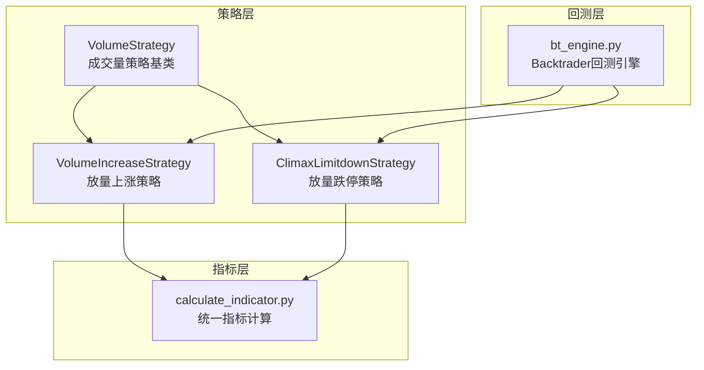
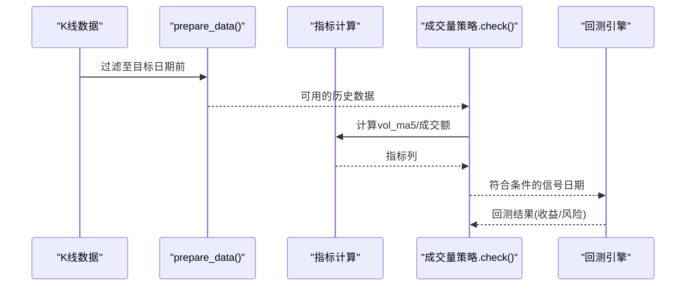
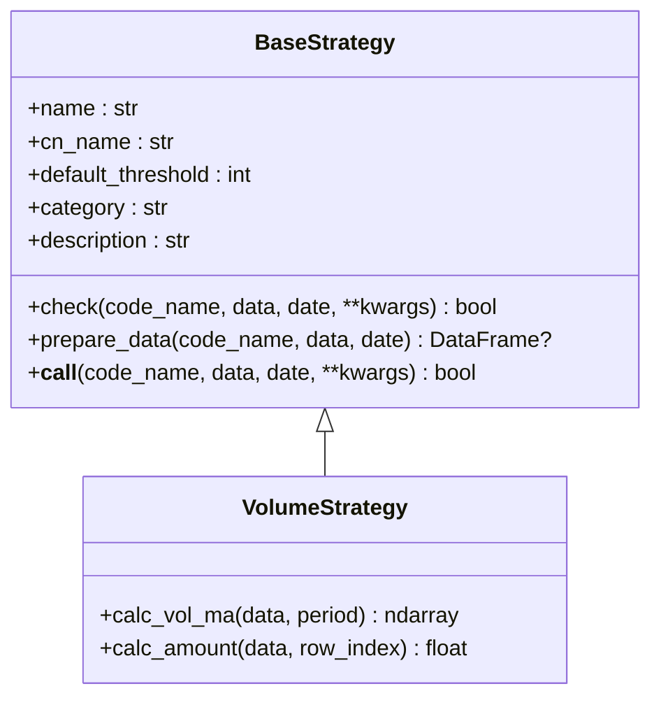
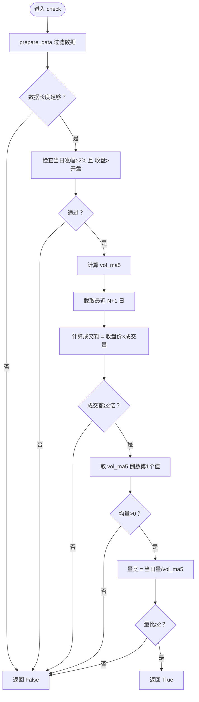
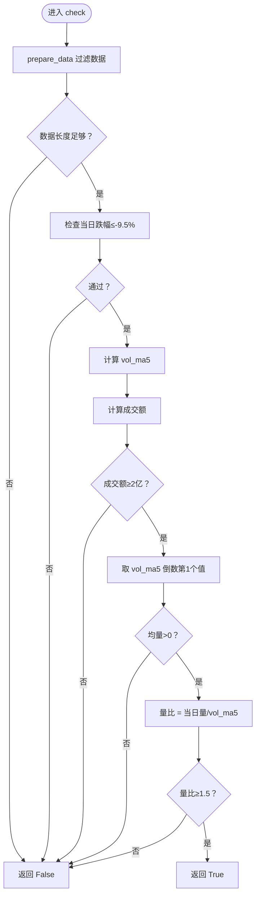
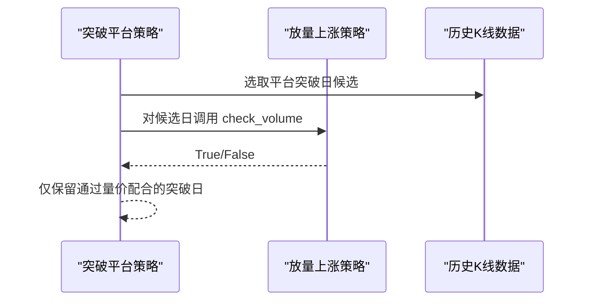
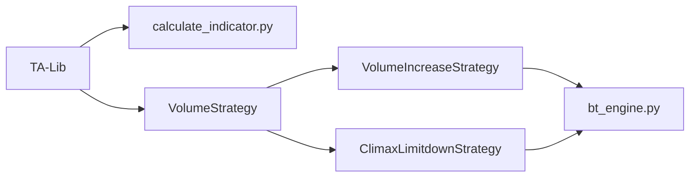

# 成交量策略开发

<cite>
**本文引用的文件**
- [quantia/core/strategy/volume/volume_strategies.py](file://quantia/core/strategy/volume/volume_strategies.py)
- [quantia/core/strategy/base.py](file://quantia/core/strategy/base.py)
- [quantia/core/indicator/calculate_indicator.py](file://quantia/core/indicator/calculate_indicator.py)
- [quantia/core/strategy/README.md](file://quantia/core/strategy/README.md)
- [quantia/core/backtest/bt_engine.py](file://quantia/core/backtest/bt_engine.py)
- [quantia/core/strategy/enter.py](file://quantia/core/strategy/enter.py)
- [quantia/core/strategy/climax_limitdown.py](file://quantia/core/strategy/climax_limitdown.py)
- [quantia/core/strategy/pattern/pattern_strategies.py](file://quantia/core/strategy/pattern/pattern_strategies.py)
- [quantia/core/strategy/breakthrough_platform.py](file://quantia/core/strategy/breakthrough_platform.py)
</cite>

## 目录
1. [引言](#引言)
2. [项目结构](#项目结构)
3. [核心组件](#核心组件)
4. [架构总览](#架构总览)
5. [详细组件分析](#详细组件分析)
6. [依赖分析](#依赖分析)
7. [性能考虑](#性能考虑)
8. [故障排查指南](#故障排查指南)
9. [结论](#结论)
10. [附录](#附录)

## 引言
本指南面向开发者，系统讲解如何在本项目中开发与落地“成交量”相关策略。内容涵盖成交量分析原理、成交量MA计算、成交额计算方法；详解放量突破、缩量回调、量价配合等策略开发要点；并提供参数设置、时间周期选择、过滤条件设计建议，以及实战案例、性能优化与风险控制方法，帮助你构建稳定高效的成交量分析策略。

## 项目结构
成交量策略位于策略子模块中，采用“策略基类 + 具体策略”的分层设计，便于扩展与复用。同时，指标计算模块提供统一的TA-Lib封装，保证策略在数据准备阶段的一致性与稳定性。

图表来源
- [quantia/core/strategy/volume/volume_strategies.py](file://quantia/core/strategy/volume/volume_strategies.py#L1-L126)
- [quantia/core/strategy/base.py](file://quantia/core/strategy/base.py#L126-L143)
- [quantia/core/indicator/calculate_indicator.py](file://quantia/core/indicator/calculate_indicator.py#L1-L449)
- [quantia/core/backtest/bt_engine.py](file://quantia/core/backtest/bt_engine.py#L1-L200)

章节来源
- [quantia/core/strategy/README.md](file://quantia/core/strategy/README.md#L1-L146)

## 核心组件
- 策略基类与注册机制
  - 策略基类提供统一的check接口、数据准备与阈值管理；注册装饰器将策略纳入全局注册表，便于统一调度与回测。
- 成交量策略基类
  - 提供成交量MA计算与成交额计算的通用方法，作为具体成交量策略的父类。
- 具体成交量策略
  - 放量上涨策略：以涨幅、成交额、量比为核心过滤条件。
  - 放量跌停策略：以跌停幅度、成交额、量比为核心过滤条件。
- 指标计算模块
  - 使用TA-Lib统一计算各类技术指标，包括成交量MA、MACD、KDJ、布林带等，为策略提供一致的数据基础。
- 回测引擎
  - 基于Backtrader，提供信号驱动的回测框架，支持参数扫描与收益风险评估。

章节来源
- [quantia/core/strategy/base.py](file://quantia/core/strategy/base.py#L20-L96)
- [quantia/core/strategy/base.py](file://quantia/core/strategy/base.py#L126-L143)
- [quantia/core/strategy/volume/volume_strategies.py](file://quantia/core/strategy/volume/volume_strategies.py#L19-L126)
- [quantia/core/indicator/calculate_indicator.py](file://quantia/core/indicator/calculate_indicator.py#L23-L404)
- [quantia/core/backtest/bt_engine.py](file://quantia/core/backtest/bt_engine.py#L101-L200)

## 架构总览
成交量策略的开发遵循“数据准备 → 指标计算 → 策略过滤 → 回测验证”的闭环流程。策略基类负责数据裁剪与阈值校验，指标模块提供统一的MA/比率/动量等计算，策略类聚焦业务规则，回测引擎完成实证评估。

图表来源
- [quantia/core/strategy/base.py](file://quantia/core/strategy/base.py#L64-L96)
- [quantia/core/strategy/volume/volume_strategies.py](file://quantia/core/strategy/volume/volume_strategies.py#L34-L68)
- [quantia/core/indicator/calculate_indicator.py](file://quantia/core/indicator/calculate_indicator.py#L390-L404)
- [quantia/core/backtest/bt_engine.py](file://quantia/core/backtest/bt_engine.py#L160-L200)

## 详细组件分析

### 成交量策略基类与通用方法
- 成交量MA计算
  - 通过统一的calc_vol_ma方法计算成交量的N日简单移动平均，用于衡量成交量趋势与当前放量强度。
- 成交额计算
  - 通过calc_amount方法按收盘价×成交量计算当日成交额，作为策略过滤的重要数值。
- 数据准备
  - prepare_data根据传入日期裁剪数据集，确保策略在指定窗口内进行判断。

图表来源
- [quantia/core/strategy/base.py](file://quantia/core/strategy/base.py#L20-L96)
- [quantia/core/strategy/base.py](file://quantia/core/strategy/base.py#L126-L143)

章节来源
- [quantia/core/strategy/base.py](file://quantia/core/strategy/base.py#L126-L143)

### 放量上涨策略（VolumeIncreaseStrategy）
- 核心逻辑
  - 当日涨幅≥2%且收涨；当日成交额≥2亿元；当日成交量/5日均量≥2。
- 关键步骤
  - 使用prepare_data裁剪至目标日期前，确保阈值有效；
  - 计算vol_ma5并取最后N个窗口的均值；
  - 计算成交额并做门槛过滤；
  - 计算量比并做阈值判断。

图表来源
- [quantia/core/strategy/volume/volume_strategies.py](file://quantia/core/strategy/volume/volume_strategies.py#L34-L68)

章节来源
- [quantia/core/strategy/volume/volume_strategies.py](file://quantia/core/strategy/volume/volume_strategies.py#L19-L68)

### 放量跌停策略（ClimaxLimitdownStrategy）
- 核心逻辑
  - 当日跌幅≈-10%（阈值-9.5%）；当日成交额≥2亿元；当日成交量/5日均量≥1.5。
- 关键步骤
  - 使用prepare_data裁剪；
  - 计算vol_ma5；
  - 成交额门槛过滤；
  - 量比门槛过滤。

图表来源
- [quantia/core/strategy/volume/volume_strategies.py](file://quantia/core/strategy/volume/volume_strategies.py#L85-L112)

章节来源
- [quantia/core/strategy/volume/volume_strategies.py](file://quantia/core/strategy/volume/volume_strategies.py#L71-L112)

### 与形态/突破策略的组合应用
- 突破平台策略中，利用放量上涨策略对“平台突破日”进行二次过滤，提升突破有效性。
- 停机坪策略中，同样可引入放量上涨策略对突破节点进行量价配合验证。

图表来源
- [quantia/core/strategy/breakthrough_platform.py](file://quantia/core/strategy/breakthrough_platform.py#L17-L43)
- [quantia/core/strategy/pattern/pattern_strategies.py](file://quantia/core/strategy/pattern/pattern_strategies.py#L49-L77)
- [quantia/core/strategy/enter.py](file://quantia/core/strategy/enter.py#L16-L60)

章节来源
- [quantia/core/strategy/breakthrough_platform.py](file://quantia/core/strategy/breakthrough_platform.py#L17-L43)
- [quantia/core/strategy/pattern/pattern_strategies.py](file://quantia/core/strategy/pattern/pattern_strategies.py#L49-L77)
- [quantia/core/strategy/enter.py](file://quantia/core/strategy/enter.py#L16-L60)

### 指标计算与成交量MA
- 指标模块提供统一的TA-Lib封装，包括成交量MA、MACD、KDJ、布林带、ATR、VR、OBV等。
- 成交量MA在策略中用于衡量放量强度，通常以5日MA为基准进行量比计算。

章节来源
- [quantia/core/indicator/calculate_indicator.py](file://quantia/core/indicator/calculate_indicator.py#L390-L404)
- [quantia/core/indicator/calculate_indicator.py](file://quantia/core/indicator/calculate_indicator.py#L43-L47)

### 回测与参数验证
- 回测引擎支持将策略信号日期转化为买卖订单，设定持有期与仓位比例，输出Sharpe、最大回撤、收益等指标。
- 建议在回测中对阈值（如量比、成交额门槛、MA周期）进行网格搜索，寻找稳健参数组合。

章节来源
- [quantia/core/backtest/bt_engine.py](file://quantia/core/backtest/bt_engine.py#L101-L200)

## 依赖分析
- 策略层依赖
  - VolumeStrategy依赖TA-Lib进行MA计算；依赖BaseStrategy的prepare_data与注册机制。
- 指标层依赖
  - 指标计算模块统一使用TA-Lib，减少策略内部重复实现，提高一致性与可维护性。
- 回测层依赖
  - 回测引擎依赖Backtrader，提供信号驱动的实证框架。

图表来源
- [quantia/core/strategy/volume/volume_strategies.py](file://quantia/core/strategy/volume/volume_strategies.py#L11-L13)
- [quantia/core/indicator/calculate_indicator.py](file://quantia/core/indicator/calculate_indicator.py#L7)
- [quantia/core/backtest/bt_engine.py](file://quantia/core/backtest/bt_engine.py#L16-L21)

## 性能考虑
- 数据预处理
  - 使用prepare_data在进入check前完成日期裁剪与长度校验，避免无效计算。
- 向量化计算
  - 成交量MA与成交额计算均基于numpy/talib向量化实现，减少循环开销。
- 指标缓存
  - 指标计算模块已统一生成常用指标列，策略可直接复用，避免重复计算。
- 回测效率
  - 回测引擎支持批量信号日期与参数扫描，建议在本地或容器化环境中并行执行，缩短验证周期。

章节来源
- [quantia/core/strategy/base.py](file://quantia/core/strategy/base.py#L64-L96)
- [quantia/core/indicator/calculate_indicator.py](file://quantia/core/indicator/calculate_indicator.py#L23-L404)
- [quantia/core/backtest/bt_engine.py](file://quantia/core/backtest/bt_engine.py#L160-L200)

## 故障排查指南
- 常见问题
  - 数据长度不足：当目标日期前数据少于阈值时，prepare_data返回None，策略直接返回False。可通过增大阈值或放宽日期限制解决。
  - 均量为0：若vol_ma5为0，策略直接返回False。可检查是否存在连续零成交量或数据缺失。
  - 成交额异常：当成交量为0时可能导致成交额NaN/Inf，需在指标计算阶段进行填充或清理。
- 定位方法
  - 在策略check前后打印关键字段（如p_change、volume、vol_ma5、amount），核对过滤条件。
  - 在指标计算模块中确认vol_5/vol_10等成交量MA列是否正常生成。
- 修复建议
  - 在指标计算中使用_fillna/_fill_nan_inf清理异常值，避免传播到策略层。
  - 对极端行情（如跌停/涨停）单独设置更宽松的阈值，降低误判概率。

章节来源
- [quantia/core/strategy/base.py](file://quantia/core/strategy/base.py#L64-L96)
- [quantia/core/indicator/calculate_indicator.py](file://quantia/core/indicator/calculate_indicator.py#L13-L21)
- [quantia/core/indicator/calculate_indicator.py](file://quantia/core/indicator/calculate_indicator.py#L390-L404)

## 结论
本项目提供了成熟的成交量策略开发框架：以VolumeStrategy为基类，结合统一的指标计算与回测引擎，能够快速实现并验证放量上涨、放量跌停等策略。通过合理的参数设置、时间周期选择与过滤条件设计，可显著提升策略的稳定性与胜率。建议在实际应用中结合形态/趋势策略进行多因子融合，并以回测与风控手段保障长期收益。

## 附录

### 参数设置与时间周期选择
- 量比阈值
  - 放量上涨：量比≥2；放量跌停：量比≥1.5（可根据市场风格调整）。
- 成交额门槛
  - 建议以2亿元为起点，结合板块/个股流动性动态调整。
- MA周期
  - 5日MA为默认基准；可在震荡市提高至10日，趋势明确时降低至3日。
- 时间阈值
  - 默认60日窗口适用于周线/月线级别策略；日线策略可按需调整至30/90日。

章节来源
- [quantia/core/strategy/volume/volume_strategies.py](file://quantia/core/strategy/volume/volume_strategies.py#L29-L32)
- [quantia/core/strategy/volume/volume_strategies.py](file://quantia/core/strategy/volume/volume_strategies.py#L80-L83)

### 过滤条件设计建议
- 量价配合
  - 上涨放量：涨幅≥2%且量比≥2；下跌放量：跌幅≈-10%且量比≥1.5。
- 成交额过滤
  - 成交额≥2亿，避免次新股/极冷门股的噪声干扰。
- 周期一致性
  - MA周期与策略观察窗口保持一致，避免跨周期漂移导致的误判。

章节来源
- [quantia/core/strategy/volume/volume_strategies.py](file://quantia/core/strategy/volume/volume_strategies.py#L24-L28)
- [quantia/core/strategy/volume/volume_strategies.py](file://quantia/core/strategy/volume/volume_strategies.py#L76-L79)

### 实战案例
- 案例1：平台突破+放量上涨
  - 步骤：识别平台突破日 → 用放量上涨策略过滤 → 组合形态策略（如停机坪） → 回测验证。
- 案例2：恐慌性抛售（放量跌停）捕捉
  - 步骤：筛选跌停日 → 量比≥1.5 → 成交额≥2亿 → 观察后续修复机会。

章节来源
- [quantia/core/strategy/breakthrough_platform.py](file://quantia/core/strategy/breakthrough_platform.py#L17-L43)
- [quantia/core/strategy/pattern/pattern_strategies.py](file://quantia/core/strategy/pattern/pattern_strategies.py#L49-L77)
- [quantia/core/strategy/climax_limitdown.py](file://quantia/core/strategy/climax_limitdown.py#L15-L59)

### 风险控制措施
- 动态阈值
  - 根据市场波动率调整量比与成交额门槛，避免在极端行情下过度交易。
- 止损止盈
  - 在回测中加入固定止损/移动止盈，控制单笔最大回撤。
- 分散与轮动
  - 多周期/多标的组合，避免集中度风险。

章节来源
- [quantia/core/backtest/bt_engine.py](file://quantia/core/backtest/bt_engine.py#L108-L127)
