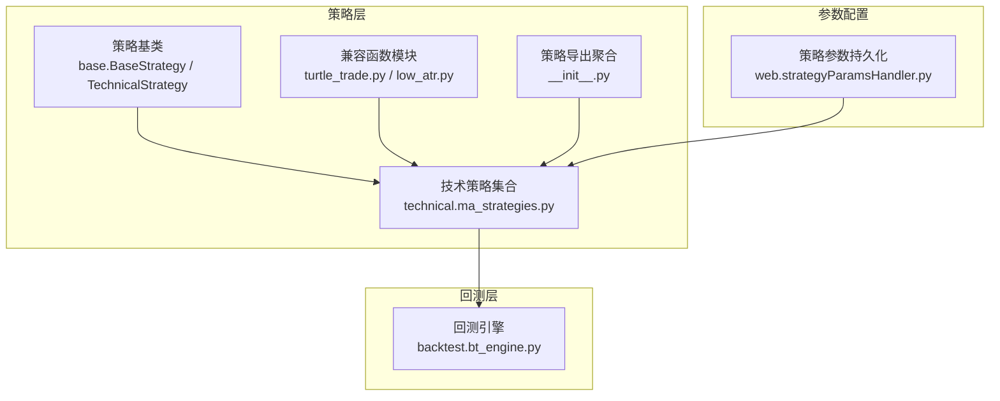
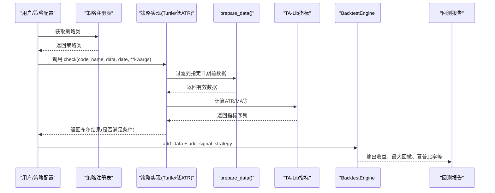
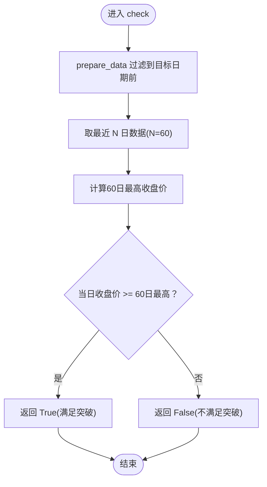
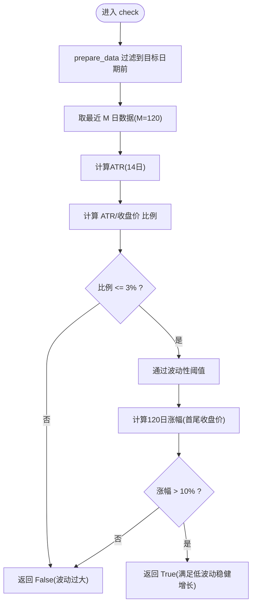
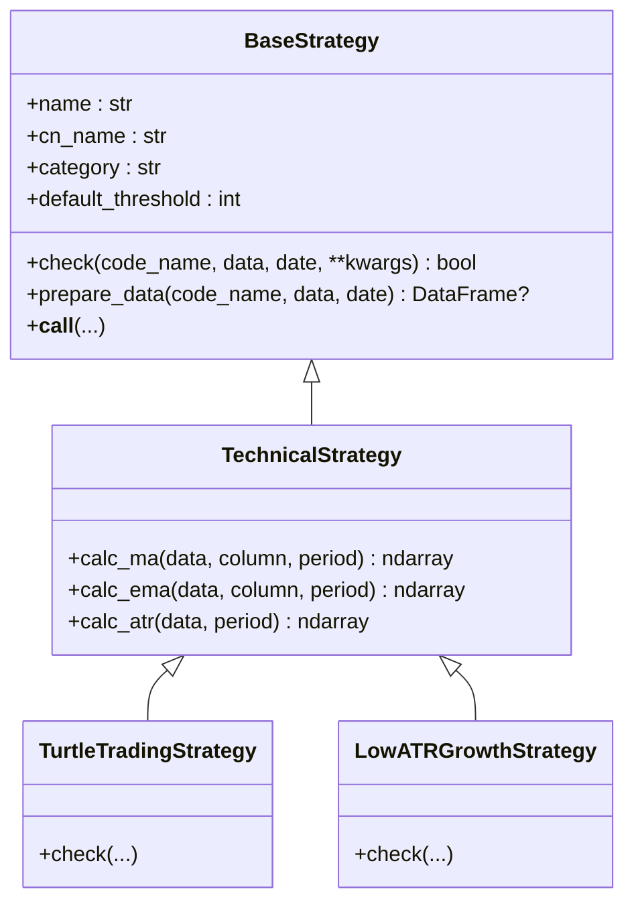
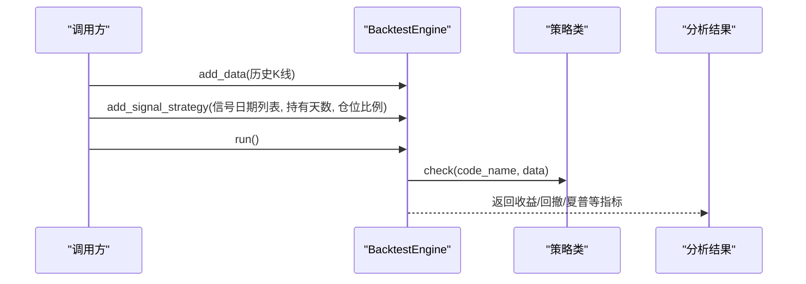
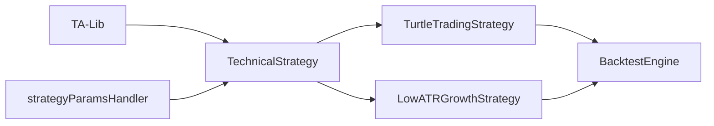

# 动量策略开发

<cite>
**本文引用的文件**   
- [quantia/core/strategy/technical/ma_strategies.py](file://quantia/core/strategy/technical/ma_strategies.py)
- [quantia/core/strategy/base.py](file://quantia/core/strategy/base.py)
- [quantia/core/strategy/turtle_trade.py](file://quantia/core/strategy/turtle_trade.py)
- [quantia/core/strategy/low_atr.py](file://quantia/core/strategy/low_atr.py)
- [quantia/core/strategy/__init__.py](file://quantia/core/strategy/__init__.py)
- [quantia/web/strategyParamsHandler.py](file://quantia/web/strategyParamsHandler.py)
- [quantia/core/backtest/bt_engine.py](file://quantia/core/backtest/bt_engine.py)
- [docker/stock/quantia/core/strategy/technical/ma_strategies.py](file://docker/stock/quantia/core/strategy/technical/ma_strategies.py)
- [docker/stock/quantia/core/strategy/low_atr.py](file://docker/stock/quantia/core/strategy/low_atr.py)
- [docker/stock/quantia/web/strategyParamsHandler.py](file://docker/stock/quantia/web/strategyParamsHandler.py)
- [docker/stock/quantia/core/backtest/bt_engine.py](file://docker/stock/quantia/core/backtest/bt_engine.py)
- [quantia/core/strategy/document/ChatGP选股策略文档.md](file://quantia/core/strategy/document/ChatGP选股策略文档.md)
</cite>

## 目录
1. [引言](#引言)
2. [项目结构](#项目结构)
3. [核心组件](#核心组件)
4. [架构总览](#架构总览)
5. [详细组件分析](#详细组件分析)
6. [依赖分析](#依赖分析)
7. [性能考虑](#性能考虑)
8. [故障排查指南](#故障排查指南)
9. [结论](#结论)
10. [附录](#附录)

## 引言
本指南围绕动量策略开发，系统讲解两类核心策略：海龟交易策略（Turtle Trading）与低ATR成长策略（Low ATR Growth）。内容涵盖：
- 突破交易理念与60日新高突破判断
- 趋势确认方法与入场时机选择
- 波动性控制原理与ATR指标计算
- 稳健增长识别与阈值设定
- 参数优化方法、风险控制机制与资金管理原则
- 策略组合使用最佳实践与实盘案例分析路径

## 项目结构
策略代码主要位于 quantia/core/strategy 及其子目录，回测引擎位于 quantia/core/backtest，策略参数配置通过 Web 层持久化。

图示来源
- [quantia/core/strategy/base.py](file://quantia/core/strategy/base.py#L20-L96)
- [quantia/core/strategy/technical/ma_strategies.py](file://quantia/core/strategy/technical/ma_strategies.py#L140-L212)
- [quantia/core/strategy/__init__.py](file://quantia/core/strategy/__init__.py#L30-L77)
- [quantia/core/backtest/bt_engine.py](file://quantia/core/backtest/bt_engine.py#L100-L214)
- [quantia/web/strategyParamsHandler.py](file://quantia/web/strategyParamsHandler.py#L448-L538)

章节来源
- [quantia/core/strategy/__init__.py](file://quantia/core/strategy/__init__.py#L11-L25)
- [quantia/core/strategy/base.py](file://quantia/core/strategy/base.py#L20-L96)
- [quantia/core/strategy/technical/ma_strategies.py](file://quantia/core/strategy/technical/ma_strategies.py#L140-L212)
- [quantia/core/backtest/bt_engine.py](file://quantia/core/backtest/bt_engine.py#L100-L214)
- [quantia/web/strategyParamsHandler.py](file://quantia/web/strategyParamsHandler.py#L448-L538)

## 核心组件
- 策略基类与注册机制：提供统一的 check 接口、数据准备、类别分类与注册表，便于扩展与组合。
- 技术策略实现：包含海龟交易策略与低ATR成长策略，均基于 TechnicalStrategy，使用 TA-Lib 计算指标。
- 兼容函数模块：提供旧接口兼容，便于历史代码迁移。
- 回测引擎：封装 Backtrader，支持按信号日期回测、分析收益、最大回撤与夏普比率等。
- 参数配置：Web 层提供策略参数的持久化与读取，支持默认值与用户自定义值合并。

章节来源
- [quantia/core/strategy/base.py](file://quantia/core/strategy/base.py#L20-L96)
- [quantia/core/strategy/technical/ma_strategies.py](file://quantia/core/strategy/technical/ma_strategies.py#L140-L212)
- [quantia/core/strategy/turtle_trade.py](file://quantia/core/strategy/turtle_trade.py#L14-L37)
- [quantia/core/strategy/low_atr.py](file://quantia/core/strategy/low_atr.py#L12-L63)
- [quantia/core/backtest/bt_engine.py](file://quantia/core/backtest/bt_engine.py#L100-L214)
- [quantia/web/strategyParamsHandler.py](file://quantia/web/strategyParamsHandler.py#L448-L538)

## 架构总览
策略开发与回测的整体流程如下：

图示来源
- [quantia/core/strategy/base.py](file://quantia/core/strategy/base.py#L64-L96)
- [quantia/core/strategy/technical/ma_strategies.py](file://quantia/core/strategy/technical/ma_strategies.py#L140-L212)
- [quantia/core/backtest/bt_engine.py](file://quantia/core/backtest/bt_engine.py#L100-L214)

## 详细组件分析

### 海龟交易策略（TurtleTradingStrategy）
- 突破交易理念
  - 以60日新高为关键信号，当日收盘价达到或超过过去60日最高收盘价即视为突破。
  - 该策略强调“趋势跟踪”，在突破确认后入场，避免逆势操作。
- 趋势确认与入场时机
  - 趋势确认：以60日窗口内的最高收盘价作为基准，突破即确认短期趋势向上。
  - 入场时机：突破当日或紧随其后的交易日作为入场窗口，结合成交量与后续走势确认。
- 实现要点
  - 使用策略基类的 prepare_data 进行日期过滤与阈值校验。
  - 直接比较最后交易日收盘价与60日最高收盘价，逻辑简洁高效。
- 参数与阈值
  - 默认阈值为60日窗口；可通过构造函数传入自定义阈值。
  - 与平台突破策略配合时，可叠加放量与均线偏离约束以提升胜率。

图示来源
- [quantia/core/strategy/technical/ma_strategies.py](file://quantia/core/strategy/technical/ma_strategies.py#L153-L166)
- [quantia/core/strategy/base.py](file://quantia/core/strategy/base.py#L64-L96)

章节来源
- [quantia/core/strategy/technical/ma_strategies.py](file://quantia/core/strategy/technical/ma_strategies.py#L140-L167)
- [quantia/core/strategy/base.py](file://quantia/core/strategy/base.py#L64-L96)
- [quantia/core/strategy/turtle_trade.py](file://quantia/core/strategy/turtle_trade.py#L14-L37)

### 低ATR成长策略（LowATRGrowthStrategy）
- 波动性控制原理
  - 使用ATR衡量波动性，ATR占价格比例越小，波动越小，越适合稳健增长。
  - 采用ATR/价格比例阈值（例如3%）与120日涨幅阈值（例如10%）双重约束。
- 稳健增长识别
  - 在低波动前提下，要求120日内股价稳步上涨，避免高波动带来的不确定性。
  - 通过指标计算与阈值比较，筛选出“低波动、稳增长”的标的。
- 实现要点
  - 使用 TA-Lib 计算ATR，再计算ATR/收盘价比例。
  - 与兼容函数 check_low_increase 保持接口一致性，便于历史代码复用。

图示来源
- [quantia/core/strategy/technical/ma_strategies.py](file://quantia/core/strategy/technical/ma_strategies.py#L183-L211)

章节来源
- [quantia/core/strategy/technical/ma_strategies.py](file://quantia/core/strategy/technical/ma_strategies.py#L170-L211)
- [quantia/core/strategy/low_atr.py](file://quantia/core/strategy/low_atr.py#L12-L63)

### 策略基类与注册机制
- 统一接口
  - 所有策略继承 BaseStrategy，实现 check 接口；支持日期过滤与阈值校验。
- 类别与扩展
  - TechnicalStrategy、VolumeStrategy、PatternStrategy 等提供不同指标族的便捷方法。
- 注册与发现
  - 通过装饰器 register_strategy 注册策略，get_strategy 与 STRATEGY_REGISTRY 提供动态发现。

图示来源
- [quantia/core/strategy/base.py](file://quantia/core/strategy/base.py#L20-L124)
- [quantia/core/strategy/technical/ma_strategies.py](file://quantia/core/strategy/technical/ma_strategies.py#L140-L212)

章节来源
- [quantia/core/strategy/base.py](file://quantia/core/strategy/base.py#L20-L124)
- [quantia/core/strategy/technical/ma_strategies.py](file://quantia/core/strategy/technical/ma_strategies.py#L140-L212)

### 回测引擎与参数配置
- 回测引擎
  - 支持添加数据源、信号策略、运行回测并提取收益、最大回撤、夏普比率等指标。
  - 通过 SignalStrategy 将策略信号转化为买卖订单，支持持有天数与仓位比例控制。
- 参数配置
  - Web 层提供策略参数表，支持默认值与用户自定义值合并，便于在线调整策略参数。

图示来源
- [quantia/core/backtest/bt_engine.py](file://quantia/core/backtest/bt_engine.py#L100-L214)
- [quantia/web/strategyParamsHandler.py](file://quantia/web/strategyParamsHandler.py#L448-L538)

章节来源
- [quantia/core/backtest/bt_engine.py](file://quantia/core/backtest/bt_engine.py#L100-L214)
- [quantia/web/strategyParamsHandler.py](file://quantia/web/strategyParamsHandler.py#L448-L538)

## 依赖分析
- 策略实现依赖
  - 技术策略依赖 TA-Lib 计算指标，依赖策略基类提供的 prepare_data 与类别方法。
  - 兼容函数模块提供旧接口，便于与既有业务代码衔接。
- 回测依赖
  - 回测引擎依赖 Backtrader；若未安装会抛出 ImportError，提示安装方式。
- 参数持久化
  - Web 层通过数据库表存储策略参数，提供加载、保存与删除接口。

图示来源
- [quantia/core/strategy/technical/ma_strategies.py](file://quantia/core/strategy/technical/ma_strategies.py#L140-L212)
- [quantia/core/backtest/bt_engine.py](file://quantia/core/backtest/bt_engine.py#L118-L120)
- [quantia/web/strategyParamsHandler.py](file://quantia/web/strategyParamsHandler.py#L448-L538)

章节来源
- [quantia/core/strategy/technical/ma_strategies.py](file://quantia/core/strategy/technical/ma_strategies.py#L140-L212)
- [quantia/core/backtest/bt_engine.py](file://quantia/core/backtest/bt_engine.py#L118-L120)
- [quantia/web/strategyParamsHandler.py](file://quantia/web/strategyParamsHandler.py#L448-L538)

## 性能考虑
- 计算复杂度
  - 突破判断与ATR计算均为O(N)线性扫描，适合大规模回测场景。
  - 建议在数据预处理阶段完成必要的指标缓存，减少重复计算。
- 内存与IO
  - 回测阶段建议分批加载数据，避免一次性载入过多历史数据导致内存压力。
- 并发与批处理
  - 策略注册表与回测引擎支持批量处理多个标的，可结合多进程/多线程提升吞吐。

## 故障排查指南
- 缺少 Backtrader
  - 现象：初始化回测引擎时报错，提示未安装。
  - 处理：根据报错信息安装 Backtrader。
- 参数表缺失
  - 现象：策略参数无法加载或保存。
  - 处理：调用参数持久化模块的建表逻辑，确保表存在后再进行读写。
- 数据不足
  - 现象：策略返回 False 或回测无信号。
  - 处理：检查 prepare_data 过滤后的数据长度是否满足阈值；必要时调整阈值或日期范围。

章节来源
- [quantia/core/backtest/bt_engine.py](file://quantia/core/backtest/bt_engine.py#L118-L120)
- [quantia/web/strategyParamsHandler.py](file://quantia/web/strategyParamsHandler.py#L450-L468)

## 结论
- 海龟交易策略以60日新高突破为核心信号，适合趋势跟踪；低ATR成长策略以低波动稳健增长为目标，适合稳健型资金配置。
- 通过策略基类与注册机制，可快速扩展与组合策略；回测引擎与参数配置为策略迭代提供了闭环支持。
- 建议在实盘中结合风控与资金管理原则，控制单票与组合层面的风险暴露，持续优化参数并监控回撤与收益稳定性。

## 附录

### 参数优化方法
- 空间搜索与网格搜索
  - 对阈值（如窗口大小）、ATR比例阈值、持有天数等进行网格搜索，结合回测指标（如年化收益、最大回撤、夏普比率）选择最优组合。
- 在线参数调整
  - 通过 Web 层策略参数配置，保存用户自定义值并与默认值合并，便于快速试错与回归。

章节来源
- [quantia/web/strategyParamsHandler.py](file://quantia/web/strategyParamsHandler.py#L448-L538)

### 风险控制与资金管理
- 卖出策略
  - 技术性减仓：RSI超买、触及布林上轨放量滞涨等。
  - 趋势破坏卖出：周线跌破MA60并确认非假跌破、下跌放量。
  - 基本面卖出：财务质量恶化、核心竞争力下降、行业逻辑被证伪。
- 仓位管理
  - 单只股票最大仓位、核心股票最大仓位、行业集中度上限。
  - 分批买入模型：首次买入、二次加仓、三次加仓与预留机动仓位。
- 系统级风控
  - 组合最大回撤阈值触发停仓或降仓。
  - 黑天鹅保护：单日/两日跌幅触发临时冻结或强制减仓。

章节来源
- [quantia/core/strategy/document/ChatGP选股策略文档.md](file://quantia/core/strategy/document/ChatGP选股策略文档.md#L222-L289)

### 策略组合使用最佳实践
- 组合思路
  - 将海龟交易策略用于趋势确认与入场时机选择，低ATR成长策略用于稳健增长标的筛选。
  - 可叠加成交量确认与均线偏离约束，提高信号质量。
- 实战案例分析路径
  - 使用回测引擎对策略组合进行回测，对比单一策略与组合策略的收益与风险指标。
  - 通过参数配置页面调整关键参数，观察组合在不同市场环境下的表现。

章节来源
- [quantia/core/backtest/bt_engine.py](file://quantia/core/backtest/bt_engine.py#L216-L306)
- [quantia/core/strategy/technical/ma_strategies.py](file://quantia/core/strategy/technical/ma_strategies.py#L140-L212)
