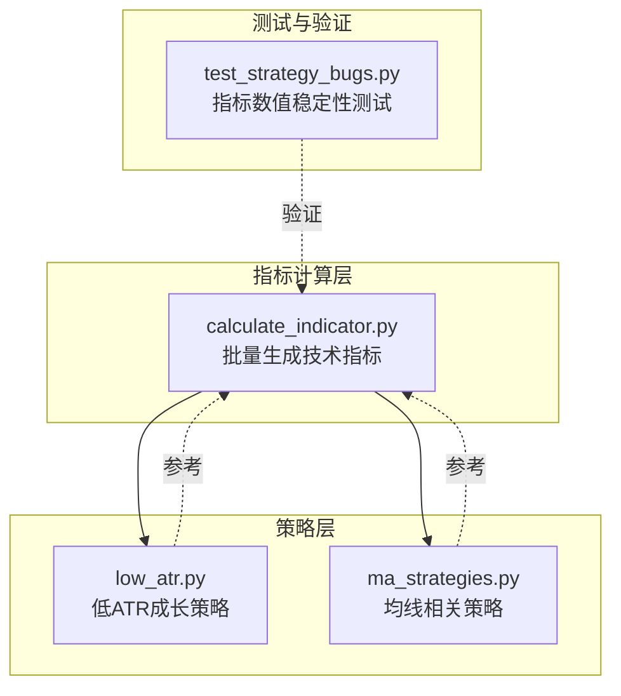
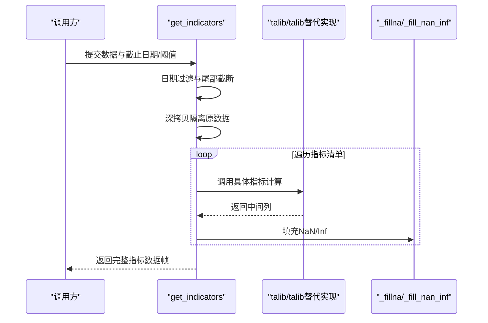
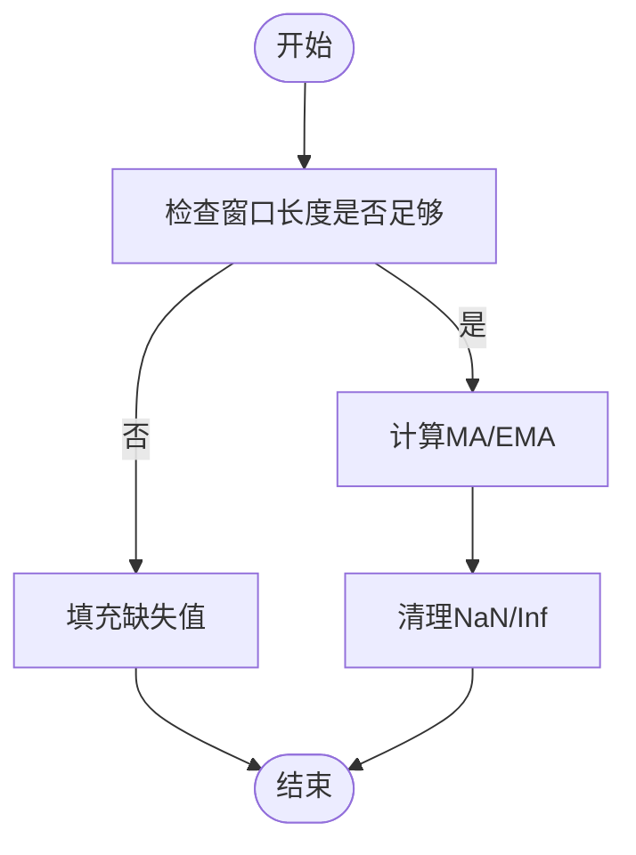
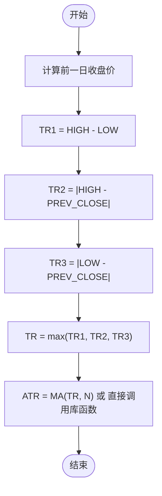
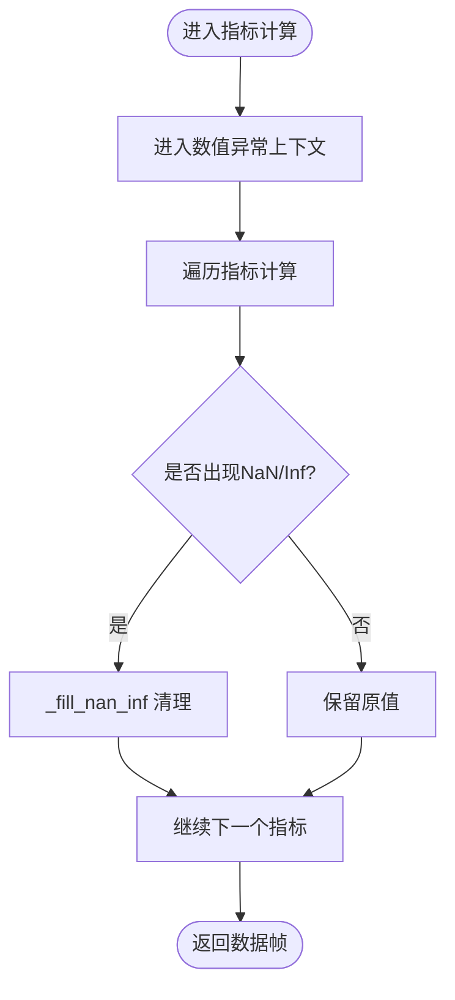
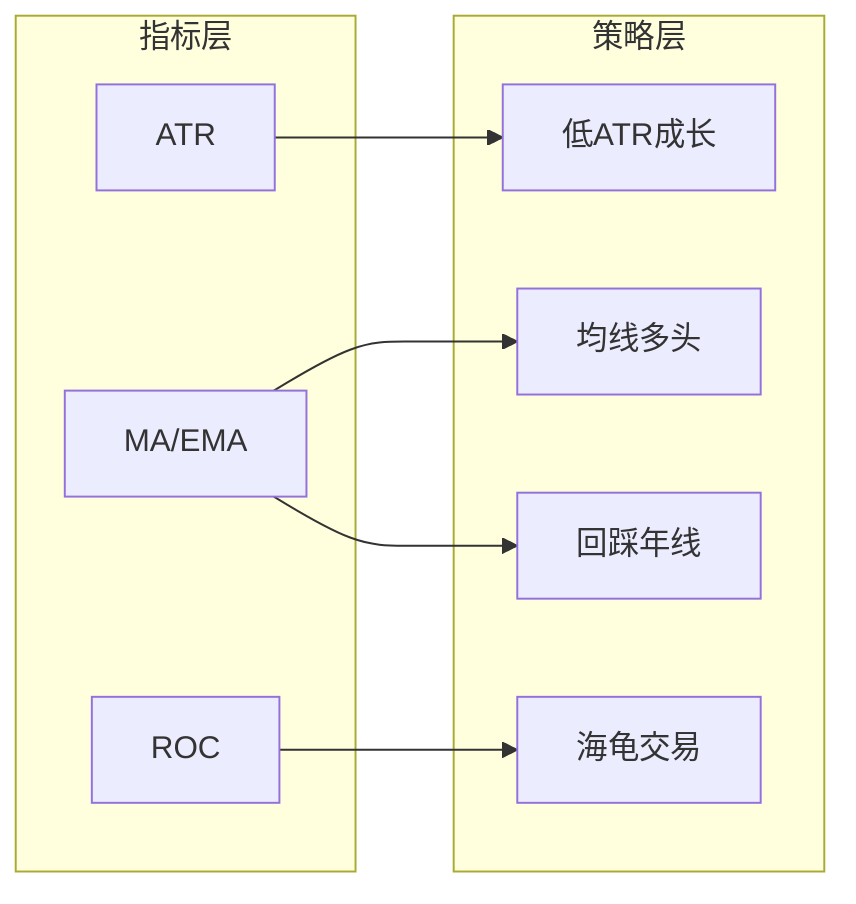
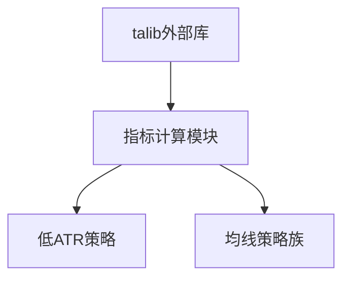

# 技术指标计算方法

<cite>
**本文引用的文件**
- [calculate_indicator.py](file://quantia/core/indicator/calculate_indicator.py)
- [calculate_indicator.py（Docker 版本）](file://docker/stock/quantia/core/indicator/calculate_indicator.py)
- [low_atr.py](file://quantia/core/strategy/low_atr.py)
- [low_atr.py（Docker 版本）](file://docker/stock/quantia/core/strategy/low_atr.py)
- [ma_strategies.py](file://docker/stock/quantia/core/strategy/technical/ma_strategies.py)
- [test_strategy_bugs.py](file://tests/test_strategy_bugs.py)
</cite>

## 目录
1. [简介](#简介)
2. [项目结构](#项目结构)
3. [核心组件](#核心组件)
4. [架构总览](#架构总览)
5. [详细组件分析](#详细组件分析)
6. [依赖分析](#依赖分析)
7. [性能考虑](#性能考虑)
8. [故障排查指南](#故障排查指南)
9. [结论](#结论)
10. [附录](#附录)

## 简介
本指南围绕技术指标计算方法展开，重点覆盖移动平均线（MA/EMA）与平均真实波幅（ATR）两类核心指标的数学原理、实现细节、数值稳定性与边界处理，并结合仓库中的策略实践，给出性能优化建议与指标组合使用范式。读者可据此理解代码实现、掌握工程化指标计算的最佳实践。

## 项目结构
本项目在“指标计算”与“策略应用”两个层面提供了完整的实现：
- 指标计算层：集中于指标计算模块，负责批量生成各类技术指标列。
- 策略层：基于指标进行选股或入场/出场判断，体现指标组合使用方式。

图表来源
- [calculate_indicator.py](file://quantia/core/indicator/calculate_indicator.py#L23-L407)
- [low_atr.py](file://quantia/core/strategy/low_atr.py#L12-L63)
- [ma_strategies.py](file://docker/stock/quantia/core/strategy/technical/ma_strategies.py#L170-L211)
- [test_strategy_bugs.py](file://tests/test_strategy_bugs.py#L254-L277)

章节来源
- [calculate_indicator.py](file://quantia/core/indicator/calculate_indicator.py#L23-L407)
- [calculate_indicator.py（Docker 版本）](file://docker/stock/quantia/core/indicator/calculate_indicator.py#L23-L407)

## 核心组件
- 指标计算主流程：统一入口函数负责按日期窗口裁剪、阈值截断、深拷贝隔离、逐项计算与数值清理。
- 数值清理工具：提供填充 NaN 的通用方法与同时处理 NaN/Inf 的专用方法，确保后续计算稳定。
- 移动平均与指数平滑：通过外部库完成 MA/EMA 计算；部分策略自定义实现以满足特定需求。
- ATR 计算：提供两种路径——直接使用外部库与手工实现 TR/ATR 的步骤。

章节来源
- [calculate_indicator.py](file://quantia/core/indicator/calculate_indicator.py#L13-L21)
- [calculate_indicator.py](file://quantia/core/indicator/calculate_indicator.py#L111-L121)

## 架构总览
指标计算采用“流水线式”设计：输入历史 K 线数据，按需裁剪时间窗与样本数，随后依次生成各指标列，最后返回带完整指标集的数据帧。

图表来源
- [calculate_indicator.py](file://quantia/core/indicator/calculate_indicator.py#L23-L407)
- [calculate_indicator.py（Docker 版本）](file://docker/stock/quantia/core/indicator/calculate_indicator.py#L23-L407)

## 详细组件分析

### 移动平均线（MA/EMA）
- 实现方式
  - 外部库调用：多数指标通过外部库完成 MA/EMA 计算，保证数值稳定与性能。
  - 自定义实现：策略层提供独立的 MA/EMA 计算函数，便于在特定场景复用。
- 数学要点
  - 简单移动平均（SMA）：对固定窗口内观测值求算术平均。
  - 指数移动平均（EMA）：以平滑因子对近期观测赋予更高权重，常用于趋势跟踪。
- 边界与数值稳定性
  - 使用专用填充函数处理 NaN/Inf，避免传播到后续计算。
  - 对于长度不足的窗口，保持输出为缺失值，避免错误信号。

图表来源
- [calculate_indicator.py](file://quantia/core/indicator/calculate_indicator.py#L13-L21)
- [calculate_indicator.py](file://quantia/core/indicator/calculate_indicator.py#L396-L400)

章节来源
- [calculate_indicator.py](file://quantia/core/indicator/calculate_indicator.py#L396-L400)
- [calculate_indicator.py（Docker 版本）](file://docker/stock/quantia/core/indicator/calculate_indicator.py#L396-L400)

### 平均真实波幅（ATR）
- 定义与用途
  - ATR 衡量市场波动程度，常用于止损设置、资金管理与趋势强度判断。
- 计算步骤
  - 计算三元素的最大值：当日最高与最低之差、当日最高与前收之差的绝对值、当日最低与前收之差的绝对值。
  - 取上述三者的逐日最大值作为真实波幅（TR）。
  - 对 TR 序列取固定窗口的平均值，得到平均真实波幅（ATR）。
- 代码实现
  - 仓库中同时提供了两种实现路径：
    - 使用外部库直接计算 ATR。
    - 手工分步实现 TR 与 ATR，便于理解与扩展。

图表来源
- [calculate_indicator.py](file://quantia/core/indicator/calculate_indicator.py#L111-L121)
- [calculate_indicator.py（Docker 版本）](file://docker/stock/quantia/core/indicator/calculate_indicator.py#L111-L121)

章节来源
- [calculate_indicator.py](file://quantia/core/indicator/calculate_indicator.py#L111-L121)
- [calculate_indicator.py（Docker 版本）](file://docker/stock/quantia/core/indicator/calculate_indicator.py#L111-L121)

### 数值稳定性与边界处理
- 统一的填充策略
  - NaN 填充：将缺失值替换为 0.0，避免传播至后续计算。
  - NaN/Inf 同清：对可能出现除零或溢出导致的无穷大/负无穷大，先替换为 NaN 再填充为 0.0。
- 异常处理
  - 使用上下文管理器抑制除零/无效运算警告，避免噪声干扰。
  - 外层 try-except 捕获异常并记录日志，保证流程可控。

图表来源
- [calculate_indicator.py](file://quantia/core/indicator/calculate_indicator.py#L40-L47)
- [calculate_indicator.py](file://quantia/core/indicator/calculate_indicator.py#L13-L21)

章节来源
- [calculate_indicator.py](file://quantia/core/indicator/calculate_indicator.py#L40-L47)
- [calculate_indicator.py](file://quantia/core/indicator/calculate_indicator.py#L13-L21)

### 指标组合与策略应用
- 低ATR成长策略
  - 基于手工实现的 ATR 计算（区间内涨跌幅绝对值总和/天数），结合区间最高价与最低价比率，筛选低波动稳健上涨标的。
- 均线策略族
  - 均线多头：要求短期均线在一段时间内持续上行且幅度达标。
  - 回踩年线：突破年线后回踩不破且缩量整理。
  - 海龟交易法则：突破近期新高即视为买入信号。
- 策略与指标的关系
  - 策略层通常依赖指标层提供的基础指标（如 MA、ATR、ROC 等），并在其基础上构建复合信号。

图表来源
- [low_atr.py](file://quantia/core/strategy/low_atr.py#L12-L63)
- [ma_strategies.py](file://docker/stock/quantia/core/strategy/technical/ma_strategies.py#L22-L55)
- [ma_strategies.py](file://docker/stock/quantia/core/strategy/technical/ma_strategies.py#L58-L137)
- [ma_strategies.py](file://docker/stock/quantia/core/strategy/technical/ma_strategies.py#L140-L166)

章节来源
- [low_atr.py](file://quantia/core/strategy/low_atr.py#L12-L63)
- [ma_strategies.py](file://docker/stock/quantia/core/strategy/technical/ma_strategies.py#L22-L55)
- [ma_strategies.py](file://docker/stock/quantia/core/strategy/technical/ma_strategies.py#L58-L137)
- [ma_strategies.py](file://docker/stock/quantia/core/strategy/technical/ma_strategies.py#L140-L166)

## 依赖分析
- 外部库依赖
  - 使用外部库进行高效、稳定的指标计算（如 MACD、STOCH、BBANDS、RSI、ATR 等）。
- 内部依赖
  - 指标计算模块被策略模块广泛依赖；策略模块之间相互独立，通过共同的指标数据进行决策。

图表来源
- [calculate_indicator.py](file://quantia/core/indicator/calculate_indicator.py#L43-L44)
- [calculate_indicator.py（Docker 版本）](file://docker/stock/quantia/core/indicator/calculate_indicator.py#L43-L44)

章节来源
- [calculate_indicator.py](file://quantia/core/indicator/calculate_indicator.py#L43-L44)
- [calculate_indicator.py（Docker 版本）](file://docker/stock/quantia/core/indicator/calculate_indicator.py#L43-L44)

## 性能考虑
- 向量化优先：尽量使用向量化操作与外部库，避免显式循环。
- 内存与拷贝：在关键路径使用深拷贝隔离原数据，防止副作用；必要时及时复制以释放中间态内存。
- 窗口截断：通过截止日期与阈值参数限制计算范围，减少无效样本。
- 数值异常抑制：在涉及除法与对数等潜在异常的计算中，使用上下文管理器抑制警告，提升吞吐。

章节来源
- [calculate_indicator.py](file://quantia/core/indicator/calculate_indicator.py#L23-L34)
- [calculate_indicator.py](file://quantia/core/indicator/calculate_indicator.py#L28-L29)
- [calculate_indicator.py](file://quantia/core/indicator/calculate_indicator.py#L40-L47)

## 故障排查指南
- NaN/Inf 异常
  - 现象：部分指标列出现 NaN/Inf 导致后续计算异常或可视化失败。
  - 处理：使用专用清理函数替换无穷大/负无穷大为 NaN，再填充为 0.0。
  - 验证：单元测试覆盖了关键指标（如 EMV、VHF、m_price）的清理逻辑，确保不会遗漏。
- 边界条件
  - 现象：样本不足或窗口过短导致指标为空。
  - 处理：在策略层与指标层均进行长度校验，不足时返回空或默认值。
- 日志与异常
  - 现象：计算过程中抛出异常。
  - 处理：外层捕获异常并记录日志，便于定位问题。

章节来源
- [calculate_indicator.py](file://quantia/core/indicator/calculate_indicator.py#L13-L21)
- [calculate_indicator.py](file://quantia/core/indicator/calculate_indicator.py#L405-L407)
- [test_strategy_bugs.py](file://tests/test_strategy_bugs.py#L254-L277)

## 结论
本指南系统梳理了移动平均线与 ATR 的数学原理与工程实现，总结了数值稳定性、边界处理与性能优化的关键实践，并结合策略层展示了指标组合的落地方式。建议在实际项目中：
- 优先使用外部库进行核心指标计算；
- 在关键路径统一使用 NaN/Inf 清理策略；
- 严格控制样本窗口与阈值，兼顾性能与信号质量；
- 在策略层以指标为契约，构建可维护的组合信号体系。

## 附录
- 实际应用示例
  - 低ATR成长：以手工 ATR 与区间涨跌幅比率为核心信号，适合震荡市中的稳健成长股筛选。
  - 均线策略：以 MA 多头、回踩年线与海龟交易为代表，展示不同时间尺度与信号类型的组合思路。
- 相关实现位置
  - 指标计算：参见指标计算模块的主流程与具体指标实现。
  - 策略应用：参见低ATR成长与均线策略族的实现。

章节来源
- [low_atr.py](file://quantia/core/strategy/low_atr.py#L12-L63)
- [ma_strategies.py](file://docker/stock/quantia/core/strategy/technical/ma_strategies.py#L22-L55)
- [ma_strategies.py](file://docker/stock/quantia/core/strategy/technical/ma_strategies.py#L58-L137)
- [ma_strategies.py](file://docker/stock/quantia/core/strategy/technical/ma_strategies.py#L140-L166)
