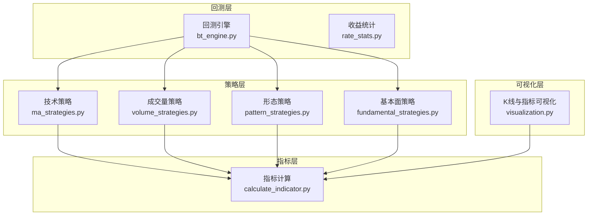
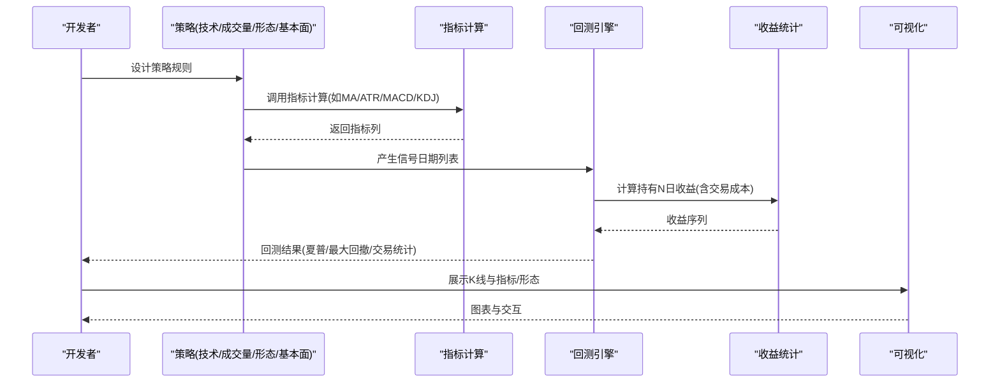
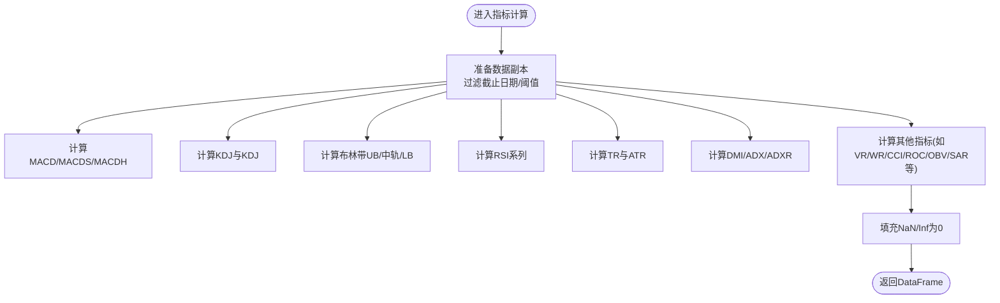
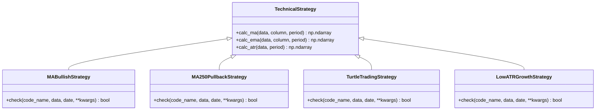
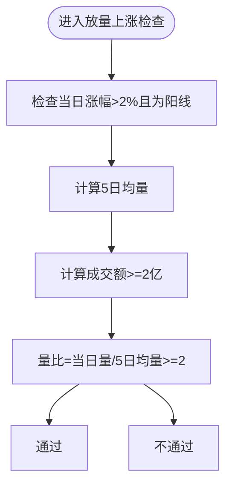
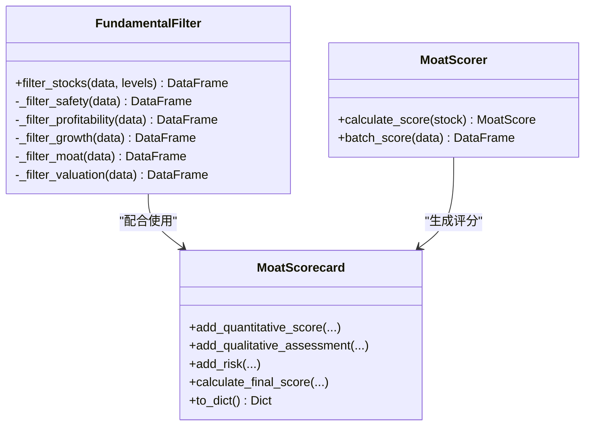
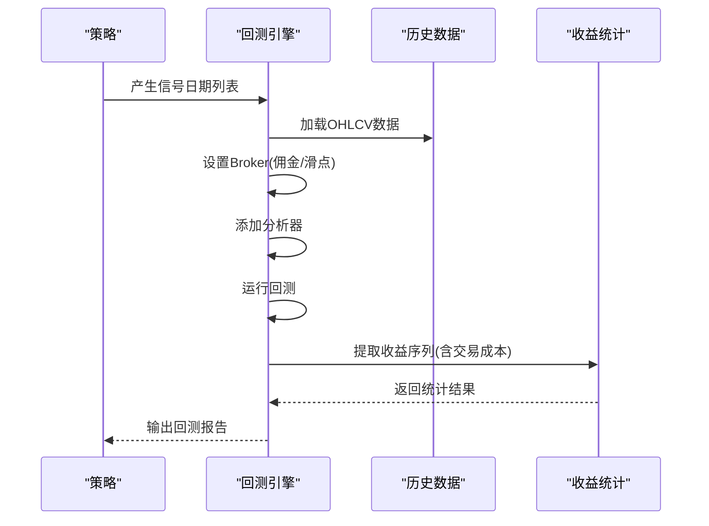
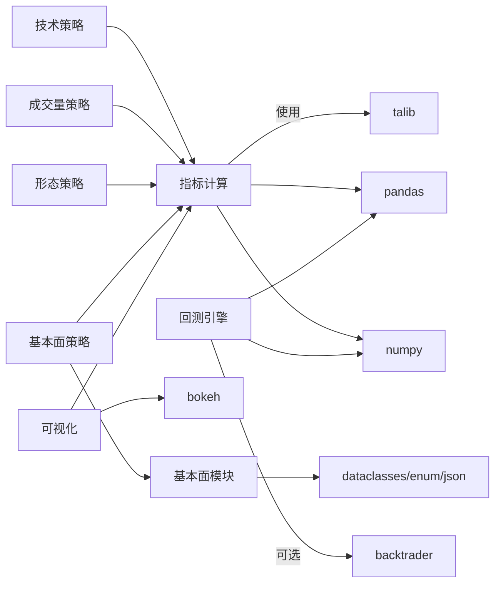

# 技术策略开发

<cite>
**本文引用的文件**
- [calculate_indicator.py](file://quantia/core/indicator/calculate_indicator.py)
- [ma_strategies.py](file://quantia/core/strategy/technical/ma_strategies.py)
- [bt_engine.py](file://quantia/core/backtest/bt_engine.py)
- [base.py](file://quantia/core/strategy/base.py)
- [visualization.py](file://quantia/core/kline/visualization.py)
- [rate_stats.py](file://quantia/core/backtest/rate_stats.py)
- [volume_strategies.py](file://quantia/core/strategy/volume/volume_strategies.py)
- [pattern_strategies.py](file://quantia/core/strategy/pattern/pattern_strategies.py)
- [fundamental_strategies.py](file://quantia/core/strategy/fundamental/fundamental_strategies.py)
- [moat_model.py](file://quantia/core/strategy/fundamental/moat_model.py)
- [fundamental_filter.py](file://quantia/core/strategy/fundamental/fundamental_filter.py)
</cite>

## 目录
1. [简介](#简介)
2. [项目结构](#项目结构)
3. [核心组件](#核心组件)
4. [架构总览](#架构总览)
5. [详细组件分析](#详细组件分析)
6. [依赖分析](#依赖分析)
7. [性能考虑](#性能考虑)
8. [故障排查指南](#故障排查指南)
9. [结论](#结论)
10. [附录](#附录)

## 简介
本指南面向技术策略开发者，系统讲解如何在本项目中开发稳定高效的量化策略。内容覆盖：
- 技术指标计算方法与实现细节（移动平均线、ATR、MACD、KDJ、DMI、布林带等）
- 策略开发流程、指标选择原则、参数优化方法
- 均线策略、MACD策略、KDJ策略等具体实现示例
- 性能优化技巧、数据预处理方法、回测验证策略

目标是帮助开发者从零开始构建可回测、可部署、可扩展的技术分析策略。

## 项目结构
项目采用“策略分类 + 指标计算 + 回测引擎 + 可视化”的分层组织方式：
- 核心指标计算：统一在指标模块中完成，保证一致性与可维护性
- 策略体系：按技术、成交量、形态、基本面划分，统一基类与注册机制
- 回测引擎：封装Backtrader，提供信号驱动的回测与分析
- 可视化：K线图叠加指标、形态标注、筹码分布等

图表来源
- [ma_strategies.py](file://quantia/core/strategy/technical/ma_strategies.py#L1-L237)
- [volume_strategies.py](file://quantia/core/strategy/volume/volume_strategies.py#L1-L126)
- [pattern_strategies.py](file://quantia/core/strategy/pattern/pattern_strategies.py#L1-L276)
- [fundamental_strategies.py](file://quantia/core/strategy/fundamental/fundamental_strategies.py#L1-L351)
- [calculate_indicator.py](file://quantia/core/indicator/calculate_indicator.py#L1-L449)
- [bt_engine.py](file://quantia/core/backtest/bt_engine.py#L1-L388)
- [rate_stats.py](file://quantia/core/backtest/rate_stats.py#L1-L108)
- [visualization.py](file://quantia/core/kline/visualization.py#L1-L275)

章节来源
- [ma_strategies.py](file://quantia/core/strategy/technical/ma_strategies.py#L1-L237)
- [calculate_indicator.py](file://quantia/core/indicator/calculate_indicator.py#L1-L449)
- [bt_engine.py](file://quantia/core/backtest/bt_engine.py#L1-L388)
- [visualization.py](file://quantia/core/kline/visualization.py#L1-L275)

## 核心组件
- 指标计算模块：提供统一的指标计算入口，内置多种技术指标（MA/EMA、ATR、MACD、KDJ、DMI、布林带、VR、WR、CCI、DMA、TEMA、MFI、VWMA、PPO、STOCHRSI、WT、Supertrend、ROC、OBV、SAR、PSY、BRAR、EMV、BIAS、DPO、VHF、RVI、FI、ENE、成交量均线等），并提供单条数据的指标提取接口。
- 策略基类与注册：提供统一的策略抽象、数据准备、阈值控制与注册机制；技术策略基类提供MA/EMA/ATR计算工具。
- 技术策略：包含均线多头、回踩年线、海龟交易、低ATR成长等策略。
- 成交量策略：包含放量上涨、放量跌停等策略。
- 形态策略：包含突破平台、停机坪、高而窄的旗形、无大幅回撤等策略。
- 基本面策略与评分：提供价值投资、成长投资、护城河、股息成长等策略，以及护城河评分卡与筛选器。
- 回测引擎：封装Backtrader，支持信号驱动回测、收益统计、分析器输出与绘图。
- 可视化：K线叠加均线、指标、形态标注、筹码分布等。

章节来源
- [calculate_indicator.py](file://quantia/core/indicator/calculate_indicator.py#L23-L407)
- [base.py](file://quantia/core/strategy/base.py#L1-L202)
- [ma_strategies.py](file://quantia/core/strategy/technical/ma_strategies.py#L22-L237)
- [volume_strategies.py](file://quantia/core/strategy/volume/volume_strategies.py#L19-L126)
- [pattern_strategies.py](file://quantia/core/strategy/pattern/pattern_strategies.py#L22-L276)
- [fundamental_strategies.py](file://quantia/core/strategy/fundamental/fundamental_strategies.py#L30-L351)
- [moat_model.py](file://quantia/core/strategy/fundamental/moat_model.py#L46-L479)
- [fundamental_filter.py](file://quantia/core/strategy/fundamental/fundamental_filter.py#L118-L698)
- [bt_engine.py](file://quantia/core/backtest/bt_engine.py#L101-L388)
- [rate_stats.py](file://quantia/core/backtest/rate_stats.py#L34-L107)
- [visualization.py](file://quantia/core/kline/visualization.py#L29-L275)

## 架构总览
策略开发遵循“指标计算—策略规则—回测验证—可视化呈现”的闭环流程。策略通过基类统一接入，指标通过集中模块计算，回测引擎以信号驱动方式运行，最终输出收益统计与分析报告。

图表来源
- [base.py](file://quantia/core/strategy/base.py#L99-L124)
- [calculate_indicator.py](file://quantia/core/indicator/calculate_indicator.py#L23-L407)
- [bt_engine.py](file://quantia/core/backtest/bt_engine.py#L101-L208)
- [rate_stats.py](file://quantia/core/backtest/rate_stats.py#L34-L107)
- [visualization.py](file://quantia/core/kline/visualization.py#L29-L275)

## 详细组件分析

### 指标计算模块（技术指标与移动平均线/ATR）
- 移动平均线（MA/EMA）：提供通用计算工具，策略中可直接调用。
- ATR：通过talib计算ATR，同时提供TR（真实波幅）计算与Supertrend扩展。
- MACD/KDJ：使用talib计算MACD与KDJ系列指标，并派生KDJ指标。
- 其他常用指标：布林带、RSI、VR、WR、CCI、DMA、TEMA、MFI、VWMA、PPO、STOCHRSI、WT、ROC、OBV、SAR、PSY、BRAR、EMV、BIAS、DPO、VHF、RVI、FI、ENE、成交量均线等。
- 数据清洗：提供填充NaN/Inf的工具函数，保证指标稳定性。

图表来源
- [calculate_indicator.py](file://quantia/core/indicator/calculate_indicator.py#L23-L407)

章节来源
- [calculate_indicator.py](file://quantia/core/indicator/calculate_indicator.py#L13-L407)
- [base.py](file://quantia/core/strategy/base.py#L104-L123)

### 技术策略：均线策略、海龟交易、低ATR成长
- 均线多头策略：要求MA30连续上升且涨幅超过阈值，体现趋势持续性。
- 回踩年线策略：突破250日均线后回踩不破，缩量整理，适合震荡转升。
- 海龟交易策略：突破60日新高，捕捉短期爆发。
- 低ATR成长策略：低波动（ATR/价格比例<3%）下的稳健上涨（120日涨幅>10%）。

图表来源
- [base.py](file://quantia/core/strategy/base.py#L99-L124)
- [ma_strategies.py](file://quantia/core/strategy/technical/ma_strategies.py#L22-L237)

章节来源
- [ma_strategies.py](file://quantia/core/strategy/technical/ma_strategies.py#L22-L237)
- [base.py](file://quantia/core/strategy/base.py#L99-L124)

### 成交量策略：放量上涨、放量跌停
- 放量上涨：当日涨幅>2%且阳线，成交额≥2亿，量比≥2。
- 放量跌停：当日接近跌停，成交量放大（量比≥1.5）。

图表来源
- [volume_strategies.py](file://quantia/core/strategy/volume/volume_strategies.py#L34-L68)

章节来源
- [volume_strategies.py](file://quantia/core/strategy/volume/volume_strategies.py#L19-L126)

### 形态策略：突破平台、停机坪、高而窄的旗形、无大幅回撤
- 突破平台：60日内某日收盘价≥60日均线>开盘价，且当日放量上涨，此前某段时间内收盘价与均线偏离在-5%~20%之间。
- 停机坪：涨停后横盘整理，连续2-3日高开高走且日内振幅≤3%，且每日涨跌幅≤5%。
- 高而窄的旗形：短期快速上涨后窄幅整理，具备机构参与迹象。
- 无大幅回撤：60日涨幅>60%，期间无单日跌幅>7%、高开低走>7%、两日累计跌幅>10%、两日高开低走累计>10%。

章节来源
- [pattern_strategies.py](file://quantia/core/strategy/pattern/pattern_strategies.py#L22-L276)

### 基本面策略与护城河评分
- 价值投资策略：ROE、毛利率、净利率、资产负债率、每股经营现金流、PE等指标筛选。
- 成长投资策略：营收/利润3年复合增长率、ROE、毛利率、资产负债率。
- 护城河策略：护城河评分卡（量化+定性），识别品牌、专利、规模、网络效应、转换成本、成本优势、牌照/准入、生态系统等类型。
- 股息成长策略：股息率、ROE、利润增长、资产负债率、现金流等。

图表来源
- [fundamental_filter.py](file://quantia/core/strategy/fundamental/fundamental_filter.py#L118-L298)
- [moat_model.py](file://quantia/core/strategy/fundamental/moat_model.py#L86-L270)

章节来源
- [fundamental_strategies.py](file://quantia/core/strategy/fundamental/fundamental_strategies.py#L30-L351)
- [moat_model.py](file://quantia/core/strategy/fundamental/moat_model.py#L46-L479)
- [fundamental_filter.py](file://quantia/core/strategy/fundamental/fundamental_filter.py#L118-L698)

### 回测引擎与收益统计
- 回测引擎：封装Backtrader，支持信号驱动策略、分析器（夏普比率、最大回撤、收益、交易统计）、绘图。
- 收益统计：修正为T+1开盘价买入、扣除交易成本（佣金+印花税+滑点），过滤涨停/跌停场景。

图表来源
- [bt_engine.py](file://quantia/core/backtest/bt_engine.py#L101-L208)
- [rate_stats.py](file://quantia/core/backtest/rate_stats.py#L34-L107)

章节来源
- [bt_engine.py](file://quantia/core/backtest/bt_engine.py#L101-L388)
- [rate_stats.py](file://quantia/core/backtest/rate_stats.py#L34-L107)

### 可视化：K线、指标、形态与筹码分布
- K线叠加均线、成交量均线、形态标注、指标页签（MACD、KDJ、布林带等）。
- 筹码分布：交互式筹码分布图层，支持悬停与点击回调。

章节来源
- [visualization.py](file://quantia/core/kline/visualization.py#L29-L275)

## 依赖分析
- 指标计算依赖：pandas/numpy/talib，提供统一的指标列与填充工具。
- 策略基类依赖：abc/typing，提供策略抽象、注册与数据准备。
- 回测引擎依赖：backtrader（可选），提供信号驱动策略与分析器。
- 可视化依赖：bokeh，提供交互式图表与组件渲染。
- 基本面模块依赖：dataclasses/enum/json，提供评分卡结构与序列化。

图表来源
- [calculate_indicator.py](file://quantia/core/indicator/calculate_indicator.py#L4-L7)
- [base.py](file://quantia/core/strategy/base.py#L9-L14)
- [bt_engine.py](file://quantia/core/backtest/bt_engine.py#L14-L21)
- [visualization.py](file://quantia/core/kline/visualization.py#L10-L23)
- [fundamental_filter.py](file://quantia/core/strategy/fundamental/fundamental_filter.py#L16-L24)
- [moat_model.py](file://quantia/core/strategy/fundamental/moat_model.py#L19-L24)

章节来源
- [calculate_indicator.py](file://quantia/core/indicator/calculate_indicator.py#L4-L7)
- [base.py](file://quantia/core/strategy/base.py#L9-L14)
- [bt_engine.py](file://quantia/core/backtest/bt_engine.py#L14-L21)
- [visualization.py](file://quantia/core/kline/visualization.py#L10-L23)
- [fundamental_filter.py](file://quantia/core/strategy/fundamental/fundamental_filter.py#L16-L24)
- [moat_model.py](file://quantia/core/strategy/fundamental/moat_model.py#L19-L24)

## 性能考虑
- 数据预处理
  - 使用深拷贝避免写入错误与pandas 2.x CoW模式问题。
  - 使用填充工具替换NaN/Inf，减少后续计算异常。
  - 通过截止日期与阈值裁剪数据，降低计算规模。
- 指标计算
  - 优先使用向量化计算（pandas/numpy/talib），避免逐行循环。
  - 对重复计算的中间变量（如TR、MA、EMA）缓存，减少重复计算。
- 策略实现
  - 在prepare_data中尽早过滤无效数据，缩短阈值检查路径。
  - 使用策略基类提供的calc_ma/ema/atr工具，统一实现与性能。
- 回测优化
  - 使用信号驱动回测，减少不必要的订单与状态更新。
  - 分批回测与并行化（策略组合）提升吞吐。
- 可视化
  - 仅在需要时加载指标与形态数据，避免全量渲染。
  - 使用Bokeh的ColumnDataSource与视图（CDSView）减少DOM压力。

[本节为通用指导，无需特定文件引用]

## 故障排查指南
- 指标计算异常
  - 现象：指标列出现NaN/Inf或异常值。
  - 处理：使用填充工具替换NaN/Inf；检查输入数据是否存在0成交量/停牌等情况。
- 回测失败
  - 现象：未安装Backtrader或回测未运行。
  - 处理：安装backtrader；确认数据索引与日期格式；检查信号日期与交易成本设置。
- 可视化异常
  - 现象：Bokeh图表空白或报错。
  - 处理：检查数据列名与类型；确认JavaScript回调文件存在；验证数据长度与阈值。
- 策略判定异常
  - 现象：策略返回False但预期为True。
  - 处理：核对阈值与时间窗口；检查prepare_data是否正确截断；确认指标列是否已计算。

章节来源
- [calculate_indicator.py](file://quantia/core/indicator/calculate_indicator.py#L13-L21)
- [bt_engine.py](file://quantia/core/backtest/bt_engine.py#L19-L21)
- [visualization.py](file://quantia/core/kline/visualization.py#L272-L274)
- [base.py](file://quantia/core/strategy/base.py#L64-L89)

## 结论
本项目提供了从指标计算到策略开发、回测验证与可视化的完整技术栈。开发者可基于统一的策略基类与指标模块，快速实现并验证技术策略。通过严格的参数优化、数据预处理与回测校验，可显著提升策略的稳定性与泛化能力。

[本节为总结，无需特定文件引用]

## 附录

### 技术策略开发流程与最佳实践
- 明确目标：确定策略目标（趋势跟踪、突破、震荡、价值等）与收益目标。
- 指标选择：优先选择与策略目标契合的指标，避免过度拟合；注意指标滞后性与噪声。
- 参数优化：网格搜索/贝叶斯优化结合样本内/样本外验证；关注最大回撤与胜率平衡。
- 数据预处理：处理缺失值、异常值、复权与除权；统一时间窗口与阈值。
- 回测验证：使用信号驱动回测，纳入交易成本与滑点；多时间尺度与多市场验证。
- 可视化：叠加指标与形态，便于人工校验与策略解释。

[本节为通用指导，无需特定文件引用]
