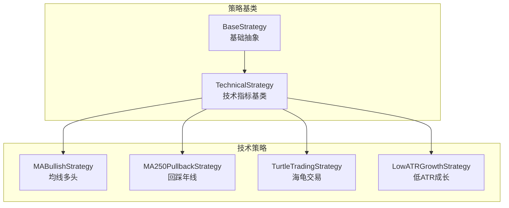
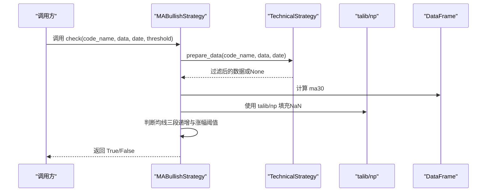
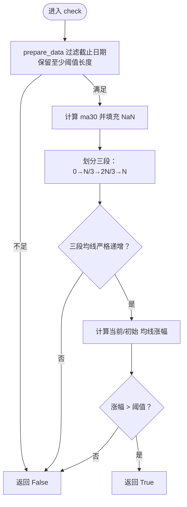
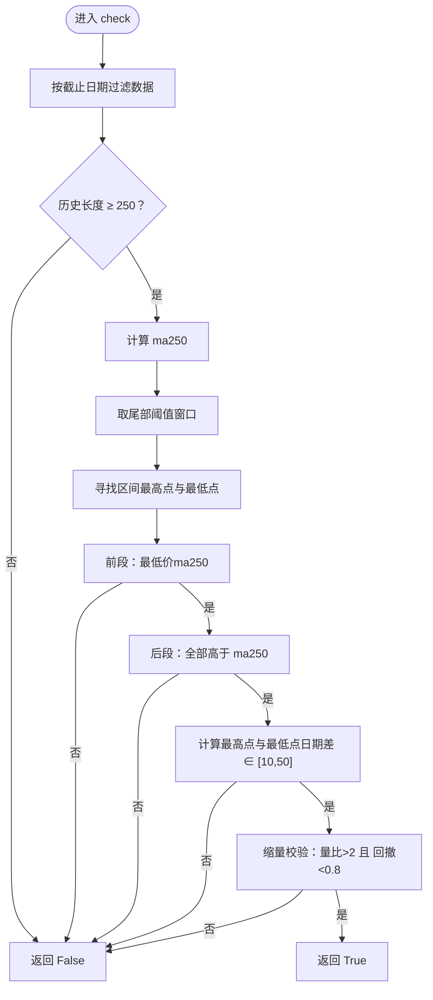
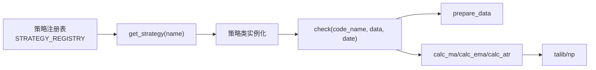

# 移动平均线策略

<cite>
**本文引用的文件**
- [ma_strategies.py](file://quantia/core/strategy/technical/ma_strategies.py)
- [base.py](file://quantia/core/strategy/base.py)
- [backtrace_ma250.py](file://quantia/core/strategy/backtrace_ma250.py)
- [keep_increasing.py](file://quantia/core/strategy/keep_increasing.py)
- [low_backtrace_increase.py](file://quantia/core/strategy/low_backtrace_increase.py)
- [breakthrough_platform.py](file://quantia/core/strategy/breakthrough_platform.py)
- [__init__.py](file://quantia/core/strategy/__init__.py)
- [test_strategy_mapping.py](file://tests/test_strategy_mapping.py)
- [calculate_indicator.py](file://quantia/core/indicator/calculate_indicator.py)
</cite>

## 目录
1. [简介](#简介)
2. [项目结构](#项目结构)
3. [核心组件](#核心组件)
4. [架构概览](#架构概览)
5. [详细组件分析](#详细组件分析)
6. [依赖分析](#依赖分析)
7. [性能考虑](#性能考虑)
8. [故障排查指南](#故障排查指南)
9. [结论](#结论)
10. [附录](#附录)

## 简介
本指南聚焦于移动平均线策略，系统讲解两类核心策略的实现原理与工程化实践：
- 均线多头策略（MABullishStrategy）：基于30日均线持续上涨与涨幅阈值的多头筛选
- 回踩年线策略（MA250PullbackStrategy）：年线突破后回踩不破、缩量整理的择时策略

同时提供参数调优方法、时间周期选择原则、风险控制措施、性能优化技巧与实际应用案例，帮助读者在工程环境中稳定落地。

## 项目结构
策略模块位于技术分析子目录，采用“策略基类 + 具体策略”的分层设计，统一了数据准备、指标计算与策略注册机制。

图表来源
- [base.py](file://quantia/core/strategy/base.py#L20-L202)
- [ma_strategies.py](file://quantia/core/strategy/technical/ma_strategies.py#L22-L237)

章节来源
- [base.py](file://quantia/core/strategy/base.py#L20-L202)
- [ma_strategies.py](file://quantia/core/strategy/technical/ma_strategies.py#L22-L237)

## 核心组件
- 策略基类体系：提供统一的check接口、数据准备、指标计算与策略注册能力
- 技术策略基类：封装常用技术指标计算（MA、EMA、ATR），便于复用
- 策略注册表：通过装饰器集中管理策略名称与类映射，支持按分类检索

章节来源
- [base.py](file://quantia/core/strategy/base.py#L20-L202)
- [__init__.py](file://quantia/core/strategy/__init__.py#L30-L119)

## 架构概览
策略执行流程（以均线多头为例）：
1. 输入：股票标识、历史K线数据、截止日期、阈值
2. 数据准备：按截止日期过滤，保留足够长度的历史
3. 指标计算：计算30日均线
4. 条件判断：均线三段递增且涨幅超过阈值
5. 结果输出：布尔值

图表来源
- [ma_strategies.py](file://quantia/core/strategy/technical/ma_strategies.py#L36-L55)
- [base.py](file://quantia/core/strategy/base.py#L64-L89)
- [calculate_indicator.py](file://quantia/core/indicator/calculate_indicator.py#L175-L245)

## 详细组件分析

### 均线多头策略（MABullishStrategy）
- 策略目标：识别30日均线持续上行且整体涨幅超过阈值的多头排列
- 关键逻辑
  - 数据准备：按截止日期过滤，保留至少阈值长度的历史
  - 指标计算：计算30日均线，填充NaN为0
  - 斜率与趋势：将最后N日分为三段，要求三段均线严格递增
  - 涨幅阈值：当前均线较初始均线涨幅需超过阈值
- 参数与默认值
  - 名称与中文名：用于注册与展示
  - 默认阈值：30日窗口
  - 描述：MA30均线持续上涨，涨幅超过20%

图表来源
- [ma_strategies.py](file://quantia/core/strategy/technical/ma_strategies.py#L36-L55)
- [base.py](file://quantia/core/strategy/base.py#L64-L89)

章节来源
- [ma_strategies.py](file://quantia/core/strategy/technical/ma_strategies.py#L22-L56)
- [keep_increasing.py](file://quantia/core/strategy/keep_increasing.py#L15-L39)

### 回踩年线策略（MA250PullbackStrategy）
- 策略目标：年线（250日）突破后回踩不破、缩量整理的强势回补形态
- 关键逻辑
  - 年线突破：前段最低价低于250日均线，最高价高于250日均线
  - 回踩整理：后段必须始终在250日均线上方运行
  - 时间窗口：后段最低价与最高价日期差在10-50个交易日之间
  - 成交量配合：最高价成交量/最低价成交量 > 2；最低价/最高价 < 0.8
- 参数与默认值
  - 名称与中文名：用于注册与展示
  - 默认阈值：60日窗口
  - 描述：突破年线后回踩不破，缩量整理

图表来源
- [ma_strategies.py](file://quantia/core/strategy/technical/ma_strategies.py#L73-L137)
- [backtrace_ma250.py](file://quantia/core/strategy/backtrace_ma250.py#L17-L91)

章节来源
- [ma_strategies.py](file://quantia/core/strategy/technical/ma_strategies.py#L58-L137)
- [backtrace_ma250.py](file://quantia/core/strategy/backtrace_ma250.py#L17-L91)

### 相关策略对比与补充
- 平台突破策略（BreakthroughPlatformStrategy）：60日均线作为支撑/压力，突破时放量上涨，突破前与均线偏离在合理范围
- 低回撤稳健增长（LowBacktraceIncreaseStrategy）：60日涨幅≥60%，期间不允许出现极端回撤与高开低走累计跌幅

章节来源
- [breakthrough_platform.py](file://quantia/core/strategy/breakthrough_platform.py#L17-L51)
- [low_backtrace_increase.py](file://quantia/core/strategy/low_backtrace_increase.py#L12-L40)

## 依赖分析
- 策略注册与检索：通过装饰器注册策略类，提供按名称/分类获取策略的能力
- 指标计算：统一使用talib进行MA/EMA/ATR等指标计算，并对NaN进行填充
- 数据准备：统一的prepare_data方法负责按截止日期过滤与长度校验

图表来源
- [base.py](file://quantia/core/strategy/base.py#L155-L202)
- [calculate_indicator.py](file://quantia/core/indicator/calculate_indicator.py#L175-L245)

章节来源
- [base.py](file://quantia/core/strategy/base.py#L155-L202)
- [__init__.py](file://quantia/core/strategy/__init__.py#L30-L119)

## 性能考虑
- 指标计算优化
  - 使用talib进行批量化计算，避免逐行循环
  - 对NaN进行一次性填充，减少后续判断成本
- 数据切片与窗口
  - 通过prepare_data与tail截断，限制计算窗口大小
  - 将长序列划分为固定步长的三段，降低比较复杂度
- 策略注册与查找
  - 注册表O(1)查找策略类，避免动态反射带来的开销
- 可视化与回测
  - Web端与回测服务通过参数化查询支持批量回测与分布统计，便于性能评估

章节来源
- [ma_strategies.py](file://quantia/core/strategy/technical/ma_strategies.py#L104-L123)
- [base.py](file://quantia/core/strategy/base.py#L155-L202)

## 故障排查指南
- 策略名称映射问题
  - 确认策略表名、中文名与注册表映射一致，避免解析失败
- 截止日期与数据长度
  - 若历史长度不足阈值，策略会直接返回False；检查数据拉取与过滤逻辑
- 指标计算异常
  - 确保指标列已计算并完成NaN填充；参考指标计算模块的填充策略
- 回测与可视化
  - Web端回测接口支持批量回测与分布统计，若返回错误，检查策略参数与数据表是否存在

章节来源
- [test_strategy_mapping.py](file://tests/test_strategy_mapping.py#L14-L165)
- [calculate_indicator.py](file://quantia/core/indicator/calculate_indicator.py#L175-L245)

## 结论
本文系统梳理了均线多头与回踩年线两大策略的实现要点、参数配置与工程化实践。通过统一的策略基类与注册机制，结合指标计算与数据准备的标准化流程，能够在工程环境中高效、稳定地落地移动平均线策略，并为进一步扩展其他技术策略提供清晰范式。

## 附录

### 参数调优方法
- 窗口长度（threshold）
  - 均线多头：30日窗口适中，兼顾短期趋势与稳定性；可根据回测表现微调
  - 回踩年线：60日窗口平衡突破确认与回踩整理期识别
- 涨幅阈值
  - 均线多头：当前均线较初始均线涨幅>120%作为强多头信号；可结合波动率调整
- 时间跨度约束
  - 回踩年线：后段最低价与最高价日期差在10-50日之间，避免过短（易误判）或过长（错过机会）
- 成交量配合
  - 回踩年线：最高价成交量/最低价成交量>2，回撤幅度<80%，强化缩量回补信号

### 时间周期选择原则
- 日线为主：适合趋势跟踪与多头排列识别
- 窗口长度与市场波动匹配：震荡市适当缩短窗口，趋势市适当延长
- 回测验证：通过历史滚动回测评估不同周期组合的胜率与收益风险比

### 风险控制措施
- 设置止损与止盈：结合ATR或波动率设定动态止损
- 分批建仓：突破确认后分批建仓，降低一次性建仓风险
- 严格过滤：剔除流动性差、频繁停牌、异常涨跌停的标的
- 组合分散：避免单一策略过度集中，结合多因子与多周期验证

### 实际应用案例
- 均线多头策略：适用于趋势明确的上涨初期，结合成交量放大确认
- 回踩年线策略：适用于年线之上回踩整理的强势回补，结合缩量特征提高胜率
