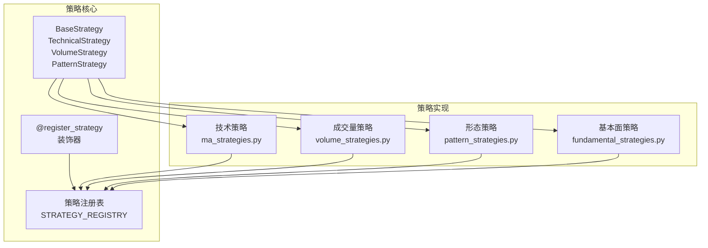
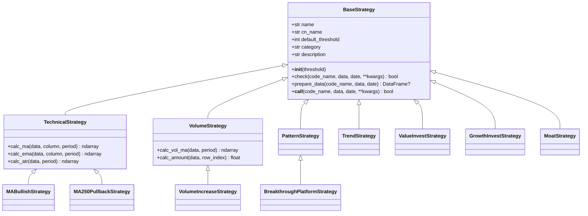
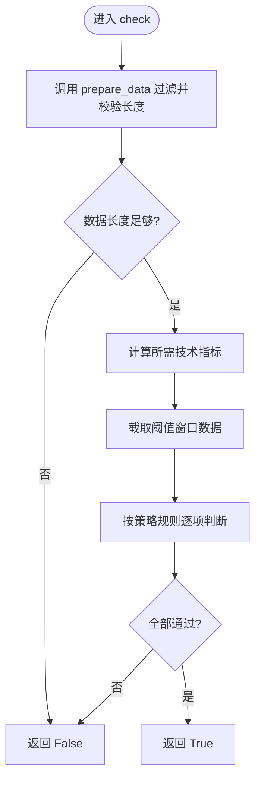
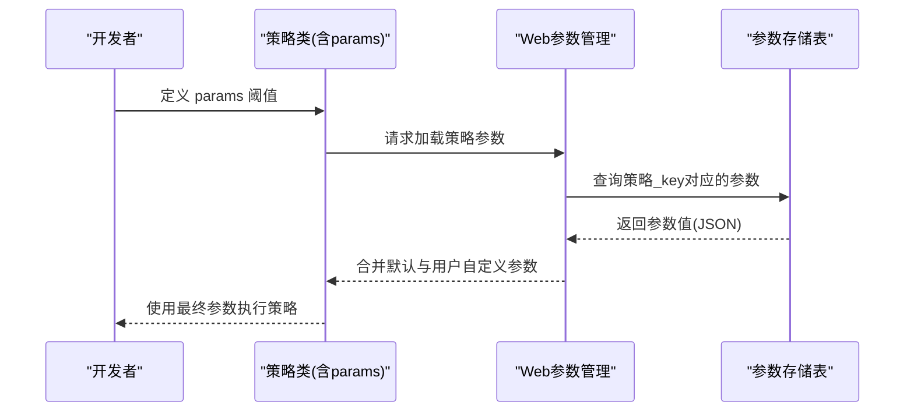
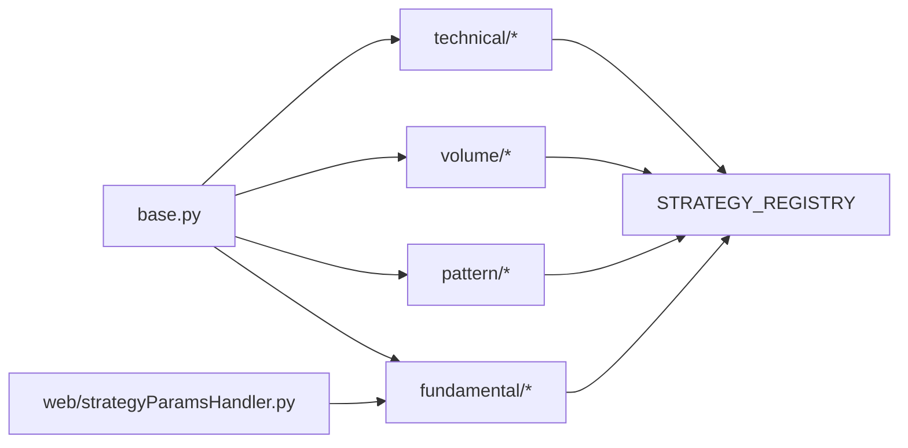

# 策略开发框架

<cite>
**本文档引用的文件**
- [base.py](file://quantia/core/strategy/base.py)
- [__init__.py](file://quantia/core/strategy/__init__.py)
- [ma_strategies.py](file://quantia/core/strategy/technical/ma_strategies.py)
- [volume_strategies.py](file://quantia/core/strategy/volume/volume_strategies.py)
- [pattern_strategies.py](file://quantia/core/strategy/pattern/pattern_strategies.py)
- [fundamental_strategies.py](file://quantia/core/strategy/fundamental/fundamental_strategies.py)
- [fundamental_filter.py](file://quantia/core/strategy/fundamental/fundamental_filter.py)
- [moat_model.py](file://quantia/core/strategy/fundamental/moat_model.py)
- [README.md](file://quantia/core/strategy/README.md)
- [enter.py](file://quantia/core/strategy/enter.py)
- [keep_increasing.py](file://quantia/core/strategy/keep_increasing.py)
- [backtrace_ma250.py](file://quantia/core/strategy/backtrace_ma250.py)
- [strategyParamsHandler.py](file://quantia/web/strategyParamsHandler.py)
- [test_strategy_mapping.py](file://tests/test_strategy_mapping.py)
- [test_strategy_bugs.py](file://tests/test_strategy_bugs.py)
</cite>

## 目录
1. [简介](#简介)
2. [项目结构](#项目结构)
3. [核心组件](#核心组件)
4. [架构概览](#架构概览)
5. [详细组件分析](#详细组件分析)
6. [依赖分析](#依赖分析)
7. [性能考虑](#性能考虑)
8. [故障排查指南](#故障排查指南)
9. [结论](#结论)
10. [附录](#附录)

## 简介
本指南面向策略开发者，系统讲解策略开发框架的设计与实现，重点围绕 TechnicalStrategy 基类、策略注册机制、check 方法的标准实现模式、数据预处理流程，以及策略参数配置体系（包括 default_threshold 的作用、自定义参数添加与验证）。同时提供最佳实践、从零开发新策略的完整示例与调试技巧，帮助快速构建高质量、可维护、可扩展的策略。

## 项目结构
策略模块位于 quantia/core/strategy 目录，采用“按功能域分层 + 按策略类型分包”的组织方式：
- base.py：策略基类与注册表
- technical/：技术指标策略（均线、ATR等）
- volume/：成交量策略（放量、缩量等）
- pattern/：K线形态策略（突破、旗形等）
- fundamental/：基本面策略（价值、成长、护城河等）
- README.md：策略模块说明与接口规范
- 兼容性函数：旧接口保留，便于平滑迁移

**图表来源**
- [base.py](file://quantia/core/strategy/base.py#L20-L202)
- [ma_strategies.py](file://quantia/core/strategy/technical/ma_strategies.py#L1-L237)
- [volume_strategies.py](file://quantia/core/strategy/volume/volume_strategies.py#L1-L126)
- [pattern_strategies.py](file://quantia/core/strategy/pattern/pattern_strategies.py#L1-L276)
- [fundamental_strategies.py](file://quantia/core/strategy/fundamental/fundamental_strategies.py#L1-L351)

**章节来源**
- [README.md](file://quantia/core/strategy/README.md#L1-L146)
- [__init__.py](file://quantia/core/strategy/__init__.py#L1-L119)

## 核心组件
- BaseStrategy 抽象基类：定义统一的 check 接口、数据预处理 prepare_data、调用入口 __call__，并提供 default_threshold 默认数据长度阈值。
- TechnicalStrategy/VolumeStrategy/PatternStrategy：针对不同策略类型的工具方法封装（如 MA、ATR、成交量均值等）。
- 策略注册表与装饰器：通过 register_strategy 将策略类注册到 STRATEGY_REGISTRY，支持按名称获取与分类查询。
- 策略参数配置：default_threshold 作为默认阈值；部分策略（如基本面策略）内置 params 字典；可通过 Web 参数管理接口动态配置。

**章节来源**
- [base.py](file://quantia/core/strategy/base.py#L20-L202)
- [__init__.py](file://quantia/core/strategy/__init__.py#L30-L42)

## 架构概览
策略框架遵循“抽象基类 + 分类基类 + 注册表 + 策略实现”的分层设计，既保证了统一接口，又允许策略按类型扩展工具方法。策略注册表提供集中式管理，便于运行时按名称或分类检索策略。

**图表来源**
- [base.py](file://quantia/core/strategy/base.py#L20-L202)
- [ma_strategies.py](file://quantia/core/strategy/technical/ma_strategies.py#L22-L212)
- [volume_strategies.py](file://quantia/core/strategy/volume/volume_strategies.py#L19-L113)
- [pattern_strategies.py](file://quantia/core/strategy/pattern/pattern_strategies.py#L22-L204)
- [fundamental_strategies.py](file://quantia/core/strategy/fundamental/fundamental_strategies.py#L30-L289)

## 详细组件分析

### TechnicalStrategy 基类与策略注册机制
- 设计要点
  - 抽象接口：check 方法统一签名，接收 code_name、历史K线数据、截止日期与可选参数。
  - 数据预处理：prepare_data 自动按截止日期过滤数据并校验最小长度阈值（threshold 或 default_threshold）。
  - 工具方法：提供常用技术指标计算（MA、EMA、ATR），减少重复实现。
  - 注册机制：@register_strategy 装饰器将策略类注册到 STRATEGY_REGISTRY，支持按名称获取与分类筛选。
- check 方法标准实现模式
  - 优先调用 prepare_data 进行数据准备与长度校验，若不足直接返回 False。
  - 计算所需技术指标并截取阈值窗口内的数据。
  - 依据策略规则进行多步判断，任一步失败即返回 False，全部通过返回 True。
- 数据预处理流程
  - 若传入 date，则以该日期为截止；否则使用 code_name[0]。
  - 过滤 data[date <= 截止日期]，随后校验长度是否满足阈值。
  - 返回过滤后的数据或 None（不足时）。

**图表来源**
- [base.py](file://quantia/core/strategy/base.py#L64-L96)
- [ma_strategies.py](file://quantia/core/strategy/technical/ma_strategies.py#L36-L55)
- [volume_strategies.py](file://quantia/core/strategy/volume/volume_strategies.py#L34-L68)

**章节来源**
- [base.py](file://quantia/core/strategy/base.py#L20-L202)
- [ma_strategies.py](file://quantia/core/strategy/technical/ma_strategies.py#L22-L212)
- [volume_strategies.py](file://quantia/core/strategy/volume/volume_strategies.py#L19-L113)

### default_threshold 参数与策略参数配置
- default_threshold 的作用
  - 作为策略默认的最小数据长度阈值，用于 prepare_data 的长度校验。
  - 可在策略类中覆盖（如 MA250PullbackStrategy 设置为 60）。
- 自定义参数添加方法
  - 技术策略：通过继承类的类属性或构造函数设置阈值与指标周期。
  - 基本面策略：在策略类中定义 params 字典，包含各筛选条件的阈值。
  - 护城河评分：通过 MoatModel 的阈值配置与加权参数，支持从 Web 参数表动态加载。
- 参数验证机制
  - 基础校验：prepare_data 对数据长度进行强制校验。
  - 数值边界：除零保护（如 vol_ratio = last_vol / mean_vol）、NaN/Inf 处理。
  - Web 参数：通过策略参数表存储与加载，支持运行时调整。

**图表来源**
- [fundamental_strategies.py](file://quantia/core/strategy/fundamental/fundamental_strategies.py#L51-L71)
- [moat_model.py](file://quantia/core/strategy/fundamental/moat_model.py#L453-L479)
- [strategyParamsHandler.py](file://quantia/web/strategyParamsHandler.py#L448-L468)

**章节来源**
- [base.py](file://quantia/core/strategy/base.py#L32-L45)
- [fundamental_strategies.py](file://quantia/core/strategy/fundamental/fundamental_strategies.py#L51-L71)
- [moat_model.py](file://quantia/core/strategy/fundamental/moat_model.py#L426-L450)
- [strategyParamsHandler.py](file://quantia/web/strategyParamsHandler.py#L448-L468)

### 策略实现示例与最佳实践

#### 示例：从零开发一个技术策略
- 步骤
  - 新建文件：在 technical/ 下创建 my_strategy.py。
  - 定义策略类：继承 TechnicalStrategy，设置 name、cn_name、default_threshold、description。
  - 实现 check：调用 prepare_data，计算指标，按规则判断，返回布尔值。
  - 注册策略：在文件顶部使用 @register_strategy 装饰器。
  - 导出策略：在 technical/__init__.py 中导出类名。
- 最佳实践
  - 代码结构：清晰的注释与中文命名，策略规则分步判断，尽早短路返回。
  - 错误处理：对 NaN/Inf 值进行填充或跳过，避免除零；对索引越界进行边界检查。
  - 性能优化：尽量使用向量化计算（如 talib），减少循环；仅在必要时复制 DataFrame。
  - 可测试性：提供与函数版本一致的行为，便于单元测试覆盖。

**章节来源**
- [ma_strategies.py](file://quantia/core/strategy/technical/ma_strategies.py#L22-L55)
- [volume_strategies.py](file://quantia/core/strategy/volume/volume_strategies.py#L19-L68)
- [pattern_strategies.py](file://quantia/core/strategy/pattern/pattern_strategies.py#L22-L77)

#### 示例：从零开发一个基本面策略
- 步骤
  - 新建文件：在 fundamental/ 下创建 my_fundamental_strategy.py。
  - 定义策略类：继承 BaseStrategy，设置 strategy_id、strategy_name、category、description。
  - 定义 params：包含各筛选条件的阈值字典。
  - 实现 check：对单只股票数据进行字段读取与阈值比较，异常时记录日志并返回 False。
  - 实现批量筛选：可复用 FundamentalFilter 的多层级筛选。
- 最佳实践
  - 参数化：将阈值集中管理在 params，便于运行时调整。
  - 异常隔离：使用 try-except 包裹字段访问，避免因缺失字段导致崩溃。
  - 可扩展：结合 MoatScorer 进行评分，输出结构化结果。

**章节来源**
- [fundamental_strategies.py](file://quantia/core/strategy/fundamental/fundamental_strategies.py#L30-L120)
- [fundamental_filter.py](file://quantia/core/strategy/fundamental/fundamental_filter.py#L118-L173)
- [moat_model.py](file://quantia/core/strategy/fundamental/moat_model.py#L325-L357)

### 策略注册与兼容性
- 注册表与获取
  - @register_strategy 将策略类注册到 STRATEGY_REGISTRY。
  - get_strategy(name) 按名称获取策略类；get_all_strategies() 获取全部；get_strategies_by_category() 按分类筛选。
- 兼容性
  - 旧接口函数：保留 check_volume、check_ma250 等函数，便于平滑迁移。
  - 模块导出：__init__.py 统一导出基类、策略与兼容模块。

**章节来源**
- [base.py](file://quantia/core/strategy/base.py#L155-L202)
- [__init__.py](file://quantia/core/strategy/__init__.py#L66-L77)
- [ma_strategies.py](file://quantia/core/strategy/technical/ma_strategies.py#L214-L237)

## 依赖分析
- 组件耦合
  - 策略实现依赖 base.py 的基类与工具方法；部分策略（如形态策略）内部组合其他策略（如 VolumeIncreaseStrategy）。
  - 注册表集中管理策略类，降低上层调用方的耦合度。
- 外部依赖
  - pandas/numpy/talib：用于数据处理与技术指标计算。
  - Web 参数管理：策略参数表支持运行时配置。

**图表来源**
- [base.py](file://quantia/core/strategy/base.py#L155-L202)
- [__init__.py](file://quantia/core/strategy/__init__.py#L30-L42)
- [strategyParamsHandler.py](file://quantia/web/strategyParamsHandler.py#L448-L468)

**章节来源**
- [base.py](file://quantia/core/strategy/base.py#L155-L202)
- [__init__.py](file://quantia/core/strategy/__init__.py#L30-L42)

## 性能考虑
- 向量化优先：使用 talib/pandas 的向量化计算，避免 Python 层循环。
- 数据截取：prepare_data 与策略内部 tail/head 截断，减少不必要的计算。
- 早期返回：规则判断采用尽早短路，降低后续计算成本。
- 内存管理：仅在必要时复制 DataFrame，避免重复拷贝。

## 故障排查指南
- 常见问题与修复
  - 除零错误：在计算量比/波动率时，确保分母非零，否则返回 False 或进行保护。
  - NaN/Inf：对 talib 计算结果进行填充或过滤，避免传播到后续逻辑。
  - 索引越界：在遍历与窗口计算时，先校验数据长度与索引范围。
- 测试验证
  - 映射完整性：确保策略表名与中文名在映射表中存在，避免回测与前端解析失败。
  - 行为一致性：OOP 策略类与函数版本应保持一致的行为。
  - 边界场景：构造极端数据（全零成交量、单日暴跌等）验证鲁棒性。

**章节来源**
- [test_strategy_mapping.py](file://tests/test_strategy_mapping.py#L14-L85)
- [test_strategy_bugs.py](file://tests/test_strategy_bugs.py#L111-L142)
- [test_strategy_bugs.py](file://tests/test_strategy_bugs.py#L147-L166)
- [test_strategy_bugs.py](file://tests/test_strategy_bugs.py#L236-L249)

## 结论
该策略开发框架通过统一的基类、完善的注册机制与参数化配置，为技术、成交量与形态策略提供了标准化实现路径。配合全面的测试与错误处理实践，能够高效地构建可维护、可扩展的策略体系。开发者可据此快速落地新策略，并通过参数化与注册表实现灵活部署与回测。

## 附录

### 从零开发新策略的完整步骤
- 技术策略
  - 在 technical/ 创建策略文件，继承 TechnicalStrategy，实现 check，使用 @register_strategy 注册。
  - 在 technical/__init__.py 导出类名。
- 成交量/形态策略
  - 在 volume/ 或 pattern/ 创建策略文件，继承相应基类，实现 check，使用 @register_strategy 注册。
  - 在对应 __init__.py 导出类名。
- 基本面策略
  - 在 fundamental/ 创建策略文件，继承 BaseStrategy，定义 params，实现 check 与批量筛选。
  - 可结合 FundamentalFilter 与 MoatScorer 提升筛选质量。
- 参数配置
  - 在策略类中定义 params；通过 Web 参数管理接口动态加载与更新。
- 测试与调试
  - 编写单元测试，覆盖正常与异常场景；使用测试工具验证映射与行为一致性。

**章节来源**
- [ma_strategies.py](file://quantia/core/strategy/technical/ma_strategies.py#L22-L55)
- [volume_strategies.py](file://quantia/core/strategy/volume/volume_strategies.py#L19-L68)
- [pattern_strategies.py](file://quantia/core/strategy/pattern/pattern_strategies.py#L22-L77)
- [fundamental_strategies.py](file://quantia/core/strategy/fundamental/fundamental_strategies.py#L30-L120)
- [README.md](file://quantia/core/strategy/README.md#L129-L146)
