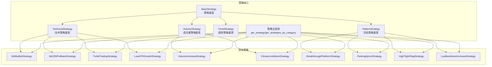
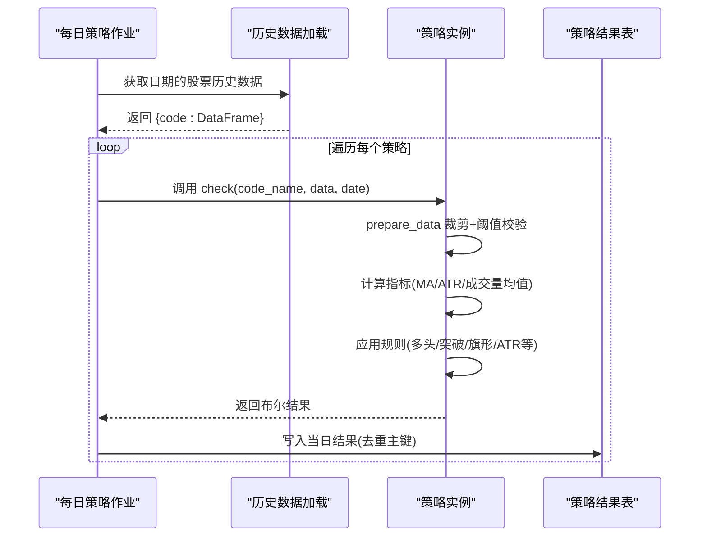
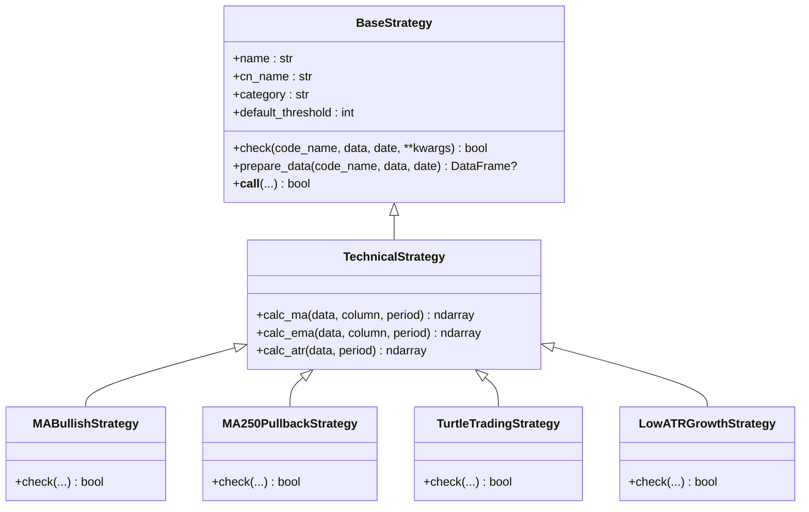
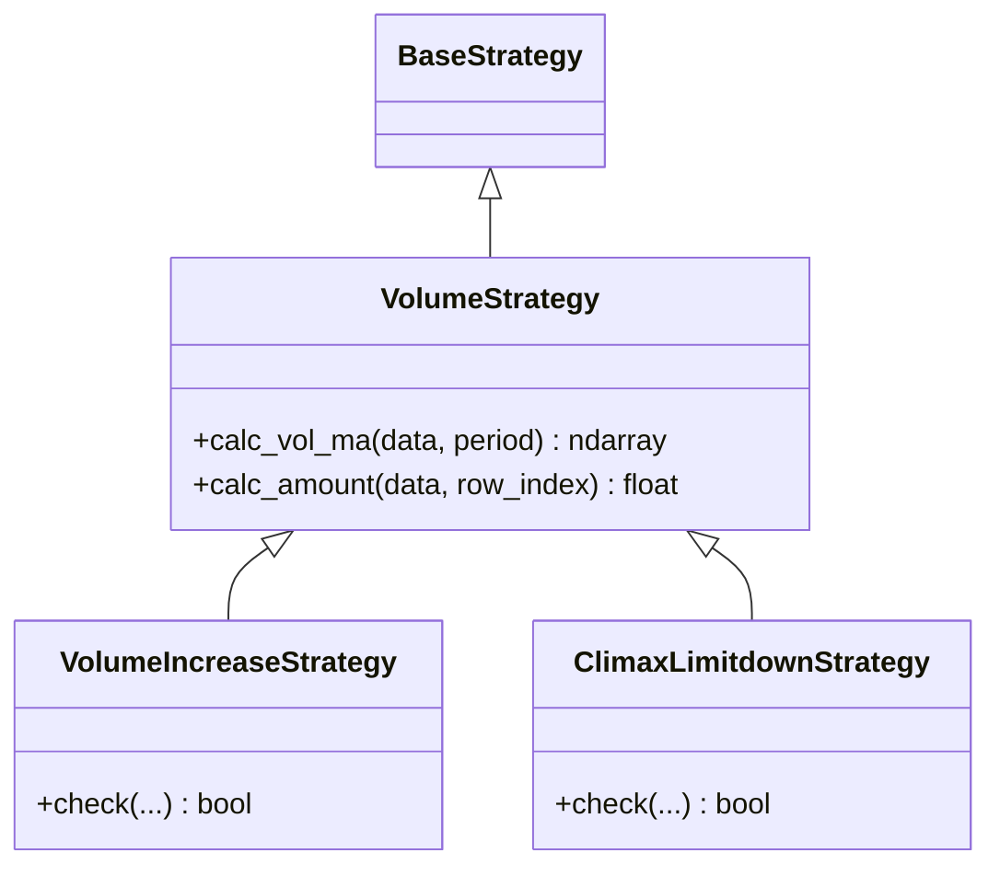
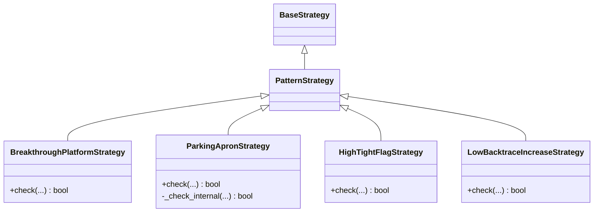
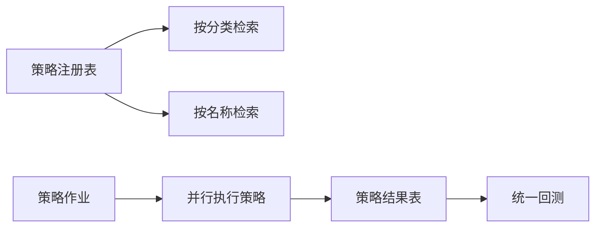

# 策略分类体系

<cite>
**本文引用的文件**
- [base.py](file://quantia/core/strategy/base.py)
- [__init__.py](file://quantia/core/strategy/__init__.py)
- [README.md](file://quantia/core/strategy/README.md)
- [ma_strategies.py](file://quantia/core/strategy/technical/ma_strategies.py)
- [volume_strategies.py](file://quantia/core/strategy/volume/volume_strategies.py)
- [pattern_strategies.py](file://quantia/core/strategy/pattern/pattern_strategies.py)
- [fundamental_strategies.py](file://quantia/core/strategy/fundamental/fundamental_strategies.py)
- [moat_model.py](file://quantia/core/strategy/fundamental/moat_model.py)
- [enter.py](file://quantia/core/strategy/enter.py)
- [turtle_trade.py](file://quantia/core/strategy/turtle_trade.py)
- [climax_limitdown.py](file://quantia/core/strategy/climax_limitdown.py)
- [backtrace_ma250.py](file://quantia/core/strategy/backtrace_ma250.py)
- [strategy_data_daily_job.py](file://quantia/job/strategy_data_daily_job.py)
- [database_schema.md](file://document/database_schema.md)
</cite>

## 目录
1. [引言](#引言)
2. [项目结构](#项目结构)
3. [核心组件](#核心组件)
4. [架构总览](#架构总览)
5. [详细组件分析](#详细组件分析)
6. [依赖分析](#依赖分析)
7. [性能考量](#性能考量)
8. [故障排查指南](#故障排查指南)
9. [结论](#结论)
10. [附录](#附录)

## 引言
本文件系统化梳理“策略分类体系”，围绕技术策略、成交量策略、趋势策略、形态策略四大类别的分类标准、技术特点、参数配置、适用场景展开；同时阐明策略分类对系统架构、查询优化与扩展性的影响，并提供开发指南、性能特征与使用建议，帮助读者高效理解与扩展该策略体系。

## 项目结构
策略模块位于 quantia/core/strategy 下，采用“按功能域分层 + 按类别细分”的组织方式：
- 基类与注册机制：base.py 定义策略基类与注册表，统一 check 接口与数据准备流程
- 分类子模块：
  - technical：技术指标策略（均线、ATR、海龟交易等）
  - volume：成交量策略（放量上涨、放量跌停等）
  - pattern：形态策略（突破平台、停机坪、旗形、无大幅回撤等）
  - fundamental：基本面策略（价值、成长、护城河、股息成长等）
- 兼容性与旧接口：部分策略保留旧式函数接口，便于历史代码迁移
- 作业调度：strategy_data_daily_job.py 并行执行所有 K 线策略

图表来源
- [base.py](file://quantia/core/strategy/base.py#L20-L202)
- [__init__.py](file://quantia/core/strategy/__init__.py#L30-L119)
- [ma_strategies.py](file://quantia/core/strategy/technical/ma_strategies.py#L22-L237)
- [volume_strategies.py](file://quantia/core/strategy/volume/volume_strategies.py#L19-L126)
- [pattern_strategies.py](file://quantia/core/strategy/pattern/pattern_strategies.py#L22-L276)

章节来源
- [base.py](file://quantia/core/strategy/base.py#L20-L202)
- [__init__.py](file://quantia/core/strategy/__init__.py#L30-L119)
- [README.md](file://quantia/core/strategy/README.md#L1-L146)

## 核心组件
- 策略基类与注册机制
  - BaseStrategy：统一 check 接口、数据准备、阈值控制
  - TechnicalStrategy/VolumeStrategy/TrendStrategy/PatternStrategy：按类别提供通用计算工具（如 MA、ATR、成交量均值）
  - 注册表：通过装饰器注册策略，支持按名称与分类检索
- 接口约定
  - check(code_name, data, date=None, **kwargs) -> bool
  - prepare_data 自动按截止日期裁剪数据并校验最小长度阈值
- 数据表与作业
  - 每个策略对应一张独立表，策略表结构一致，回测字段统一
  - 作业 strategy_data_daily_job.py 并行执行所有策略，写入对应表

章节来源
- [base.py](file://quantia/core/strategy/base.py#L20-L202)
- [__init__.py](file://quantia/core/strategy/__init__.py#L30-L119)
- [README.md](file://quantia/core/strategy/README.md#L65-L128)
- [database_schema.md](file://document/database_schema.md#L534-L729)

## 架构总览
策略体系贯穿“数据准备—策略计算—结果落库—回测集成”的闭环：
- 数据准备：按截止日期裁剪历史K线，确保最小阈值
- 策略计算：按类别调用相应指标（MA、ATR、成交量均值），结合形态/趋势规则
- 结果落库：写入对应策略表，包含回测收益字段
- 回测集成：统一回测作业覆盖所有策略（含 GPT 综合选股）

图表来源
- [strategy_data_daily_job.py](file://quantia/job/strategy_data_daily_job.py#L23-L97)
- [base.py](file://quantia/core/strategy/base.py#L64-L96)
- [database_schema.md](file://document/database_schema.md#L534-L729)

## 详细组件分析

### 技术策略 TechnicalStrategy
- 分类标准
  - 基于技术指标与价格行为的规则，常见包括均线多头、年线回踩、ATR 波动、海龟交易突破等
- 技术特点
  - 使用 TA-Lib 计算 MA、EMA、ATR 等指标
  - 通过时间窗与比例阈值判断趋势与波动
- 参数配置
  - MA/EMA：周期（如 30、60、250）、闭市价列名
  - ATR：周期（如 14）、ATR/价格比阈值（如 3%）
  - 阈值：default_threshold（如 60/120）
- 适用场景
  - 趋势跟踪、突破确认、低波动稳健成长
- 开发指南
  - 继承 TechnicalStrategy，实现 check 并调用 calc_ma/calc_ema/calc_atr
  - 注意 prepare_data 已完成数据裁剪与阈值校验
- 性能特征
  - 指标计算 O(N)，串行/并行均可；注意阈值设置影响样本量
- 使用建议
  - 多周期组合（如 MA30 上穿 MA250）提升稳定性
  - ATR 阈值需结合市场波动环境动态调整

图表来源
- [base.py](file://quantia/core/strategy/base.py#L20-L202)
- [ma_strategies.py](file://quantia/core/strategy/technical/ma_strategies.py#L22-L237)

章节来源
- [base.py](file://quantia/core/strategy/base.py#L99-L153)
- [ma_strategies.py](file://quantia/core/strategy/technical/ma_strategies.py#L22-L237)

### 成交量策略 VolumeStrategy
- 分类标准
  - 基于成交量与成交额的异常放大量信号，典型如放量上涨、放量跌停
- 技术特点
  - 计算成交量均值（如 5 日均量），比较当日量比
  - 结合涨跌幅、成交额门槛（如 ≥2 亿元）
- 参数配置
  - 量比阈值（如 2 或 1.5）
  - 成交额门槛（如 2 亿元）
  - 阈值：default_threshold（如 60）
- 适用场景
  - 资金驱动的短期信号捕捉，适合波段交易
- 开发指南
  - 继承 VolumeStrategy，使用 calc_vol_ma 计算均量
  - 注意分母为 0 的边界处理
- 性能特征
  - 计算轻量，适合高频并行
- 使用建议
  - 与涨跌幅、成交额联合过滤，降低误报

图表来源
- [base.py](file://quantia/core/strategy/base.py#L126-L143)
- [volume_strategies.py](file://quantia/core/strategy/volume/volume_strategies.py#L19-L126)

章节来源
- [base.py](file://quantia/core/strategy/base.py#L126-L143)
- [volume_strategies.py](file://quantia/core/strategy/volume/volume_strategies.py#L19-L126)

### 形态策略 PatternStrategy
- 分类标准
  - 基于 K 线形态与成交量配合的形态识别，如突破平台、停机坪、高而窄旗形、无大幅回撤
- 技术特点
  - 多阶段窗口扫描（如 60 日均线、突破日、整理期）
  - 可复用其他策略（如借助海龟交易突破、放量上涨）
- 参数配置
  - 时间窗口（如 15/60）
  - 形态偏离阈值（如 60 日均线偏离 -5%~20%）
  - 连续阳线/整理幅度约束（如 ±3%/±5%）
- 适用场景
  - 短中期趋势确认与整理末端反转
- 开发指南
  - 使用 prepare_data 截取窗口，必要时调用其他策略辅助判断
  - 注意日期边界与空窗期处理
- 性能特征
  - 窗口扫描 O(N×W)，注意 W 与阈值的平衡
- 使用建议
  - 形态策略常与成交量策略组合，提高胜率

图表来源
- [base.py](file://quantia/core/strategy/base.py#L150-L153)
- [pattern_strategies.py](file://quantia/core/strategy/pattern/pattern_strategies.py#L22-L276)

章节来源
- [base.py](file://quantia/core/strategy/base.py#L150-L153)
- [pattern_strategies.py](file://quantia/core/strategy/pattern/pattern_strategies.py#L22-L276)

### 趋势策略 TrendStrategy
- 分类标准
  - 侧重长期趋势延续与回调确认，常见于技术策略的延伸（如趋势回调/超跌反弹/突破确认）
- 技术特点
  - 通常结合均线系统与动量指标，强调“在趋势内”而非“突破”
- 参数配置
  - 窗口长度（如 60/120）、动量阈值、回调幅度
- 适用场景
  - 趋势持有与波段波段切换
- 开发指南
  - 可复用 TechnicalStrategy 的指标工具
  - 注意与形态策略区分“突破”与“延续”

章节来源
- [ma_strategies.py](file://quantia/core/strategy/technical/ma_strategies.py#L140-L212)
- [pattern_strategies.py](file://quantia/core/strategy/pattern/pattern_strategies.py#L22-L78)

### 基本面策略（Fundamental）
- 分类标准
  - 价值投资、成长投资、护城河、股息成长等，属于“fundamental”类别
- 技术特点
  - 基于财务指标阈值筛选，支持批量过滤与评分
- 参数配置
  - ROE、毛利率、净利率、资产负债率、PE、3 年复合增长率等
  - 护城河评分模型包含量化指标与定性评估
- 适用场景
  - 长期投资与组合构建
- 开发指南
  - 使用 FundamentalFilter 与 MoatScorer 进行批量评分与筛选
  - 可结合 AI 辅助分析生成投资论点与风险提示

章节来源
- [fundamental_strategies.py](file://quantia/core/strategy/fundamental/fundamental_strategies.py#L30-L351)
- [moat_model.py](file://quantia/core/strategy/fundamental/moat_model.py#L46-L479)

## 依赖分析
- 策略注册与检索
  - 通过装饰器注册，按名称与分类检索，便于前端路由与回测统一管理
- 作业调度与并行
  - strategy_data_daily_job.py 对所有策略并行执行，控制并发以适配资源
- 数据表与回测
  - 每策略一张表，统一回测字段，便于跨策略对比与汇总

图表来源
- [base.py](file://quantia/core/strategy/base.py#L155-L202)
- [strategy_data_daily_job.py](file://quantia/job/strategy_data_daily_job.py#L87-L97)
- [database_schema.md](file://document/database_schema.md#L534-L729)

章节来源
- [base.py](file://quantia/core/strategy/base.py#L155-L202)
- [strategy_data_daily_job.py](file://quantia/job/strategy_data_daily_job.py#L87-L97)
- [database_schema.md](file://document/database_schema.md#L534-L729)

## 性能考量
- 计算复杂度
  - 指标计算多为 O(N)，窗口扫描 O(N×W)，可通过阈值与窗口折中
- 并发与内存
  - 作业层面对策略并行，需控制并发度以避免内存峰值过高
- 数据访问
  - 每日按日期裁剪数据，减少无效计算；索引与主键设计保证写入效率
- 扩展性
  - 新增策略只需继承对应基类、注册即可被作业与前端发现

## 故障排查指南
- 常见问题
  - 数据不足：阈值过高导致样本不足，检查 default_threshold 与 prepare_data
  - 分母为零：成交量均值为 0，需在策略中显式判空
  - 日期边界：跨日期扫描需严格按日期过滤，避免未来数据泄漏
- 调试建议
  - 在策略内部打印关键指标与窗口片段，定位规则触发点
  - 对比历史版本与阈值变更，逐步缩小问题范围

章节来源
- [base.py](file://quantia/core/strategy/base.py#L64-L96)
- [volume_strategies.py](file://quantia/core/strategy/volume/volume_strategies.py#L63-L68)
- [pattern_strategies.py](file://quantia/core/strategy/pattern/pattern_strategies.py#L126-L148)

## 结论
策略分类体系以“基类 + 注册表 + 作业调度 + 统一表结构”为核心，形成可扩展、可并行、可回测的完整流水线。技术/成交量/形态/趋势四大类策略覆盖了从短期信号到长期趋势的全谱系需求；配合兼容性接口与前端路由，既保障历史兼容又便于演进。建议在实际应用中：
- 明确策略类别与适用场景，避免跨类误用
- 合理设置阈值与窗口，兼顾胜率与盈亏比
- 将形态与成交量策略组合，提升稳健性
- 对趋势策略与基本面策略互补，构建长短结合的组合

## 附录
- 旧接口兼容
  - 部分策略保留旧式函数接口（如 check_volume、check_enter），便于历史迁移
- 数据表结构
  - 每策略一张表，统一字段与索引，便于查询与回测

章节来源
- [enter.py](file://quantia/core/strategy/enter.py#L16-L61)
- [turtle_trade.py](file://quantia/core/strategy/turtle_trade.py#L14-L38)
- [climax_limitdown.py](file://quantia/core/strategy/climax_limitdown.py#L15-L60)
- [backtrace_ma250.py](file://quantia/core/strategy/backtrace_ma250.py#L17-L92)
- [database_schema.md](file://document/database_schema.md#L534-L729)
