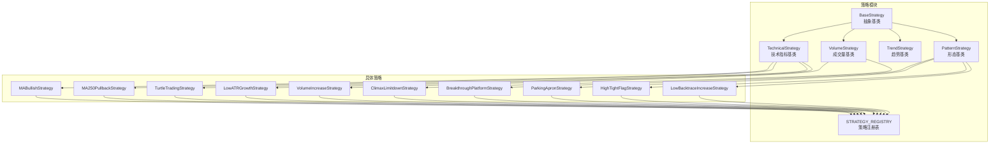
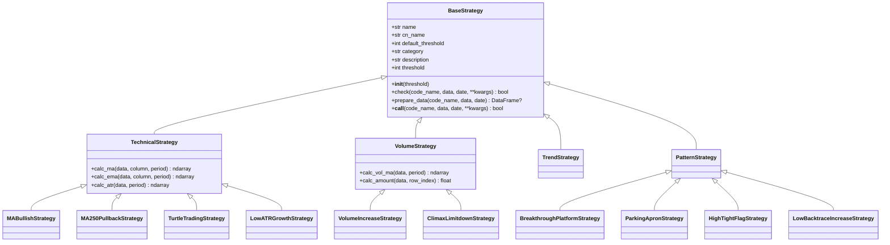
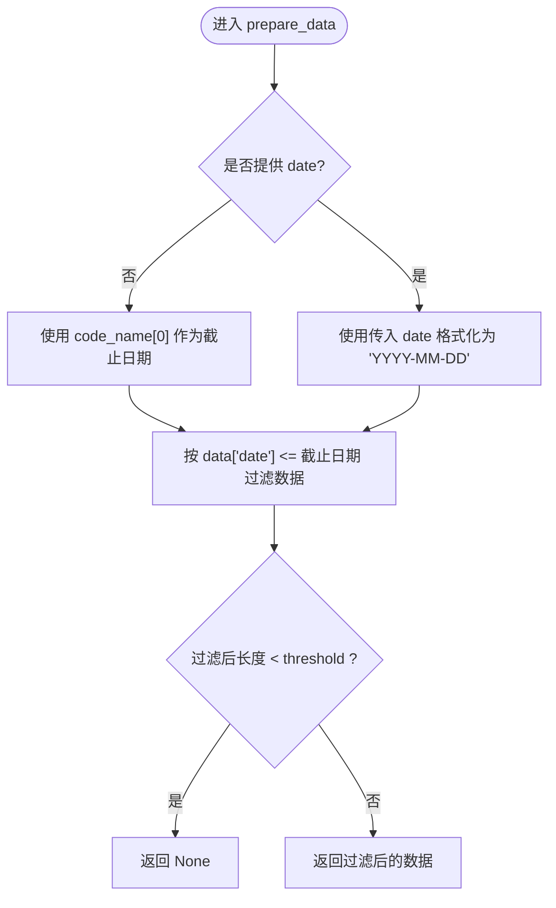
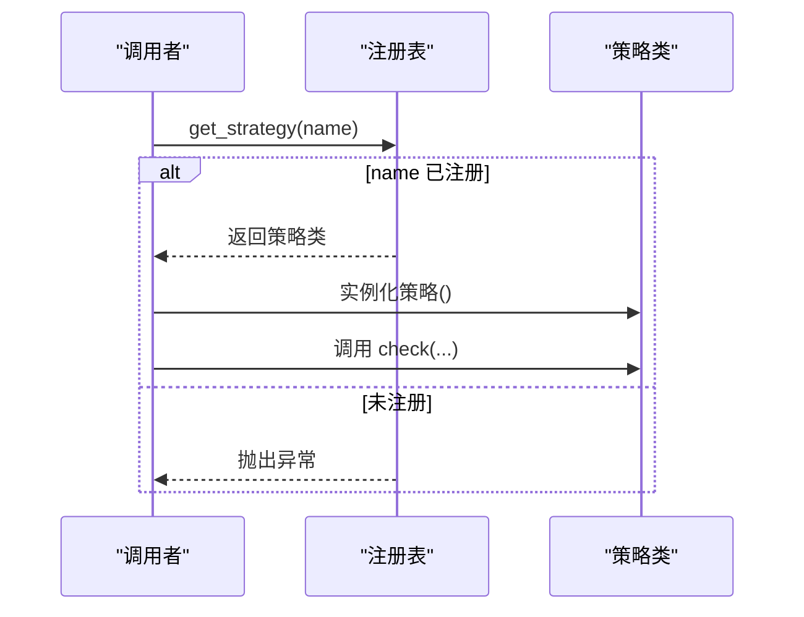
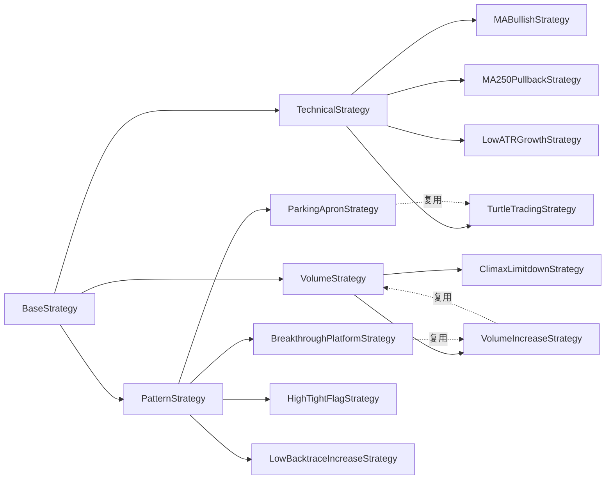

# 策略基类设计

<cite>
**本文档引用的文件**
- [quantia/core/strategy/base.py](file://quantia/core/strategy/base.py)
- [docker/stock/quantia/core/strategy/base.py](file://docker/stock/quantia/core/strategy/base.py)
- [quantia/core/strategy/__init__.py](file://quantia/core/strategy/__init__.py)
- [docker/stock/quantia/core/strategy/__init__.py](file://docker/stock/quantia/core/strategy/__init__.py)
- [quantia/core/strategy/technical/ma_strategies.py](file://quantia/core/strategy/technical/ma_strategies.py)
- [docker/stock/quantia/core/strategy/technical/ma_strategies.py](file://docker/stock/quantia/core/strategy/technical/ma_strategies.py)
- [quantia/core/strategy/volume/volume_strategies.py](file://quantia/core/strategy/volume/volume_strategies.py)
- [docker/stock/quantia/core/strategy/volume/volume_strategies.py](file://docker/stock/quantia/core/strategy/volume/volume_strategies.py)
- [quantia/core/strategy/pattern/pattern_strategies.py](file://quantia/core/strategy/pattern/pattern_strategies.py)
- [docker/stock/quantia/core/strategy/pattern/pattern_strategies.py](file://docker/stock/quantia/core/strategy/pattern/pattern_strategies.py)
- [tests/test_strategy_mapping.py](file://tests/test_strategy_mapping.py)
- [tests/test_strategy_bugs.py](file://tests/test_strategy_bugs.py)
</cite>

## 目录
1. [引言](#引言)
2. [项目结构](#项目结构)
3. [核心组件](#核心组件)
4. [架构概览](#架构概览)
5. [详细组件分析](#详细组件分析)
6. [依赖分析](#依赖分析)
7. [性能考虑](#性能考虑)
8. [故障排查指南](#故障排查指南)
9. [结论](#结论)
10. [附录](#附录)

## 引言
本文件系统性阐述策略基类设计，围绕 BaseStrategy 抽象基类展开，重点包括设计理念、核心接口、数据准备方法、check 实现要求、prepare_data 的数据过滤机制、策略实例化与调用方式、继承关系与抽象约束、参数传递机制、最佳实践与常见陷阱、性能考量，以及使用示例与扩展指南。内容基于仓库中策略模块的实际实现进行归纳总结。

## 项目结构
策略相关代码位于两个位置，功能完全一致，分别服务于不同运行环境：
- quantia/core/strategy：本地开发与测试环境
- docker/stock/quantia/core/strategy：容器化部署环境

策略模块采用“基类 + 分类子类 + 具体策略”的分层组织方式，具体策略通过装饰器注册到全局注册表，支持按名称或分类检索。

**图表来源**
- [quantia/core/strategy/base.py](file://quantia/core/strategy/base.py#L20-L202)
- [docker/stock/quantia/core/strategy/base.py](file://docker/stock/quantia/core/strategy/base.py#L20-L202)

**章节来源**
- [quantia/core/strategy/__init__.py](file://quantia/core/strategy/__init__.py#L1-L119)
- [docker/stock/quantia/core/strategy/__init__.py](file://docker/stock/quantia/core/strategy/__init__.py#L1-L119)

## 核心组件
- BaseStrategy 抽象基类：定义策略统一接口与通用能力，强制子类实现 check 方法；提供 prepare_data 数据预处理与 __call__ 直接调用能力。
- 分类基类：TechnicalStrategy、VolumeStrategy、TrendStrategy、PatternStrategy，分别提供该类别常用指标计算与辅助方法。
- 注册表与工具：STRATEGY_REGISTRY、register_strategy、get_strategy、get_all_strategies、get_strategies_by_category 提供策略发现与管理能力。
- 具体策略：如均线多头、回踩年线、海龟交易、低ATR成长、放量上涨、放量跌停、突破平台、停机坪、高而窄旗形、无大幅回撤等。

**章节来源**
- [quantia/core/strategy/base.py](file://quantia/core/strategy/base.py#L20-L202)
- [docker/stock/quantia/core/strategy/base.py](file://docker/stock/quantia/core/strategy/base.py#L20-L202)

## 架构概览
策略体系采用“抽象基类 + 分类基类 + 具体策略 + 注册表”的分层架构。check 为核心判定入口，prepare_data 统一进行数据过滤与长度校验，__call__ 提供便捷调用。策略通过装饰器注册，支持按名称或分类检索。

**图表来源**
- [quantia/core/strategy/base.py](file://quantia/core/strategy/base.py#L20-L202)
- [docker/stock/quantia/core/strategy/base.py](file://docker/stock/quantia/core/strategy/base.py#L20-L202)
- [quantia/core/strategy/technical/ma_strategies.py](file://quantia/core/strategy/technical/ma_strategies.py#L22-L237)
- [docker/stock/quantia/core/strategy/technical/ma_strategies.py](file://docker/stock/quantia/core/strategy/technical/ma_strategies.py#L22-L237)
- [quantia/core/strategy/volume/volume_strategies.py](file://quantia/core/strategy/volume/volume_strategies.py#L19-L126)
- [docker/stock/quantia/core/strategy/volume/volume_strategies.py](file://docker/stock/quantia/core/strategy/volume/volume_strategies.py#L19-L126)
- [quantia/core/strategy/pattern/pattern_strategies.py](file://quantia/core/strategy/pattern/pattern_strategies.py#L22-L276)
- [docker/stock/quantia/core/strategy/pattern/pattern_strategies.py](file://docker/stock/quantia/core/strategy/pattern/pattern_strategies.py#L22-L276)

## 详细组件分析

### BaseStrategy 抽象基类
- 设计理念
  - 统一策略接口，强制实现 check，保证策略具备明确的判定逻辑。
  - 提供 prepare_data 统一数据过滤与长度校验，减少重复代码。
  - 提供 __call__ 使策略实例可直接调用，提升易用性。
- 核心接口
  - check：接收股票标识、历史K线数据、检查日期与额外参数，返回布尔值。
  - prepare_data：按日期过滤数据，确保数据长度不低于阈值，否则返回 None。
  - __call__：转发到 check，便于直接调用。
- 关键属性
  - name、cn_name、default_threshold、category、description：策略元信息。
  - threshold：实例化时可覆盖默认阈值。
- 实现要点
  - prepare_data 优先使用传入 date，否则使用 code_name[0] 作为截止日期。
  - 过滤后若长度仍小于阈值，返回 None，调用方需据此短路。
  - __call__ 直接委托 check，保持语义一致性。

**图表来源**
- [quantia/core/strategy/base.py](file://quantia/core/strategy/base.py#L64-L89)
- [docker/stock/quantia/core/strategy/base.py](file://docker/stock/quantia/core/strategy/base.py#L64-L89)

**章节来源**
- [quantia/core/strategy/base.py](file://quantia/core/strategy/base.py#L20-L96)
- [docker/stock/quantia/core/strategy/base.py](file://docker/stock/quantia/core/strategy/base.py#L20-L96)

### 分类基类
- TechnicalStrategy
  - 提供 calc_ma、calc_ema、calc_atr 等常用技术指标计算，内部对 NaN 值填充为 0，避免后续计算异常。
- VolumeStrategy
  - 提供 calc_vol_ma、calc_amount 等成交量相关计算，注意除零保护与边界条件。
- TrendStrategy、PatternStrategy
  - 作为分类占位，便于扩展新的策略类型。

**章节来源**
- [quantia/core/strategy/base.py](file://quantia/core/strategy/base.py#L99-L153)
- [docker/stock/quantia/core/strategy/base.py](file://docker/stock/quantia/core/strategy/base.py#L99-L153)

### 策略注册与发现
- 注册机制
  - register_strategy 装饰器将策略类注册到 STRATEGY_REGISTRY，键为策略 name。
- 查询接口
  - get_strategy：按名称获取策略类，未注册则抛出异常。
  - get_all_strategies：返回注册表副本。
  - get_strategies_by_category：按分类筛选策略字典。
- 使用场景
  - 通过名称动态实例化策略，或按分类批量获取策略集合。

**图表来源**
- [quantia/core/strategy/base.py](file://quantia/core/strategy/base.py#L159-L191)
- [docker/stock/quantia/core/strategy/base.py](file://docker/stock/quantia/core/strategy/base.py#L159-L191)

**章节来源**
- [quantia/core/strategy/base.py](file://quantia/core/strategy/base.py#L155-L202)
- [docker/stock/quantia/core/strategy/base.py](file://docker/stock/quantia/core/strategy/base.py#L155-L202)

### 具体策略实现示例

#### 技术策略：均线多头（MABullishStrategy）
- check 步骤
  - 调用 prepare_data 过滤并校验长度。
  - 计算 ma30 并截取尾部 n=threshold 的窗口。
  - 判断均线三段递增且末期较初期涨幅超阈值，满足则返回 True。
- 关键点
  - 使用 self.calc_ma 计算均线，注意 NaN 填充。
  - 通过分段索引比较均线序列单调性与幅度。

**章节来源**
- [quantia/core/strategy/technical/ma_strategies.py](file://quantia/core/strategy/technical/ma_strategies.py#L22-L56)
- [docker/stock/quantia/core/strategy/technical/ma_strategies.py](file://docker/stock/quantia/core/strategy/technical/ma_strategies.py#L22-L56)

#### 技术策略：回踩年线（MA250PullbackStrategy）
- check 步骤
  - 自行处理日期过滤与长度校验（不依赖 prepare_data）。
  - 计算 ma250，划分前半段与后半段，分别验证突破与站稳条件。
  - 计算最高点与最低点日期差，要求在指定范围内。
  - 校验量比与回调幅度，满足则返回 True。
- 关键点
  - 对日期解析与差值计算进行异常处理。
  - 注意 volume 为 0 的边界情况。

**章节来源**
- [quantia/core/strategy/technical/ma_strategies.py](file://quantia/core/strategy/technical/ma_strategies.py#L58-L138)
- [docker/stock/quantia/core/strategy/technical/ma_strategies.py](file://docker/stock/quantia/core/strategy/technical/ma_strategies.py#L58-L138)

#### 技术策略：海龟交易（TurtleTradingStrategy）
- check 步骤
  - 调用 prepare_data，取最近 threshold 日。
  - 比较当日收盘价与最近 threshold 日最高价，满足则返回 True。
- 关键点
  - 逻辑简洁，强调突破信号。

**章节来源**
- [quantia/core/strategy/technical/ma_strategies.py](file://quantia/core/strategy/technical/ma_strategies.py#L140-L167)
- [docker/stock/quantia/core/strategy/technical/ma_strategies.py](file://docker/stock/quantia/core/strategy/technical/ma_strategies.py#L140-L167)

#### 技术策略：低ATR成长（LowATRGrowthStrategy）
- check 步骤
  - 调用 prepare_data，计算 atr 并截取尾部。
  - 校验 atr/price 比例阈值与 120 日涨幅阈值，满足则返回 True。
- 关键点
  - 对 atr 比例与涨幅进行双条件约束。

**章节来源**
- [quantia/core/strategy/technical/ma_strategies.py](file://quantia/core/strategy/technical/ma_strategies.py#L169-L212)
- [docker/stock/quantia/core/strategy/technical/ma_strategies.py](file://docker/stock/quantia/core/strategy/technical/ma_strategies.py#L169-L212)

#### 成交量策略：放量上涨（VolumeIncreaseStrategy）
- check 步骤
  - 调用 prepare_data，计算 vol_ma5。
  - 校验当日涨跌幅、收盘价大于开盘价、成交额阈值、量比阈值，满足则返回 True。
- 关键点
  - 对 vol_ma5 为 0 的边界进行保护。

**章节来源**
- [quantia/core/strategy/volume/volume_strategies.py](file://quantia/core/strategy/volume/volume_strategies.py#L19-L69)
- [docker/stock/quantia/core/strategy/volume/volume_strategies.py](file://docker/stock/quantia/core/strategy/volume/volume_strategies.py#L19-L69)

#### 成交量策略：放量跌停（ClimaxLimitdownStrategy）
- check 步骤
  - 调用 prepare_data，计算 vol_ma5。
  - 校验当日接近跌停、量比阈值，满足则返回 True。
- 关键点
  - 对 vol_ma5 为 0 的边界进行保护。

**章节来源**
- [quantia/core/strategy/volume/volume_strategies.py](file://quantia/core/strategy/volume/volume_strategies.py#L71-L113)
- [docker/stock/quantia/core/strategy/volume/volume_strategies.py](file://docker/stock/quantia/core/strategy/volume/volume_strategies.py#L71-L113)

#### 形态策略：突破平台（BreakthroughPlatformStrategy）
- check 步骤
  - 自行处理日期过滤与长度校验。
  - 计算 ma60，寻找突破时刻。
  - 借助 VolumeIncreaseStrategy 对突破日进行放量上涨校验。
  - 校验突破前窗口内收盘价与 ma60 偏离范围，满足则返回 True。
- 关键点
  - 通过组合其他策略实现复杂条件。

**章节来源**
- [quantia/core/strategy/pattern/pattern_strategies.py](file://quantia/core/strategy/pattern/pattern_strategies.py#L22-L78)
- [docker/stock/quantia/core/strategy/pattern/pattern_strategies.py](file://docker/stock/quantia/core/strategy/pattern/pattern_strategies.py#L22-L78)

#### 形态策略：停机坪（ParkingApronStrategy）
- check 步骤
  - 自行处理日期过滤与长度校验。
  - 寻找涨停日，借助 TurtleTradingStrategy 验证涨停有效性。
  - 对涨停后 3 天进行高开、收涨、振幅限制等检查，满足则返回 True。
- 关键点
  - 严格的时间窗口与价格行为约束。

**章节来源**
- [quantia/core/strategy/pattern/pattern_strategies.py](file://quantia/core/strategy/pattern/pattern_strategies.py#L80-L149)
- [docker/stock/quantia/core/strategy/pattern/pattern_strategies.py](file://docker/stock/quantia/core/strategy/pattern/pattern_strategies.py#L80-L149)

#### 形态策略：高而窄旗形（HighTightFlagStrategy）
- check 步骤
  - 若 istop=False 直接返回 False。
  - 自行处理日期过滤与长度校验。
  - 计算当前收盘价与区间最低价比值，连续两天涨幅≥9.5%，满足则返回 True。
- 关键点
  - 依赖外部数据（istop）与严格的连续涨幅条件。

**章节来源**
- [quantia/core/strategy/pattern/pattern_strategies.py](file://quantia/core/strategy/pattern/pattern_strategies.py#L151-L204)
- [docker/stock/quantia/core/strategy/pattern/pattern_strategies.py](file://docker/stock/quantia/core/strategy/pattern/pattern_strategies.py#L151-L204)

#### 形态策略：无大幅回撤（LowBacktraceIncreaseStrategy）
- check 步骤
  - 自行处理日期过滤与长度校验。
  - 校验总涨幅阈值与每日/累计回撤限制，满足则返回 True。
- 关键点
  - 对 previous_open 初始化进行修复，避免误判。

**章节来源**
- [quantia/core/strategy/pattern/pattern_strategies.py](file://quantia/core/strategy/pattern/pattern_strategies.py#L206-L251)
- [docker/stock/quantia/core/strategy/pattern/pattern_strategies.py](file://docker/stock/quantia/core/strategy/pattern/pattern_strategies.py#L206-L251)

## 依赖分析
- 组件耦合
  - 具体策略依赖 BaseStrategy 与分类基类提供的工具方法，降低重复实现。
  - 形态策略内部可复用技术/成交量策略，体现策略组合思想。
- 外部依赖
  - pandas/numpy/talib：用于数据处理与技术指标计算。
  - datetime：用于日期解析与时间差计算。
- 注册表
  - 通过装饰器集中管理策略类，便于统一发现与实例化。

**图表来源**
- [quantia/core/strategy/base.py](file://quantia/core/strategy/base.py#L20-L202)
- [docker/stock/quantia/core/strategy/base.py](file://docker/stock/quantia/core/strategy/base.py#L20-L202)
- [quantia/core/strategy/technical/ma_strategies.py](file://quantia/core/strategy/technical/ma_strategies.py#L22-L237)
- [quantia/core/strategy/volume/volume_strategies.py](file://quantia/core/strategy/volume/volume_strategies.py#L19-L126)
- [quantia/core/strategy/pattern/pattern_strategies.py](file://quantia/core/strategy/pattern/pattern_strategies.py#L22-L276)

**章节来源**
- [quantia/core/strategy/__init__.py](file://quantia/core/strategy/__init__.py#L30-L119)
- [docker/stock/quantia/core/strategy/__init__.py](file://docker/stock/quantia/core/strategy/__init__.py#L30-L119)

## 性能考虑
- 数据过滤与截取
  - prepare_data 使用布尔掩码过滤，建议确保数据按日期排序，避免重复扫描。
  - 截取 tail/head 时注意阈值设置，避免过大的窗口导致内存压力。
- 技术指标计算
  - 使用 talib 计算均线/ATR 等指标，内部已做 NaN 填充，但仍需关注输入数组长度与 dtype。
- 除零保护
  - 成交量相关策略需对 vol_ma5 或 volume 为 0 的情况进行保护，避免异常。
- 策略组合
  - 形态策略内部复用其他策略时，注意避免重复计算指标与多次数据拷贝。

[本节为通用指导，无需列出具体文件来源]

## 故障排查指南
- 策略未注册
  - 症状：调用 get_strategy 抛出异常。
  - 排查：确认策略类是否使用 @register_strategy 装饰，name 是否唯一。
- 数据不足
  - 症状：check 返回 False 或抛出索引越界异常。
  - 排查：检查 prepare_data 过滤后长度是否满足 default_threshold；必要时在实例化时传入更大阈值。
- 除零异常
  - 症状：计算量比时报 ZeroDivisionError。
  - 排查：在策略中增加对分母为 0 的保护，返回 False 或跳过该条件。
- 日期解析异常
  - 症状：日期格式转换失败或时间差计算异常。
  - 排查：确保 date 字符串格式一致，捕获 ValueError/TypeError 并返回 False。
- 边界条件修复
  - 例如 previous_open 初始化修复、偏离率公式修正、inf 值清理等，已在测试中覆盖。

**章节来源**
- [tests/test_strategy_bugs.py](file://tests/test_strategy_bugs.py#L108-L200)
- [tests/test_strategy_mapping.py](file://tests/test_strategy_mapping.py#L87-L165)

## 结论
策略基类设计通过抽象接口、统一数据准备与便捷调用，实现了策略的标准化与可扩展性。分类基类提供常用指标工具，注册表支持动态发现与实例化。具体策略遵循统一范式，既可独立实现，也可组合使用。实践中需重视数据质量、边界条件与性能优化，确保策略稳定可靠。

[本节为总结性内容，无需列出具体文件来源]

## 附录

### 使用示例与扩展指南
- 通过类使用
  - 从策略模块导入具体策略类，实例化后调用 check 或直接调用实例。
- 通过注册表使用
  - 使用 get_strategy(name) 获取类，再实例化调用 check。
- 通过兼容函数使用
  - 旧接口提供兼容函数，便于平滑迁移。
- 扩展新策略
  - 新建类继承相应分类基类，实现 check 与必要的指标计算，使用 @register_strategy 装饰并设置 name。
  - 合理设置 default_threshold 与 category，完善 description 以便于管理和展示。

**章节来源**
- [quantia/core/strategy/__init__.py](file://quantia/core/strategy/__init__.py#L11-L25)
- [docker/stock/quantia/core/strategy/__init__.py](file://docker/stock/quantia/core/strategy/__init__.py#L11-L25)
- [quantia/core/strategy/base.py](file://quantia/core/strategy/base.py#L159-L171)
- [docker/stock/quantia/core/strategy/base.py](file://docker/stock/quantia/core/strategy/base.py#L159-L171)
