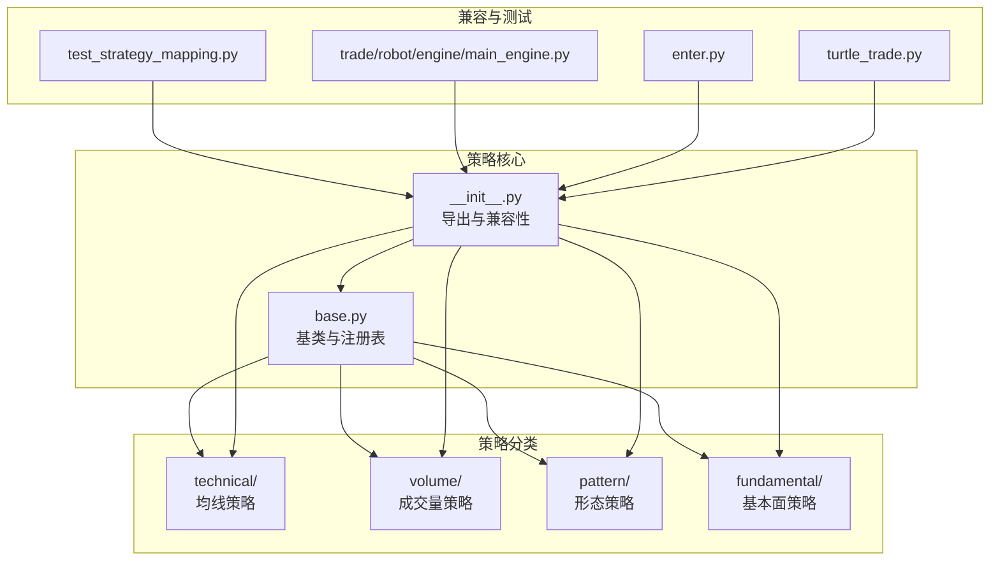
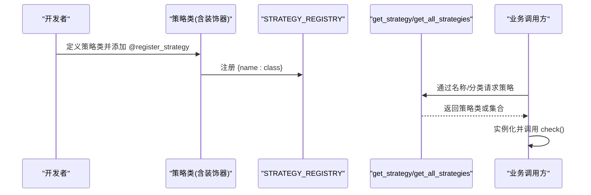
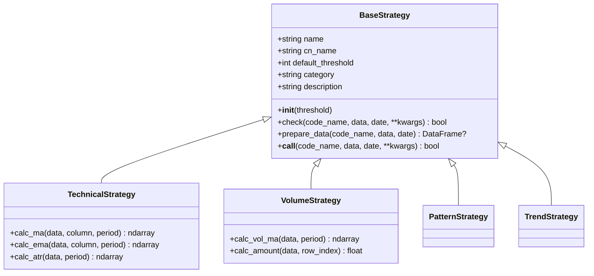
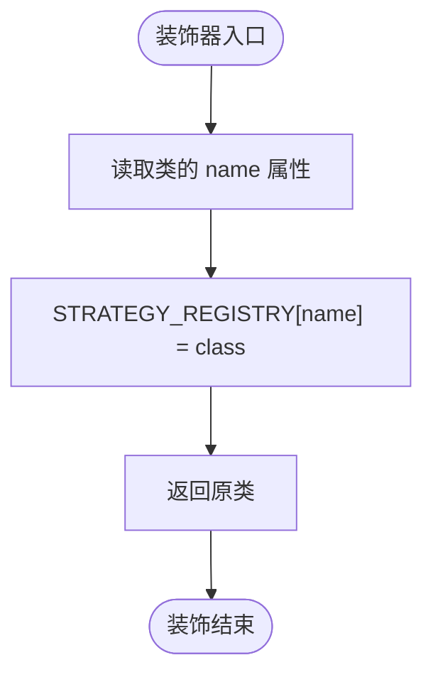
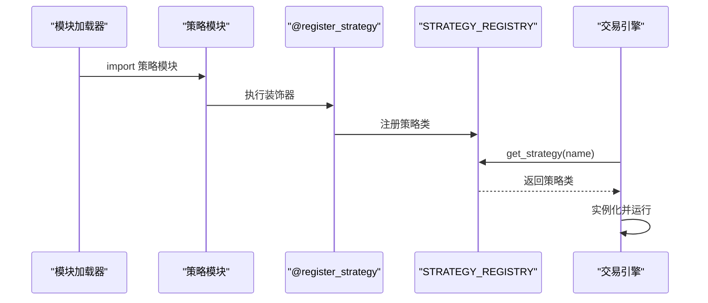
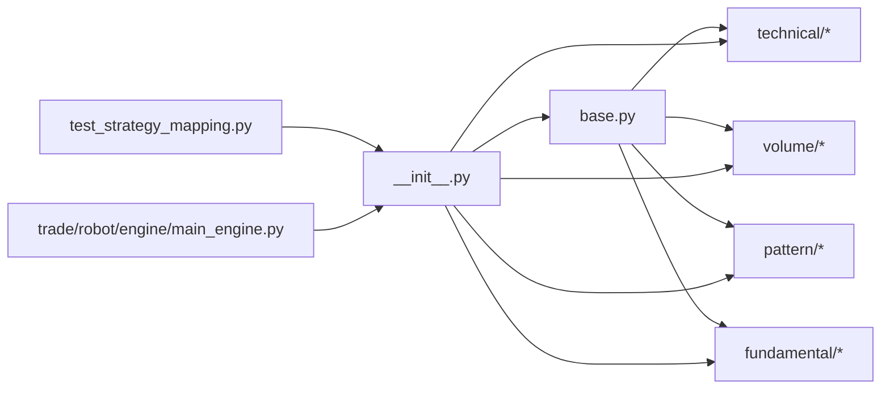

# 策略注册机制

<cite>
**本文引用的文件**
- [base.py](file://quantia/core/strategy/base.py)
- [__init__.py](file://quantia/core/strategy/__init__.py)
- [ma_strategies.py](file://quantia/core/strategy/technical/ma_strategies.py)
- [pattern_strategies.py](file://quantia/core/strategy/pattern/pattern_strategies.py)
- [volume_strategies.py](file://quantia/core/strategy/volume/volume_strategies.py)
- [fundamental_strategies.py](file://quantia/core/strategy/fundamental/fundamental_strategies.py)
- [enter.py](file://quantia/core/strategy/enter.py)
- [turtle_trade.py](file://quantia/core/strategy/turtle_trade.py)
- [test_strategy_mapping.py](file://tests/test_strategy_mapping.py)
- [main_engine.py](file://quantia/trade/robot/engine/main_engine.py)
</cite>

## 目录
1. [简介](#简介)
2. [项目结构](#项目结构)
3. [核心组件](#核心组件)
4. [架构总览](#架构总览)
5. [详细组件分析](#详细组件分析)
6. [依赖分析](#依赖分析)
7. [性能考虑](#性能考虑)
8. [故障排除指南](#故障排除指南)
9. [结论](#结论)
10. [附录](#附录)

## 简介
本文件系统化阐述策略注册机制的设计与实现，重点覆盖以下方面：
- 策略注册装饰器 register_strategy 的工作原理与使用方式
- 注册表 STRATEGY_REGISTRY 的数据结构与生命周期
- 策略获取方法 get_strategy、get_all_strategies、get_strategies_by_category 的实现与语义
- 策略命名规范与分类机制
- 动态加载与运行期扩展流程
- 最佳实践、错误处理与调试技巧
- 完整示例与故障排除清单

## 项目结构
策略注册机制主要位于核心策略模块中，采用“基类 + 分类基类 + 装饰器 + 注册表”的组织方式；同时提供兼容性入口与测试用例保障。

图表来源
- [base.py](file://quantia/core/strategy/base.py#L1-L202)
- [__init__.py](file://quantia/core/strategy/__init__.py#L1-L119)
- [ma_strategies.py](file://quantia/core/strategy/technical/ma_strategies.py#L1-L237)
- [pattern_strategies.py](file://quantia/core/strategy/pattern/pattern_strategies.py#L1-L276)
- [volume_strategies.py](file://quantia/core/strategy/volume/volume_strategies.py#L1-L126)
- [fundamental_strategies.py](file://quantia/core/strategy/fundamental/fundamental_strategies.py#L1-L351)
- [enter.py](file://quantia/core/strategy/enter.py#L1-L61)
- [turtle_trade.py](file://quantia/core/strategy/turtle_trade.py#L1-L38)
- [test_strategy_mapping.py](file://tests/test_strategy_mapping.py#L1-L165)
- [main_engine.py](file://quantia/trade/robot/engine/main_engine.py#L108-L136)

章节来源
- [base.py](file://quantia/core/strategy/base.py#L1-L202)
- [__init__.py](file://quantia/core/strategy/__init__.py#L1-L119)

## 核心组件
- 策略基类与分类基类
  - BaseStrategy：抽象基类，定义 check、prepare_data、__call__ 等通用接口
  - TechnicalStrategy、VolumeStrategy、PatternStrategy、TrendStrategy：按领域划分的分类基类，统一 category 字段
- 注册表与注册工具
  - STRATEGY_REGISTRY：全局字典，键为策略名称，值为策略类
  - register_strategy：装饰器，将策略类注册到 STRATEGY_REGISTRY
  - get_strategy、get_all_strategies、get_strategies_by_category：注册表查询工具
- 兼容性与导出
  - __init__.py 将基类、注册工具与各类策略统一导出，便于外部按模块导入

章节来源
- [base.py](file://quantia/core/strategy/base.py#L20-L202)
- [__init__.py](file://quantia/core/strategy/__init__.py#L30-L119)

## 架构总览
策略注册机制遵循“声明即注册”的设计：策略类在定义时通过装饰器完成注册，随后可通过名称或分类检索。系统还支持兼容性函数与动态加载场景。

图表来源
- [base.py](file://quantia/core/strategy/base.py#L159-L201)
- [__init__.py](file://quantia/core/strategy/__init__.py#L30-L119)

## 详细组件分析

### 策略基类与分类基类
- BaseStrategy
  - 提供统一的 check 接口、数据准备 prepare_data、可调用包装 __call__
  - 提供默认阈值 threshold 与描述字段（name、cn_name、category、description）
- 分类基类
  - TechnicalStrategy：提供 MA/EMA/ATR 等计算工具
  - VolumeStrategy：提供成交量与成交额计算工具
  - PatternStrategy、TrendStrategy：作为分类标记，便于按类别筛选

图表来源
- [base.py](file://quantia/core/strategy/base.py#L20-L153)

章节来源
- [base.py](file://quantia/core/strategy/base.py#L20-L153)

### 注册表与注册装饰器
- STRATEGY_REGISTRY
  - 类型：dict[str, type]
  - 键：策略名称（通常与策略类的 name 属性一致）
  - 值：策略类类型
- register_strategy
  - 作用：将策略类注册到 STRATEGY_REGISTRY，键为 cls.name
  - 特性：装饰器返回原类，便于链式使用
- 查询工具
  - get_strategy(name)：按名称获取策略类，不存在则抛出异常
  - get_all_strategies()：返回注册表副本
  - get_strategies_by_category(category)：按分类过滤策略

图表来源
- [base.py](file://quantia/core/strategy/base.py#L159-L170)

章节来源
- [base.py](file://quantia/core/strategy/base.py#L155-L201)

### 策略命名规范与分类机制
- 命名规范
  - 策略类需设置 name 字段，作为注册表键
  - 建议使用全小写、下划线或驼峰风格，保证唯一性与可读性
- 分类机制
  - 策略类通过继承不同分类基类设置 category
  - 常见分类：technical、volume、pattern、trend、fundamental、other
  - 可通过 get_strategies_by_category 按分类检索

章节来源
- [base.py](file://quantia/core/strategy/base.py#L33-L34)
- [base.py](file://quantia/core/strategy/base.py#L99-L153)
- [base.py](file://quantia/core/strategy/base.py#L193-L201)

### 动态加载流程
- Python 模块加载时，遇到 @register_strategy 装饰器会立即注册策略类
- 在 __init__.py 中集中导出策略与注册工具，便于外部一次性导入
- 运行时可通过 get_strategy 获取策略类并实例化调用
- 动态加载场景（如交易引擎）可基于策略模块的文件变更进行重载与事件监听

图表来源
- [base.py](file://quantia/core/strategy/base.py#L159-L170)
- [__init__.py](file://quantia/core/strategy/__init__.py#L30-L119)
- [main_engine.py](file://quantia/trade/robot/engine/main_engine.py#L108-L136)

章节来源
- [__init__.py](file://quantia/core/strategy/__init__.py#L30-L119)
- [main_engine.py](file://quantia/trade/robot/engine/main_engine.py#L108-L136)

### 策略实现示例与最佳实践
- 示例一：技术策略（均线多头）
  - 位置：[ma_strategies.py](file://quantia/core/strategy/technical/ma_strategies.py#L22-L55)
  - 关键点：设置 name、cn_name、default_threshold、description；在 check 中使用基类工具与 prepare_data
- 示例二：成交量策略（放量上涨）
  - 位置：[volume_strategies.py](file://quantia/core/strategy/volume/volume_strategies.py#L19-L68)
  - 关键点：使用 VolumeStrategy.calc_vol_ma、calc_amount；严格的数据长度校验
- 示例三：形态策略（突破平台）
  - 位置：[pattern_strategies.py](file://quantia/core/strategy/pattern/pattern_strategies.py#L22-L77)
  - 关键点：组合其他策略（如放量上涨）进行复合判断
- 示例四：基本面策略（价值投资）
  - 位置：[fundamental_strategies.py](file://quantia/core/strategy/fundamental/fundamental_strategies.py#L30-L120)
  - 关键点：category 设为 "fundamental"；使用过滤器与评分体系

最佳实践
- 明确设置 name 与 category，确保唯一性与可检索性
- 合理设置 default_threshold，避免过短导致误判
- 在 check 中优先调用 prepare_data，确保数据边界与长度满足要求
- 对外部依赖（如其他策略类）采用延迟导入，降低耦合
- 为策略提供简明 description，便于 UI 与文档展示

章节来源
- [ma_strategies.py](file://quantia/core/strategy/technical/ma_strategies.py#L22-L55)
- [volume_strategies.py](file://quantia/core/strategy/volume/volume_strategies.py#L19-L68)
- [pattern_strategies.py](file://quantia/core/strategy/pattern/pattern_strategies.py#L22-L77)
- [fundamental_strategies.py](file://quantia/core/strategy/fundamental/fundamental_strategies.py#L30-L120)

### 兼容性与旧接口
- 兼容性模块
  - enter.py、turtle_trade.py 提供旧式函数接口，便于迁移
- 统一导出
  - __init__.py 将策略与注册工具集中导出，简化外部导入

章节来源
- [enter.py](file://quantia/core/strategy/enter.py#L16-L60)
- [turtle_trade.py](file://quantia/core/strategy/turtle_trade.py#L14-L37)
- [__init__.py](file://quantia/core/strategy/__init__.py#L66-L118)

## 依赖分析
- 模块内聚与耦合
  - base.py 提供核心注册与查询能力，策略实现仅依赖其装饰器与基类
  - 各分类目录下的策略彼此独立，通过统一基类与注册表解耦
- 外部依赖
  - 策略实现依赖 pandas/numpy/talib 等库进行数据处理
  - 交易引擎依赖 importlib.reload 实现策略热加载

图表来源
- [base.py](file://quantia/core/strategy/base.py#L1-L202)
- [__init__.py](file://quantia/core/strategy/__init__.py#L1-L119)
- [test_strategy_mapping.py](file://tests/test_strategy_mapping.py#L1-L165)
- [main_engine.py](file://quantia/trade/robot/engine/main_engine.py#L108-L136)

章节来源
- [base.py](file://quantia/core/strategy/base.py#L1-L202)
- [__init__.py](file://quantia/core/strategy/__init__.py#L1-L119)

## 性能考虑
- 注册表查询为 O(1) 字典查找，开销极低
- 策略 check 中的数据计算建议使用向量化（如 talib/pandas），避免逐行循环
- prepare_data 会截断数据并拷贝，注意阈值设置避免过大数据集
- 批量筛选时优先使用 pandas 向量化操作，减少 Python 循环

## 故障排除指南
常见问题与排查步骤
- 策略未注册
  - 现象：调用 get_strategy 抛出异常
  - 排查：确认策略类已添加 @register_strategy 并设置了唯一的 name；检查 __init__.py 是否导出该策略
  - 参考：[base.py](file://quantia/core/strategy/base.py#L173-L185)
- 名称冲突
  - 现象：多个策略使用相同 name，后注册覆盖前者
  - 排查：确保每个策略的 name 唯一
- 分类筛选为空
  - 现象：get_strategies_by_category 返回空
  - 排查：确认策略类继承了正确的分类基类，category 设置正确
  - 参考：[base.py](file://quantia/core/strategy/base.py#L193-L201)
- 动态加载未生效
  - 现象：修改策略后未更新
  - 排查：确认交易引擎使用 importlib.reload 重载模块；检查缓存与事件监听逻辑
  - 参考：[main_engine.py](file://quantia/trade/robot/engine/main_engine.py#L108-L136)
- 兼容性接口失效
  - 现象：旧式函数调用失败
  - 排查：确认 enter.py、turtle_trade.py 等模块仍可正常导入与调用
  - 参考：[enter.py](file://quantia/core/strategy/enter.py#L16-L60)，[turtle_trade.py](file://quantia/core/strategy/turtle_trade.py#L14-L37)
- 测试验证
  - 使用测试用例验证策略映射与解析的健壮性
  - 参考：[test_strategy_mapping.py](file://tests/test_strategy_mapping.py#L87-L165)

章节来源
- [base.py](file://quantia/core/strategy/base.py#L173-L201)
- [main_engine.py](file://quantia/trade/robot/engine/main_engine.py#L108-L136)
- [enter.py](file://quantia/core/strategy/enter.py#L16-L60)
- [turtle_trade.py](file://quantia/core/strategy/turtle_trade.py#L14-L37)
- [test_strategy_mapping.py](file://tests/test_strategy_mapping.py#L87-L165)

## 结论
策略注册机制以简洁的装饰器与全局注册表为核心，实现了声明即注册、按名检索与按类筛选的能力。配合分类基类与统一导出，既保证了扩展性，也兼顾了易用性。在实际工程中，应遵循命名与分类规范，结合 prepare_data 与向量化计算提升稳定性与性能，并通过测试与动态加载机制保障演进过程中的兼容性与可靠性。

## 附录
- 快速参考
  - 注册装饰器：[base.py](file://quantia/core/strategy/base.py#L159-L170)
  - 获取策略：[base.py](file://quantia/core/strategy/base.py#L173-L185)
  - 获取全部策略：[base.py](file://quantia/core/strategy/base.py#L188-L190)
  - 按分类获取：[base.py](file://quantia/core/strategy/base.py#L193-L201)
  - 统一导出入口：[__init__.py](file://quantia/core/strategy/__init__.py#L30-L119)
  - 示例策略实现：
    - [ma_strategies.py](file://quantia/core/strategy/technical/ma_strategies.py#L22-L55)
    - [volume_strategies.py](file://quantia/core/strategy/volume/volume_strategies.py#L19-L68)
    - [pattern_strategies.py](file://quantia/core/strategy/pattern/pattern_strategies.py#L22-L77)
    - [fundamental_strategies.py](file://quantia/core/strategy/fundamental/fundamental_strategies.py#L30-L120)
  - 兼容性接口：
    - [enter.py](file://quantia/core/strategy/enter.py#L16-L60)
    - [turtle_trade.py](file://quantia/core/strategy/turtle_trade.py#L14-L37)
  - 动态加载参考：
    - [main_engine.py](file://quantia/trade/robot/engine/main_engine.py#L108-L136)
  - 测试用例：
    - [test_strategy_mapping.py](file://tests/test_strategy_mapping.py#L87-L165)
