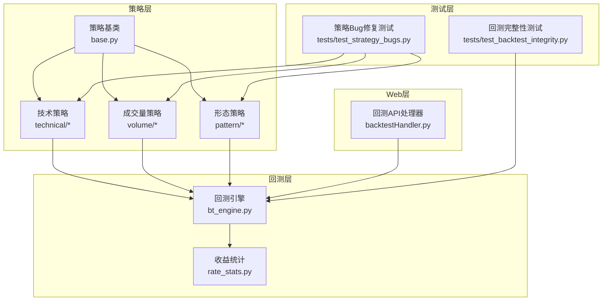
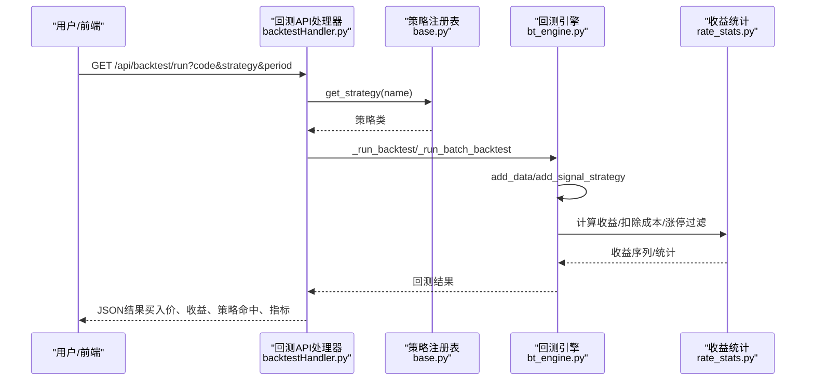
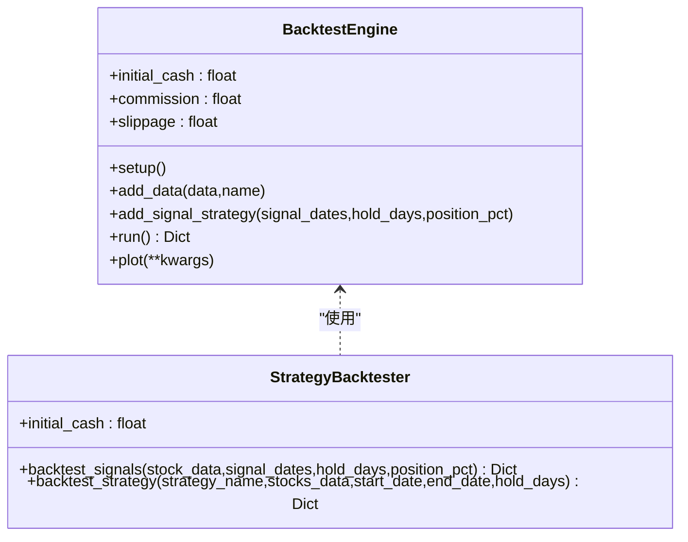
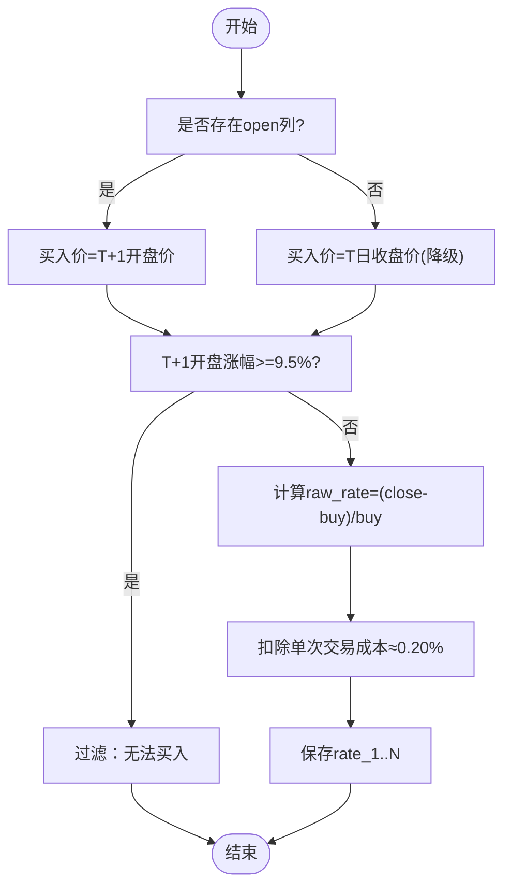
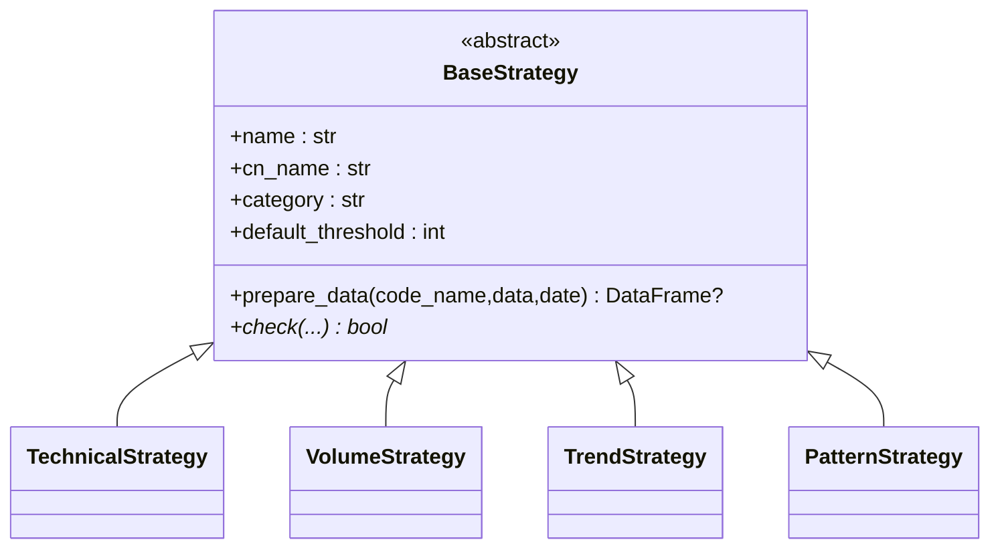
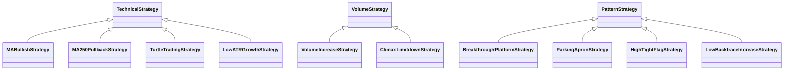
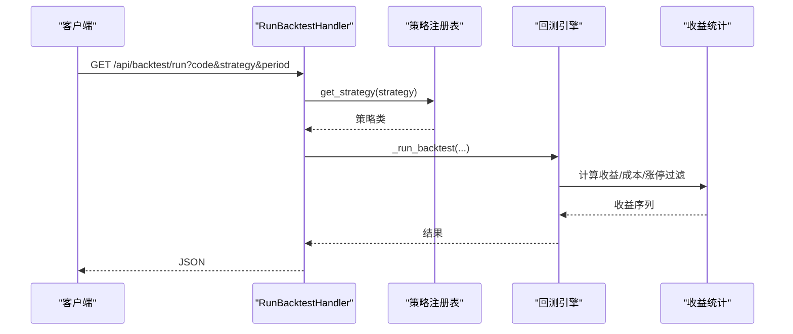
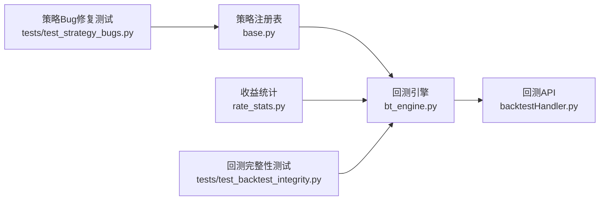

# 策略测试与验证

<cite>
**本文引用的文件**   
- [bt_engine.py](file://quantia/core/backtest/bt_engine.py)
- [rate_stats.py](file://quantia/core/backtest/rate_stats.py)
- [base.py](file://quantia/core/strategy/base.py)
- [__init__.py](file://quantia/core/strategy/__init__.py)
- [ma_strategies.py](file://quantia/core/strategy/technical/ma_strategies.py)
- [volume_strategies.py](file://quantia/core/strategy/volume/volume_strategies.py)
- [pattern_strategies.py](file://quantia/core/strategy/pattern/pattern_strategies.py)
- [backtestHandler.py](file://quantia/web/backtestHandler.py)
- [test_backtest_integrity.py](file://tests/test_backtest_integrity.py)
- [test_strategy_bugs.py](file://tests/test_strategy_bugs.py)
- [README.md](file://README.md)
- [API_REFERENCE.md](file://document/API_REFERENCE.md)
- [strategy README.md](file://quantia/core/strategy/README.md)
</cite>

## 目录
1. [引言](#引言)
2. [项目结构](#项目结构)
3. [核心组件](#核心组件)
4. [架构总览](#架构总览)
5. [组件详解](#组件详解)
6. [依赖关系分析](#依赖关系分析)
7. [性能考量](#性能考量)
8. [故障排查指南](#故障排查指南)
9. [结论](#结论)
10. [附录](#附录)

## 引言
本指南面向开发者与量化研究者，系统阐述如何在本项目中开展策略测试与验证。内容涵盖策略测试的重要性、测试数据准备、回测框架使用、策略验证方法论、性能与风险指标计算、单元与集成测试设计、压力测试实施、策略优化与参数调优、过拟合规避等，帮助你构建稳定可靠的自定义策略。

## 项目结构
本项目围绕“策略—回测—验证—前端看板”的闭环展开：
- 策略层：技术、成交量、形态等策略模块，统一基类与注册机制
- 回测层：封装Backtrader引擎、信号策略、收益计算与统计
- Web层：回测API与看板接口，支持单股与批量回测
- 测试层：单元测试覆盖回测规则、交易成本、边界条件与策略Bug修复

**图示来源**
- [base.py](file://quantia/core/strategy/base.py#L20-L96)
- [ma_strategies.py](file://quantia/core/strategy/technical/ma_strategies.py#L22-L55)
- [volume_strategies.py](file://quantia/core/strategy/volume/volume_strategies.py#L19-L68)
- [pattern_strategies.py](file://quantia/core/strategy/pattern/pattern_strategies.py#L22-L77)
- [bt_engine.py](file://quantia/core/backtest/bt_engine.py#L101-L214)
- [rate_stats.py](file://quantia/core/backtest/rate_stats.py#L34-L107)
- [backtestHandler.py](file://quantia/web/backtestHandler.py#L82-L126)
- [test_backtest_integrity.py](file://tests/test_backtest_integrity.py#L68-L136)
- [test_strategy_bugs.py](file://tests/test_strategy_bugs.py#L65-L96)

**章节来源**
- [README.md](file://README.md#L185-L194)
- [strategy README.md](file://quantia/core/strategy/README.md#L1-L26)

## 核心组件
- 策略基类与注册：统一check接口、数据预处理、策略分类与注册表
- 技术/成交量/形态策略：具体策略实现与OOP封装
- 回测引擎：Backtrader适配、信号策略、分析器与绘图
- 收益统计：交易成本、涨停过滤、T+1开盘价买入、N日收益序列
- Web回测API：单股回测、批量回测、看板接口
- 测试体系：回测规则、交易成本、边界条件、策略Bug修复

**章节来源**
- [base.py](file://quantia/core/strategy/base.py#L20-L96)
- [ma_strategies.py](file://quantia/core/strategy/technical/ma_strategies.py#L22-L55)
- [volume_strategies.py](file://quantia/core/strategy/volume/volume_strategies.py#L19-L68)
- [pattern_strategies.py](file://quantia/core/strategy/pattern/pattern_strategies.py#L22-L77)
- [bt_engine.py](file://quantia/core/backtest/bt_engine.py#L101-L214)
- [rate_stats.py](file://quantia/core/backtest/rate_stats.py#L34-L107)
- [backtestHandler.py](file://quantia/web/backtestHandler.py#L82-L126)
- [test_backtest_integrity.py](file://tests/test_backtest_integrity.py#L68-L136)
- [test_strategy_bugs.py](file://tests/test_strategy_bugs.py#L65-L96)

## 架构总览
回测验证从Web接口进入，经策略注册与调用，调用回测引擎，回测引擎使用收益统计模块计算收益并产出分析结果，最终通过API返回给前端看板。

**图示来源**
- [backtestHandler.py](file://quantia/web/backtestHandler.py#L166-L289)
- [base.py](file://quantia/core/strategy/base.py#L173-L185)
- [bt_engine.py](file://quantia/core/backtest/bt_engine.py#L181-L207)
- [rate_stats.py](file://quantia/core/backtest/rate_stats.py#L34-L107)

## 组件详解

### 回测引擎与信号策略
- Backtrader适配：自定义PandasData、SignalStrategy（按信号日期买入、按持仓天数卖出、仓位比例）
- 回测引擎：初始化资金、佣金、滑点；添加数据与策略；运行并提取分析器（夏普比率、最大回撤、收益、交易分析）
- 策略回测器：批量回测策略，收集信号并统计

**图示来源**
- [bt_engine.py](file://quantia/core/backtest/bt_engine.py#L101-L214)
- [bt_engine.py](file://quantia/core/backtest/bt_engine.py#L217-L307)

**章节来源**
- [bt_engine.py](file://quantia/core/backtest/bt_engine.py#L101-L214)
- [bt_engine.py](file://quantia/core/backtest/bt_engine.py#L217-L307)

### 收益统计与交易成本
- 交易成本：佣金、印花税、滑点，统一扣除
- T+1开盘价买入：修正历史版本使用T日收盘价的问题
- 涨停过滤：T+1开盘涨幅≥9.5%视为涨停无法买入
- 收益序列：从T+1开始，N日持有收益，扣除单次交易成本

**图示来源**
- [rate_stats.py](file://quantia/core/backtest/rate_stats.py#L34-L107)
- [test_backtest_integrity.py](file://tests/test_backtest_integrity.py#L68-L136)

**章节来源**
- [rate_stats.py](file://quantia/core/backtest/rate_stats.py#L11-L31)
- [rate_stats.py](file://quantia/core/backtest/rate_stats.py#L34-L107)
- [test_backtest_integrity.py](file://tests/test_backtest_integrity.py#L68-L136)

### 策略基类与注册
- BaseStrategy：抽象check接口、数据预处理、阈值控制
- Technical/Volume/Trend/Pattern策略基类：提供指标计算工具
- 策略注册：装饰器注册、按名称获取、按分类筛选

**图示来源**
- [base.py](file://quantia/core/strategy/base.py#L20-L96)
- [base.py](file://quantia/core/strategy/base.py#L99-L153)

**章节来源**
- [base.py](file://quantia/core/strategy/base.py#L20-L96)
- [base.py](file://quantia/core/strategy/base.py#L155-L202)

### 典型策略实现
- 技术策略：均线多头、回踩年线、海龟交易、低ATR成长
- 成交量策略：放量上涨、放量跌停
- 形态策略：突破平台、停机坪、高而窄旗形、无大幅回撤

**图示来源**
- [ma_strategies.py](file://quantia/core/strategy/technical/ma_strategies.py#L22-L55)
- [ma_strategies.py](file://quantia/core/strategy/technical/ma_strategies.py#L58-L137)
- [ma_strategies.py](file://quantia/core/strategy/technical/ma_strategies.py#L140-L211)
- [volume_strategies.py](file://quantia/core/strategy/volume/volume_strategies.py#L19-L68)
- [volume_strategies.py](file://quantia/core/strategy/volume/volume_strategies.py#L71-L112)
- [pattern_strategies.py](file://quantia/core/strategy/pattern/pattern_strategies.py#L22-L77)
- [pattern_strategies.py](file://quantia/core/strategy/pattern/pattern_strategies.py#L80-L148)
- [pattern_strategies.py](file://quantia/core/strategy/pattern/pattern_strategies.py#L151-L203)
- [pattern_strategies.py](file://quantia/core/strategy/pattern/pattern_strategies.py#L206-L250)

**章节来源**
- [ma_strategies.py](file://quantia/core/strategy/technical/ma_strategies.py#L22-L211)
- [volume_strategies.py](file://quantia/core/strategy/volume/volume_strategies.py#L19-L112)
- [pattern_strategies.py](file://quantia/core/strategy/pattern/pattern_strategies.py#L22-L250)

### Web回测API与看板
- 单股回测：买入日选择、T+1开盘价、扣除成本、区间最高/最低、策略命中、关键指标
- 批量回测：从策略表读取记录或动态计算，聚合成功率、平均收益、分日明细
- 看板接口：跨策略总览、时间序列、明细、收益分布、买入-卖出配对

**图示来源**
- [backtestHandler.py](file://quantia/web/backtestHandler.py#L82-L126)
- [backtestHandler.py](file://quantia/web/backtestHandler.py#L166-L289)
- [base.py](file://quantia/core/strategy/base.py#L173-L185)
- [rate_stats.py](file://quantia/core/backtest/rate_stats.py#L34-L107)

**章节来源**
- [backtestHandler.py](file://quantia/web/backtestHandler.py#L82-L126)
- [backtestHandler.py](file://quantia/web/backtestHandler.py#L166-L289)
- [API_REFERENCE.md](file://document/API_REFERENCE.md#L437-L488)

## 依赖关系分析
- 策略层依赖策略基类与注册表，策略实现依赖指标计算工具
- 回测层依赖策略注册表与收益统计模块
- Web层依赖回测引擎与数据库/缓存数据
- 测试层覆盖回测规则、交易成本、边界条件与策略Bug修复

**图示来源**
- [base.py](file://quantia/core/strategy/base.py#L155-L202)
- [bt_engine.py](file://quantia/core/backtest/bt_engine.py#L101-L214)
- [rate_stats.py](file://quantia/core/backtest/rate_stats.py#L34-L107)
- [backtestHandler.py](file://quantia/web/backtestHandler.py#L82-L126)
- [test_backtest_integrity.py](file://tests/test_backtest_integrity.py#L68-L136)
- [test_strategy_bugs.py](file://tests/test_strategy_bugs.py#L65-L96)

**章节来源**
- [base.py](file://quantia/core/strategy/base.py#L155-L202)
- [bt_engine.py](file://quantia/core/backtest/bt_engine.py#L101-L214)
- [rate_stats.py](file://quantia/core/backtest/rate_stats.py#L34-L107)
- [backtestHandler.py](file://quantia/web/backtestHandler.py#L82-L126)
- [test_backtest_integrity.py](file://tests/test_backtest_integrity.py#L68-L136)
- [test_strategy_bugs.py](file://tests/test_strategy_bugs.py#L65-L96)

## 性能考量
- 数据准备：前复权（qfq）缓存、幸存者偏差意识、策略表记录退市股票仍可回测
- 计算效率：指标计算基于TA-Lib与向量化pandas/numpy
- 并行处理：批量回测使用线程池并发处理股票
- 内存与IO：缓存文件命名含qfq标识，减少重复下载

**章节来源**
- [test_backtest_integrity.py](file://tests/test_backtest_integrity.py#L411-L426)
- [backtestHandler.py](file://quantia/web/backtestHandler.py#L540-L560)
- [strategy README.md](file://quantia/core/strategy/README.md#L1-L26)

## 故障排查指南
- 未来函数问题：确保使用T+1开盘价而非T日收盘价，避免使用未来数据
- 涨停过滤：T+1开盘涨幅≥9.5%直接过滤，避免无法买入
- 交易成本：统一扣除佣金、印花税、滑点，确保收益为负时体现真实摩擦
- 边界条件：仅T+1数据、无open列、下跌股票、除零保护
- 策略Bug：针对特定策略的除零与逻辑修复，确保不崩溃且行为一致

**章节来源**
- [test_backtest_integrity.py](file://tests/test_backtest_integrity.py#L68-L136)
- [test_strategy_bugs.py](file://tests/test_strategy_bugs.py#L109-L141)
- [test_strategy_bugs.py](file://tests/test_strategy_bugs.py#L147-L165)
- [test_strategy_bugs.py](file://tests/test_strategy_bugs.py#L171-L198)

## 结论
通过统一的策略基类与注册机制、严谨的回测引擎与收益统计、完善的Web回测API与看板，以及覆盖回测规则、交易成本与策略Bug的测试体系，本项目为策略研发提供了可靠验证通道。遵循本文档的测试与验证方法，可显著提升策略质量与鲁棒性。

## 附录

### 策略验证方法论
- 数据准备：前复权缓存、幸存者偏差意识、信号日与执行日分离
- 规则校验：未来函数检测、交易成本、涨跌停过滤
- 绩效评估：N日收益序列、最大回撤、胜率、平均收益
- 稳健性：参数敏感性、跨时间窗口稳定性
- 工具集成：模块一致性、常量共享（交易成本）

**章节来源**
- [test_backtest_integrity.py](file://tests/test_backtest_integrity.py#L68-L136)
- [test_backtest_integrity.py](file://tests/test_backtest_integrity.py#L324-L371)
- [backtestHandler.py](file://quantia/web/backtestHandler.py#L376-L386)

### 性能与风险指标
- 收益指标：1/3/5/10/20日收益、区间最高/最低、最大回撤
- 风险指标：最大回撤、收益分布分箱统计
- 绩效指标：成功率、平均收益、胜率

**章节来源**
- [backtestHandler.py](file://quantia/web/backtestHandler.py#L253-L262)
- [API_REFERENCE.md](file://document/API_REFERENCE.md#L633-L667)

### 单元测试与集成测试
- 单元测试：回测规则、交易成本、边界条件、策略Bug修复
- 集成测试：Web回测API一致性、回测看板接口、批量回测聚合

**章节来源**
- [test_backtest_integrity.py](file://tests/test_backtest_integrity.py#L68-L136)
- [test_strategy_bugs.py](file://tests/test_strategy_bugs.py#L65-L96)
- [API_REFERENCE.md](file://document/API_REFERENCE.md#L437-L488)

### 压力测试实施
- 并发回测：批量回测使用线程池并发处理股票
- 数据规模：利用缓存与并行，提升大规模策略验证效率
- 资源监控：关注CPU/内存/IO瓶颈，必要时调整并发度

**章节来源**
- [backtestHandler.py](file://quantia/web/backtestHandler.py#L540-L560)

### 策略优化与参数调优
- 参数敏感性：对阈值、持有天数、仓位比例进行网格搜索
- 过拟合规避：跨时间窗口验证、样本外检验、滚动窗口回测
- 指标清洗：剔除异常值、平滑噪声、稳健统计

**章节来源**
- [README.md](file://README.md#L185-L194)
