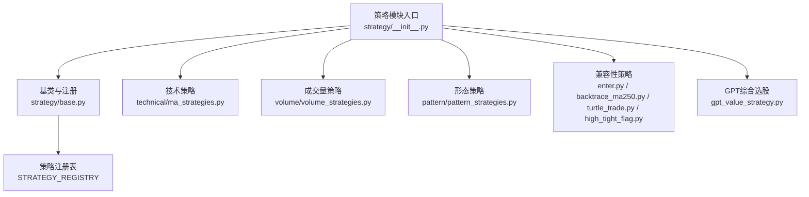
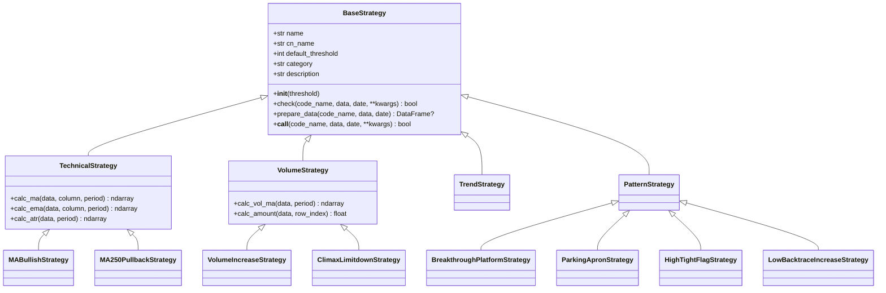
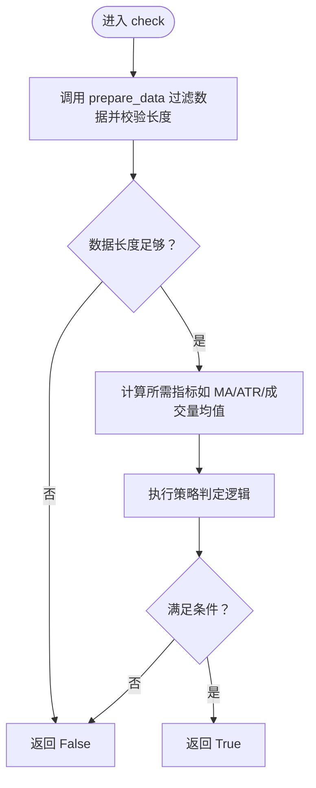
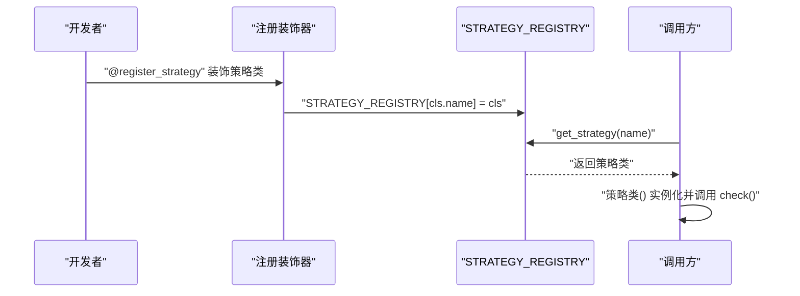
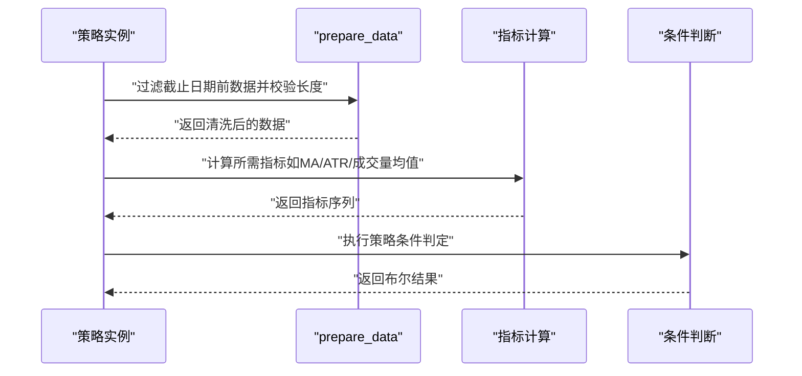
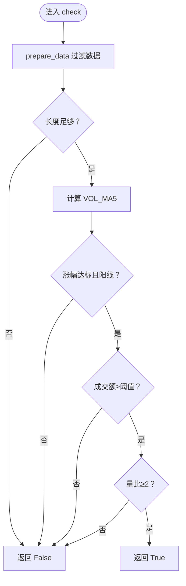
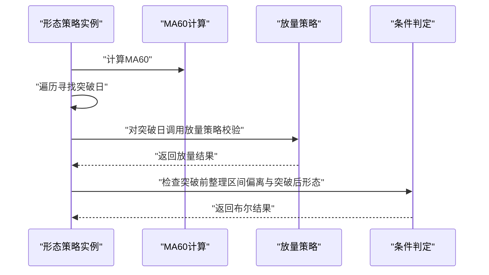
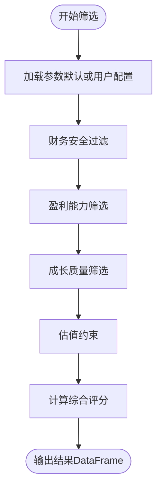
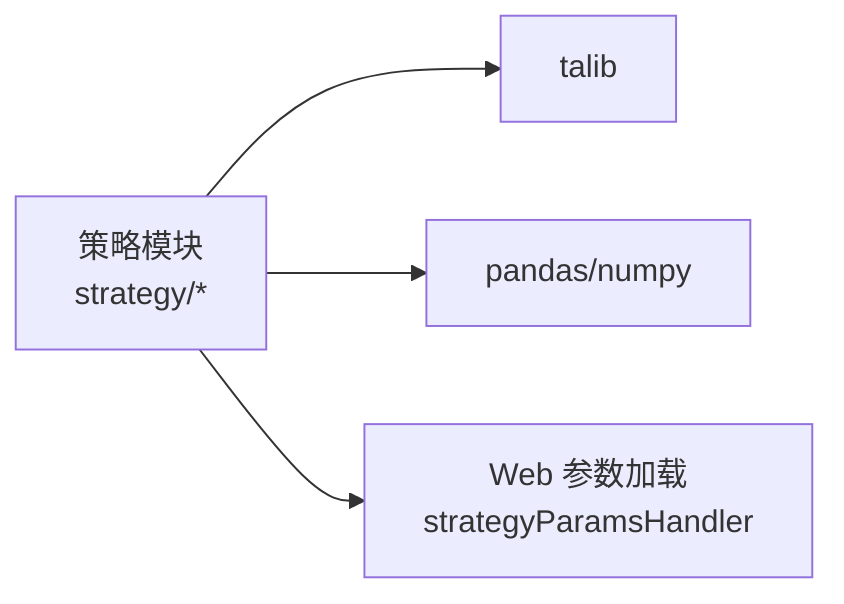

# 自定义策略开发

<cite>
**本文引用的文件**
- [策略基类与注册机制](file://quantia/core/strategy/base.py)
- [策略模块入口与导出](file://quantia/core/strategy/__init__.py)
- [策略目录与接口说明](file://quantia/core/strategy/README.md)
- [技术策略：均线与ATR](file://quantia/core/strategy/technical/ma_strategies.py)
- [成交量策略：放量与放量跌停](file://quantia/core/strategy/volume/volume_strategies.py)
- [形态策略：平台突破与旗形整理](file://quantia/core/strategy/pattern/pattern_strategies.py)
- [兼容性策略：回踩年线](file://quantia/core/strategy/backtrace_ma250.py)
- [兼容性策略：放量上涨](file://quantia/core/strategy/enter.py)
- [兼容性策略：海龟交易法则](file://quantia/core/strategy/turtle_trade.py)
- [兼容性策略：高而窄的旗形](file://quantia/core/strategy/high_tight_flag.py)
- [GPT综合选股策略](file://quantia/core/strategy/gpt_value_strategy.py)
- [策略映射与解析测试](file://tests/test_strategy_mapping.py)
</cite>

## 目录
1. [引言](#引言)
2. [项目结构](#项目结构)
3. [核心组件](#核心组件)
4. [架构总览](#架构总览)
5. [详细组件分析](#详细组件分析)
6. [依赖分析](#依赖分析)
7. [性能考虑](#性能考虑)
8. [故障排查指南](#故障排查指南)
9. [结论](#结论)
10. [附录](#附录)

## 引言
本指南面向希望在本项目中开发“自定义策略”的工程师，系统讲解策略基类设计、策略注册机制、策略分类体系，以及如何继承基类开发新策略、参数配置与验证方法。文档覆盖技术策略（均线、ATR）、成交量策略（放量、放量跌停）、形态策略（平台突破、旗形整理）等类型，并提供最佳实践、性能优化建议与测试验证方法，帮助开发者构建高效、稳定的自定义策略。

## 项目结构
策略系统位于 quantia/core/strategy 目录，采用“按功能域分包 + 基类 + 注册表”的组织方式：
- base.py：策略基类与注册表
- technical/：技术指标策略扩展
- volume/：成交量策略扩展
- pattern/：K线形态策略扩展
- fundamental/：基本面策略（扩展）
- README.md：策略目录、接口与注册说明
- __init__.py：模块导出与兼容性导入
- 多个兼容性策略文件（如 enter.py、backtrace_ma250.py 等）

**图表来源**
- [策略模块入口与导出](file://quantia/core/strategy/__init__.py#L30-L119)
- [策略基类与注册机制](file://quantia/core/strategy/base.py#L155-L202)
- [技术策略：均线与ATR](file://quantia/core/strategy/technical/ma_strategies.py#L1-L237)
- [成交量策略：放量与放量跌停](file://quantia/core/strategy/volume/volume_strategies.py#L1-L126)
- [形态策略：平台突破与旗形整理](file://quantia/core/strategy/pattern/pattern_strategies.py#L1-L276)
- [兼容性策略：放量上涨](file://quantia/core/strategy/enter.py#L1-L61)
- [兼容性策略：回踩年线](file://quantia/core/strategy/backtrace_ma250.py#L1-L92)
- [兼容性策略：海龟交易法则](file://quantia/core/strategy/turtle_trade.py#L1-L38)
- [兼容性策略：高而窄的旗形](file://quantia/core/strategy/high_tight_flag.py#L1-L50)
- [GPT综合选股策略](file://quantia/core/strategy/gpt_value_strategy.py#L1-L318)

**章节来源**
- [策略模块入口与导出](file://quantia/core/strategy/__init__.py#L1-L119)
- [策略目录与接口说明](file://quantia/core/strategy/README.md#L1-L146)

## 核心组件
- 策略基类与分类
  - BaseStrategy：抽象基类，定义统一的 check 接口、数据准备 prepare_data、调用入口 __call__，并提供默认阈值与描述信息。
  - TechnicalStrategy/VolumeStrategy/TrendStrategy/PatternStrategy：按策略领域划分的子基类，提供常用指标计算工具（如 MA、EMA、ATR、成交量均值等）。
- 策略注册机制
  - register_strategy：装饰器，将策略类注册到 STRATEGY_REGISTRY。
  - get_strategy/get_all_strategies/get_strategies_by_category：注册表查询接口。
- 策略命名与分类
  - name/cn_name/category/description：策略元信息，便于前端展示与分类检索。

**章节来源**
- [策略基类与注册机制](file://quantia/core/strategy/base.py#L20-L202)

## 架构总览
策略系统通过“基类 + 子基类 + 注册表 + 模块导出”的方式实现：
- 开发者继承相应基类，实现 check 方法；
- 使用 @register_strategy 装饰器完成注册；
- 通过 __init__.py 统一导出，支持多种使用方式（类实例、兼容函数、注册表）；
- README 提供策略分类、接口规范与注册流程。

**图表来源**
- [策略基类与注册机制](file://quantia/core/strategy/base.py#L20-L202)
- [技术策略：均线与ATR](file://quantia/core/strategy/technical/ma_strategies.py#L22-L237)
- [成交量策略：放量与放量跌停](file://quantia/core/strategy/volume/volume_strategies.py#L19-L126)
- [形态策略：平台突破与旗形整理](file://quantia/core/strategy/pattern/pattern_strategies.py#L22-L276)

## 详细组件分析

### 策略基类设计与继承
- 继承关系
  - 新策略优先继承 TechnicalStrategy/VolumeStrategy/PatternStrategy/TrendStrategy，以复用指标计算工具；
  - 若策略不属于上述领域，直接继承 BaseStrategy。
- 关键职责
  - check：实现具体选股逻辑；
  - prepare_data：按截止日期裁剪数据并校验最小长度；
  - __call__：允许策略实例直接调用。
- 参数与元信息
  - name/cn_name：策略唯一标识与中文名；
  - default_threshold：默认数据长度阈值；
  - category/description：分类与描述，便于前端展示与筛选。

**图表来源**
- [策略基类与注册机制](file://quantia/core/strategy/base.py#L64-L96)
- [技术策略：均线与ATR](file://quantia/core/strategy/technical/ma_strategies.py#L36-L55)
- [成交量策略：放量与放量跌停](file://quantia/core/strategy/volume/volume_strategies.py#L34-L68)

**章节来源**
- [策略基类与注册机制](file://quantia/core/strategy/base.py#L20-L96)

### 策略注册机制与查询
- 注册
  - 使用 @register_strategy 装饰器将策略类注册到 STRATEGY_REGISTRY；
  - 策略类需提供 name 属性，作为注册键。
- 查询
  - get_strategy(name)：按名称获取策略类；
  - get_all_strategies()：获取全部注册策略副本；
  - get_strategies_by_category(category)：按分类过滤策略字典。

**图表来源**
- [策略基类与注册机制](file://quantia/core/strategy/base.py#L155-L191)

**章节来源**
- [策略基类与注册机制](file://quantia/core/strategy/base.py#L155-L191)

### 策略分类体系
- 技术策略（category="technical"）
  - 示例：MABullishStrategy、MA250PullbackStrategy、TurtleTradingStrategy、LowATRGrowthStrategy。
- 成交量策略（category="volume"）
  - 示例：VolumeIncreaseStrategy、ClimaxLimitdownStrategy。
- 形态策略（category="pattern"）
  - 示例：BreakthroughPlatformStrategy、ParkingApronStrategy、HighTightFlagStrategy、LowBacktraceIncreaseStrategy。
- 其他策略（category="other/fundamental" 等）
  - 示例：GPT综合选股策略（fundamental 类别）。

**章节来源**
- [策略基类与注册机制](file://quantia/core/strategy/base.py#L99-L153)
- [技术策略：均线与ATR](file://quantia/core/strategy/technical/ma_strategies.py#L22-L237)
- [成交量策略：放量与放量跌停](file://quantia/core/strategy/volume/volume_strategies.py#L19-L126)
- [形态策略：平台突破与旗形整理](file://quantia/core/strategy/pattern/pattern_strategies.py#L22-L276)
- [GPT综合选股策略](file://quantia/core/strategy/gpt_value_strategy.py#L1-L318)

### 技术策略开发示例
- 均线多头策略（MABullishStrategy）
  - 条件要点：MA30连续上升且涨幅超阈值；
  - 实现要点：使用 TechnicalStrategy.calc_ma 计算 MA30，按阈值取尾部窗口，比较分段均线大小与涨幅。
- 回踩年线策略（MA250PullbackStrategy）
  - 条件要点：突破250日均线后回踩不破，缩量整理，区间日期差在限定范围；
  - 实现要点：先计算MA250，再分前后两段分别校验，最后计算量比与回撤比例。
- 海龟交易法则（TurtleTradingStrategy）
  - 条件要点：当日收盘价达到最近N日最高价；
  - 实现要点：取窗口最高价并与当日收盘价比较。
- 低ATR成长策略（LowATRGrowthStrategy）
  - 条件要点：ATR占比低且120日涨幅达标；
  - 实现要点：使用 TechnicalStrategy.calc_atr 计算ATR，比较ATR/价格比例与窗口首尾价格涨幅。

**图表来源**
- [技术策略：均线与ATR](file://quantia/core/strategy/technical/ma_strategies.py#L36-L55)
- [技术策略：均线与ATR](file://quantia/core/strategy/technical/ma_strategies.py#L73-L137)
- [技术策略：均线与ATR](file://quantia/core/strategy/technical/ma_strategies.py#L153-L166)
- [技术策略：均线与ATR](file://quantia/core/strategy/technical/ma_strategies.py#L183-L211)

**章节来源**
- [技术策略：均线与ATR](file://quantia/core/strategy/technical/ma_strategies.py#L22-L237)

### 成交量策略开发示例
- 放量上涨策略（VolumeIncreaseStrategy）
  - 条件要点：当日涨幅达标、阳线、成交额达标、量比≥2；
  - 实现要点：计算 VOL_MA5，比较当日成交量与均量，同时计算成交额。
- 放量跌停策略（ClimaxLimitdownStrategy）
  - 条件要点：当日跌停且量比放大；
  - 实现要点：判断跌幅接近跌停阈值，计算量比。

**图表来源**
- [成交量策略：放量与放量跌停](file://quantia/core/strategy/volume/volume_strategies.py#L34-L68)

**章节来源**
- [成交量策略：放量与放量跌停](file://quantia/core/strategy/volume/volume_strategies.py#L19-L126)

### 形态策略开发示例
- 突破平台策略（BreakthroughPlatformStrategy）
  - 条件要点：某日收盘价站上60日均线且当日放量上涨，此前某阶段收盘价与均线偏离在目标区间；
  - 实现要点：先计算MA60，遍历寻找满足条件的突破日，再借助 VolumeIncreaseStrategy 校验放量。
- 停机坪策略（ParkingApronStrategy）
  - 条件要点：涨停后横盘整理，随后几个交易日高开高走且振幅受限；
  - 实现要点：先定位涨停日，再调用 TurtleTradingStrategy 校验涨停当日，最后检查整理期内的K线形态与涨跌幅。
- 高而窄的旗形（HighTightFlagStrategy）
  - 条件要点：近期快速上涨后窄幅整理，当日收盘价相对区间最低价涨幅达标，且连续两日涨幅达标；
  - 实现要点：计算区间最低价与当日收盘价比值，遍历检查连续两日涨幅。
- 无大幅回撤（LowBacktraceIncreaseStrategy）
  - 条件要点：窗口涨幅达标，期间单日跌幅、高开低走、两日累计跌幅与高开低走累计跌幅均受控；
  - 实现要点：遍历窗口，累计检查各类回撤约束。

**图表来源**
- [形态策略：平台突破与旗形整理](file://quantia/core/strategy/pattern/pattern_strategies.py#L37-L77)
- [形态策略：平台突破与旗形整理](file://quantia/core/strategy/pattern/pattern_strategies.py#L95-L148)
- [形态策略：平台突破与旗形整理](file://quantia/core/strategy/pattern/pattern_strategies.py#L167-L203)
- [形态策略：平台突破与旗形整理](file://quantia/core/strategy/pattern/pattern_strategies.py#L220-L250)

**章节来源**
- [形态策略：平台突破与旗形整理](file://quantia/core/strategy/pattern/pattern_strategies.py#L22-L276)

### 基本面策略与GPT综合选股
- GPT综合选股策略（gpt_value_strategy）
  - 接口：check_gpt_value_from_selection(stock_row, params) 与 filter_gpt_value_stocks(selection_data)；
  - 分层筛选：财务安全、盈利能力、成长质量、估值约束；
  - 评分：compute_gpt_score 计算综合评分；
  - 参数：支持从 Web 端加载用户配置，失败时回退默认值。

**图表来源**
- [GPT综合选股策略](file://quantia/core/strategy/gpt_value_strategy.py#L79-L167)
- [GPT综合选股策略](file://quantia/core/strategy/gpt_value_strategy.py#L169-L199)
- [GPT综合选股策略](file://quantia/core/strategy/gpt_value_strategy.py#L221-L317)

**章节来源**
- [GPT综合选股策略](file://quantia/core/strategy/gpt_value_strategy.py#L1-L318)

### 策略参数配置与验证
- 参数来源
  - 策略类内部 params 字典（如价值/成长/护城河策略）；
  - GPT策略通过 _load_params 从 Web 端加载用户配置，失败回退默认值。
- 验证方法
  - 数值有效性检查：使用 _is_valid_number 排除 None、NaN、无穷；
  - 分层阈值校验：逐项对比指标与阈值；
  - 综合评分：按权重累加，形成最终评分。

**章节来源**
- [GPT综合选股策略](file://quantia/core/strategy/gpt_value_strategy.py#L46-L53)
- [GPT综合选股策略](file://quantia/core/strategy/gpt_value_strategy.py#L93-L166)

### 开发新策略最佳实践
- 继承选择
  - 优先继承对应领域基类（TechnicalStrategy/VolumeStrategy/PatternStrategy），以复用指标工具；
  - 明确 category 与 name/cn_name，保证注册与前端展示一致。
- 数据准备
  - 使用 prepare_data 按截止日期裁剪数据并校验长度；
  - 对缺失值进行处理（如 NaN 填充或跳过）。
- 条件设计
  - 将复杂条件拆分为多个子条件，提高可读性与可维护性；
  - 对窗口长度与阈值进行边界测试。
- 性能优化
  - 使用向量化计算（如 talib）替代循环；
  - 避免重复计算相同指标，缓存中间结果；
  - 严格控制窗口大小，减少不必要的数据拷贝。
- 可测试性
  - 提供兼容函数（如 check_volume）以便旧接口迁移；
  - 编写单元测试，覆盖正常路径与边界条件。

**章节来源**
- [策略基类与注册机制](file://quantia/core/strategy/base.py#L64-L96)
- [技术策略：均线与ATR](file://quantia/core/strategy/technical/ma_strategies.py#L36-L55)
- [成交量策略：放量与放量跌停](file://quantia/core/strategy/volume/volume_strategies.py#L34-L68)
- [形态策略：平台突破与旗形整理](file://quantia/core/strategy/pattern/pattern_strategies.py#L37-L77)

## 依赖分析
- 模块耦合
  - 策略模块通过 __init__.py 统一导出，降低上层调用方的导入复杂度；
  - 形态策略内部可复用其他策略（如 VolumeIncreaseStrategy、TurtleTradingStrategy）。
- 外部依赖
  - talib：技术指标计算；
  - pandas/numpy：数据处理与向量化运算；
  - Web 参数加载：GPT策略从 Web 端加载用户配置。

**图表来源**
- [技术策略：均线与ATR](file://quantia/core/strategy/technical/ma_strategies.py#L13-L16)
- [成交量策略：放量与放量跌停](file://quantia/core/strategy/volume/volume_strategies.py#L11-L13)
- [形态策略：平台突破与旗形整理](file://quantia/core/strategy/pattern/pattern_strategies.py#L13-L16)
- [GPT综合选股策略](file://quantia/core/strategy/gpt_value_strategy.py#L46-L53)

**章节来源**
- [策略模块入口与导出](file://quantia/core/strategy/__init__.py#L30-L119)

## 性能考虑
- 向量化优先：尽量使用 talib 与 pandas 的向量化操作，避免逐行循环；
- 数据裁剪：利用 prepare_data 限制窗口长度，减少计算量；
- 指标复用：同一数据多次使用时，先计算并缓存指标，避免重复计算；
- 内存管理：及时释放中间变量，避免大对象长期持有；
- 批量处理：对大量股票进行筛选时，优先使用 DataFrame 的 apply/filter，减少 Python 循环。

## 故障排查指南
- 策略未注册
  - 现象：通过 get_strategy(name) 抛出未注册异常；
  - 排查：确认 @register_strategy 已装饰策略类，且 name 属性正确设置。
- 数据长度不足
  - 现象：check 返回 False；
  - 排查：检查 default_threshold 与 prepare_data 过滤后的长度。
- 指标计算异常
  - 现象：NaN 导致逻辑异常；
  - 排查：对 talib 输出进行 NaN 处理（如填零），或在策略中跳过无效值。
- GPT策略参数加载失败
  - 现象：筛选结果不符合预期；
  - 排查：确认 Web 端参数已正确下发，必要时回退默认参数。

**章节来源**
- [策略基类与注册机制](file://quantia/core/strategy/base.py#L173-L185)
- [GPT综合选股策略](file://quantia/core/strategy/gpt_value_strategy.py#L46-L53)

## 结论
本策略系统通过清晰的基类设计、完善的注册机制与明确的分类体系，为开发者提供了可扩展、可维护的策略开发框架。遵循本文的最佳实践与性能建议，开发者可以快速实现高质量的自定义策略，并通过统一的注册与查询接口融入现有系统。

## 附录
- 策略接口规范
  - 标准接口：check(code_name, data, date=None, threshold=60)；
  - GPT接口：check_gpt_value_from_selection(stock_row, params=None)、filter_gpt_value_stocks(selection_data)。
- 策略注册流程
  - 在策略文件中实现 check，使用 @register_strategy 装饰，确保 name 唯一；
  - 在 __init__.py 中导出策略类，便于上层模块统一访问。

**章节来源**
- [策略目录与接口说明](file://quantia/core/strategy/README.md#L65-L146)
- [策略模块入口与导出](file://quantia/core/strategy/__init__.py#L66-L118)
