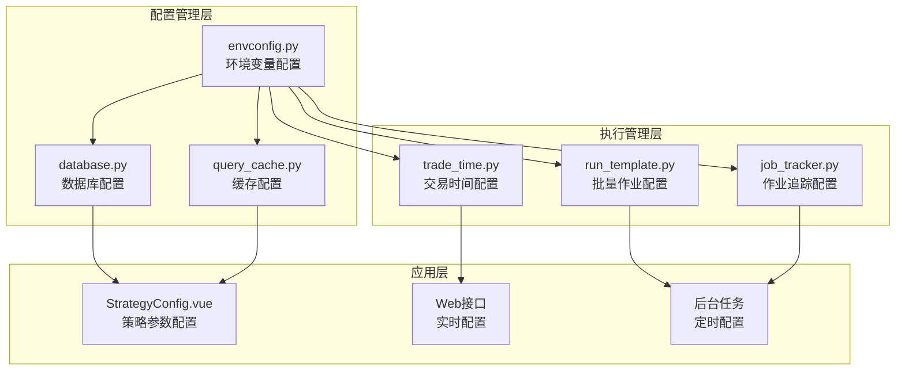
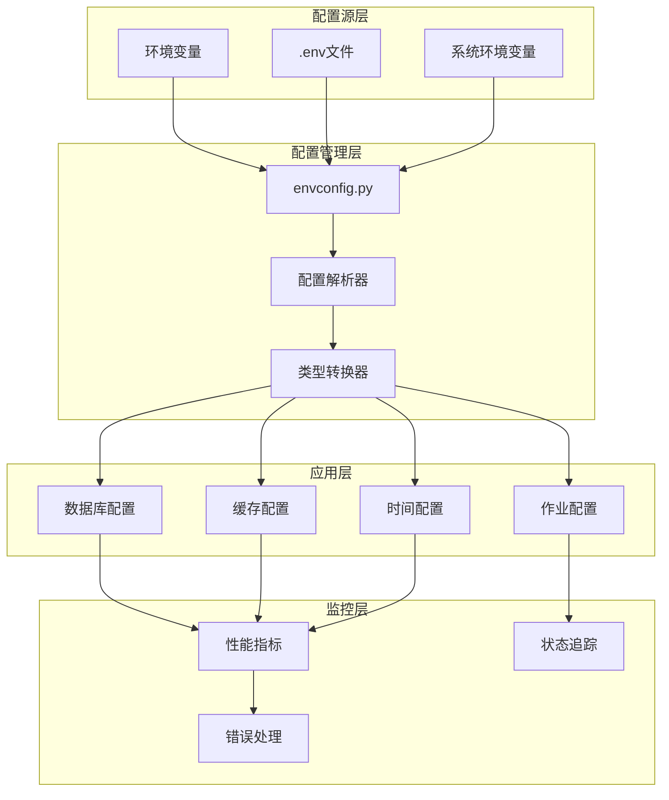
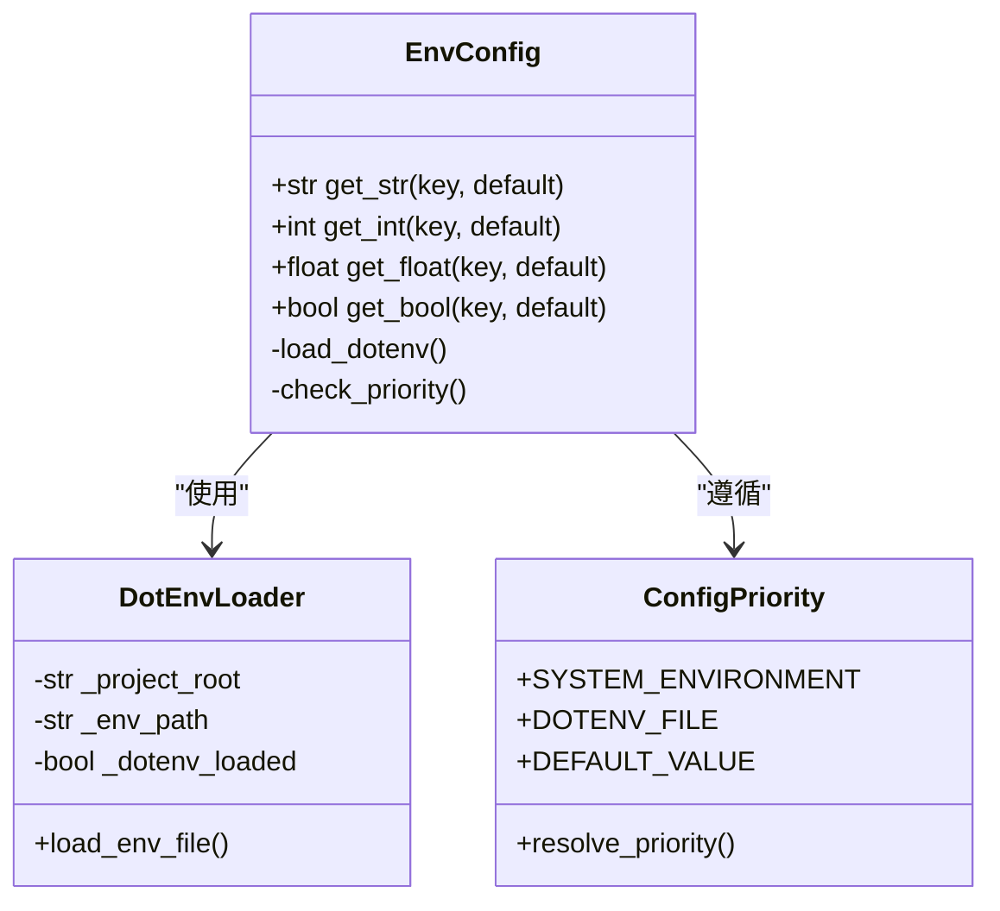
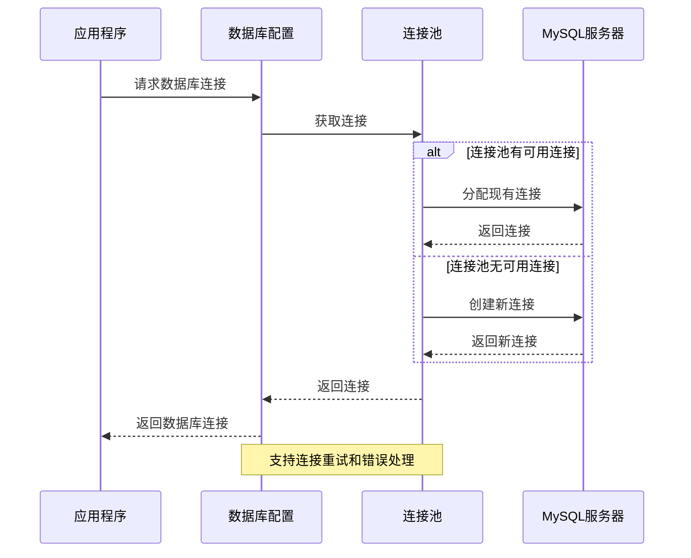
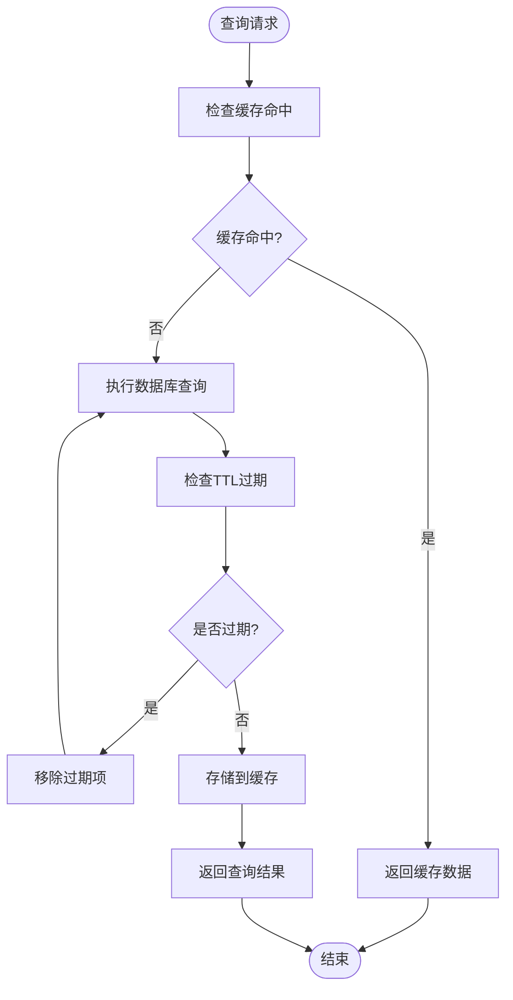
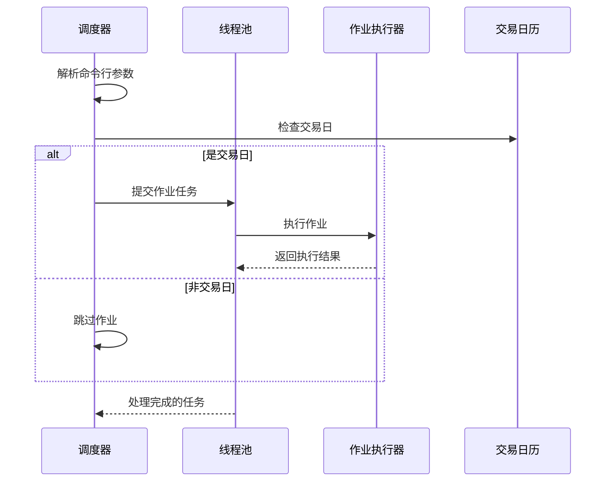
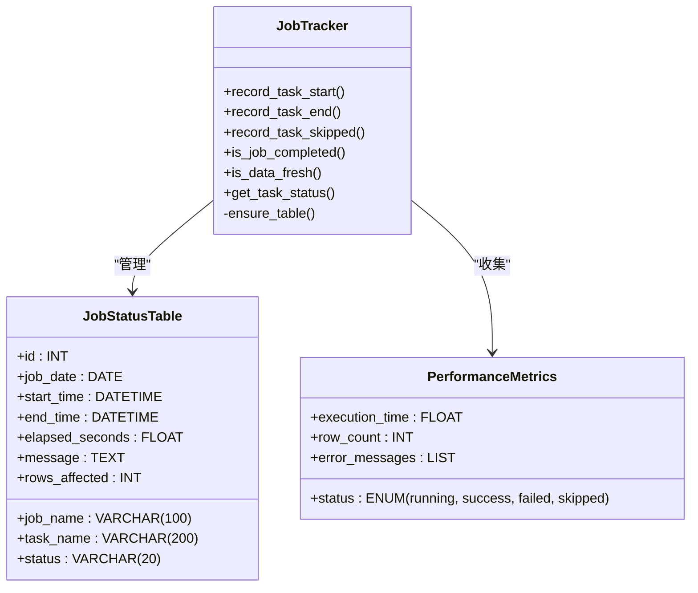
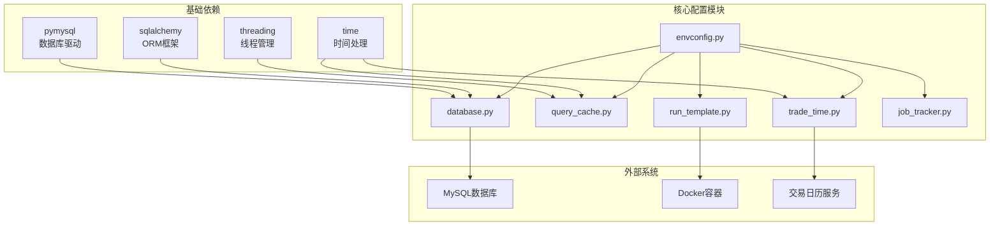
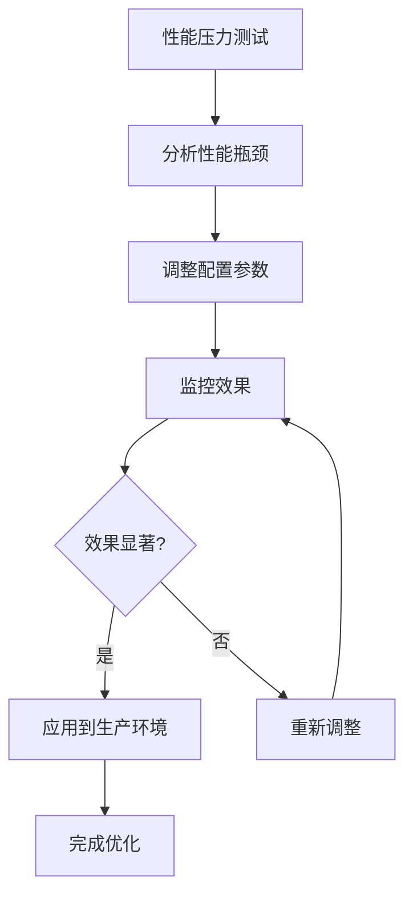

# 性能参数配置系统

<cite>
**本文档引用的文件**
- [envconfig.py](file://quantia/lib/envconfig.py)
- [database.py](file://quantia/lib/database.py)
- [query_cache.py](file://quantia/lib/query_cache.py)
- [run_template.py](file://quantia/lib/run_template.py)
- [trade_time.py](file://quantia/lib/trade_time.py)
- [job_tracker.py](file://quantia/lib/job_tracker.py)
- [.env 示例](file://docker/stock/quantia/config/.env)
</cite>

## 目录
1. [简介](#简介)
2. [项目结构](#项目结构)
3. [核心组件](#核心组件)
4. [架构概览](#架构概览)
5. [详细组件分析](#详细组件分析)
6. [依赖关系分析](#依赖关系分析)
7. [性能配置参数详解](#性能配置参数详解)
8. [性能优化策略](#性能优化策略)
9. [故障排除指南](#故障排除指南)
10. [结论](#结论)

## 简介

性能参数配置系统是 Quantia 量化交易系统的核心基础设施，负责统一管理整个系统的性能相关配置参数。该系统采用集中式配置管理模式，通过环境变量和配置文件实现灵活的参数控制，支持数据库连接池优化、缓存策略配置、批量作业调度、交易时间管理等多个维度的性能调优。

系统主要特点包括：
- 集中式环境变量配置管理
- 线程安全的查询缓存机制
- 可扩展的数据库连接池配置
- 智能的批量作业调度参数
- 实时的作业状态追踪
- 灵活的交易时间窗口管理

## 项目结构

Quantia 项目的性能配置系统分布在多个核心模块中，形成了完整的配置管理体系：



**图表来源**
- [envconfig.py:1-83](file://quantia/lib/envconfig.py#L1-L83)
- [database.py:1-298](file://quantia/lib/database.py#L1-L298)
- [query_cache.py:1-157](file://quantia/lib/query_cache.py#L1-L157)

**章节来源**
- [envconfig.py:1-83](file://quantia/lib/envconfig.py#L1-L83)
- [database.py:1-298](file://quantia/lib/database.py#L1-L298)

## 核心组件

性能参数配置系统由五个核心组件构成，每个组件负责不同层面的性能配置管理：

### 1. 环境变量配置中心
提供类型安全的配置读取功能，支持字符串、整数、浮点数、布尔值等多种数据类型的配置管理。

### 2. 数据库连接池配置
实现可扩展的数据库连接池参数配置，包括连接数、超时时间、重试机制等关键性能参数。

### 3. 查询缓存配置
提供线程安全的LRU缓存机制，支持TTL过期策略和智能缓存淘汰算法。

### 4. 批量作业调度配置
实现灵活的批量作业执行参数配置，支持多线程并发控制和作业间隔管理。

### 5. 作业状态追踪配置
提供完整的作业执行状态监控和性能指标收集功能。

**章节来源**
- [envconfig.py:48-83](file://quantia/lib/envconfig.py#L48-L83)
- [database.py:20-65](file://quantia/lib/database.py#L20-L65)
- [query_cache.py:27-157](file://quantia/lib/query_cache.py#L27-L157)

## 架构概览

性能参数配置系统采用分层架构设计，实现了配置参数的统一管理和动态应用：



**图表来源**
- [envconfig.py:21-25](file://quantia/lib/envconfig.py#L21-L25)
- [database.py:20-47](file://quantia/lib/database.py#L20-L47)

## 详细组件分析

### 环境变量配置模块 (envconfig.py)

环境变量配置模块是整个性能配置系统的基础，提供了类型安全的配置读取功能：



**图表来源**
- [envconfig.py:48-83](file://quantia/lib/envconfig.py#L48-L83)
- [envconfig.py:32-45](file://quantia/lib/envconfig.py#L32-L45)

#### 配置优先级机制

系统采用三层配置优先级机制，确保配置的灵活性和可控性：

1. **系统环境变量** - 最高优先级，适用于Docker容器和生产环境
2. **.env文件** - 中等优先级，适用于开发和测试环境  
3. **代码默认值** - 最低优先级，提供基本的系统运行保障

**章节来源**
- [envconfig.py:21-25](file://quantia/lib/envconfig.py#L21-L25)
- [envconfig.py:39-45](file://quantia/lib/envconfig.py#L39-L45)

### 数据库连接池配置 (database.py)

数据库连接池配置模块实现了高性能的数据库连接管理机制：



**图表来源**
- [database.py:54-65](file://quantia/lib/database.py#L54-L65)
- [database.py:74-86](file://quantia/lib/database.py#L74-L86)

#### 连接池参数配置

| 参数名称 | 默认值 | 说明 | 性能影响 |
|---------|--------|------|----------|
| QUANTIA_DB_POOL_SIZE | 2 | 连接池大小 | 直接影响并发处理能力 |
| QUANTIA_DB_MAX_OVERFLOW | 3 | 最大溢出连接数 | 控制峰值负载能力 |
| QUANTIA_DB_POOL_RECYCLE | 600 | 连接回收时间(秒) | 防止连接泄漏 |
| QUANTIA_DB_POOL_TIMEOUT | 30 | 连接获取超时(秒) | 防止阻塞等待 |
| QUANTIA_DB_CONN_RETRIES | 3 | 连接重试次数 | 提高系统稳定性 |

**章节来源**
- [database.py:20-65](file://quantia/lib/database.py#L20-L65)
- [database.py:104-111](file://quantia/lib/database.py#L104-L111)

### 查询缓存配置 (query_cache.py)

查询缓存模块提供了高效的内存缓存机制，支持LRU淘汰策略和TTL过期管理：



**图表来源**
- [query_cache.py:51-70](file://quantia/lib/query_cache.py#L51-L70)
- [query_cache.py:114-121](file://quantia/lib/query_cache.py#L114-L121)

#### 缓存参数配置

| 参数名称 | 默认值 | 说明 | 性能影响 |
|---------|--------|------|----------|
| QUANTIA_CACHE_MAX_SIZE | 512 | 缓存最大条目数 | 决定内存占用 |
| QUANTIA_CACHE_TTL | 300 | 默认缓存过期时间(秒) | 影响数据新鲜度 |
| QUANTIA_FILTER_CACHE_MAX_SIZE | 128 | 筛选结果缓存大小 | 优化策略执行速度 |
| QUANTIA_FILTER_CACHE_TTL | 600 | 筛选结果缓存过期时间 | 平衡性能和准确性 |

**章节来源**
- [query_cache.py:27-157](file://quantia/lib/query_cache.py#L27-L157)

### 批量作业调度配置 (run_template.py)

批量作业调度模块实现了智能的多线程作业执行机制：



**图表来源**
- [run_template.py:47-63](file://quantia/lib/run_template.py#L47-L63)
- [run_template.py:89-98](file://quantia/lib/run_template.py#L89-L98)

#### 批量作业参数配置

| 参数名称 | 默认值 | 说明 | 性能影响 |
|---------|--------|------|----------|
| QUANTIA_BATCH_DATE_WORKERS | 3 | 批量日期作业工作线程数 | 控制并发程度 |
| 支持的执行模式 | 三种 | 单日、日期范围、指定日期列表 | 灵活的调度方式 |

**章节来源**
- [run_template.py:17](file://quantia/lib/run_template.py#L17)
- [run_template.py:39-98](file://quantia/lib/run_template.py#L39-L98)

### 作业状态追踪配置 (job_tracker.py)

作业状态追踪模块提供了完整的作业执行监控和性能分析功能：



**图表来源**
- [job_tracker.py:62-127](file://quantia/lib/job_tracker.py#L62-L127)
- [job_tracker.py:147-174](file://quantia/lib/job_tracker.py#L147-L174)

#### 作业追踪参数配置

| 参数名称 | 默认值 | 说明 | 监控价值 |
|---------|--------|------|----------|
| 作业状态表 | cn_job_status | 作业执行状态存储 | 完整的执行历史 |
| 状态字段 | running/success/failed/skipped | 作业执行状态 | 实时监控作业健康 |
| 性能指标 | 耗时、影响行数、消息 | 作业执行详情 | 性能分析和优化 |

**章节来源**
- [job_tracker.py:29-60](file://quantia/lib/job_tracker.py#L29-L60)
- [job_tracker.py:176-202](file://quantia/lib/job_tracker.py#L176-L202)

## 依赖关系分析

性能参数配置系统的依赖关系体现了清晰的分层架构设计：



**图表来源**
- [database.py:7-12](file://quantia/lib/database.py#L7-L12)
- [query_cache.py:15-20](file://quantia/lib/query_cache.py#L15-L20)

**章节来源**
- [database.py:14-15](file://quantia/lib/database.py#L14-L15)
- [query_cache.py:147-157](file://quantia/lib/query_cache.py#L147-L157)

## 性能配置参数详解

### 数据库性能参数

数据库性能参数直接影响系统的整体响应能力和稳定性：

#### 连接池配置参数

| 参数 | 默认值 | 最小值 | 最大值 | 推荐范围 | 说明 |
|------|--------|--------|--------|----------|------|
| QUANTIA_DB_POOL_SIZE | 2 | 1 | 10 | 2-5 | 连接池大小，影响并发处理 |
| QUANTIA_DB_MAX_OVERFLOW | 3 | 0 | 20 | 2-8 | 溢出连接数，处理峰值负载 |
| QUANTIA_DB_POOL_RECYCLE | 600 | 300 | 3600 | 300-1800 | 连接回收时间，防止连接泄漏 |
| QUANTIA_DB_POOL_TIMEOUT | 30 | 10 | 120 | 15-60 | 连接获取超时，防止阻塞 |

#### 超时配置参数

| 参数 | 默认值 | 最小值 | 最大值 | 说明 |
|------|--------|--------|--------|------|
| QUANTIA_DB_CONNECT_TIMEOUT | 10 | 5 | 60 | 连接建立超时 |
| QUANTIA_DB_READ_TIMEOUT | 30 | 15 | 120 | 读操作超时 |
| QUANTIA_DB_WRITE_TIMEOUT | 30 | 15 | 120 | 写操作超时 |

### 缓存性能参数

缓存系统通过合理的参数配置实现性能和准确性的平衡：

#### 通用缓存参数

| 参数 | 默认值 | 最小值 | 最大值 | 说明 |
|------|--------|--------|--------|------|
| QUANTIA_CACHE_MAX_SIZE | 512 | 64 | 2048 | 通用数据缓存大小 |
| QUANTIA_CACHE_TTL | 300 | 60 | 1800 | 通用数据缓存过期时间(秒) |

#### 策略缓存参数

| 参数 | 默认值 | 最小值 | 最大值 | 说明 |
|------|--------|--------|--------|------|
| QUANTIA_FILTER_CACHE_MAX_SIZE | 128 | 32 | 512 | 策略筛选结果缓存大小 |
| QUANTIA_FILTER_CACHE_TTL | 600 | 120 | 3600 | 策略结果缓存过期时间(秒) |

### 批量作业性能参数

批量作业系统通过参数化配置实现灵活的执行控制：

#### 并发控制参数

| 参数 | 默认值 | 最小值 | 最大值 | 说明 |
|------|--------|--------|--------|------|
| QUANTIA_BATCH_DATE_WORKERS | 3 | 1 | 10 | 批量作业并发线程数 |

#### 时间窗口参数

| 参数 | 默认值 | 最小值 | 最大值 | 说明 |
|------|--------|--------|--------|------|
| QUANTIA_SETTLEMENT_HOUR | 18 | 15 | 23 | 数据结算小时(24小时制) |

**章节来源**
- [database.py:20-47](file://quantia/lib/database.py#L20-L47)
- [query_cache.py:147-157](file://quantia/lib/query_cache.py#L147-L157)
- [run_template.py:17](file://quantia/lib/run_template.py#L17)
- [trade_time.py:13](file://quantia/lib/trade_time.py#L13)

## 性能优化策略

基于对性能参数配置系统的深入分析，提出以下优化策略：

### 1. 动态参数调整策略

系统支持运行时参数调整，建议根据实际负载情况进行动态优化：



### 2. 分层缓存优化策略

针对不同业务场景实施分层缓存策略：

- **高频查询缓存**：股票实时数据、技术指标计算结果
- **低频查询缓存**：基础财务数据、历史统计数据
- **策略结果缓存**：选股策略执行结果、回测数据

### 3. 连接池优化策略

根据系统负载特征优化数据库连接池配置：

- **峰值时段**：增加 QUANTIA_DB_POOL_SIZE 和 QUANTIA_DB_MAX_OVERFLOW
- **空闲时段**：降低连接池大小以节省资源
- **混合负载**：动态调整连接池参数适应负载变化

### 4. 缓存淘汰策略优化

实施智能的缓存淘汰策略：

- **LRU+TTL结合**：既保证热点数据的可用性，又控制内存使用
- **分区缓存**：按数据类型和访问频率划分缓存区域
- **预热机制**：在业务高峰期前预加载热点数据

**章节来源**
- [database.py:54-65](file://quantia/lib/database.py#L54-L65)
- [query_cache.py:27-157](file://quantia/lib/query_cache.py#L27-L157)

## 故障排除指南

### 常见性能问题及解决方案

#### 1. 数据库连接超时问题

**症状**：系统频繁出现数据库连接超时错误

**诊断步骤**：
1. 检查 QUANTIA_DB_POOL_SIZE 是否过小
2. 验证网络连接稳定性
3. 监控数据库服务器负载情况

**解决方案**：
```bash
# 增加连接池大小
export QUANTIA_DB_POOL_SIZE=5

# 延长超时时间
export QUANTIA_DB_POOL_TIMEOUT=60
export QUANTIA_DB_CONNECT_TIMEOUT=30
```

#### 2. 缓存命中率低问题

**症状**：缓存系统占用大量内存但性能提升有限

**诊断步骤**：
1. 检查缓存TTL设置是否合理
2. 分析热点数据分布情况
3. 评估缓存淘汰策略效果

**解决方案**：
```bash
# 优化缓存参数
export QUANTIA_CACHE_TTL=600
export QUANTIA_FILTER_CACHE_TTL=1200
export QUANTIA_CACHE_MAX_SIZE=1024
```

#### 3. 批量作业执行缓慢问题

**症状**：批量数据处理任务执行时间过长

**诊断步骤**：
1. 检查 QUANTIA_BATCH_DATE_WORKERS 配置
2. 分析作业间的依赖关系
3. 监控系统资源使用情况

**解决方案**：
```bash
# 调整并发度
export QUANTIA_BATCH_DATE_WORKERS=5

# 优化作业调度间隔
# 在作业执行代码中增加适当的延迟
```

#### 4. 交易时间判断错误问题

**症状**：系统在非交易时间仍尝试执行数据获取

**诊断步骤**：
1. 验证 QUANTIA_SETTLEMENT_HOUR 配置
2. 检查系统时区设置
3. 确认交易日历数据完整性

**解决方案**：
```bash
# 调整结算时间
export QUANTIA_SETTLEMENT_HOUR=19

# 验证系统时间同步
timedatectl status
```

### 性能监控指标

建议重点关注以下性能指标：

| 指标类型 | 关键指标 | 正常范围 | 监控频率 |
|----------|----------|----------|----------|
| 数据库性能 | 连接池利用率 | 60%-80% | 每分钟 |
| 缓存性能 | 命中率 | >70% | 每5分钟 |
| 作业性能 | 执行时间 | <10秒/任务 | 实时监控 |
| 系统资源 | CPU使用率 | <80% | 每分钟 |
| 系统资源 | 内存使用率 | <70% | 每分钟 |

**章节来源**
- [database.py:104-111](file://quantia/lib/database.py#L104-L111)
- [query_cache.py:124-136](file://quantia/lib/query_cache.py#L124-L136)
- [trade_time.py:190-229](file://quantia/lib/trade_time.py#L190-L229)

## 结论

Quantia 性能参数配置系统通过集中式的配置管理实现了对系统性能的全面控制。该系统具有以下优势：

1. **统一配置管理**：所有性能相关参数集中在统一的配置模块中，便于维护和调试
2. **灵活的参数调整**：支持运行时参数调整，能够适应不同的业务需求和环境条件
3. **完善的监控机制**：内置作业状态追踪和性能指标收集功能，便于系统监控和优化
4. **可扩展的设计**：模块化的架构设计支持功能扩展和定制化需求

通过合理配置和持续优化，该系统能够有效提升 Quantia 量化交易系统的性能表现，在保证系统稳定性的同时实现最佳的业务效果。建议定期进行性能评估和参数调优，确保系统始终处于最优运行状态。
