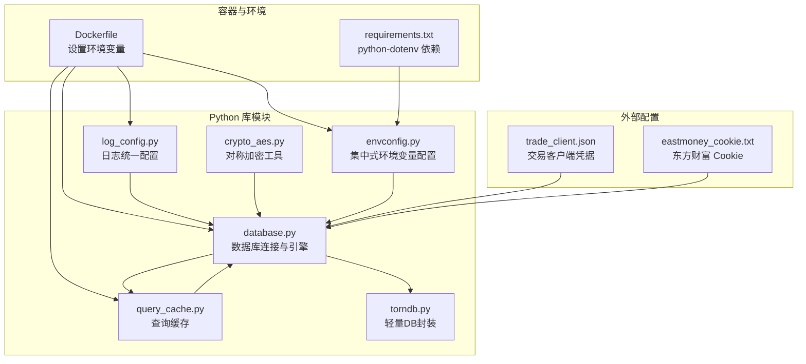
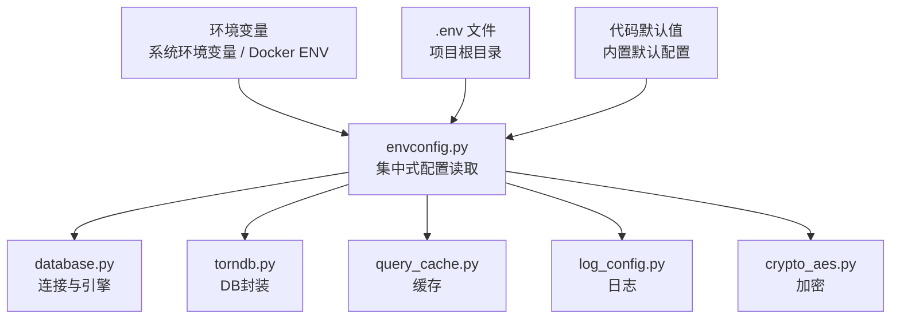
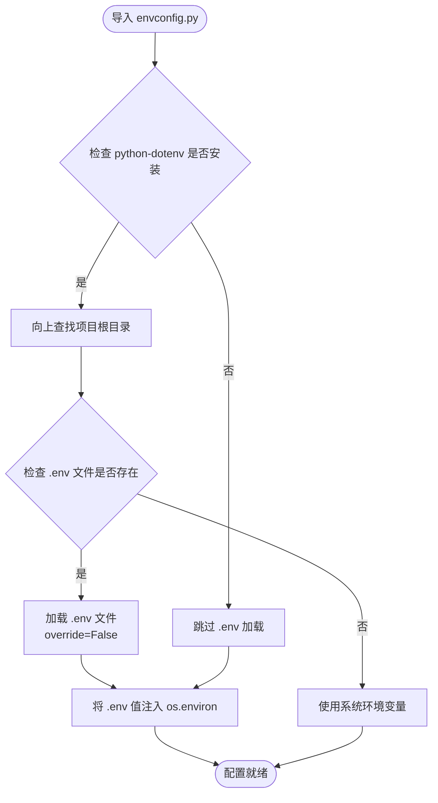
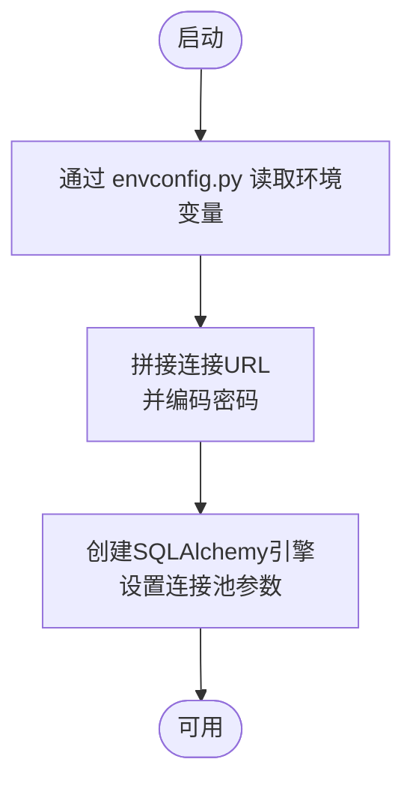
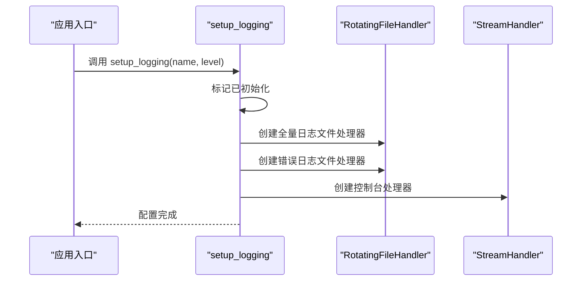
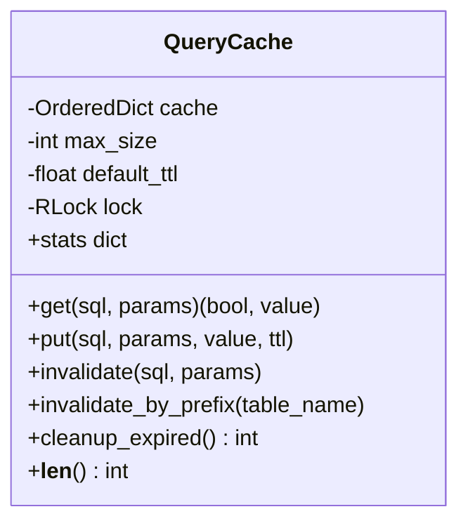
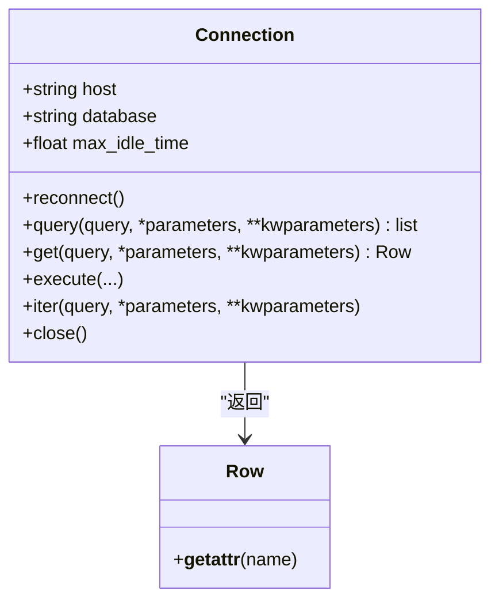
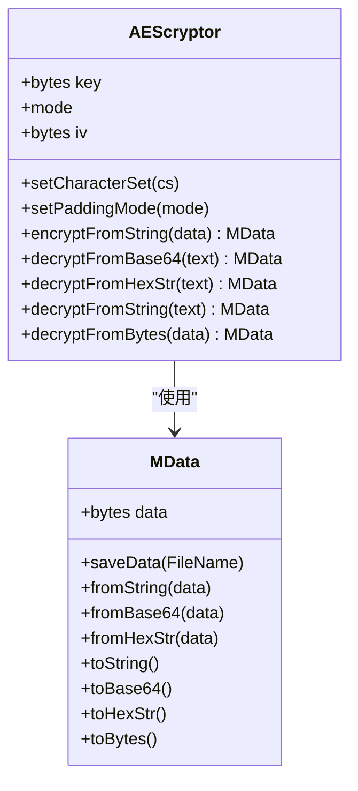
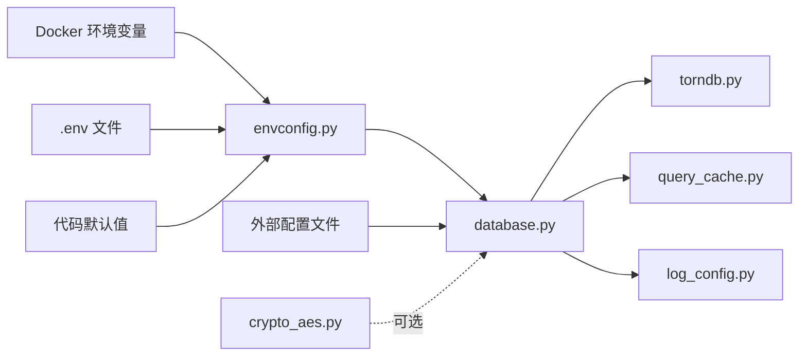

# 配置管理

<cite>
**本文引用的文件**
- [docker/Dockerfile](file://docker/Dockerfile)
- [docker/stock/quantia/lib/database.py](file://docker/stock/quantia/lib/database.py)
- [docker/stock/quantia/lib/log_config.py](file://docker/stock/quantia/lib/log_config.py)
- [docker/stock/quantia/lib/query_cache.py](file://docker/stock/quantia/lib/query_cache.py)
- [docker/stock/quantia/lib/torndb.py](file://docker/stock/quantia/lib/torndb.py)
- [docker/stock/quantia/lib/crypto_aes.py](file://docker/stock/quantia/lib/crypto_aes.py)
- [docker/stock/quantia/lib/envconfig.py](file://docker/stock/quantia/lib/envconfig.py)
- [docker/stock/quantia/config/trade_client.json](file://docker/stock/quantia/config/trade_client.json)
- [docker/stock/quantia/config/eastmoney_cookie.txt](file://docker/stock/quantia/config/eastmoney_cookie.txt)
- [docker/stock/requirements.txt](file://docker/stock/requirements.txt)
- [requirements.txt](file://requirements.txt)
</cite>

## 更新摘要
**所做更改**
- 新增 envconfig.py 集中式环境变量配置模块的详细说明
- 添加类型安全配置读取函数的使用指南
- 更新配置优先级和最佳实践
- 增强配置管理的安全性和一致性
- 扩展配置验证和热更新策略

## 目录
1. [简介](#简介)
2. [项目结构](#项目结构)
3. [核心组件](#核心组件)
4. [架构总览](#架构总览)
5. [详细组件分析](#详细组件分析)
6. [依赖关系分析](#依赖关系分析)
7. [性能考量](#性能考量)
8. [故障排查指南](#故障排查指南)
9. [结论](#结论)
10. [附录](#附录)

## 简介
本指南面向开发者与运维人员，系统化讲解本项目的配置管理实践，包括：
- 配置文件结构与职责边界
- 配置项管理与环境变量注入
- 配置验证与热更新策略
- 数据库配置、API密钥管理、日志配置、缓存配置等
- **新增**：envconfig.py 集中式环境变量配置系统
- 最佳实践、安全考虑与版本控制策略

目标是帮助你在不改动代码的前提下，安全地扩展与维护配置体系。

## 项目结构
围绕配置相关的文件主要分布在以下位置：
- Docker 环境变量与镜像层配置
- Python 库模块中的数据库、日志、缓存、数据库封装、加密工具和**envconfig.py 集中式配置**
- 配置文件目录中的外部配置（如交易客户端、Cookie）



**图表来源**
- [docker/Dockerfile:10-23](file://docker/Dockerfile#L10-L23)
- [docker/stock/requirements.txt:20-21](file://docker/stock/requirements.txt#L20-L21)
- [requirements.txt:20-21](file://requirements.txt#L20-L21)

**章节来源**
- [docker/Dockerfile:10-23](file://docker/Dockerfile#L10-L23)
- [docker/stock/quantia/lib/envconfig.py:1-25](file://docker/stock/quantia/lib/envconfig.py#L1-L25)

## 核心组件
- 数据库配置与连接
  - 通过环境变量注入数据库主机、端口、用户、密码、库名
  - 统一构造连接 URL 与多种连接方式（SQLAlchemy 引擎、DB-API、torndb）
  - 支持连接池参数与字符集设置
- 日志配置
  - 统一日志初始化，三路输出：按大小轮转的全量日志、错误汇总日志、控制台输出
  - 避免重复配置，统一格式与时区
- 查询缓存
  - LRU + TTL 的线程安全缓存，区分 COUNT 与 DATA 查询
  - 支持按 SQL+参数生成键、手动失效与清理过期
- 数据库封装（torndb）
  - 轻量 DB-API 封装，自动重连、游标管理、异常处理
- 加密工具（AES）
  - 字符串/字节/十六进制/Base64 多格式编解码与填充模式
- **新增**：envconfig.py 集中式环境变量配置
  - 自动加载项目根目录下的 .env 文件
  - 提供类型安全的配置读取函数：get_str/get_int/get_float/get_bool
  - 配置优先级：系统环境变量 > .env 文件 > 代码默认值
- 外部配置
  - 交易客户端凭据与 Cookie 文件，便于隔离敏感信息

**章节来源**
- [docker/stock/quantia/lib/envconfig.py:1-25](file://docker/stock/quantia/lib/envconfig.py#L1-L25)
- [docker/stock/quantia/lib/envconfig.py:48-82](file://docker/stock/quantia/lib/envconfig.py#L48-L82)

## 架构总览
下图展示配置在系统中的流转与耦合关系：



**图表来源**
- [docker/stock/quantia/lib/envconfig.py:21-24](file://docker/stock/quantia/lib/envconfig.py#L21-L24)
- [docker/stock/quantia/lib/envconfig.py:48-82](file://docker/stock/quantia/lib/envconfig.py#L48-L82)

## 详细组件分析

### envconfig.py 集中式环境变量配置（新增）
**功能特性**
- 自动加载项目根目录下的 .env 文件（python-dotenv，可选依赖）
- 提供类型安全的配置读取函数：get_str / get_int / get_float / get_bool
- .env 文件中的值不会覆盖已设置的系统环境变量（方法 A 优先于方法 B）
- 所有模块均可通过 os.environ.get() 直接读取（dotenv 已注入 os.environ）

**配置优先级（高 → 低）**
1. 系统环境变量（export / set / Docker ENV）
2. .env 文件（项目根目录）
3. 代码中的默认值

**使用方式**
```python
# 方式一：依赖自动加载（import 本模块即触发 .env 加载）
import quantia.lib.envconfig  # noqa: F401  — 仅用于触发 .env 加载

# 方式二：使用类型安全的辅助函数
from quantia.lib.envconfig import get_int, get_bool
port = get_int('QUANTIA_WEB_PORT', 9988)
force = get_bool('QUANTIA_FORCE_FETCH', False)
```

**类型安全函数**
- `get_str(key: str, default: str = '') -> str`：读取字符串配置
- `get_int(key: str, default: int = 0) -> int`：读取整数配置，值无效时返回默认值
- `get_float(key: str, default: float = 0.0) -> float`：读取浮点数配置，值无效时返回默认值
- `get_bool(key: str, default: bool = False) -> bool`：读取布尔配置，支持 1/true/yes/on（不区分大小写）



**图表来源**
- [docker/stock/quantia/lib/envconfig.py:32-45](file://docker/stock/quantia/lib/envconfig.py#L32-L45)

**章节来源**
- [docker/stock/quantia/lib/envconfig.py:1-25](file://docker/stock/quantia/lib/envconfig.py#L1-L25)
- [docker/stock/quantia/lib/envconfig.py:32-45](file://docker/stock/quantia/lib/envconfig.py#L32-L45)
- [docker/stock/quantia/lib/envconfig.py:48-82](file://docker/stock/quantia/lib/envconfig.py#L48-L82)

### 数据库配置与连接（database.py）
- 配置来源
  - 通过 envconfig.py 读取环境变量（QUANTIA_DB_HOST、QUANTIA_DB_USER、QUANTIA_DB_PASSWORD、QUANTIA_DB_DATABASE、QUANTIA_DB_PORT）
  - 内置默认值与类型转换
- 连接方式
  - SQLAlchemy 引擎（单例，连接池参数优化）
  - DB-API 连接（pymysql）
  - torndb 连接（轻量封装）
- 关键点
  - 密码进行 URL 编码以适配特殊字符
  - 日志打印连接信息（注意：生产中建议脱敏）
  - 提供通用的批量写入、更新、检查表存在、执行 SQL 等方法



**图表来源**
- [docker/stock/quantia/lib/database.py:20-65](file://docker/stock/quantia/lib/database.py#L20-L65)

**章节来源**
- [docker/stock/quantia/lib/database.py:20-65](file://docker/stock/quantia/lib/database.py#L20-L65)

### 日志配置（log_config.py）
- 初始化流程
  - 首次调用时清除已有 handler，统一格式与级别
  - 输出三路：按大小轮转的全量日志、错误汇总日志、控制台输出
- 使用建议
  - 在入口脚本调用一次 setup_logging
  - 推荐使用模块级 logger，避免重复配置



**图表来源**
- [docker/stock/quantia/lib/log_config.py:47-104](file://docker/stock/quantia/lib/log_config.py#L47-L104)

**章节来源**
- [docker/stock/quantia/lib/log_config.py:47-104](file://docker/stock/quantia/lib/log_config.py#L47-L104)

### 查询缓存（query_cache.py）
- 设计要点
  - LRU 淘汰 + TTL 过期
  - 线程安全（锁保护）
  - 统计命中率与容量
- 使用场景
  - 股票列表分页（短 TTL）
  - 策略筛选结果（稍长 TTL）
- 失效策略
  - 按 SQL+参数键失效
  - 清空全部（用于数据变更后）



**图表来源**
- [docker/stock/quantia/lib/query_cache.py:27-156](file://docker/stock/quantia/lib/query_cache.py#L27-L156)

**章节来源**
- [docker/stock/quantia/lib/query_cache.py:27-156](file://docker/stock/quantia/lib/query_cache.py#L27-L156)

### 数据库封装（torndb.py）
- 功能
  - 连接管理、自动重连、游标迭代
  - 查询/更新/批量操作封装
  - 异常处理与连接超时控制
- 适用场景
  - 需要 DB-API 风格但又希望简化游标与异常处理的场景



**图表来源**
- [docker/stock/quantia/lib/torndb.py:47-250](file://docker/stock/quantia/lib/torndb.py#L47-L250)

**章节来源**
- [docker/stock/quantia/lib/torndb.py:47-120](file://docker/stock/quantia/lib/torndb.py#L47-L120)

### 加密工具（crypto_aes.py）
- 能力
  - 字符串/字节/十六进制/Base64 多格式编解码
  - CBC/ECB 模式与多种填充模式
- 使用建议
  - 敏感字段（如交易密码）建议加密存储，运行时解密
  - 密钥与 IV 管理需遵循安全规范



**图表来源**
- [docker/stock/quantia/lib/crypto_aes.py:13-52](file://docker/stock/quantia/lib/crypto_aes.py#L13-L52)

**章节来源**
- [docker/stock/quantia/lib/crypto_aes.py:55-198](file://docker/stock/quantia/lib/crypto_aes.py#L55-L198)

### 外部配置（trade_client.json、eastmoney_cookie.txt）
- trade_client.json
  - 存放交易账号、密码与可执行路径
  - 建议通过环境变量或挂载卷注入，避免硬编码
- eastmoney_cookie.txt
  - 存放登录态 Cookie，用于数据源抓取
  - 建议定期轮换与最小权限访问

**章节来源**
- [docker/stock/quantia/config/trade_client.json:1-5](file://docker/stock/quantia/config/trade_client.json#L1-L5)
- [docker/stock/quantia/config/eastmoney_cookie.txt:1-2](file://docker/stock/quantia/config/eastmoney_cookie.txt#L1-L2)

## 依赖关系分析
- 环境变量驱动
  - Dockerfile 中预设默认值，可在部署时通过 -e 覆盖
  - **新增**：envconfig.py 作为统一的配置入口，支持 .env 文件自动加载
- 模块间耦合
  - database.py 为核心，被 torndb、query_cache、log 等模块间接依赖
  - **新增**：envconfig.py 为所有模块提供统一的配置读取接口
  - 外部配置文件独立于代码，通过业务逻辑读取
- 安全与隔离
  - 外部配置文件与环境变量共同承担敏感信息管理
  - **新增**：envconfig.py 提供类型安全的配置读取，避免类型转换错误



**图表来源**
- [docker/stock/quantia/lib/envconfig.py:21-24](file://docker/stock/quantia/lib/envconfig.py#L21-L24)
- [docker/stock/quantia/lib/envconfig.py:32-45](file://docker/stock/quantia/lib/envconfig.py#L32-L45)

## 性能考量
- 数据库连接池
  - 合理设置 pool_size、max_overflow、pool_recycle、pool_pre_ping、pool_timeout
  - 避免高并发下的连接争用与超时
- 查询缓存
  - 选择合适的 max_size 与 default_ttl，平衡内存占用与命中率
  - 对频繁翻页的列表与低频筛选结果采用不同 TTL
- 日志轮转
  - 控制单文件大小与备份数，避免磁盘压力
- 加密开销
  - 对高频字段避免不必要的加解密，必要时采用批量处理
- **新增**：envconfig.py 性能优化
  - 配置值缓存，避免重复解析
  - .env 文件仅在导入时加载一次
  - 类型转换失败时快速返回默认值

## 故障排查指南
- 数据库连接失败
  - 检查环境变量是否正确注入（主机、端口、用户、密码、库名）
  - 查看错误日志汇总文件定位异常堆栈
  - 使用 torndb 的重连机制与超时参数
- 缓存命中异常
  - 核对 SQL 与参数是否一致，确认键生成规则
  - 观察统计信息（命中次数、命中率、容量）
- 日志格式不统一
  - 确认仅在入口调用一次 setup_logging
  - 避免重复 basicConfig 导致格式错乱
- 外部配置读取失败
  - 确认挂载路径与权限
  - 检查文件内容格式（JSON/Cookie）
- **新增**：envconfig.py 配置问题
  - 检查 .env 文件路径是否正确（项目根目录）
  - 确认 python-dotenv 依赖是否安装
  - 验证配置键名是否正确，注意大小写
  - 查看类型转换错误，确认配置值格式

**章节来源**
- [docker/stock/quantia/lib/envconfig.py:48-82](file://docker/stock/quantia/lib/envconfig.py#L48-L82)

## 结论
本项目的配置管理以"环境变量优先、外部配置隔离、模块化封装、**envconfig.py 集中式管理**"为核心原则。通过统一的日志、缓存与数据库封装，配合外部配置文件、Docker 环境变量和 **envconfig.py 集中式配置系统**，实现了可维护、可扩展且具备一定安全性的配置体系。envconfig.py 的引入进一步增强了配置管理的类型安全性、可读性和一致性。建议在新增配置项时遵循本文的最佳实践与安全考虑，确保配置的可控与可观测。

## 附录

### 如何添加新的配置选项
- 环境变量
  - 在 Dockerfile 中添加默认值与注释说明
  - 在部署时通过 -e 覆盖
- **新增**：envconfig.py 配置
  - 在 .env 文件中添加配置项（项目根目录）
  - 使用 envconfig.py 的类型安全函数读取配置
  - 支持字符串、整数、浮点数、布尔值类型
- 外部配置文件
  - 在 config 目录新增文件，明确用途与格式
  - 在业务模块中读取并校验
- 代码侧接入
  - 在对应模块中读取环境变量或文件内容
  - 提供默认值与类型转换
  - 记录在日志中（注意脱敏）

**章节来源**
- [docker/stock/quantia/lib/envconfig.py:12-19](file://docker/stock/quantia/lib/envconfig.py#L12-L19)
- [docker/stock/quantia/lib/envconfig.py:50-82](file://docker/stock/quantia/lib/envconfig.py#L50-L82)

### 配置验证机制
- 环境变量
  - 类型转换与范围检查（如端口为整数）
  - 必填项校验（如数据库密码）
- **新增**：envconfig.py 验证
  - 类型安全的配置读取，自动处理类型转换
  - 布尔值支持多种格式（1/true/yes/on）
  - 配置值不存在时返回默认值
- 外部配置文件
  - JSON/Cookie 格式校验
  - 权限与路径检查
- 运行时验证
  - 数据库连接测试
  - 缓存初始化与统计输出
  - 日志初始化状态检查

**章节来源**
- [docker/stock/quantia/lib/envconfig.py:55-82](file://docker/stock/quantia/lib/envconfig.py#L55-L82)

### 配置热更新
- 环境变量
  - 通过重启容器或服务加载新值（Docker 重启）
- **新增**：envconfig.py 热更新
  - .env 文件热替换支持（需要重新导入模块）
  - 系统环境变量即时生效
  - 配置值缓存机制，避免重复解析
- 外部配置文件
  - 通过挂载卷热替换，结合业务模块的文件监控与重载逻辑
- 连接与缓存
  - 数据库连接建议在下一次请求时重建
  - 缓存可通过接口触发失效或定时清理

**章节来源**
- [docker/stock/quantia/lib/envconfig.py:39-45](file://docker/stock/quantia/lib/envconfig.py#L39-L45)

### 各类配置管理方法
- 数据库配置
  - 使用 envconfig.py 读取，统一 URL 构造与连接池参数
- API 密钥管理
  - 通过外部配置文件或环境变量注入，必要时使用加密工具保护
- 日志配置
  - 统一初始化，按模块输出，控制台与文件分离
- 缓存配置
  - LRU + TTL，区分不同查询类型的缓存策略
- **新增**：envconfig.py 配置管理
  - 集中式配置读取，支持多种数据类型
  - 配置优先级管理，避免覆盖问题
  - 类型安全的配置访问接口

**章节来源**
- [docker/stock/quantia/lib/envconfig.py:21-24](file://docker/stock/quantia/lib/envconfig.py#L21-L24)

### 最佳实践
- 分层配置：默认值（内置）、环境变量、外部配置文件、**envconfig.py 集中式管理**
- 最小暴露：敏感信息放入外部配置文件并通过权限控制
- 可观测性：日志统一、缓存统计、连接池指标
- 版本化：配置文件纳入版本控制，环境变量通过文档说明
- **新增**：envconfig.py 最佳实践
  - 统一使用类型安全的配置读取函数
  - 明确配置键命名规范（QUANTIA_前缀）
  - 配置项文档化，包含默认值和用途说明
  - .env 文件作为开发环境配置，生产环境使用系统环境变量

### 安全考虑
- 密码与密钥：使用加密存储与运行时解密，避免明文写入仓库
- 权限最小化：外部配置文件仅授予必要权限
- 脱敏输出：日志中避免打印敏感信息
- **新增**：envconfig.py 安全考虑
  - .env 文件避免提交到版本控制
  - 配置值类型验证，防止意外的数据类型问题
  - 系统环境变量优先级，确保生产环境配置安全

### 版本控制策略
- 默认值与环境变量：在 Dockerfile 中集中声明，便于审计
- 外部配置文件：纳入版本控制，但敏感字段使用占位符或示例格式
- **新增**：envconfig.py 版本控制
  - .env 文件作为开发环境配置模板
  - 生产环境配置通过系统环境变量管理
  - 配置变更通过 PR 审批与 CI 校验，确保配置变更可追溯

### 配置管理工具依赖
- **python-dotenv>=1.0.0**：用于 .env 文件自动加载
- 建议在 requirements.txt 中明确声明此依赖
- 开发环境和生产环境均可使用，但 .env 文件仅用于开发环境

**章节来源**
- [docker/stock/requirements.txt:20-21](file://docker/stock/requirements.txt#L20-L21)
- [requirements.txt:20-21](file://requirements.txt#L20-L21)
