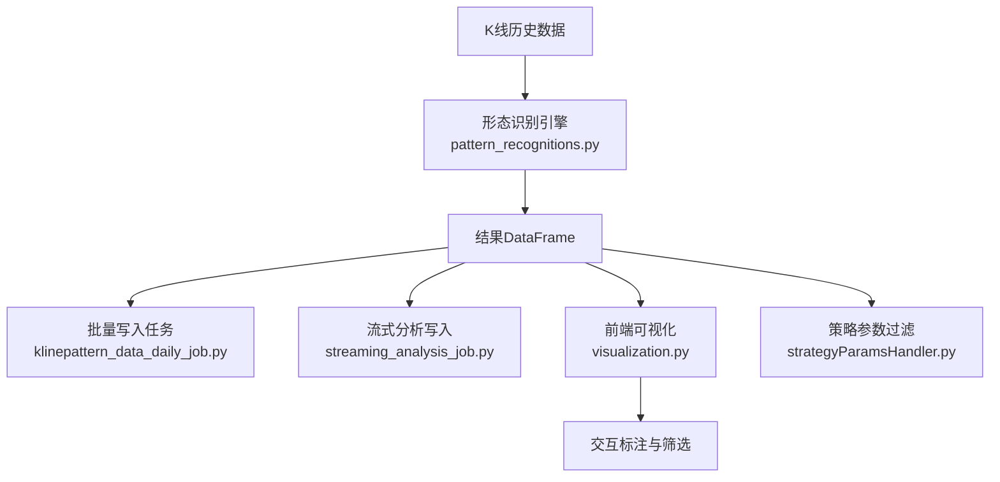
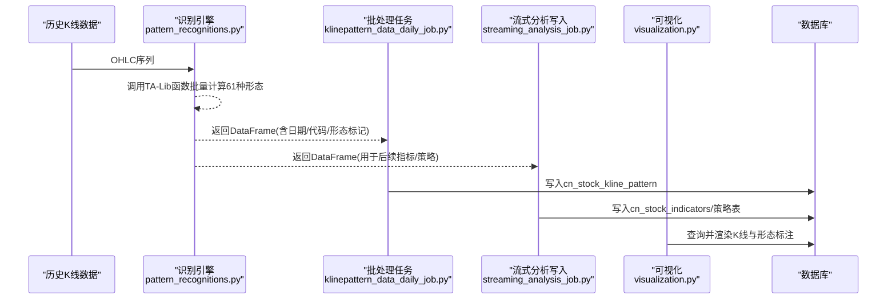
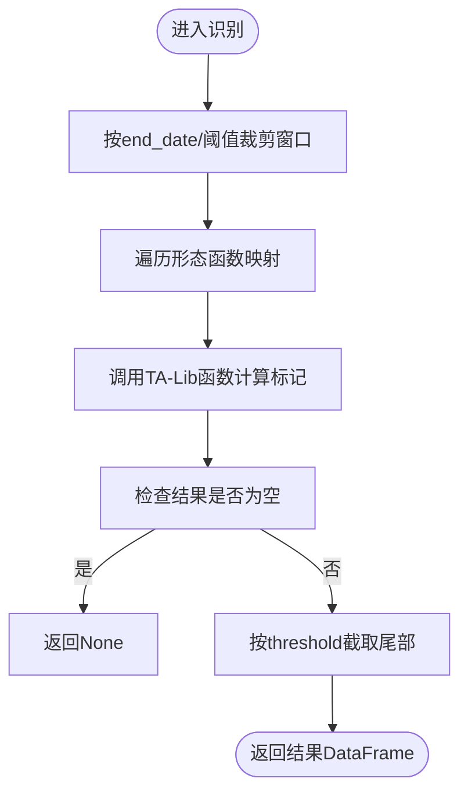
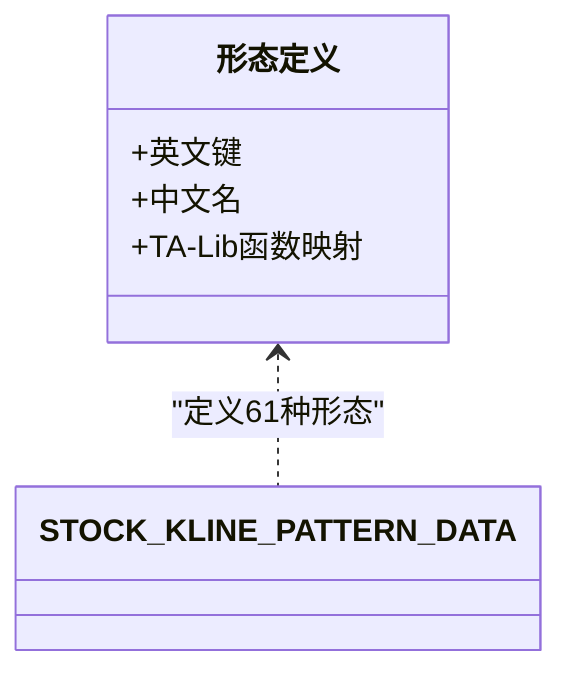
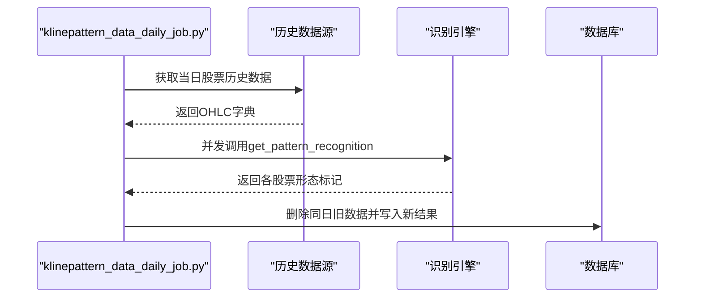
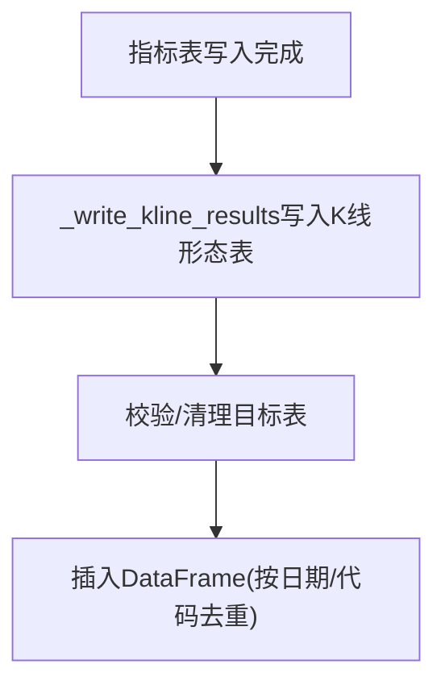
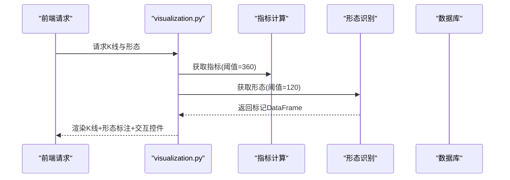
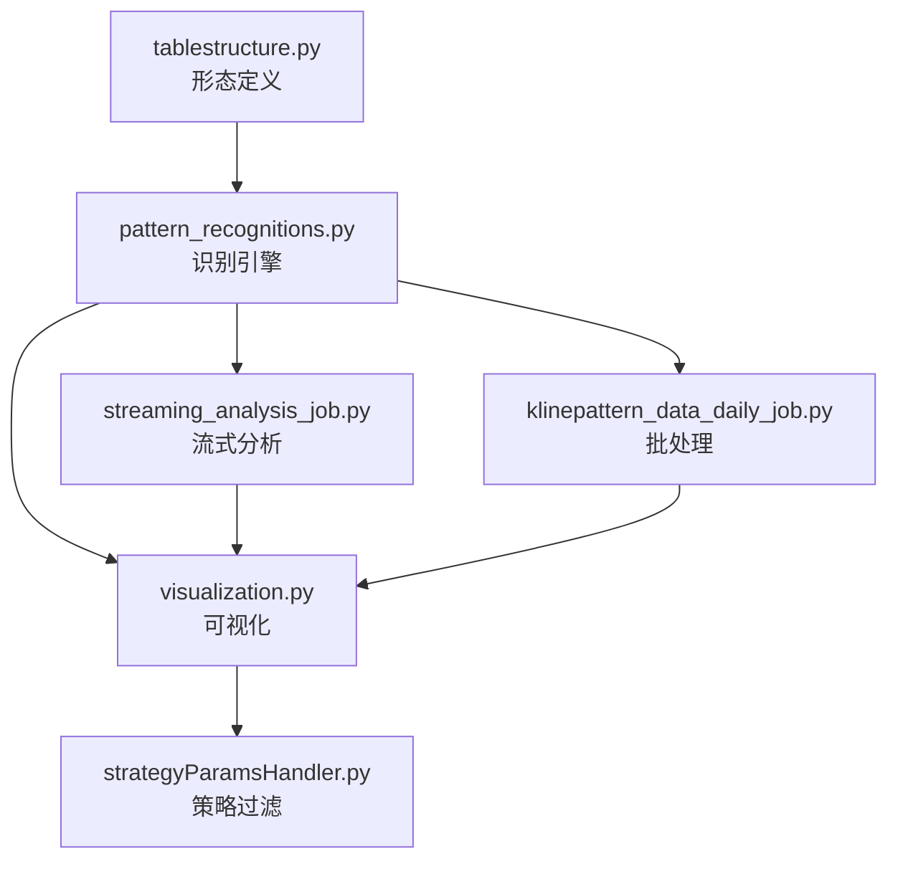

# K线形态分类体系

<cite>
**本文引用的文件**
- [pattern_recognitions.py](file://quantia/core/pattern/pattern_recognitions.py)
- [visualization.py](file://quantia/core/kline/visualization.py)
- [tablestructure.py](file://quantia/core/tablestructure.py)
- [klinepattern_data_daily_job.py](file://quantia/job/klinepattern_data_daily_job.py)
- [streaming_analysis_job.py](file://quantia/job/streaming_analysis_job.py)
- [pattern_strategies.py](file://quantia/core/strategy/pattern/pattern_strategies.py)
- [strategyParamsHandler.py](file://quantia/web/strategyParamsHandler.py)
</cite>

## 目录
1. [引言](#引言)
2. [项目结构](#项目结构)
3. [核心组件](#核心组件)
4. [架构总览](#架构总览)
5. [详细组件分析](#详细组件分析)
6. [依赖分析](#依赖分析)
7. [性能考量](#性能考量)
8. [故障排查指南](#故障排查指南)
9. [结论](#结论)
10. [附录](#附录)

## 引言
本文件面向Quantia项目的K线形态识别与应用，系统化梳理61种K线形态的分类、命名与编号规则、识别流程、可视化展示、数据库落库与策略联动，并给出形态组合与多时间框架验证的实践建议。文档以仓库现有实现为依据，结合工作流与前端可视化模块，形成从“数据采集—形态识别—结果落库—前端展示—策略联动”的闭环。

## 项目结构
围绕K线形态识别的关键目录与文件如下：
- 核心识别逻辑：quantia/core/pattern/pattern_recognitions.py
- 可视化与标注：quantia/core/kline/visualization.py
- 形态定义与表结构：quantia/core/tablestructure.py
- 日常批处理与落库：quantia/job/klinepattern_data_daily_job.py
- 流式分析与落库：quantia/job/streaming_analysis_job.py
- 形态策略示例：quantia/core/strategy/pattern/pattern_strategies.py
- Web端策略过滤：quantia/web/strategyParamsHandler.py

图表来源
- [pattern_recognitions.py](file://quantia/core/pattern/pattern_recognitions.py#L10-L34)
- [klinepattern_data_daily_job.py](file://quantia/job/klinepattern_data_daily_job.py#L24-L57)
- [streaming_analysis_job.py](file://quantia/job/streaming_analysis_job.py#L397-L414)
- [visualization.py](file://quantia/core/kline/visualization.py#L29-L41)

章节来源
- [pattern_recognitions.py](file://quantia/core/pattern/pattern_recognitions.py#L10-L34)
- [tablestructure.py](file://quantia/core/tablestructure.py#L468-L589)
- [klinepattern_data_daily_job.py](file://quantia/job/klinepattern_data_daily_job.py#L24-L57)
- [streaming_analysis_job.py](file://quantia/job/streaming_analysis_job.py#L397-L414)
- [visualization.py](file://quantia/core/kline/visualization.py#L29-L41)

## 核心组件
- 形态识别引擎：对OHLC序列调用TA-Lib函数批量计算61种K线形态，输出数值型标记（正负表示方向）。
- 表结构与命名：STOCK_KLINE_PATTERN_DATA定义61种形态的英文名、中文名、函数映射；TABLE_CN_STOCK_KLINE_PATTERN为落库表。
- 批处理与流式：klinepattern_data_daily_job.py按日批处理；streaming_analysis_job.py在流式分析阶段写入指标表后同步落库。
- 可视化：visualization.py加载指标与形态，渲染K线图与形态标注，支持交互筛选。
- 形态策略：pattern_strategies.py提供基于形态的策略示例（如突破平台、停机坪等），体现形态在策略中的应用。

章节来源
- [pattern_recognitions.py](file://quantia/core/pattern/pattern_recognitions.py#L10-L34)
- [tablestructure.py](file://quantia/core/tablestructure.py#L468-L589)
- [klinepattern_data_daily_job.py](file://quantia/job/klinepattern_data_daily_job.py#L63-L83)
- [streaming_analysis_job.py](file://quantia/job/streaming_analysis_job.py#L397-L414)
- [visualization.py](file://quantia/core/kline/visualization.py#L29-L41)
- [pattern_strategies.py](file://quantia/core/strategy/pattern/pattern_strategies.py#L22-L77)

## 架构总览
K线形态识别的端到端流程如下：

图表来源
- [pattern_recognitions.py](file://quantia/core/pattern/pattern_recognitions.py#L10-L34)
- [klinepattern_data_daily_job.py](file://quantia/job/klinepattern_data_daily_job.py#L24-L57)
- [streaming_analysis_job.py](file://quantia/job/streaming_analysis_job.py#L397-L414)
- [visualization.py](file://quantia/core/kline/visualization.py#L29-L41)

## 详细组件分析

### 形态识别引擎（pattern_recognitions.py）
- 输入：DataFrame包含date/code/open/high/low/close；stock_column为形态函数映射字典。
- 处理：按end_date与calc_threshold裁剪窗口；遍历stock_column调用对应TA-Lib函数；阈值截取尾部数据。
- 输出：DataFrame，列包括形态标记（正负）、code、date等；若无数据返回None。

图表来源
- [pattern_recognitions.py](file://quantia/core/pattern/pattern_recognitions.py#L10-L34)

章节来源
- [pattern_recognitions.py](file://quantia/core/pattern/pattern_recognitions.py#L10-L34)

### 形态定义与命名规则（tablestructure.py）
- 定义：STOCK_KLINE_PATTERN_DATA包含61个形态键值，每个键包含中文名与TA-Lib函数映射。
- 编号系统：英文键作为形态标识，中文名为可读名称；数据库表TABLE_CN_STOCK_KLINE_PATTERN扩展外键列后统一落库。
- 分类：代码中未直接体现“反转/持续/缺口”三类分组，但可通过形态函数映射与中文名进行归类。

图表来源
- [tablestructure.py](file://quantia/core/tablestructure.py#L468-L589)

章节来源
- [tablestructure.py](file://quantia/core/tablestructure.py#L468-L589)

### 批处理与落库（klinepattern_data_daily_job.py）
- 任务职责：按日拉取历史数据，调用识别引擎，删除同日旧数据，写入cn_stock_kline_pattern。
- 并发：使用ThreadPoolExecutor并发处理多股票。
- 错误处理：捕获异常并记录日志，避免中断。

图表来源
- [klinepattern_data_daily_job.py](file://quantia/job/klinepattern_data_daily_job.py#L24-L57)
- [klinepattern_data_daily_job.py](file://quantia/job/klinepattern_data_daily_job.py#L63-L83)

章节来源
- [klinepattern_data_daily_job.py](file://quantia/job/klinepattern_data_daily_job.py#L24-L57)
- [klinepattern_data_daily_job.py](file://quantia/job/klinepattern_data_daily_job.py#L63-L83)

### 流式分析与落库（streaming_analysis_job.py）
- 写入K线形态结果：_write_kline_results负责清理与写入cn_stock_kline_pattern。
- 与指标表联动：在指标表写入后，可触发其他策略（如guess_indicators）。

图表来源
- [streaming_analysis_job.py](file://quantia/job/streaming_analysis_job.py#L397-L414)

章节来源
- [streaming_analysis_job.py](file://quantia/job/streaming_analysis_job.py#L397-L414)

### 可视化与交互标注（visualization.py）
- 加载指标与形态：调用get_indicators与get_pattern_recognitions，设置threshold=120。
- 形态标注：根据标记正负在K线上下分别标注中文名；支持勾选显隐。
- 交互：十字准星、悬停提示、工具栏、筹码分布等。

图表来源
- [visualization.py](file://quantia/core/kline/visualization.py#L29-L41)
- [visualization.py](file://quantia/core/kline/visualization.py#L111-L155)

章节来源
- [visualization.py](file://quantia/core/kline/visualization.py#L29-L41)
- [visualization.py](file://quantia/core/kline/visualization.py#L111-L155)

### 形态策略示例（pattern_strategies.py）
- 示例策略：突破平台、停机坪、高而窄的旗形、无大幅回撤等，均基于历史数据与技术条件进行筛选。
- 与形态的关系：策略可结合形态标记与价格行为共同判断买卖时机。

章节来源
- [pattern_strategies.py](file://quantia/core/strategy/pattern/pattern_strategies.py#L22-L77)
- [pattern_strategies.py](file://quantia/core/strategy/pattern/pattern_strategies.py#L80-L148)
- [pattern_strategies.py](file://quantia/core/strategy/pattern/pattern_strategies.py#L151-L203)
- [pattern_strategies.py](file://quantia/core/strategy/pattern/pattern_strategies.py#L206-L250)

### Web端策略过滤（strategyParamsHandler.py）
- 提供从策略表读取数据的能力，支持按日期、分页等条件过滤。
- 与K线形态策略配合：通过策略配置表读取结果并展示。

章节来源
- [strategyParamsHandler.py](file://quantia/web/strategyParamsHandler.py#L935-L960)
- [strategyParamsHandler.py](file://quantia/web/strategyParamsHandler.py#L984-L1022)

## 依赖分析
- 形态识别依赖TA-Lib函数族，通过tablestructure.py的函数映射统一调用。
- 可视化依赖指标计算模块与形态识别结果，形成前端渲染闭环。
- 批处理与流式分析共享同一张落库表，保证数据一致性。
- 形态策略与Web端过滤模块解耦，便于扩展新的策略维度。

图表来源
- [tablestructure.py](file://quantia/core/tablestructure.py#L468-L589)
- [pattern_recognitions.py](file://quantia/core/pattern/pattern_recognitions.py#L10-L34)
- [klinepattern_data_daily_job.py](file://quantia/job/klinepattern_data_daily_job.py#L24-L57)
- [streaming_analysis_job.py](file://quantia/job/streaming_analysis_job.py#L397-L414)
- [visualization.py](file://quantia/core/kline/visualization.py#L29-L41)
- [strategyParamsHandler.py](file://quantia/web/strategyParamsHandler.py#L935-L960)

## 性能考量
- 并发识别：批处理使用线程池并发处理多股票，提升吞吐。
- 数据窗口：识别时按阈值截取窗口，减少计算量；可视化默认120根K线，兼顾性能与观察范围。
- I/O优化：批处理前删除同日旧数据，避免重复写入；流式分析按需写入指标与形态表。
- 建议：对高频访问的日期/代码建立索引；对TA-Lib函数调用进行缓存（如历史数据未变化）。

## 故障排查指南
- 识别异常：pattern_recognitions与klinepattern_data_daily_job均捕获异常并记录日志，优先检查输入数据完整性与日期边界。
- 可视化异常：visualization.py对异常进行日志记录，检查指标与形态数据是否正确写入。
- 落库异常：streaming_analysis_job与klinepattern_data_daily_job对表存在性与字段类型进行检查，确保schema一致。
- 策略过滤异常：strategyParamsHandler对表不存在与SQL异常进行处理，确认策略表已生成且包含所需列。

章节来源
- [pattern_recognitions.py](file://quantia/core/pattern/pattern_recognitions.py#L25-L26)
- [klinepattern_data_daily_job.py](file://quantia/job/klinepattern_data_daily_job.py#L59-L60)
- [visualization.py](file://quantia/core/kline/visualization.py#L272-L273)
- [streaming_analysis_job.py](file://quantia/job/streaming_analysis_job.py#L484-L485)
- [strategyParamsHandler.py](file://quantia/web/strategyParamsHandler.py#L1014-L1021)

## 结论
Quantia的K线形态识别体系以TA-Lib为核心，通过统一的形态定义、批处理与流式分析机制，实现了从数据到可视化的完整链路。61种形态以英文键与中文名并行管理，既满足工程化落地，也为后续形态组合与多时间框架验证提供了基础。建议在实际应用中结合形态策略与多周期指标，持续优化识别阈值与误判率评估方法。

## 附录

### 形态命名与编号规则
- 英文键：作为数据库列名与策略引用标识，保持稳定。
- 中文名：用于前端展示与用户理解。
- 编号系统：代码未提供数字编号，建议在业务层以英文键排序生成序号，便于检索与统计。

章节来源
- [tablestructure.py](file://quantia/core/tablestructure.py#L468-L589)

### 形态类别划分（基于形态函数映射与中文名）
- 反转形态：如“锤头”“倒锤头”“吞没模式”“射击之星”“乌云压顶”“晨星/暮星”等。
- 持续形态：如“三白兵”“三只乌鸦”“三线打击”“向上/下跳空并列阳线”等。
- 缺口形态：如“向上/下跳空三法”“跳空并列阴阳线”“向上/下跳空的两只乌鸦”等。
- 注意：上述分类来源于形态函数映射与中文名的直观归类，仓库未提供预设的分类标签。

章节来源
- [tablestructure.py](file://quantia/core/tablestructure.py#L470-L589)

### 形态识别准确性评估与误判分析
- 方法建议：以历史回测方式对比形态标记与未来N日涨跌幅，统计胜率与盈亏比；对高频形态进行混淆矩阵分析。
- 误判来源：噪声K线、样本外波动、阈值设定不当等；建议结合成交量、趋势与波动率进行二次过滤。
- 本仓库未提供现成的评估模块，可在策略层扩展评估逻辑或在可视化中增加标记与回测结果对照。

### 形态组合与多时间框架验证
- 组合策略：在同一根K线上叠加多个形态标记，结合趋势线、支撑阻力位与成交量进行综合判断。
- 多时间框架：在日线、周线、月线同时识别关键形态，以更高周期趋势为背景，降低误判概率。
- 实施要点：统一时间窗口与阈值；在可视化中增加多周期叠加与交互筛选功能。
