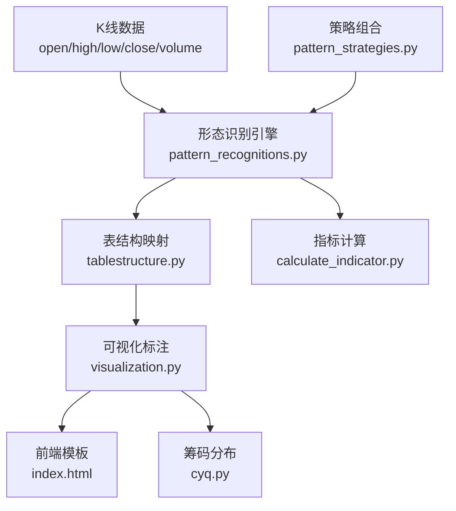
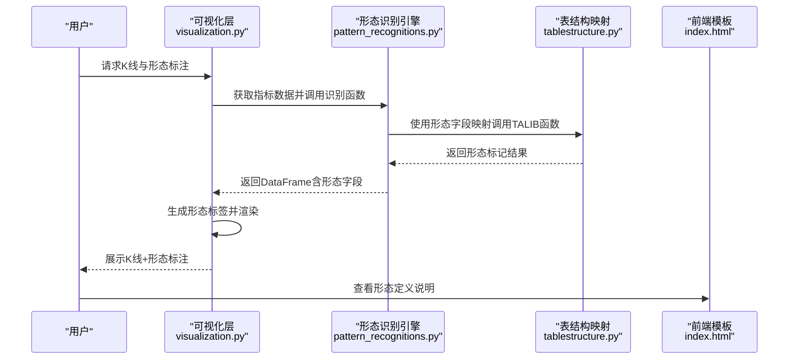
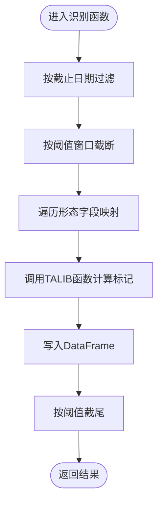
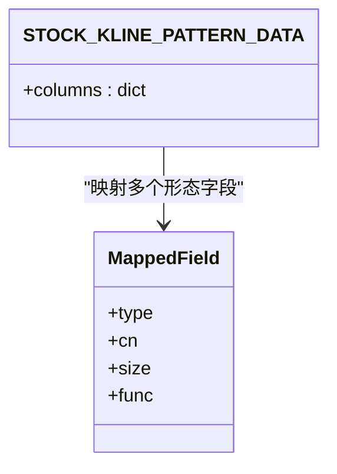
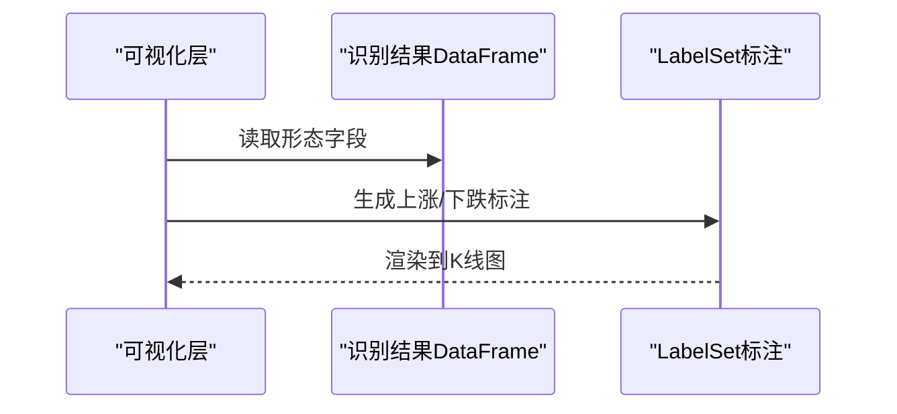
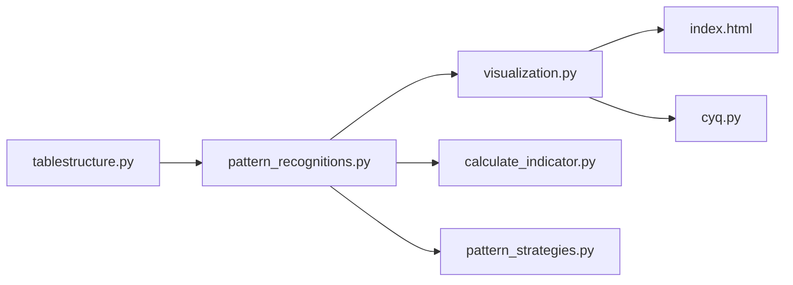

# 反转形态分类

<cite>
**本文引用的文件列表**
- [pattern_recognitions.py](file://quantia/core/pattern/pattern_recognitions.py)
- [tablestructure.py](file://quantia/core/tablestructure.py)
- [visualization.py](file://quantia/core/kline/visualization.py)
- [index.html](file://docker/stock/quantia/web/templates/index.html)
- [calculate_indicator.py](file://quantia/core/indicator/calculate_indicator.py)
- [pattern_strategies.py](file://quantia/core/strategy/pattern/pattern_strategies.py)
- [cyq.py](file://quantia/core/kline/cyq.py)
</cite>

## 目录
1. [简介](#简介)
2. [项目结构](#项目结构)
3. [核心组件](#核心组件)
4. [架构总览](#架构总览)
5. [详细组件分析](#详细组件分析)
6. [依赖关系分析](#依赖关系分析)
7. [性能考量](#性能考量)
8. [故障排查指南](#故障排查指南)
9. [结论](#结论)
10. [附录](#附录)

## 简介
本文件面向Quantia系统中的“反转形态分类”能力，系统性梳理了K线反转形态的识别机制、可视化呈现与前端展示规则，并结合项目现有实现给出可操作的实践建议。文档覆盖以下目标：
- 定义反转形态的识别入口与数据流
- 解释K线形态与成交量的协同作用
- 提供形态识别的实用技巧与注意事项
- 分析反转形态在不同市场环境下的适用性
- 给出可靠性与成功率的分析框架（基于现有实现的可扩展性）

## 项目结构
围绕反转形态识别的关键模块如下：
- 形态识别引擎：负责批量计算K线形态指标
- 数据表结构：定义形态字段与TALIB映射
- 可视化层：在K线图上标注形态标签
- 前端模板：提供形态定义说明与交互控件
- 指标计算：为形态识别提供基础技术指标
- 策略组合：将形态识别与策略筛选结合

图表来源
- [pattern_recognitions.py](file://quantia/core/pattern/pattern_recognitions.py#L10-L34)
- [tablestructure.py](file://quantia/core/tablestructure.py#L499-L585)
- [visualization.py](file://quantia/core/kline/visualization.py#L29-L41)
- [index.html](file://docker/stock/quantia/web/templates/index.html#L130-L237)
- [calculate_indicator.py](file://quantia/core/indicator/calculate_indicator.py#L306-L328)
- [cyq.py](file://quantia/core/kline/cyq.py#L13-L22)
- [pattern_strategies.py](file://quantia/core/strategy/pattern/pattern_strategies.py#L22-L77)

章节来源
- [pattern_recognitions.py](file://quantia/core/pattern/pattern_recognitions.py#L10-L34)
- [tablestructure.py](file://quantia/core/tablestructure.py#L499-L585)
- [visualization.py](file://quantia/core/kline/visualization.py#L29-L41)
- [index.html](file://docker/stock/quantia/web/templates/index.html#L130-L237)
- [calculate_indicator.py](file://quantia/core/indicator/calculate_indicator.py#L306-L328)
- [cyq.py](file://quantia/core/kline/cyq.py#L13-L22)
- [pattern_strategies.py](file://quantia/core/strategy/pattern/pattern_strategies.py#L22-L77)

## 核心组件
- 形态识别引擎
  - 批量计算：对给定窗口内的K线，调用TALIB形态函数生成形态标记
  - 时间窗控制：支持按阈值截断历史窗口，支持按截止日期过滤
  - 结果封装：返回包含形态字段的DataFrame，便于后续可视化与策略使用
- 表结构与映射
  - 将TALIB形态函数映射到数据库表字段，统一形态命名与中文说明
  - 支持多种反转形态（如锤头、倒锤头、母子线、吞噬模式、暮星/晨星等）
- 可视化标注
  - 在K线上方/下方标注形态标签，区分上涨/下跌反转
  - 提供形态开关控件，支持用户选择性显示
- 前端形态说明
  - 提供形态定义与典型K线描述，帮助用户理解形态含义
- 指标计算
  - 为形态识别提供基础指标（如均线、成交量等），辅助确认信号
- 策略组合
  - 将形态识别与策略筛选结合，形成“形态+确认”的选股流程

章节来源
- [pattern_recognitions.py](file://quantia/core/pattern/pattern_recognitions.py#L10-L34)
- [tablestructure.py](file://quantia/core/tablestructure.py#L499-L585)
- [visualization.py](file://quantia/core/kline/visualization.py#L111-L154)
- [index.html](file://docker/stock/quantia/web/templates/index.html#L130-L237)
- [calculate_indicator.py](file://quantia/core/indicator/calculate_indicator.py#L306-L328)
- [pattern_strategies.py](file://quantia/core/strategy/pattern/pattern_strategies.py#L22-L77)

## 架构总览
从数据输入到形态标注的完整流程如下：

图表来源
- [visualization.py](file://quantia/core/kline/visualization.py#L29-L41)
- [pattern_recognitions.py](file://quantia/core/pattern/pattern_recognitions.py#L10-L34)
- [tablestructure.py](file://quantia/core/tablestructure.py#L499-L585)
- [index.html](file://docker/stock/quantia/web/templates/index.html#L130-L237)

## 详细组件分析

### 形态识别引擎（pattern_recognitions.py）
- 功能要点
  - 输入：K线序列（open/high/low/close/volume）
  - 处理：遍历形态字段映射，调用TALIB函数计算标记
  - 输出：DataFrame（包含形态字段与原始K线字段）
- 关键参数
  - 截止日期过滤、阈值窗口、计算阈值
- 错误处理
  - 对异常进行日志记录，避免中断整体流程

图表来源
- [pattern_recognitions.py](file://quantia/core/pattern/pattern_recognitions.py#L10-L34)

章节来源
- [pattern_recognitions.py](file://quantia/core/pattern/pattern_recognitions.py#L10-L34)

### 表结构与形态映射（tablestructure.py）
- 形态字段映射
  - 将TALIB形态函数映射到数据库字段，统一形态命名与中文说明
  - 支持反转形态：锤头、倒锤头、母子线、吞噬模式、暮星/晨星、墓碑十字/倒T十字、风高浪大线等
- 字段属性
  - 类型、中文名、大小、TALIB函数指针
- 适用场景
  - 数据库存储、指标计算、可视化标注

图表来源
- [tablestructure.py](file://quantia/core/tablestructure.py#L499-L585)

章节来源
- [tablestructure.py](file://quantia/core/tablestructure.py#L499-L585)

### 可视化标注（visualization.py）
- 标注位置
  - 上涨反转：上方标注（红色）
  - 下跌反转：下方标注（绿色）
- 控件与交互
  - 提供形态开关控件，支持全选/全弃
  - 支持十字准星、悬停提示等交互
- 数据来源
  - 读取识别结果中的形态字段，生成LabelSet

图表来源
- [visualization.py](file://quantia/core/kline/visualization.py#L111-L154)

章节来源
- [visualization.py](file://quantia/core/kline/visualization.py#L111-L154)

### 前端形态说明（index.html）
- 内容范围
  - 列举多种K线形态及其典型K线描述
  - 包括反转形态（如锤头、倒锤头、母子线、吞噬模式、暮星/晨星等）
- 作用
  - 辅助用户理解形态含义与识别要点

章节来源
- [index.html](file://docker/stock/quantia/web/templates/index.html#L130-L237)

### 指标计算（calculate_indicator.py）
- 作用
  - 为形态识别提供基础指标（如均线、动量、能量潮等）
  - 与形态识别共同构成确认信号体系
- 示例
  - 指标计算中包含多项技术指标，可作为形态确认的参考

章节来源
- [calculate_indicator.py](file://quantia/core/indicator/calculate_indicator.py#L306-L328)

### 策略组合（pattern_strategies.py）
- 说明
  - 将形态识别与策略筛选结合，形成“形态+确认”的选股流程
  - 例如突破平台策略、停机坪策略等，体现形态与成交量、趋势的协同

章节来源
- [pattern_strategies.py](file://quantia/core/strategy/pattern/pattern_strategies.py#L22-L77)

## 依赖关系分析
- 形态识别依赖表结构映射，后者提供TALIB函数指针
- 可视化依赖识别结果，生成标注并渲染
- 前端模板提供形态定义说明，辅助用户理解
- 指标计算为形态识别提供基础支撑
- 策略组合将形态识别纳入更广泛的选股流程

图表来源
- [tablestructure.py](file://quantia/core/tablestructure.py#L499-L585)
- [pattern_recognitions.py](file://quantia/core/pattern/pattern_recognitions.py#L10-L34)
- [visualization.py](file://quantia/core/kline/visualization.py#L29-L41)
- [index.html](file://docker/stock/quantia/web/templates/index.html#L130-L237)
- [calculate_indicator.py](file://quantia/core/indicator/calculate_indicator.py#L306-L328)
- [pattern_strategies.py](file://quantia/core/strategy/pattern/pattern_strategies.py#L22-L77)
- [cyq.py](file://quantia/core/kline/cyq.py#L13-L22)

## 性能考量
- 计算复杂度
  - 形态识别对每个形态字段调用一次TALIB函数，整体复杂度与形态数量线性相关
- 数据规模
  - 通过阈值窗口与截止日期过滤，限制计算范围，提升响应速度
- 可视化渲染
  - 标注数量较多时，建议按需显示与分页加载，减少DOM压力

## 故障排查指南
- 形态识别为空
  - 检查输入数据是否为空或长度不足
  - 确认截止日期与阈值设置是否过于严格
- 形态标注缺失
  - 检查识别结果中对应字段是否为非零
  - 确认可视化层是否正确读取识别结果
- 前端形态说明不匹配
  - 检查表结构映射中的中文名与前端模板是否一致
- 指标异常
  - 检查指标计算过程是否存在NaN/Inf，必要时进行填充或过滤

章节来源
- [pattern_recognitions.py](file://quantia/core/pattern/pattern_recognitions.py#L25-L26)
- [visualization.py](file://quantia/core/kline/visualization.py#L117-L154)
- [tablestructure.py](file://quantia/core/tablestructure.py#L499-L585)
- [calculate_indicator.py](file://quantia/core/indicator/calculate_indicator.py#L306-L328)

## 结论
Quantia的反转形态分类以“表结构映射+TALIB函数+可视化标注”为核心路径，实现了从数据到形态标签的闭环。通过阈值窗口与截止日期控制，系统能在保证实时性的前提下完成批量形态识别；前端模板与交互控件进一步提升了用户体验。为进一步提升可靠性与成功率，可在现有基础上引入：
- 成交量确认信号（如放量突破、缩量回调）
- 市场环境过滤（如趋势方向、波动率状态）
- 多周期共振（日线/周线/月线形态一致性）
- 回测统计（对不同形态的历史胜率与盈亏比进行量化评估）

这些扩展将使反转形态识别更具实战指导意义。

## 附录

### 反转形态识别的实用技巧与注意事项
- K线特征优先
  - 优先识别具备明确K线形态的反转信号，避免模糊形态
- 成交量配合
  - 反转形态应与成交量变化形成配合（如底部放量、顶部缩量）
- 确认信号
  - 以收盘价突破关键阻力/支撑位作为确认信号
- 市场环境
  - 在上升趋势中出现的“锤头”更可能有效；在高位出现的“倒锤头”需谨慎
- 多周期共振
  - 日线与周线形态一致时，信号更强
- 回测验证
  - 建议对常用反转形态进行历史回测，评估胜率与盈亏比

### 不同市场环境下的适用性
- 牛市环境
  - 适合“双底/三重底”等底部反转形态
  - 注意高位“头肩顶”形态的出现
- 熊市环境
  - 适合“三重顶/双顶”等顶部反转形态
  - 注意底部“头肩底”形态的出现
- 横盘震荡
  - 适合“圆弧底/圆弧顶”等长期整理后的反转形态
- V型反转
  - 通常出现在消息面驱动或恐慌性抛压后的快速修复阶段
