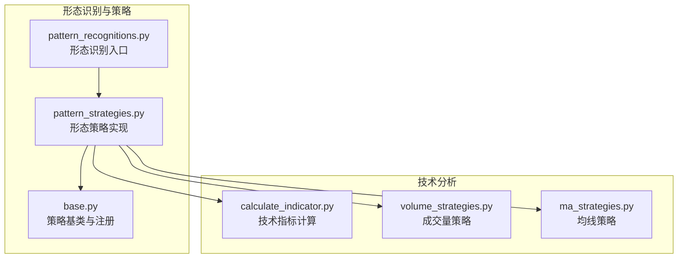
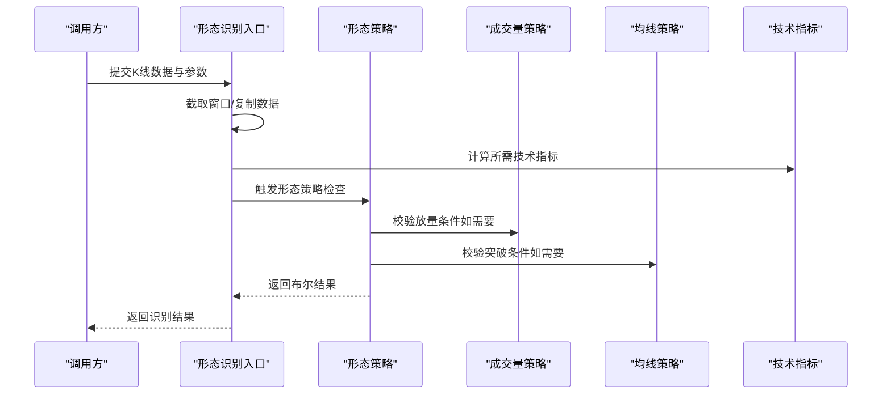
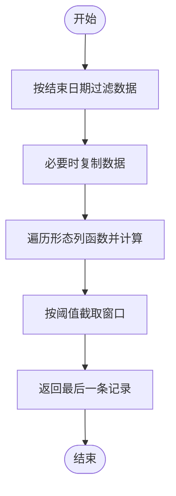
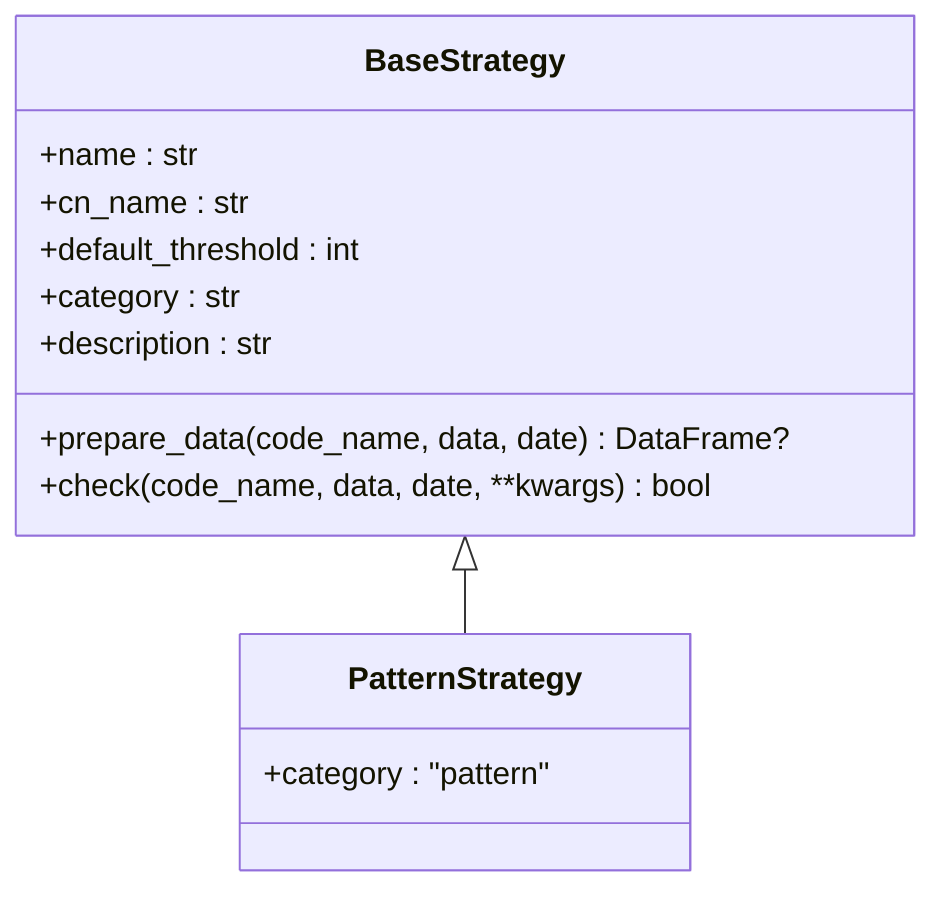
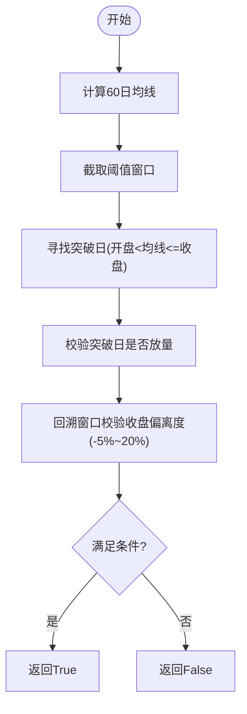
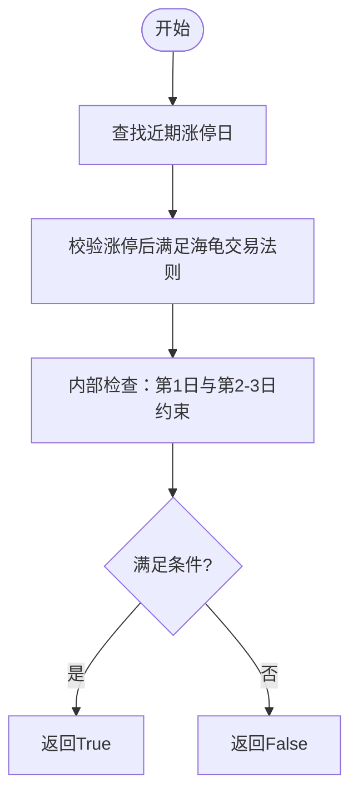
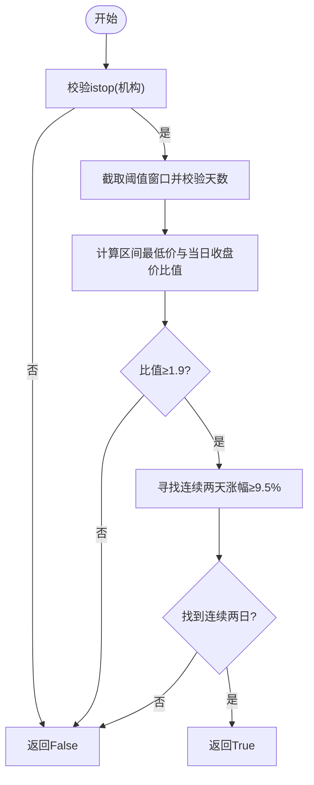
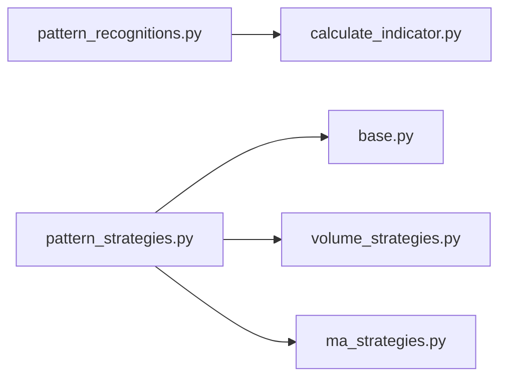

# 持续形态分类

<cite>
**本文引用的文件**
- [pattern_recognitions.py](file://quantia/core/pattern/pattern_recognitions.py)
- [pattern_strategies.py](file://quantia/core/strategy/pattern/pattern_strategies.py)
- [base.py](file://quantia/core/strategy/base.py)
- [calculate_indicator.py](file://quantia/core/indicator/calculate_indicator.py)
- [volume_strategies.py](file://quantia/core/strategy/volume/volume_strategies.py)
- [ma_strategies.py](file://quantia/core/strategy/technical/ma_strategies.py)
- [README.md](file://README.md)
</cite>

## 目录
1. [引言](#引言)
2. [项目结构](#项目结构)
3. [核心组件](#核心组件)
4. [架构总览](#架构总览)
5. [详细组件分析](#详细组件分析)
6. [依赖关系分析](#依赖关系分析)
7. [性能考量](#性能考量)
8. [故障排查指南](#故障排查指南)
9. [结论](#结论)
10. [附录](#附录)

## 引言
本文件面向Quantia系统中的“持续形态分类”能力，系统化梳理项目中已实现的形态识别与策略逻辑，重点覆盖以下内容：
- 持续形态的定义与识别要点（突破平台、停机坪、高而窄的旗形、无大幅回撤）
- 形态与趋势延续的关系、突破方向判断方法
- 技术特征、测量方法与目标价位计算思路
- 形态有效性确认标准与假突破识别技巧
- 不同时间框架下的表现差异与策略适配建议

说明：当前仓库中未直接实现三角形、矩形、楔形、旗形等经典K线形态的自动识别算法，但提供了形态策略的基类与若干基于形态思想的策略实现，可作为构建持续形态识别体系的基础。

## 项目结构
Quantia采用模块化组织，与持续形态相关的代码主要分布在以下路径：
- 形态识别入口与通用逻辑：quantia/core/pattern/
- 形态策略实现：quantia/core/strategy/pattern/
- 策略基类与注册机制：quantia/core/strategy/base.py
- 技术指标计算：quantia/core/indicator/calculate_indicator.py
- 成交量与技术策略：quantia/core/strategy/volume/、quantia/core/strategy/technical/

图表来源
- [pattern_recognitions.py](file://quantia/core/pattern/pattern_recognitions.py#L10-L34)
- [pattern_strategies.py](file://quantia/core/strategy/pattern/pattern_strategies.py#L22-L77)
- [base.py](file://quantia/core/strategy/base.py#L150-L171)
- [calculate_indicator.py](file://quantia/core/indicator/calculate_indicator.py#L23-L404)
- [volume_strategies.py](file://quantia/core/strategy/volume/volume_strategies.py#L19-L68)
- [ma_strategies.py](file://quantia/core/strategy/technical/ma_strategies.py#L140-L166)

章节来源
- [pattern_recognitions.py](file://quantia/core/pattern/pattern_recognitions.py#L10-L34)
- [pattern_strategies.py](file://quantia/core/strategy/pattern/pattern_strategies.py#L22-L77)
- [base.py](file://quantia/core/strategy/base.py#L150-L171)
- [calculate_indicator.py](file://quantia/core/indicator/calculate_indicator.py#L23-L404)
- [volume_strategies.py](file://quantia/core/strategy/volume/volume_strategies.py#L19-L68)
- [ma_strategies.py](file://quantia/core/strategy/technical/ma_strategies.py#L140-L166)

## 核心组件
- 形态识别入口：负责对K线数据进行形态列计算与筛选，支持按日期与阈值截取窗口。
- 形态策略基类：统一策略命名、中文名、默认阈值、分类与注册机制。
- 形态策略实现：
  - 突破平台策略：在平台整理后放量突破60日均线
  - 停机坪策略：涨停后横盘整理，蓄势待发
  - 高而窄的旗形策略：短期快速上涨后窄幅整理，有机构参与
  - 无大幅回撤策略：稳健上涨无大幅回撤，走势健康
- 技术指标与辅助策略：
  - 成交量策略：放量上涨、放量跌停
  - 均线策略：海龟交易法则（60日新高突破）

章节来源
- [pattern_recognitions.py](file://quantia/core/pattern/pattern_recognitions.py#L10-L34)
- [pattern_strategies.py](file://quantia/core/strategy/pattern/pattern_strategies.py#L22-L203)
- [base.py](file://quantia/core/strategy/base.py#L150-L171)
- [volume_strategies.py](file://quantia/core/strategy/volume/volume_strategies.py#L19-L68)
- [ma_strategies.py](file://quantia/core/strategy/technical/ma_strategies.py#L140-L166)

## 架构总览
持续形态分类在系统中的工作流如下：
- 输入：股票历史K线数据（含开盘、最高、最低、收盘、成交量、涨跌幅等）
- 处理：
  - 形态识别入口对数据进行窗口截取与形态列计算
  - 形态策略基于窗口内的K线与技术指标进行条件判定
  - 辅助策略（如成交量策略、均线策略）用于增强形态有效性确认
- 输出：形态识别结果或策略触发信号

图表来源
- [pattern_recognitions.py](file://quantia/core/pattern/pattern_recognitions.py#L10-L34)
- [pattern_strategies.py](file://quantia/core/strategy/pattern/pattern_strategies.py#L37-L77)
- [volume_strategies.py](file://quantia/core/strategy/volume/volume_strategies.py#L34-L68)
- [ma_strategies.py](file://quantia/core/strategy/technical/ma_strategies.py#L153-L166)
- [calculate_indicator.py](file://quantia/core/indicator/calculate_indicator.py#L23-L404)

## 详细组件分析

### 形态识别入口：pattern_recognitions.py
- 功能要点
  - 支持按结束日期与阈值截取数据窗口
  - 对传入的形态列函数批量执行，生成形态标签列
  - 仅保留最后一条记录用于返回
- 关键流程
  - 日期过滤与数据复制
  - 形态列计算循环
  - 结果筛选与返回

图表来源
- [pattern_recognitions.py](file://quantia/core/pattern/pattern_recognitions.py#L10-L34)

章节来源
- [pattern_recognitions.py](file://quantia/core/pattern/pattern_recognitions.py#L10-L34)

### 策略基类：base.py
- 功能要点
  - 定义策略抽象基类与通用数据准备逻辑
  - 提供策略注册装饰器与查询接口
  - 分类常量（technical、volume、trend、pattern、other）
- 设计价值
  - 统一策略接口，便于扩展新的形态策略
  - 通过注册表集中管理策略，便于动态加载与调用

图表来源
- [base.py](file://quantia/core/strategy/base.py#L20-L96)
- [base.py](file://quantia/core/strategy/base.py#L150-L171)

章节来源
- [base.py](file://quantia/core/strategy/base.py#L20-L96)
- [base.py](file://quantia/core/strategy/base.py#L150-L171)

### 突破平台策略：BreakthroughPlatformStrategy
- 形态思想
  - 在平台整理后放量突破60日均线，视为趋势延续信号
- 技术特征
  - 使用60日均线作为关键支撑/阻力位
  - 结合放量上涨确认突破有效性
- 判定流程
  - 计算60日均线并截取阈值窗口
  - 寻找满足“开盘价小于等于均线且收盘价大于均线”的突破日
  - 对突破日进行放量校验
  - 回溯窗口内收盘价与均线偏离度，确保平台期的温和整理

图表来源
- [pattern_strategies.py](file://quantia/core/strategy/pattern/pattern_strategies.py#L37-L77)
- [volume_strategies.py](file://quantia/core/strategy/volume/volume_strategies.py#L34-L68)

章节来源
- [pattern_strategies.py](file://quantia/core/strategy/pattern/pattern_strategies.py#L22-L77)
- [volume_strategies.py](file://quantia/core/strategy/volume/volume_strategies.py#L19-L68)

### 停机坪策略：ParkingApronStrategy
- 形态思想
  - 涨停后横盘整理，蓄势待发，通常伴随缩量
- 技术特征
  - 近期涨幅>9.5%，且满足特定放量条件
  - 涨停次日高开高走，且振幅控制在3%以内
  - 接下来2-3日维持窄幅震荡，涨跌幅控制在5%以内
- 判定流程
  - 查找近期涨停日并验证其后满足“海龟交易法则”（突破60日新高）
  - 校验涨停后3日的K线形态与涨跌幅约束
  - 内部检查函数完成具体约束校验

图表来源
- [pattern_strategies.py](file://quantia/core/strategy/pattern/pattern_strategies.py#L95-L148)
- [ma_strategies.py](file://quantia/core/strategy/technical/ma_strategies.py#L140-L166)

章节来源
- [pattern_strategies.py](file://quantia/core/strategy/pattern/pattern_strategies.py#L80-L148)
- [ma_strategies.py](file://quantia/core/strategy/technical/ma_strategies.py#L140-L166)

### 高而窄的旗形策略：HighTightFlagStrategy
- 形态思想
  - 短期内快速上涨后窄幅整理，通常伴随机构参与
- 技术特征
  - 至少上市60日
  - 当日收盘价/区间最低价≥1.9
  - 区间内连续两天涨幅≥9.5%
  - 龙虎榜上必须有机构
- 判定流程
  - 截取阈值窗口并校验上市天数
  - 计算区间最低价与当日收盘价比值
  - 寻找连续两天涨幅≥9.5%的区间
  - 校验龙虎榜机构标志

图表来源
- [pattern_strategies.py](file://quantia/core/strategy/pattern/pattern_strategies.py#L151-L203)

章节来源
- [pattern_strategies.py](file://quantia/core/strategy/pattern/pattern_strategies.py#L151-L203)

### 无大幅回撤策略：LowBacktraceIncreaseStrategy
- 形态思想
  - 在60日周期内稳健上涨，且无大幅回撤
- 技术特征
  - 60日涨幅>60%
  - 严格限制单日跌幅、高开低走、两日累计跌幅与两日高开低走累计跌幅
- 判定流程
  - 计算60日涨跌幅
  - 逐日校验各项回撤约束，防止出现极端波动

章节来源
- [pattern_strategies.py](file://quantia/core/strategy/pattern/pattern_strategies.py#L206-L250)

### 技术指标与辅助策略
- 成交量策略：放量上涨（涨幅>2%、收盘>开盘、成交额≥2亿、量比≥2）
- 均线策略：海龟交易法则（当日收盘价≥60日最高收盘价）

章节来源
- [volume_strategies.py](file://quantia/core/strategy/volume/volume_strategies.py#L19-L68)
- [ma_strategies.py](file://quantia/core/strategy/technical/ma_strategies.py#L140-L166)

## 依赖关系分析
- 形态识别入口依赖技术指标计算模块，用于生成均线等基础指标
- 形态策略依赖策略基类与注册机制，确保统一接口与可扩展性
- 形态策略可复用成交量与均线策略作为有效性确认手段

图表来源
- [pattern_recognitions.py](file://quantia/core/pattern/pattern_recognitions.py#L10-L34)
- [pattern_strategies.py](file://quantia/core/strategy/pattern/pattern_strategies.py#L22-L77)
- [base.py](file://quantia/core/strategy/base.py#L150-L171)
- [calculate_indicator.py](file://quantia/core/indicator/calculate_indicator.py#L23-L404)
- [volume_strategies.py](file://quantia/core/strategy/volume/volume_strategies.py#L19-L68)
- [ma_strategies.py](file://quantia/core/strategy/technical/ma_strategies.py#L140-L166)

章节来源
- [pattern_recognitions.py](file://quantia/core/pattern/pattern_recognitions.py#L10-L34)
- [pattern_strategies.py](file://quantia/core/strategy/pattern/pattern_strategies.py#L22-L77)
- [base.py](file://quantia/core/strategy/base.py#L150-L171)
- [calculate_indicator.py](file://quantia/core/indicator/calculate_indicator.py#L23-L404)
- [volume_strategies.py](file://quantia/core/strategy/volume/volume_strategies.py#L19-L68)
- [ma_strategies.py](file://quantia/core/strategy/technical/ma_strategies.py#L140-L166)

## 性能考量
- 数据窗口截取与复制：在识别入口与策略准备阶段均可能进行数据复制，注意内存占用与性能影响
- 技术指标计算：使用TA-Lib进行批量计算，整体效率较高，但需避免重复计算
- 策略组合：多个策略可并行执行，但需注意共享数据的读写一致性

## 故障排查指南
- 形态识别为空：检查输入数据是否为空或长度不足阈值
- 突破平台无效：确认60日均线计算是否成功，突破日是否存在，放量校验是否通过
- 停机坪形态不成立：核对涨停日查找逻辑、海龟交易法则校验与内部约束条件
- 高而窄的旗形不触发：检查istop标志、区间最低价与当日收盘价比值、连续两日涨幅条件
- 无大幅回撤失败：逐项检查单日跌幅、高开低走、两日累计跌幅与两日高开低走累计跌幅约束

章节来源
- [pattern_recognitions.py](file://quantia/core/pattern/pattern_recognitions.py#L37-L70)
- [pattern_strategies.py](file://quantia/core/strategy/pattern/pattern_strategies.py#L37-L77)
- [pattern_strategies.py](file://quantia/core/strategy/pattern/pattern_strategies.py#L95-L148)
- [pattern_strategies.py](file://quantia/core/strategy/pattern/pattern_strategies.py#L151-L203)
- [pattern_strategies.py](file://quantia/core/strategy/pattern/pattern_strategies.py#L206-L250)

## 结论
Quantia在持续形态分类方面，已形成以“形态识别入口+策略基类+具体形态策略+辅助技术指标”的完整体系。当前实现聚焦于“突破平台”“停机坪”“高而窄的旗形”“无大幅回撤”等具有明确技术特征的形态策略，并通过成交量与均线策略进行有效性确认。对于三角形、矩形、楔形、旗形等经典K线形态，项目未提供直接的自动识别算法，但策略基类与注册机制为后续扩展奠定了良好基础。

## 附录
- 形态识别结果含义：负值表示卖出信号，0表示无形态，正值表示买入信号
- K线形态列表参考：README中列出的多种K线形态，可用于进一步扩展识别能力

章节来源
- [README.md](file://README.md#L89-L113)
