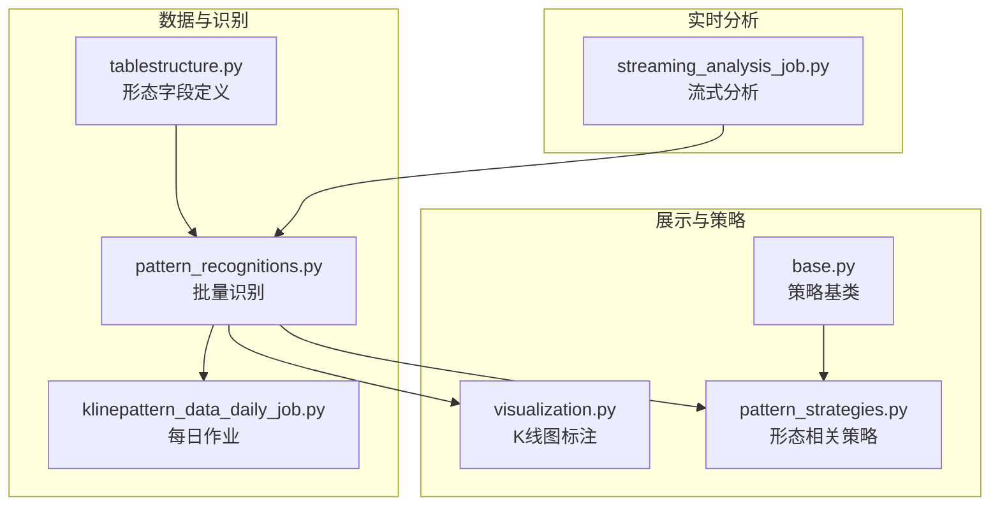
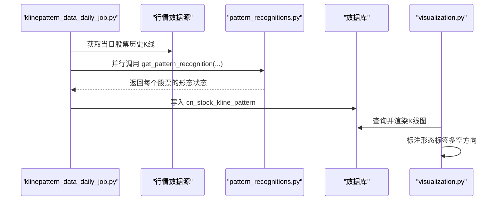
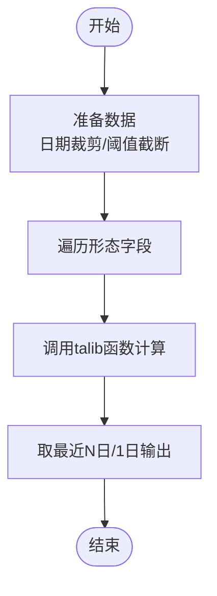
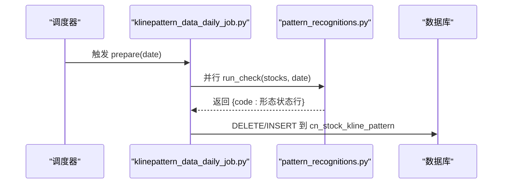
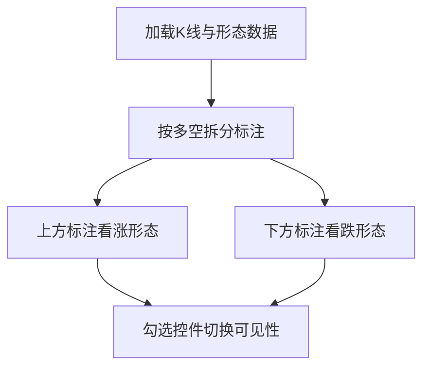
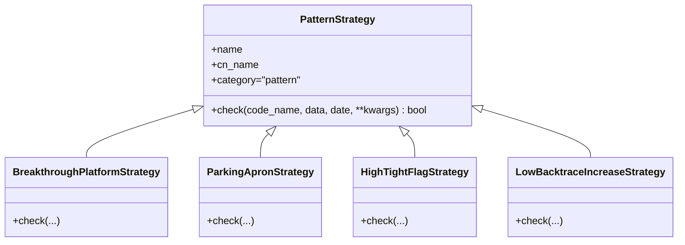
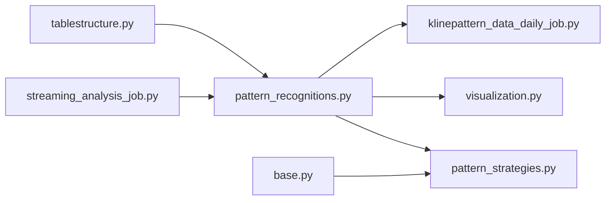

# 特殊形态分类

<cite>
**本文引用的文件**
- [pattern_recognitions.py](file://quantia/core/pattern/pattern_recognitions.py)
- [pattern_strategies.py](file://quantia/core/strategy/pattern/pattern_strategies.py)
- [klinepattern_data_daily_job.py](file://quantia/job/klinepattern_data_daily_job.py)
- [tablestructure.py](file://quantia/core/tablestructure.py)
- [visualization.py](file://quantia/core/kline/visualization.py)
- [base.py](file://quantia/core/strategy/base.py)
- [streaming_analysis_job.py](file://quantia/job/streaming_analysis_job.py)
</cite>

## 目录
1. [引言](#引言)
2. [项目结构](#项目结构)
3. [核心组件](#核心组件)
4. [架构总览](#架构总览)
5. [详细组件分析](#详细组件分析)
6. [依赖分析](#依赖分析)
7. [性能考虑](#性能考虑)
8. [故障排查指南](#故障排查指南)
9. [结论](#结论)
10. [附录](#附录)

## 引言
本文件面向Quantia项目中的“特殊K线形态”识别与应用，系统化梳理缺口形态、早晨之星/黄昏之星、吞没形态、射击之星/流星等特殊K线形态的识别机制、数据结构、可视化标注与实战策略。文档同时给出形态组合与多重确认策略、概率分析思路与实战技巧，并讨论不同市场阶段的有效性。

## 项目结构
围绕“特殊形态”的关键模块包括：
- 形态识别引擎：负责批量计算并落库
- 表结构定义：定义K线形态字段与映射
- 可视化标注：在K线图上标注识别结果
- 策略层：基于形态的选股策略（如突破平台、停机坪等）
- 作业调度：每日跑批生成形态数据



图表来源
- [pattern_recognitions.py](file://quantia/core/pattern/pattern_recognitions.py#L10-L34)
- [tablestructure.py](file://quantia/core/tablestructure.py#L469-L589)
- [klinepattern_data_daily_job.py](file://quantia/job/klinepattern_data_daily_job.py#L63-L83)
- [visualization.py](file://quantia/core/kline/visualization.py#L29-L41)
- [pattern_strategies.py](file://quantia/core/strategy/pattern/pattern_strategies.py#L1-L20)
- [base.py](file://quantia/core/strategy/base.py#L150-L153)
- [streaming_analysis_job.py](file://quantia/job/streaming_analysis_job.py#L165-L402)

章节来源
- [pattern_recognitions.py](file://quantia/core/pattern/pattern_recognitions.py#L10-L34)
- [tablestructure.py](file://quantia/core/tablestructure.py#L469-L589)
- [klinepattern_data_daily_job.py](file://quantia/job/klinepattern_data_daily_job.py#L24-L58)
- [visualization.py](file://quantia/core/kline/visualization.py#L29-L41)
- [pattern_strategies.py](file://quantia/core/strategy/pattern/pattern_strategies.py#L1-L20)
- [base.py](file://quantia/core/strategy/base.py#L150-L153)
- [streaming_analysis_job.py](file://quantia/job/streaming_analysis_job.py#L165-L402)

## 核心组件
- 形态识别引擎：对每只股票的历史K线批量计算70+种形态指标，输出最近一个交易日的形态状态（正负值表示多空方向）。
- 表结构定义：统一管理形态字段的中文名、类型与talib函数映射；同时定义K线形态主表结构。
- 每日作业：拉取当日行情，调用识别引擎，写入数据库，支持并发与去重。
- 可视化标注：在K线图上按形态标注，支持筛选与开关。
- 策略层：以形态为基础的选股策略（如突破平台、停机坪等），作为形态的进一步应用。
- 流式分析：支持实时/回放场景下的形态识别与标注。

章节来源
- [pattern_recognitions.py](file://quantia/core/pattern/pattern_recognitions.py#L10-L34)
- [tablestructure.py](file://quantia/core/tablestructure.py#L469-L589)
- [klinepattern_data_daily_job.py](file://quantia/job/klinepattern_data_daily_job.py#L63-L83)
- [visualization.py](file://quantia/core/kline/visualization.py#L111-L154)
- [pattern_strategies.py](file://quantia/core/strategy/pattern/pattern_strategies.py#L22-L77)
- [streaming_analysis_job.py](file://quantia/job/streaming_analysis_job.py#L165-L402)

## 架构总览
从数据采集到形态识别、落库、展示与策略应用的完整链路如下：



图表来源
- [klinepattern_data_daily_job.py](file://quantia/job/klinepattern_data_daily_job.py#L24-L58)
- [pattern_recognitions.py](file://quantia/core/pattern/pattern_recognitions.py#L37-L70)
- [visualization.py](file://quantia/core/kline/visualization.py#L111-L154)
- [tablestructure.py](file://quantia/core/tablestructure.py#L587-L589)

## 详细组件分析

### 组件A：形态识别引擎（批量）
- 功能要点
  - 对输入数据进行日期裁剪与阈值截断，确保仅分析近期K线。
  - 遍历形态字段定义，调用对应talib函数批量计算，形成“多空状态矩阵”。
  - 输出最近一日的形态状态行，便于入库与前端展示。
- 关键路径
  - 输入准备与截断：[get_pattern_recognitions](file://quantia/core/pattern/pattern_recognitions.py#L10-L34)
  - 单股票识别入口：[get_pattern_recognition](file://quantia/core/pattern/pattern_recognitions.py#L37-L70)
- 性能特性
  - 使用向量化计算（talib），并行度由作业层控制。
  - 截断阈值与尾部窗口减少无效计算。



图表来源
- [pattern_recognitions.py](file://quantia/core/pattern/pattern_recognitions.py#L10-L34)
- [pattern_recognitions.py](file://quantia/core/pattern/pattern_recognitions.py#L37-L70)

章节来源
- [pattern_recognitions.py](file://quantia/core/pattern/pattern_recognitions.py#L10-L34)
- [pattern_recognitions.py](file://quantia/core/pattern/pattern_recognitions.py#L37-L70)

### 组件B：表结构与字段映射
- 形态字段定义
  - 包含70+种形态，如“射击之星”“吞没形态”“晨星/暮星”“缺口形态”等，每个字段包含中文名、类型与talib函数映射。
  - 字段命名遵循talib常量风格，便于与ta-lib接口对接。
- 主表结构
  - K线形态主表在基础外键列基础上扩展上述形态字段，用于每日落库与查询。

```mermaid
erDiagram
CN_STOCK_KLINE_PATTERN {
date date
code varchar
tow_crows smallint
three_white_soldiers smallint
engulfing_pattern smallint
shooting_star smallint
morning_star smallint
evening_star smallint
gap_up_down smallint
... 多个形态字段
}
```

图表来源
- [tablestructure.py](file://quantia/core/tablestructure.py#L469-L589)

章节来源
- [tablestructure.py](file://quantia/core/tablestructure.py#L469-L589)

### 组件C：每日作业（并行识别与落库）
- 功能要点
  - 拉取当日行情数据，调用识别引擎并行处理。
  - 删除同日旧数据，按需建表，写入主表。
  - 支持并发线程池，提升吞吐。
- 关键路径
  - 作业入口与并行提交：[run_check](file://quantia/job/klinepattern_data_daily_job.py#L63-L83)
  - 写入逻辑与去重：[prepare](file://quantia/job/klinepattern_data_daily_job.py#L24-L58)



图表来源
- [klinepattern_data_daily_job.py](file://quantia/job/klinepattern_data_daily_job.py#L24-L58)
- [klinepattern_data_daily_job.py](file://quantia/job/klinepattern_data_daily_job.py#L63-L83)

章节来源
- [klinepattern_data_daily_job.py](file://quantia/job/klinepattern_data_daily_job.py#L24-L58)
- [klinepattern_data_daily_job.py](file://quantia/job/klinepattern_data_daily_job.py#L63-L83)

### 组件D：可视化标注（K线图）
- 功能要点
  - 在K线上方标注“看涨”形态，在下方标注“看跌”形态。
  - 提供形态开关控件，支持全选/全不选。
  - 结合筹码分布与指标面板，辅助研判。
- 关键路径
  - 读取形态字段并标注：[visualization.py](file://quantia/core/kline/visualization.py#L111-L154)



图表来源
- [visualization.py](file://quantia/core/kline/visualization.py#L111-L154)

章节来源
- [visualization.py](file://quantia/core/kline/visualization.py#L111-L154)

### 组件E：形态相关策略（策略层）
- 形态策略基类
  - 统一的策略注册、分类与数据准备流程，便于扩展新形态策略。
- 现有策略示例
  - 突破平台：在平台整理后放量突破60日均线。
  - 停机坪：涨停后横盘整理，蓄势待发。
  - 高而窄的旗形：短期快速上涨后窄幅整理，有机构参与。
  - 无大幅回撤：稳健上涨，严格风控回撤约束。
- 关键路径
  - 策略基类与注册：[base.py](file://quantia/core/strategy/base.py#L150-L170)
  - 策略实现：[pattern_strategies.py](file://quantia/core/strategy/pattern/pattern_strategies.py#L22-L77)



图表来源
- [base.py](file://quantia/core/strategy/base.py#L150-L170)
- [pattern_strategies.py](file://quantia/core/strategy/pattern/pattern_strategies.py#L22-L77)

章节来源
- [base.py](file://quantia/core/strategy/base.py#L150-L170)
- [pattern_strategies.py](file://quantia/core/strategy/pattern/pattern_strategies.py#L22-L77)

### 组件F：流式分析（实时/回放）
- 功能要点
  - 确保目标表结构存在，按需建表与类型推导。
  - 在流式场景下重复利用形态识别能力，支撑回放与实时标注。
- 关键路径
  - 表结构校验与建表：[streaming_analysis_job.py](file://quantia/job/streaming_analysis_job.py#L165-L402)

章节来源
- [streaming_analysis_job.py](file://quantia/job/streaming_analysis_job.py#L165-L402)

## 依赖分析
- 形态识别依赖talib函数族，字段定义集中于表结构模块。
- 作业层通过并发线程池提升吞吐，避免阻塞。
- 可视化依赖Bokeh组件，按形态字段动态生成标注集合。
- 策略层依赖基类与注册表，便于扩展与统一管理。



图表来源
- [tablestructure.py](file://quantia/core/tablestructure.py#L469-L589)
- [pattern_recognitions.py](file://quantia/core/pattern/pattern_recognitions.py#L10-L34)
- [klinepattern_data_daily_job.py](file://quantia/job/klinepattern_data_daily_job.py#L63-L83)
- [visualization.py](file://quantia/core/kline/visualization.py#L111-L154)
- [pattern_strategies.py](file://quantia/core/strategy/pattern/pattern_strategies.py#L22-L77)
- [base.py](file://quantia/core/strategy/base.py#L150-L170)
- [streaming_analysis_job.py](file://quantia/job/streaming_analysis_job.py#L165-L402)

## 性能考虑
- 向量化计算：使用talib进行批量计算，避免逐行循环。
- 并行处理：作业层使用线程池并发提交识别任务，显著缩短批处理时延。
- 数据截断：通过阈值与尾部窗口限制计算范围，降低内存与CPU压力。
- I/O优化：按日删除旧数据，避免重复写入与索引膨胀。

## 故障排查指南
- 识别为空
  - 检查输入数据是否为空或长度不足：[get_pattern_recognition](file://quantia/core/pattern/pattern_recognitions.py#L37-L70)
  - 确认日期裁剪逻辑与阈值设置是否合理。
- 写入失败
  - 检查表是否存在与字段类型推导：[prepare](file://quantia/job/klinepattern_data_daily_job.py#L24-L58)
  - 核对数据库连接与权限。
- 可视化不显示
  - 确认形态字段是否正确标注（多空方向）：[visualization.py](file://quantia/core/kline/visualization.py#L111-L154)
  - 检查勾选控件状态与标签集合生成。

章节来源
- [pattern_recognitions.py](file://quantia/core/pattern/pattern_recognitions.py#L37-L70)
- [klinepattern_data_daily_job.py](file://quantia/job/klinepattern_data_daily_job.py#L24-L58)
- [visualization.py](file://quantia/core/kline/visualization.py#L111-L154)

## 结论
Quantia通过统一的形态字段定义、高效的批量识别与落库、直观的可视化标注以及可扩展的策略基类，构建了覆盖70+种特殊K线形态的识别体系。结合缺口、吞没、晨昏星、射击之星/流星等形态，可在不同市场阶段进行多因子确认与组合应用，提升选股质量与回测稳定性。

## 附录

### 特殊形态清单与识别函数映射
以下为部分形态字段与其talib函数映射（来源于表结构定义）：
- 射击之星：[CDLSHOOTINGSTAR](file://quantia/core/tablestructure.py#L497-L498)
- 黄昏之星：[CDLEVENINGSTAR](file://quantia/core/tablestructure.py#L537-L538)
- 晨星：[CDLMORNINGSTAR](file://quantia/core/tablestructure.py#L563-L564)
- 十字星：[CDLDOJISTAR](file://quantia/core/tablestructure.py#L482-L483)
- 吞没形态：[CDLENGULFING](file://quantia/core/tablestructure.py#L505-L506)
- 上升/下降跳空三法：[CDLXSIDEGAP3METHODS](file://quantia/core/tablestructure.py#L584-L585)
- 向上/下跳空并列阳线：[CDLGAPSIDESIDEWHITE](file://quantia/core/tablestructure.py#L512-L513)
- 三只乌鸦：[CDL3BLACKCROWS](file://quantia/core/tablestructure.py#L474-L475)
- 三白兵：[CDL3WHITESOLDIERS](file://quantia/core/tablestructure.py#L526-L527)
- 乌云压顶：[CDLDARKCLOUDCOVER](file://quantia/core/tablestructure.py#L480-L481)
- 上吊线：[CDLHANGINGMAN](file://quantia/core/tablestructure.py#L485-L486)
- 陷阱/修正陷阱：[CDLHIKKAKE/CDLHIKKAKEMOD](file://quantia/core/tablestructure.py#L487-L490)
- 颈内/颈上：[CDLINNECK/CDLONNECK](file://quantia/core/tablestructure.py#L491-L494)
- 插入：[CDLTHRUSTING](file://quantia/core/tablestructure.py#L495-L496)
- 收盘缺影线：[CDLCLOSINGMARUBOZU](file://quantia/core/tablestructure.py#L509-L510)
- 十字/长脚十字/墓碑十字：[CDLDOJI/CDLLONGLEGGEDDOJI/CDLGRAVESTONEDOJI](file://quantia/core/tablestructure.py#L511-L511)
- 锤头/倒锤头：[CDLHAMMER/CDLINVERTEDHAMMER](file://quantia/core/tablestructure.py#L541-L541)
- 母子线/十字孕线：[CDLHARAMI/CDLHARAMICROSS](file://quantia/core/tablestructure.py#L542-L545)
- 家鸽：[CDLHOMINGPIGEON](file://quantia/core/tablestructure.py#L546-L547)
- 反冲形态：[CDLKICKING/CDLKICKINGBYLENGTH](file://quantia/core/tablestructure.py#L550-L553)
- 梯底：[CDLLADDERBOTTOM](file://quantia/core/tablestructure.py#L554-L555)
- 长/短蜡烛：[CDLLONGLINE/CDLSHORTLINE](file://quantia/core/tablestructure.py#L556-L557)
- 分离线：[CDLSEPARATINGLINES](file://quantia/core/tablestructure.py#L569-L570)
- 条形三明治：[CDLSTICKSANDWICH](file://quantia/core/tablestructure.py#L575-L576)
- 探水竿：[CDLTAKURI](file://quantia/core/tablestructure.py#L577-L577)
- 跳空并列阴阳线：[CDLTASUKIGAP](file://quantia/core/tablestructure.py#L578-L578)
- 三星：[CDLTRISTAR](file://quantia/core/tablestructure.py#L580-L580)
- 奇特三河床：[CDLUNIQUE3RIVER](file://quantia/core/tablestructure.py#L582-L583)

### 特殊形态识别特征与市场含义（概述）
- 缺口形态
  - 识别特征：跳空高开/低开，伴随一定量能变化；通常出现在突破或反转初期。
  - 市场含义：短期情绪与资金行为的快速释放，需结合量能与后续K线确认。
- 早晨之星/黄昏之星
  - 识别特征：三根K线构成，中间实体较小，方向相反；常出现在顶部或底部。
  - 市场含义：见底/见顶信号，需配合趋势与成交量确认。
- 吞没形态
  - 识别特征：前一根K线被后一根K线实体完全覆盖，方向反转。
  - 市场含义：反转信号，常见于震荡末端或趋势转折点。
- 射击之星/流星
  - 识别特征：长下影线，实体偏小，上影线较长；常出现在上涨末期。
  - 市场含义：见顶信号，需结合成交量与后续K线确认。

### 组合使用与多重确认策略
- 时间窗口叠加：在形态出现前后设定短期（如3-5日）与中期（如10-20日）确认窗口。
- 成交量确认：形态出现当日或次日放量突破/缩量回调，增强可信度。
- 技术指标共振：结合均线、MACD、布林带等指标，过滤假突破。
- 市场阶段匹配：在震荡末端、上升末期、下降末期分别侧重不同形态的组合权重。

### 实战应用技巧
- 优先选择流动性好、波动适中的标的，降低形态误判风险。
- 关注形态出现的背景：突破平台、停机坪等策略更适用于阶段性企稳或突破。
- 控制回撤与连阴：无大幅回撤策略可作为形态组合的风控补充。

### 不同市场阶段的有效性
- 牛市早期：晨星、吞没、射击之星等反转形态较常见，但需注意真假突破。
- 牛市中后期：射击之星、黄昏之星等见顶信号增多，应提高警惕。
- 熊市：锤头、倒锤头等底部反转形态增多，但需结合成交量与趋势确认。
- 震荡：缺口、母子线等短期信号较多，适合波段操作。
