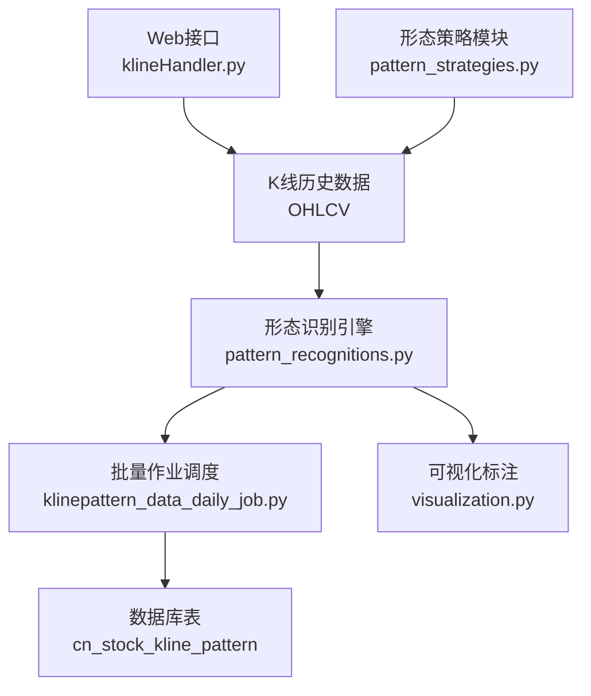
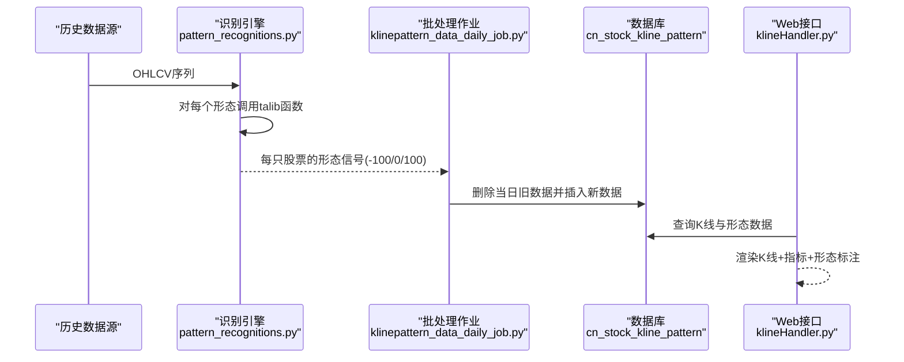
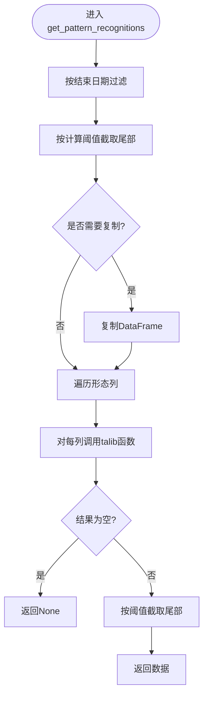
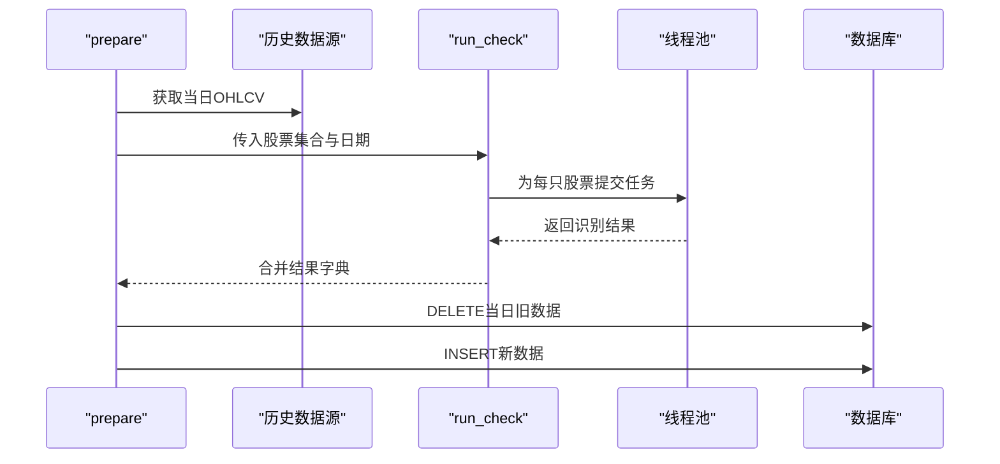
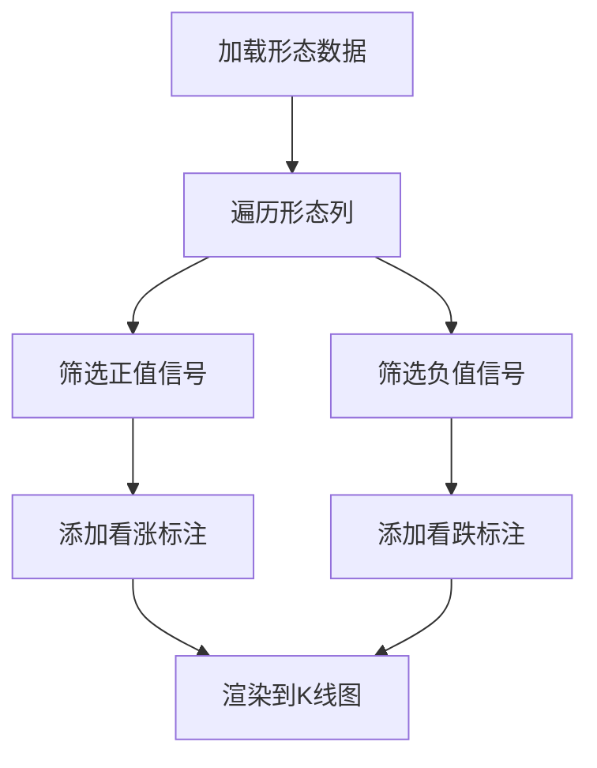
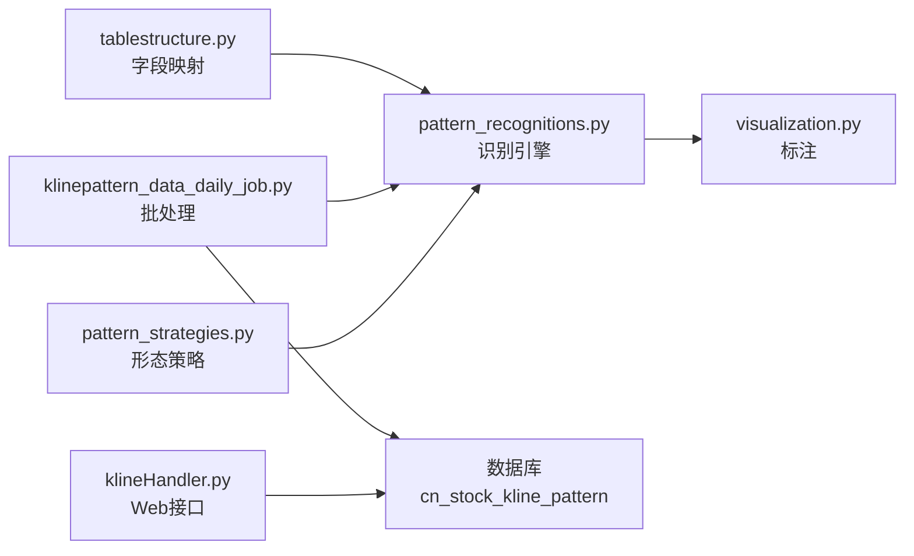

# K线形态识别

<cite>
**本文引用的文件**
- [pattern_recognitions.py](file://quantia/core/pattern/pattern_recognitions.py)
- [klinepattern_data_daily_job.py](file://quantia/job/klinepattern_data_daily_job.py)
- [tablestructure.py](file://quantia/core/tablestructure.py)
- [database_schema.md](file://document/database_schema.md)
- [README.md](file://README.md)
- [klineHandler.py](file://quantia/web/klineHandler.py)
- [visualization.py](file://quantia/core/kline/visualization.py)
- [pattern_strategies.py](file://quantia/core/strategy/pattern/pattern_strategies.py)
</cite>

## 目录
1. [简介](#简介)
2. [项目结构](#项目结构)
3. [核心组件](#核心组件)
4. [架构总览](#架构总览)
5. [详细组件分析](#详细组件分析)
6. [依赖关系分析](#依赖关系分析)
7. [性能考虑](#性能考虑)
8. [故障排查指南](#故障排查指南)
9. [结论](#结论)
10. [附录](#附录)

## 简介
本文件面向Quantia K线形态识别系统，围绕61种K线形态的识别算法、判断标准、应用场景与工程实现展开，帮助用户准确理解与应用K线形态进行技术分析。内容涵盖：
- 形态识别算法与数据流
- 判断标准与信号含义（看涨/中性/看跌）
- 多时间框架与形态组合分析建议
- 参数调整与准确性优化策略
- 工程化实现（批处理、并发、入库）

## 项目结构
与K线形态识别直接相关的模块与文件：
- 形态识别核心：pattern_recognitions.py
- 批处理调度与入库：klinepattern_data_daily_job.py
- 形态字段定义与映射：tablestructure.py
- 数据库表结构：database_schema.md
- 形态列表与说明：README.md
- 可视化标注：visualization.py
- Web接口与多周期支持：klineHandler.py
- 形态策略（形态驱动的交易策略）：pattern_strategies.py

图表来源
- [pattern_recognitions.py](file://quantia/core/pattern/pattern_recognitions.py#L10-L34)
- [klinepattern_data_daily_job.py](file://quantia/job/klinepattern_data_daily_job.py#L24-L57)
- [tablestructure.py](file://quantia/core/tablestructure.py#L469-L585)
- [database_schema.md](file://document/database_schema.md#L461-L533)
- [visualization.py](file://quantia/core/kline/visualization.py#L115-L158)
- [klineHandler.py](file://quantia/web/klineHandler.py#L212-L360)
- [pattern_strategies.py](file://quantia/core/strategy/pattern/pattern_strategies.py#L1-L27)

章节来源
- [pattern_recognitions.py](file://quantia/core/pattern/pattern_recognitions.py#L10-L71)
- [klinepattern_data_daily_job.py](file://quantia/job/klinepattern_data_daily_job.py#L24-L94)
- [tablestructure.py](file://quantia/core/tablestructure.py#L469-L585)
- [database_schema.md](file://document/database_schema.md#L461-L533)
- [README.md](file://README.md#L89-L113)
- [klineHandler.py](file://quantia/web/klineHandler.py#L212-L360)
- [visualization.py](file://quantia/core/kline/visualization.py#L115-L158)
- [pattern_strategies.py](file://quantia/core/strategy/pattern/pattern_strategies.py#L1-L27)

## 核心组件
- 形态识别引擎
  - 输入：OHLCV序列（开盘、最高、最低、收盘）
  - 输出：每只股票在每个形态上的信号值（-100/0/100）
  - 关键函数：get_pattern_recognitions、get_pattern_recognition
- 批处理与入库
  - 并发执行形态识别，按日期删除旧数据并写入新结果
- 字段定义与映射
  - STOCK_KLINE_PATTERN_DATA定义61种形态字段及对应talib函数
- 数据库表
  - cn_stock_kline_pattern存储每日每只股票的61种形态信号
- 可视化
  - 在K线下方标注形态标签，区分看涨/看跌
- Web接口
  - 支持多周期（日/周/月/季/年）K线与指标展示

章节来源
- [pattern_recognitions.py](file://quantia/core/pattern/pattern_recognitions.py#L10-L71)
- [klinepattern_data_daily_job.py](file://quantia/job/klinepattern_data_daily_job.py#L63-L84)
- [tablestructure.py](file://quantia/core/tablestructure.py#L469-L585)
- [database_schema.md](file://document/database_schema.md#L461-L533)
- [visualization.py](file://quantia/core/kline/visualization.py#L115-L158)
- [klineHandler.py](file://quantia/web/klineHandler.py#L212-L360)

## 架构总览
K线形态识别从历史数据读取开始，经由识别引擎计算61种形态信号，再由批处理作业写入数据库，并在Web端以K线图叠加标注展示。

图表来源
- [pattern_recognitions.py](file://quantia/core/pattern/pattern_recognitions.py#L10-L34)
- [klinepattern_data_daily_job.py](file://quantia/job/klinepattern_data_daily_job.py#L24-L57)
- [database_schema.md](file://document/database_schema.md#L461-L533)
- [klineHandler.py](file://quantia/web/klineHandler.py#L237-L354)

## 详细组件分析

### 组件A：形态识别引擎（pattern_recognitions.py）
- 功能要点
  - 支持按结束日期筛选与阈值截断，控制计算窗口
  - 对每个形态字段调用对应的talib函数，得到标准化信号值
  - 返回最近一条记录作为最终结果
- 关键流程

图表来源
- [pattern_recognitions.py](file://quantia/core/pattern/pattern_recognitions.py#L10-L34)

章节来源
- [pattern_recognitions.py](file://quantia/core/pattern/pattern_recognitions.py#L10-L71)

### 组件B：批处理与入库（klinepattern_data_daily_job.py）
- 功能要点
  - 从历史数据源获取当日股票数据
  - 并发执行get_pattern_recognition，收集结果
  - 删除当日旧数据，插入新结果
- 关键流程

图表来源
- [klinepattern_data_daily_job.py](file://quantia/job/klinepattern_data_daily_job.py#L24-L84)
- [tablestructure.py](file://quantia/core/tablestructure.py#L587-L589)

章节来源
- [klinepattern_data_daily_job.py](file://quantia/job/klinepattern_data_daily_job.py#L24-L94)

### 组件C：形态字段定义与映射（tablestructure.py）
- 定义
  - STOCK_KLINE_PATTERN_DATA：61种形态字段名、中文名、类型与talib函数映射
  - TABLE_CN_STOCK_KLINE_PATTERN：数据库表结构（含外键与61个形态字段）
- 字段覆盖
  - 包含反转形态（如锤头、吞没、晨星、暮星）、持续形态（如三角旗、矩形）、缺口形态（如向上/下跳空三法）等

章节来源
- [tablestructure.py](file://quantia/core/tablestructure.py#L469-L585)
- [tablestructure.py](file://quantia/core/tablestructure.py#L587-L589)
- [database_schema.md](file://document/database_schema.md#L461-L533)

### 组件D：数据库表结构（database_schema.md）
- 表名：cn_stock_kline_pattern
- 主键：date, code
- 字段：date、code、name、61个形态字段（值域：-100/0/100）
- 索引：code

章节来源
- [database_schema.md](file://document/database_schema.md#L461-L533)

### 组件E：可视化标注（visualization.py）
- 功能要点
  - 将形态信号标注在K线下方，看涨用红色上标，看跌用绿色下标
  - 支持按形态开关显示/隐藏
- 流程

图表来源
- [visualization.py](file://quantia/core/kline/visualization.py#L115-L158)

章节来源
- [visualization.py](file://quantia/core/kline/visualization.py#L115-L158)

### 组件F：Web接口与多时间框架（klineHandler.py）
- 功能要点
  - 提供K线JSON接口，支持日/周/月/季/年周期重采样
  - 返回OHLC、成交量、MA、布林、RSI、MACD、KDJ、WR等指标
- 多时间框架
  - 通过resample实现周线/月线/季线/年线

章节来源
- [klineHandler.py](file://quantia/web/klineHandler.py#L212-L360)

### 组件G：形态策略（pattern_strategies.py）
- 功能要点
  - 基于形态构建交易策略（如突破平台、停机坪、高而窄旗形、低回撤上涨等）
  - 与形态识别结果联动，形成“形态确认+策略执行”的闭环

章节来源
- [pattern_strategies.py](file://quantia/core/strategy/pattern/pattern_strategies.py#L1-L27)

## 依赖关系分析
- 形态识别依赖talib函数族，通过tablestructure.py中的映射统一调用
- 批处理作业依赖历史数据源与数据库写入
- 可视化依赖识别结果与K线数据
- Web接口依赖数据库查询与历史数据缓存

图表来源
- [tablestructure.py](file://quantia/core/tablestructure.py#L469-L585)
- [pattern_recognitions.py](file://quantia/core/pattern/pattern_recognitions.py#L22-L24)
- [klinepattern_data_daily_job.py](file://quantia/job/klinepattern_data_daily_job.py#L63-L84)
- [database_schema.md](file://document/database_schema.md#L461-L533)
- [visualization.py](file://quantia/core/kline/visualization.py#L115-L158)
- [klineHandler.py](file://quantia/web/klineHandler.py#L237-L354)
- [pattern_strategies.py](file://quantia/core/strategy/pattern/pattern_strategies.py#L1-L27)

章节来源
- [tablestructure.py](file://quantia/core/tablestructure.py#L469-L585)
- [pattern_recognitions.py](file://quantia/core/pattern/pattern_recognitions.py#L10-L34)
- [klinepattern_data_daily_job.py](file://quantia/job/klinepattern_data_daily_job.py#L63-L84)
- [database_schema.md](file://document/database_schema.md#L461-L533)
- [visualization.py](file://quantia/core/kline/visualization.py#L115-L158)
- [klineHandler.py](file://quantia/web/klineHandler.py#L237-L354)
- [pattern_strategies.py](file://quantia/core/strategy/pattern/pattern_strategies.py#L1-L27)

## 性能考虑
- 并发执行
  - 批处理使用线程池并发识别各股票的形态，提升吞吐
- 计算窗口控制
  - 通过阈值与计算阈值限制输入长度，降低复杂度
- 数据截断与内存
  - 识别后按阈值截断，避免冗余数据占用内存
- I/O优化
  - 批量删除旧数据后一次性插入，减少事务开销

章节来源
- [klinepattern_data_daily_job.py](file://quantia/job/klinepattern_data_daily_job.py#L63-L84)
- [pattern_recognitions.py](file://quantia/core/pattern/pattern_recognitions.py#L10-L34)

## 故障排查指南
- 无形态数据
  - 检查历史数据源是否返回None或空集
  - 检查批处理作业日志是否有异常
- 形态值异常
  - 确认talib函数映射是否正确
  - 检查输入OHLCV是否缺失或异常
- 可视化不显示
  - 检查形态标注逻辑与开关状态
  - 确认K线数据与形态数据索引匹配
- Web接口报错
  - 检查缓存命中情况与参数校验
  - 确认多周期重采样逻辑

章节来源
- [klinepattern_data_daily_job.py](file://quantia/job/klinepattern_data_daily_job.py#L24-L61)
- [pattern_recognitions.py](file://quantia/core/pattern/pattern_recognitions.py#L22-L26)
- [visualization.py](file://quantia/core/kline/visualization.py#L115-L158)
- [klineHandler.py](file://quantia/web/klineHandler.py#L250-L259)

## 结论
Quantia的K线形态识别系统以talib函数为核心，通过统一的字段映射与批处理机制，实现了对61种形态的标准化识别与入库；配合Web端多周期展示与可视化标注，为技术分析提供了直观、可扩展的工具链。建议在实际应用中结合多时间框架与形态组合策略，进一步提升识别的稳定性与有效性。

## 附录

### 61种K线形态清单与含义（节选）
- 反转形态：锤头、上吊线、倒锤头、剃刀线、吞没、孕线、十字孕线、晨星、暮星、十字星、射击之星、乌云压顶、刺透形态、舍子多头、舍子空头、墓碑十字、蜻蜓十字、T字十字、长脚十字、长蜡烛、短蜡烛、纺锤、风高浪大线、光头光脚/缺影线、收盘缺影线、吞噬模式、藏婴吞没、反击线、弃婴、家鸽、母子线、三角旗、矩形、缺口形态（向上/下跳空并列阳线、上升/下降跳空三法等）
- 持续形态：三内部上涨/下跌、三外部上涨/下跌、三只乌鸦、三胞胎乌鸦、三线打击、三个白兵、南方三星、三星、奇特三河床、条形三明治、停顿形态、探水竿、梯底、由较长缺影线决定的反冲形态、反冲形态、插入、分离线、大敌当前、脱离、相同低价、铺垫、黄包车夫、向上跳空的两只乌鸦、跳空并列阴阳线、跳空三法等

章节来源
- [README.md](file://README.md#L89-L113)
- [tablestructure.py](file://quantia/core/tablestructure.py#L469-L585)

### 信号值与应用场景
- 信号值：-100（看跌）、0（无信号）、100（看涨）
- 应用场景：短期趋势判断、买卖点确认、多时间框架共振、形态组合强化

章节来源
- [README.md](file://README.md#L101-L106)

### 多时间框架与形态确认
- 多时间框架：日线为主，周/月/季/年线辅助确认趋势
- 形态确认：结合成交量、均线、布林带等指标进行确认

章节来源
- [klineHandler.py](file://quantia/web/klineHandler.py#L262-L271)
- [pattern_strategies.py](file://quantia/core/strategy/pattern/pattern_strategies.py#L1-L27)
