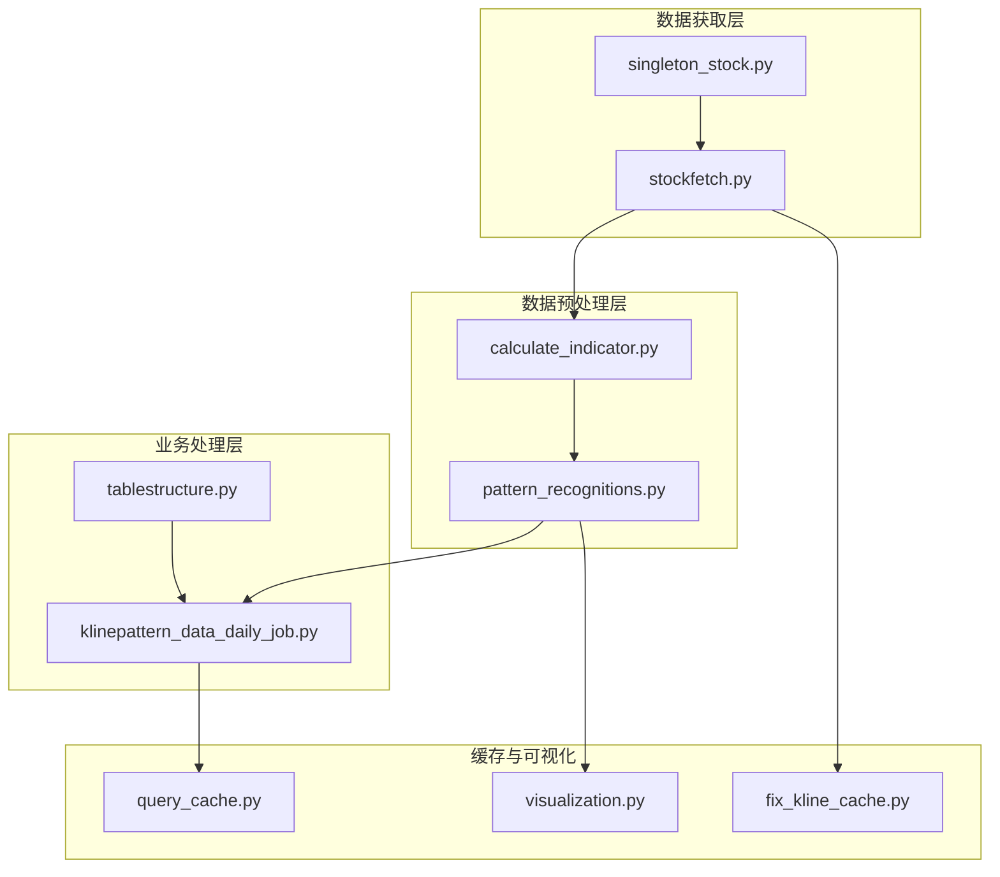
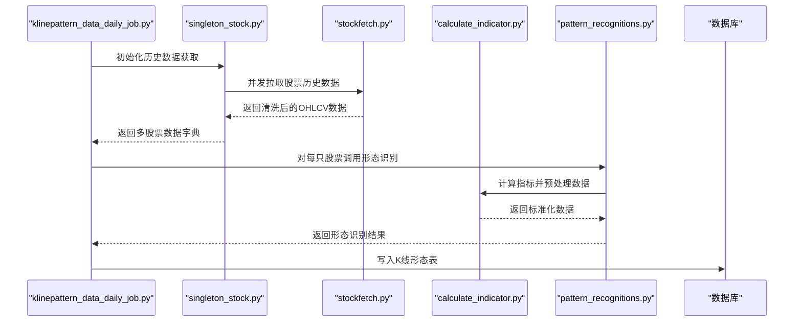
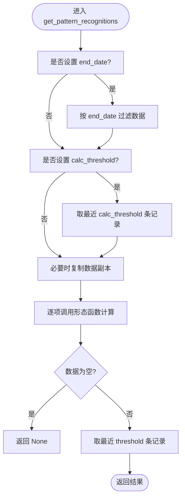
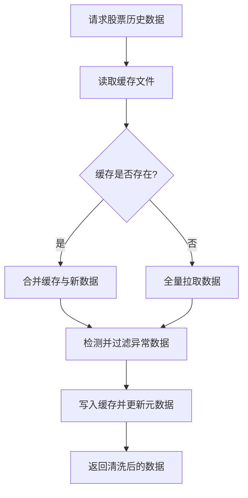
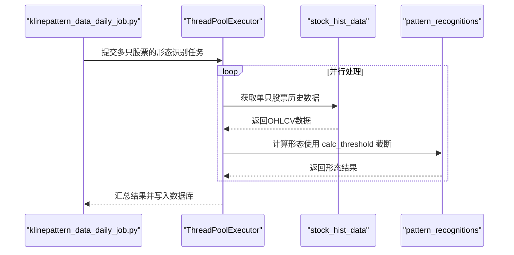
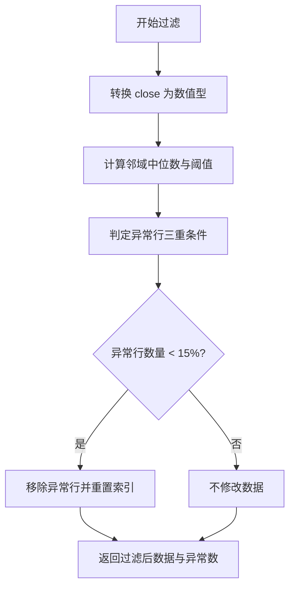
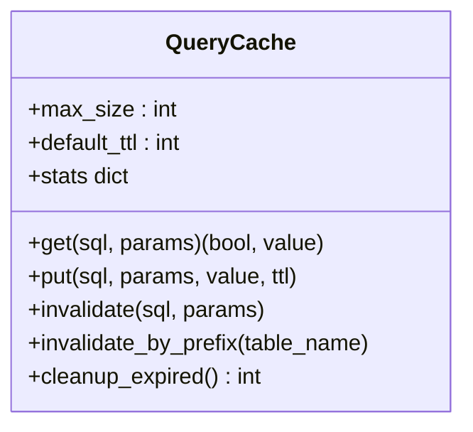
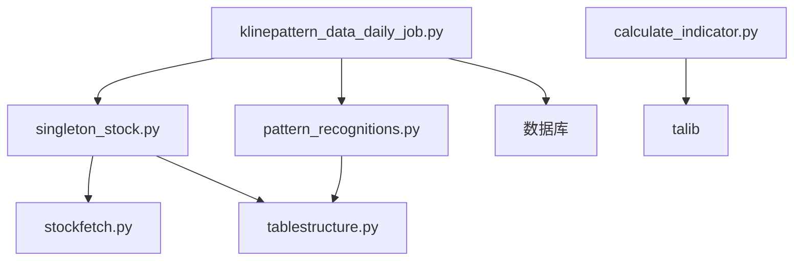

# 形态数据处理流程

<cite>
**本文档引用的文件**
- [pattern_recognitions.py](file://quantia/core/pattern/pattern_recognitions.py)
- [klinepattern_data_daily_job.py](file://quantia/job/klinepattern_data_daily_job.py)
- [stockfetch.py](file://quantia/core/stockfetch.py)
- [singleton_stock.py](file://quantia/core/singleton_stock.py)
- [tablestructure.py](file://quantia/core/tablestructure.py)
- [calculate_indicator.py](file://quantia/core/indicator/calculate_indicator.py)
- [visualization.py](file://quantia/core/kline/visualization.py)
- [query_cache.py](file://quantia/lib/query_cache.py)
- [fix_kline_cache.py](file://fix_kline_cache.py)
</cite>

## 目录
1. [引言](#引言)
2. [项目结构](#项目结构)
3. [核心组件](#核心组件)
4. [架构概览](#架构概览)
5. [详细组件分析](#详细组件分析)
6. [依赖分析](#依赖分析)
7. [性能考虑](#性能考虑)
8. [故障排除指南](#故障排除指南)
9. [结论](#结论)

## 引言
本文档深入解析 Quantia 项目的 K 线形态数据处理流程，涵盖从历史数据获取、异常数据过滤、形态识别前的数据预处理，到多股票并行处理与结果缓存的完整技术路径。重点解释以下关键环节：
- 形态识别前的数据预处理：数据过滤、时间范围选择、阈值设置
- 数据截取机制（calc_threshold 参数）与结果缓存策略
- 异常数据处理与数据质量保障措施
- 多股票并行处理的实现方式与性能优化策略
- 最佳实践与常见问题解决方案

## 项目结构
该项目采用分层架构，核心围绕 K 线形态识别构建，涉及数据获取、缓存、指标计算、形态识别与并行处理等多个模块。

**图表来源**
- [stockfetch.py](file://quantia/core/stockfetch.py#L919-L956)
- [singleton_stock.py](file://quantia/core/singleton_stock.py#L40-L105)
- [calculate_indicator.py](file://quantia/core/indicator/calculate_indicator.py#L23-L34)
- [pattern_recognitions.py](file://quantia/core/pattern/pattern_recognitions.py#L10-L34)
- [klinepattern_data_daily_job.py](file://quantia/job/klinepattern_data_daily_job.py#L24-L83)
- [tablestructure.py](file://quantia/core/tablestructure.py#L468-L468)
- [query_cache.py](file://quantia/lib/query_cache.py#L27-L156)
- [visualization.py](file://quantia/core/kline/visualization.py#L29-L41)
- [fix_kline_cache.py](file://fix_kline_cache.py#L1-L40)

**章节来源**
- [stockfetch.py](file://quantia/core/stockfetch.py#L919-L956)
- [singleton_stock.py](file://quantia/core/singleton_stock.py#L40-L105)
- [calculate_indicator.py](file://quantia/core/indicator/calculate_indicator.py#L23-L34)
- [pattern_recognitions.py](file://quantia/core/pattern/pattern_recognitions.py#L10-L34)
- [klinepattern_data_daily_job.py](file://quantia/job/klinepattern_data_daily_job.py#L24-L83)
- [tablestructure.py](file://quantia/core/tablestructure.py#L468-L468)
- [query_cache.py](file://quantia/lib/query_cache.py#L27-L156)
- [visualization.py](file://quantia/core/kline/visualization.py#L29-L41)
- [fix_kline_cache.py](file://fix_kline_cache.py#L1-L40)

## 核心组件
- 形态识别核心：pattern_recognitions.py 提供形态识别的预处理与计算接口，支持 end_date 时间过滤、calc_threshold 截断计算窗口、threshold 结果截断。
- 数据获取与缓存：stockfetch.py 实现增量缓存、异常数据过滤与数据源健康度管理；singleton_stock.py 提供多线程历史数据获取。
- 指标计算：calculate_indicator.py 在形态识别前对 OHLCV 数据进行标准化与指标填充，确保数值稳定性。
- 任务调度与并行：klinepattern_data_daily_job.py 负责每日任务调度，使用 ThreadPoolExecutor 并行处理多股票。
- 数据结构与表定义：tablestructure.py 定义 K 线形态字段映射与表结构。
- 缓存与可视化：query_cache.py 提供 Web 查询缓存；visualization.py 展示形态标注。
- 缓存修复：fix_kline_cache.py 修复受污染的缓存文件。

**章节来源**
- [pattern_recognitions.py](file://quantia/core/pattern/pattern_recognitions.py#L10-L34)
- [stockfetch.py](file://quantia/core/stockfetch.py#L919-L956)
- [singleton_stock.py](file://quantia/core/singleton_stock.py#L40-L105)
- [calculate_indicator.py](file://quantia/core/indicator/calculate_indicator.py#L23-L34)
- [klinepattern_data_daily_job.py](file://quantia/job/klinepattern_data_daily_job.py#L63-L83)
- [tablestructure.py](file://quantia/core/tablestructure.py#L468-L468)
- [query_cache.py](file://quantia/lib/query_cache.py#L27-L156)
- [visualization.py](file://quantia/core/kline/visualization.py#L29-L41)
- [fix_kline_cache.py](file://fix_kline_cache.py#L1-L40)

## 架构概览
形态数据处理流程从历史数据获取开始，经过异常数据过滤与指标计算，进入形态识别阶段，并最终写入数据库。并行处理贯穿数据获取与形态识别两个关键阶段。

**图表来源**
- [klinepattern_data_daily_job.py](file://quantia/job/klinepattern_data_daily_job.py#L24-L57)
- [singleton_stock.py](file://quantia/core/singleton_stock.py#L84-L98)
- [stockfetch.py](file://quantia/core/stockfetch.py#L919-L956)
- [calculate_indicator.py](file://quantia/core/indicator/calculate_indicator.py#L23-L34)
- [pattern_recognitions.py](file://quantia/core/pattern/pattern_recognitions.py#L10-L34)

## 详细组件分析

### 形态识别预处理与数据截取
- 时间范围选择：通过 end_date 过滤数据，确保仅对指定日期之前的数据进行形态识别。
- 数据截取机制（calc_threshold）：仅使用最近 N 条记录参与形态计算，有效降低计算复杂度并聚焦近期形态。
- 结果截断（threshold）：对识别结果进行尾部截断，保留最近 N 条记录，便于展示与分析。

**图表来源**
- [pattern_recognitions.py](file://quantia/core/pattern/pattern_recognitions.py#L10-L34)

**章节来源**
- [pattern_recognitions.py](file://quantia/core/pattern/pattern_recognitions.py#L10-L34)

### 数据获取与缓存策略
- 增量缓存：支持尾部追加、向前补数据与全量拉取三种场景，减少重复网络请求。
- 异常数据过滤：检测并移除异常价格与成交量数据，防止月度聚合数据污染。
- 数据源健康度管理：基于失败计数与冷却时间的降级策略，提升整体稳定性。
- 缓存元数据：记录最后更新日期与过滤版本号，避免重复过滤。

**图表来源**
- [stockfetch.py](file://quantia/core/stockfetch.py#L919-L956)
- [stockfetch.py](file://quantia/core/stockfetch.py#L1415-L1502)
- [stockfetch.py](file://quantia/core/stockfetch.py#L807-L833)

**章节来源**
- [stockfetch.py](file://quantia/core/stockfetch.py#L919-L956)
- [stockfetch.py](file://quantia/core/stockfetch.py#L1415-L1502)
- [stockfetch.py](file://quantia/core/stockfetch.py#L807-L833)

### 多股票并行处理与性能优化
- 历史数据获取并行：使用 ThreadPoolExecutor 并发拉取多只股票的历史数据，限制最大线程数以避免限流。
- 形态识别并行：每日任务中对每只股票独立执行形态识别，利用线程池并发提高吞吐。
- 性能优化策略：
  - 控制并发度，避免过度并发导致 API 限流。
  - 使用浅拷贝与深拷贝策略，避免 Pandas CoW 模式的只读错误。
  - 通过 calc_threshold 限定计算窗口，显著降低计算成本。

**图表来源**
- [klinepattern_data_daily_job.py](file://quantia/job/klinepattern_data_daily_job.py#L63-L83)
- [singleton_stock.py](file://quantia/core/singleton_stock.py#L84-L98)
- [pattern_recognitions.py](file://quantia/core/pattern/pattern_recognitions.py#L10-L34)

**章节来源**
- [klinepattern_data_daily_job.py](file://quantia/job/klinepattern_data_daily_job.py#L63-L83)
- [singleton_stock.py](file://quantia/core/singleton_stock.py#L84-L98)
- [pattern_recognitions.py](file://quantia/core/pattern/pattern_recognitions.py#L10-L34)

### 异常数据处理与数据质量保障
- 三重异常检测：联合价格与成交量、极端价格偏离、无效价格，确保异常行不超过总量的 15%。
- 缓存修复脚本：专门修复受污染的缓存文件，识别受影响股票并清理异常数据。
- 元数据版本控制：通过过滤版本号避免重复过滤，提升缓存命中率。

**图表来源**
- [stockfetch.py](file://quantia/core/stockfetch.py#L1415-L1499)
- [fix_kline_cache.py](file://fix_kline_cache.py#L1-L40)

**章节来源**
- [stockfetch.py](file://quantia/core/stockfetch.py#L1415-L1499)
- [fix_kline_cache.py](file://fix_kline_cache.py#L1-L40)

### 结果缓存策略
- Web 查询缓存：LRU + TTL 的线程安全缓存，支持 COUNT 与 DATA 分类缓存，避免重复查询数据库。
- 缓存键生成：基于 SQL 与参数的哈希，确保唯一性与一致性。
- 统计与清理：提供命中率统计与过期清理能力，便于监控与维护。

**图表来源**
- [query_cache.py](file://quantia/lib/query_cache.py#L27-L156)

**章节来源**
- [query_cache.py](file://quantia/lib/query_cache.py#L27-L156)

### 可视化与标注
- 形态标注：在 K 线图上为正负形态标注中文标签，支持动态显示/隐藏与全选/全弃操作。
- 数据准备：先计算指标，再进行形态识别，最后生成可视化所需的数据源。

**章节来源**
- [visualization.py](file://quantia/core/kline/visualization.py#L29-L41)
- [visualization.py](file://quantia/core/kline/visualization.py#L115-L158)

## 依赖分析
- 组件耦合关系：
  - klinepattern_data_daily_job.py 依赖 singleton_stock.py 与 pattern_recognitions.py。
  - singleton_stock.py 依赖 stockfetch.py 与 tablestructure.py。
  - pattern_recognitions.py 依赖 tablestructure.py 的字段定义。
  - calculate_indicator.py 依赖 talib 进行指标计算。
- 外部依赖：
  - pandas/numpy/talib：数据处理与技术指标计算。
  - MySQL/SQLAlchemy：数据库访问与表结构定义。
  - Bokeh：可视化渲染。

**图表来源**
- [klinepattern_data_daily_job.py](file://quantia/job/klinepattern_data_daily_job.py#L14-L18)
- [singleton_stock.py](file://quantia/core/singleton_stock.py#L40-L105)
- [stockfetch.py](file://quantia/core/stockfetch.py#L919-L956)
- [pattern_recognitions.py](file://quantia/core/pattern/pattern_recognitions.py#L10-L34)
- [calculate_indicator.py](file://quantia/core/indicator/calculate_indicator.py#L23-L34)

**章节来源**
- [klinepattern_data_daily_job.py](file://quantia/job/klinepattern_data_daily_job.py#L14-L18)
- [singleton_stock.py](file://quantia/core/singleton_stock.py#L40-L105)
- [stockfetch.py](file://quantia/core/stockfetch.py#L919-L956)
- [pattern_recognitions.py](file://quantia/core/pattern/pattern_recognitions.py#L10-L34)
- [calculate_indicator.py](file://quantia/core/indicator/calculate_indicator.py#L23-L34)

## 性能考虑
- 并发控制：历史数据获取与形态识别均使用线程池，最大并发数限制在合理范围内，避免 API 限流。
- 计算窗口优化：calc_threshold 显著减少计算量，建议根据业务需求调整窗口大小。
- 缓存策略：增量缓存与异常数据过滤减少重复 IO 与清洗成本；Web 查询缓存降低数据库压力。
- 数据类型与填充：统一使用数值型与 NaN 填充策略，避免类型转换与异常值带来的额外开销。

## 故障排除指南
- 形态识别结果为空：
  - 检查输入数据是否为空或长度不足。
  - 确认 end_date 与 calc_threshold 设置是否过于严格。
- 数据库写入失败：
  - 核对表结构与字段类型定义，确保与 tablestructure.py 一致。
  - 检查日期字段与主键约束，避免重复插入。
- 缓存异常：
  - 使用 fix_kline_cache.py 扫描并修复受污染的缓存文件。
  - 检查缓存元数据版本号，确保过滤逻辑正确执行。
- API 限流或失败：
  - 查看数据源健康度日志，确认是否触发降级。
  - 调整重试间隔与最大重试次数，避免频繁重试。

**章节来源**
- [pattern_recognitions.py](file://quantia/core/pattern/pattern_recognitions.py#L28-L34)
- [klinepattern_data_daily_job.py](file://quantia/job/klinepattern_data_daily_job.py#L37-L57)
- [fix_kline_cache.py](file://fix_kline_cache.py#L1-L40)
- [stockfetch.py](file://quantia/core/stockfetch.py#L64-L122)

## 结论
Quantia 的 K 线形态数据处理流程通过严格的预处理、高效的并行计算与完善的缓存策略，实现了稳定、可扩展的形态识别能力。关键优化点包括：合理的时间范围与窗口截断、异常数据过滤与缓存修复、线程池并发控制与健康度管理。遵循本文最佳实践与故障排除指南，可进一步提升系统性能与可靠性。
