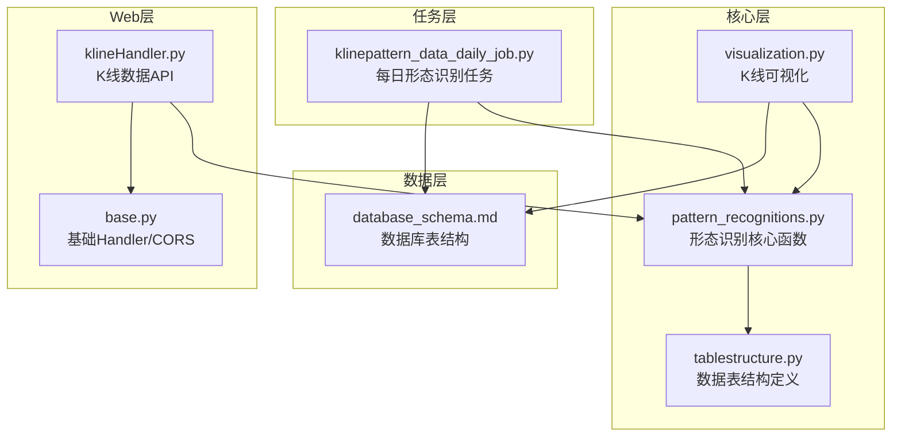
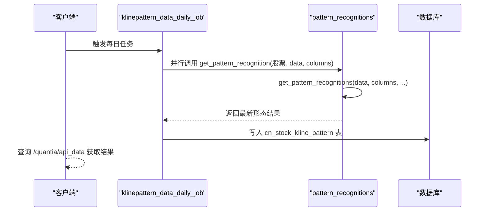
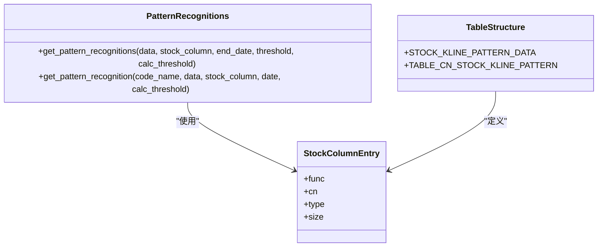
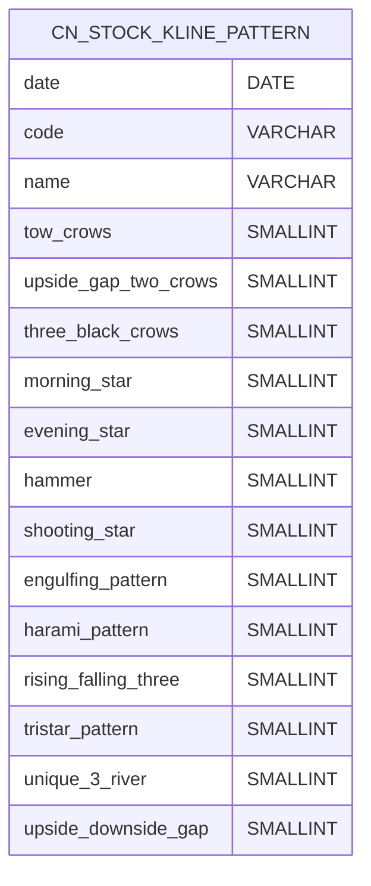
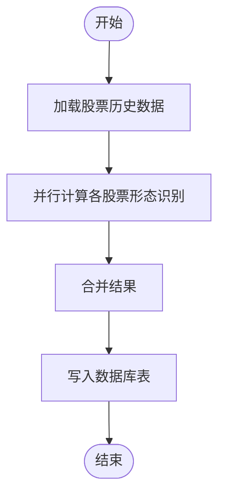
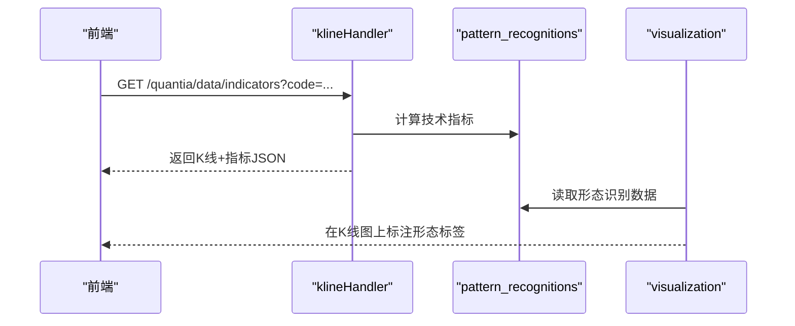
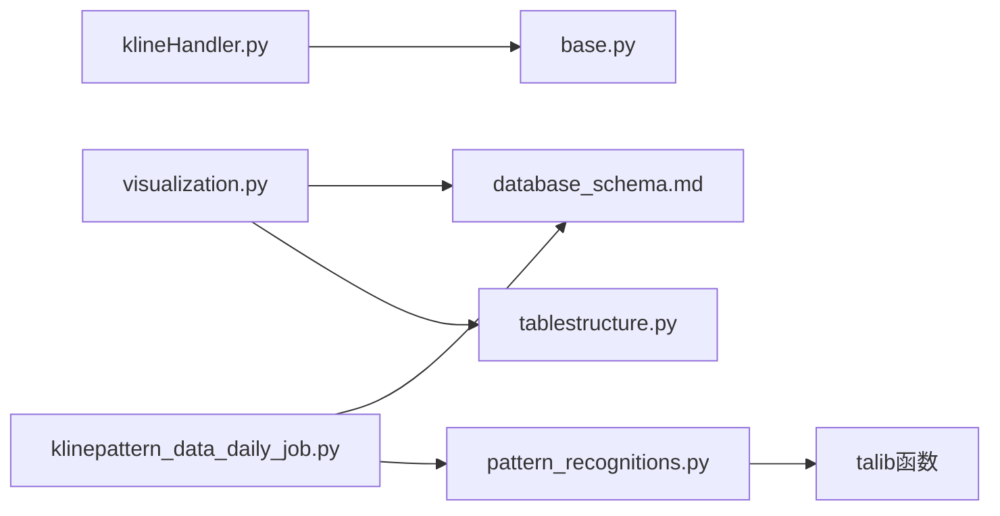

# 形态识别API接口

<cite>
**本文档引用的文件**
- [pattern_recognitions.py](file://quantia/core/pattern/pattern_recognitions.py)
- [klinepattern_data_daily_job.py](file://quantia/job/klinepattern_data_daily_job.py)
- [tablestructure.py](file://quantia/core/tablestructure.py)
- [database_schema.md](file://document/database_schema.md)
- [visualization.py](file://quantia/core/kline/visualization.py)
- [API_REFERENCE.md](file://document/API_REFERENCE.md)
- [base.py](file://quantia/web/base.py)
- [klineHandler.py](file://quantia/web/klineHandler.py)
</cite>

## 目录
1. [简介](#简介)
2. [项目结构](#项目结构)
3. [核心组件](#核心组件)
4. [架构概览](#架构概览)
5. [详细组件分析](#详细组件分析)
6. [依赖关系分析](#依赖关系分析)
7. [性能考虑](#性能考虑)
8. [故障排除指南](#故障排除指南)
9. [结论](#结论)
10. [附录](#附录)

## 简介
本文档面向Quantia项目的K线形态识别API，详细说明两个核心函数的参数规范、返回值格式与使用方法，解释stock_column参数的数据结构要求及函数回调机制配置方法，并提供完整的API调用示例、错误处理与性能优化建议。同时阐述API的适用场景、限制条件、最佳实践以及与其他模块的集成方法和数据流转过程。

## 项目结构
Quantia项目采用分层架构设计，K线形态识别功能位于core/pattern目录，配合job层的定时任务、web层的可视化展示以及数据库schema定义，形成从数据采集、计算、存储到展示的完整链路。

**图表来源**
- [pattern_recognitions.py](file://quantia/core/pattern/pattern_recognitions.py#L10-L70)
- [klinepattern_data_daily_job.py](file://quantia/job/klinepattern_data_daily_job.py#L24-L94)
- [tablestructure.py](file://quantia/core/tablestructure.py#L469-L589)
- [database_schema.md](file://document/database_schema.md#L461-L533)
- [visualization.py](file://quantia/core/kline/visualization.py#L30-L229)
- [base.py](file://quantia/web/base.py#L14-L36)
- [klineHandler.py](file://quantia/web/klineHandler.py#L212-L360)

**章节来源**
- [pattern_recognitions.py](file://quantia/core/pattern/pattern_recognitions.py#L10-L70)
- [klinepattern_data_daily_job.py](file://quantia/job/klinepattern_data_daily_job.py#L24-L94)
- [tablestructure.py](file://quantia/core/tablestructure.py#L469-L589)
- [database_schema.md](file://document/database_schema.md#L461-L533)
- [visualization.py](file://quantia/core/kline/visualization.py#L30-L229)
- [base.py](file://quantia/web/base.py#L14-L36)
- [klineHandler.py](file://quantia/web/klineHandler.py#L212-L360)

## 核心组件
本节聚焦于两个核心函数及其参数、返回值与使用要点：
- get_pattern_recognitions(data, stock_column, end_date=None, threshold=120, calc_threshold=None)
- get_pattern_recognition(code_name, data, stock_column, date=None, calc_threshold=12)

### 函数一：get_pattern_recognitions
- 功能：对给定K线数据批量计算多种K线形态识别指标。
- 输入参数
  - data: DataFrame，必须包含date、open、high、low、close等列，通常由历史K线数据转换而来。
  - stock_column: dict，键为形态字段名（如tow_crows），值为包含'func'、'cn'等键的对象；'func'为talib回调函数，'cn'为中文名称。
  - end_date: 可选，字符串或datetime对象，用于限定计算截止日期。
  - threshold: 可选，整数，返回最后N条记录。
  - calc_threshold: 可选，整数，仅使用最近N条数据进行计算。
- 处理逻辑
  - 若提供end_date，则按日期筛选数据。
  - 若提供calc_threshold，则截取末尾N条数据以减少计算量。
  - 对stock_column中的每个键，调用其'func'回调函数计算形态值，写入data对应列。
  - 异常处理：计算异常会被捕获并记录调试日志，跳过该形态的计算。
  - 若最终数据为空，返回None。
  - 应用threshold截取末尾数据并返回副本。
- 返回值
  - DataFrame或None。若无有效数据则返回None；否则返回包含原始列与新增形态列的数据帧。

### 函数二：get_pattern_recognition
- 功能：针对单只股票计算最新形态识别结果，返回非零形态的记录。
- 输入参数
  - code_name: tuple，包含(基准日期, 股票代码)，用于确定end_date。
  - data: DataFrame，K线数据。
  - stock_column: dict，同上。
  - date: 可选，datetime对象，覆盖默认的基准日期。
  - calc_threshold: 可选，默认12，决定用于计算的窗口大小。
- 处理逻辑
  - 解析end_date（优先使用date，否则使用code_name[0]）。
  - 调用get_pattern_recognitions进行批量计算，threshold=1确保仅取最新一条。
  - 检查最新记录中是否存在非零形态值，若有则附加code列并返回该行的切片。
  - 异常处理：捕获并记录错误日志，返回None。
- 返回值
  - Series或None。若无有效数据或无非零形态，返回None；否则返回包含形态列与code的Series。

**章节来源**
- [pattern_recognitions.py](file://quantia/core/pattern/pattern_recognitions.py#L10-L70)

## 架构概览
K线形态识别API在系统中的位置与交互如下：

**图表来源**
- [klinepattern_data_daily_job.py](file://quantia/job/klinepattern_data_daily_job.py#L63-L94)
- [pattern_recognitions.py](file://quantia/core/pattern/pattern_recognitions.py#L10-L70)
- [database_schema.md](file://document/database_schema.md#L461-L533)

## 详细组件分析

### stock_column参数数据结构与回调机制
stock_column是形态识别的核心配置，定义了要计算的形态集合及其属性：
- 结构组成
  - 键：形态字段名（如tow_crows、morning_star等）。
  - 值：对象，包含以下键：
    - func：talib函数（如tl.CDLMORNINGSTAR），用于计算形态。
    - cn：中文名称（如“晨星”），用于可视化标注。
    - type/size：类型与显示宽度（在表结构中定义）。
- 回调机制
  - get_pattern_recognitions遍历stock_column，调用每个键的'func'回调，传入open、high、low、close数组。
  - 计算结果写入data对应列，值域通常为-100（看跌）、0（无信号）、100（看涨）。
- 定义位置
  - STOCK_KLINE_PATTERN_DATA在tablestructure.py中定义，包含61种形态及其talib映射。
  - TABLE_CN_STOCK_KLINE_PATTERN基于上述定义扩展外键列。

**图表来源**
- [pattern_recognitions.py](file://quantia/core/pattern/pattern_recognitions.py#L10-L70)
- [tablestructure.py](file://quantia/core/tablestructure.py#L469-L589)

**章节来源**
- [tablestructure.py](file://quantia/core/tablestructure.py#L469-L589)
- [pattern_recognitions.py](file://quantia/core/pattern/pattern_recognitions.py#L10-L70)

### 数据库表结构与字段说明
cn_stock_kline_pattern表存储61种K线形态识别结果，每种形态对应一个SMALLINT字段，值域为-100/0/100。此外还包含日期、代码、名称等外键字段。

**图表来源**
- [database_schema.md](file://document/database_schema.md#L461-L533)

**章节来源**
- [database_schema.md](file://document/database_schema.md#L461-L533)

### 任务调度与并行计算
klinepattern_data_daily_job负责每日批量计算所有股票的K线形态识别结果：
- 读取历史K线数据。
- 并行调用get_pattern_recognition，使用ThreadPoolExecutor控制并发。
- 将结果合并后写入数据库表cn_stock_kline_pattern。

**图表来源**
- [klinepattern_data_daily_job.py](file://quantia/job/klinepattern_data_daily_job.py#L24-L94)

**章节来源**
- [klinepattern_data_daily_job.py](file://quantia/job/klinepattern_data_daily_job.py#L24-L94)

### Web层集成与可视化
- 基础Handler支持CORS跨域，便于前端访问。
- K线数据API提供OHLCV与技术指标，可作为形态识别结果的补充。
- 可视化模块从指标数据中提取stock_column配置，标注形态信号点位。

**图表来源**
- [base.py](file://quantia/web/base.py#L14-L36)
- [klineHandler.py](file://quantia/web/klineHandler.py#L212-L360)
- [visualization.py](file://quantia/core/kline/visualization.py#L30-L229)

**章节来源**
- [base.py](file://quantia/web/base.py#L14-L36)
- [klineHandler.py](file://quantia/web/klineHandler.py#L212-L360)
- [visualization.py](file://quantia/core/kline/visualization.py#L30-L229)

## 依赖关系分析
- get_pattern_recognitions依赖talib函数（通过stock_column的'func'回调）。
- klinepattern_data_daily_job依赖get_pattern_recognition进行并行计算。
- 可视化模块依赖tablestructure中的stock_column配置。
- Web层依赖基础Handler进行CORS与数据库连接管理。

**图表来源**
- [pattern_recognitions.py](file://quantia/core/pattern/pattern_recognitions.py#L10-L70)
- [klinepattern_data_daily_job.py](file://quantia/job/klinepattern_data_daily_job.py#L24-L94)
- [tablestructure.py](file://quantia/core/tablestructure.py#L469-L589)
- [database_schema.md](file://document/database_schema.md#L461-L533)
- [visualization.py](file://quantia/core/kline/visualization.py#L30-L229)
- [base.py](file://quantia/web/base.py#L14-L36)
- [klineHandler.py](file://quantia/web/klineHandler.py#L212-L360)

**章节来源**
- [pattern_recognitions.py](file://quantia/core/pattern/pattern_recognitions.py#L10-L70)
- [klinepattern_data_daily_job.py](file://quantia/job/klinepattern_data_daily_job.py#L24-L94)
- [tablestructure.py](file://quantia/core/tablestructure.py#L469-L589)
- [database_schema.md](file://document/database_schema.md#L461-L533)
- [visualization.py](file://quantia/core/kline/visualization.py#L30-L229)
- [base.py](file://quantia/web/base.py#L14-L36)
- [klineHandler.py](file://quantia/web/klineHandler.py#L212-L360)

## 性能考虑
- 并行计算：klinepattern_data_daily_job使用ThreadPoolExecutor并行处理，提升吞吐量。
- 数据截断：calc_threshold与threshold用于限制计算与返回的数据量，降低内存与IO压力。
- 异常容错：函数内部捕获计算异常并记录日志，避免单点失败影响整体流程。
- I/O优化：数据库写入采用批量合并与索引优化，减少重复写入。

[本节为通用性能建议，无需特定文件来源]

## 故障排除指南
- 常见问题
  - 无K线数据：检查缓存与数据采集任务是否正常运行。
  - 形态计算异常：查看日志中“K线形态 {k} 计算跳过”的调试信息，定位具体回调函数。
  - 任务无结果：确认并行执行中future.result()异常已被记录，检查workers配置与资源限制。
- 错误处理
  - Web层统一返回JSON错误格式，便于前端处理。
  - 基础Handler自动重连数据库，减少连接抖动带来的影响。

**章节来源**
- [klineHandler.py](file://quantia/web/klineHandler.py#L356-L360)
- [base.py](file://quantia/web/base.py#L28-L36)
- [pattern_recognitions.py](file://quantia/core/pattern/pattern_recognitions.py#L23-L26)
- [klinepattern_data_daily_job.py](file://quantia/job/klinepattern_data_daily_job.py#L76-L79)

## 结论
Quantia的K线形态识别API通过清晰的参数规范、灵活的回调机制与完善的任务调度，实现了对61种K线形态的高效识别与存储。结合数据库schema与Web层可视化，形成了从数据到洞察的完整闭环。建议在生产环境中合理配置并行度与数据截断参数，确保性能与稳定性。

[本节为总结性内容，无需特定文件来源]

## 附录

### API调用示例与最佳实践
- 示例一：批量识别（任务调度）
  - 步骤
    - 读取历史K线数据。
    - 调用get_pattern_recognition并行处理。
    - 合并结果并写入数据库。
  - 关键点
    - 使用calc_threshold控制计算窗口，避免全量数据带来的性能开销。
    - workers参数根据CPU核数与IO能力调整。
- 示例二：单只股票识别（实时查询）
  - 步骤
    - 调用get_pattern_recognition获取最新形态。
    - 检查返回值中是否存在非零形态，决定是否展示。
  - 关键点
    - end_date与date参数用于限定计算范围。
    - 异常捕获与日志记录有助于问题定位。

**章节来源**
- [klinepattern_data_daily_job.py](file://quantia/job/klinepattern_data_daily_job.py#L63-L94)
- [pattern_recognitions.py](file://quantia/core/pattern/pattern_recognitions.py#L37-L70)

### 适用场景与限制条件
- 适用场景
  - 日常形态监控与预警。
  - 策略回测与选股因子构建。
  - 可视化展示与人工复核。
- 限制条件
  - 数据完整性：需要完整的OHLC数据与日期索引。
  - 计算复杂度：形态数量较多时，建议使用calc_threshold与并行计算。
  - 依赖talib：需确保talib安装与版本兼容。

**章节来源**
- [tablestructure.py](file://quantia/core/tablestructure.py#L469-L589)
- [database_schema.md](file://document/database_schema.md#L461-L533)

### 与其他模块的集成方法
- 与策略模块集成
  - 形态识别结果可作为策略输入之一，例如“突破平台”“停机坪”等策略会结合成交量、价格行为等进一步筛选。
- 与Web模块集成
  - 通过/klineHandler接口获取K线与指标，结合visualization模块在前端标注形态信号。
- 与API模块集成
  - 通过/quantia/api_data接口查询cn_stock_kline_pattern表，实现形态数据的检索与展示。

**章节来源**
- [klineHandler.py](file://quantia/web/klineHandler.py#L212-L360)
- [visualization.py](file://quantia/core/kline/visualization.py#L30-L229)
- [API_REFERENCE.md](file://document/API_REFERENCE.md#L1-L200)
