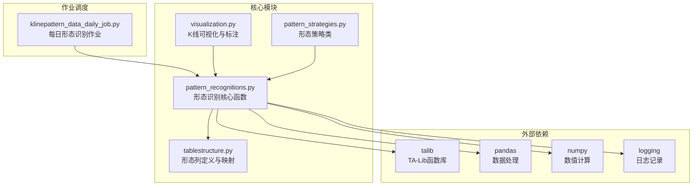
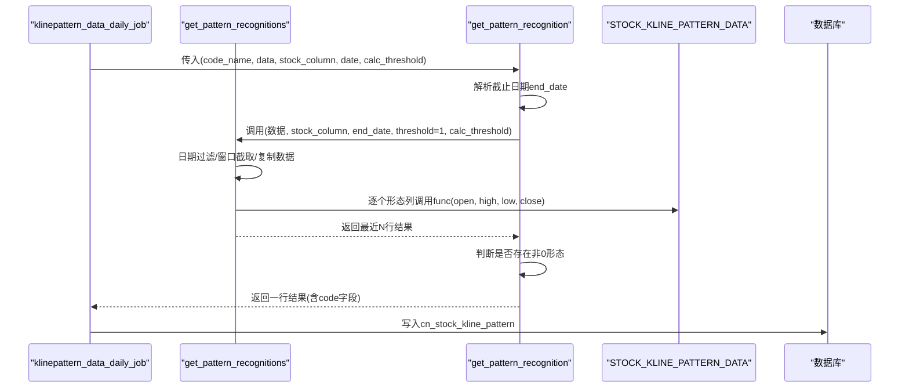
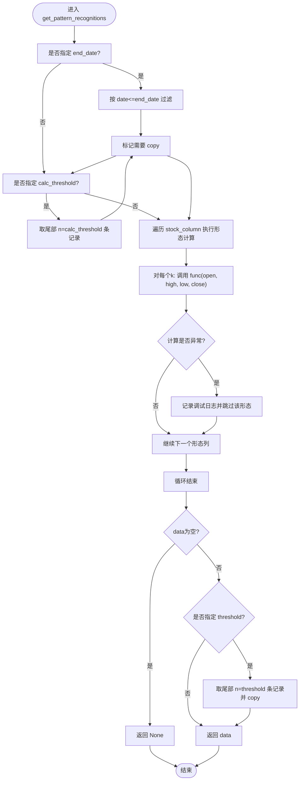
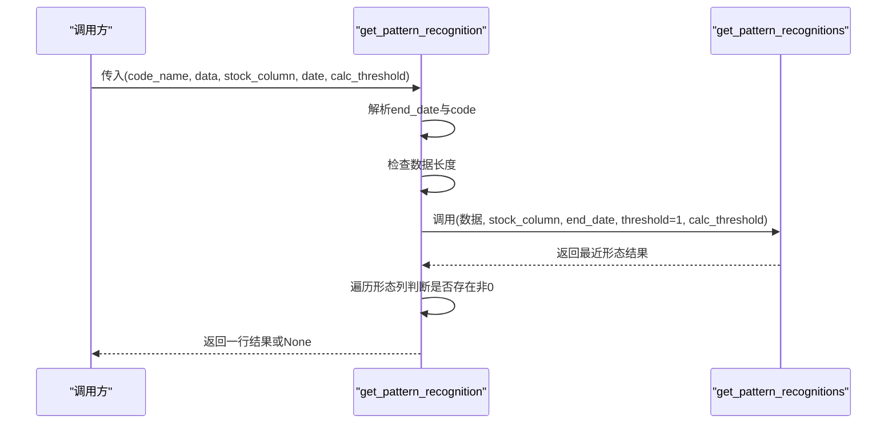
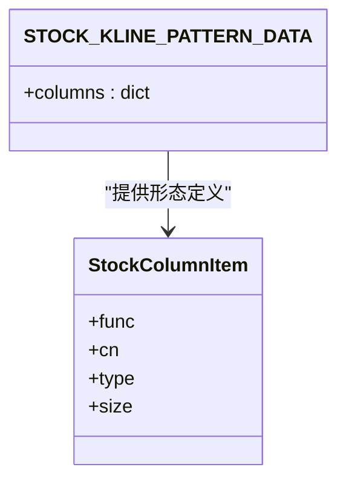
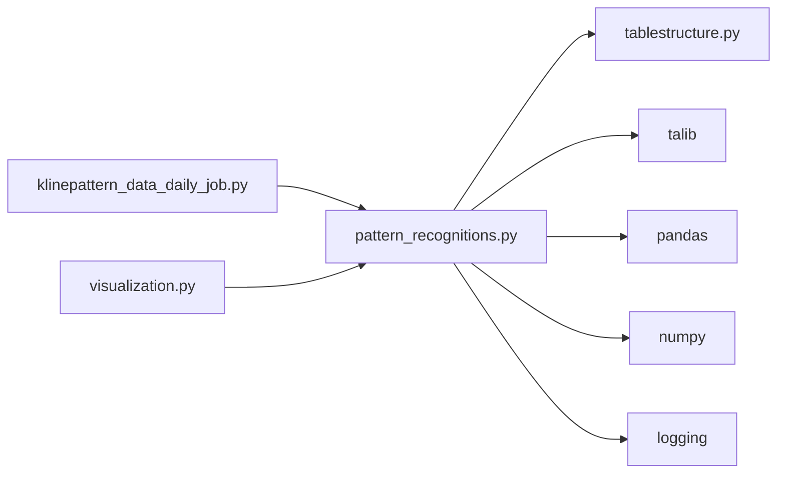

# 形态识别算法实现

<cite>
**本文引用的文件**
- [pattern_recognitions.py](file://quantia/core/pattern/pattern_recognitions.py)
- [tablestructure.py](file://quantia/core/tablestructure.py)
- [klinepattern_data_daily_job.py](file://quantia/job/klinepattern_data_daily_job.py)
- [visualization.py](file://quantia/core/kline/visualization.py)
- [pattern_strategies.py](file://quantia/core/strategy/pattern/pattern_strategies.py)
- [README.md](file://README.md)
</cite>

## 目录
1. [简介](#简介)
2. [项目结构](#项目结构)
3. [核心组件](#核心组件)
4. [架构总览](#架构总览)
5. [详细组件分析](#详细组件分析)
6. [依赖分析](#依赖分析)
7. [性能考虑](#性能考虑)
8. [故障排查指南](#故障排查指南)
9. [结论](#结论)
10. [附录](#附录)

## 简介
本技术文档围绕 Quantia 的 K 线形态识别算法展开，重点解析 get_pattern_recognitions 函数的实现细节，涵盖数据预处理、形态计算流程、阈值设置机制、stock_column 参数结构与配置、函数回调机制、日期过滤与数据截取、异常处理策略，并给出性能优化与内存管理的最佳实践。同时提供实际调用示例路径，帮助读者正确使用形态识别功能。

## 项目结构
与形态识别直接相关的模块位于 core/pattern、core/kline、core/tablestructure、job 等目录中；策略层还包含 pattern_strategies.py 中的形态策略类，用于更复杂的组合条件筛选。

图表来源
- [pattern_recognitions.py](file://quantia/core/pattern/pattern_recognitions.py#L10-L34)
- [tablestructure.py](file://quantia/core/tablestructure.py#L472-L585)
- [klinepattern_data_daily_job.py](file://quantia/job/klinepattern_data_daily_job.py#L63-L83)
- [visualization.py](file://quantia/core/kline/visualization.py#L39-L158)
- [pattern_strategies.py](file://quantia/core/strategy/pattern/pattern_strategies.py#L1-L276)

章节来源
- [pattern_recognitions.py](file://quantia/core/pattern/pattern_recognitions.py#L10-L34)
- [tablestructure.py](file://quantia/core/tablestructure.py#L472-L585)
- [klinepattern_data_daily_job.py](file://quantia/job/klinepattern_data_daily_job.py#L24-L83)
- [visualization.py](file://quantia/core/kline/visualization.py#L39-L158)
- [pattern_strategies.py](file://quantia/core/strategy/pattern/pattern_strategies.py#L1-L276)

## 核心组件
- get_pattern_recognitions(data, stock_column, end_date=None, threshold=120, calc_threshold=None)
  - 负责对给定数据进行形态识别计算，支持日期过滤、窗口截取、阈值裁剪与异常保护。
- get_pattern_recognition(code_name, data, stock_column, date=None, calc_threshold=12)
  - 面向单只股票的入口函数，负责确定截止日期、调用核心识别函数、提取最新形态结果并附加代码字段。
- stock_column 结构
  - 字典类型，键为形态列名（如“hammer”），值为包含 'func'（TA-Lib函数）、'cn'（中文名称）、'type'/'size' 等元信息的字典。
- 形态列定义来源
  - tablestructure.py 中的 STOCK_KLINE_PATTERN_DATA 定义了全部可用形态及其映射关系，供识别与存储使用。

章节来源
- [pattern_recognitions.py](file://quantia/core/pattern/pattern_recognitions.py#L10-L34)
- [pattern_recognitions.py](file://quantia/core/pattern/pattern_recognitions.py#L37-L70)
- [tablestructure.py](file://quantia/core/tablestructure.py#L472-L585)

## 架构总览
形态识别从“每日作业”触发，逐只股票调用 get_pattern_recognition，内部委托 get_pattern_recognitions 执行 TA-Lib 形态函数计算，最终汇总写入数据库表 cn_stock_kline_pattern。

图表来源
- [klinepattern_data_daily_job.py](file://quantia/job/klinepattern_data_daily_job.py#L63-L83)
- [pattern_recognitions.py](file://quantia/core/pattern/pattern_recognitions.py#L10-L34)
- [pattern_recognitions.py](file://quantia/core/pattern/pattern_recognitions.py#L37-L70)
- [tablestructure.py](file://quantia/core/tablestructure.py#L472-L585)

## 详细组件分析

### get_pattern_recognitions 核心算法
- 输入输出
  - 输入：data（DataFrame，需包含 date/open/high/low/close）、stock_column（形态列定义）、可选 end_date、threshold、calc_threshold。
  - 输出：DataFrame 或 None（当数据为空时）。
- 关键步骤
  1) 日期过滤：若 end_date 存在，则仅保留 date<=end_date 的记录，并标记需要复制以避免视图副作用。
  2) 计算窗口截取：若 calc_threshold 存在，则取尾部 n 条记录作为计算窗口，同样可能触发 copy。
  3) 形态计算：遍历 stock_column，对每个形态列 k，调用 stock_column[k]['func']，传入 open/high/low/close 的 NumPy 数组，将结果写回 data.loc[:, k]。
  4) 异常处理：计算过程中捕获异常并记录调试日志，跳过该形态列继续执行。
  5) 结果裁剪：若 threshold 存在，取尾部 n 条记录并 copy，确保返回独立副本。
- 复杂度与性能
  - 时间复杂度：O(N × M)，其中 N 为交易日数，M 为形态种类数；每种形态调用一次 TA-Lib 函数。
  - 空间复杂度：O(N)（返回数据集大小），额外拷贝发生在日期过滤或窗口截取时。
- 优化建议
  - 合理设置 calc_threshold，避免对过长序列重复计算。
  - 对于高频调用场景，尽量复用已排序/过滤的数据，减少多次 loc/mask 操作。
  - 在 stock_column 中仅保留必要的形态列，降低循环次数。

图表来源
- [pattern_recognitions.py](file://quantia/core/pattern/pattern_recognitions.py#L10-L34)

章节来源
- [pattern_recognitions.py](file://quantia/core/pattern/pattern_recognitions.py#L10-L34)

### get_pattern_recognition 单股票入口
- 功能要点
  - 解析截止日期：若未提供 date，则使用 code_name[0] 作为 end_date；否则格式化为 "YYYY-MM-DD"。
  - 边界检查：若数据长度小于等于 1，直接返回 None。
  - 调用核心识别函数：threshold 设为 1，仅返回最新一日的结果；calc_threshold 默认 12，控制计算窗口大小。
  - 结果筛选：遍历 stock_column，若任一形态列最新值非 0，则认为存在有效形态，返回该行并追加 code 字段。
  - 异常处理：捕获异常并记录错误日志，最终返回 None。
- 返回结构
  - DataFrame 行对象，包含所有形态列与 code 字段；若无有效形态则返回 None。

图表来源
- [pattern_recognitions.py](file://quantia/core/pattern/pattern_recognitions.py#L37-L70)
- [pattern_recognitions.py](file://quantia/core/pattern/pattern_recognitions.py#L10-L34)

章节来源
- [pattern_recognitions.py](file://quantia/core/pattern/pattern_recognitions.py#L37-L70)

### stock_column 参数结构与配置
- 结构定义
  - 键：形态列名（字符串），例如 "hammer"、"morning_star" 等。
  - 值：字典，包含以下关键字段：
    - 'func'：TA-Lib 形态函数（如 tl.CDLHAMMER）。
    - 'cn'：中文名称（用于可视化标注）。
    - 'type'/'size'：数据库字段类型与显示宽度（用于建表与前端展示）。
- 配置来源
  - STOCK_KLINE_PATTERN_DATA 定义了全部形态列的映射关系，键为列名，值为包含 'func'、'cn'、'type'、'size' 的字典。
- 使用方式
  - 将所需形态列名作为键，从 STOCK_KLINE_PATTERN_DATA 中取出其定义，即可作为 stock_column 传入识别函数。

图表来源
- [tablestructure.py](file://quantia/core/tablestructure.py#L472-L585)

章节来源
- [tablestructure.py](file://quantia/core/tablestructure.py#L472-L585)

### 函数回调机制
- 回调实现
  - stock_column[k]['func'] 是对 TA-Lib 形态函数的直接引用，例如 tl.CDLHAMMER。
  - get_pattern_recognitions 在循环中调用 data.loc[:, k] = func(...)，将计算结果写入对应列。
- 可扩展性
  - 新增形态只需在 STOCK_KLINE_PATTERN_DATA 中添加新项，并提供对应的 tl.* 函数即可，无需修改核心识别逻辑。

章节来源
- [pattern_recognitions.py](file://quantia/core/pattern/pattern_recognitions.py#L22-L26)
- [tablestructure.py](file://quantia/core/tablestructure.py#L472-L585)

### 日期过滤、数据截取与异常处理
- 日期过滤
  - end_date 作为截止日期，仅保留 date<=end_date 的记录，避免跨期数据污染形态判断。
- 数据截取
  - calc_threshold 控制计算窗口大小，通常设为较短天数（如 12），提升实时性与稳定性。
  - threshold 控制最终返回的记录条数，默认 120，用于历史对比或可视化。
- 异常处理
  - 形态计算过程中的异常被捕获并记录调试日志，跳过该形态列继续执行，保证整体流程不中断。
- 内存管理
  - 在日期过滤与窗口截取后，必要时调用 copy() 创建独立副本，避免后续操作引发视图与原数据混淆。

章节来源
- [pattern_recognitions.py](file://quantia/core/pattern/pattern_recognitions.py#L11-L20)
- [pattern_recognitions.py](file://quantia/core/pattern/pattern_recognitions.py#L22-L26)
- [pattern_recognitions.py](file://quantia/core/pattern/pattern_recognitions.py#L31-L32)

### 可视化与标注
- 可视化流程
  - 调用 get_pattern_recognitions 获取形态结果 data。
  - 针对每个形态列 k，根据 data[k] 的正负值分别标注在高点（买入）或低点（卖出）位置。
  - 使用 LabelSet 将中文形态名称标注在相应位置，支持勾选显示隐藏。
- 标注规则
  - data[k] > 0：标注为红色，位置在高点上方。
  - data[k] < 0：标注为绿色，位置在低点下方。
  - 若某形态列同时存在正负标注，将统一收集并维护显示状态。

章节来源
- [visualization.py](file://quantia/core/kline/visualization.py#L39-L158)

### 实际调用示例（示例路径）
- 每日作业入口
  - 示例路径：[run_check 函数](file://quantia/job/klinepattern_data_daily_job.py#L63-L83)
  - 说明：使用 ThreadPoolExecutor 并行调用 get_pattern_recognition，传入 stock_column 来自 STOCK_KLINE_PATTERN_DATA。
- 单股票识别入口
  - 示例路径：[get_pattern_recognition 函数](file://quantia/core/pattern/pattern_recognitions.py#L37-L70)
  - 说明：传入 code_name、data、stock_column、date、calc_threshold，返回单行结果或 None。
- 形态列定义
  - 示例路径：[STOCK_KLINE_PATTERN_DATA 定义](file://quantia/core/tablestructure.py#L472-L585)
  - 说明：包含所有可用形态的 'func'、'cn'、'type'、'size'。

章节来源
- [klinepattern_data_daily_job.py](file://quantia/job/klinepattern_data_daily_job.py#L63-L83)
- [pattern_recognitions.py](file://quantia/core/pattern/pattern_recognitions.py#L37-L70)
- [tablestructure.py](file://quantia/core/tablestructure.py#L472-L585)

## 依赖分析
- 外部库依赖
  - talib：提供 TA-Lib 形态函数（如 CDLHAMMER、CDLMORNINGSTAR 等）。
  - pandas/numpy：数据结构与数值计算。
  - logging：日志记录与异常追踪。
- 内部模块依赖
  - tablestructure 提供 STOCK_KLINE_PATTERN_DATA，定义形态列与函数映射。
  - klinepattern_data_daily_job 作为调度入口，组织多线程识别与入库。
  - visualization 依赖识别结果进行标注展示。

图表来源
- [pattern_recognitions.py](file://quantia/core/pattern/pattern_recognitions.py#L10-L34)
- [tablestructure.py](file://quantia/core/tablestructure.py#L472-L585)
- [klinepattern_data_daily_job.py](file://quantia/job/klinepattern_data_daily_job.py#L63-L83)
- [visualization.py](file://quantia/core/kline/visualization.py#L39-L158)

章节来源
- [pattern_recognitions.py](file://quantia/core/pattern/pattern_recognitions.py#L10-L34)
- [tablestructure.py](file://quantia/core/tablestructure.py#L472-L585)
- [klinepattern_data_daily_job.py](file://quantia/job/klinepattern_data_daily_job.py#L63-L83)
- [visualization.py](file://quantia/core/kline/visualization.py#L39-L158)

## 性能考虑
- 计算窗口优化
  - calc_threshold 建议设置为较小值（如 12），仅保留最近交易日进行形态计算，兼顾实时性与准确性。
- 并行化
  - 每日作业使用 ThreadPoolExecutor 并行处理多只股票，显著缩短批处理时间。
- 数据访问优化
  - 优先使用 loc/mask 精确切片，避免不必要的整表扫描。
  - 在多次过滤后及时 copy，防止后续操作产生视图依赖问题。
- I/O 与存储
  - 识别完成后批量写入数据库，减少频繁连接与事务开销。

[本节为通用性能建议，不直接分析具体文件]

## 故障排查指南
- 常见问题
  - 识别结果为空：检查数据长度是否小于等于 1，或 end_date 是否过于靠前导致过滤后为空。
  - 某些形态列全为 0：确认 stock_column 中对应 'func' 是否正确，以及输入数据是否包含缺失值。
  - 日志异常：查看调试/错误日志，定位具体形态列的计算异常。
- 排查步骤
  - 确认 stock_column 的键存在于 STOCK_KLINE_PATTERN_DATA 中。
  - 检查 date 列是否为字符串格式 "YYYY-MM-DD"，或传入的 date 对象是否正确。
  - 在 get_pattern_recognition 中增加边界检查，确保 threshold=1 时仅取最新记录。
  - 对异常形态列进行单独测试，验证 tl.* 函数在当前窗口内的行为。

章节来源
- [pattern_recognitions.py](file://quantia/core/pattern/pattern_recognitions.py#L22-L26)
- [pattern_recognitions.py](file://quantia/core/pattern/pattern_recognitions.py#L48-L49)
- [pattern_recognitions.py](file://quantia/core/pattern/pattern_recognitions.py#L67-L68)

## 结论
get_pattern_recognitions 通过简洁的日期过滤、窗口截取与循环回调机制，实现了对多种 TA-Lib 形态函数的统一处理。配合 stock_column 的结构化定义与每日作业的并行化调度，系统能够在保证实时性的前提下稳定输出形态识别结果。建议在生产环境中合理设置 calc_threshold 与 threshold，并结合可视化标注进行人工复核，以获得更高质量的选股信号。

[本节为总结性内容，不直接分析具体文件]

## 附录
- 形态列表参考
  - 形态清单与结果含义可参考项目文档中的说明，涵盖 40+ 种常见 K 线形态及买入/卖出信号解释。
- 相关策略
  - 形态策略类（如突破平台、停机坪等）展示了如何在形态识别基础上构建更复杂的选股策略。

章节来源
- [README.md](file://README.md#L89-L113)
- [pattern_strategies.py](file://quantia/core/strategy/pattern/pattern_strategies.py#L1-L276)
