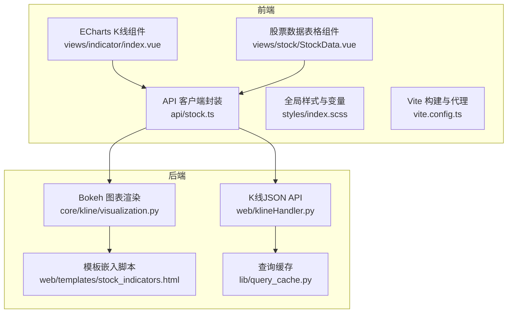
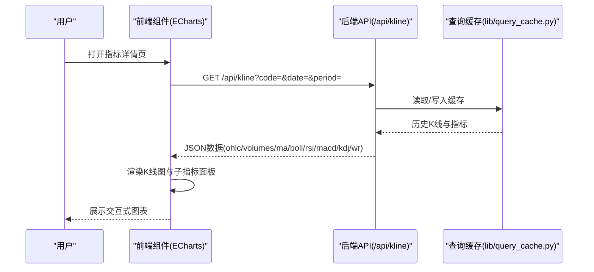
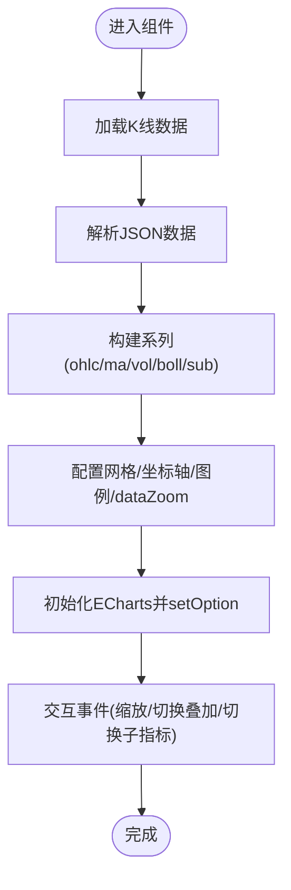
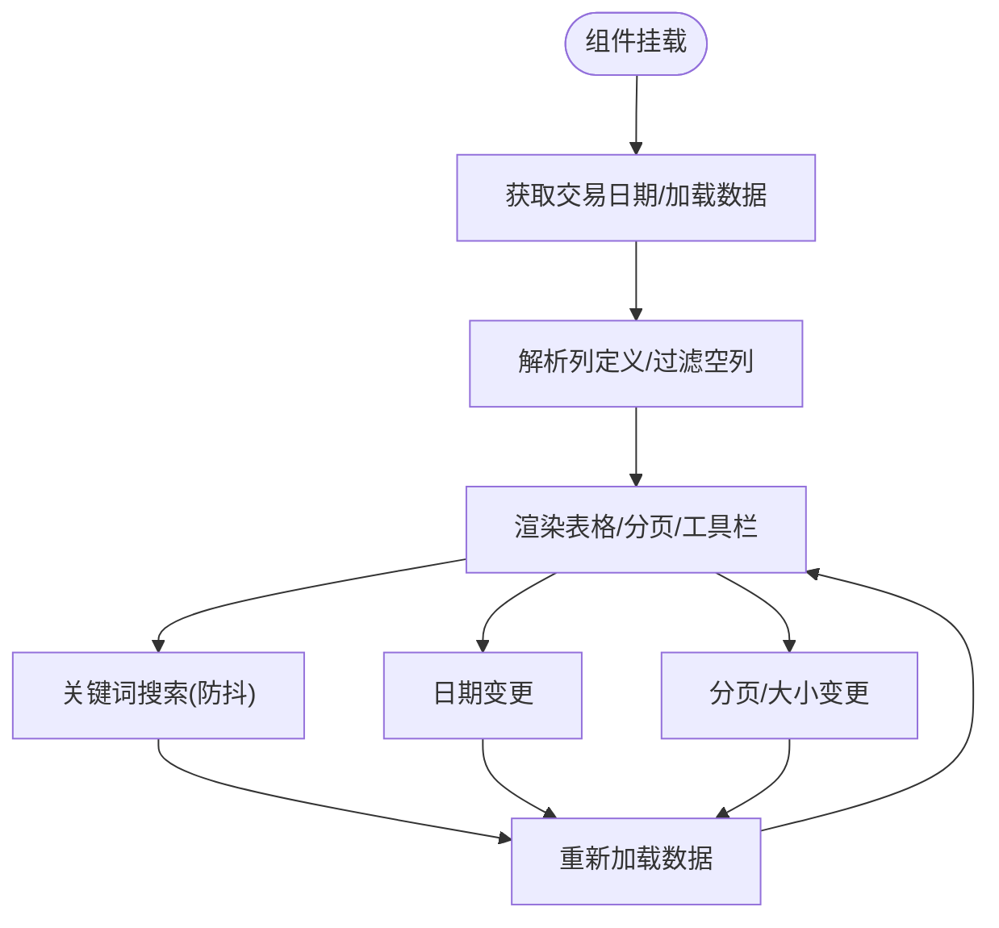
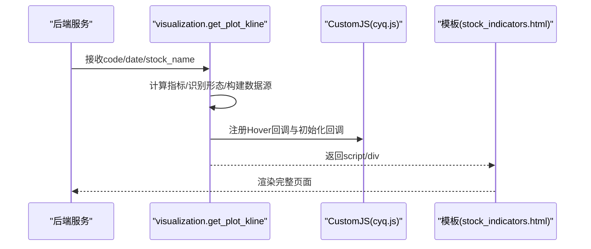
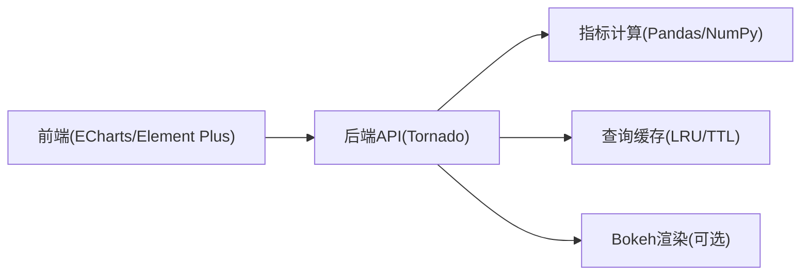

# 可视化展示

<cite>
**本文引用的文件**
- [visualization.py](file://quantia/core/kline/visualization.py)
- [index.vue](file://quantia/fontWeb/src/views/indicator/index.vue)
- [StockData.vue](file://quantia/fontWeb/src/views/stock/StockData.vue)
- [stock.ts](file://quantia/fontWeb/src/types/stock.ts)
- [index.scss](file://quantia/fontWeb/src/styles/index.scss)
- [vite.config.ts](file://quantia/fontWeb/vite.config.ts)
- [stock.ts](file://quantia/fontWeb/src/api/stock.ts)
- [klineHandler.py](file://quantia/web/klineHandler.py)
- [stock_indicators.html](file://quantia/web/templates/stock_indicators.html)
- [query_cache.py](file://quantia/lib/query_cache.py)
- [API_REFERENCE.md](file://document/API_REFERENCE.md)
</cite>

## 目录
1. [简介](#简介)
2. [项目结构](#项目结构)
3. [核心组件](#核心组件)
4. [架构总览](#架构总览)
5. [详细组件分析](#详细组件分析)
6. [依赖分析](#依赖分析)
7. [性能考量](#性能考量)
8. [故障排查指南](#故障排查指南)
9. [结论](#结论)
10. [附录](#附录)

## 简介
本模块聚焦于Quantia的技术分析可视化展示，涵盖K线图绘制、技术指标叠加显示、多维度数据可视化等能力。系统同时提供两种前端渲染路径：
- 服务端渲染（Bokeh）：通过Python后端生成图表脚本与容器，嵌入HTML模板。
- 前端渲染（ECharts）：通过后端JSON API提供K线与指标数据，前端组件负责渲染与交互。

此外，系统支持交互式图表组件、动态数据更新、样式定制与主题配置、响应式布局，并提供性能优化策略与可视化数据格式规范，帮助用户直观地进行技术分析与数据探索。

## 项目结构
可视化相关的核心目录与文件如下：
- 后端（Python）：提供K线与指标数据的JSON API，以及基于Bokeh的服务端图表渲染。
- 前端（Vue3 + TypeScript + ECharts）：负责K线图与表格数据的渲染、交互与样式。
- 配置与样式：全局SCSS变量与Vite代理配置，支撑响应式与主题一致性。

**图表来源**
- [index.vue](file://quantia/fontWeb/src/views/indicator/index.vue#L1-L510)
- [StockData.vue](file://quantia/fontWeb/src/views/stock/StockData.vue#L1-L617)
- [stock.ts](file://quantia/fontWeb/src/api/stock.ts#L1-L189)
- [klineHandler.py](file://quantia/web/klineHandler.py#L1-L360)
- [visualization.py](file://quantia/core/kline/visualization.py#L1-L275)
- [stock_indicators.html](file://quantia/web/templates/stock_indicators.html#L1-L31)
- [query_cache.py](file://quantia/lib/query_cache.py#L1-L48)

**章节来源**
- [index.vue](file://quantia/fontWeb/src/views/indicator/index.vue#L1-L510)
- [StockData.vue](file://quantia/fontWeb/src/views/stock/StockData.vue#L1-L617)
- [stock.ts](file://quantia/fontWeb/src/api/stock.ts#L1-L189)
- [klineHandler.py](file://quantia/web/klineHandler.py#L1-L360)
- [visualization.py](file://quantia/core/kline/visualization.py#L1-L275)
- [stock_indicators.html](file://quantia/web/templates/stock_indicators.html#L1-L31)
- [query_cache.py](file://quantia/lib/query_cache.py#L1-L48)

## 核心组件
- K线与技术指标前端渲染（ECharts）
  - 组件职责：接收后端K线与指标数据，按周期（日/周/月/季/年）与叠加项（MA/BOLL/子指标）动态渲染。
  - 关键特性：数据钻取（dataZoom）、十字准星、工具栏、颜色方案、网格布局与图例。
- 股票数据表格（Element Plus + Vue）
  - 组件职责：动态列生成、搜索过滤、分页、日期选择、关注/取消关注、导出占位。
  - 关键特性：列宽自适应、单元格格式化、涨跌颜色、响应式布局。
- 服务端图表渲染（Bokeh）
  - 组件职责：生成K线、成交量、技术指标面板、筹码分布、形态标注与交互工具。
  - 关键特性：HoverTool、CrosshairTool、CustomJS回调、动态标签与复选框控制。
- API与数据格式
  - K线JSON API：统一返回OHLC、成交量、MA、BOLL、RSI、MACD、KDJ、WR等。
  - 股票数据API：支持分页、日期筛选、关键词搜索，兼容新旧响应格式。
- 样式与主题
  - 全局SCSS变量定义涨跌颜色、工具类与布局；Vite代理配置便于前后端联调。

**章节来源**
- [index.vue](file://quantia/fontWeb/src/views/indicator/index.vue#L1-L510)
- [StockData.vue](file://quantia/fontWeb/src/views/stock/StockData.vue#L1-L617)
- [visualization.py](file://quantia/core/kline/visualization.py#L1-L275)
- [stock.ts](file://quantia/fontWeb/src/types/stock.ts#L1-L80)
- [index.scss](file://quantia/fontWeb/src/styles/index.scss#L1-L95)
- [vite.config.ts](file://quantia/fontWeb/vite.config.ts#L1-L32)
- [stock.ts](file://quantia/fontWeb/src/api/stock.ts#L1-L189)
- [klineHandler.py](file://quantia/web/klineHandler.py#L1-L360)

## 架构总览
系统采用“后端数据 + 前端渲染”的双通道架构：
- 前端通道（ECharts）：通过GET /api/kline获取全量历史数据，前端负责dataZoom与交互。
- 服务端通道（Bokeh）：通过GET /data/indicators或模板嵌入，后端生成图表脚本与容器。

**图表来源**
- [index.vue](file://quantia/fontWeb/src/views/indicator/index.vue#L46-L71)
- [klineHandler.py](file://quantia/web/klineHandler.py#L212-L360)
- [query_cache.py](file://quantia/lib/query_cache.py#L1-L48)

**章节来源**
- [index.vue](file://quantia/fontWeb/src/views/indicator/index.vue#L1-L510)
- [klineHandler.py](file://quantia/web/klineHandler.py#L1-L360)
- [query_cache.py](file://quantia/lib/query_cache.py#L1-L48)

## 详细组件分析

### K线与技术指标组件（ECharts）
- 数据来源与格式
  - 请求：GET /api/kline，参数包括code、date、period、days、name。
  - 返回：包含code、name、period、total、dates、ohlc、volumes、ma、vol_ma、boll、rsi、macd、kdj、wr。
- 渲染逻辑
  - 主图：K线蜡烛图，可叠加MA与BOLL。
  - 成交量：主图下方柱状图，叠加成交量MA。
  - 子指标：底部面板（MACD/KDJ/RSI/WR/BOLL）按需切换。
  - 交互：dataZoom（滑块与内部缩放）、十字准星、工具栏、图例。
- 配置要点
  - 颜色方案：涨跌、MA线、BOLL轨道、成交量柱等。
  - 布局：三段式网格（K线、成交量、子指标），坐标轴与刻度。
  - 视图：按周期智能设置dataZoom起始比例，保证最近N根可见。

**图表来源**
- [index.vue](file://quantia/fontWeb/src/views/indicator/index.vue#L108-L341)
- [klineHandler.py](file://quantia/web/klineHandler.py#L314-L354)

**章节来源**
- [index.vue](file://quantia/fontWeb/src/views/indicator/index.vue#L1-L510)
- [klineHandler.py](file://quantia/web/klineHandler.py#L1-L360)

### 股票数据表格组件（Element Plus + Vue）
- 功能特性
  - 动态列：根据后端返回的列定义生成，隐藏空值列，支持最小宽度自适应。
  - 搜索与日期：关键词搜索（防抖500ms），日期选择器，分页与每页数量切换。
  - 格式化：金额/成交量/百分比/涨跌颜色，特殊表的单位换算（如市值万元→元）。
  - 操作：关注/取消关注、回测跳转、导出占位。
- 响应式与样式
  - 使用SCSS变量与工具类，卡片布局、滚动条美化、涨跌颜色类。

**图表来源**
- [StockData.vue](file://quantia/fontWeb/src/views/stock/StockData.vue#L80-L124)
- [StockData.vue](file://quantia/fontWeb/src/views/stock/StockData.vue#L336-L357)

**章节来源**
- [StockData.vue](file://quantia/fontWeb/src/views/stock/StockData.vue#L1-L617)
- [index.scss](file://quantia/fontWeb/src/styles/index.scss#L1-L95)

### 服务端图表渲染（Bokeh）
- 绘制内容
  - K线图：实体柱+上下影线，按涨跌着色。
  - 均线与BOLL：多条均线与布林带叠加。
  - 成交量：柱状图叠加均线。
  - 技术指标：多个指标面板（Tabs），支持跨图层工具。
  - 筹码分布：自定义JS回调，Hover触发，右侧独立图层。
  - 形态标注：LabelSet标注买入/卖出形态，CheckboxGroup控制显示。
- 交互工具
  - HoverTool、CrosshairTool、Pan/BoxZoom/WheelZoom、Undo/Redo/Reset/Save等。
- 输出
  - 返回script与div，嵌入模板中。

**图表来源**
- [visualization.py](file://quantia/core/kline/visualization.py#L29-L275)
- [stock_indicators.html](file://quantia/web/templates/stock_indicators.html#L1-L31)

**章节来源**
- [visualization.py](file://quantia/core/kline/visualization.py#L1-L275)
- [stock_indicators.html](file://quantia/web/templates/stock_indicators.html#L1-L31)

### 可视化数据格式与API配置
- K线JSON API（/api/kline）
  - 输入：code、date、period、days、name。
  - 输出：code、name、period、total、dates、ohlc、volumes、ma、vol_ma、boll、rsi、macd、kdj、wr。
  - 支持周期重采样：日/周/月/季/年。
- 股票数据API（/api_data）
  - 输入：name、date、page、page_size、keyword。
  - 输出：新格式（columns、data、total）与旧格式（数组）兼容。
- 前端请求封装
  - 统一使用request封装，包含getStockData、getKlineData、toggleAttention、getTradeDate等方法。

**章节来源**
- [klineHandler.py](file://quantia/web/klineHandler.py#L212-L360)
- [stock.ts](file://quantia/fontWeb/src/api/stock.ts#L1-L189)
- [API_REFERENCE.md](file://document/API_REFERENCE.md#L292-L355)

## 依赖分析
- 前端依赖
  - ECharts：K线与指标渲染。
  - Element Plus：表格、分页、按钮、输入框等UI组件。
  - Vue Router/Composition API：路由与状态管理。
  - dayjs：日期格式化与工具。
- 后端依赖
  - Tornado：Web框架，提供JSON API与模板渲染。
  - NumPy/Pandas：数据处理与指标计算。
  - Bokeh：服务端图表渲染。
  - 查询缓存：LRU + TTL，提升并发下的响应速度。

**图表来源**
- [index.vue](file://quantia/fontWeb/src/views/indicator/index.vue#L1-L510)
- [klineHandler.py](file://quantia/web/klineHandler.py#L1-L360)
- [query_cache.py](file://quantia/lib/query_cache.py#L1-L48)
- [visualization.py](file://quantia/core/kline/visualization.py#L1-L275)

**章节来源**
- [index.vue](file://quantia/fontWeb/src/views/indicator/index.vue#L1-L510)
- [klineHandler.py](file://quantia/web/klineHandler.py#L1-L360)
- [query_cache.py](file://quantia/lib/query_cache.py#L1-L48)
- [visualization.py](file://quantia/core/kline/visualization.py#L1-L275)

## 性能考量
- 后端缓存
  - LRU淘汰策略，支持TTL过期，线程安全，命中/未命中计数便于监控。
  - 分离COUNT与DATA查询缓存，避免误判。
- 数据传输
  - K线API返回全量历史数据，前端dataZoom控制视图，减少多次请求。
  - 对None/Inf值进行安全转换，避免前端渲染异常。
- 前端优化
  - 表格列宽自适应，隐藏空列，降低DOM复杂度。
  - 搜索防抖（500ms），分页与尺寸切换即时生效。
  - ECharts禁用动画，提升大数据量渲染性能。
- 构建与代理
  - Vite代理至后端服务，开发环境联调便捷；生产构建输出dist/assets。

**章节来源**
- [query_cache.py](file://quantia/lib/query_cache.py#L1-L48)
- [klineHandler.py](file://quantia/web/klineHandler.py#L23-L34)
- [index.vue](file://quantia/fontWeb/src/views/indicator/index.vue#L310-L341)
- [StockData.vue](file://quantia/fontWeb/src/views/stock/StockData.vue#L72-L78)
- [vite.config.ts](file://quantia/fontWeb/vite.config.ts#L1-L32)

## 故障排查指南
- K线数据为空
  - 检查缓存是否命中，确认数据采集任务运行正常。
  - 核对code与date参数，必要时增加days限制观察范围。
- 图表渲染异常
  - 确认后端返回数据格式（ohlc/volumes/ma/boll/rsi/macd/kdj/wr）完整。
  - 前端dataZoom起始比例按周期自动计算，若显示空白，检查total与dates长度。
- Bokeh图表无法显示
  - 确认模板中引入Bokeh脚本与组件script/div已正确嵌入。
  - 检查CustomJS回调文件路径与参数传递（kline_data、k_range、cyq_days）。
- 表格列错位或空白
  - 后端返回columns缺失或为空时，前端会隐藏空列；确认接口返回结构。
  - 检查列定义中的dataType与width，确保最小宽度合理。

**章节来源**
- [klineHandler.py](file://quantia/web/klineHandler.py#L254-L280)
- [stock_indicators.html](file://quantia/web/templates/stock_indicators.html#L1-L31)
- [StockData.vue](file://quantia/fontWeb/src/views/stock/StockData.vue#L47-L60)

## 结论
本模块通过前后端协同，提供了灵活且高性能的技术分析可视化能力。前端以ECharts为主，兼顾Bokeh服务端渲染路径；后端提供标准化的K线与指标JSON API，并结合查询缓存提升性能。配合响应式布局与主题样式，用户可在统一界面中完成K线浏览、指标叠加、数据探索与交互式分析。

## 附录
- 可视化数据格式参考
  - K线JSON API输出字段：code、name、period、total、dates、ohlc、volumes、ma、vol_ma、boll、rsi、macd、kdj、wr。
  - 股票数据API输出字段：columns（列定义）、data（行数据）、total（总数），兼容旧格式数组。
- 前端组件配置建议
  - ECharts：按周期设置dataZoom起始比例，启用禁用动画，统一颜色方案。
  - 表格：开启列宽自适应与空列隐藏，使用防抖搜索与分页，统一格式化规则。
- 主题与样式
  - 使用SCSS变量统一涨跌颜色与布局工具类，保持视觉一致性。

**章节来源**
- [klineHandler.py](file://quantia/web/klineHandler.py#L212-L360)
- [API_REFERENCE.md](file://document/API_REFERENCE.md#L292-L355)
- [index.scss](file://quantia/fontWeb/src/styles/index.scss#L1-L95)
- [stock.ts](file://quantia/fontWeb/src/types/stock.ts#L1-L80)
