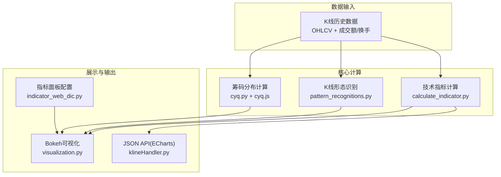
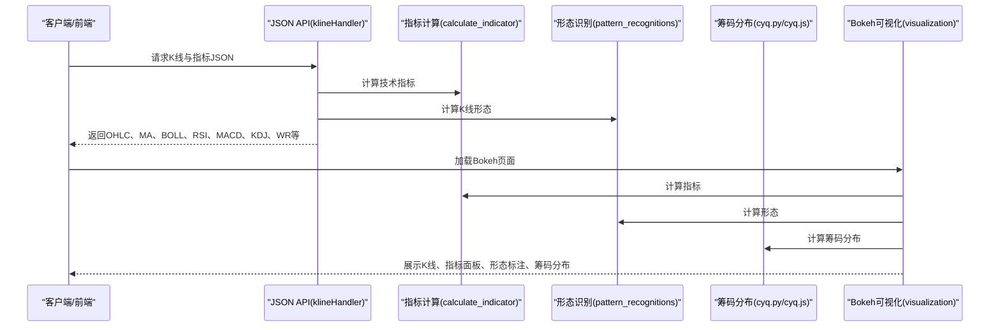
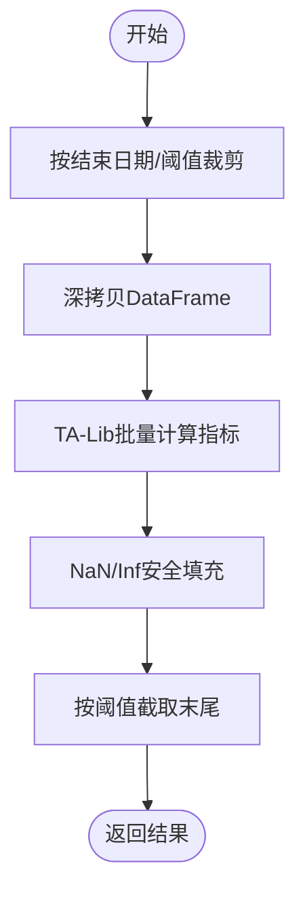
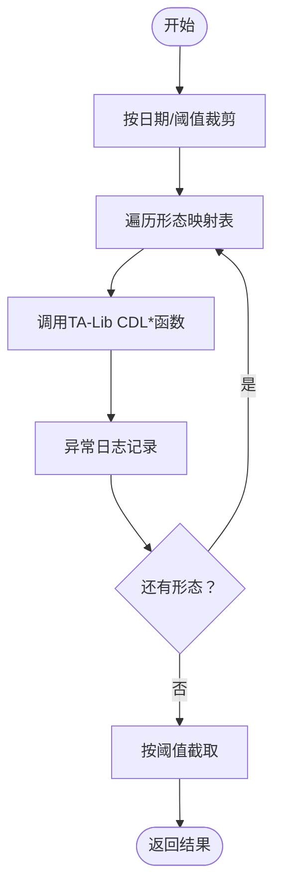
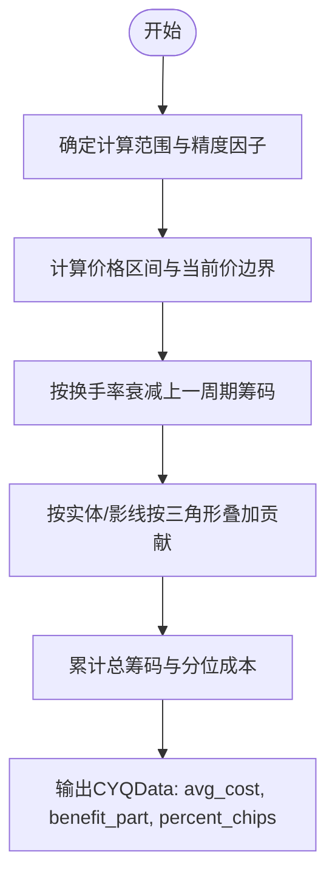
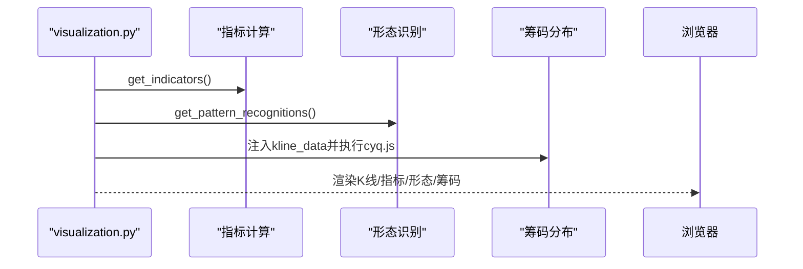
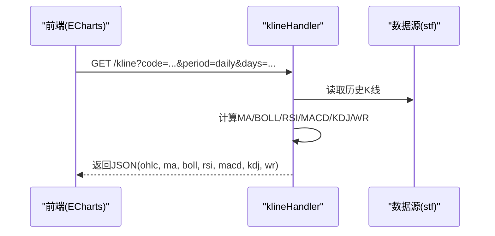
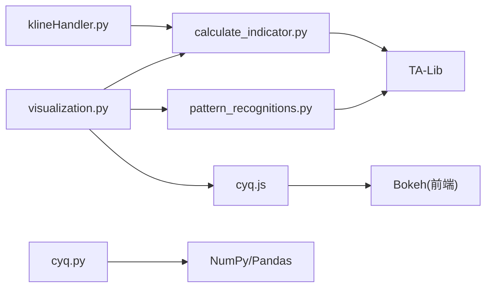

# 技术分析引擎

<cite>
**本文引用的文件**
- [quantia/core/indicator/calculate_indicator.py](file://quantia/core/indicator/calculate_indicator.py)
- [quantia/core/kline/visualization.py](file://quantia/core/kline/visualization.py)
- [quantia/core/kline/indicator_web_dic.py](file://quantia/core/kline/indicator_web_dic.py)
- [quantia/core/kline/cyq.py](file://quantia/core/kline/cyq.py)
- [quantia/core/kline/cyq.js](file://quantia/core/kline/cyq.js)
- [quantia/core/pattern/pattern_recognitions.py](file://quantia/core/pattern/pattern_recognitions.py)
- [quantia/core/tablestructure.py](file://quantia/core/tablestructure.py)
- [quantia/web/klineHandler.py](file://quantia/web/klineHandler.py)
- [tests/test_strategy_bugs.py](file://tests/test_strategy_bugs.py)
</cite>

## 目录
1. [简介](#简介)
2. [项目结构](#项目结构)
3. [核心组件](#核心组件)
4. [架构总览](#架构总览)
5. [详细组件分析](#详细组件分析)
6. [依赖关系分析](#依赖关系分析)
7. [性能考量](#性能考量)
8. [故障排查指南](#故障排查指南)
9. [结论](#结论)
10. [附录](#附录)

## 简介
本技术分析引擎面向股票/ETF等金融资产，提供从K线数据到技术指标、K线形态识别、筹码分布(Position Cost Distribution)计算与可视化的一体化能力。系统支持：
- 200+技术指标的批量计算与导出
- 61种K线形态识别
- 筹码分布(Position Cost Distribution)的实时计算与交互式可视化
- Web端可视化展示（Bokeh）与轻量JSON API（ECharts友好）

目标是帮助用户基于量化指标与形态信号进行投资决策，并提供参数配置、算法优化与性能调优建议。

## 项目结构
- 核心计算层
  - 技术指标计算：quantia/core/indicator/calculate_indicator.py
  - K线形态识别：quantia/core/pattern/pattern_recognitions.py
  - 筹码分布计算：quantia/core/kline/cyq.py（Python实现）与quantia/core/kline/cyq.js（前端渲染）
  - 指标与形态的Web展示配置：quantia/core/kline/indicator_web_dic.py
- 可视化与接口
  - Bokeh可视化：quantia/core/kline/visualization.py
  - JSON API（ECharts友好）：quantia/web/klineHandler.py
- 数据结构与常量
  - 表结构与字段映射：quantia/core/tablestructure.py
- 测试
  - 指标异常值处理测试：tests/test_strategy_bugs.py

图表来源
- [quantia/core/indicator/calculate_indicator.py](file://quantia/core/indicator/calculate_indicator.py#L23-L407)
- [quantia/core/pattern/pattern_recognitions.py](file://quantia/core/pattern/pattern_recognitions.py#L10-L34)
- [quantia/core/kline/cyq.py](file://quantia/core/kline/cyq.py#L13-L165)
- [quantia/core/kline/cyq.js](file://quantia/core/kline/cyq.js#L9-L223)
- [quantia/core/kline/visualization.py](file://quantia/core/kline/visualization.py#L29-L274)
- [quantia/web/klineHandler.py](file://quantia/web/klineHandler.py#L212-L360)
- [quantia/core/kline/indicator_web_dic.py](file://quantia/core/kline/indicator_web_dic.py#L9-L199)

章节来源
- [quantia/core/indicator/calculate_indicator.py](file://quantia/core/indicator/calculate_indicator.py#L23-L407)
- [quantia/core/kline/visualization.py](file://quantia/core/kline/visualization.py#L29-L274)
- [quantia/core/kline/indicator_web_dic.py](file://quantia/core/kline/indicator_web_dic.py#L9-L199)
- [quantia/core/kline/cyq.py](file://quantia/core/kline/cyq.py#L13-L165)
- [quantia/core/kline/cyq.js](file://quantia/core/kline/cyq.js#L9-L223)
- [quantia/core/pattern/pattern_recognitions.py](file://quantia/core/pattern/pattern_recognitions.py#L10-L34)
- [quantia/core/tablestructure.py](file://quantia/core/tablestructure.py#L320-L589)
- [quantia/web/klineHandler.py](file://quantia/web/klineHandler.py#L212-L360)

## 核心组件
- 技术指标计算模块
  - 使用TA-Lib与NumPy/Pandas进行高效批处理，涵盖MACD、KDJ、布林带、RSI、VR、ATR、DMI、W%R、CCI、DMA、OBV、SAR、PSY、BRAR、EMV、BIAS、MFI、VWMA、PPO、WT、Supertrend、DPO、VHF、RVI、FI、ENE等指标。
  - 支持按结束日期与阈值裁剪，避免越界与冗余计算。
  - 对NaN/Inf进行安全填充，保证下游可视化与分析稳定。
- K线形态识别系统
  - 基于TA-Lib形态函数（CDL*）对61种K线形态进行识别，统一通过函数映射批量计算。
  - 支持阈值裁剪与末尾单点查询。
- 筹码分布(Position Cost Distribution)
  - Python侧计算核心，JavaScript侧渲染与交互；以“当前K线收盘价”为基准划分盈亏区间，输出平均成本、获利比例、90%/70%成本区间与集中度。
- 可视化展示
  - Bokeh：K线、成交量、均线、指标面板、形态标注、筹码分布交互。
  - JSON API：ECharts友好格式，便于前端图表集成。

章节来源
- [quantia/core/indicator/calculate_indicator.py](file://quantia/core/indicator/calculate_indicator.py#L23-L407)
- [quantia/core/pattern/pattern_recognitions.py](file://quantia/core/pattern/pattern_recognitions.py#L10-L34)
- [quantia/core/kline/cyq.py](file://quantia/core/kline/cyq.py#L13-L165)
- [quantia/core/kline/cyq.js](file://quantia/core/kline/cyq.js#L9-L223)
- [quantia/core/kline/visualization.py](file://quantia/core/kline/visualization.py#L29-L274)
- [quantia/web/klineHandler.py](file://quantia/web/klineHandler.py#L212-L360)

## 架构总览
系统采用“数据输入 → 批量计算 → 可视化/接口输出”的流水线架构。核心模块之间通过DataFrame与Series传递中间结果，保持解耦与可扩展性。

图表来源
- [quantia/web/klineHandler.py](file://quantia/web/klineHandler.py#L212-L360)
- [quantia/core/indicator/calculate_indicator.py](file://quantia/core/indicator/calculate_indicator.py#L23-L407)
- [quantia/core/pattern/pattern_recognitions.py](file://quantia/core/pattern/pattern_recognitions.py#L10-L34)
- [quantia/core/kline/cyq.py](file://quantia/core/kline/cyq.py#L13-L165)
- [quantia/core/kline/cyq.js](file://quantia/core/kline/cyq.js#L9-L223)
- [quantia/core/kline/visualization.py](file://quantia/core/kline/visualization.py#L29-L274)

## 详细组件分析

### 技术指标计算模块
- 输入：DataFrame（至少包含date/open/close/high/low/volume/amount等列）
- 关键流程
  - 时间窗口裁剪与深拷贝，避免CoW模式下的写入错误
  - 使用TA-Lib批量计算指标，随后统一NaN/Inf填充
  - 支持按结束日期与阈值截断，减少计算量
- 性能要点
  - 向量化运算优先，尽量使用tl.*与numpy内置函数
  - 对需要滚动求和/极值/EMA的指标，先计算基础序列再复用
  - 对可能产生0/Inf的分母（如均价、换手率）使用安全填充
- 异常处理
  - 包装在try-except中，记录错误日志并返回None，避免中断流程

图表来源
- [quantia/core/indicator/calculate_indicator.py](file://quantia/core/indicator/calculate_indicator.py#L23-L407)

章节来源
- [quantia/core/indicator/calculate_indicator.py](file://quantia/core/indicator/calculate_indicator.py#L23-L407)
- [tests/test_strategy_bugs.py](file://tests/test_strategy_bugs.py#L254-L277)

### K线形态识别系统
- 输入：DataFrame（包含open/high/low/close）
- 关键流程
  - 通过stock_kline_pattern_data映射，逐项调用TA-Lib CDL*函数
  - 对异常进行日志记录并跳过，保证稳定性
  - 支持阈值裁剪与单点查询
- 形态数量
  - 61种K线形态，覆盖反转、持续、缺口、吞噬、锤形等经典形态

图表来源
- [quantia/core/pattern/pattern_recognitions.py](file://quantia/core/pattern/pattern_recognitions.py#L10-L34)
- [quantia/core/tablestructure.py](file://quantia/core/tablestructure.py#L469-L589)

章节来源
- [quantia/core/pattern/pattern_recognitions.py](file://quantia/core/pattern/pattern_recognitions.py#L10-L34)
- [quantia/core/tablestructure.py](file://quantia/core/tablestructure.py#L469-L589)

### 筹码分布(Position Cost Distribution)
- 计算思路
  - 在指定交易日范围内，按价格区间（精度因子）累加“交易量贡献”，形成筹码密度曲线
  - 以当前K线收盘价为基准，计算平均成本、获利比例、90%/70%成本区间与集中度
- Python侧计算（cyq.py）
  - 生成价格刻度、衰减、三角叠加、累计总筹码
  - 输出CYQData对象（x:筹码密度, y:价格刻度, avg_cost, benefit_part, percent_chips等）
- JavaScript侧渲染（cyq.js）
  - 前端交互绘制上下两段筹码分布、平均成本线与信息面板
  - 通过回调在悬停时更新筹码分布

图表来源
- [quantia/core/kline/cyq.py](file://quantia/core/kline/cyq.py#L13-L165)
- [quantia/core/kline/cyq.js](file://quantia/core/kline/cyq.js#L9-L223)

章节来源
- [quantia/core/kline/cyq.py](file://quantia/core/kline/cyq.py#L13-L165)
- [quantia/core/kline/cyq.js](file://quantia/core/kline/cyq.js#L9-L223)

### 可视化展示（Bokeh）
- 功能
  - K线蜡烛图、成交量、均线、技术指标面板、K线形态标注、筹码分布交互
  - 支持平移、缩放、十字准星、悬停提示、形态开关
- 数据流
  - 先计算指标与形态，再调用cyq.js进行筹码分布计算与渲染
  - 指标面板配置来自indicator_web_dic.py

图表来源
- [quantia/core/kline/visualization.py](file://quantia/core/kline/visualization.py#L29-L274)
- [quantia/core/kline/indicator_web_dic.py](file://quantia/core/kline/indicator_web_dic.py#L9-L199)

章节来源
- [quantia/core/kline/visualization.py](file://quantia/core/kline/visualization.py#L29-L274)
- [quantia/core/kline/indicator_web_dic.py](file://quantia/core/kline/indicator_web_dic.py#L9-L199)

### JSON API（ECharts友好）
- 设计目标
  - 返回全量历史K线与常用指标，便于前端dataZoom控制视图
- 计算内容
  - MA、Vol_MA、BOLL、RSI、MACD、KDJ、WR等
- 数据格式
  - OHLC顺序与ECharts兼容，数值统一安全转换

图表来源
- [quantia/web/klineHandler.py](file://quantia/web/klineHandler.py#L212-L360)

章节来源
- [quantia/web/klineHandler.py](file://quantia/web/klineHandler.py#L212-L360)

## 依赖关系分析
- 模块内聚与耦合
  - calculate_indicator与pattern_recognitions均依赖TA-Lib与pandas/numpy，彼此独立
  - visualization同时依赖指标、形态与筹码分布，形成“展示层”聚合
  - klineHandler独立于Bokeh，仅依赖指标计算与数据源
- 外部依赖
  - TA-Lib：高性能技术分析库
  - Bokeh：服务端渲染可视化
  - Pandas/Numpy：向量化计算
  - ECharts：前端图表（通过JSON API）

图表来源
- [quantia/core/indicator/calculate_indicator.py](file://quantia/core/indicator/calculate_indicator.py#L4-L7)
- [quantia/core/pattern/pattern_recognitions.py](file://quantia/core/pattern/pattern_recognitions.py#L1-L7)
- [quantia/core/kline/cyq.py](file://quantia/core/kline/cyq.py#L1-L7)
- [quantia/core/kline/cyq.js](file://quantia/core/kline/cyq.js#L1-L7)
- [quantia/core/kline/visualization.py](file://quantia/core/kline/visualization.py#L10-L23)
- [quantia/web/klineHandler.py](file://quantia/web/klineHandler.py#L10-L17)

章节来源
- [quantia/core/indicator/calculate_indicator.py](file://quantia/core/indicator/calculate_indicator.py#L4-L7)
- [quantia/core/pattern/pattern_recognitions.py](file://quantia/core/pattern/pattern_recognitions.py#L1-L7)
- [quantia/core/kline/visualization.py](file://quantia/core/kline/visualization.py#L10-L23)
- [quantia/web/klineHandler.py](file://quantia/web/klineHandler.py#L10-L17)

## 性能考量
- 计算性能
  - 优先使用向量化与TA-Lib原生实现，避免循环
  - 对滚动窗口类指标（如SUM/MIN/MAX/EMA/ATR/ROC等）尽量一次性计算，减少重复扫描
  - 合理设置threshold与calc_threshold，避免对超长序列全量计算
- 内存与IO
  - 深拷贝仅在必要时进行（mask/tail触发），减少不必要的副本
  - 缓存历史K线数据，klineHandler支持years=50确保覆盖
- 可视化性能
  - Bokeh使用ColumnDataSource与增量更新；对高频交互（筹码分布）建议限制精度因子与计算范围
  - ECharts端通过JSON API返回全量数据，前端dataZoom控制视图，降低服务端压力

## 故障排查指南
- 指标异常值处理
  - EMV/VHF/m_price等涉及除零或极值的指标，应使用_fill_nan_inf而非_fillna
  - 测试用例验证了该修复，确保NaN/Inf被正确清理
- 日志与错误
  - 各模块均包裹try-except并记录错误日志，出现异常时返回None，避免中断
- 常见问题
  - “数据为空”：检查缓存是否命中、日期参数是否正确
  - “指标显示异常”：确认阈值与结束日期设置、NaN/Inf填充是否生效
  - “Bokeh交互无响应”：检查cyq.js是否正确注入kline_data与回调

章节来源
- [tests/test_strategy_bugs.py](file://tests/test_strategy_bugs.py#L254-L277)
- [quantia/core/indicator/calculate_indicator.py](file://quantia/core/indicator/calculate_indicator.py#L405-L407)
- [quantia/core/kline/visualization.py](file://quantia/core/kline/visualization.py#L272-L274)

## 结论
本技术分析引擎以TA-Lib为核心，结合pandas/numpy实现高效率的指标与形态计算，并通过Bokeh/ECharts提供直观的可视化体验。系统具备良好的扩展性与稳定性，适合构建从数据采集到策略验证的完整分析链路。建议在生产环境中配合缓存、阈值裁剪与合理的精度设置，以获得最佳性能与用户体验。

## 附录
- 指标与形态清单
  - 技术指标：参见STOCK_STATS_DATA字段映射与indicator_web_dic配置
  - K线形态：参见STOCK_KLINE_PATTERN_DATA映射表（61种）
- 参数配置建议
  - 指标：根据分析周期选择合适的时间窗（如RSI/ATR/ROC等）
  - 形态：合理设置threshold，避免噪声干扰
  - 筹码分布：精度因子与交易日数影响计算耗时与精度，建议默认150与210天
- 自定义开发指南
  - 新增指标：在calculate_indicator中添加计算逻辑，使用_fillna/_fill_nan_inf处理异常值，更新STOCK_STATS_DATA与indicator_web_dic
  - 新增形态：在STOCK_KLINE_PATTERN_DATA中注册CDL*函数映射，更新pattern_recognitions调用逻辑
  - 可视化：在visualization.py中扩展面板或交互行为，确保与现有数据结构兼容

章节来源
- [quantia/core/tablestructure.py](file://quantia/core/tablestructure.py#L320-L589)
- [quantia/core/kline/indicator_web_dic.py](file://quantia/core/kline/indicator_web_dic.py#L9-L199)
- [quantia/core/kline/visualization.py](file://quantia/core/kline/visualization.py#L189-L215)
