# 成交量类指标

<cite>
**本文档引用的文件**
- [calculate_indicator.py](file://quantia/core/indicator/calculate_indicator.py)
- [volume_strategies.py](file://quantia/core/strategy/volume/volume_strategies.py)
- [base.py](file://quantia/core/strategy/base.py)
- [database_schema.md](file://document/database_schema.md)
- [stock_cpbd.py](file://docker/stock/quantia/core/crawling/stock_cpbd.py)
- [test_strategy_bugs.py](file://tests/test_strategy_bugs.py)
</cite>

## 目录
1. [简介](#简介)
2. [项目结构](#项目结构)
3. [核心组件](#核心组件)
4. [架构概览](#架构概览)
5. [详细组件分析](#详细组件分析)
6. [依赖关系分析](#依赖关系分析)
7. [性能考虑](#性能考虑)
8. [故障排除指南](#故障排除指南)
9. [结论](#结论)

## 简介

Quantia项目提供了全面的成交量类技术指标分析功能，包括成交量指标(VOL)、成交量比率(MFI)、能量潮(OBV)、心理线(PSY)、买卖压力指标(EMV)、资金流量(CF)等关键指标。这些指标通过量化成交量数据来分析市场参与者的行为模式，帮助投资者识别趋势确认、突破验证和背离确认等重要交易信号。

成交量分析是技术分析的核心组成部分，它通过研究价格变动与成交量之间的关系来判断市场的真实意图和趋势强度。本项目实现了多种成熟的成交量指标计算方法，并提供了完整的策略筛选功能。

## 项目结构

项目采用模块化架构设计，成交量分析功能主要分布在以下几个核心模块中：

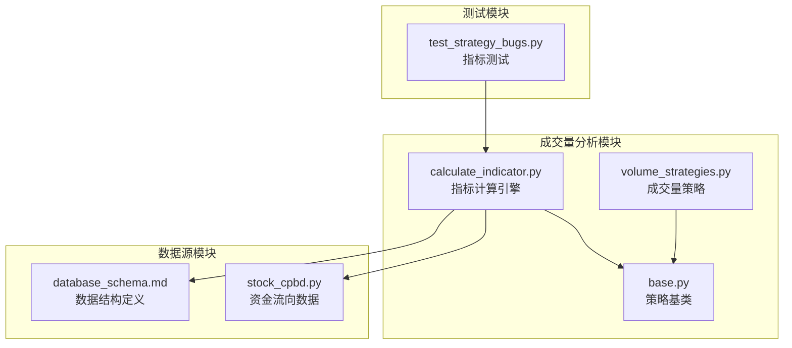

**图表来源**
- [calculate_indicator.py](file://quantia/core/indicator/calculate_indicator.py#L1-L449)
- [volume_strategies.py](file://quantia/core/strategy/volume/volume_strategies.py#L1-L126)
- [base.py](file://quantia/core/strategy/base.py#L1-L202)

**章节来源**
- [calculate_indicator.py](file://quantia/core/indicator/calculate_indicator.py#L1-L449)
- [volume_strategies.py](file://quantia/core/strategy/volume/volume_strategies.py#L1-L126)
- [base.py](file://quantia/core/strategy/base.py#L1-L202)

## 核心组件

### 指标计算引擎

指标计算引擎是整个成交量分析系统的核心，负责实现各种技术指标的计算逻辑。该引擎基于TA-Lib库，提供了高效、准确的指标计算能力。

### 成交量策略模块

成交量策略模块实现了基于成交量的技术分析策略，包括放量上涨和放量跌停等经典策略。这些策略通过量化成交量变化来识别重要的市场转折点。

### 策略基类系统

策略基类系统提供了统一的策略开发框架，支持多种类型的策略扩展，包括技术分析策略、成交量策略、趋势策略等。

**章节来源**
- [calculate_indicator.py](file://quantia/core/indicator/calculate_indicator.py#L23-L407)
- [volume_strategies.py](file://quantia/core/strategy/volume/volume_strategies.py#L19-L126)
- [base.py](file://quantia/core/strategy/base.py#L126-L143)

## 架构概览

成交量分析系统的整体架构采用分层设计，确保了代码的可维护性和扩展性：

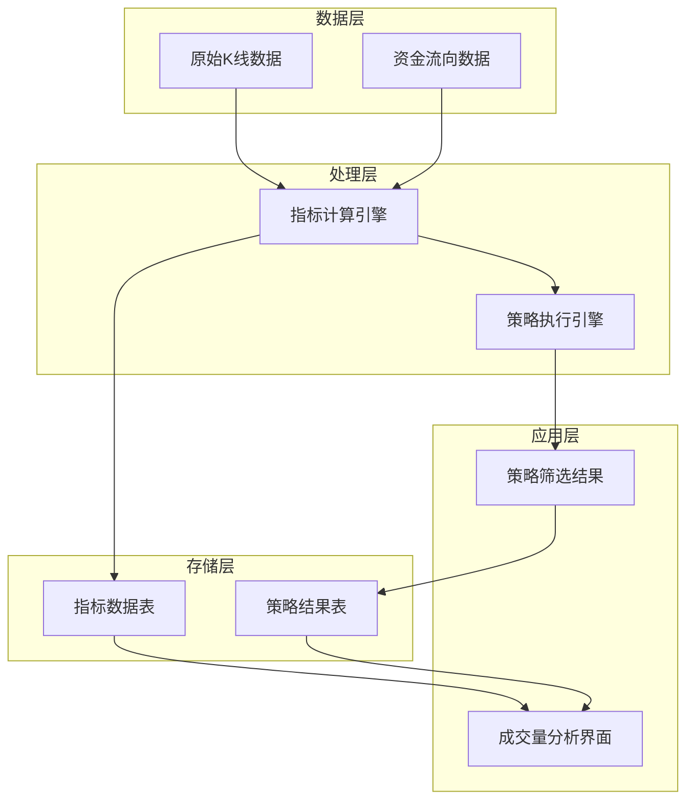

**图表来源**
- [calculate_indicator.py](file://quantia/core/indicator/calculate_indicator.py#L23-L407)
- [volume_strategies.py](file://quantia/core/strategy/volume/volume_strategies.py#L34-L112)

## 详细组件分析

### VOL成交量指标

VOL成交量指标是最基础的成交量技术指标，用于衡量特定时间周期内的成交量水平。

#### 计算原理

VOL指标通过计算成交量的简单移动平均来平滑成交量数据，常用的周期包括5日和10日。

#### 实现方法

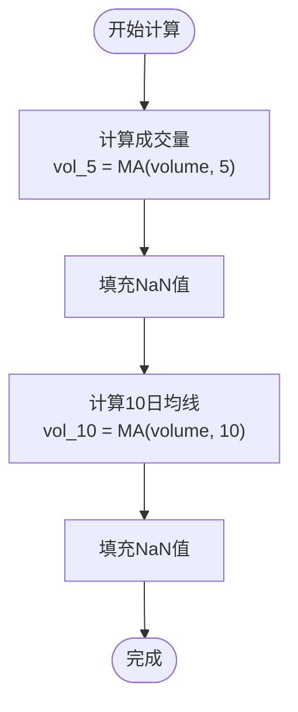

**图表来源**
- [calculate_indicator.py](file://quantia/core/indicator/calculate_indicator.py#L390-L395)

#### 数学公式

- 5日成交量均线：VOL_5 = (V_1 + V_2 + ... + V_5) / 5
- 10日成交量均线：VOL_10 = (V_1 + V_2 + ... + V_10) / 10

#### 使用场景

- 趋势确认：成交量均线向上发散确认上涨趋势
- 背离分析：价格创新高但成交量萎缩显示趋势减弱
- 量价配合：成交量放大配合价格上涨确认突破有效性

**章节来源**
- [calculate_indicator.py](file://quantia/core/indicator/calculate_indicator.py#L390-L395)

### MFI成交量比率指标

MFI(Money Flow Index)成交量比率指标是一种动量指标，结合价格和成交量来测量资金流入和流出的压力。

#### 计算原理

MFI通过计算典型价格、成交量和资金流量来评估市场情绪，其值范围在0-100之间。

#### 实现方法

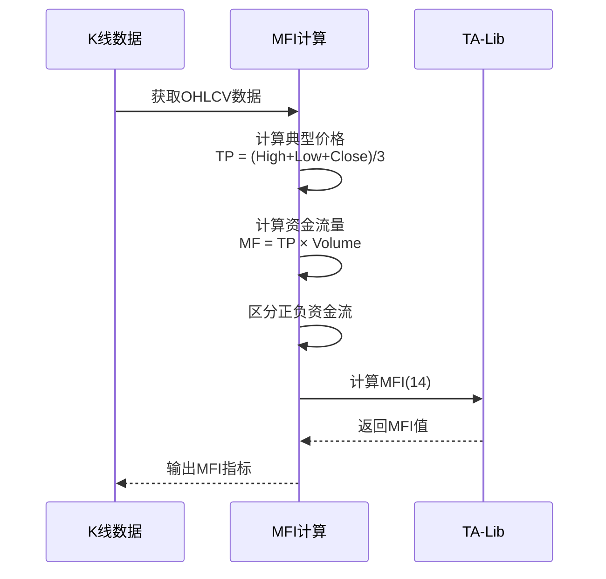

**图表来源**
- [calculate_indicator.py](file://quantia/core/indicator/calculate_indicator.py#L186-L190)

#### 数学公式

- 典型价格：TP = (High + Low + Close) / 3
- 资金流量：MF = TP × Volume
- MFI = 100 - (100 / (1 + MR))
- MR = 正资金流量总和 / 负资金流量总和

#### 使用场景

- 趋势反转识别：MFI超买超卖区域的背离信号
- 动量确认：MFI与价格走势的一致性验证
- 买卖时机：MFI从超卖区向上突破买入

**章节来源**
- [calculate_indicator.py](file://quantia/core/indicator/calculate_indicator.py#L186-L190)

### OBV能量潮指标

OBV(OBV)能量潮指标通过累计成交量来衡量资金流向，是判断市场趋势的重要工具。

#### 计算原理

OBV基于价格变动方向和成交量的组合来计算资金流动，价格上涨时增加成交量，价格下跌时减少成交量。

#### 实现方法

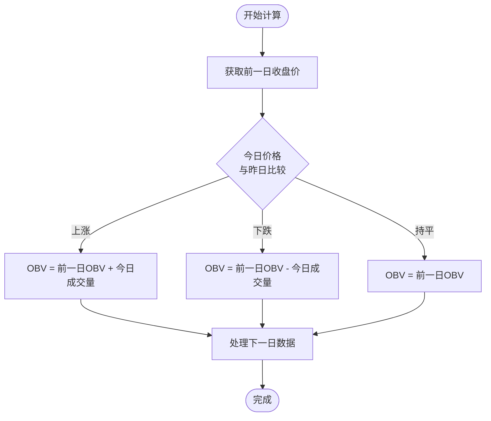

**图表来源**
- [calculate_indicator.py](file://quantia/core/indicator/calculate_indicator.py#L291-L294)

#### 数学公式

- 当Close_t > Close_{t-1}：OBV_t = OBV_{t-1} + Volume_t
- 当Close_t < Close_{t-1}：OBV_t = OBV_{t-1} - Volume_t
- 当Close_t = Close_{t-1}：OBV_t = OBV_{t-1}

#### 使用场景

- 趋势确认：OBV与价格走势的一致性验证
- 背离分析：价格创新高但OBV创新低显示趋势减弱
- 突破验证：OBV确认突破的有效性

**章节来源**
- [calculate_indicator.py](file://quantia/core/indicator/calculate_indicator.py#L291-L294)

### PSY心理线指标

PSY心理线指标衡量市场参与者的情绪状态，通过计算上涨天数的比例来反映市场情绪。

#### 计算原理

PSY通过统计N日内上涨天数占总天数的比例来衡量市场情绪，通常以12日为周期。

#### 实现方法

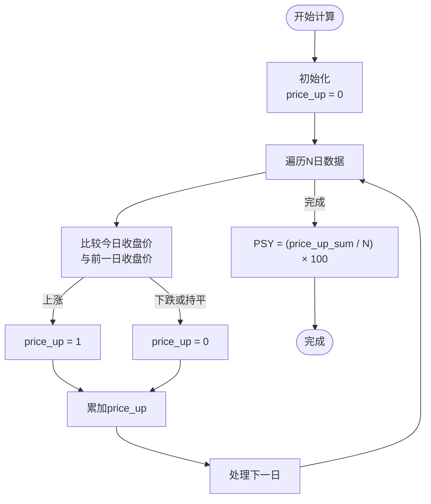

**图表来源**
- [calculate_indicator.py](file://quantia/core/indicator/calculate_indicator.py#L299-L307)

#### 数学公式

- PSY = (上涨天数 / N) × 100
- 上涨天数 = Σ I(Close_t > Close_{t-1})

#### 使用场景

- 市场情绪分析：PSY超买超卖区域的极端情绪
- 反转信号：PSY进入极端区域的反转机会
- 趋势确认：PSY与价格走势的一致性验证

**章节来源**
- [calculate_indicator.py](file://quantia/core/indicator/calculate_indicator.py#L299-L307)

### EMV买卖压力指标

EMV(Exchange Momentum Volume)买卖压力指标通过价格和成交量的关系来衡量市场买卖压力。

#### 计算原理

EMV结合价格变化幅度、成交量和价格区间来计算买卖压力，反映市场参与者的活跃程度。

#### 实现方法

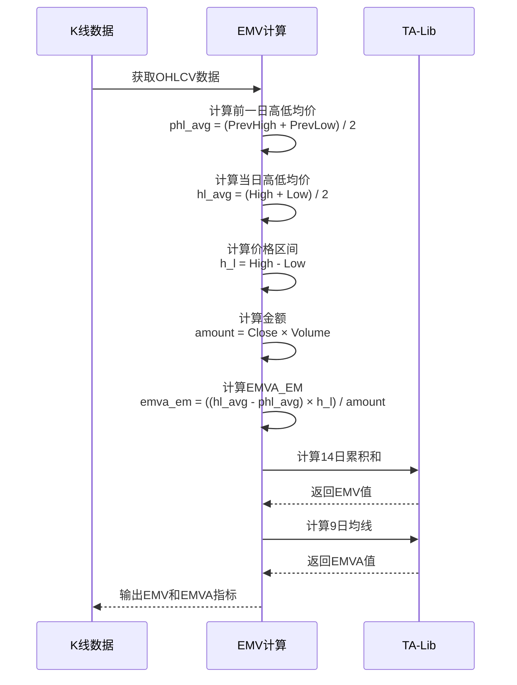

**图表来源**
- [calculate_indicator.py](file://quantia/core/indicator/calculate_indicator.py#L322-L331)

#### 数学公式

- phl_avg = (PrevHigh + PrevLow) / 2
- hl_avg = (High + Low) / 2
- h_l = High - Low
- emva_em = ((hl_avg - phl_avg) × h_l) / Amount
- EMV = Σ emva_em (14日)
- EMVA = MA(EMV, 9)

#### 使用场景

- 量价配合：EMV与价格走势的背离分析
- 趋势强度：EMV数值大小反映趋势强度
- 买卖时机：EMV与EMVA的交叉信号

**章节来源**
- [calculate_indicator.py](file://quantia/core/indicator/calculate_indicator.py#L322-L331)

### 资金流量(CF)指标

资金流量指标通过分析主力资金的流入流出情况来判断市场资金动向。

#### 数据结构

资金流向数据包含多个时间周期的资金流动信息：

| 时间周期 | 字段前缀 | 描述 |
|---------|---------|------|
| 今日 | fund_amount, fund_rate | 主力净流入-净额/净占比 |
| 3日 | fund_amount_3, fund_rate_3 | 3日主力净流入-净额/净占比 |
| 5日 | fund_amount_5, fund_rate_5 | 5日主力净流入-净额/净占比 |
| 10日 | fund_amount_10, fund_rate_10 | 10日主力净流入-净额/净占比 |

#### 实现方法

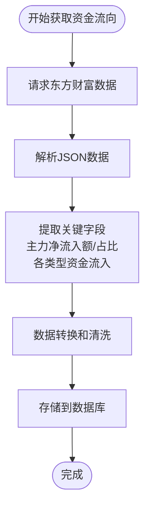

**图表来源**
- [stock_cpbd.py](file://docker/stock/quantia/core/crawling/stock_cpbd.py#L105-L141)

#### 使用场景

- 资金流向分析：识别主力资金的进出方向
- 行业对比：比较不同行业的资金流向
- 概念板块：分析热点概念的资金聚集情况

**章节来源**
- [database_schema.md](file://document/database_schema.md#L149-L210)
- [stock_cpbd.py](file://docker/stock/quantia/core/crawling/stock_cpbd.py#L105-L141)

### 成交量策略分析

成交量策略模块实现了基于成交量的技术分析策略，主要包括放量上涨和放量跌停两种经典策略。

#### 放量上涨策略

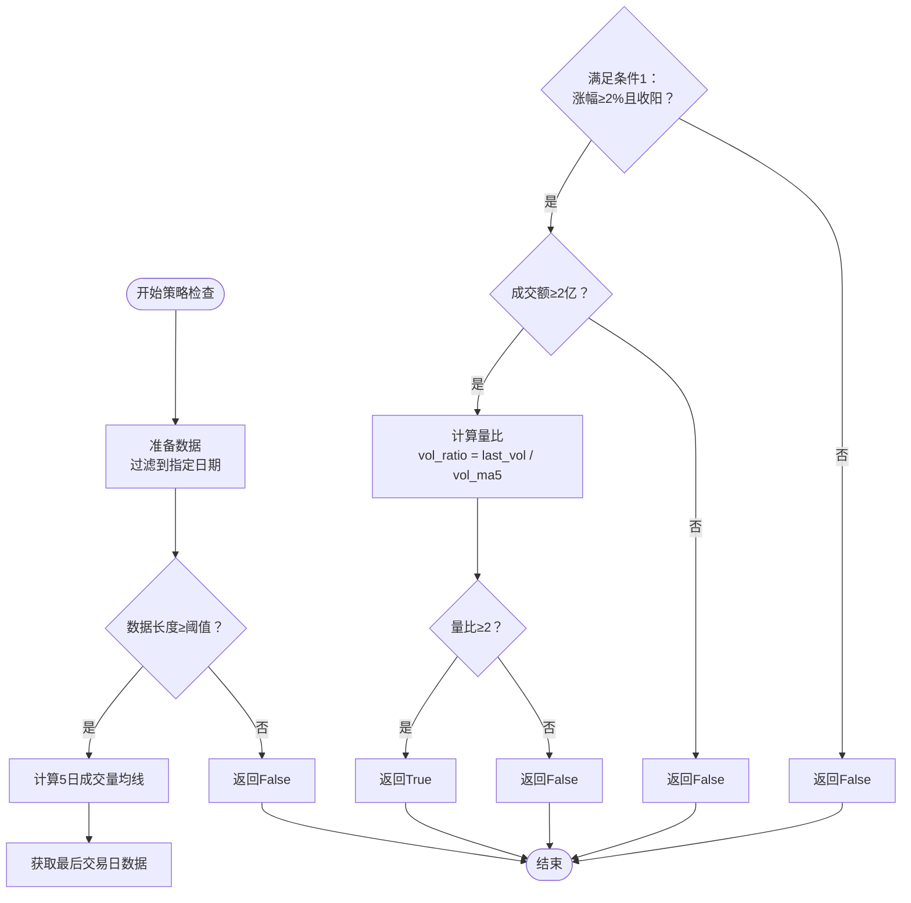

**图表来源**
- [volume_strategies.py](file://quantia/core/strategy/volume/volume_strategies.py#L34-L68)

#### 放量跌停策略

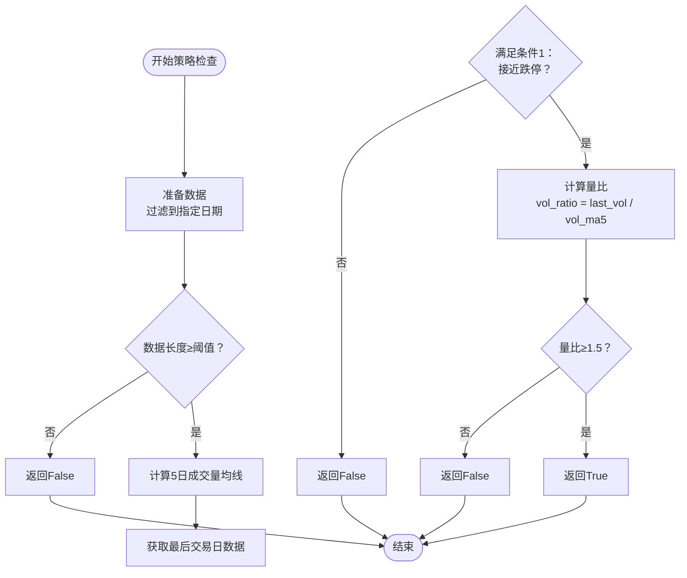

**图表来源**
- [volume_strategies.py](file://quantia/core/strategy/volume/volume_strategies.py#L85-L112)

#### 策略应用场景

- **放量上涨策略**：识别强势突破的股票，适合趋势跟踪交易
- **放量跌停策略**：识别恐慌性抛售，适合逆向投资策略
- **量价配合**：结合价格走势验证突破的有效性
- **背离分析**：成交量与价格的背离预示趋势反转

**章节来源**
- [volume_strategies.py](file://quantia/core/strategy/volume/volume_strategies.py#L19-L126)
- [base.py](file://quantia/core/strategy/base.py#L126-L143)

## 依赖关系分析

成交量分析系统的依赖关系体现了清晰的分层架构：

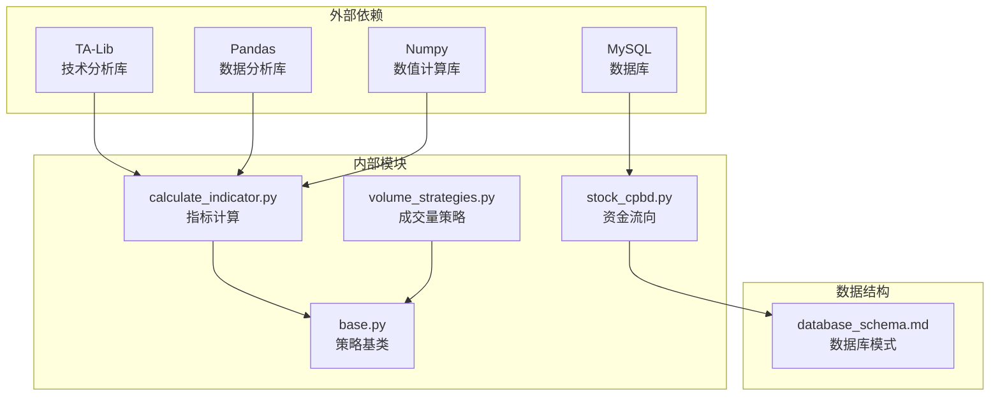

**图表来源**
- [calculate_indicator.py](file://quantia/core/indicator/calculate_indicator.py#L4-L7)
- [volume_strategies.py](file://quantia/core/strategy/volume/volume_strategies.py#L11-L13)

### 关键依赖特性

- **TA-Lib集成**：提供高性能的技术分析函数
- **Pandas数据处理**：支持高效的数据操作和分析
- **数据库持久化**：支持大规模数据的存储和查询
- **策略可扩展性**：基于基类的策略开发框架

**章节来源**
- [calculate_indicator.py](file://quantia/core/indicator/calculate_indicator.py#L4-L7)
- [volume_strategies.py](file://quantia/core/strategy/volume/volume_strategies.py#L11-L13)

## 性能考虑

成交量分析系统在性能方面采用了多项优化措施：

### 内存管理优化

- **深拷贝策略**：避免修改原始数据，防止内存污染
- **NaN值处理**：统一的NaN和Inf值清理机制
- **数据类型优化**：合理选择数据类型减少内存占用

### 计算效率优化

- **向量化计算**：利用NumPy进行批量计算
- **缓存机制**：重复计算的结果缓存
- **阈值控制**：合理的数据截断减少计算量

### 并发处理

- **多线程支持**：支持并发的数据处理
- **异步操作**：网络请求的异步处理
- **批处理模式**：大批量数据的高效处理

## 故障排除指南

### 常见问题及解决方案

#### 指标计算异常

**问题**：某些指标出现NaN或Inf值
**解决方案**：
- 检查输入数据的质量和完整性
- 使用`_fill_nan_inf`函数清理异常值
- 验证数据的时间序列连续性

#### 策略执行失败

**问题**：成交量策略无法正确执行
**解决方案**：
- 确认数据格式符合预期
- 检查阈值参数设置
- 验证策略依赖的数据是否存在

#### 性能问题

**问题**：大量数据处理时性能下降
**解决方案**：
- 优化数据截断策略
- 使用更高效的算法
- 增加内存和CPU资源

**章节来源**
- [test_strategy_bugs.py](file://tests/test_strategy_bugs.py#L254-L277)

## 结论

Quantia项目的成交量类技术指标分析系统提供了完整、高效的成交量分析解决方案。通过实现多种经典的成交量指标和相应的策略，系统能够帮助投资者更好地理解市场动态，做出更明智的投资决策。

### 主要优势

- **指标完整性**：涵盖了主流的成交量分析指标
- **策略实用性**：提供了经过验证的交易策略
- **系统稳定性**：完善的错误处理和性能优化
- **扩展性强**：灵活的架构支持新指标的添加

### 应用价值

成交量分析在实际投资中的价值体现在：

- **趋势确认**：通过成交量确认价格趋势的有效性
- **买卖时机**：识别最佳的买入和卖出时机
- **风险管理**：通过成交量变化预警潜在风险
- **组合优化**：基于成交量因子优化投资组合

该系统为投资者提供了一个强大而实用的成交量分析工具，有助于提高投资决策的质量和成功率。
