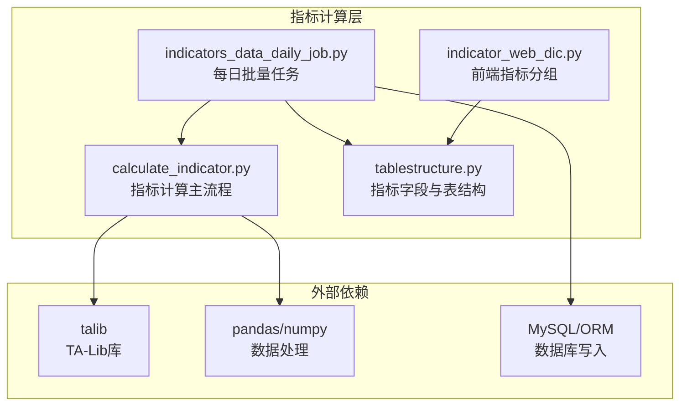
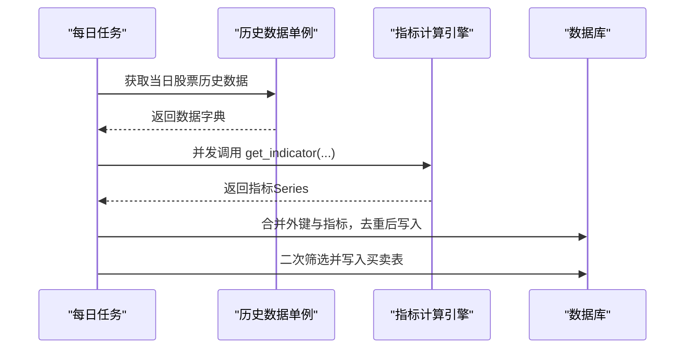
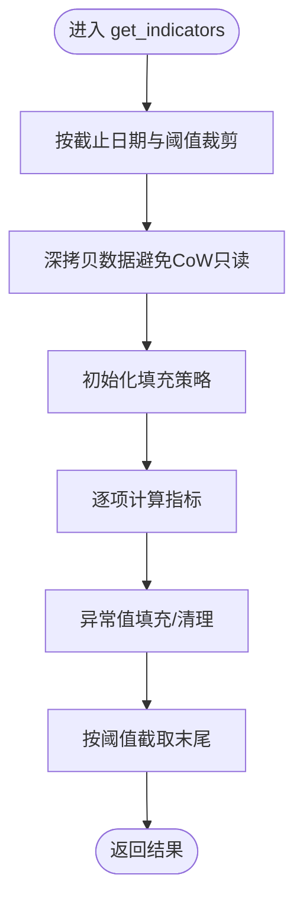
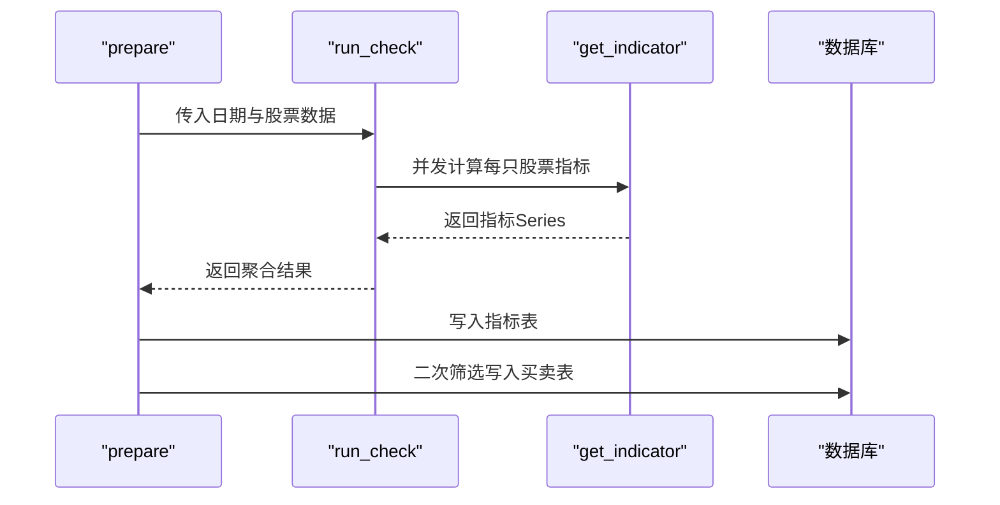
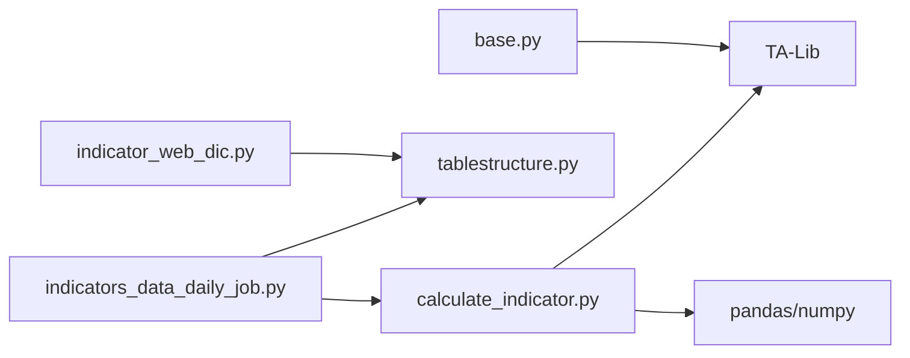

# 技术指标计算

<cite>
**本文引用的文件**
- [calculate_indicator.py](file://quantia/core/indicator/calculate_indicator.py)
- [tablestructure.py](file://quantia/core/tablestructure.py)
- [indicators_data_daily_job.py](file://quantia/job/indicators_data_daily_job.py)
- [indicator_web_dic.py](file://quantia/core/kline/indicator_web_dic.py)
- [README.md](file://README.md)
- [base.py](file://quantia/core/strategy/base.py)
</cite>

## 目录
1. [简介](#简介)
2. [项目结构](#项目结构)
3. [核心组件](#核心组件)
4. [架构总览](#架构总览)
5. [详细组件分析](#详细组件分析)
6. [依赖关系分析](#依赖关系分析)
7. [性能考量](#性能考量)
8. [故障排查指南](#故障排查指南)
9. [结论](#结论)
10. [附录](#附录)

## 简介
本文件面向Quantia项目中的技术指标计算模块，系统化梳理200+种技术指标的计算原理、实现算法与参数配置，覆盖MACD、KDJ、布林带、RSI、DMI、WR、CCI、DMA、TEMA、MFI、VWMA、PPO、STOCHRSI、WT、Supertrend等核心指标。文档同时给出数据预处理、异常值处理、性能优化策略、最佳实践、常见问题与扩展指南，帮助读者理解每个指标的技术含义与实际应用场景。

## 项目结构
技术指标计算位于quantia/core/indicator目录，核心文件为calculate_indicator.py；每日批量计算由job/indicators_data_daily_job.py驱动；指标字段定义与数据库表结构由core/tablestructure.py统一管理；前端可视化与指标分组展示由core/kline/indicator_web_dic.py提供。

图表来源
- [calculate_indicator.py](file://quantia/core/indicator/calculate_indicator.py#L23-L407)
- [tablestructure.py](file://quantia/core/tablestructure.py#L340-L394)
- [indicators_data_daily_job.py](file://quantia/job/indicators_data_daily_job.py#L24-L87)
- [indicator_web_dic.py](file://quantia/core/kline/indicator_web_dic.py#L8-L199)

章节来源
- [README.md](file://README.md#L41-L52)
- [calculate_indicator.py](file://quantia/core/indicator/calculate_indicator.py#L23-L407)
- [tablestructure.py](file://quantia/core/tablestructure.py#L340-L394)
- [indicators_data_daily_job.py](file://quantia/job/indicators_data_daily_job.py#L24-L87)
- [indicator_web_dic.py](file://quantia/core/kline/indicator_web_dic.py#L8-L199)

## 核心组件
- 指标计算引擎：集中于calculate_indicator.py，使用TA-Lib与pandas/numpy完成指标计算，并对NaN/Inf进行填充与清洗。
- 字段与表结构：tablestructure.py定义了指标字段类型、中文名与长度，确保入库一致性。
- 批量调度：indicators_data_daily_job.py负责按日期拉取历史数据、并发计算、去重入库与二次筛选。
- 可视化与分组：indicator_web_dic.py提供前端指标分组与描述，便于界面展示。
- 基础策略工具：base.py提供MA/EMA/ATR等基础计算封装，便于策略层复用。

章节来源
- [calculate_indicator.py](file://quantia/core/indicator/calculate_indicator.py#L13-L21)
- [tablestructure.py](file://quantia/core/tablestructure.py#L340-L394)
- [indicators_data_daily_job.py](file://quantia/job/indicators_data_daily_job.py#L65-L87)
- [indicator_web_dic.py](file://quantia/core/kline/indicator_web_dic.py#L8-L199)
- [base.py](file://quantia/core/strategy/base.py#L99-L123)

## 架构总览
指标计算采用“数据准备—并发计算—入库—二次筛选”的流水线架构。每日任务从单例数据源获取历史行情，调用指标计算引擎生成指标序列，最终写入MySQL并支持基于阈值的简易筛选。

图表来源
- [indicators_data_daily_job.py](file://quantia/job/indicators_data_daily_job.py#L24-L87)
- [calculate_indicator.py](file://quantia/core/indicator/calculate_indicator.py#L410-L448)

章节来源
- [indicators_data_daily_job.py](file://quantia/job/indicators_data_daily_job.py#L24-L171)
- [calculate_indicator.py](file://quantia/core/indicator/calculate_indicator.py#L410-L448)

## 详细组件分析

### 指标计算引擎（calculate_indicator.py）
- 数据预处理
  - 截止日期与阈值裁剪：支持按end_date与calc_threshold限制计算窗口，避免冗余计算。
  - 深拷贝：规避pandas 2.x CoW模式下的只读错误，确保安全修改。
  - 异常值处理：提供_fillna与_fill_nan_inf两类填充策略，统一替换NaN/Inf为0或清理后填充。
- 核心指标实现概览
  - MACD：使用talib.MACD，输出快线、慢线与柱状，分别填充0。
  - KDJ：talib.STOCH输出K、D，再派生J。
  - 布林带：talib.BBANDS输出上轨、中轨、下轨。
  - RSI系列：分别计算6/12/14/24周期RSI。
  - VR：按涨跌平分类统计量，合成VR与MA。
  - ATR/DI/ADX：先计算TR，再调用talib.ATR；DMI采用自定义EMA实现以适配特定口径。
  - WR系列：talib.WILLR计算6/10/14周期。
  - CCI：talib.CCI计算14/84周期。
  - DMA：MA10与MA50之差为DMA，再求其SMA。
  - TEMA：talib.TEMA。
  - MFI：talib.MFI，再求MA。
  - VWMA：成交金额累计/成交量累计，再求MA。
  - PPO：talib.PPO，再求信号线与柱状。
  - STOCHRSI：基于RSI的最小/最大值标准化得到K，再求D。
  - WT：基于均价与EMA的复合计算，再求MA。
  - Supertrend：基于ATR与高低点滚动上下轨，逐条更新状态。
  - 其他：ROC/ROCMA/ROCema、OBV、SAR、PSY、BRAR、EMV、BIAS、DPO、VHF、RVI、FI、ENE等均有实现。
- 输出与异常处理
  - 返回DataFrame副本，末尾截断threshold条记录。
  - 异常捕获并记录日志，保证批处理稳定性。

图表来源
- [calculate_indicator.py](file://quantia/core/indicator/calculate_indicator.py#L23-L407)

章节来源
- [calculate_indicator.py](file://quantia/core/indicator/calculate_indicator.py#L13-L21)
- [calculate_indicator.py](file://quantia/core/indicator/calculate_indicator.py#L23-L407)

### 指标字段与表结构（tablestructure.py）
- STOCK_STATS_DATA定义了全部指标字段的类型、中文名与长度，涵盖MACD、KDJ、布林、RSI、VR、ROC、DMI、WR、CCI、DMA、MFI、VWMA、PPO、WT、Supertrend、STOCHRSI、ENE、RVI、FI、DPO、VHF等。
- 通过该表结构，确保指标入库字段一致、类型正确、长度合理，便于后续查询与可视化。

章节来源
- [tablestructure.py](file://quantia/core/tablestructure.py#L340-L394)

### 每日批量任务（indicators_data_daily_job.py）
- 数据获取：从单例历史数据源按日期拉取股票数据。
- 并发计算：ThreadPoolExecutor并发调用get_indicator，收集结果。
- 写入策略：合并外键与指标，去重后写入cn_stock_indicators；支持二次筛选写入买入/卖出表。
- 二次筛选：基于阈值规则（如KDJ/KDJD/KDJJ/RSI_6/CCI/CR/WR_6/VR等）生成候选池。

图表来源
- [indicators_data_daily_job.py](file://quantia/job/indicators_data_daily_job.py#L24-L171)

章节来源
- [indicators_data_daily_job.py](file://quantia/job/indicators_data_daily_job.py#L24-L171)

### 前端指标分组（indicator_web_dic.py）
- 提供指标标题、描述与绘图字段映射，便于前端按组渲染图表与说明链接。
- 包含MACD、PPO、KDJ、W%R、布林、ENE、TRIX、TEMA、CR、RSI、STOCHRSI、RVI、WT、VR、ROC、DMI、VHF、CCI、ATR、DMA、OBV、SAR、PSY、BRAR、EMV、BIAS、MFI、VWMA、SUPERTREND、DPO、FI等分组。

章节来源
- [indicator_web_dic.py](file://quantia/core/kline/indicator_web_dic.py#L8-L199)

### 基础策略工具（base.py）
- 提供MA/EMA/ATR等常用指标的基础计算封装，便于策略层直接复用，减少重复实现。

章节来源
- [base.py](file://quantia/core/strategy/base.py#L99-L123)

## 依赖关系分析
- 外部库依赖：TA-Lib用于高效计算各类技术指标；pandas/numpy用于数据结构与数值运算；MySQL/ORM用于持久化。
- 内部模块依赖：job层依赖indicator层；indicator层依赖talib/pandas；表结构定义由tablestructure统一管理；前端可视化依赖指标分组字典。

图表来源
- [indicators_data_daily_job.py](file://quantia/job/indicators_data_daily_job.py#L14-L18)
- [calculate_indicator.py](file://quantia/core/indicator/calculate_indicator.py#L4-L7)
- [tablestructure.py](file://quantia/core/tablestructure.py#L340-L394)
- [indicator_web_dic.py](file://quantia/core/kline/indicator_web_dic.py#L8-L199)
- [base.py](file://quantia/core/strategy/base.py#L99-L123)

章节来源
- [indicators_data_daily_job.py](file://quantia/job/indicators_data_daily_job.py#L14-L18)
- [calculate_indicator.py](file://quantia/core/indicator/calculate_indicator.py#L4-L7)
- [tablestructure.py](file://quantia/core/tablestructure.py#L340-L394)
- [indicator_web_dic.py](file://quantia/core/kline/indicator_web_dic.py#L8-L199)
- [base.py](file://quantia/core/strategy/base.py#L99-L123)

## 性能考量
- 并发计算：每日任务使用ThreadPoolExecutor并发调用指标计算，显著提升吞吐。
- 数据裁剪：通过end_date与calc_threshold限制计算窗口，减少无效计算。
- 深拷贝与CoW兼容：避免pandas 2.x只读错误，减少中间态异常。
- 异常值快速填充：统一使用_fillna/_fill_nan_inf，降低NaN传播风险。
- 批量写入：先合并外键与指标，再一次性写入，减少IO次数。
- 算法优化：部分指标（如Supertrend）采用逐条更新，避免向量化复杂度；其他指标尽量使用向量化与向量库加速。

章节来源
- [indicators_data_daily_job.py](file://quantia/job/indicators_data_daily_job.py#L65-L87)
- [calculate_indicator.py](file://quantia/core/indicator/calculate_indicator.py#L23-L407)

## 故障排查指南
- 日志定位：各函数均包含异常捕获与日志记录，优先查看ERROR级别日志以定位问题。
- 空数据处理：当输入数据为空或计算结果为空时，get_indicator返回全零Series，避免下游崩溃。
- NaN/Inf处理：若出现异常值导致指标异常，检查_fill_nan_inf与_fillna的调用位置，确保在指标计算后立即执行。
- 数据库写入：若写入失败，检查表是否存在、字段类型与长度是否匹配（参考tablestructure）。
- 并发问题：ThreadPoolExecutor异常会在run_check中捕获并记录，注意观察具体股票代码与异常栈。

章节来源
- [calculate_indicator.py](file://quantia/core/indicator/calculate_indicator.py#L405-L407)
- [calculate_indicator.py](file://quantia/core/indicator/calculate_indicator.py#L446-L448)
- [indicators_data_daily_job.py](file://quantia/job/indicators_data_daily_job.py#L72-L87)

## 结论
本模块以TA-Lib为核心，结合pandas/numpy实现了200+种技术指标的高效计算，并通过统一的表结构与并发调度形成稳定的批处理流水线。通过对异常值与数据窗口的精细化处理，确保了结果的准确性与鲁棒性。建议在扩展新指标时遵循现有填充与命名规范，保持与表结构一致。

## 附录

### 核心指标清单与参数要点
- MACD：fastperiod=12, slowperiod=26, signalperiod=9；输出macd/macds/macdh。
- KDJ：fastk_period=9, slowk_period=5, slowk_matype=1, slowd_period=5, slowd_matype=1；派生kdjj=3*k-2*d。
- 布林带：timeperiod=20, nbdevup=2, nbdevdn=2, matype=0；输出上轨/中轨/下轨。
- RSI：timeperiod=6/12/14/24；输出rsi_6/rsi_12/rsi/rsi_24。
- VR：26周期涨跌平分类统计，合成vr与vr_6_sma。
- ATR：timeperiod=14；TR由high-low、abs(high-prev_close)、abs(prev_close-low)三者取最大。
- DMI：pdm/mdm基于EMA计算，pdi/mdi/dx/adx/adxr按公式推导。
- WR：timeperiod=6/10/14；输出wr_6/wr_10/wr_14。
- CCI：timeperiod=14/84。
- DMA：ma10=MA(close,10)，ma50=MA(close,50)，dma=ma10-ma50，dma_10_sma=MA(dma,10)。
- TEMA：timeperiod=14。
- MFI：timeperiod=14；输出mfi与mfisma。
- VWMA：14周期金额累计/量累计；输出vwma与mvwma。
- PPO：fast=12, slow=26, matype=1；输出ppo/ppos/ppoh。
- STOCHRSI：基于rsi的min/max标准化，再求K/D。
- WT：esa=EMA(m_price,10)，esa_d=EMA(abs(m_price-esa),10)，esa_ci=(m_price-esa)/(0.015*esa_d)，wt1=EMA(esa_ci,21)，wt2=MA(wt1,4)。
- Supertrend：m_atr=atr*3，hl_avg=(high+low)/2，b_ub=hl_avg+m_atr，b_lb=hl_avg-m_atr；逐条更新上下轨与状态。
- 其他：ROC/ROCMA/ROCema、OBV、SAR、PSY、BRAR、EMV、BIAS、DPO、VHF、RVI、FI、ENE等均有明确实现。

章节来源
- [calculate_indicator.py](file://quantia/core/indicator/calculate_indicator.py#L42-L407)
- [README.md](file://README.md#L41-L52)
