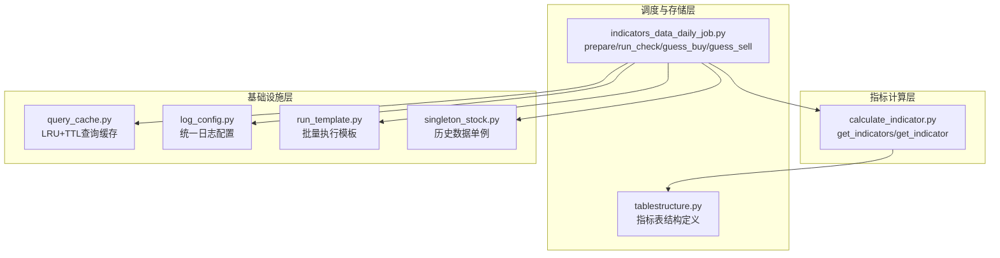
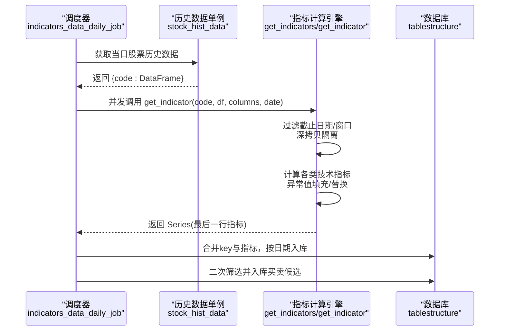
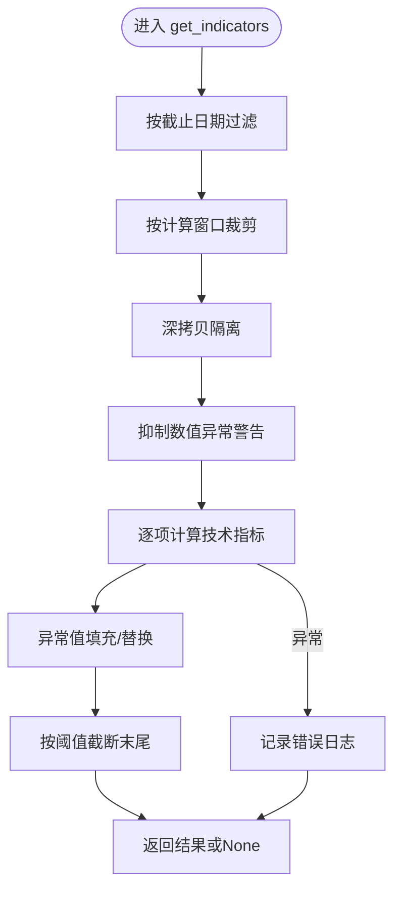
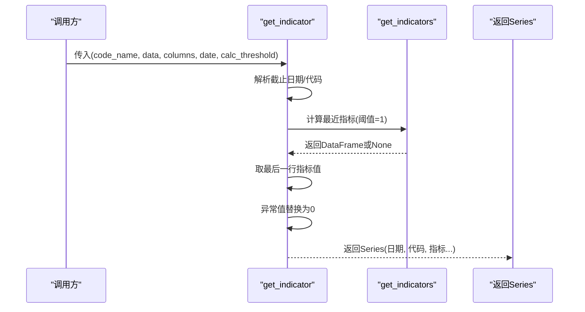
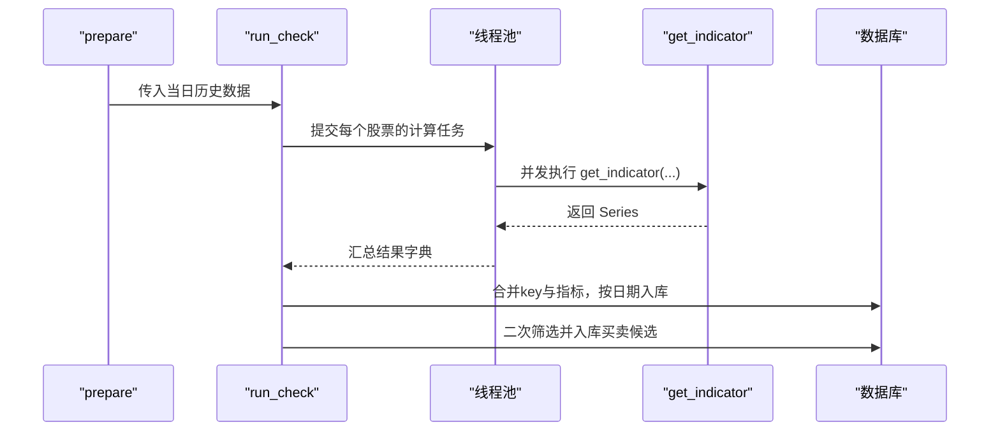
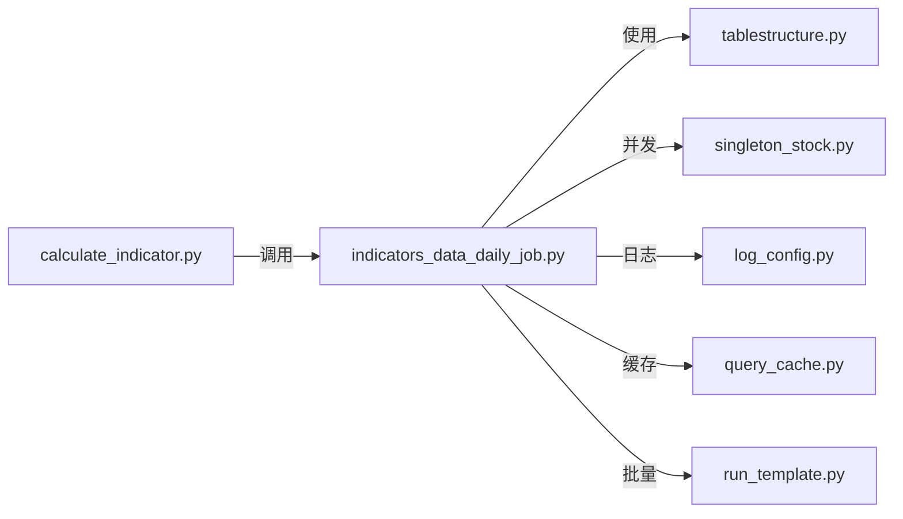

# 指标计算核心算法

<cite>
**本文引用的文件**
- [calculate_indicator.py](file://quantia/core/indicator/calculate_indicator.py)
- [indicators_data_daily_job.py](file://quantia/job/indicators_data_daily_job.py)
- [tablestructure.py](file://quantia/core/tablestructure.py)
- [query_cache.py](file://quantia/lib/query_cache.py)
- [log_config.py](file://quantia/lib/log_config.py)
- [run_template.py](file://quantia/lib/run_template.py)
- [singleton_stock.py](file://quantia/core/singleton_stock.py)
</cite>

## 目录
1. [简介](#简介)
2. [项目结构](#项目结构)
3. [核心组件](#核心组件)
4. [架构总览](#架构总览)
5. [详细组件分析](#详细组件分析)
6. [依赖分析](#依赖分析)
7. [性能考虑](#性能考虑)
8. [故障排查指南](#故障排查指南)
9. [结论](#结论)
10. [附录](#附录)

## 简介
本文件面向Quantia技术指标计算核心算法，围绕指标计算的整体架构、数据预处理流程、异常值处理机制、性能优化策略进行系统化说明。重点解析get_indicators函数的工作原理、数据流处理、内存管理、并行计算优化，并提供错误处理机制、日志记录策略与缓存优化方案。最后给出扩展开发指南与自定义指标添加方法，帮助开发者快速理解并高效扩展指标计算能力。

## 项目结构
指标计算位于quantia/core/indicator目录，核心入口为calculate_indicator.py中的get_indicators与get_indicator函数；日常批处理调度在quantia/job/indicators_data_daily_job.py中，负责并发拉取历史数据并批量计算指标；数据表结构定义在tablestructure.py中；缓存与日志等基础设施在lib目录下；运行模板与单例数据源在lib与core目录中。

图表来源
- [calculate_indicator.py](file://quantia/core/indicator/calculate_indicator.py#L23-L407)
- [indicators_data_daily_job.py](file://quantia/job/indicators_data_daily_job.py#L24-L171)
- [tablestructure.py](file://quantia/core/tablestructure.py#L320-L398)
- [query_cache.py](file://quantia/lib/query_cache.py#L27-L156)
- [log_config.py](file://quantia/lib/log_config.py#L47-L104)
- [run_template.py](file://quantia/lib/run_template.py#L18-L95)
- [singleton_stock.py](file://quantia/core/singleton_stock.py#L40-L116)

章节来源
- [calculate_indicator.py](file://quantia/core/indicator/calculate_indicator.py#L1-L449)
- [indicators_data_daily_job.py](file://quantia/job/indicators_data_daily_job.py#L1-L171)
- [tablestructure.py](file://quantia/core/tablestructure.py#L1-L800)

## 核心组件
- 指标计算引擎：get_indicators(data, end_date, threshold, calc_threshold)
  - 输入：DataFrame历史K线数据，可选截止日期、阈值与计算窗口
  - 输出：新增指标列的DataFrame，末尾截断至threshold条记录
  - 特性：深拷贝隔离、异常值填充、数值稳定性处理、异常捕获
- 单指标提取器：get_indicator(code_name, data, stock_column, date, calc_threshold)
  - 输入：单只股票的历史数据与列名映射
  - 输出：Series，包含最后一行指标值，异常值替换为0
- 批处理调度：indicators_data_daily_job.prepare/run_check
  - 并发执行get_indicator，批量入库，支持买卖信号二次筛选
- 数据结构：tablestructure.STOCK_STATS_DATA
  - 定义指标列名、类型与中文注释，作为入库与前端展示依据
- 缓存与日志：query_cache.QueryCache、log_config.setup_logging
  - 为Web查询提供LRU+TTL缓存；统一日志格式与轮转
- 运行模板：run_template.run_with_args
  - 支持单日、区间、多日批量执行，内置线程池与交易日过滤
- 历史数据单例：singleton_stock.stock_hist_data
  - 提供并发拉取历史数据的能力，限制并发度避免风控

章节来源
- [calculate_indicator.py](file://quantia/core/indicator/calculate_indicator.py#L23-L449)
- [indicators_data_daily_job.py](file://quantia/job/indicators_data_daily_job.py#L24-L171)
- [tablestructure.py](file://quantia/core/tablestructure.py#L320-L398)
- [query_cache.py](file://quantia/lib/query_cache.py#L27-L156)
- [log_config.py](file://quantia/lib/log_config.py#L47-L104)
- [run_template.py](file://quantia/lib/run_template.py#L18-L95)
- [singleton_stock.py](file://quantia/core/singleton_stock.py#L40-L116)

## 架构总览
指标计算采用“数据单例→并发调度→指标计算→入库/筛选”的流水线架构。数据单例负责拉取历史数据，调度器以线程池并发调用指标计算，计算完成后写入数据库并进行简易筛选。

图表来源
- [indicators_data_daily_job.py](file://quantia/job/indicators_data_daily_job.py#L24-L171)
- [calculate_indicator.py](file://quantia/core/indicator/calculate_indicator.py#L23-L449)
- [tablestructure.py](file://quantia/core/tablestructure.py#L396-L407)
- [singleton_stock.py](file://quantia/core/singleton_stock.py#L40-L116)

## 详细组件分析

### get_indicators 函数工作原理
- 输入预处理
  - 截止日期过滤：按end_date筛选数据
  - 计算窗口裁剪：仅保留最近calc_threshold条记录
  - 深拷贝隔离：避免对调用方原始DataFrame的副作用，兼容pandas 2.x CoW模式
- 数值稳定性
  - 使用上下文管理器抑制除零/无效运算警告
  - 异常值处理：_fillna将NaN替换为0；_fill_nan_inf将NaN与±Inf替换为0
- 指标计算管线
  - MACD/KDJ/布林带/三重指数平滑/能量指标/动向类/威廉指标/通道/成交量/震荡/趋势/波动率/其他派生指标
  - 大部分指标基于talib实现，部分指标（如DMI、StochRSI、Supertrend）采用纯numpy实现
- 输出控制
  - 末尾截断至threshold条记录并返回
  - 异常捕获：记录错误日志并返回None

图表来源
- [calculate_indicator.py](file://quantia/core/indicator/calculate_indicator.py#L23-L407)

章节来源
- [calculate_indicator.py](file://quantia/core/indicator/calculate_indicator.py#L23-L407)

### get_indicator 函数工作原理
- 输入：单只股票的历史数据与列名映射
- 流程：
  - 解析截止日期（来自code_name或显式date）
  - 调用get_indicators计算最近一条记录的指标
  - 将最后一行指标值序列化为Series，异常值替换为0
- 输出：Series，包含日期、代码与各指标列

图表来源
- [calculate_indicator.py](file://quantia/core/indicator/calculate_indicator.py#L410-L449)

章节来源
- [calculate_indicator.py](file://quantia/core/indicator/calculate_indicator.py#L410-L449)

### 批处理调度与并发
- prepare：拉取当日历史数据，调用run_check并发计算指标，合并入库
- run_check：ThreadPoolExecutor并发执行get_indicator，收集结果并去重
- guess_buy/guess_sell：基于规则二次筛选并入库

图表来源
- [indicators_data_daily_job.py](file://quantia/job/indicators_data_daily_job.py#L24-L171)

章节来源
- [indicators_data_daily_job.py](file://quantia/job/indicators_data_daily_job.py#L24-L171)

### 数据结构与表定义
- STOCK_STATS_DATA：指标列清单（包含MACD、KDJ、布林、RSI、VR、ATR、DMI、WR、CCI、DMA、TEMA、MFI、VWMA、PPO、StochRSI、WT、Supertrend、ROC、OBV、SAR、PSY、BRAR、EMV、BIAS、DPO、VHF、RVI、FI、ENE等）
- TABLE_CN_STOCK_INDICATORS：指标表，包含外键与指标列
- 用于入库、前端展示与策略复用

章节来源
- [tablestructure.py](file://quantia/core/tablestructure.py#L320-L398)

### 异常值处理机制
- _fillna：将NaN替换为0，兼容pandas 2.x CoW模式
- _fill_nan_inf：将NaN与±Inf替换为0，用于易出现除零/无穷的指标（如m_price、cr、vr、ar、br、emv、vhf、stochrsi_k、esa_ci等）
- get_indicator：对最后一行指标值进行isinf/isnan检查，异常值替换为0

章节来源
- [calculate_indicator.py](file://quantia/core/indicator/calculate_indicator.py#L13-L21)
- [calculate_indicator.py](file://quantia/core/indicator/calculate_indicator.py#L410-L449)

### 内存管理与深拷贝
- 在过滤与裁剪后执行data.copy()，确保：
  - 避免修改调用方原始DataFrame
  - 兼容pandas 2.x CoW模式下的懒拷贝行为
- 对于Supertrend等需要多数组合的指标，使用numpy空数组预先分配，减少频繁append带来的内存碎片

章节来源
- [calculate_indicator.py](file://quantia/core/indicator/calculate_indicator.py#L23-L407)

### 并行计算优化
- 线程池并发：indicators_data_daily_job使用ThreadPoolExecutor并发计算每只股票指标
- 并发限制：singleton_stock限制最大并发数，避免风控与资源争用
- 批量执行模板：run_template支持区间/多日批量执行，内置线程池与交易日过滤

章节来源
- [indicators_data_daily_job.py](file://quantia/job/indicators_data_daily_job.py#L65-L87)
- [singleton_stock.py](file://quantia/core/singleton_stock.py#L70-L71)
- [run_template.py](file://quantia/lib/run_template.py#L44-L76)

### 错误处理与日志记录
- get_indicators：try-except包裹，记录错误日志并返回None
- get_indicator：同上，记录具体股票代码
- run_check：对future.result()异常进行捕获与记录
- 日志配置：统一格式、文件轮转、错误汇总，便于定位问题

章节来源
- [calculate_indicator.py](file://quantia/core/indicator/calculate_indicator.py#L405-L407)
- [calculate_indicator.py](file://quantia/core/indicator/calculate_indicator.py#L446-L448)
- [indicators_data_daily_job.py](file://quantia/job/indicators_data_daily_job.py#L76-L82)
- [log_config.py](file://quantia/lib/log_config.py#L47-L104)

### 缓存优化方案
- QueryCache：LRU+TTL内存缓存，支持COUNT/DATA区分缓存、线程安全
- 适用场景：Web查询接口减少数据库压力，提高响应速度
- 注意：缓存key由SQL+参数组合生成，过期自动清理

章节来源
- [query_cache.py](file://quantia/lib/query_cache.py#L27-L156)

## 依赖分析
- 外部库依赖：pandas、numpy、talib
- 内部模块依赖：
  - calculate_indicator.py被indicators_data_daily_job.py调用
  - indicators_data_daily_job.py依赖tablestructure.py定义的表结构
  - run_template.py为调度提供统一入口
  - singleton_stock.py提供历史数据单例与并发控制
  - query_cache.py与log_config.py为基础设施

图表来源
- [calculate_indicator.py](file://quantia/core/indicator/calculate_indicator.py#L1-L449)
- [indicators_data_daily_job.py](file://quantia/job/indicators_data_daily_job.py#L1-L171)
- [tablestructure.py](file://quantia/core/tablestructure.py#L320-L398)
- [singleton_stock.py](file://quantia/core/singleton_stock.py#L40-L116)
- [query_cache.py](file://quantia/lib/query_cache.py#L27-L156)
- [log_config.py](file://quantia/lib/log_config.py#L47-L104)
- [run_template.py](file://quantia/lib/run_template.py#L18-L95)

章节来源
- [calculate_indicator.py](file://quantia/core/indicator/calculate_indicator.py#L1-L449)
- [indicators_data_daily_job.py](file://quantia/job/indicators_data_daily_job.py#L1-L171)
- [tablestructure.py](file://quantia/core/tablestructure.py#L320-L398)
- [singleton_stock.py](file://quantia/core/singleton_stock.py#L40-L116)
- [query_cache.py](file://quantia/lib/query_cache.py#L27-L156)
- [log_config.py](file://quantia/lib/log_config.py#L47-L104)
- [run_template.py](file://quantia/lib/run_template.py#L18-L95)

## 性能考虑
- 计算路径优化
  - 使用talib进行向量化计算，显著提升MACD、KDJ、布林、RSI、ATR、CCI、MFI、PPO、WILLR、ROC、OBV、SAR等指标的性能
  - 对DMI、StochRSI、Supertrend等采用纯numpy实现，避免额外依赖
- 内存与IO
  - 深拷贝隔离与numpy空数组预分配，降低内存碎片与复制成本
  - 并发限制与线程池复用，避免过度竞争
- 数据访问
  - QueryCache提供LRU+TTL缓存，减少重复查询
  - 日志轮转避免磁盘膨胀

[本节为通用性能建议，无需特定文件引用]

## 故障排查指南
- 常见问题
  - 指标列出现NaN/±Inf：检查_volume与_amount是否为0导致除零；确认使用_fill_nan_inf处理
  - 结果为None：get_indicators异常捕获返回None，检查输入数据完整性与日期过滤条件
  - 并发异常：run_check对future异常进行捕获，查看日志定位具体股票
- 排查步骤
  - 开启统一日志，观察ERROR级别错误堆栈
  - 检查历史数据单例是否成功拉取数据
  - 验证指标列是否存在、数据类型是否匹配
  - 使用QueryCache.stats查看命中率，评估缓存效果

章节来源
- [calculate_indicator.py](file://quantia/core/indicator/calculate_indicator.py#L13-L21)
- [calculate_indicator.py](file://quantia/core/indicator/calculate_indicator.py#L405-L407)
- [indicators_data_daily_job.py](file://quantia/job/indicators_data_daily_job.py#L76-L82)
- [log_config.py](file://quantia/lib/log_config.py#L47-L104)
- [query_cache.py](file://quantia/lib/query_cache.py#L123-L136)

## 结论
本算法通过“深拷贝隔离+异常值填充+向量化计算+并发调度+统一日志+LRU缓存”构建了稳定高效的指标计算流水线。get_indicators作为核心引擎，覆盖主流技术指标并具备良好的数值稳定性；indicators_data_daily_job提供可扩展的批处理与二次筛选能力；基础设施模块保障了可维护性与可观测性。开发者可在现有基础上快速扩展新指标并优化性能。

[本节为总结性内容，无需特定文件引用]

## 附录

### 扩展开发指南：添加自定义指标
- 步骤
  - 在STOCK_STATS_DATA中新增指标列定义（名称、类型、中文注释）
  - 在get_indicators中添加指标计算逻辑，优先使用talib向量化实现
  - 对可能出现NaN/±Inf的指标使用_fill_nan_inf处理
  - 如需多步计算，先计算中间列，再组合得到最终指标
  - 若涉及跨周期聚合，注意使用talib SUM/MIN/MAX/EMA/MA等函数
- 示例参考
  - 简单移动平均：使用talib.MA
  - 指数平滑：使用talib.EMA
  - 聚合求和：使用talib.SUM
  - 组合派生：如BIAS、ENE、ROC等

章节来源
- [tablestructure.py](file://quantia/core/tablestructure.py#L320-L398)
- [calculate_indicator.py](file://quantia/core/indicator/calculate_indicator.py#L23-L407)

### 算法性能调优技巧
- 优先使用talib向量化函数，避免Python循环
- 对DMI、StochRSI、Supertrend等自定义实现，尽量使用numpy向量化操作
- 合理设置calc_threshold与threshold，减少无效计算与IO
- 并发线程数与历史数据拉取线程数保持平衡，避免资源争用
- 使用QueryCache缓存热点查询，结合TTL避免陈旧数据

[本节为通用性能建议，无需特定文件引用]
