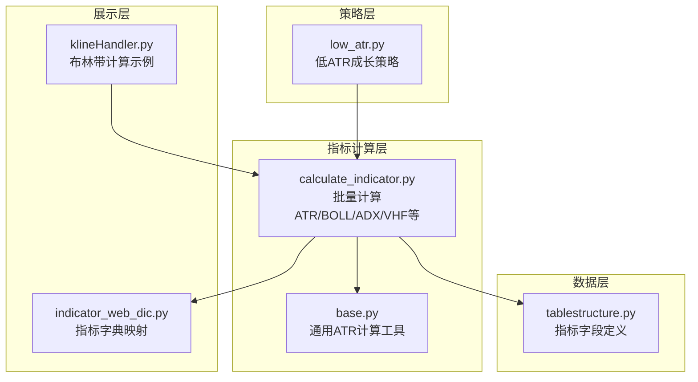
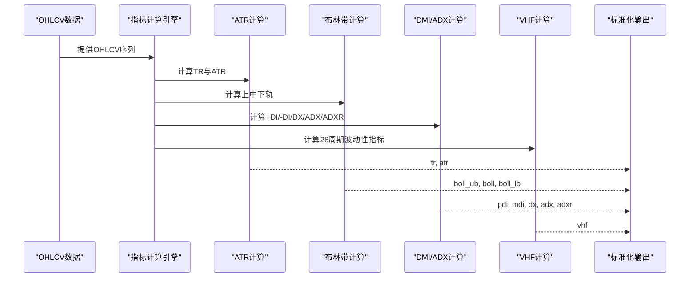
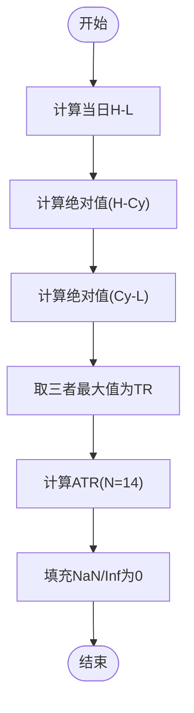
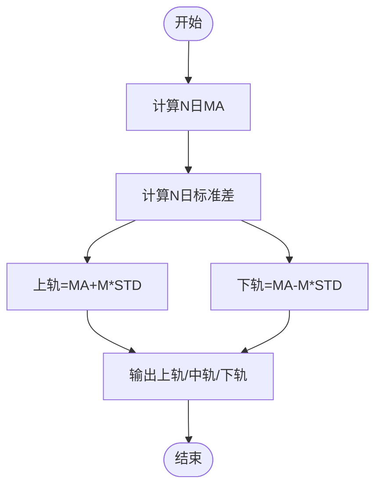
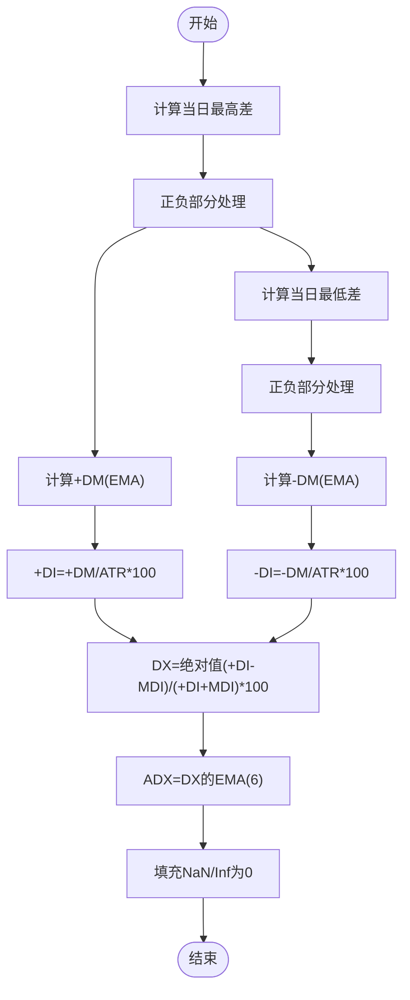
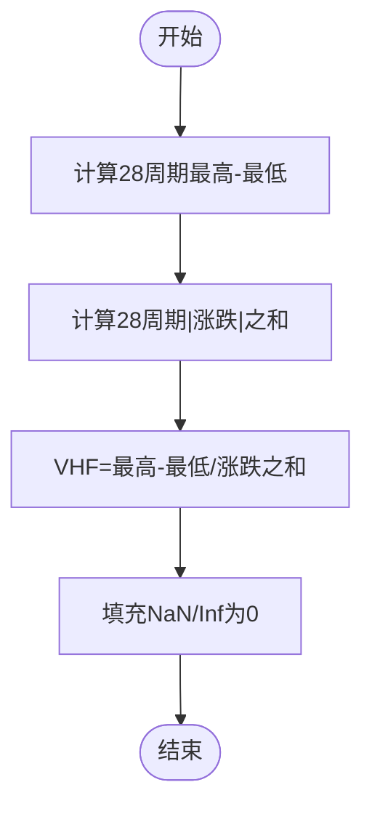
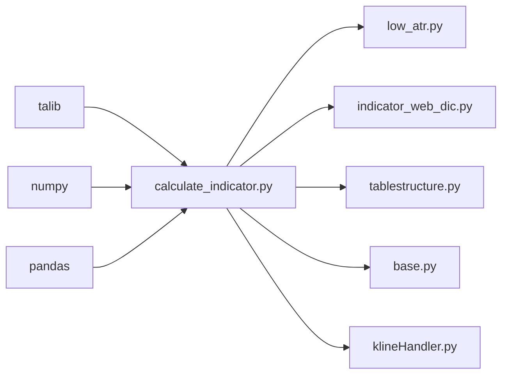

# 波动率类指标

<cite>
**本文引用的文件**
- [calculate_indicator.py](file://quantia/core/indicator/calculate_indicator.py)
- [low_atr.py](file://quantia/core/strategy/low_atr.py)
- [indicator_web_dic.py](file://quantia/core/kline/indicator_web_dic.py)
- [tablestructure.py](file://quantia/core/tablestructure.py)
- [klineHandler.py](file://quantia/web/klineHandler.py)
- [base.py](file://docker/stock/quantia/core/strategy/base.py)
</cite>

## 目录
1. [引言](#引言)
2. [项目结构](#项目结构)
3. [核心组件](#核心组件)
4. [架构总览](#架构总览)
5. [详细组件分析](#详细组件分析)
6. [依赖关系分析](#依赖关系分析)
7. [性能考量](#性能考量)
8. [故障排查指南](#故障排查指南)
9. [结论](#结论)
10. [附录](#附录)

## 引言
本文件聚焦于Quantia系统中的波动率类技术指标，包括平均真实波幅（ATR）、布林带（BOLL）、平均方向性指数（ADX）、波动性指标（VHF）。文档从数学原理、实现方法、参数设置、波动率标准化机制、趋势强度判断与使用场景等方面进行系统化阐述，并给出在趋势跟踪、风险控制、止损设置及交易时机选择中的实践建议。读者无需深厚的数学背景即可理解并应用这些指标。

## 项目结构
波动率相关指标主要分布在以下模块：
- 指标计算引擎：负责批量计算各类技术指标，包括ATR、BOLL、ADX、VHF等
- 策略层：提供基于波动率的策略示例（如低ATR成长策略）
- Web展示：提供指标字典映射，便于前端展示与交互
- 表结构定义：统一管理指标字段类型与中文名，确保数据库一致性

图表来源
- [calculate_indicator.py](file://quantia/core/indicator/calculate_indicator.py#L111-L122)
- [base.py](file://docker/stock/quantia/core/strategy/base.py#L117-L123)
- [low_atr.py](file://quantia/core/strategy/low_atr.py#L12-L63)
- [indicator_web_dic.py](file://quantia/core/kline/indicator_web_dic.py#L101-L126)
- [tablestructure.py](file://quantia/core/tablestructure.py#L320-L394)
- [klineHandler.py](file://quantia/web/klineHandler.py#L65-L80)

章节来源
- [calculate_indicator.py](file://quantia/core/indicator/calculate_indicator.py#L111-L122)
- [indicator_web_dic.py](file://quantia/core/kline/indicator_web_dic.py#L101-L126)
- [tablestructure.py](file://quantia/core/tablestructure.py#L320-L394)

## 核心组件
- 指标计算引擎：集中实现ATR、BOLL、ADX、VHF等波动率相关指标，统一输出标准化数值
- 波动率策略：以ATR为核心构建“低ATR成长”策略，结合价格区间变化进行筛选
- 指标字典：为前端提供指标中文名、描述与字段映射
- 字段定义：统一数据库字段类型与中文名，保证跨模块一致性

章节来源
- [calculate_indicator.py](file://quantia/core/indicator/calculate_indicator.py#L111-L122)
- [low_atr.py](file://quantia/core/strategy/low_atr.py#L12-L63)
- [indicator_web_dic.py](file://quantia/core/kline/indicator_web_dic.py#L101-L126)
- [tablestructure.py](file://quantia/core/tablestructure.py#L320-L394)

## 架构总览
波动率指标在系统中的工作流如下：
- 输入：OHLCV序列（开盘、最高、最低、收盘、成交量）
- 处理：按时间窗口滚动计算TR、ATR、BOLL上下轨、ADX系列、VHF等
- 输出：标准化数值（浮点型），NaN/Inf统一填充为0.0
- 应用：用于趋势强度判断、波动率标准化、止损设置与交易时机选择

图表来源
- [calculate_indicator.py](file://quantia/core/indicator/calculate_indicator.py#L111-L122)
- [calculate_indicator.py](file://quantia/core/indicator/calculate_indicator.py#L58-L62)
- [calculate_indicator.py](file://quantia/core/indicator/calculate_indicator.py#L136-L157)
- [calculate_indicator.py](file://quantia/core/indicator/calculate_indicator.py#L356-L361)

## 详细组件分析

### 平均真实波幅（ATR）
- 数学原理
  - TR（真实波幅）：取当日最高-最低、绝对值（最高-昨日收盘）、绝对值（昨日收盘-最低）三者最大值
  - ATR：对TR进行N日指数或移动平均平滑（本实现使用N日ATR函数）
- 实现要点
  - 使用前一日收盘价构造TR三要素
  - 统一NaN/Inf填充为0.0，避免后续计算异常
- 参数设置
  - TR计算：默认使用当日最高/最低与前一日收盘价
  - ATR平滑：默认周期为14日
- 波动率标准化机制
  - ATR作为绝对波动度的代表，常用于动态止损与止盈设置
- 使用场景
  - 动态止损：以ATR倍数设置止损距离
  - 止损设置：结合趋势强度（ADX）决定是否入场与加减仓
  - 交易时机：在波动放大阶段提高警惕，在缩小时寻找突破机会

图表来源
- [calculate_indicator.py](file://quantia/core/indicator/calculate_indicator.py#L111-L122)

章节来源
- [calculate_indicator.py](file://quantia/core/indicator/calculate_indicator.py#L111-L122)
- [base.py](file://docker/stock/quantia/core/strategy/base.py#L117-L123)

### 布林带（BOLL）
- 数学原理
  - 中轨：N日简单移动平均
  - 上轨/下轨：中轨 ± M×标准差（M通常为2）
- 实现要点
  - 使用talib的BBANDS一次性计算三轨
  - 统一NaN填充为0.0
- 参数设置
  - N：20日（默认）
  - M：2（默认）
- 波动率标准化机制
  - 布林带宽度（上轨-下轨）反映市场波动程度；宽度收窄后通常预示突破概率上升
- 使用场景
  - 趋势跟踪：价格触及上轨/下轨后的反向信号
  - 震荡区间：价格在中轨附近反复横跳时的高抛低吸
  - 波动率事件：宽度异常放大或收窄时的交易信号

图表来源
- [calculate_indicator.py](file://quantia/core/indicator/calculate_indicator.py#L58-L62)
- [klineHandler.py](file://quantia/web/klineHandler.py#L65-L80)

章节来源
- [calculate_indicator.py](file://quantia/core/indicator/calculate_indicator.py#L58-L62)
- [klineHandler.py](file://quantia/web/klineHandler.py#L65-L80)

### 平均方向性指数（ADX）
- 数学原理
  - +DM/-DM：当日最高与前一日最高之差、前一日最低与当日最低之差的正负部分
  - TR：真实波幅（见ATR）
  - +DI/-DI：+DM/ATR × 100
  - DX：绝对值(+DI-MDI)/(+DI+MDI) × 100
  - ADX/ADXR：DX的N日EMA（本实现使用EMA平滑）
- 实现要点
  - 本实现采用stockstats风格的DI/ADX计算链路，先计算+DM/-DM，再归一化得到+DI/-DI，最后求DX与ADX
  - 统一NaN/Inf填充为0.0
- 参数设置
  - +DM/-DM平滑：14日EMA
  - ADX平滑：6日EMA
- 趋势强度判断
  - ADX值越高，趋势越强；低于阈值（如20）时视为震荡
- 使用场景
  - 过滤交易信号：仅在ADX高于阈值时考虑趋势方向
  - 趋势强度对比：比较ADX与ADXR判断趋势加速/减速

图表来源
- [calculate_indicator.py](file://quantia/core/indicator/calculate_indicator.py#L136-L157)

章节来源
- [calculate_indicator.py](file://quantia/core/indicator/calculate_indicator.py#L136-L157)

### 波动性指标（VHF）
- 数学原理
  - 分子：N周期内最高收盘价与最低收盘价之差
  - 分母：N周期内绝对值(今日收盘-昨日收盘)之和
  - VHF = 分子 / 分母
- 实现要点
  - 使用talib的MAX/MIN与SUM函数计算分子与分母
  - 统一NaN/Inf填充为0.0
- 参数设置
  - N：28日（默认）
- 波动率标准化机制
  - VHF衡量价格在一段时间内的“有效性”或“趋势性”：接近1表示强趋势，接近0表示震荡
- 使用场景
  - 趋势识别：VHF高时优先做多/空，震荡时转为区间策略
  - 与其他指标联动：与ADX组合判断趋势强度与方向

图表来源
- [calculate_indicator.py](file://quantia/core/indicator/calculate_indicator.py#L356-L361)

章节来源
- [calculate_indicator.py](file://quantia/core/indicator/calculate_indicator.py#L356-L361)

### Keltner通道（概念说明）
- 概念说明
  - Keltner通道通常由中轨（MA）、上轨（中轨+ATR倍数）、下轨（中轨-ATR倍数）构成
  - 与布林带类似，但使用ATR替代标准差，对极端值更稳健
- 在本项目中的定位
  - 本仓库未直接提供Keltner通道的独立实现，但可复用ATR与MA计算组合实现
- 实践建议
  - 中轨：N日MA（如20日）
  - 上轨/下轨：中轨 ± K×ATR（K通常为1.5~2）
  - 结合ADX判断趋势强度，避免在震荡区间开仓

[本节为概念性说明，不直接分析具体源码文件]

## 依赖关系分析
- 指标计算依赖talib与numpy/pandas进行高效数值计算
- 策略层依赖指标计算结果进行决策
- 展示层依赖指标字典与字段定义进行前端渲染
- 数据层统一字段类型与中文名，确保跨模块一致性

图表来源
- [calculate_indicator.py](file://quantia/core/indicator/calculate_indicator.py#L1-L10)
- [low_atr.py](file://quantia/core/strategy/low_atr.py#L1-L10)
- [indicator_web_dic.py](file://quantia/core/kline/indicator_web_dic.py#L1-L10)
- [tablestructure.py](file://quantia/core/tablestructure.py#L320-L394)
- [klineHandler.py](file://quantia/web/klineHandler.py#L65-L80)
- [base.py](file://docker/stock/quantia/core/strategy/base.py#L117-L123)

章节来源
- [calculate_indicator.py](file://quantia/core/indicator/calculate_indicator.py#L1-L10)
- [tablestructure.py](file://quantia/core/tablestructure.py#L320-L394)

## 性能考量
- 向量化计算：优先使用talib与numpy/pandas的向量化操作，避免逐行循环
- 内存与拷贝：计算前进行深拷贝，避免CoW模式下的写入错误
- NaN/Inf处理：统一替换为0.0，减少后续分支判断成本
- 参数优化：合理设置周期（如ATR=14、ADX=6、VHF=28），兼顾灵敏度与稳定性

[本节提供通用指导，不直接分析具体源码文件]

## 故障排查指南
- 异常处理
  - 计算过程中出现异常时记录日志并返回空结果，避免中断流程
- NaN/Inf问题
  - 对中间结果进行fillna与replace处理，确保最终输出稳定
- 数据长度不足
  - 当样本长度小于最小阈值时，策略直接返回False，避免无效信号

章节来源
- [calculate_indicator.py](file://quantia/core/indicator/calculate_indicator.py#L405-L407)
- [calculate_indicator.py](file://quantia/core/indicator/calculate_indicator.py#L13-L21)
- [low_atr.py](file://quantia/core/strategy/low_atr.py#L20-L21)

## 结论
本系统通过集中化的指标计算引擎，提供了ATR、BOLL、ADX、VHF等波动率相关指标的标准化实现。这些指标在趋势强度判断、波动率标准化、动态止损与交易时机选择方面具有明确的应用价值。结合策略层的低ATR成长策略与前端展示层的指标字典，用户可以快速构建基于波动率的交易体系。

[本节为总结性内容，不直接分析具体源码文件]

## 附录
- 指标字段定义（节选）
  - ATR：tr, atr
  - BOLL：boll_ub, boll, boll_lb
  - ADX：pdi, mdi, dx, adx, adxr
  - VHF：vhf

章节来源
- [tablestructure.py](file://quantia/core/tablestructure.py#L320-L394)
