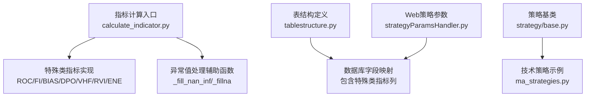
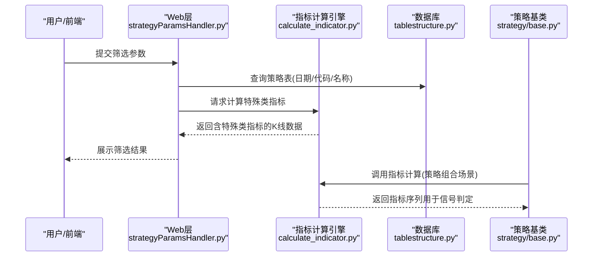
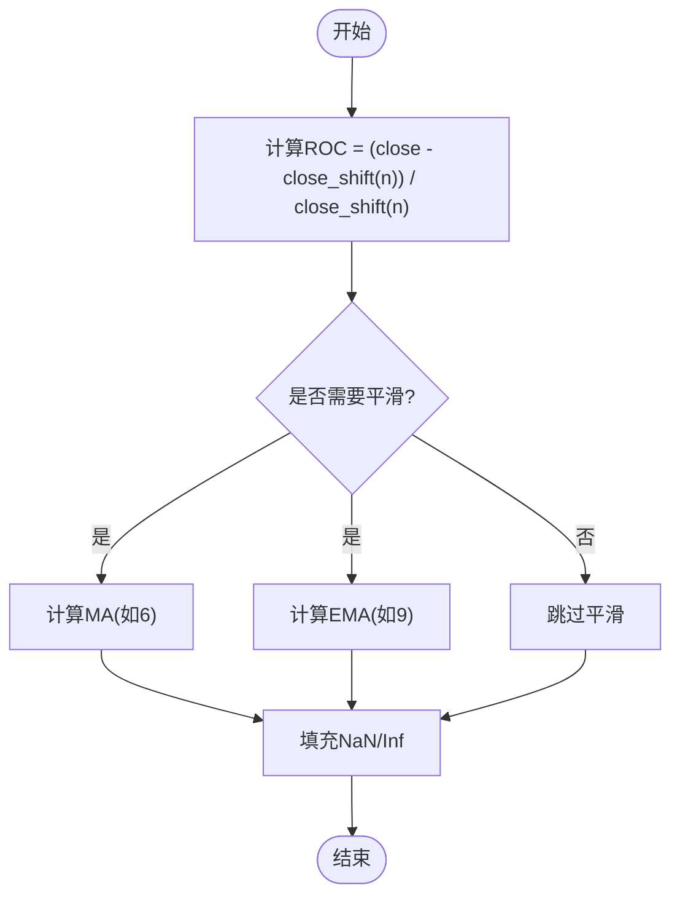
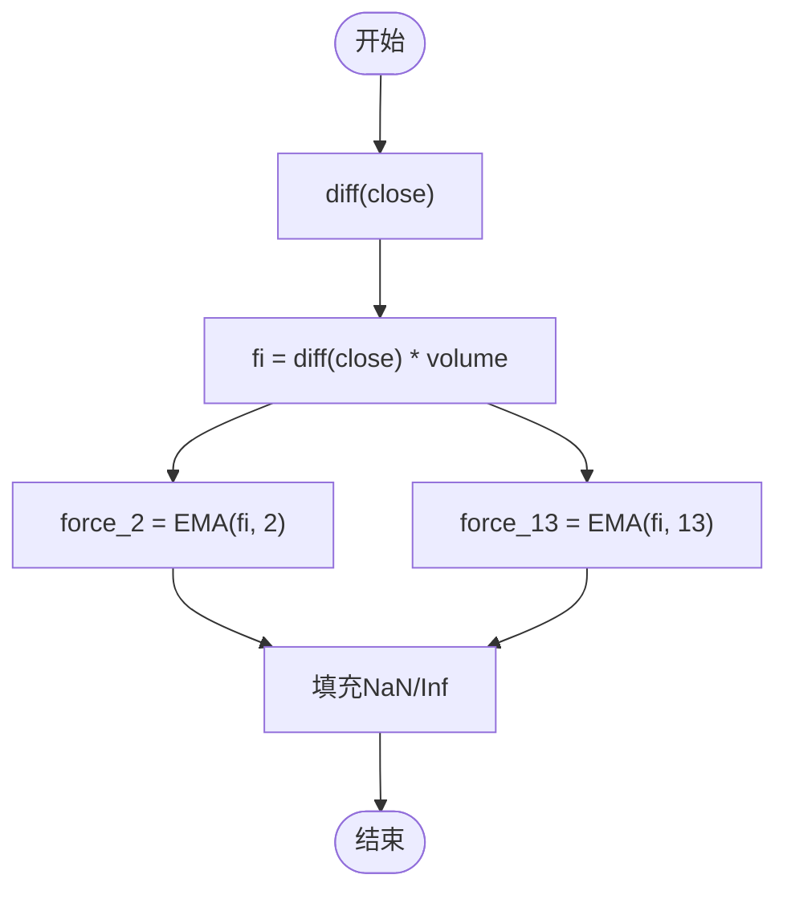
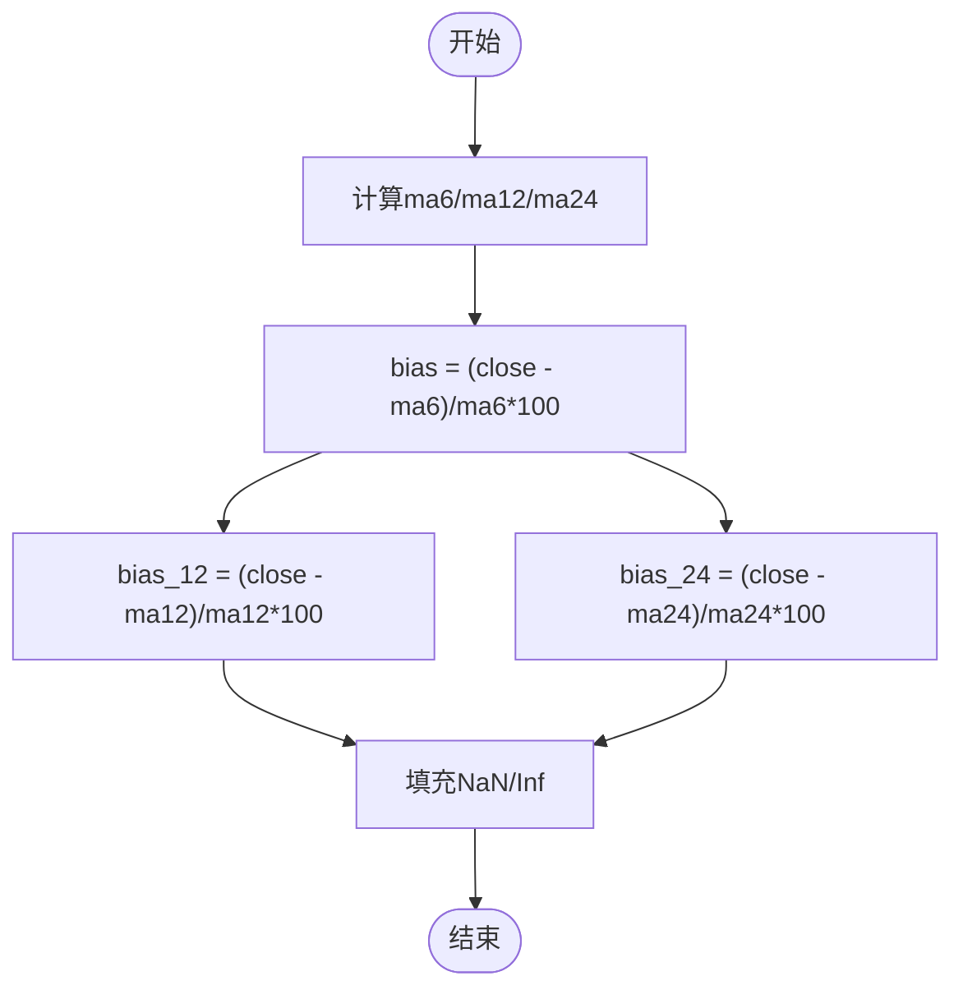
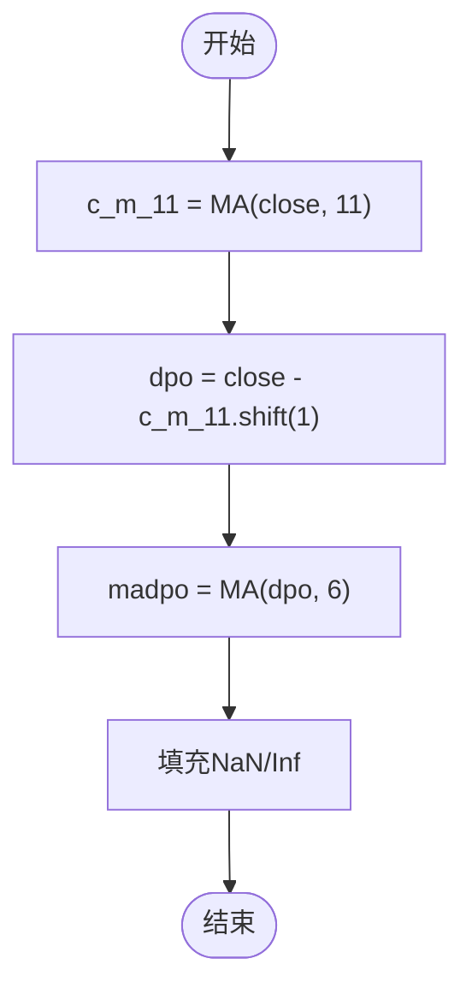
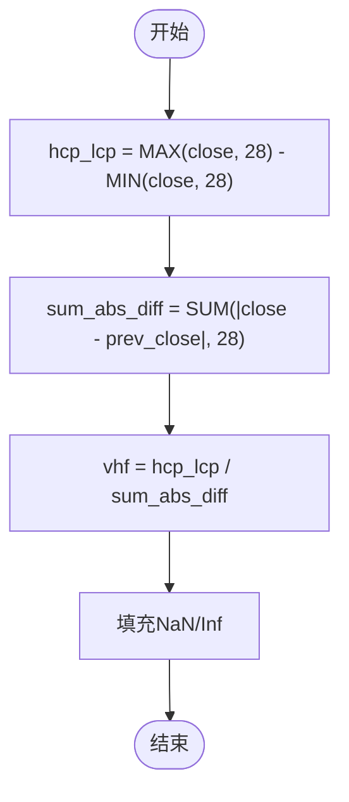
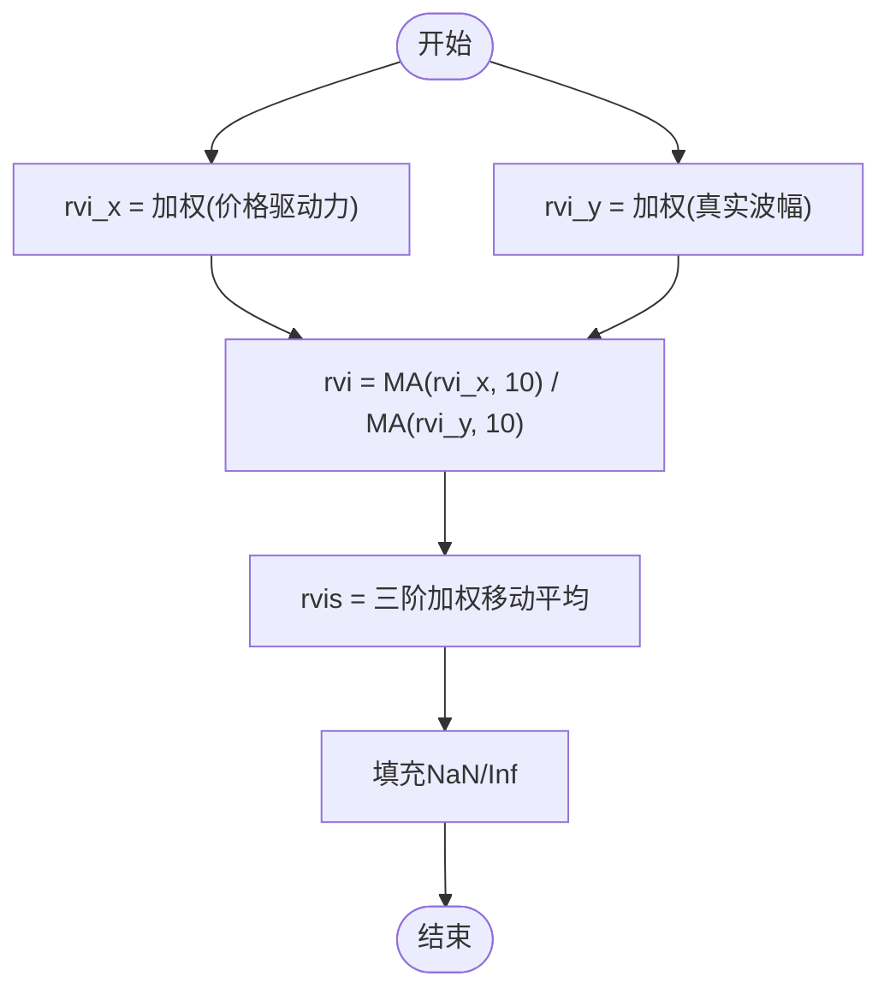
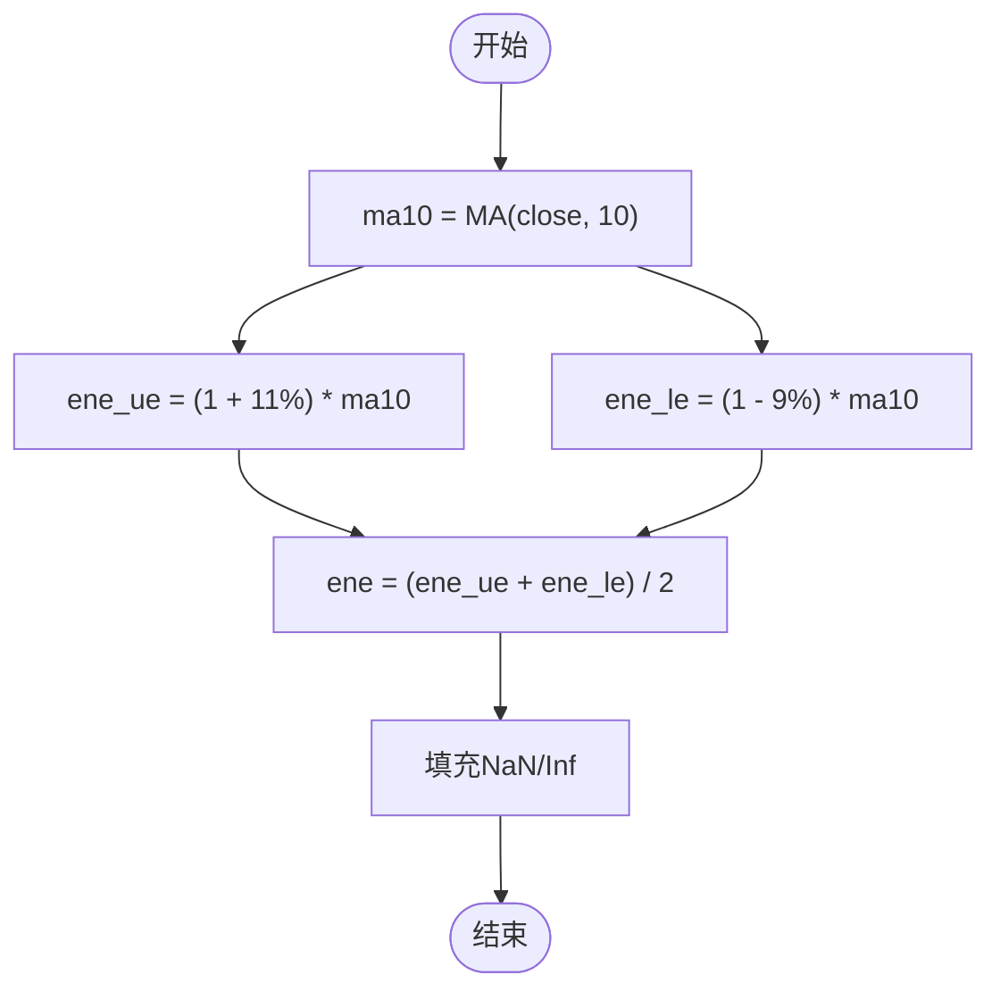
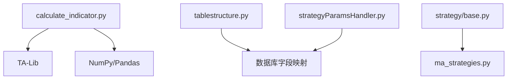

# 特殊类指标

<cite>
**本文引用的文件**
- [calculate_indicator.py](file://quantia/core/indicator/calculate_indicator.py)
- [tablestructure.py](file://quantia/core/tablestructure.py)
- [test_strategy_bugs.py](file://tests/test_strategy_bugs.py)
- [strategy/base.py](file://quantia/core/strategy/base.py)
- [ma_strategies.py](file://quantia/core/strategy/technical/ma_strategies.py)
- [strategyParamsHandler.py](file://quantia/web/strategyParamsHandler.py)
</cite>

## 目录
1. [引言](#引言)
2. [项目结构](#项目结构)
3. [核心组件](#核心组件)
4. [架构总览](#架构总览)
5. [详细组件分析](#详细组件分析)
6. [依赖分析](#依赖分析)
7. [性能考虑](#性能考虑)
8. [故障排查指南](#故障排查指南)
9. [结论](#结论)
10. [附录](#附录)

## 引言
本文件面向Quantia项目中的“特殊用途技术指标”，系统梳理并解释如下指标的计算原理、实现细节、参数设置、异常值处理与工程化集成方式：
- 旋转指标（ROC）
- 力量指标（FI）
- 移动平均偏离率（BIAS）
- 区间振荡指标（DPO）
- 价格振荡指标（VHF）
- 市场情绪指标（RVI）
- 动态支撑阻力（ENE）

文档目标是帮助读者理解这些指标在趋势转折确认、市场情绪分析、价格行为识别中的作用，并掌握它们在工程实现中的关键步骤、参数优化建议、异常值处理机制，以及与常规技术指标的组合使用方法。

## 项目结构
与特殊类指标相关的核心文件位于指标计算模块与数据库表结构定义处：
- 指标计算入口：quantia/core/indicator/calculate_indicator.py
- 表结构定义：quantia/core/tablestructure.py
- 异常值处理验证：tests/test_strategy_bugs.py
- 策略基类与技术策略：quantia/core/strategy/base.py、quantia/core/strategy/technical/ma_strategies.py
- Web端策略参数与查询：quantia/web/strategyParamsHandler.py

图表来源
- [calculate_indicator.py](file://quantia/core/indicator/calculate_indicator.py#L13-L21)
- [tablestructure.py](file://quantia/core/tablestructure.py#L339-L386)
- [strategy/base.py](file://quantia/core/strategy/base.py#L20-L124)
- [ma_strategies.py](file://quantia/core/strategy/technical/ma_strategies.py#L22-L237)
- [strategyParamsHandler.py](file://quantia/web/strategyParamsHandler.py#L900-L960)

章节来源
- [calculate_indicator.py](file://quantia/core/indicator/calculate_indicator.py#L23-L408)
- [tablestructure.py](file://quantia/core/tablestructure.py#L339-L386)

## 核心组件
- 指标计算引擎：提供统一的指标计算入口与异常值处理机制，支持批量计算并输出标准化列。
- 异常值处理工具：针对除零、无穷大、NaN等数值异常进行稳健处理，保证后续分析稳定。
- 表结构定义：明确特殊类指标在数据库中的字段类型与中文名称，便于前端展示与查询。
- 策略基类与技术策略：为指标组合与信号生成提供策略模板与调用方式参考。
- Web参数与查询：提供策略参数配置与按指标列筛选的能力，便于前端交互与后端查询。

章节来源
- [calculate_indicator.py](file://quantia/core/indicator/calculate_indicator.py#L13-L21)
- [tablestructure.py](file://quantia/core/tablestructure.py#L339-L386)
- [strategy/base.py](file://quantia/core/strategy/base.py#L20-L124)
- [ma_strategies.py](file://quantia/core/strategy/technical/ma_strategies.py#L22-L237)
- [strategyParamsHandler.py](file://quantia/web/strategyParamsHandler.py#L900-L960)

## 架构总览
下图展示了特殊类指标在系统中的位置与数据流：

图表来源
- [strategyParamsHandler.py](file://quantia/web/strategyParamsHandler.py#L900-L960)
- [calculate_indicator.py](file://quantia/core/indicator/calculate_indicator.py#L23-L408)
- [tablestructure.py](file://quantia/core/tablestructure.py#L339-L386)
- [strategy/base.py](file://quantia/core/strategy/base.py#L20-L124)

## 详细组件分析

### 旋转指标（ROC）
- 数学定义与计算步骤
  - 计算收盘价的周期变化率：ROC(t) = (close_t - close_{t-n}) / close_{t-n}
  - 可选平滑：对ROC序列做移动平均（MA）或指数平滑（EMA）
- 实现要点
  - 使用外部库计算ROC与MA/EMA
  - 对缺失值进行填充，避免NaN传播
- 参数与优化
  - 周期n：常用12；平滑周期：MA常用6，EMA常用9
  - 在趋势转折确认中，ROC与MA/EMA的交叉可作为信号
- 异常值处理
  - 使用通用填充函数处理NaN/Inf
- 工程化集成
  - 输出列：roc、rocma、rocema
  - 表结构映射：见表结构定义

图表来源
- [calculate_indicator.py](file://quantia/core/indicator/calculate_indicator.py#L283-L289)

章节来源
- [calculate_indicator.py](file://quantia/core/indicator/calculate_indicator.py#L283-L289)
- [tablestructure.py](file://quantia/core/tablestructure.py#L344-L346)

### 力量指标（FI）
- 数学定义与计算步骤
  - 计算价格变化与成交量的乘积：fi = diff(close) * volume
  - 对fi序列做指数平滑：force_2（EMA2）、force_13（EMA13）
- 实现要点
  - 使用差分函数得到价格变化，与成交量相乘
  - 分别计算短期与长期EMA
- 参数与优化
  - EMA周期：常用2与13
  - 适合衡量价格驱动的成交量强度
- 异常值处理
  - 使用通用填充函数处理NaN/Inf
- 工程化集成
  - 输出列：fi、force_2、force_13

图表来源
- [calculate_indicator.py](file://quantia/core/indicator/calculate_indicator.py#L378-L383)

章节来源
- [calculate_indicator.py](file://quantia/core/indicator/calculate_indicator.py#L378-L383)
- [tablestructure.py](file://quantia/core/tablestructure.py#L384-L386)

### 移动平均偏离率（BIAS）
- 数学定义与计算步骤
  - 计算BIAS = (close - ma_n) / ma_n，再乘以100
  - 支持多周期：如6、12、24日MA对应的BIAS
- 实现要点
  - 先计算多条MA，再计算对应BIAS
  - 对NaN/Inf进行清理
- 参数与优化
  - 常用周期：6、12、24
  - 适合衡量价格偏离均线的程度
- 异常值处理
  - 使用专用填充函数处理NaN/Inf
- 工程化集成
  - 输出列：bias、bias_12、bias_24

图表来源
- [calculate_indicator.py](file://quantia/core/indicator/calculate_indicator.py#L332-L347)

章节来源
- [calculate_indicator.py](file://quantia/core/indicator/calculate_indicator.py#L332-L347)
- [tablestructure.py](file://quantia/core/tablestructure.py#L344-L346)

### 区间振荡指标（DPO）
- 数学定义与计算步骤
  - 计算去趋势的价格序列：dpo = close - MA(close, n=11) 的滞后1期
  - 对dpo做移动平均：madpo（如6）
- 实现要点
  - MA窗口11，滞后1期，避免当期均值对当期价格的影响
  - 对dpo进行填充
- 参数与优化
  - MA窗口：11；平滑窗口：6
  - 适合识别周期内的震荡特征
- 异常值处理
  - 使用通用填充函数处理NaN/Inf
- 工程化集成
  - 输出列：dpo、madpo

图表来源
- [calculate_indicator.py](file://quantia/core/indicator/calculate_indicator.py#L349-L354)

章节来源
- [calculate_indicator.py](file://quantia/core/indicator/calculate_indicator.py#L349-L354)
- [tablestructure.py](file://quantia/core/tablestructure.py#L382-L383)

### 价格振荡指标（VHF）
- 数学定义与计算步骤
  - 计算最高价与最低价的区间跨度：hcp_lcp = MAX(close, n) - MIN(close, n)
  - 计算相邻日价格变化的累计绝对值：sum_abs_diff = SUM(abs(close - prev_close), n)
  - VHF = hcp_lcp / sum_abs_diff
- 实现要点
  - 区间跨度与累计变化的比值，衡量价格趋势强度
- 参数与优化
  - 常用周期：28
- 异常值处理
  - 使用专用填充函数处理NaN/Inf
- 工程化集成
  - 输出列：vhf

图表来源
- [calculate_indicator.py](file://quantia/core/indicator/calculate_indicator.py#L356-L360)

章节来源
- [calculate_indicator.py](file://quantia/core/indicator/calculate_indicator.py#L356-L360)
- [tablestructure.py](file://quantia/core/tablestructure.py#L384)

### 市场情绪指标（RVI）
- 数学定义与计算步骤
  - 计算价格驱动力与真实波幅的加权组合：rvi_x、rvi_y
  - 对rvi_x与rvi_y分别做MA平滑（如10）
  - RVI = MA(rvi_x, 10) / MA(rvi_y, 10)
  - 对RVI做三阶加权移动平均：rvis
- 实现要点
  - 使用多期滞后与加权组合构造情绪指标
- 参数与优化
  - 平滑周期：10；rvis加权：1/6权重分配
- 异常值处理
  - 使用专用填充函数处理NaN/Inf
- 工程化集成
  - 输出列：rvi、rvis

图表来源
- [calculate_indicator.py](file://quantia/core/indicator/calculate_indicator.py#L362-L377)

章节来源
- [calculate_indicator.py](file://quantia/core/indicator/calculate_indicator.py#L362-L377)
- [tablestructure.py](file://quantia/core/tablestructure.py#L385-L386)

### 动态支撑阻力（ENE）
- 数学定义与计算步骤
  - 计算10日MA：ma10
  - 上轨：ene_ue = (1 + 11/100) * ma10
  - 下轨：ene_le = (1 - 9/100) * ma10
  - 中轨：ene = (ene_ue + ene_le) / 2
- 实现要点
  - 以MA为中心，上下轨构成动态通道
- 参数与优化
  - MA周期：10；上轨偏移：+11%；下轨偏移：-9%
- 异常值处理
  - 使用通用填充函数处理NaN/Inf
- 工程化集成
  - 输出列：ene_ue、ene_le、ene

图表来源
- [calculate_indicator.py](file://quantia/core/indicator/calculate_indicator.py#L385-L388)

章节来源
- [calculate_indicator.py](file://quantia/core/indicator/calculate_indicator.py#L385-L388)
- [tablestructure.py](file://quantia/core/tablestructure.py#L382-L388)

### 特殊类指标的信号生成与组合使用
- 趋势转折确认
  - ROC与MA/EMA交叉：结合ROC与rocma/rocema的金叉死叉
  - BIAS多周期背离：多周期BIAS同时发散形成背离信号
  - VHF强弱切换：VHF上升/下降作为趋势强度信号
- 市场情绪分析
  - RVI与rvis：RVI超买超卖与rvis趋势方向共同判断
- 价格行为识别
  - DPO震荡特征：结合madpo识别周期内震荡
  - ENE通道突破：价格突破ENE上轨/下轨作为突破信号
- 与常规指标组合
  - 可与RSI、MACD、布林带等指标联合过滤，提高信号稳定性

章节来源
- [calculate_indicator.py](file://quantia/core/indicator/calculate_indicator.py#L283-L388)
- [ma_strategies.py](file://quantia/core/strategy/technical/ma_strategies.py#L22-L237)

## 依赖分析
- 指标计算依赖外部库（如TA-Lib）进行技术指标计算
- 异常值处理依赖NumPy与Pandas的替换/填充机制
- 表结构定义依赖数据库字段映射，确保Web层查询与展示
- 策略基类提供统一的策略开发模板，便于扩展新的组合策略

图表来源
- [calculate_indicator.py](file://quantia/core/indicator/calculate_indicator.py#L4-L7)
- [tablestructure.py](file://quantia/core/tablestructure.py#L339-L386)
- [strategy/base.py](file://quantia/core/strategy/base.py#L20-L124)
- [ma_strategies.py](file://quantia/core/strategy/technical/ma_strategies.py#L22-L237)
- [strategyParamsHandler.py](file://quantia/web/strategyParamsHandler.py#L900-L960)

章节来源
- [calculate_indicator.py](file://quantia/core/indicator/calculate_indicator.py#L4-L7)
- [tablestructure.py](file://quantia/core/tablestructure.py#L339-L386)
- [strategy/base.py](file://quantia/core/strategy/base.py#L20-L124)
- [ma_strategies.py](file://quantia/core/strategy/technical/ma_strategies.py#L22-L237)
- [strategyParamsHandler.py](file://quantia/web/strategyParamsHandler.py#L900-L960)

## 性能考虑
- 向量化计算：优先使用NumPy与TA-Lib提供的向量化函数，避免显式循环
- 内存与拷贝：计算前进行深拷贝，避免写时复制导致的错误
- 缺失值处理：在除法与求和前使用异常值处理函数，减少无效计算
- 批量计算：通过阈值参数控制计算窗口大小，平衡精度与性能

## 故障排查指南
- 异常值处理验证
  - EMV与VHF应使用专用填充函数而非通用填充函数
  - m_price在成交量为0时会产生无穷大，需清理
- 常见问题
  - NaN/Inf导致的除零或溢出：使用异常值处理函数
  - 数据长度不足：确保输入数据满足策略阈值要求
  - Web查询表不存在：检查策略表是否已创建并填充

章节来源
- [test_strategy_bugs.py](file://tests/test_strategy_bugs.py#L254-L277)
- [calculate_indicator.py](file://quantia/core/indicator/calculate_indicator.py#L13-L21)

## 结论
特殊类指标在趋势确认、情绪分析与价格行为识别方面具有独特优势。通过统一的指标计算引擎、稳健的异常值处理与完善的表结构映射，项目实现了对ROC、FI、BIAS、DPO、VHF、RVI、ENE等指标的工程化落地。建议在实际应用中结合多周期与多指标组合，配合策略基类模板进行扩展，以提升信号质量与稳定性。

## 附录
- 指标列在表结构中的映射
  - 包含：roc、rocma、rocema、dpo、madpo、vhf、rvi、rvis、fi、force_2、force_13、ene_ue、ene_le、ene等
- Web端筛选与参数配置
  - 支持按日期、代码、名称筛选策略结果
  - 提供策略参数持久化与动态加载

章节来源
- [tablestructure.py](file://quantia/core/tablestructure.py#L339-L386)
- [strategyParamsHandler.py](file://quantia/web/strategyParamsHandler.py#L900-L960)
