# 趋势类指标

<cite>
**本文引用的文件**   
- [calculate_indicator.py](file://quantia/core/indicator/calculate_indicator.py)
- [base.py](file://quantia/core/strategy/base.py)
- [ma_strategies.py](file://quantia/core/strategy/technical/ma_strategies.py)
- [visualization.py](file://quantia/core/kline/visualization.py)
- [indicator_web_dic.py](file://quantia/core/kline/indicator_web_dic.py)
- [backtrace_ma250.py](file://quantia/core/strategy/backtrace_ma250.py)
- [keep_increasing.py](file://quantia/core/strategy/keep_increasing.py)
- [turtle_trade.py](file://quantia/core/strategy/turtle_trade.py)
</cite>

## 目录
1. [引言](#引言)
2. [项目结构](#项目结构)
3. [核心组件](#核心组件)
4. [架构总览](#架构总览)
5. [详细组件分析](#详细组件分析)
6. [依赖关系分析](#依赖关系分析)
7. [性能考量](#性能考量)
8. [故障排查指南](#故障排查指南)
9. [结论](#结论)
10. [附录](#附录)

## 引言
本文件面向Quantia项目中的趋势类技术指标，系统梳理并解释移动平均线(MA)、指数平滑移动平均(EMA)、MACD、TRIX、DMA、VWMA、PPO、WVWMA、Supertrend等指标的计算原理、参数设置、信号生成规则与使用场景。文档同时覆盖数据预处理、异常值处理机制、趋势判断最佳实践、多时间框架分析方法以及与其他指标的趋势确认思路，帮助读者理解这些指标的技术含义与实际应用价值。

## 项目结构
本项目围绕“K线数据 → 指标计算 → 可视化展示 → 策略应用”的主路径组织，趋势类指标主要集中在指标计算模块，策略模块用于基于指标进行选股或入场判断，可视化模块负责将指标与K线叠加展示。

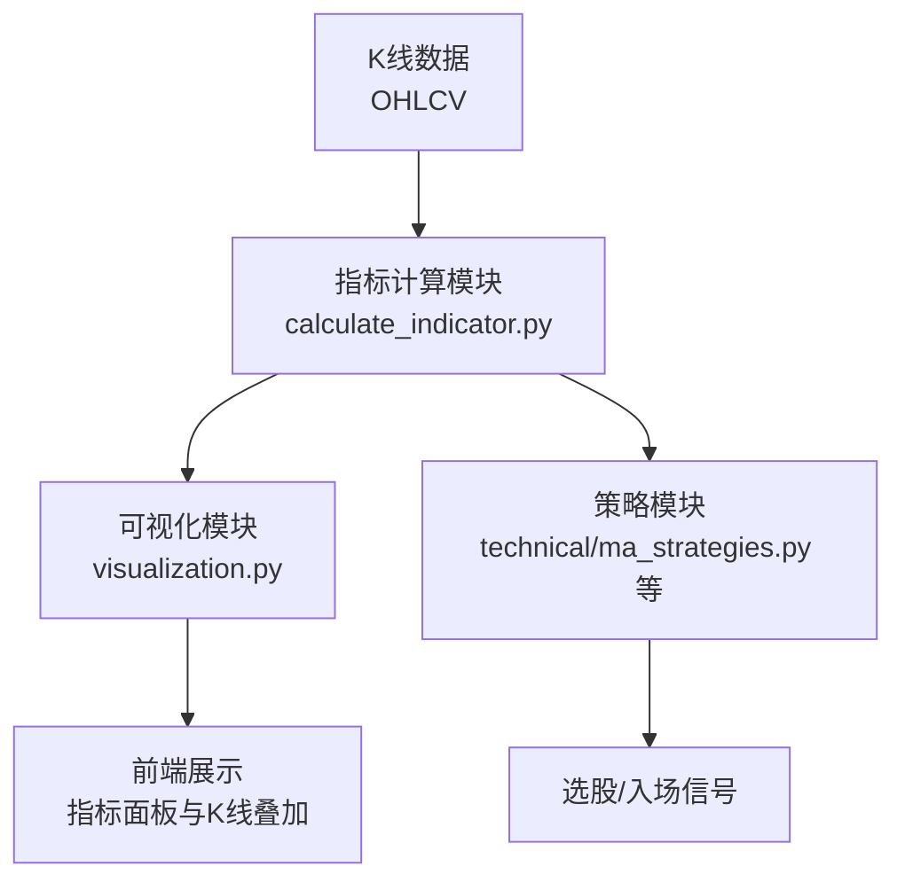

图表来源
- [calculate_indicator.py](file://quantia/core/indicator/calculate_indicator.py#L23-L408)
- [visualization.py](file://quantia/core/kline/visualization.py#L29-L275)
- [ma_strategies.py](file://quantia/core/strategy/technical/ma_strategies.py#L22-L237)

章节来源
- [calculate_indicator.py](file://quantia/core/indicator/calculate_indicator.py#L23-L408)
- [visualization.py](file://quantia/core/kline/visualization.py#L29-L275)
- [ma_strategies.py](file://quantia/core/strategy/technical/ma_strategies.py#L22-L237)

## 核心组件
- 指标计算引擎：集中于指标计算模块，使用ta-lib进行高效数值计算，并对NaN/Inf进行统一填充与清理。
- 策略基类与技术策略：提供MA/EMA/ATR等通用计算封装，以及基于趋势指标的选股策略。
- 可视化层：将指标与K线叠加展示，支持多指标面板切换与交互。
- 指标配置字典：定义各指标面板标题、描述与绘图字段集合，便于前端渲染。

章节来源
- [calculate_indicator.py](file://quantia/core/indicator/calculate_indicator.py#L12-L408)
- [base.py](file://quantia/core/strategy/base.py#L99-L124)
- [visualization.py](file://quantia/core/kline/visualization.py#L188-L215)
- [indicator_web_dic.py](file://quantia/core/kline/indicator_web_dic.py#L9-L199)

## 架构总览
趋势类指标在系统中的调用链路如下：

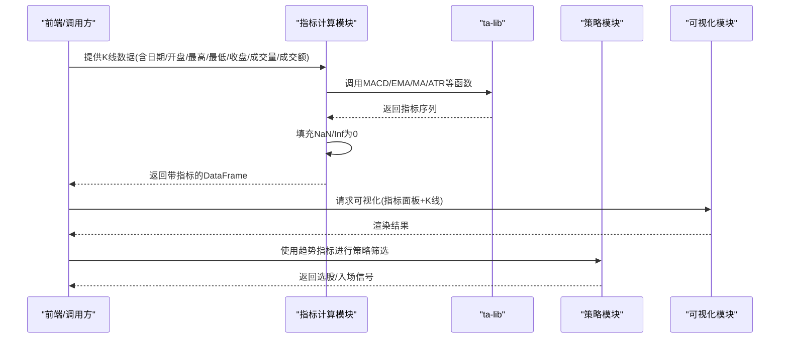

图表来源
- [calculate_indicator.py](file://quantia/core/indicator/calculate_indicator.py#L40-L407)
- [visualization.py](file://quantia/core/kline/visualization.py#L33-L41)
- [ma_strategies.py](file://quantia/core/strategy/technical/ma_strategies.py#L36-L55)

## 详细组件分析

### 移动平均线（MA）
- 计算方式：使用ta-lib的MA函数，支持不同周期。
- 参数设置：在指标计算中使用固定周期（如20、50、200），策略中也使用30周期。
- 信号与场景：均线多头、回踩年线等策略依赖MA序列判断趋势方向与支撑阻力。
- 数据预处理：对NaN进行填充为0。

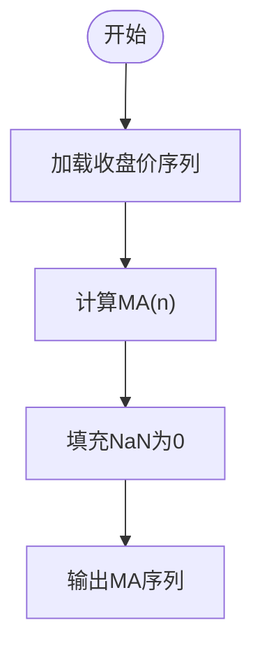

图表来源
- [calculate_indicator.py](file://quantia/core/indicator/calculate_indicator.py#L396-L400)
- [ma_strategies.py](file://quantia/core/strategy/technical/ma_strategies.py#L41-L42)

章节来源
- [calculate_indicator.py](file://quantia/core/indicator/calculate_indicator.py#L396-L400)
- [ma_strategies.py](file://quantia/core/strategy/technical/ma_strategies.py#L36-L55)

### 指数平滑移动平均（EMA）
- 计算方式：使用ta-lib的EMA函数，对序列进行指数加权平滑。
- 参数设置：策略基类提供通用计算封装，支持自定义周期。
- 信号与场景：作为MACD快线、DMI、WVWMA等指标的基础；也可单独用于短期趋势跟踪。
- 数据预处理：对NaN进行填充为0。

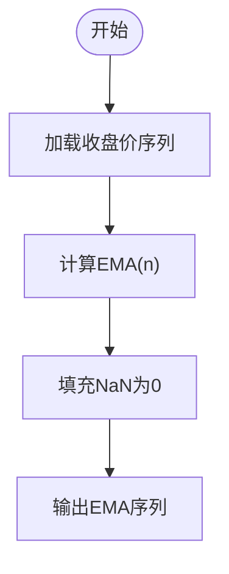

图表来源
- [base.py](file://quantia/core/strategy/base.py#L110-L115)
- [calculate_indicator.py](file://quantia/core/indicator/calculate_indicator.py#L141-L142)

章节来源
- [base.py](file://quantia/core/strategy/base.py#L103-L123)
- [calculate_indicator.py](file://quantia/core/indicator/calculate_indicator.py#L141-L142)

### MACD（平滑异同移动平均）
- 计算方式：使用ta-lib的MACD函数，返回macd、signal、histogram三列。
- 参数设置：快线周期=12，慢线周期=26，信号线周期=9。
- 信号与场景：金叉死叉、背离、零轴穿越常用于趋势转折与动能确认。
- 数据预处理：对NaN进行填充为0。

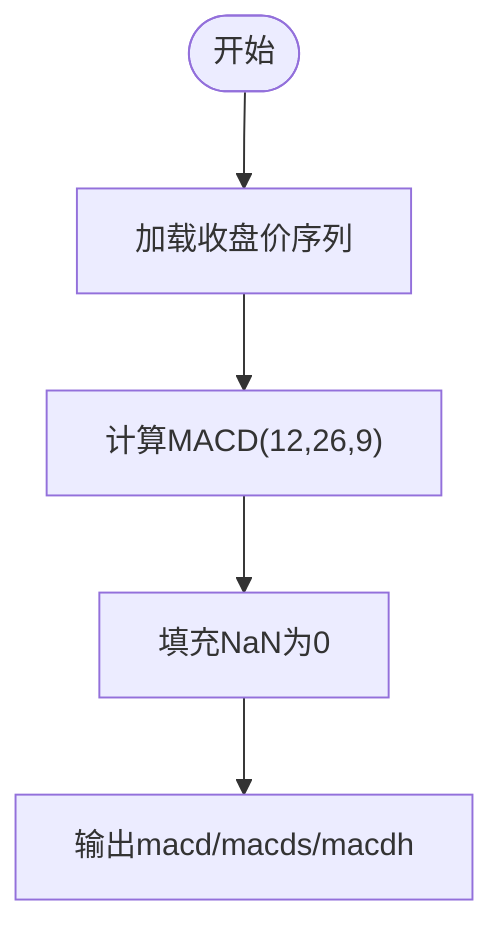

图表来源
- [calculate_indicator.py](file://quantia/core/indicator/calculate_indicator.py#L42-L47)

章节来源
- [calculate_indicator.py](file://quantia/core/indicator/calculate_indicator.py#L42-L47)

### TRIX（三重指数平滑移动平均）
- 计算方式：先对收盘价进行三次指数平滑，再计算其变化率。
- 参数设置：收盘价三次平滑周期=12，随后对TRIX序列做20日简单均线。
- 信号与场景：用于识别长期趋势的加速/减速与超买超卖区域。
- 数据预处理：对NaN进行填充为0。

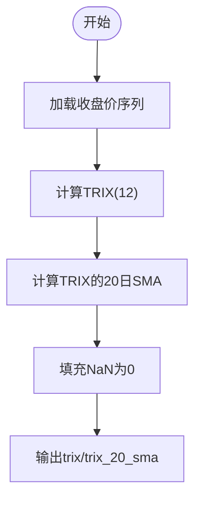

图表来源
- [calculate_indicator.py](file://quantia/core/indicator/calculate_indicator.py#L64-L68)

章节来源
- [calculate_indicator.py](file://quantia/core/indicator/calculate_indicator.py#L64-L68)

### DMA（平行线差）
- 计算方式：分别计算短期与长期MA（如10日与50日），两者的差值为DMA；再对DMA做SMA。
- 参数设置：短期MA=10，长期MA=50，信号线=10日SMA。
- 信号与场景：DMA上穿/下穿其信号线形成买卖信号；配合成交量可增强可信度。
- 数据预处理：对NaN进行填充为0。

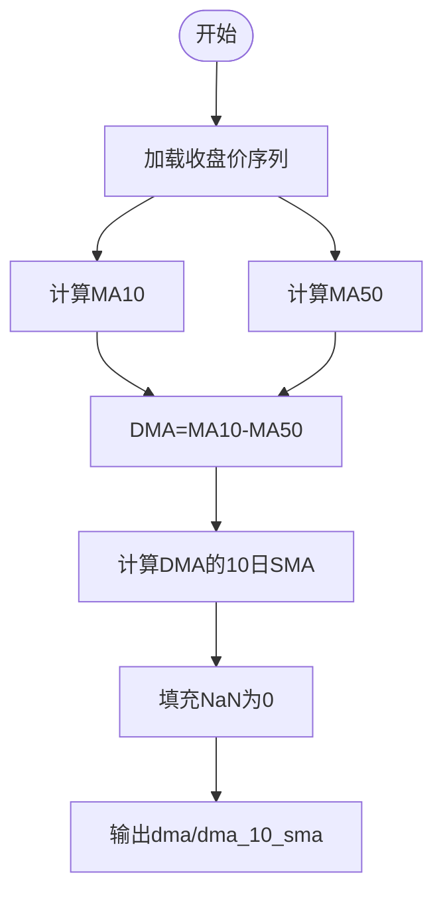

图表来源
- [calculate_indicator.py](file://quantia/core/indicator/calculate_indicator.py#L173-L180)

章节来源
- [calculate_indicator.py](file://quantia/core/indicator/calculate_indicator.py#L173-L180)

### VWMA（成交量加权平均）
- 计算方式：以amount为权重对收盘价进行加权平均；随后对VWMA做简单均线。
- 参数设置：VWMA周期=14，后续MA周期=6。
- 信号与场景：衡量真实市场参与度，常用于判断突破的有效性。
- 数据预处理：对NaN/Inf替换为0后再填充为0。

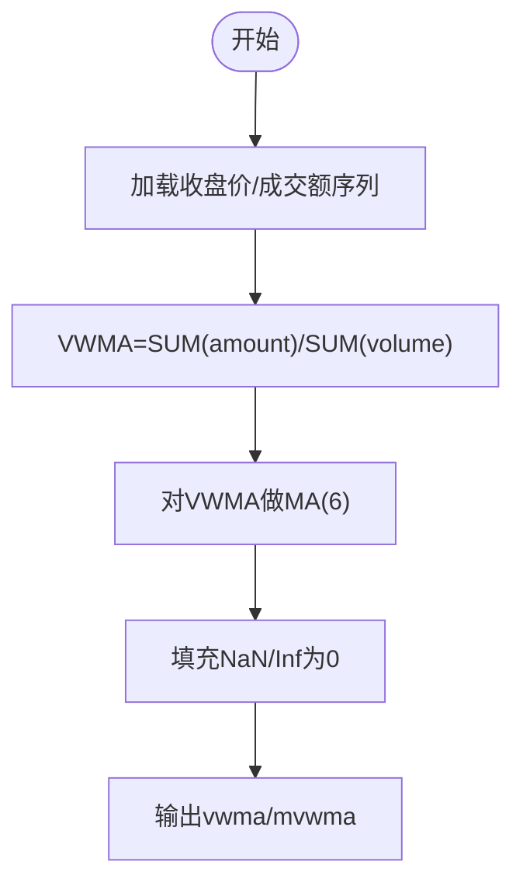

图表来源
- [calculate_indicator.py](file://quantia/core/indicator/calculate_indicator.py#L191-L196)

章节来源
- [calculate_indicator.py](file://quantia/core/indicator/calculate_indicator.py#L191-L196)

### PPO（价格震荡百分比指标）
- 计算方式：(快线EMA - 慢线EMA) / 价格 × 100；信号线为PPO的EMA。
- 参数设置：快线=12，慢线=26，信号线=9（EMA）。
- 信号与场景：零轴两侧的交叉与背离用于趋势强度判断。
- 数据预处理：对NaN进行填充为0。

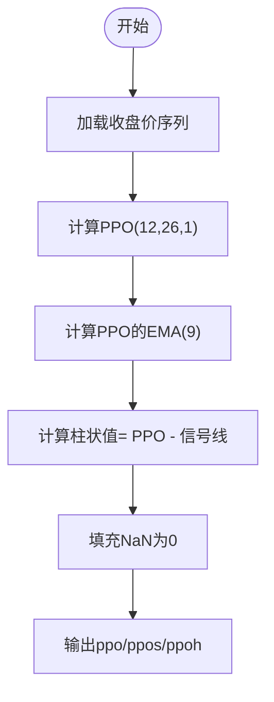

图表来源
- [calculate_indicator.py](file://quantia/core/indicator/calculate_indicator.py#L198-L204)

章节来源
- [calculate_indicator.py](file://quantia/core/indicator/calculate_indicator.py#L198-L204)

### Supertrend（超级趋势）
- 计算方式：基于ATR与价格构建上下轨，动态追踪趋势方向；包含上轨、下轨与趋势线。
- 参数设置：ATR倍数=3，上下轨=ATR×倍数±(高+低)/2；趋势切换遵循严格规则。
- 信号与场景：价格突破上轨/下轨触发反转；适合趋势跟踪与止损设置。
- 数据预处理：对NaN/Inf替换为0后再填充为0；循环计算上下轨与趋势。

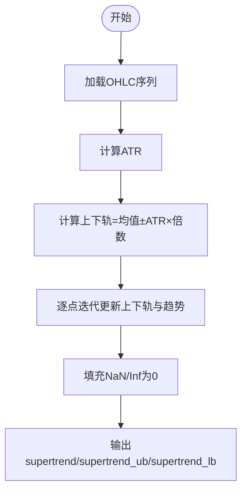

图表来源
- [calculate_indicator.py](file://quantia/core/indicator/calculate_indicator.py#L227-L281)

章节来源
- [calculate_indicator.py](file://quantia/core/indicator/calculate_indicator.py#L227-L281)

### DMI/ADX（动向指数/平均趋向指数）
- 计算方式：基于+DM/-DM与TR构造pdi、mdi、dx，再对dx求EMA得到adx与adxr。
- 参数设置：pdi/mdx周期=14，dx周期=6，adx/adxr周期=6。
- 信号与场景：adx衡量趋势强度，pdi/mdi对比判断多空力量；常与价格趋势结合使用。
- 数据预处理：对NaN/Inf替换为0后再填充为0。

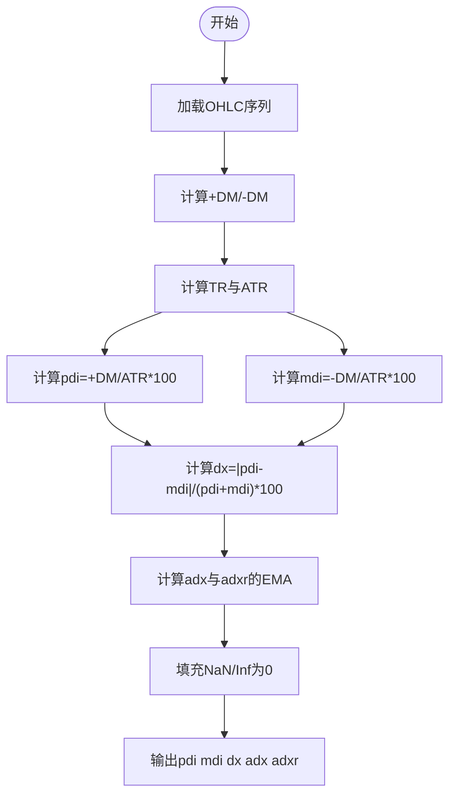

图表来源
- [calculate_indicator.py](file://quantia/core/indicator/calculate_indicator.py#L123-L157)

章节来源
- [calculate_indicator.py](file://quantia/core/indicator/calculate_indicator.py#L123-L157)

### 策略应用示例（趋势类）
- 均线多头策略：要求MA30连续上行且涨幅超过阈值。
- 回踩年线策略：突破250日均线后回踩不破，伴随缩量整理。
- 海龟交易法则：收盘价创近期新高，视为入场信号。

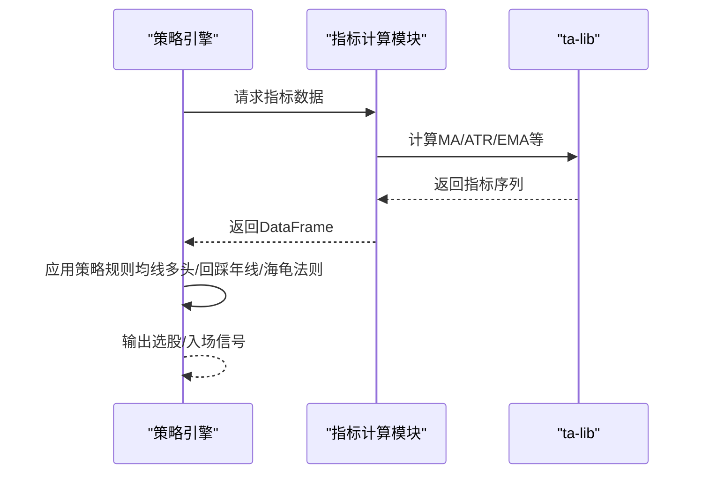

图表来源
- [ma_strategies.py](file://quantia/core/strategy/technical/ma_strategies.py#L36-L55)
- [backtrace_ma250.py](file://quantia/core/strategy/backtrace_ma250.py#L17-L91)
- [turtle_trade.py](file://quantia/core/strategy/turtle_trade.py#L14-L37)

章节来源
- [ma_strategies.py](file://quantia/core/strategy/technical/ma_strategies.py#L22-L237)
- [backtrace_ma250.py](file://quantia/core/strategy/backtrace_ma250.py#L12-L91)
- [turtle_trade.py](file://quantia/core/strategy/turtle_trade.py#L11-L37)

## 依赖关系分析
- 指标计算模块依赖ta-lib完成高效数值计算；对结果进行统一的NaN/Inf处理。
- 策略模块依赖指标计算模块提供的指标序列，并在策略内部进一步加工（如ATR比例、区间极值等）。
- 可视化模块依赖指标配置字典与指标计算模块，将指标与K线叠加展示。

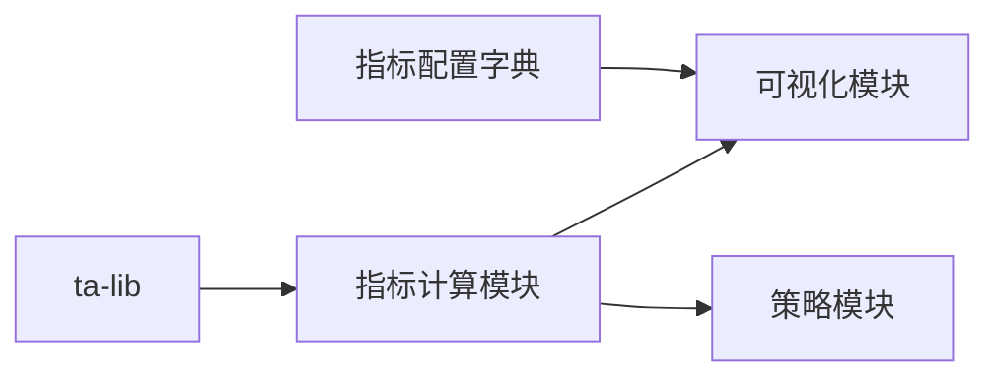

图表来源
- [calculate_indicator.py](file://quantia/core/indicator/calculate_indicator.py#L40-L407)
- [visualization.py](file://quantia/core/kline/visualization.py#L188-L215)
- [indicator_web_dic.py](file://quantia/core/kline/indicator_web_dic.py#L9-L199)

章节来源
- [calculate_indicator.py](file://quantia/core/indicator/calculate_indicator.py#L40-L407)
- [visualization.py](file://quantia/core/kline/visualization.py#L188-L215)
- [indicator_web_dic.py](file://quantia/core/kline/indicator_web_dic.py#L9-L199)

## 性能考量
- 向量化计算：指标计算模块大量使用numpy与ta-lib，避免显式循环，提升吞吐量。
- 内存与拷贝：在过滤与切片操作后进行深拷贝，避免pandas 2.x CoW模式下的只读错误。
- 异常值处理：统一的填充策略减少后续计算中的分支判断开销。
- 可视化优化：前端按需渲染指标面板，避免一次性绘制过多曲线导致卡顿。

## 故障排查指南
- NaN/Inf导致的异常：
  - 现象：部分指标出现NaN或无穷大。
  - 处理：使用统一的填充函数将NaN替换为0，Inf替换为NaN后再填充为0。
- 数据长度不足：
  - 现象：策略或指标计算因样本过少失败。
  - 处理：策略基类提供阈值检查与数据截断逻辑；指标计算模块在末尾截取所需长度。
- 只读错误（CoW模式）：
  - 现象：对切片后的DataFrame直接赋值报错。
  - 处理：在关键位置执行深拷贝，确保可写副本。

章节来源
- [calculate_indicator.py](file://quantia/core/indicator/calculate_indicator.py#L12-L34)
- [ma_strategies.py](file://quantia/core/strategy/technical/ma_strategies.py#L64-L89)

## 结论
Quantia项目通过标准化的指标计算流程与策略封装，实现了对趋势类指标的高效计算与稳定应用。MA、EMA、MACD、TRIX、DMA、VWMA、PPO、Supertrend等指标在本项目中均有明确的参数设定与信号规则，并辅以统一的异常值处理与可视化展示，便于用户进行趋势判断与多时间框架分析。建议在实际使用中结合成交量、波动率与动向指标进行综合确认，以提高信号质量。

## 附录
- 指标面板与描述：可视化模块通过指标配置字典统一管理各指标的展示标题与描述，便于前端渲染与用户理解。
- 多时间框架分析：可在不同周期（日线、周线、月线）上观察MA/Supertrend等趋势指标的一致性，以确认趋势强度与持续性。

章节来源
- [indicator_web_dic.py](file://quantia/core/kline/indicator_web_dic.py#L9-L199)
- [visualization.py](file://quantia/core/kline/visualization.py#L188-L215)
