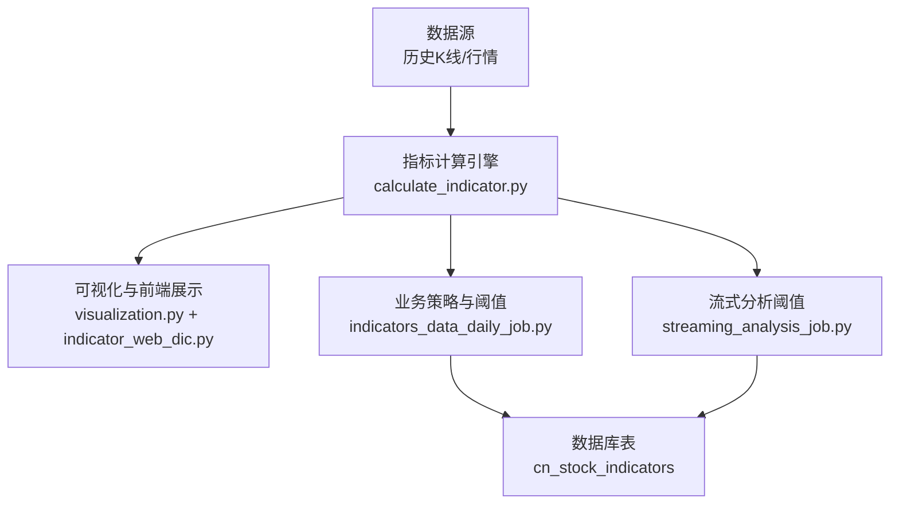
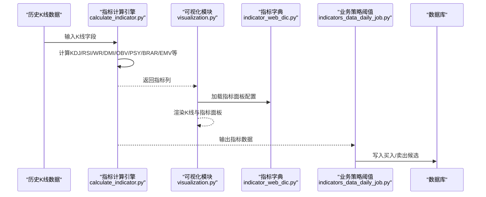
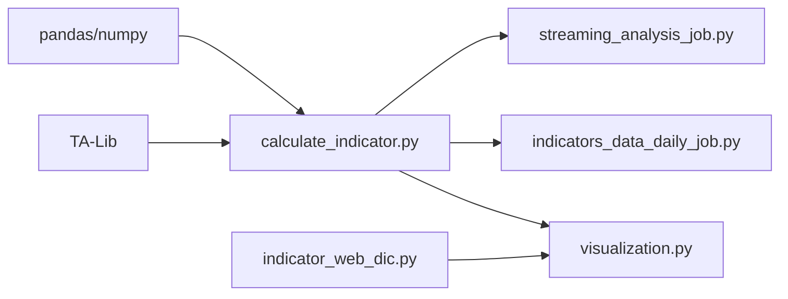

# 震荡类指标

<cite>
**本文引用的文件**
- [calculate_indicator.py](file://quantia/core/indicator/calculate_indicator.py)
- [indicator_web_dic.py](file://quantia/core/kline/indicator_web_dic.py)
- [visualization.py](file://quantia/core/kline/visualization.py)
- [README.md](file://README.md)
- [indicators_data_daily_job.py](file://quantia/job/indicators_data_daily_job.py)
- [streaming_analysis_job.py](file://quantia/job/streaming_analysis_job.py)
</cite>

## 目录
1. [简介](#简介)
2. [项目结构](#项目结构)
3. [核心组件](#核心组件)
4. [架构总览](#架构总览)
5. [详细组件分析](#详细组件分析)
6. [依赖分析](#依赖分析)
7. [性能考量](#性能考量)
8. [故障排查指南](#故障排查指南)
9. [结论](#结论)
10. [附录](#附录)

## 简介
本文件面向Quantia项目中的震荡类技术指标，聚焦于随机指标(KDJ)、RSI、威廉指标(WR)、动向指标(DMI)、能量潮指标(OBV)、心理线(PSY)、人气意愿指标(BRAR)、简易波动指标(EMV)等震荡摆动指标。内容涵盖：
- 指标的计算原理与实现方法
- 数学公式与阈值设置
- 超买超卖判断标准与背离识别
- 信号过滤机制与使用场景
- 在震荡市场中的交易策略、支撑阻力识别与买卖时机判断

## 项目结构
与震荡指标相关的核心模块位于以下路径：
- 指标计算：quantia/core/indicator/calculate_indicator.py
- 指标可视化与前端展示：quantia/core/kline/visualization.py、quantia/core/kline/indicator_web_dic.py
- 业务策略与阈值：quantia/job/indicators_data_daily_job.py、quantia/job/streaming_analysis_job.py
- 项目说明与阈值参考：README.md

图表来源
- [calculate_indicator.py](file://quantia/core/indicator/calculate_indicator.py#L23-L408)
- [visualization.py](file://quantia/core/kline/visualization.py#L29-L275)
- [indicator_web_dic.py](file://quantia/core/kline/indicator_web_dic.py#L9-L200)
- [indicators_data_daily_job.py](file://quantia/job/indicators_data_daily_job.py#L124-L155)
- [streaming_analysis_job.py](file://quantia/job/streaming_analysis_job.py#L455-L469)

章节来源
- [calculate_indicator.py](file://quantia/core/indicator/calculate_indicator.py#L23-L408)
- [visualization.py](file://quantia/core/kline/visualization.py#L29-L275)
- [indicator_web_dic.py](file://quantia/core/kline/indicator_web_dic.py#L9-L200)
- [README.md](file://README.md#L41-L81)

## 核心组件
- 指标计算引擎：基于TA-Lib与pandas/numpy，统一计算KDJ、RSI、WR、DMI、OBV、PSY、BRAR、EMV等指标，并提供填充NaN/Inf的稳健处理。
- 可视化与前端展示：将计算结果映射到前端图表，支持多指标面板与交互工具。
- 业务策略与阈值：通过SQL阈值筛选买入/卖出候选，作为交易信号的基础过滤器。
- 项目说明与阈值参考：提供超买超卖阈值与信号解释，便于策略制定与回测验证。

章节来源
- [calculate_indicator.py](file://quantia/core/indicator/calculate_indicator.py#L23-L408)
- [visualization.py](file://quantia/core/kline/visualization.py#L29-L275)
- [README.md](file://README.md#L57-L81)

## 架构总览
震荡类指标在系统中的流转如下：
- 输入：历史K线数据（包含开盘、最高、最低、收盘、成交量、成交额等）
- 处理：指标计算引擎按周期与算法生成各类震荡指标
- 展示：前端可视化模块加载指标字典，渲染K线与指标面板
- 应用：业务策略模块以阈值筛选生成买卖信号，写入数据库供回测与交易使用

图表来源
- [calculate_indicator.py](file://quantia/core/indicator/calculate_indicator.py#L23-L408)
- [visualization.py](file://quantia/core/kline/visualization.py#L29-L275)
- [indicator_web_dic.py](file://quantia/core/kline/indicator_web_dic.py#L9-L200)
- [indicators_data_daily_job.py](file://quantia/job/indicators_data_daily_job.py#L124-L155)

## 详细组件分析

### 随机指标 KDJ
- 计算原理
  - 使用TA-Lib的STOCH函数计算K、D两条线，随后派生J线：J = 3K − 2D
  - 参数：fastk_period、slowk_period、slowk_matype、slowd_period、slowd_matype
- 数学要点
  - KDJ属于动量震荡指标，通过比较收盘价与一定周期内的价格区间位置，衡量超买/超卖状态
- 阈值与判断
  - 超买区：K/D在高位（如K/D>80/70），可能出现回调
  - 超卖区：K/D在低位（如K/D<20/30），可能出现反弹
- 信号过滤
  - 结合K/D死叉/金叉、J线穿越等形态进行过滤
- 使用场景
  - 震荡区间内高抛低吸、波段交易

章节来源
- [calculate_indicator.py](file://quantia/core/indicator/calculate_indicator.py#L49-L55)
- [README.md](file://README.md#L63-L65)

### 相对强弱指数 RSI
- 计算原理
  - 基于TA-Lib的RSI函数，计算N日涨跌平均值的比值
  - 支持多周期：6、12、14、24日
- 数学要点
  - RSI = 100 − 100 / (1 + RS)，其中RS为平均涨幅/平均跌幅
- 阈值与判断
  - 超买：RSI>80（短期超买）
  - 超卖：RSI<20（短期超卖）
  - 严重超买/超卖：RSI>90或<10
- 信号过滤
  - 结合RSI多周期共振（如6日RSI上穿/下穿12/24日RSI）
- 使用场景
  - 快速判断短期动能与反转信号

章节来源
- [calculate_indicator.py](file://quantia/core/indicator/calculate_indicator.py#L88-L96)
- [README.md](file://README.md#L66-L68)

### 威廉指标 WR
- 计算原理
  - 使用TA-Lib的WILLR函数，计算N日最高价与收盘价的关系
  - 支持多周期：6、10、14日
- 数学要点
  - WR = −100 × (HHN − C) / (HHN − LLN)，其中HHN为N日最高，LLN为N日最低
- 阈值与判断
  - 超买：WR<-20（短期超买）
  - 超卖：WR>-80（短期超卖）
- 信号过滤
  - WR与KDJ/RSI背离时增强信号可信度
- 使用场景
  - 震荡区间内反转信号捕捉

章节来源
- [calculate_indicator.py](file://quantia/core/indicator/calculate_indicator.py#L159-L165)
- [README.md](file://README.md#L75-L77)

### 动向指标 DMI
- 计算原理
  - 使用+DI、-DI、ADX、ADXR等指标衡量趋势强度与方向
  - 实现采用自定义EMA与ATR计算，非直接调用TA-Lib的DX/ADX
- 数学要点
  - +DM/-DM：当日高/低与前一日的比较，构造正负动向
  - +DI、-DI：+DM与-DM经EMA平滑后除以ATR
  - DX = |+DI--DI|/(+DI+DI)×100
  - ADX、ADXR：DX的EMA与二次EMA
- 阈值与判断
  - ADX>20：趋势较强；ADX<20：震荡或弱趋势
  - +DI上穿-DI：多头信号；-DI上穿+DI：空头信号
- 信号过滤
  - ADX持续上行且+DI>-DI，增强多头信号
- 使用场景
  - 区分震荡与趋势，过滤假突破

章节来源
- [calculate_indicator.py](file://quantia/core/indicator/calculate_indicator.py#L123-L157)

### 能量潮指标 OBV
- 计算原理
  - 使用TA-Lib的OBV函数，以成交量累积衡量资金流向
- 数学要点
  - 若当日收盘>前一日收盘：OBV+=成交量
  - 若当日收盘<前一日收盘：OBV-=成交量
  - 若相等：OBV不变
- 阈值与判断
  - OBV上穿其均线：资金流入，偏多头
  - OBV下穿其均线：资金流出，偏空头
- 信号过滤
  - OBV与价格背离（顶背离/底背离）增强信号
- 使用场景
  - 判断成交量背后的资金意图，辅助震荡择时

章节来源
- [calculate_indicator.py](file://quantia/core/indicator/calculate_indicator.py#L291-L293)

### 心理线 PSY
- 计算原理
  - 近N日收盘上涨天数占比，反映市场情绪
  - 计算：PSY = 上涨天数/N × 100
- 数学要点
  - N通常取12日，PSY再取6日均线
- 阈值与判断
  - PSY>75：极度乐观，可能超买
  - PSY<25：极度悲观，可能超卖
- 信号过滤
  - PSY与价格背离，结合RSI/KDJ进行过滤
- 使用场景
  - 情绪型震荡策略，捕捉极端情绪反转

章节来源
- [calculate_indicator.py](file://quantia/core/indicator/calculate_indicator.py#L299-L306)

### 人气意愿指标 BRAR
- 计算原理
  - AR：反映多头意愿，计算近N日(高−开)/(开−低)的累加比值
  - BR：反映多方与空方力量对比，计算近N日(高−前收)/(前收−低)的累加比值
- 数学要点
  - AR、BR均乘以100，便于观察
- 阈值与判断
  - AR/BR>100：多头占优
  - AR/BR<100：空头占优
- 信号过滤
  - AR/BR与价格背离，结合WR/KDJ进行过滤
- 使用场景
  - 人气与意愿的综合观测，辅助震荡择时

章节来源
- [calculate_indicator.py](file://quantia/core/indicator/calculate_indicator.py#L308-L320)

### 简易波动指标 EMV
- 计算原理
  - 计算量能指标：(HL_avg − PHL_avg) × H_L / 成交额，再求N日累加
  - 其中HL_avg为当日(高+低)/2，PHL_avg为昨日(高+低)/2
- 数学要点
  - 支持EMV与EMVA（均线）双线
- 阈值与判断
  - EMV上穿/下穿零轴：资金流入/流出
  - EMV与价格背离：潜在反转信号
- 信号过滤
  - 与OBV、PSY等指标联动过滤
- 使用场景
  - 观察资金量能变化，辅助震荡择时

章节来源
- [calculate_indicator.py](file://quantia/core/indicator/calculate_indicator.py#L322-L330)

### 背离识别与信号过滤
- 背离类型
  - 顶背离：价格创新高，但RSI/KDJ/WR/PSY等指标不创新高
  - 底背离：价格创新低，但RSI/KDJ/WR/PSY等指标不创新低
- 过滤机制
  - 多周期共振：如6日RSI与12/24日RSI方向一致
  - 指标叠加：OBV、EMV、PSY等辅助确认
  - 趋势过滤：ADX>20时优先趋势策略，震荡区间用震荡策略

章节来源
- [calculate_indicator.py](file://quantia/core/indicator/calculate_indicator.py#L88-L96)
- [calculate_indicator.py](file://quantia/core/indicator/calculate_indicator.py#L159-L165)
- [calculate_indicator.py](file://quantia/core/indicator/calculate_indicator.py#L299-L306)
- [calculate_indicator.py](file://quantia/core/indicator/calculate_indicator.py#L322-L330)

### 震荡市场中的交易策略
- 买入策略
  - 超卖反弹：KDJ在超卖区（K/D<20/30）、RSI<20、WR<-80、PSY<25、BRAR/AR<100
  - 背离确认：价格底背离，RSI/KDJ/WR/PSY等指标底背离
  - 信号过滤：OBV上穿均线、EMV由负转正
- 卖出策略
  - 超买回调：KDJ在超买区（K/D>80/70）、RSI>80、WR>-20、PSY>75、BRAR/AR>100
  - 背离确认：价格顶背离，RSI/KDJ/WR/PSY等指标顶背离
  - 信号过滤：OBV下穿均线、EMV由正转负
- 支撑阻力识别
  - KDJ/RSI/WR在关键阈值附近反复测试
  - OBV/EMV在零轴附近形成支撑/阻力
  - BRAR/AR在100附近形成强弱分界

章节来源
- [README.md](file://README.md#L57-L81)
- [indicators_data_daily_job.py](file://quantia/job/indicators_data_daily_job.py#L124-L155)
- [streaming_analysis_job.py](file://quantia/job/streaming_analysis_job.py#L455-L469)

## 依赖分析
- 外部库依赖
  - TA-Lib：提供MACD、STOCH、WILLR、RSI、BBANDS、ATR、EMA、MA、ROC、PPO、SAR等高效实现
  - pandas/numpy：数据结构与数值计算
- 模块耦合
  - calculate_indicator.py为指标计算核心，被visualization.py与job模块间接依赖
  - indicator_web_dic.py提供指标面板配置，被visualization.py直接依赖
  - job模块通过阈值SQL筛选生成买卖候选，依赖数据库表schema

图表来源
- [calculate_indicator.py](file://quantia/core/indicator/calculate_indicator.py#L4-L7)
- [visualization.py](file://quantia/core/kline/visualization.py#L21-L23)
- [indicator_web_dic.py](file://quantia/core/kline/indicator_web_dic.py#L9-L200)
- [indicators_data_daily_job.py](file://quantia/job/indicators_data_daily_job.py#L124-L155)
- [streaming_analysis_job.py](file://quantia/job/streaming_analysis_job.py#L455-L469)

章节来源
- [calculate_indicator.py](file://quantia/core/indicator/calculate_indicator.py#L4-L7)
- [visualization.py](file://quantia/core/kline/visualization.py#L21-L23)
- [indicator_web_dic.py](file://quantia/core/kline/indicator_web_dic.py#L9-L200)
- [indicators_data_daily_job.py](file://quantia/job/indicators_data_daily_job.py#L124-L155)
- [streaming_analysis_job.py](file://quantia/job/streaming_analysis_job.py#L455-L469)

## 性能考量
- 计算效率
  - 使用TA-Lib与向量化pandas/numpy，减少循环开销
  - 对NaN/Inf进行预填充与替换，避免后续计算异常
- 内存与IO
  - 分批计算与阈值裁剪，控制数据规模
  - 可视化时按需加载指标面板，避免一次性渲染过多曲线
- 稳健性
  - 异常捕获与日志记录，保障长时间运行稳定性

章节来源
- [calculate_indicator.py](file://quantia/core/indicator/calculate_indicator.py#L13-L21)
- [calculate_indicator.py](file://quantia/core/indicator/calculate_indicator.py#L405-L407)

## 故障排查指南
- 常见问题
  - NaN/Inf导致的计算异常：使用填充函数统一处理
  - 数据为空或长度不足：在阈值筛选前增加长度校验
  - 指标列缺失：确认指标计算顺序与列名一致性
- 排查步骤
  - 检查输入数据字段完整性
  - 校验指标计算顺序与参数设置
  - 查看日志定位异常节点
- 建议
  - 在指标计算前后打印关键列的统计信息
  - 对异常值进行可视化检查

章节来源
- [calculate_indicator.py](file://quantia/core/indicator/calculate_indicator.py#L13-L21)
- [calculate_indicator.py](file://quantia/core/indicator/calculate_indicator.py#L405-L407)

## 结论
Quantia项目通过标准化的指标计算流程与可视化展示，为震荡类指标提供了高可用、可扩展的技术框架。KDJ、RSI、WR、DMI、OBV、PSY、BRAR、EMV等指标在系统中实现了统一计算、阈值过滤与信号联动，适用于震荡市场的高抛低吸策略。结合背离识别与多周期共振，可显著提升信号质量与胜率。

## 附录
- 指标面板配置参考：indicator_web_dic.py中各指标的标题、描述与展示列
- 阈值参考：README.md中给出的超买超卖阈值与信号解释
- 业务阈值：indicators_data_daily_job.py与streaming_analysis_job.py中的SQL阈值

章节来源
- [indicator_web_dic.py](file://quantia/core/kline/indicator_web_dic.py#L9-L200)
- [README.md](file://README.md#L57-L81)
- [indicators_data_daily_job.py](file://quantia/job/indicators_data_daily_job.py#L124-L155)
- [streaming_analysis_job.py](file://quantia/job/streaming_analysis_job.py#L455-L469)
