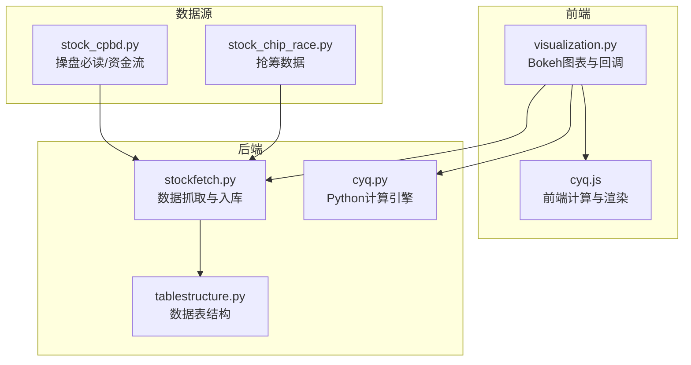
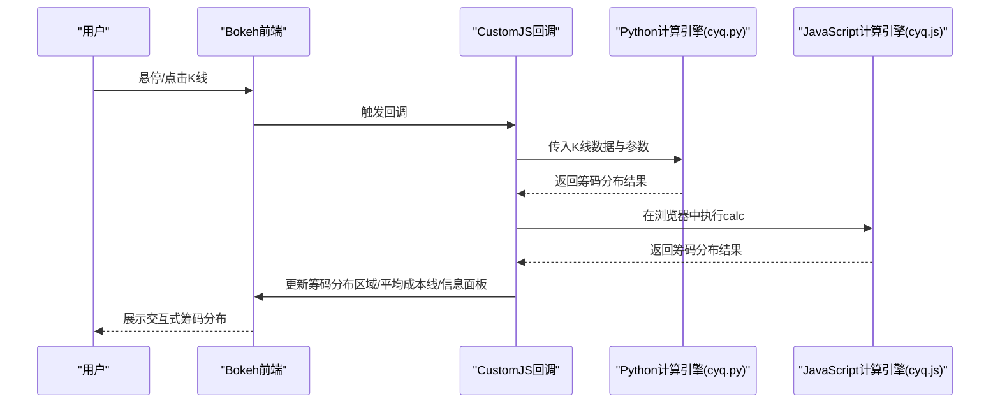
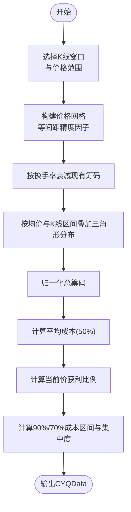
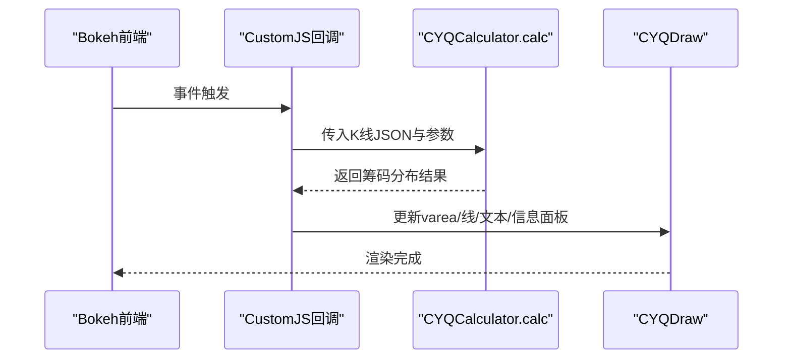
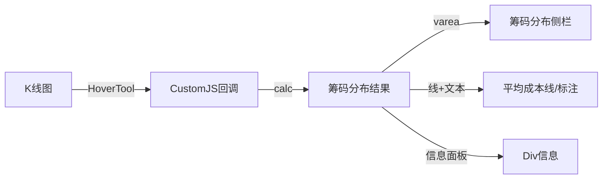
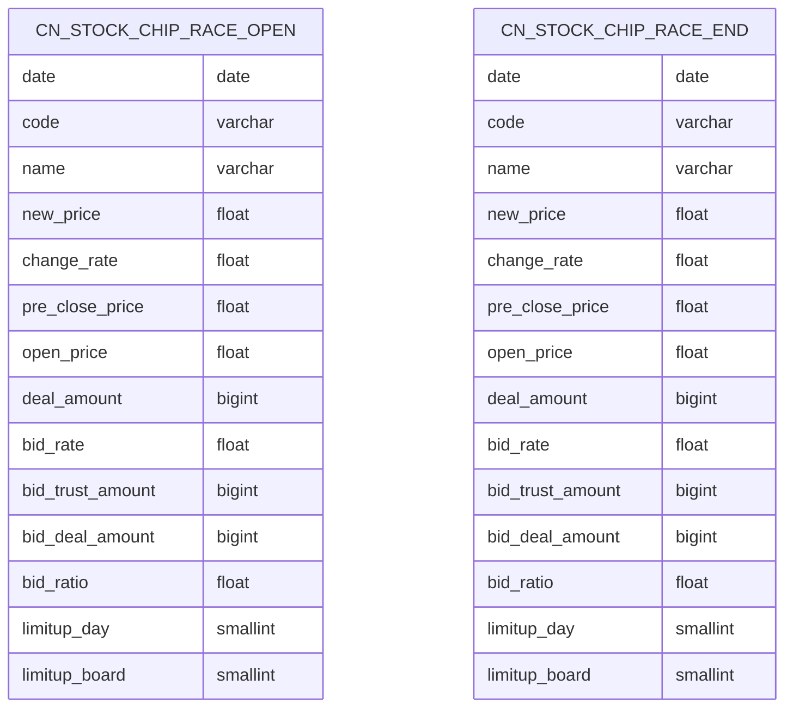
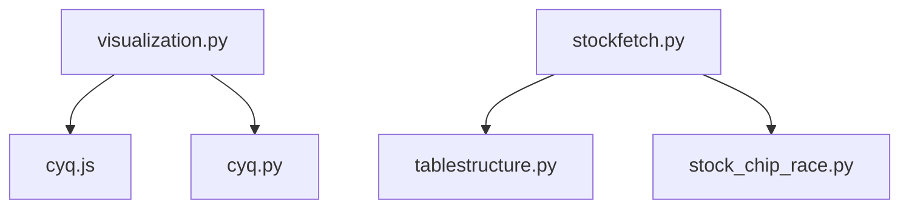

# 筹码分布计算

<cite>
**本文引用的文件**
- [cyq.py](file://docker/stock/quantia/core/kline/cyq.py)
- [cyq.js](file://docker/stock/quantia/core/kline/cyq.js)
- [visualization.py](file://docker/stock/quantia/core/kline/visualization.py)
- [stock_cpbd.py](file://docker/stock/quantia/core/crawling/stock_cpbd.py)
- [stock_chip_race.py](file://docker/stock/quantia/core/crawling/stock_chip_race.py)
- [tablestructure.py](file://docker/stock/quantia/core/tablestructure.py)
- [stockfetch.py](file://docker/stock/quantia/core/stockfetch.py)
- [indicator_web_dic.py](file://docker/stock/quantia/core/kline/indicator_web_dic.py)
</cite>

## 目录
1. [简介](#简介)
2. [项目结构](#项目结构)
3. [核心组件](#核心组件)
4. [架构总览](#架构总览)
5. [详细组件分析](#详细组件分析)
6. [依赖关系分析](#依赖关系分析)
7. [性能考量](#性能考量)
8. [故障排查指南](#故障排查指南)
9. [结论](#结论)
10. [附录](#附录)

## 简介
本文件面向Quantia系统中的筹码分布(Position Cost Distribution)计算模块，系统性阐述其理论基础、计算原理、实现算法与可视化集成方式，并给出实战应用建议（如获利盘/套牢盘解读、成本均线、支撑阻力位识别）。该模块以K线数据为基础，结合换手率与价格区间的三角形叠加模型，计算出不同价格区间的筹码密度、平均成本、获利比例及关键成本带（如90%、70%成本区间），并以Bokeh前端进行动态渲染与交互。

## 项目结构
筹码分布模块主要由以下部分组成：
- 计算引擎：Python与JavaScript双版本实现，分别位于cyq.py与cyq.js，提供相同的算法逻辑。
- 可视化集成：visualization.py负责在Bokeh图表中嵌入筹码分布区域、平均成本线与信息面板，并通过CustomJS回调触发计算。
- 数据采集与存储：stock_cpbd.py与stock_chip_race.py提供外部数据接口；tablestructure.py定义数据表结构；stockfetch.py负责抓取与入库。
- 指标与页面：indicator_web_dic.py提供指标页签配置，visualization.py将其与筹码分布组合展示。

**图表来源**
- [visualization.py](file://docker/stock/quantia/core/kline/visualization.py#L29-L110)
- [cyq.js](file://docker/stock/quantia/core/kline/cyq.js#L9-L365)
- [cyq.py](file://docker/stock/quantia/core/kline/cyq.py#L13-L165)
- [stockfetch.py](file://docker/stock/quantia/core/stockfetch.py#L669-L706)
- [tablestructure.py](file://docker/stock/quantia/core/tablestructure.py#L1045-L1090)
- [stock_cpbd.py](file://docker/stock/quantia/core/crawling/stock_cpbd.py#L14-L140)
- [stock_chip_race.py](file://docker/stock/quantia/core/crawling/stock_chip_race.py#L17-L176)

**章节来源**
- [visualization.py](file://docker/stock/quantia/core/kline/visualization.py#L29-L110)
- [cyq.py](file://docker/stock/quantia/core/kline/cyq.py#L13-L165)
- [cyq.js](file://docker/stock/quantia/core/kline/cyq.js#L9-L365)
- [stockfetch.py](file://docker/stock/quantia/core/stockfetch.py#L669-L706)
- [tablestructure.py](file://docker/stock/quantia/core/tablestructure.py#L1045-L1090)
- [stock_cpbd.py](file://docker/stock/quantia/core/crawling/stock_cpbd.py#L14-L140)
- [stock_chip_race.py](file://docker/stock/quantia/core/crawling/stock_chip_race.py#L17-L176)

## 核心组件
- 计算引擎（Python）：CYQCalculator类封装K线窗口选择、价格网格构建、筹码衰减与叠加、总筹码归一化、平均成本与获利比例计算、百分位成本区间计算。
- 计算引擎（JavaScript）：与Python版本等价的CYQCalculator与CYQData对象，以及CYQDraw回调，负责前端交互式计算与渲染。
- 可视化集成：visualization.py创建K线图、筹码分布侧栏、平均成本线与信息面板，通过CustomJS注入K线数据并触发计算。
- 数据层：tablestructure.py定义“早盘抢筹”“尾盘抢筹”等表结构；stockfetch.py负责从stock_chip_race.py抓取数据并写入对应表。

**章节来源**
- [cyq.py](file://docker/stock/quantia/core/kline/cyq.py#L13-L165)
- [cyq.js](file://docker/stock/quantia/core/kline/cyq.js#L9-L365)
- [visualization.py](file://docker/stock/quantia/core/kline/visualization.py#L29-L110)
- [tablestructure.py](file://docker/stock/quantia/core/tablestructure.py#L1045-L1090)
- [stockfetch.py](file://docker/stock/quantia/core/stockfetch.py#L669-L706)

## 架构总览
筹码分布的端到端流程如下：
- 后端加载K线数据与指标，准备筹码计算所需的数据集。
- 前端Bokeh初始化，注册HoverTool与CustomJS回调。
- 用户悬停或点击K线，回调触发CYQCalculator.calc/index计算，返回筹码分布结果。
- 前端根据结果绘制上下两段筹码分布区域、平均成本线与信息面板。

**图表来源**
- [visualization.py](file://docker/stock/quantia/core/kline/visualization.py#L92-L106)
- [cyq.js](file://docker/stock/quantia/core/kline/cyq.js#L228-L365)
- [cyq.py](file://docker/stock/quantia/core/kline/cyq.py#L27-L165)

## 详细组件分析

### Python计算引擎（CYQCalculator）
- 输入：K线数据（日期、开盘、收盘、最高、最低、成交量、成交额、振幅、换手率）、精度因子、计算范围、交易天数。
- 核心步骤：
  - 选择时间窗口与价格范围，构建等间距价格网格。
  - 对每根K线按均价与换手率对网格进行衰减与叠加（一字板特殊处理）。
  - 归一化得到总筹码，计算平均成本（50%分位成本）、当前价获利比例、90%/70%成本区间与集中度。
- 输出：CYQData对象，包含筹码堆叠数组、价格网格、平均成本、获利比例、成本区间与集中度、边界下标、交易日期与天数。

**图表来源**
- [cyq.py](file://docker/stock/quantia/core/kline/cyq.py#L27-L165)

**章节来源**
- [cyq.py](file://docker/stock/quantia/core/kline/cyq.py#L13-L165)

### JavaScript计算引擎（CYQCalculator/CYQData/CYQDraw）
- 功能等价于Python版本，但运行在浏览器端，通过CustomJS回调接收后端序列化的K线数据。
- CYQDraw根据鼠标位置或事件索引调用calc，拆分上下两段筹码分布，绘制平均成本线与文本标注，并生成信息面板HTML。

**图表来源**
- [cyq.js](file://docker/stock/quantia/core/kline/cyq.js#L32-L223)
- [cyq.js](file://docker/stock/quantia/core/kline/cyq.js#L228-L365)

**章节来源**
- [cyq.js](file://docker/stock/quantia/core/kline/cyq.js#L9-L365)

### 可视化集成（Bokeh）
- 创建K线图与筹码分布侧栏，注册HoverTool与CustomJS回调。
- 使用varea绘制上下两段筹码分布，用线与文本标注平均成本。
- 通过Div组件展示获利比例、平均成本、成本区间与集中度等信息。

**图表来源**
- [visualization.py](file://docker/stock/quantia/core/kline/visualization.py#L92-L106)
- [visualization.py](file://docker/stock/quantia/core/kline/visualization.py#L228-L352)

**章节来源**
- [visualization.py](file://docker/stock/quantia/core/kline/visualization.py#L29-L110)
- [visualization.py](file://docker/stock/quantia/core/kline/visualization.py#L228-L352)

### 数据采集与存储
- 抢筹数据：stock_chip_race.py提供早盘/尾盘抢筹接口，stockfetch.py负责抓取并写入“早盘抢筹”“尾盘抢筹”表。
- 操盘必读/资金流：stock_cpbd.py提供接口，后续可用于补充筹码分布相关财务/资金面指标。
- 表结构：tablestructure.py定义上述表的列名与类型。

**图表来源**
- [tablestructure.py](file://docker/stock/quantia/core/tablestructure.py#L1045-L1076)

**章节来源**
- [stock_chip_race.py](file://docker/stock/quantia/core/crawling/stock_chip_race.py#L17-L176)
- [stockfetch.py](file://docker/stock/quantia/core/stockfetch.py#L669-L706)
- [tablestructure.py](file://docker/stock/quantia/core/tablestructure.py#L1045-L1076)

## 依赖关系分析
- 可视化依赖计算引擎：visualization.py通过CustomJS回调依赖cyq.js；同时保留Python路径作为后备。
- 计算引擎独立：cyq.py与cyq.js互为镜像实现，耦合度低，便于前后端切换。
- 数据依赖：stockfetch.py依赖stock_chip_race.py与tablestructure.py，形成数据采集—存储—可视化的闭环。

**图表来源**
- [visualization.py](file://docker/stock/quantia/core/kline/visualization.py#L92-L106)
- [cyq.js](file://docker/stock/quantia/core/kline/cyq.js#L228-L365)
- [cyq.py](file://docker/stock/quantia/core/kline/cyq.py#L27-L165)
- [stockfetch.py](file://docker/stock/quantia/core/stockfetch.py#L669-L706)
- [tablestructure.py](file://docker/stock/quantia/core/tablestructure.py#L1045-L1076)
- [stock_chip_race.py](file://docker/stock/quantia/core/crawling/stock_chip_race.py#L17-L176)

**章节来源**
- [visualization.py](file://docker/stock/quantia/core/kline/visualization.py#L92-L106)
- [cyq.js](file://docker/stock/quantia/core/kline/cyq.js#L228-L365)
- [cyq.py](file://docker/stock/quantia/core/kline/cyq.py#L27-L165)
- [stockfetch.py](file://docker/stock/quantia/core/stockfetch.py#L669-L706)
- [tablestructure.py](file://docker/stock/quantia/core/tablestructure.py#L1045-L1076)
- [stock_chip_race.py](file://docker/stock/quantia/core/crawling/stock_chip_race.py#L17-L176)

## 性能考量
- 精度因子控制：精度因子越大，价格网格越细，计算复杂度越高。默认150，可根据K线长度与交互需求调整。
- 时间窗口限制：交易天数与计算范围限制了每帧计算的数据量，避免长周期导致的性能瓶颈。
- 浏览器端计算：将计算迁移至前端可降低后端压力，但需注意大数据量下的渲染性能，必要时可采用采样或阈值过滤。
- 数据预处理：在后端提前计算常用指标（如均线、成交量等）可减少前端计算负担。

[本节为通用指导，无需列出具体文件来源]

## 故障排查指南
- 请求失败与代理问题：stock_chip_race.py使用代理池，若请求失败会记录日志并返回空DataFrame。检查代理可用性与网络连通性。
- 数据为空：stock_cpbd.py与stock_chip_race.py在无数据时返回None或空DataFrame，需在调用处判空并提示。
- 计算异常：cyq.py/cyq.js在输入参数非法（如百分位不在[0,1]）时抛出异常，应在前端/后端统一捕获并提示。
- 可视化渲染：visualization.py通过CustomJS注入数据，若K线数据格式不符或回调未触发，检查数据序列化与回调绑定。

**章节来源**
- [stock_chip_race.py](file://docker/stock/quantia/core/crawling/stock_chip_race.py#L40-L46)
- [stock_cpbd.py](file://docker/stock/quantia/core/crawling/stock_cpbd.py#L33-L34)
- [cyq.py](file://docker/stock/quantia/core/kline/cyq.py#L130-L132)
- [cyq.js](file://docker/stock/quantia/core/kline/cyq.js#L198-L200)
- [visualization.py](file://docker/stock/quantia/core/kline/visualization.py#L92-L106)

## 结论
筹码分布模块通过前后端协同，实现了基于K线与换手率的筹码密度计算与可视化展示。Python与JavaScript双引擎保证了灵活性与性能，Bokeh前端提供了良好的交互体验。结合“早盘/尾盘抢筹”等外部数据，可进一步丰富筹码分布的解读维度，辅助支撑/阻力位识别与买卖点判断。

[本节为总结性内容，无需列出具体文件来源]

## 附录

### 实战应用要点
- 获利盘/套牢盘：当前价上方为获利盘，下方为套牢盘；获利比例越高，上方抛压越大；反之亦然。
- 成本均线：平均成本线可作为短期支撑/阻力参考，价格靠近成本线时易形成支撑/阻力。
- 成本带集中度：90%/70%成本区间集中度高，意味着多数筹码集中在窄幅区间，可能引发突破或回踩。
- 支撑/阻力位：筹码密集区常成为关键支撑/阻力；结合成交量与K线形态可提高判断准确率。
- 动态更新：悬停/点击即可刷新，观察筹码随价格波动的堆积与转移，把握市场情绪变化。

[本节为实践建议，无需列出具体文件来源]
