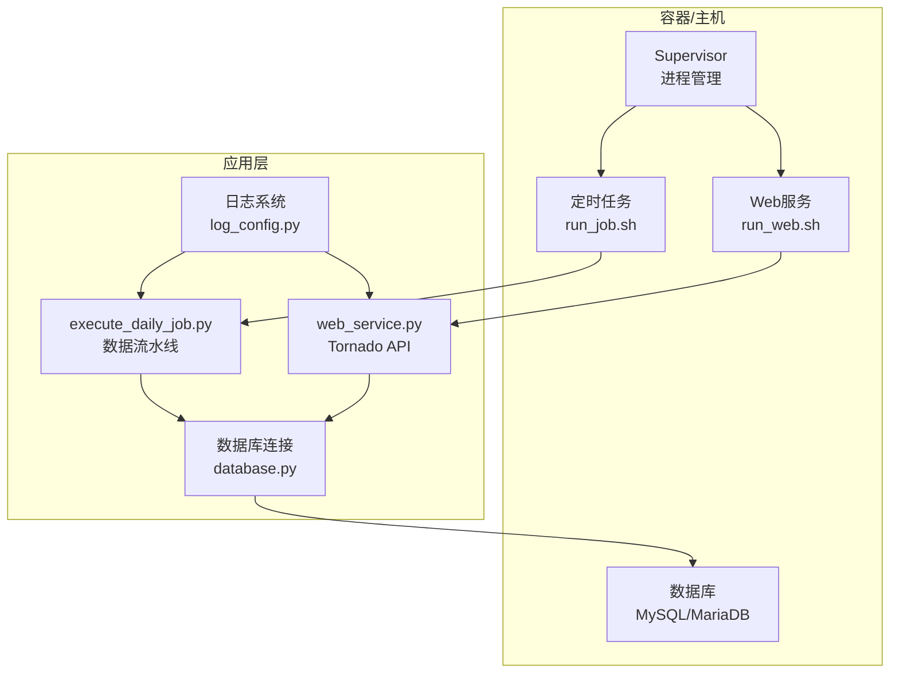
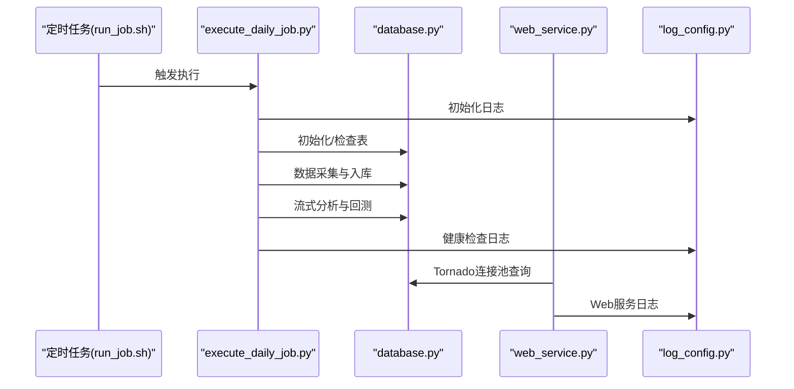
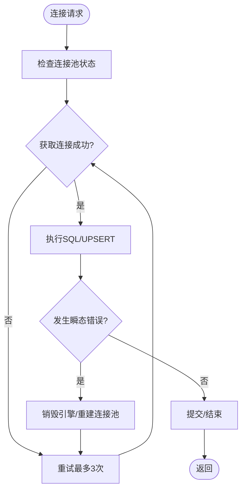
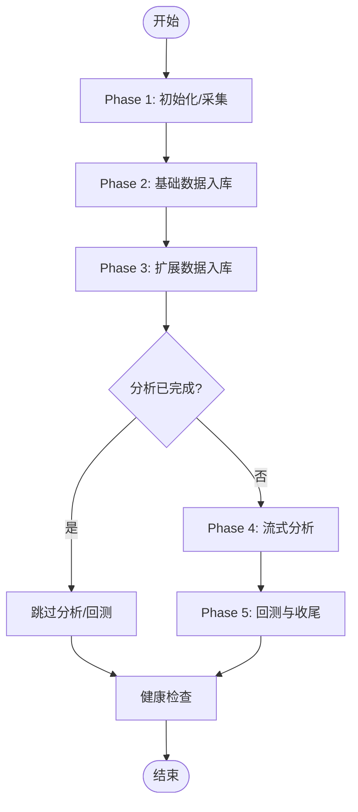
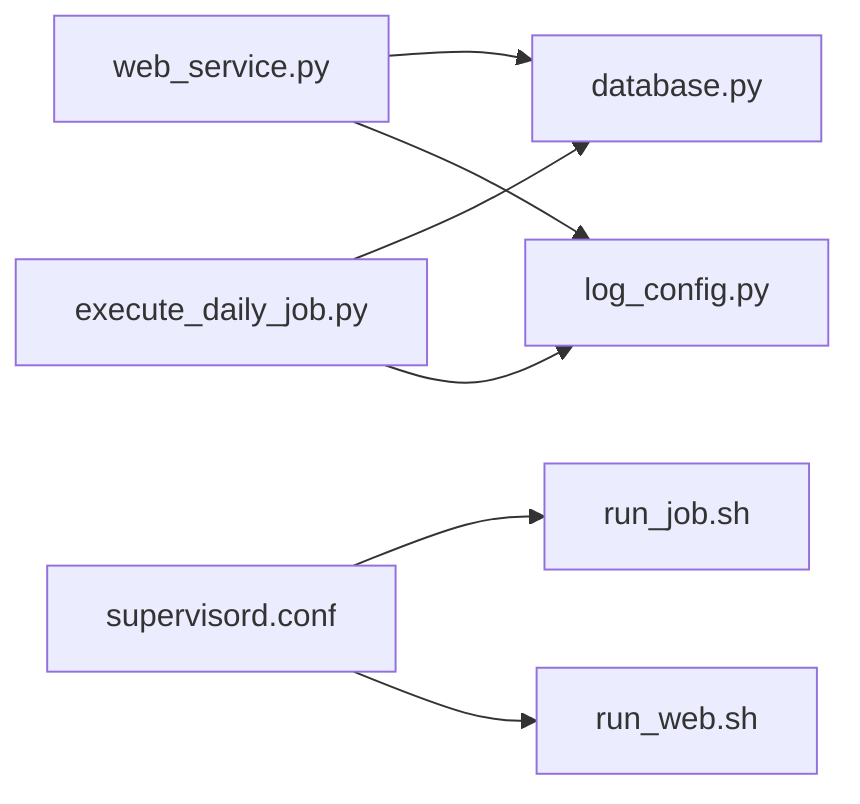

# 常见问题诊断

<cite>
**本文引用的文件**
- [README.md](file://README.md)
- [QUICKSTART.md](file://QUICKSTART.md)
- [supervisord.conf](file://supervisor\supervisord.conf)
- [database.py](file://quantia\lib\database.py)
- [log_config.py](file://quantia\lib\log_config.py)
- [execute_daily_job.py](file://quantia\job\execute_daily_job.py)
- [web_service.py](file://quantia\web\web_service.py)
- [run_web.sh](file://docker\stock\quantia\bin\run_web.sh)
- [run_job.sh](file://docker\stock\quantia\bin\run_job.sh)
- [init_database.sql](file://docker\init_database.sql)
- [build.sh](file://docker\build.sh)
- [stock_error.log](file://quantia\log\stock_error.log)
</cite>

## 目录
1. [简介](#简介)
2. [项目结构](#项目结构)
3. [核心组件](#核心组件)
4. [架构总览](#架构总览)
5. [详细组件分析](#详细组件分析)
6. [依赖关系分析](#依赖关系分析)
7. [性能考虑](#性能考虑)
8. [故障排除指南](#故障排除指南)
9. [结论](#结论)
10. [附录](#附录)

## 简介
本指南面向Quantia（Quantia）系统的运维与使用者，聚焦于系统启动失败、服务异常、数据同步中断等常见问题的诊断与解决。内容涵盖：
- 通过日志定位问题根因（Web服务、数据库连接、定时任务）
- SSH远程连接检查、数据库状态查询、服务进程监控等实用工具
- 具体错误代码解释、症状描述与解决步骤
- 结合项目提供的脚本与配置，给出可操作的排障流程

## 项目结构
Quantia采用前后端分离与批处理/流式分析相结合的架构：
- Web前端（Vue）通过Tornado后端提供REST API
- 数据采集与分析通过Python批处理脚本执行，支持增量更新与流式处理
- 数据持久化使用MySQL/MariaDB，初始化脚本自动创建所需表
- Docker部署与Supervisor进程管理，支持定时任务与Web服务协同

图表来源
- [supervisord.conf](file://supervisor\supervisord.conf#L25-L42)
- [run_job.sh](file://docker\stock\quantia\bin\run_job.sh#L1-L16)
- [run_web.sh](file://docker\stock\quantia\bin\run_web.sh#L1-L19)
- [execute_daily_job.py](file://quantia\job\execute_daily_job.py#L80-L179)
- [web_service.py](file://quantia\web\web_service.py#L53-L99)
- [log_config.py](file://quantia\lib\log_config.py#L47-L104)
- [database.py](file://quantia\lib\database.py#L60-L71)

章节来源
- [README.md](file://README.md#L321-L326)
- [QUICKSTART.md](file://QUICKSTART.md#L157-L167)

## 核心组件
- 数据库连接与事务控制：提供连接池、重试、UPSERT、主键/索引维护等能力
- 日志系统：统一输出到文件与控制台，错误日志集中收集
- 执行流水线：分阶段执行数据采集、入库、分析、回测与健康检查
- Web服务：基于Tornado的API服务，提供SPA路由与静态资源
- 进程管理：Supervisor管理run_job、run_web、run_cron

章节来源
- [database.py](file://quantia\lib\database.py#L60-L71)
- [log_config.py](file://quantia\lib\log_config.py#L47-L104)
- [execute_daily_job.py](file://quantia\job\execute_daily_job.py#L80-L179)
- [web_service.py](file://quantia\web\web_service.py#L53-L99)
- [supervisord.conf](file://supervisor\supervisord.conf#L25-L42)

## 架构总览
系统运行时序（数据采集→入库→分析→回测）与Web服务交互如下：

图表来源
- [run_job.sh](file://docker\stock\quantia\bin\run_job.sh#L15-L16)
- [execute_daily_job.py](file://quantia\job\execute_daily_job.py#L80-L179)
- [database.py](file://quantia\lib\database.py#L60-L71)
- [web_service.py](file://quantia\web\web_service.py#L99-L138)
- [log_config.py](file://quantia\lib\log_config.py#L47-L104)

## 详细组件分析

### 数据库连接与事务（database.py）
- 连接池参数：小规模连接池（2核2G服务器优化：pool_size=2, max_overflow=3），启用pre_ping与超时控制
- UPSERT策略：基于主键冲突的ON DUPLICATE KEY UPDATE，避免重复插入与死锁
- 重试机制：针对死锁、锁超时、连接丢失等瞬态错误进行有限重试
- 主键/索引维护：首次入库自动检测并创建主键与索引
- 环境变量覆盖：支持通过Docker环境变量动态配置数据库连接

图表来源
- [database.py](file://quantia\lib\database.py#L60-L71)
- [database.py](file://quantia\lib\database.py#L94-L107)
- [database.py](file://quantia\lib\database.py#L109-L117)
- [database.py](file://quantia\lib\database.py#L125-L185)

章节来源
- [database.py](file://quantia\lib\database.py#L17-L45)
- [database.py](file://quantia\lib\database.py#L60-L71)
- [database.py](file://quantia\lib\database.py#L94-L107)
- [database.py](file://quantia\lib\database.py#L109-L117)
- [database.py](file://quantia\lib\database.py#L125-L185)

### 日志系统（log_config.py）
- 输出目标：统一输出到stock_{name}.log（INFO+）、stock_error.log（ERROR+，含堆栈）、控制台（WARNING+）
- 文件轮转：单文件最大10MB，保留5份备份
- 初始化保护：进程内仅初始化一次，避免重复配置

章节来源
- [log_config.py](file://quantia\lib\log_config.py#L47-L104)

### 数据执行流水线（execute_daily_job.py）
- 阶段划分：采集→基础数据入库→扩展数据入库→策略/GPT→流式分析→回测→收尾
- 健康检查：任务结束后对核心表进行当日数据量与最新日期检查
- 跳过策略：当分析数据已足够时跳过分析与回测阶段，可通过环境变量强制执行

图表来源
- [execute_daily_job.py](file://quantia\job\execute_daily_job.py#L80-L179)
- [execute_daily_job.py](file://quantia\job\execute_daily_job.py#L182-L226)

章节来源
- [execute_daily_job.py](file://quantia\job\execute_daily_job.py#L80-L179)
- [execute_daily_job.py](file://quantia\job\execute_daily_job.py#L182-L226)

### Web服务（web_service.py）
- 路由：API路由（/quantia/api_*）与SPA回退路由（/assets/* 与 /(.*)）
- 连接池：使用torndb连接池配置，与数据库模块共享连接参数
- 启动：监听9988端口，启动IOLoop

章节来源
- [web_service.py](file://quantia\web\web_service.py#L53-L99)
- [web_service.py](file://quantia\web\web_service.py#L127-L138)

### 进程管理（supervisord.conf）
- run_job：一次性任务（autorestart=false），优先级100
- run_web：常驻服务（autorestart=true），优先级500
- run_cron：常驻服务（autorestart=true），优先级900

章节来源
- [supervisord.conf](file://supervisor\supervisord.conf#L25-L42)

## 依赖关系分析
- Web服务依赖数据库连接池与日志系统
- 数据执行流水线依赖数据库连接池、日志系统与交易日历模块
- Supervisor管理脚本与容器内路径绑定，确保run_job.sh与run_web.sh正确执行

图表来源
- [web_service.py](file://quantia\web\web_service.py#L99-L138)
- [execute_daily_job.py](file://quantia\job\execute_daily_job.py#L80-L179)
- [log_config.py](file://quantia\lib\log_config.py#L47-L104)
- [supervisord.conf](file://supervisor\supervisord.conf#L25-L42)
- [run_job.sh](file://docker\stock\quantia\bin\run_job.sh#L15-L16)
- [run_web.sh](file://docker\stock\quantia\bin\run_web.sh#L15-L19)

## 性能考虑
- 连接池规模：小规模连接池适合轻量部署，避免过度竞争
- 流式分析：磁盘按需读取，峰值内存远低于全量加载方案
- 增量更新：历史数据缓存与增量更新减少API调用与IO压力

章节来源
- [database.py](file://quantia\lib\database.py#L56-L71)
- [execute_daily_job.py](file://quantia\job\execute_daily_job.py#L86-L91)

## 故障排除指南

### 一、系统启动失败

#### 1. Web服务启动失败
- 症状
  - 浏览器无法访问 http://localhost:9988/
  - 控制台无启动日志或报端口占用
- 诊断步骤
  - 检查Supervisor进程状态与日志
  - 确认run_web.sh是否正确设置PYTHONPATH并执行web_service.py
  - 查看stock_web.log与stock_error.log中的启动异常
- 解决步骤
  - 重启Web服务：通过Supervisor或直接执行run_web.sh
  - 检查端口占用：确认9988未被占用
  - 校验Python路径与依赖：确保quantia路径在PYTHONPATH中

章节来源
- [supervisord.conf](file://supervisor\supervisord.conf#L31-L36)
- [run_web.sh](file://docker\stock\quantia\bin\run_web.sh#L7-L15)
- [web_service.py](file://quantia\web\web_service.py#L127-L138)
- [log_config.py](file://quantia\lib\log_config.py#L74-L94)

#### 2. 数据作业启动失败
- 症状
  - 定时任务未执行或立即退出
  - stock_execute_job.log为空或仅有少量日志
- 诊断步骤
  - 检查run_job.sh是否正确设置环境变量与PYTHONPATH
  - 确认execute_daily_job.py入口调用链与日志初始化
  - 查看stock_error.log中的异常堆栈
- 解决步骤
  - 以交互方式执行run_job.sh，观察控制台输出
  - 检查Docker环境变量（如QUANTIA_DB_HOST/QUANTIA_DB_USER等）是否正确传入
  - 逐步注释流水线阶段，定位失败阶段

章节来源
- [run_job.sh](file://docker\stock\quantia\bin\run_job.sh#L7-L15)
- [execute_daily_job.py](file://quantia\job\execute_daily_job.py#L17-L28)
- [log_config.py](file://quantia\lib\log_config.py#L74-L94)

#### 3. SSH远程连接检查
- 建议操作
  - 使用SSH登录目标主机，确认Python、依赖与数据库服务状态
  - 检查防火墙开放端口（9988、3306等）
  - 使用docker exec进入容器查看进程与日志

章节来源
- [README.md](file://README.md#L668-L677)

### 二、服务异常

#### 1. Web服务异常（API 500/页面空白）
- 症状
  - 页面返回空白或404（由robots.txt与SPA回退引起）
  - API接口返回异常
- 诊断步骤
  - 查看stock_web.log与stock_error.log
  - 确认数据库连接池可用（检查连接参数与网络）
  - 验证静态资源路径与index.html回退
- 解决步骤
  - 重启Web服务与数据库
  - 检查模板与静态资源路径
  - 通过curl测试API端点

章节来源
- [web_service.py](file://quantia\web\web_service.py#L46-L51)
- [web_service.py](file://quantia\web\web_service.py#L102-L125)
- [web_service.py](file://quantia\web\web_service.py#L99-L138)
- [log_config.py](file://quantia\lib\log_config.py#L74-L94)

#### 2. 数据作业异常（阶段中断）
- 症状
  - 某阶段报错后中断，后续阶段未执行
  - 健康检查显示部分表无当日数据
- 诊断步骤
  - 查看stock_execute_job.log中对应阶段的错误
  - 检查数据库瞬态错误重试日志
  - 使用checkTableIsExist与executeSqlFetch验证表状态
- 解决步骤
  - 重试执行run_job.sh或单独执行失败阶段脚本
  - 释放stock_data单例后重试（如Phase 2返回None）
  - 强制执行分析/回测：设置QUANTIA_FORCE_ANALYSIS=1

章节来源
- [execute_daily_job.py](file://quantia\job\execute_daily_job.py#L96-L117)
- [execute_daily_job.py](file://quantia\job\execute_daily_job.py#L122-L129)
- [execute_daily_job.py](file://quantia\job\execute_daily_job.py#L182-L226)

### 三、数据库连接问题

#### 1. 连接失败/超时
- 症状
  - Web服务或数据作业报数据库连接异常
  - 日志出现“连接丢失/拒绝/超时”
- 诊断步骤
  - 检查QUANTIA_DB_HOST/QUANTIA_DB_USER/db_password/db_port是否正确
  - 使用环境变量覆盖配置（Docker部署）
  - 查看database.py中的瞬态错误重试与连接池参数
- 解决步骤
  - 修复环境变量或配置文件
  - 调整连接池参数（pool_size/max_overflow）
  - 重启服务使新配置生效

章节来源
- [database.py](file://quantia\lib\database.py#L17-L45)
- [database.py](file://quantia\lib\database.py#L80-L92)
- [database.py](file://quantia\lib\database.py#L109-L117)

#### 2. 表缺失/索引异常
- 症状
  - 执行时报错“表不存在”或“主键缺失”
- 诊断步骤
  - 使用init_database.sql初始化数据库与表
  - 检查checkTableIsExist与主键/索引创建逻辑
- 解决步骤
  - 执行初始化脚本
  - 首次入库时自动创建主键与索引

章节来源
- [init_database.sql](file://docker\init_database.sql#L1-L455)
- [database.py](file://quantia\lib\database.py#L186-L203)

### 四、定时任务执行失败

#### 1. 任务未触发
- 症状
  - run_cron未执行或run_job未运行
- 诊断步骤
  - 检查Supervisor配置与进程优先级
  - 确认run_cron与run_job命令路径
- 解决步骤
  - 重启Supervisor服务
  - 手动执行run_job.sh验证

章节来源
- [supervisord.conf](file://supervisor\supervisord.conf#L38-L42)
- [run_job.sh](file://docker\stock\quantia\bin\run_job.sh#L15-L16)

#### 2. 任务执行中断
- 症状
  - 任务中途退出或被杀
- 诊断步骤
  - 查看Supervisor日志与进程状态
  - 检查内存与CPU占用
- 解决步骤
  - 调整autorestart与stopasgroup参数
  - 优化任务内存使用（流式分析已降低峰值）

章节来源
- [supervisord.conf](file://supervisor\supervisord.conf#L25-L42)

### 五、数据同步中断

#### 1. 页面无数据
- 症状
  - 前端页面无数据显示
- 诊断步骤
  - 执行健康检查：查看stock_execute_job.log中的“数据健康检查”
  - 检查核心表（实时行情、技术指标、策略等）当日数据量
- 解决步骤
  - 重新执行run_job.sh
  - 检查数据采集阶段是否成功

章节来源
- [execute_daily_job.py](file://quantia\job\execute_daily_job.py#L182-L226)

#### 2. 历史数据拉取失败
- 症状
  - fetch_data_job执行失败或进度停滞
- 诊断步骤
  - 检查代理与Cookie配置
  - 查看stock_fetch.log与stock_error.log
- 解决步骤
  - 配置proxy.txt或环境变量
  - 设置EAST_MONEY_COOKIE或通过文件注入
  - 强制重建缓存后重试

章节来源
- [QUICKSTART.md](file://QUICKSTART.md#L169-L195)
- [README.md](file://README.md#L435-L462)

### 六、日志分析定位问题

#### 1. 日志文件位置与命名
- stock_{name}.log：对应模块的全量日志（INFO+）
- stock_error.log：所有模块的错误日志（ERROR+，含堆栈）
- stock_web.log：Web服务日志（Docker方式）

章节来源
- [log_config.py](file://quantia\lib\log_config.py#L12-L14)
- [README.md](file://README.md#L668-L677)

#### 2. 常见错误代码与含义
- 1205/1213：死锁/锁等待超时（瞬态错误，自动重试）
- Packet sequence/PendingRollbackError：连接序列错误/回滚异常
- Lost connection/Gone away：连接丢失
- Can't connect/Connection refused：无法连接/被拒绝
- broken pipe：连接中断

章节来源
- [database.py](file://quantia\lib\database.py#L110-L116)

#### 3. 日志分析步骤
- 定位时间窗：根据任务开始/结束时间筛选日志
- 关注ERROR级别：查看堆栈与异常上下文
- 关联模块：对照日志前缀（如web、execute、fetch）定位模块
- 复现最小步骤：基于日志提示，单独执行对应脚本或API

章节来源
- [log_config.py](file://quantia\lib\log_config.py#L74-L94)

### 七、实用工具与命令

#### 1. SSH与容器管理
- 进入容器：docker exec -it 容器名 bash
- 查看日志：cat quantia/log/stock_*.log
- 停止/删除容器：docker container stop/restart rm

章节来源
- [README.md](file://README.md#L668-L687)

#### 2. 数据库状态查询
- 连接测试：mysql -u 用户 -p -e "SELECT 1"
- 核对表存在：information_schema.tables
- 查看当日数据量：COUNT(*)按date分组

章节来源
- [QUICKSTART.md](file://QUICKSTART.md#L177-L183)
- [execute_daily_job.py](file://quantia\job\execute_daily_job.py#L182-L226)

#### 3. 服务进程监控
- Supervisor：supervisorctl status
- 进程树：ps aux | grep run_web.sh / run_job.sh
- 端口占用：netstat -tulpn | grep :9988

章节来源
- [supervisord.conf](file://supervisor\supervisord.conf#L22-L24)

#### 4. Docker构建与部署
- 构建镜像：./docker/build.sh
- 启动容器：docker-compose up -d
- 查看镜像：docker images | grep quantia

章节来源
- [build.sh](file://docker\build.sh#L64-L99)
- [README.md](file://README.md#L628-L633)

## 结论
通过统一的日志体系、明确的进程管理与健壮的数据库连接策略，Quantia能够在多数异常场景下快速定位问题并恢复服务。建议在生产环境中：
- 始终使用Supervisor管理服务与定时任务
- 严格配置数据库连接参数与环境变量
- 定期检查日志与健康检查报告
- 使用增量更新与流式分析降低资源压力

## 附录

### A. 常见问题清单与解决步骤

- Web服务无法访问
  - 检查Supervisor进程与run_web.sh执行
  - 查看stock_web.log与端口占用
  - 重启Web服务

- 数据作业失败
  - 检查run_job.sh环境变量与Python路径
  - 查看stock_execute_job.log与stock_error.log
  - 分阶段重试或强制执行分析/回测

- 数据库连接异常
  - 校验环境变量与连接参数
  - 观察瞬态错误重试日志
  - 调整连接池参数并重启

- 页面无数据
  - 执行健康检查并核对核心表
  - 重新执行run_job.sh
  - 检查数据采集阶段

- 历史数据拉取失败
  - 配置代理与Cookie
  - 强制重建缓存后重试

章节来源
- [supervisord.conf](file://supervisor\supervisord.conf#L25-L42)
- [run_web.sh](file://docker\stock\quantia\bin\run_web.sh#L7-L15)
- [run_job.sh](file://docker\stock\quantia\bin\run_job.sh#L7-L15)
- [log_config.py](file://quantia\lib\log_config.py#L74-L94)
- [execute_daily_job.py](file://quantia\job\execute_daily_job.py#L182-L226)
- [database.py](file://quantia\lib\database.py#L110-L116)
- [QUICKSTART.md](file://QUICKSTART.md#L169-L195)
