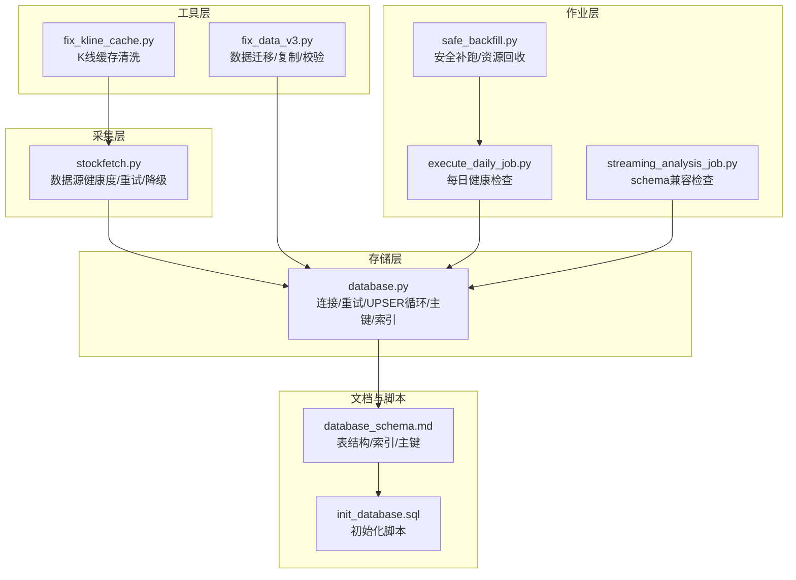
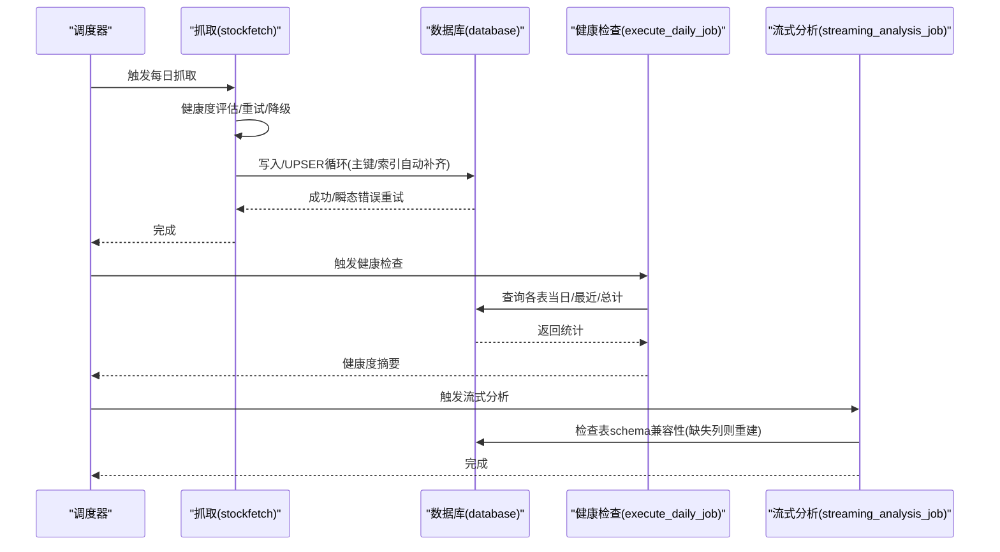
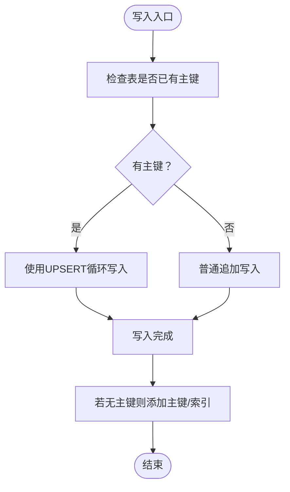
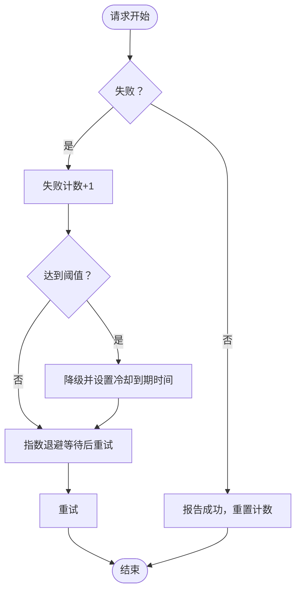
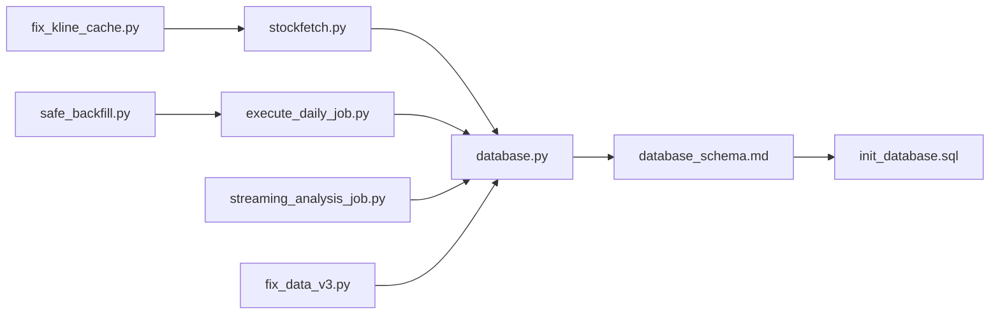

# 数据完整性问题

<cite>
**本文引用的文件**
- [database.py](file://quantia/lib/database.py)
- [stockfetch.py](file://quantia/core/stockfetch.py)
- [execute_daily_job.py](file://quantia/job/execute_daily_job.py)
- [streaming_analysis_job.py](file://quantia/job/streaming_analysis_job.py)
- [safe_backfill.py](file://quantia/job/safe_backfill.py)
- [fix_kline_cache.py](file://fix_kline_cache.py)
- [test_bugfixes.py](file://tests/test_bugfixes.py)
- [fix_data_v3.py](file://tests/fix_data_v3.py)
- [check_bf.py](file://tests/check_bf.py)
- [test_data_fixes.py](file://tests/test_data_fixes.py)
- [database_schema.md](file://document/database_schema.md)
- [init_database.sql](file://docker/init_database.sql)
</cite>

## 目录
1. [简介](#简介)
2. [项目结构](#项目结构)
3. [核心组件](#核心组件)
4. [架构总览](#架构总览)
5. [详细组件分析](#详细组件分析)
6. [依赖分析](#依赖分析)
7. [性能考量](#性能考量)
8. [故障排查指南](#故障排查指南)
9. [结论](#结论)
10. [附录](#附录)

## 简介
本指南面向数据管理员，聚焦 Quantia 系统中的数据完整性问题排查与修复，涵盖以下主题：
- 股票数据缺失、重复、不一致、历史数据补录的诊断与修复
- 数据源连接状态检查与健康度管理
- 数据质量验证与异常模式识别
- 数据修复脚本使用、批量校验与迁移处理
- 备份恢复、一致性检查与异常清理的操作流程

## 项目结构
Quantia 采用“核心采集/分析/服务”分层组织，数据完整性相关的关键路径包括：
- 数据采集与健康度管理：quantia/core/stockfetch.py
- 数据入库与一致性保障：quantia/lib/database.py
- 日常健康检查与汇总：quantia/job/execute_daily_job.py
- 流式分析与表结构兼容性检查：quantia/job/streaming_analysis_job.py
- 安全补跑与资源回收：quantia/job/safe_backfill.py
- 缓存与K线异常清洗：fix_kline_cache.py
- 测试与修复工具：tests/*.py
- 数据库建模与初始化：document/database_schema.md、docker/init_database.sql

图表来源
- [stockfetch.py](file://quantia/core/stockfetch.py#L46-L134)
- [database.py](file://quantia/lib/database.py#L60-L203)
- [execute_daily_job.py](file://quantia/job/execute_daily_job.py#L206-L226)
- [streaming_analysis_job.py](file://quantia/job/streaming_analysis_job.py#L319-L348)
- [safe_backfill.py](file://quantia/job/safe_backfill.py#L31-L84)
- [fix_kline_cache.py](file://fix_kline_cache.py#L35-L105)
- [fix_data_v3.py](file://tests/fix_data_v3.py#L75-L230)
- [database_schema.md](file://document/database_schema.md#L44-L800)
- [init_database.sql](file://docker/init_database.sql#L1-L455)

章节来源
- [database.py](file://quantia/lib/database.py#L1-L304)
- [stockfetch.py](file://quantia/core/stockfetch.py#L1-L200)
- [execute_daily_job.py](file://quantia/job/execute_daily_job.py#L206-L226)
- [streaming_analysis_job.py](file://quantia/job/streaming_analysis_job.py#L319-L348)
- [safe_backfill.py](file://quantia/job/safe_backfill.py#L1-L86)
- [fix_kline_cache.py](file://fix_kline_cache.py#L1-L204)
- [fix_data_v3.py](file://tests/fix_data_v3.py#L1-L268)
- [database_schema.md](file://document/database_schema.md#L1-L848)
- [init_database.sql](file://docker/init_database.sql#L1-L455)

## 核心组件
- 数据库连接与重试机制：提供连接池、瞬态错误重试、UPSER循环、主键/索引自动补齐，确保并发写入一致性与幂等性。
- 数据源健康度与降级：对失败数据源进行渐进式冷却与优先级调整，避免雪崩效应。
- 日常健康检查：按表统计当日/最近/总计记录数，输出健康度摘要。
- 流式分析schema检查：对比代码期望列与数据库实际列，缺失列时删除重建，保证写入时自动补齐。
- 安全补跑：停止web服务释放内存，限制并发，执行抓取与分析后自动重启。
- K线缓存清洗：扫描缓存文件，识别异常行并清洗，支持扫描/修复双模式。
- 数据迁移与复制：按日期复制/生成中间表，执行策略过滤与最终校验。

章节来源
- [database.py](file://quantia/lib/database.py#L60-L203)
- [stockfetch.py](file://quantia/core/stockfetch.py#L64-L134)
- [execute_daily_job.py](file://quantia/job/execute_daily_job.py#L206-L226)
- [streaming_analysis_job.py](file://quantia/job/streaming_analysis_job.py#L319-L348)
- [safe_backfill.py](file://quantia/job/safe_backfill.py#L31-L84)
- [fix_kline_cache.py](file://fix_kline_cache.py#L75-L105)
- [fix_data_v3.py](file://tests/fix_data_v3.py#L75-L230)

## 架构总览

图表来源
- [stockfetch.py](file://quantia/core/stockfetch.py#L64-L134)
- [database.py](file://quantia/lib/database.py#L120-L203)
- [execute_daily_job.py](file://quantia/job/execute_daily_job.py#L206-L226)
- [streaming_analysis_job.py](file://quantia/job/streaming_analysis_job.py#L319-L348)

## 详细组件分析

### 数据库连接与一致性保障（database.py）
- 连接池与瞬态错误重试：封装 get_connection 与 executeSql/executeSqlFetch，对死锁、锁超时、连接异常等瞬态错误进行可重试处理。
- UPSERT循环：insert_other_db_from_df 使用 SQLAlchemy 的 ON DUPLICATE KEY UPDATE，避免重复主键冲突导致的失败。
- 主键/索引自动补齐：首次创建表时检测并添加主键与索引，保证唯一性与查询效率。
- 参数化查询：update_db_from_df 使用 %s 参数化，避免SQL注入与拼接错误。

图表来源
- [database.py](file://quantia/lib/database.py#L120-L203)

章节来源
- [database.py](file://quantia/lib/database.py#L60-L203)

### 数据源健康度与降级（stockfetch.py）
- 健康度追踪：记录失败次数、冷却到期时间、累计降级次数，支持渐进式冷却（上限3600s）。
- 优先级排序：将降级数据源排至末尾，但仍可用，避免集中失败。
- 日志聚合：对同一数据源的连续失败进行聚合输出，避免刷屏。

图表来源
- [stockfetch.py](file://quantia/core/stockfetch.py#L64-L134)

章节来源
- [stockfetch.py](file://quantia/core/stockfetch.py#L46-L134)

### 日常健康检查（execute_daily_job.py）
- 按表统计当日记录数、最近日期、总计记录数，输出简洁摘要，便于快速定位缺失/异常。
- 异常保护：查询异常不中断整体流程，仅记录告警。

章节来源
- [execute_daily_job.py](file://quantia/job/execute_daily_job.py#L206-L226)

### 流式分析schema兼容检查（streaming_analysis_job.py）
- 对比代码期望列与数据库实际列，缺失列时删除重建，确保写入时自动补齐，避免schema不一致导致的写入失败。

章节来源
- [streaming_analysis_job.py](file://quantia/job/streaming_analysis_job.py#L319-L348)

### 安全补跑（safe_backfill.py）
- 停止web服务释放内存，设置最小并发度，执行 fetch_daily_job 与 analysis_daily_job，完成后自动重启web服务，降低补跑对线上服务的影响。

章节来源
- [safe_backfill.py](file://quantia/job/safe_backfill.py#L31-L84)

### K线缓存清洗（fix_kline_cache.py）
- 扫描缓存目录下的 qfq.gzip.pickle 文件，基于向量化规则识别异常行并清洗；支持扫描模式与修复模式，避免误伤正常数据。

章节来源
- [fix_kline_cache.py](file://fix_kline_cache.py#L75-L105)

### 数据迁移与复制（fix_data_v3.py）
- 重建中间表并按目标日期复制数据，执行策略过滤（如GPT综合选股、基本面选股），最后统一校验各表完整性与列数。

章节来源
- [fix_data_v3.py](file://tests/fix_data_v3.py#L75-L230)

## 依赖分析
- 组件耦合
  - stockfetch 与 database：前者负责数据源健康度与重试，后者负责写入一致性与主键补齐。
  - execute_daily_job 与 database：前者依赖后者进行表级统计。
  - streaming_analysis_job 与 database：前者依赖后者进行schema兼容性检查。
  - safe_backfill 串联 fetch 与 analysis，间接依赖 database。
  - fix_kline_cache 与 stockfetch：复用其异常检测逻辑。
  - fix_data_v3 与 database：依赖数据库执行DDL/DML与统计校验。
- 外部依赖
  - MySQL（pymysql/sqlalchemy）、日志系统、定时任务（cron）。

图表来源
- [stockfetch.py](file://quantia/core/stockfetch.py#L1-L200)
- [database.py](file://quantia/lib/database.py#L1-L304)
- [execute_daily_job.py](file://quantia/job/execute_daily_job.py#L206-L226)
- [streaming_analysis_job.py](file://quantia/job/streaming_analysis_job.py#L319-L348)
- [safe_backfill.py](file://quantia/job/safe_backfill.py#L1-L86)
- [fix_kline_cache.py](file://fix_kline_cache.py#L1-L204)
- [fix_data_v3.py](file://tests/fix_data_v3.py#L1-L268)
- [database_schema.md](file://document/database_schema.md#L1-L848)
- [init_database.sql](file://docker/init_database.sql#L1-L455)

## 性能考量
- 连接池与重试：合理设置 pool_size/max_overflow，避免高并发下的连接争用与死锁。
- 写入策略：优先使用UPSERT循环，减少重复主键冲突与回滚成本。
- 并发控制：在补跑期间降低并发度，释放内存，避免影响线上服务。
- 批处理与索引：批量写入时避免频繁DDL，必要时在补跑后统一添加索引。

## 故障排查指南

### 一、数据缺失排查
- 快速定位
  - 使用每日健康检查输出，核对当日/最近/总计记录数，判断缺失范围与严重程度。
  - 结合数据源健康度日志，确认是否存在连续失败或降级导致的抓取中断。
- 逐表验证
  - 对关键表（如每日行情、指标、策略表）分别统计当日记录数，定位缺失具体表。
- 历史补录
  - 使用安全补跑脚本在低峰期执行补录，避免影响线上服务。
  - 若为缓存异常导致的历史缺失，使用K线缓存清洗脚本修复缓存后重跑抓取。

章节来源
- [execute_daily_job.py](file://quantia/job/execute_daily_job.py#L206-L226)
- [stockfetch.py](file://quantia/core/stockfetch.py#L64-L134)
- [safe_backfill.py](file://quantia/job/safe_backfill.py#L31-L84)
- [fix_kline_cache.py](file://fix_kline_cache.py#L75-L105)

### 二、重复数据与主键冲突
- 现象
  - 写入时报主键冲突或重复记录。
- 处理
  - 确认表是否已存在主键，若无则自动补齐；若存在，使用UPSERT循环避免冲突。
  - 对历史数据进行去重处理，必要时重建表结构并重新导入。

章节来源
- [database.py](file://quantia/lib/database.py#L120-L203)

### 三、数据不一致（Schema不兼容）
- 现象
  - 写入失败或字段缺失。
- 处理
  - 使用流式分析的schema兼容检查，自动删除缺失列的表并重建，确保写入时自动补齐。

章节来源
- [streaming_analysis_job.py](file://quantia/job/streaming_analysis_job.py#L319-L348)

### 四、历史数据补录与迁移
- 步骤
  - 重建中间表并按目标日期复制数据。
  - 执行策略过滤（如GPT综合选股、基本面选股）。
  - 最终校验各表完整性与列数。
- 工具
  - 使用数据迁移脚本执行复制与校验，确保一致性。

章节来源
- [fix_data_v3.py](file://tests/fix_data_v3.py#L75-L230)

### 五、数据源连接状态与健康度
- 检查
  - 查看数据源失败聚合日志，确认是否存在连续失败与降级。
  - 核对瞬态错误重试日志，评估网络/代理稳定性。
- 修复
  - 等待冷却到期后自动恢复，或手动降低失败阈值/冷却时间以加速恢复。
  - 在补跑期间切换备用数据源或临时禁用不稳定源。

章节来源
- [stockfetch.py](file://quantia/core/stockfetch.py#L64-L134)

### 六、K线缓存异常清洗
- 扫描
  - 使用缓存清洗脚本扫描缓存目录，识别异常行。
- 修复
  - 在确认风险可控后执行修复，避免误删正常数据。
- 预防
  - 定期运行清洗脚本，结合异常检测规则优化缓存质量。

章节来源
- [fix_kline_cache.py](file://fix_kline_cache.py#L75-L105)

### 七、批量数据校验与一致性检查
- 建议流程
  - 通过数据库脚本或工具统计各表记录数、列数与主键完整性。
  - 对关键日期执行跨表一致性校验（如日期、代码组合唯一性）。
  - 使用测试脚本验证修复逻辑与边界条件。

章节来源
- [database_schema.md](file://document/database_schema.md#L44-L800)
- [test_bugfixes.py](file://tests/test_bugfixes.py#L112-L145)
- [test_data_fixes.py](file://tests/test_data_fixes.py#L1-L195)

### 八、备份与恢复
- 初始化与建模
  - 使用数据库初始化脚本创建/重建数据库与表结构，确保版本一致。
- 操作建议
  - 在执行大规模DDL/DML前进行备份，保留关键日期的数据快照。
  - 使用安全补跑在低峰期执行，减少对生产环境的影响。

章节来源
- [init_database.sql](file://docker/init_database.sql#L1-L455)

## 结论
通过健康度监控、连接重试、UPSERT循环、schema兼容检查与安全补跑等手段，Quantia 能够有效提升数据完整性与稳定性。建议数据管理员定期执行健康检查与缓存清洗，配合测试脚本验证修复逻辑，并在补跑期间严格控制并发与资源占用，确保系统数据的准确性与一致性。

## 附录

### A. 常用命令与脚本清单
- 数据库连接与建模
  - 初始化数据库与表结构：docker/init_database.sql
  - 数据库连接配置：quantia/lib/database.py
- 数据健康检查
  - 每日健康检查：quantia/job/execute_daily_job.py
- 数据源健康度
  - 健康度追踪与降级：quantia/core/stockfetch.py
- 流式分析与schema检查
  - schema兼容检查：quantia/job/streaming_analysis_job.py
- 安全补跑
  - 安全补跑脚本：quantia/job/safe_backfill.py
- 缓存清洗
  - K线缓存清洗：fix_kline_cache.py
- 数据迁移与复制
  - 数据迁移脚本：tests/fix_data_v3.py
- 远程状态检查
  - 补跑状态检查：tests/check_bf.py

章节来源
- [init_database.sql](file://docker/init_database.sql#L1-L455)
- [database.py](file://quantia/lib/database.py#L1-L304)
- [execute_daily_job.py](file://quantia/job/execute_daily_job.py#L206-L226)
- [stockfetch.py](file://quantia/core/stockfetch.py#L64-L134)
- [streaming_analysis_job.py](file://quantia/job/streaming_analysis_job.py#L319-L348)
- [safe_backfill.py](file://quantia/job/safe_backfill.py#L31-L84)
- [fix_kline_cache.py](file://fix_kline_cache.py#L75-L105)
- [fix_data_v3.py](file://tests/fix_data_v3.py#L75-L230)
- [check_bf.py](file://tests/check_bf.py#L1-L27)
