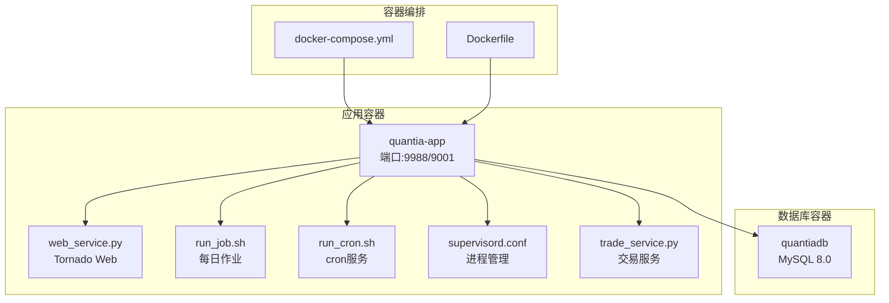
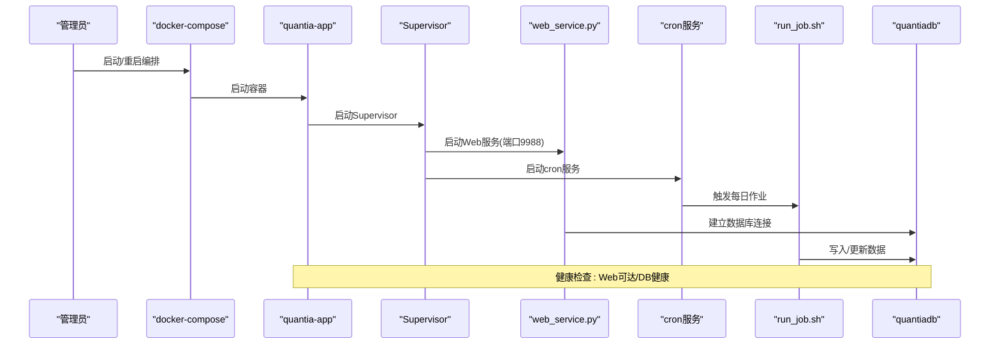
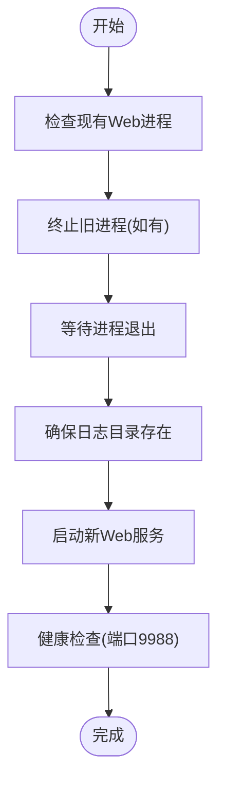
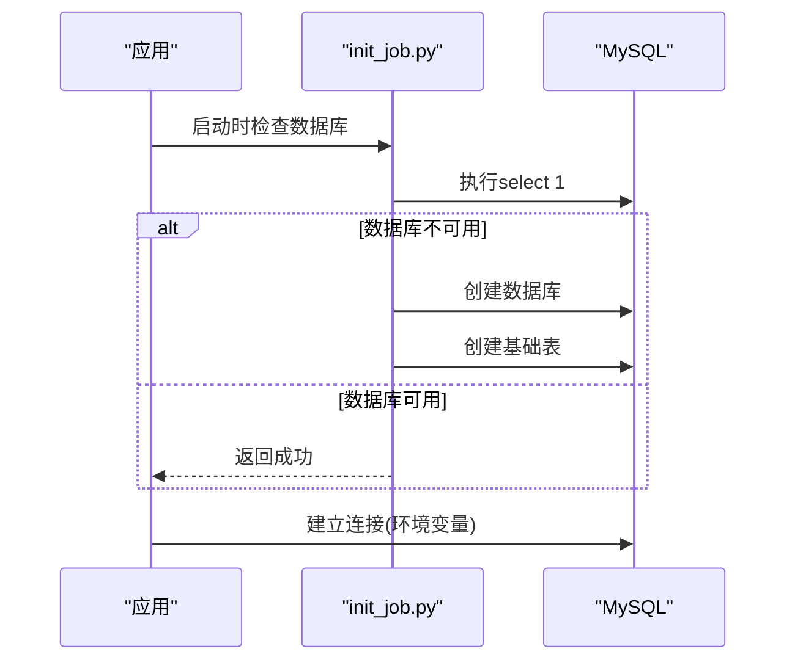
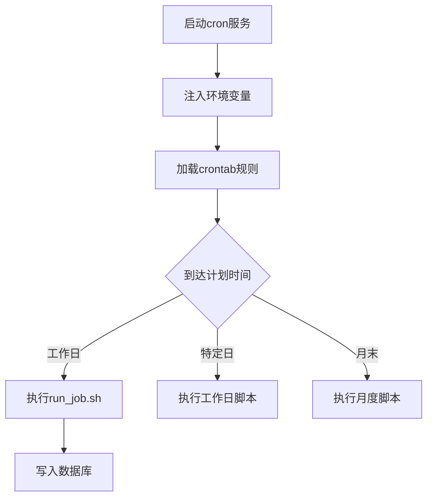
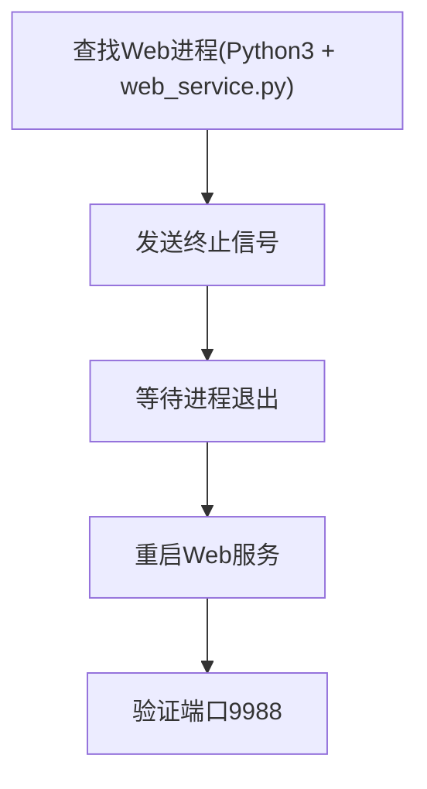

# 系统恢复流程

<cite>
**本文引用的文件**
- [README.md](file://README.md)
- [docker/init_database.sql](file://docker/init_database.sql)
- [docker/docker-compose.yml](file://docker/docker-compose.yml)
- [docker/Dockerfile](file://docker/Dockerfile)
- [docker/build.sh](file://docker/build.sh)
- [docker/build.bat](file://docker/build.bat)
- [supervisor/supervisord.conf](file://supervisor/supervisord.conf)
- [docker/stock/quantia/web/web_service.py](file://docker/stock/quantia/web/web_service.py)
- [docker/stock/quantia/lib/database.py](file://docker/stock/quantia/lib/database.py)
- [docker/stock/quantia/job/init_job.py](file://docker/stock/quantia/job/init_job.py)
- [docker/stock/quantia/lib/run_template.py](file://docker/stock/quantia/lib/run_template.py)
- [docker/stock/quantia/bin/restart_web.sh](file://docker/stock/quantia/bin/restart_web.sh)
- [docker/stock/quantia/bin/run_web.sh](file://docker/stock/quantia/bin/run_web.sh)
- [docker/stock/quantia/bin/run_job.sh](file://docker/stock/quantia/bin/run_job.sh)
- [docker/stock/quantia/bin/run_cron.sh](file://docker/stock/quantia/bin/run_cron.sh)
- [docker/stock/quantia/trade/trade_service.py](file://docker/stock/quantia/trade/trade_service.py)
</cite>

## 目录
1. [简介](#简介)
2. [项目结构](#项目结构)
3. [核心组件](#核心组件)
4. [架构总览](#架构总览)
5. [详细组件分析](#详细组件分析)
6. [依赖关系分析](#依赖关系分析)
7. [性能考量](#性能考量)
8. [故障排查指南](#故障排查指南)
9. [结论](#结论)
10. [附录](#附录)

## 简介
本指南面向系统管理员，提供Quantia系统在崩溃或异常状态下的完整恢复流程，涵盖服务重启、数据库连接恢复、定时任务重启、异常进程清理、备份与灾难恢复、故障切换与RTO设定、业务连续性保障与故障归档管理等。内容基于仓库中的Docker编排、Supervisor进程管理、Web服务、数据库连接、定时任务与作业脚本等实际实现。

## 项目结构
Quantia采用Docker容器化部署，包含Web服务、定时任务、Supervisor进程管理、数据库初始化脚本与构建脚本。系统通过docker-compose编排MySQL与应用容器，Dockerfile中集成Supervisor以统一管理Web、作业与cron进程；数据库初始化脚本用于创建所需表结构；构建脚本负责镜像打包与推送。



图表来源
- [docker/docker-compose.yml](file://docker/docker-compose.yml#L1-L87)
- [docker/Dockerfile](file://docker/Dockerfile#L1-L153)
- [supervisor/supervisord.conf](file://supervisor/supervisord.conf#L1-L42)
- [docker/stock/quantia/web/web_service.py](file://docker/stock/quantia/web/web_service.py#L1-L143)
- [docker/stock/quantia/bin/run_job.sh](file://docker/stock/quantia/bin/run_job.sh#L1-L16)
- [docker/stock/quantia/bin/run_cron.sh](file://docker/stock/quantia/bin/run_cron.sh#L1-L19)
- [docker/stock/quantia/trade/trade_service.py](file://docker/stock/quantia/trade/trade_service.py#L1-L31)

章节来源
- [docker/docker-compose.yml](file://docker/docker-compose.yml#L1-L87)
- [docker/Dockerfile](file://docker/Dockerfile#L1-L153)

## 核心组件
- Web服务：基于Tornado的HTTP服务，默认监听9988端口，提供API与前端SPA路由。
- 数据库连接：通过SQLAlchemy与PyMySQL连接MySQL，支持环境变量注入配置。
- 定时任务：通过cron与run_cron.sh启动cron服务，结合run_job.sh执行每日数据作业。
- Supervisor：统一管理Web、作业与cron进程，具备自动重启与优先级控制。
- 初始化脚本：init_job.py负责数据库存在性检查与基础表创建。
- 构建与部署：build.sh/build.bat负责镜像构建与推送，Dockerfile集成Supervisor与健康检查。

章节来源
- [docker/stock/quantia/web/web_service.py](file://docker/stock/quantia/web/web_service.py#L1-L143)
- [docker/stock/quantia/lib/database.py](file://docker/stock/quantia/lib/database.py#L1-L232)
- [docker/stock/quantia/bin/run_cron.sh](file://docker/stock/quantia/bin/run_cron.sh#L1-L19)
- [docker/stock/quantia/bin/run_job.sh](file://docker/stock/quantia/bin/run_job.sh#L1-L16)
- [supervisor/supervisord.conf](file://supervisor/supervisord.conf#L1-L42)
- [docker/stock/quantia/job/init_job.py](file://docker/stock/quantia/job/init_job.py#L1-L66)
- [docker/build.sh](file://docker/build.sh#L1-L99)
- [docker/build.bat](file://docker/build.bat#L1-L63)

## 架构总览
系统采用容器化微服务架构：应用容器内运行Supervisor，分别托管Web服务、数据作业与cron服务；数据库容器提供持久化存储；docker-compose负责服务编排与健康检查；Dockerfile定义镜像构建、依赖安装与入口命令。



图表来源
- [docker/docker-compose.yml](file://docker/docker-compose.yml#L1-L87)
- [docker/Dockerfile](file://docker/Dockerfile#L149-L153)
- [supervisor/supervisord.conf](file://supervisor/supervisord.conf#L25-L42)
- [docker/stock/quantia/web/web_service.py](file://docker/stock/quantia/web/web_service.py#L127-L143)
- [docker/stock/quantia/bin/run_cron.sh](file://docker/stock/quantia/bin/run_cron.sh#L1-L19)
- [docker/stock/quantia/bin/run_job.sh](file://docker/stock/quantia/bin/run_job.sh#L1-L16)

## 详细组件分析

### Web服务重启流程
- 通过Supervisor管理的run_web.sh启动Web服务，监听9988端口。
- 若Web异常，可使用restart_web.sh强制停止旧进程并重启，确保日志目录存在并输出到日志文件。
- Dockerfile中定义健康检查，curl探测Web端口，便于编排层自动恢复。



图表来源
- [docker/stock/quantia/bin/restart_web.sh](file://docker/stock/quantia/bin/restart_web.sh#L1-L28)
- [docker/stock/quantia/bin/run_web.sh](file://docker/stock/quantia/bin/run_web.sh#L1-L19)
- [docker/Dockerfile](file://docker/Dockerfile#L149-L153)

章节来源
- [docker/stock/quantia/bin/restart_web.sh](file://docker/stock/quantia/bin/restart_web.sh#L1-L28)
- [docker/stock/quantia/bin/run_web.sh](file://docker/stock/quantia/bin/run_web.sh#L1-L19)
- [docker/Dockerfile](file://docker/Dockerfile#L149-L153)

### 数据库连接恢复
- 数据库连接通过SQLAlchemy与PyMySQL建立，支持环境变量注入配置（主机、端口、用户、密码、数据库）。
- init_job.py在启动时检查数据库可用性，失败则自动创建数据库与基础表。
- docker-compose定义数据库健康检查，确保容器启动后DB可用。



图表来源
- [docker/stock/quantia/job/init_job.py](file://docker/stock/quantia/job/init_job.py#L46-L66)
- [docker/stock/quantia/lib/database.py](file://docker/stock/quantia/lib/database.py#L22-L51)
- [docker/docker-compose.yml](file://docker/docker-compose.yml#L23-L28)

章节来源
- [docker/stock/quantia/lib/database.py](file://docker/stock/quantia/lib/database.py#L1-L232)
- [docker/stock/quantia/job/init_job.py](file://docker/stock/quantia/job/init_job.py#L1-L66)
- [docker/docker-compose.yml](file://docker/docker-compose.yml#L1-L87)

### 定时任务与作业重启
- run_cron.sh启动cron服务并将环境变量写入/etc/environment，确保定时任务可读取容器环境。
- run_job.sh作为每日作业入口，配合Supervisor按优先级调度。
- Supervisor配置中run_cron优先级高于run_web，run_web高于run_job，确保任务有序执行。



图表来源
- [docker/stock/quantia/bin/run_cron.sh](file://docker/stock/quantia/bin/run_cron.sh#L1-L19)
- [docker/Dockerfile](file://docker/Dockerfile#L134-L147)
- [supervisor/supervisord.conf](file://supervisor/supervisord.conf#L38-L42)

章节来源
- [docker/stock/quantia/bin/run_cron.sh](file://docker/stock/quantia/bin/run_cron.sh#L1-L19)
- [docker/Dockerfile](file://docker/Dockerfile#L134-L147)
- [supervisor/supervisord.conf](file://supervisor/supervisord.conf#L1-L42)

### 异常进程清理与强制重启
- restart_web.sh通过进程名匹配查找并终止旧Web进程，等待退出后重启，避免端口占用与僵尸进程。
- Supervisor配置中run_web启用自动重启与组停止策略，提升恢复可靠性。



图表来源
- [docker/stock/quantia/bin/restart_web.sh](file://docker/stock/quantia/bin/restart_web.sh#L12-L24)
- [supervisor/supervisord.conf](file://supervisor/supervisord.conf#L31-L37)

章节来源
- [docker/stock/quantia/bin/restart_web.sh](file://docker/stock/quantia/bin/restart_web.sh#L1-L28)
- [supervisor/supervisord.conf](file://supervisor/supervisord.conf#L1-L42)

### 交易服务与策略监控
- trade_service.py启动MainEngine并加载策略，支持策略热加载（开发环境）。
- 建议在生产环境关闭自动重载，避免策略变更引发不稳定。

章节来源
- [docker/stock/quantia/trade/trade_service.py](file://docker/stock/quantia/trade/trade_service.py#L1-L31)

### 数据库初始化与表结构
- init_database.sql定义数据库与20张核心表结构，包含每日行情、资金流、龙虎榜、回测汇总等。
- 代码层通过init_job.py与SQLAlchemy自动创建基础表，确保系统初次运行可用。

章节来源
- [docker/init_database.sql](file://docker/init_database.sql#L1-L455)
- [docker/stock/quantia/job/init_job.py](file://docker/stock/quantia/job/init_job.py#L34-L44)

## 依赖关系分析
- 应用容器依赖数据库容器，docker-compose通过健康检查确保DB可用后再启动应用。
- Supervisor统一管理Web、作业与cron进程，避免多进程冲突。
- Dockerfile中安装Supervisor、MySQL客户端与Python依赖，ENTRYPOINT直接启动Supervisor。

```mermaid
graph LR
DB["MySQL容器"] <- --> APP["应用容器"]
SUPERVISOR["Supervisor"] --> WEB["Web服务"]
SUPERVISOR --> CRON["Cron服务"]
SUPERVISOR --> JOB["每日作业"]
COMPOSE["docker-compose"] --> DB
COMPOSE --> APP
```

图表来源
- [docker/docker-compose.yml](file://docker/docker-compose.yml#L61-L66)
- [docker/Dockerfile](file://docker/Dockerfile#L153-L153)
- [supervisor/supervisord.conf](file://supervisor/supervisord.conf#L25-L42)

章节来源
- [docker/docker-compose.yml](file://docker/docker-compose.yml#L1-L87)
- [docker/Dockerfile](file://docker/Dockerfile#L1-L153)
- [supervisor/supervisord.conf](file://supervisor/supervisord.conf#L1-L42)

## 性能考量
- 数据库连接池：SQLAlchemy连接池大小与超时参数已在代码中配置，避免高并发下的连接瓶颈。
- 定时任务并发：run_template.py提供批量作业的线程池并发执行，减少总耗时。
- Docker健康检查：Web与DB健康检查有助于编排层快速发现异常并触发重启。

章节来源
- [docker/stock/quantia/lib/database.py](file://docker/stock/quantia/lib/database.py#L58-L69)
- [docker/stock/quantia/lib/run_template.py](file://docker/stock/quantia/lib/run_template.py#L44-L58)
- [docker/Dockerfile](file://docker/Dockerfile#L149-L153)

## 故障排查指南
- Web服务不可用
  - 检查端口9988是否被占用，使用restart_web.sh强制重启。
  - 查看Web日志文件定位错误。
- 数据库连接失败
  - 确认数据库容器健康状态与凭据配置。
  - 使用init_job.py进行数据库存在性检查与基础表创建。
- 定时任务未执行
  - 检查run_cron.sh是否启动cron服务，确认crontab规则加载。
  - 核对run_job.sh执行权限与依赖。
- 进程异常或僵尸进程
  - 使用restart_web.sh终止旧进程并重启。
  - 检查Supervisor状态与日志。

章节来源
- [docker/stock/quantia/bin/restart_web.sh](file://docker/stock/quantia/bin/restart_web.sh#L1-L28)
- [docker/stock/quantia/job/init_job.py](file://docker/stock/quantia/job/init_job.py#L46-L66)
- [docker/stock/quantia/bin/run_cron.sh](file://docker/stock/quantia/bin/run_cron.sh#L1-L19)
- [docker/stock/quantia/bin/run_job.sh](file://docker/stock/quantia/bin/run_job.sh#L1-L16)
- [supervisor/supervisord.conf](file://supervisor/supervisord.conf#L1-L42)

## 结论
通过Docker编排、Supervisor统一管理、健康检查与初始化脚本，Quantia系统具备良好的自愈能力。管理员可在发生严重故障时，按本指南快速完成Web服务重启、数据库连接恢复、定时任务与作业重启、异常进程清理，并结合数据库初始化脚本与健康检查机制，确保系统在最短时间内恢复正常运行。

## 附录

### 系统恢复操作清单
- 服务重启
  - 使用Supervisor管理run_web.sh启动Web服务。
  - 必要时使用restart_web.sh强制重启。
- 数据库恢复
  - 确认数据库容器健康，使用init_job.py检查并创建基础表。
  - 核对环境变量与连接参数。
- 定时任务恢复
  - 确认run_cron.sh已启动cron服务，检查crontab规则。
  - 验证run_job.sh可执行且权限正确。
- 异常进程清理
  - 使用restart_web.sh终止旧进程并重启。
  - 检查Supervisor状态与进程优先级。
- 备份与灾难恢复
  - 使用docker-compose定义的数据卷持久化数据库与日志缓存。
  - 建议定期导出数据库快照并验证恢复流程。
- RTO与业务连续性
  - Web服务与DB健康检查可实现自动恢复，建议RTO目标为数分钟级别。
  - 生产环境关闭策略自动重载，避免策略变更导致的不稳定。
- 故障记录归档
  - 归档Web、作业与交易服务日志，便于问题追踪与复盘。

章节来源
- [docker/docker-compose.yml](file://docker/docker-compose.yml#L74-L81)
- [docker/Dockerfile](file://docker/Dockerfile#L149-L153)
- [docker/stock/quantia/bin/restart_web.sh](file://docker/stock/quantia/bin/restart_web.sh#L1-L28)
- [docker/stock/quantia/job/init_job.py](file://docker/stock/quantia/job/init_job.py#L46-L66)
- [docker/stock/quantia/bin/run_cron.sh](file://docker/stock/quantia/bin/run_cron.sh#L1-L19)
- [docker/stock/quantia/bin/run_job.sh](file://docker/stock/quantia/bin/run_job.sh#L1-L16)
- [supervisor/supervisord.conf](file://supervisor/supervisord.conf#L1-L42)
- [docker/init_database.sql](file://docker/init_database.sql#L1-L455)
