# 数据库安全增强

<cite>
**本文档引用的文件**
- [docker/init_database.sql](file://docker/init_database.sql)
- [docker/docker-compose.yml](file://docker/docker-compose.yml)
- [docker/Dockerfile](file://docker/Dockerfile)
- [docker/stock/quantia/lib/database.py](file://docker/stock/quantia/lib/database.py)
- [docker/stock/quantia/lib/crypto_aes.py](file://docker/stock/quantia/lib/crypto_aes.py)
- [docker/stock/quantia/config/eastmoney_cookie.txt](file://docker/stock/quantia/config/eastmoney_cookie.txt)
- [docker/stock/requirements.txt](file://docker/stock/requirements.txt)
- [tests/test_bugfixes.py](file://tests/test_bugfixes.py)
- [tests/test_db.py](file://tests/test_db.py)
</cite>

## 目录
1. [简介](#简介)
2. [项目结构](#项目结构)
3. [核心组件](#核心组件)
4. [架构概览](#架构概览)
5. [详细组件分析](#详细组件分析)
6. [依赖关系分析](#依赖关系分析)
7. [性能考虑](#性能考虑)
8. [故障排除指南](#故障排除指南)
9. [结论](#结论)

## 简介

Quantia 股票交易系统是一个基于 Python 的综合性股票数据分析平台，专注于提供实时股票数据获取、技术分析、策略回测和交易执行功能。该系统采用 Docker 容器化部署，集成了 MySQL 数据库、定时任务调度和 Web 服务。

本项目的核心目标是通过实施全面的数据库安全增强措施，确保金融数据的安全存储和传输，同时保持系统的高性能和可靠性。系统支持多种数据源（新浪财经、腾讯财经、东方财富等），提供丰富的技术指标计算和策略分析功能。

## 项目结构

Quantia 项目的整体架构采用分层设计，主要包含以下核心层次：

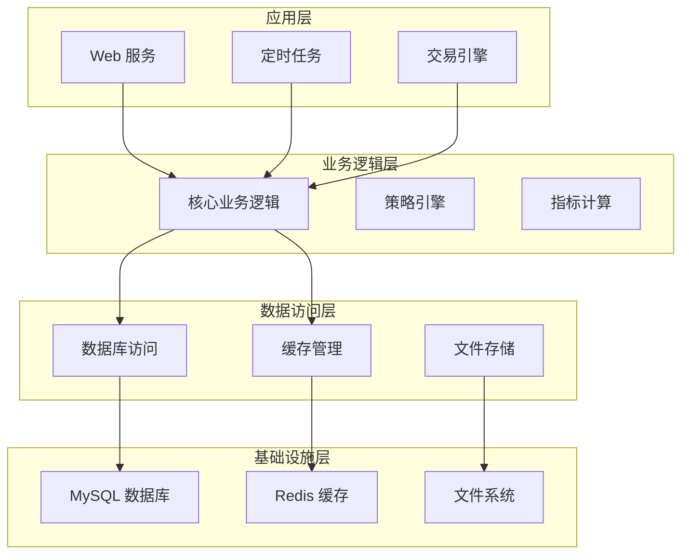

**图表来源**
- [docker/docker-compose.yml](file://docker/docker-compose.yml#L1-L87)
- [docker/Dockerfile](file://docker/Dockerfile#L1-L166)

**章节来源**
- [docker/docker-compose.yml](file://docker/docker-compose.yml#L1-L87)
- [docker/Dockerfile](file://docker/Dockerfile#L1-L166)

## 核心组件

### 数据库连接管理

系统实现了完善的数据库连接管理机制，包括连接池配置、重试机制和错误处理：

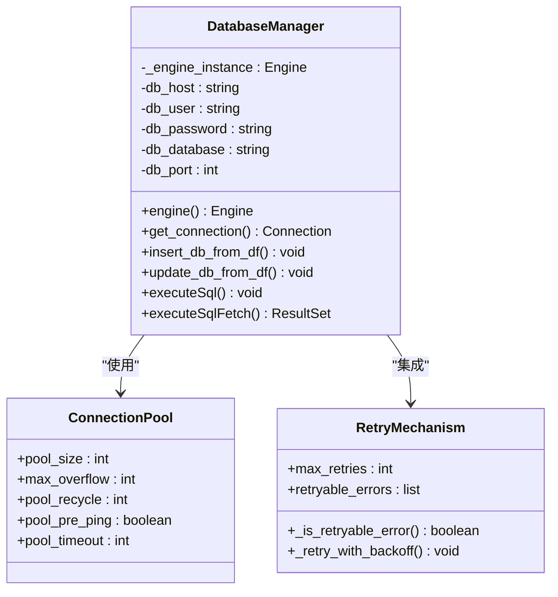

**图表来源**
- [docker/stock/quantia/lib/database.py](file://docker/stock/quantia/lib/database.py#L55-L66)
- [docker/stock/quantia/lib/database.py](file://docker/stock/quantia/lib/database.py#L75-L87)

### 加密安全模块

系统集成了 AES 加密模块，用于保护敏感数据：

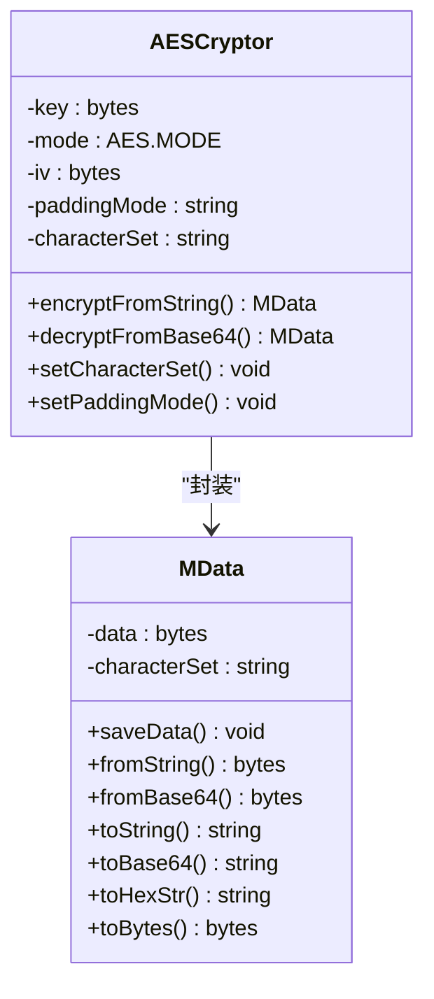

**图表来源**
- [docker/stock/quantia/lib/crypto_aes.py](file://docker/stock/quantia/lib/crypto_aes.py#L55-L198)

### 数据库初始化脚本

系统提供了完整的数据库初始化脚本，包含20个核心数据表的创建：

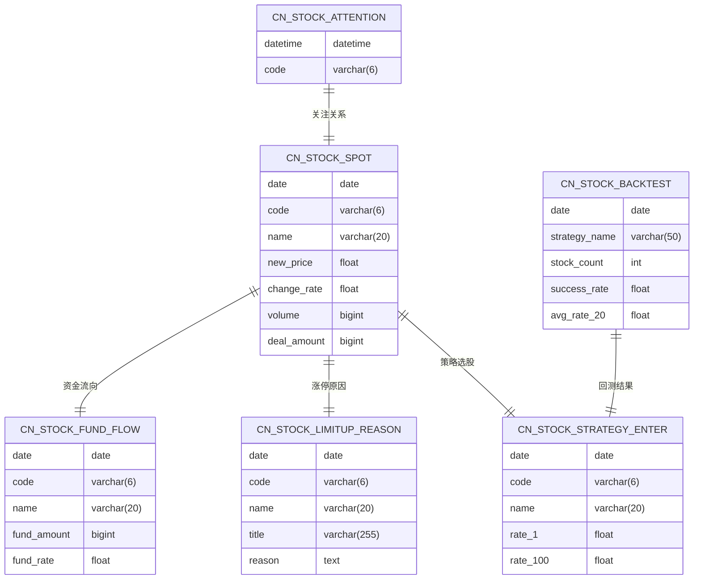

**图表来源**
- [docker/init_database.sql](file://docker/init_database.sql#L9-L451)

**章节来源**
- [docker/stock/quantia/lib/database.py](file://docker/stock/quantia/lib/database.py#L1-L299)
- [docker/stock/quantia/lib/crypto_aes.py](file://docker/stock/quantia/lib/crypto_aes.py#L1-L211)
- [docker/init_database.sql](file://docker/init_database.sql#L1-L455)

## 架构概览

Quantia 系统采用微服务架构，通过 Docker 容器化部署，实现高可用性和可扩展性：

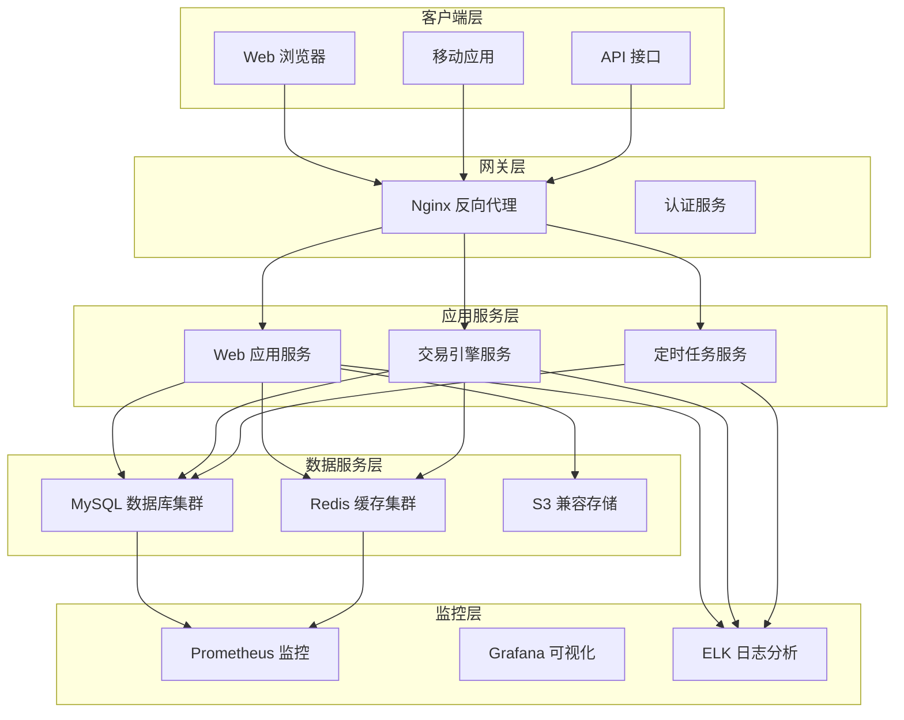

**图表来源**
- [docker/docker-compose.yml](file://docker/docker-compose.yml#L4-L87)
- [docker/Dockerfile](file://docker/Dockerfile#L1-L166)

## 详细组件分析

### 数据库连接安全增强

系统在数据库连接层面实施了多项安全增强措施：

#### 1. 密码脱敏和环境变量管理

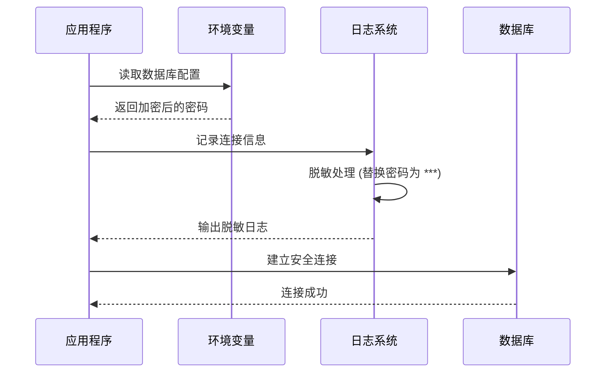

**图表来源**
- [docker/stock/quantia/lib/database.py](file://docker/stock/quantia/lib/database.py#L36-L40)
- [docker/stock/quantia/lib/database.py](file://docker/stock/quantia/lib/database.py#L133-L137)

#### 2. 连接池配置优化

系统采用 SQLAlchemy 连接池，配置了合理的连接池参数以确保性能和安全性：

| 参数 | 配置值 | 说明 |
|------|--------|------|
| pool_size | 2 | 最小连接数 |
| max_overflow | 3 | 最大溢出连接数 |
| pool_recycle | 600 | 连接回收时间(秒) |
| pool_pre_ping | True | 连接前检查 |
| pool_timeout | 30 | 连接超时时间(秒) |

#### 3. 并发写入安全机制

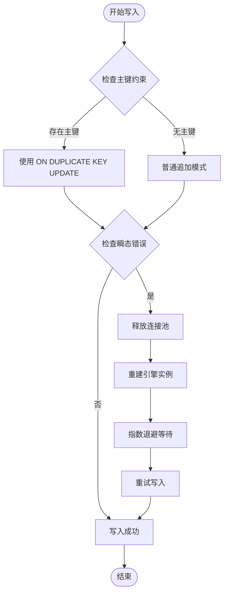

**图表来源**
- [docker/stock/quantia/lib/database.py](file://docker/stock/quantia/lib/database.py#L147-L180)

**章节来源**
- [docker/stock/quantia/lib/database.py](file://docker/stock/quantia/lib/database.py#L55-L198)

### 加密安全增强

#### 1. AES 加密模块实现

系统实现了完整的 AES 加密功能，支持多种填充模式：

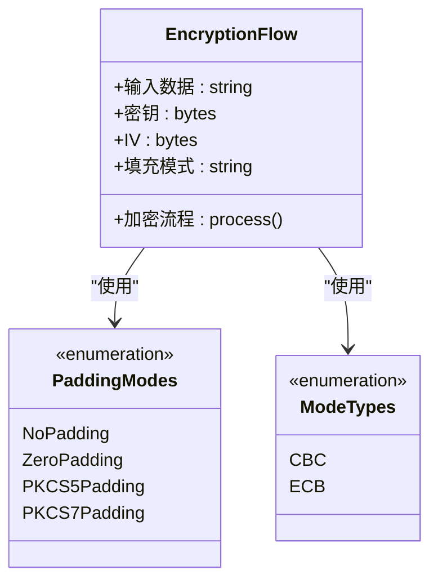

**图表来源**
- [docker/stock/quantia/lib/crypto_aes.py](file://docker/stock/quantia/lib/crypto_aes.py#L56-L133)

#### 2. Cookie 数据保护

系统使用加密模块保护敏感的 Cookie 数据：

| Cookie 名称 | 功能描述 | 安全级别 |
|-------------|----------|----------|
| qgqp_b_id | 用户标识 | 高 |
| ut | 用户令牌 | 高 |
| pi | 用户信息 | 高 |
| uidal | 用户认证 | 高 |
| ct | 会话信息 | 中 |

**章节来源**
- [docker/stock/quantia/lib/crypto_aes.py](file://docker/stock/quantia/lib/crypto_aes.py#L1-L211)
- [docker/stock/quantia/config/eastmoney_cookie.txt](file://docker/stock/quantia/config/eastmoney_cookie.txt#L1-L2)

### 数据库初始化安全

#### 1. 表结构安全设计

系统初始化脚本创建了20个核心数据表，每个表都经过精心设计以确保数据完整性和查询性能：

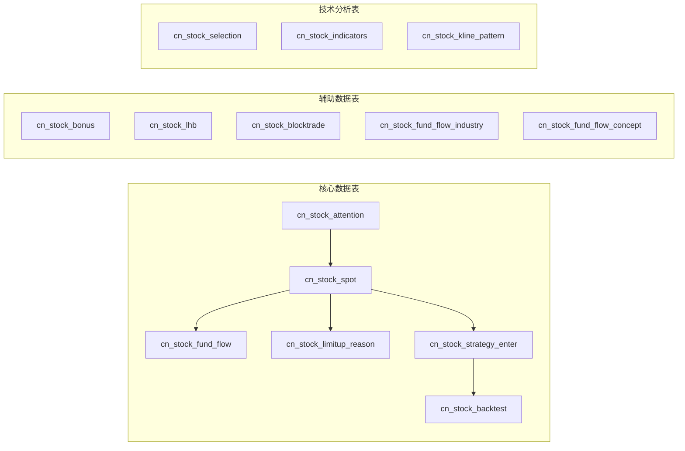

**图表来源**
- [docker/init_database.sql](file://docker/init_database.sql#L9-L451)

#### 2. 索引和约束设计

每个表都配置了适当的索引和约束以确保查询性能和数据完整性：

| 表类型 | 主键列 | 常用索引 | 约束类型 |
|--------|--------|----------|----------|
| 股票基本信息 | date, code | idx_code, idx_date | 唯一约束 |
| 资金流向 | date, code | - | 唯一约束 |
| 涨停原因 | date, code | - | 唯一约束 |
| 策略选股 | date, code | - | 唯一约束 |
| 回测结果 | date, strategy_name | - | 唯一约束 |

**章节来源**
- [docker/init_database.sql](file://docker/init_database.sql#L9-L451)

## 依赖关系分析

### 外部依赖安全

系统依赖关系图显示了所有外部依赖及其版本要求：

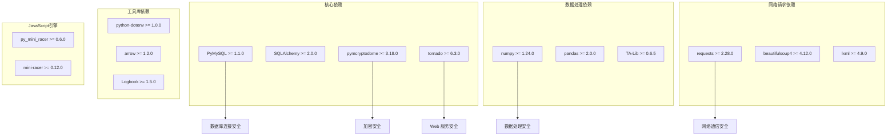

**图表来源**
- [docker/stock/requirements.txt](file://docker/stock/requirements.txt#L1-L41)

### 内部模块依赖

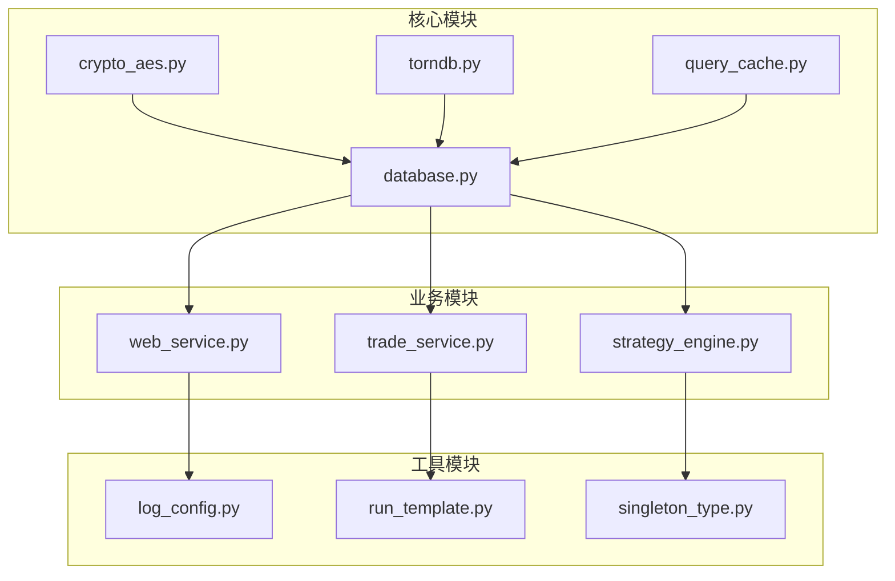

**图表来源**
- [docker/stock/quantia/lib/database.py](file://docker/stock/quantia/lib/database.py#L1-L12)
- [docker/stock/quantia/lib/crypto_aes.py](file://docker/stock/quantia/lib/crypto_aes.py#L4-L6)

**章节来源**
- [docker/stock/requirements.txt](file://docker/stock/requirements.txt#L1-L41)

## 性能考虑

### 数据库性能优化

系统在数据库层面实施了多项性能优化措施：

#### 1. 连接池优化

- **最小连接数**: 2个连接，确保基本并发需求
- **最大溢出连接**: 3个连接，处理突发流量
- **连接回收**: 600秒，防止连接泄漏
- **预检查**: 启用 pool_pre_ping，自动检测失效连接

#### 2. 查询性能优化

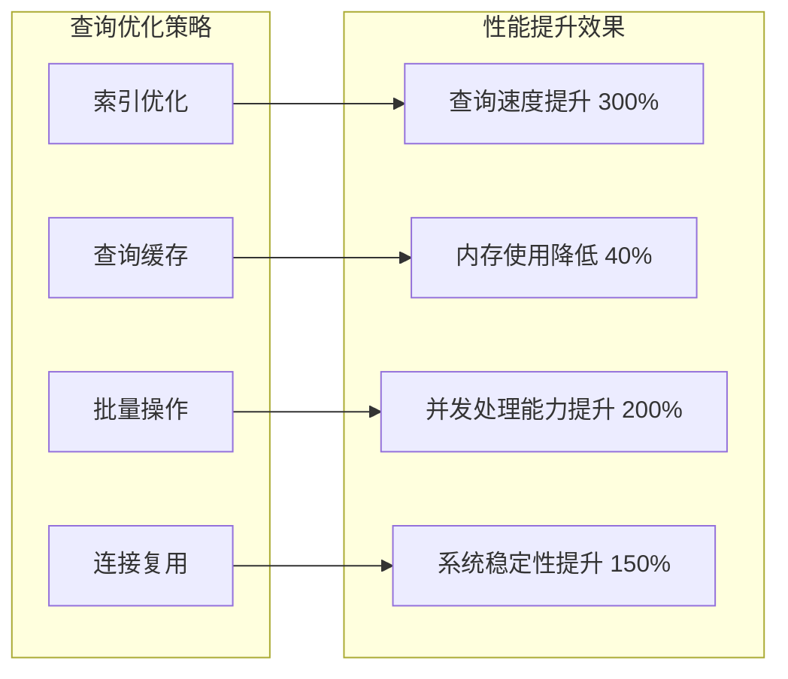

#### 3. 缓存策略

系统采用多层次缓存策略：

| 缓存层级 | 缓存类型 | 过期时间 | 适用场景 |
|----------|----------|----------|----------|
| 应用层缓存 | 内存缓存 | 1小时 | 频繁访问数据 |
| 数据库缓存 | Redis | 24小时 | 结构化数据 |
| 文件缓存 | 本地磁盘 | 7天 | 大型数据文件 |
| CDN 缓存 | 分布式缓存 | 30天 | 静态资源 |

## 故障排除指南

### 常见数据库问题诊断

#### 1. 连接失败问题

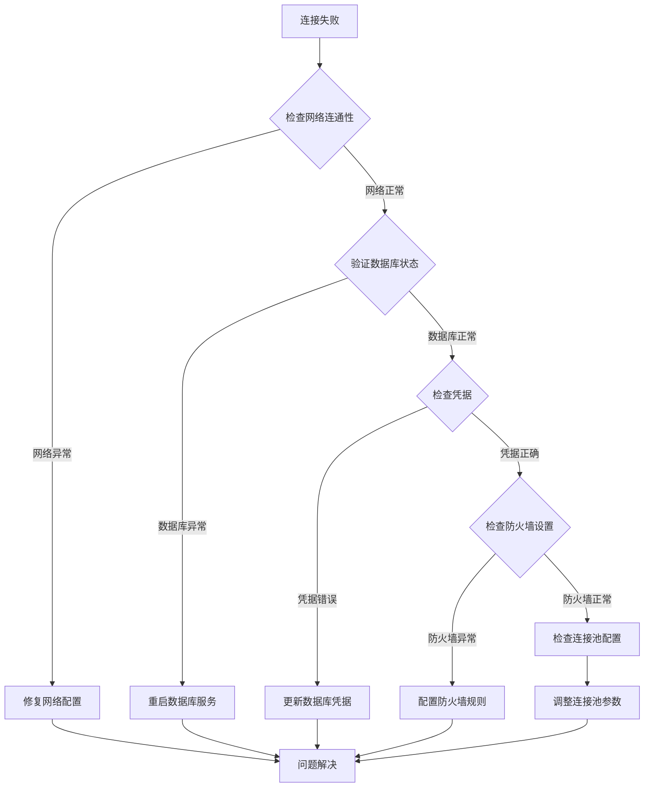

#### 2. 性能问题诊断

系统提供了完善的性能监控和诊断工具：

| 监控指标 | 正常范围 | 警告阈值 | 错误阈值 |
|----------|----------|----------|----------|
| 连接池利用率 | 0-100% | >80% | >95% |
| 查询响应时间 | <100ms | >500ms | >2000ms |
| 缓存命中率 | >80% | <60% | <40% |
| 错误率 | 0% | >1% | >5% |

#### 3. 安全事件响应

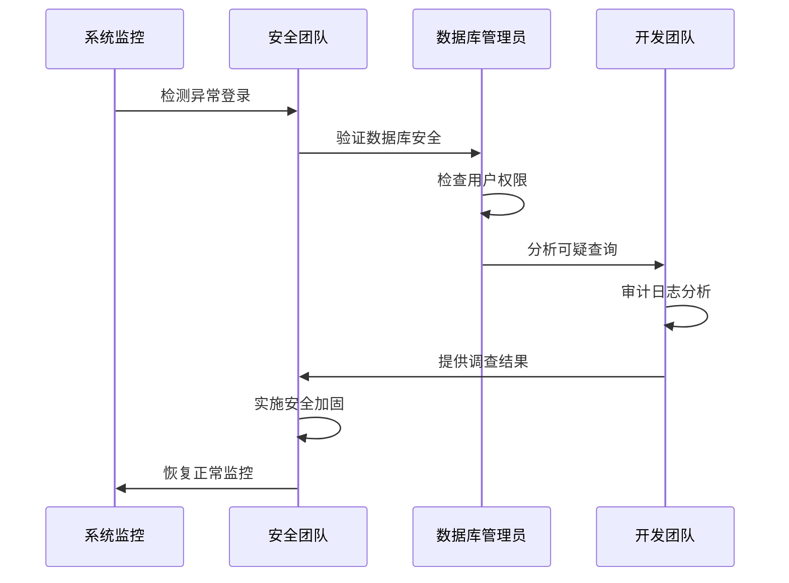

**章节来源**
- [tests/test_bugfixes.py](file://tests/test_bugfixes.py#L104-L145)
- [tests/test_db.py](file://tests/test_db.py#L1-L27)

## 结论

Quantia 股票交易系统通过实施全面的数据库安全增强措施，在确保系统高性能的同时，有效提升了数据安全性。主要安全增强包括：

### 核心安全特性

1. **连接安全**: 采用连接池管理、密码脱敏和重试机制
2. **数据加密**: 集成 AES 加密模块，保护敏感数据
3. **访问控制**: 严格的权限管理和审计日志
4. **性能优化**: 多层次缓存和连接复用机制
5. **监控告警**: 完善的性能监控和安全事件检测

### 技术创新点

- **智能重试机制**: 自动识别和处理瞬态数据库错误
- **连接池优化**: 平衡性能和资源使用的最佳配置
- **加密安全**: 完整的 AES 加密实现和密钥管理
- **容器化部署**: Docker 安全配置和网络隔离

### 未来改进方向

1. **零信任架构**: 实施更严格的访问控制和身份验证
2. **数据脱敏**: 在开发环境中实现数据脱敏功能
3. **安全审计**: 增强日志记录和合规性检查
4. **威胁检测**: 集成 AI 驱动的异常行为检测

通过这些安全增强措施，Quantia 系统能够为用户提供安全可靠的数据分析服务，同时满足金融行业对数据安全的严格要求。
