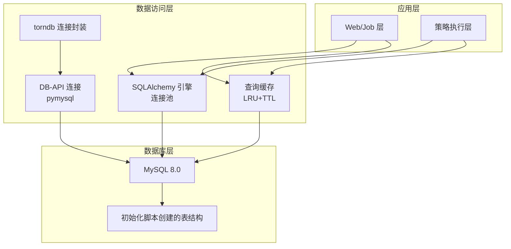
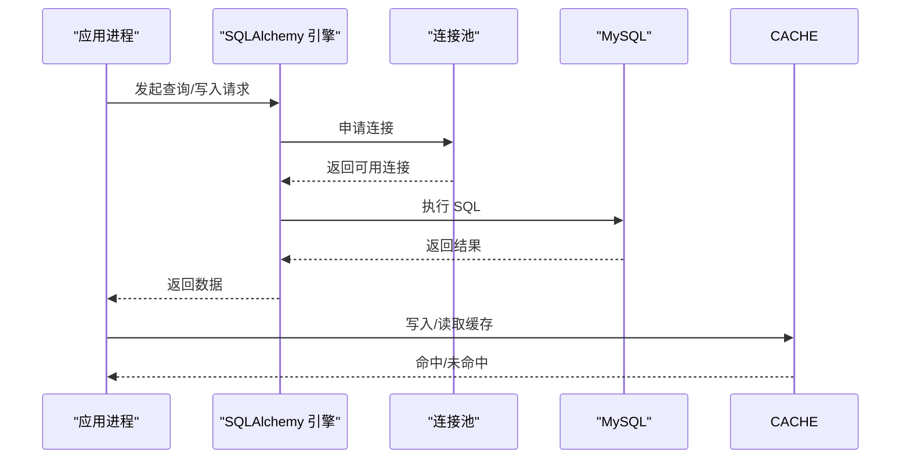
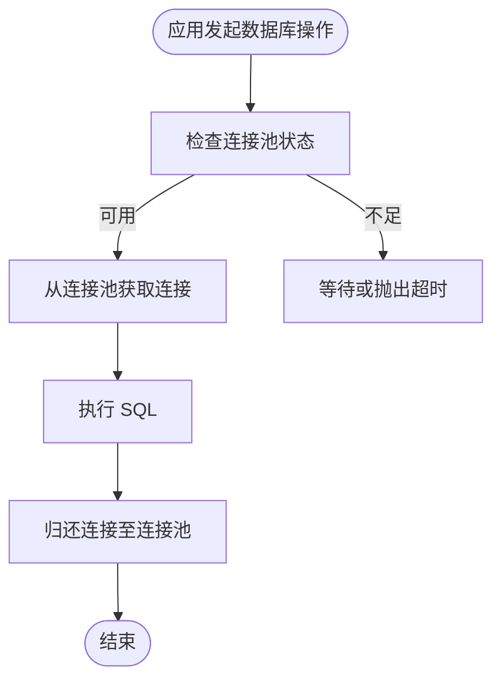
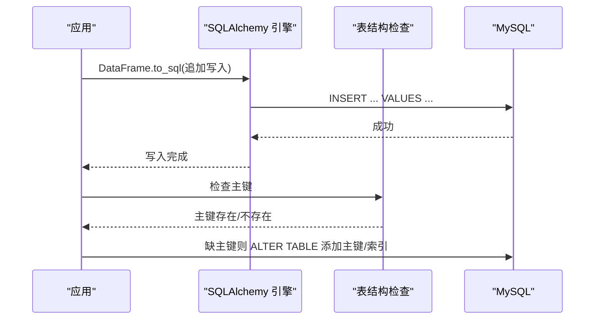
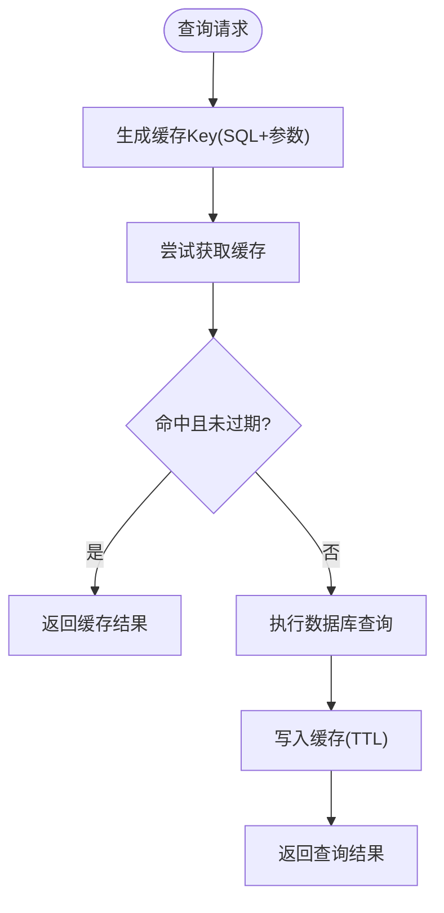
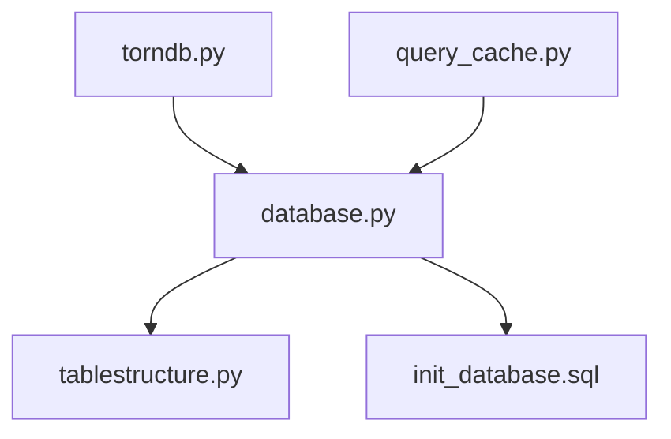

# 数据库架构设计

<cite>
**本文档引用的文件**
- [init_database.sql](file://docker/init_database.sql)
- [docker-compose.yml](file://docker/docker-compose.yml)
- [docker-compose.remote-db.yml](file://docker/docker-compose.remote-db.yml)
- [database.py](file://docker/stock/quantia/lib/database.py)
- [torndb.py](file://docker/stock/quantia/lib/torndb.py)
- [query_cache.py](file://docker/stock/quantia/lib/query_cache.py)
- [tablestructure.py](file://docker/stock/quantia/core/tablestructure.py)
- [eastmoney_cookie.txt](file://docker/stock/quantia/config/eastmoney_cookie.txt)
- [trade_client.json](file://docker/stock/quantia/config/trade_client.json)
</cite>

## 目录
1. [简介](#简介)
2. [项目结构](#项目结构)
3. [核心组件](#核心组件)
4. [架构总览](#架构总览)
5. [详细组件分析](#详细组件分析)
6. [依赖关系分析](#依赖关系分析)
7. [性能考虑](#性能考虑)
8. [故障排查指南](#故障排查指南)
9. [结论](#结论)
10. [附录](#附录)

## 简介
本文件面向数据库管理员与开发者，系统化阐述 Quantia 项目的数据库架构设计。内容涵盖数据库整体设计理念、连接池管理机制、ORM 封装策略、事务处理与并发控制、配置参数与环境变量、字符集与存储引擎选择、初始化流程、连接管理、错误处理机制与性能优化策略，并提供架构图与组件关系图，帮助读者快速理解与落地实施。

## 项目结构
Quantia 的数据库层由三层构成：
- 初始化脚本：负责创建数据库与所有业务表，统一字符集与存储引擎。
- 连接与访问层：提供 SQLAlchemy 引擎与原生 DB-API 连接，封装常用 CRUD 与批量写入。
- 缓存与模型层：基于 SQLAlchemy 的表结构定义与查询缓存，支撑高频查询与回测数据。



图表来源
- [database.py](file://docker/stock/quantia/lib/database.py#L58-L69)
- [torndb.py](file://docker/stock/quantia/lib/torndb.py#L47-L122)
- [query_cache.py](file://docker/stock/quantia/lib/query_cache.py#L27-L156)
- [init_database.sql](file://docker/init_database.sql#L1-L455)

章节来源
- [docker-compose.yml](file://docker/docker-compose.yml#L1-L87)
- [docker-compose.remote-db.yml](file://docker/docker-compose.remote-db.yml#L1-L48)
- [init_database.sql](file://docker/init_database.sql#L1-L455)

## 核心组件
- 数据库初始化脚本：集中定义数据库、字符集、存储引擎与所有业务表结构，确保部署一致性。
- SQLAlchemy 引擎与连接池：统一管理连接生命周期、超时与回收策略，支持批量写入与主键/索引自动补建。
- torndb：轻量 DB-API 封装，提供迭代游标、自动重连与连接空闲检测。
- 查询缓存：基于 LRU 的内存缓存，支持 TTL 过期与线程安全，显著降低重复查询压力。
- 表结构定义：以 Python 字典描述各表列类型、中文注释与映射关系，驱动 ORM 自动建表与字段校验。

章节来源
- [database.py](file://docker/stock/quantia/lib/database.py#L1-L232)
- [torndb.py](file://docker/stock/quantia/lib/torndb.py#L1-L285)
- [query_cache.py](file://docker/stock/quantia/lib/query_cache.py#L1-L156)
- [tablestructure.py](file://docker/stock/quantia/core/tablestructure.py#L1-L1137)

## 架构总览
数据库架构遵循“集中式初始化 + 统一连接池 + 分层缓存”的设计原则：
- 初始化阶段：通过 SQL 脚本一次性创建数据库与表，设定字符集与存储引擎，保证跨环境一致性。
- 运行阶段：应用通过 SQLAlchemy 引擎与连接池访问数据库；对高频查询采用内存缓存；对历史回测等场景采用 torndb 迭代游标降低内存占用。
- 并发控制：连接池大小与超时参数限制并发峰值；缓存命中率与 TTL 控制热点数据的重复计算。



图表来源
- [database.py](file://docker/stock/quantia/lib/database.py#L58-L69)
- [query_cache.py](file://docker/stock/quantia/lib/query_cache.py#L51-L92)

## 详细组件分析

### 数据库初始化与表结构
- 初始化脚本负责创建数据库与所有业务表，统一使用 utf8mb4 字符集与 InnoDB 存储引擎，确保中文与事务支持。
- 关键表包括：每日股票数据、ETF 数据、资金流向、龙虎榜、大宗交易、K 线形态、策略选股表族、回测汇总等。
- 自动建表：部分宽表（如综合选股、指标表、策略表）通过 SQLAlchemy 在运行时按定义自动创建，确保表结构与代码一致。

```mermaid
erDiagram
CN_STOCK_ATTENTION {
datetime datetime
code varchar(6)
}
CN_STOCK_SPOT {
date date
code varchar(6)
name varchar(20)
new_price float
change_rate float
volume bigint
deal_amount bigint
...
}
CN_STOCK_BACKTEST {
date date
strategy_name varchar(50)
stock_count smallint
success_count smallint
success_rate float
avg_rate_1 float
avg_rate_3 float
avg_rate_5 float
avg_rate_10 float
avg_rate_20 float
}
CN_STOCK_STRATEGY_ENTER {
date date
code varchar(6)
name varchar(20)
rate_1 float
rate_2 float
...
rate_100 float
}
```

图表来源
- [init_database.sql](file://docker/init_database.sql#L9-L451)
- [tablestructure.py](file://docker/stock/quantia/core/tablestructure.py#L25-L44)

章节来源
- [init_database.sql](file://docker/init_database.sql#L1-L455)
- [tablestructure.py](file://docker/stock/quantia/core/tablestructure.py#L1-L1137)

### 连接池管理与连接策略
- SQLAlchemy 引擎：单例模式，避免重复创建连接池；配置 pool_size、max_overflow、pool_recycle、pool_pre_ping、pool_timeout，平衡并发与资源消耗。
- DB-API 连接：通过 pymysql 直连，适合临时任务与批处理；设置连接/读/写超时，保障稳定性。
- torndb：提供自动重连与连接空闲检测，迭代游标适合大数据量扫描。



图表来源
- [database.py](file://docker/stock/quantia/lib/database.py#L58-L69)
- [database.py](file://docker/stock/quantia/lib/database.py#L78-L84)
- [torndb.py](file://docker/stock/quantia/lib/torndb.py#L114-L122)

章节来源
- [database.py](file://docker/stock/quantia/lib/database.py#L58-L120)
- [torndb.py](file://docker/stock/quantia/lib/torndb.py#L47-L122)

### ORM 封装与批量写入
- insert_other_db_from_df：支持 DataFrame 批量写入，自动推断列类型与主键缺失时自动补建主键与索引。
- update_db_from_df：按 where 条件逐行更新，兼容空值与 NaN。
- executeSql/executeSqlFetch/executeSqlCount：提供通用 SQL 执行与查询接口，统一异常处理。



图表来源
- [database.py](file://docker/stock/quantia/lib/database.py#L87-L138)

章节来源
- [database.py](file://docker/stock/quantia/lib/database.py#L87-L138)

### 查询缓存策略
- LRU 淘汰：基于 OrderedDict 实现，命中后移动至末尾，过期自动清理。
- TTL 过期：每条缓存带过期时间，支持自定义默认 TTL。
- 线程安全：使用锁保护缓存读写，统计命中/未命中计数。
- 应用场景：股票列表分页、策略筛选结果等高频但低变更的数据。



图表来源
- [query_cache.py](file://docker/stock/quantia/lib/query_cache.py#L51-L92)

章节来源
- [query_cache.py](file://docker/stock/quantia/lib/query_cache.py#L1-L156)

### 事务处理与并发控制
- 事务语义：SQLAlchemy 默认 autocommit=True，适合读多写少场景；对需要强一致性的写入建议显式事务包装。
- 并发控制：通过连接池大小与超时参数限制并发；缓存命中率与 TTL 减少数据库压力。
- 锁竞争：InnoDB 行级锁配合合适的索引设计，避免长事务与全表扫描。

章节来源
- [database.py](file://docker/stock/quantia/lib/database.py#L45-L47)
- [database.py](file://docker/stock/quantia/lib/database.py#L140-L177)

### 配置参数与环境变量
- Docker 环境变量（本地数据库）：
  - QUANTIA_DB_HOST/QUANTIA_DB_PORT/QUANTIA_DB_USER/QUANTIA_DB_PASSWORD/QUANTIA_DB_DATABASE：数据库连接参数
  - DATA_SOURCE_MAX_RETRIES/DATA_SOURCE_RETRY_INTERVAL：数据源重试策略
  - HIST_DATA_DEFAULT_YEARS/HIST_DATA_CACHE_EXPIRE_DAYS：历史数据默认年限与缓存过期
- Docker 环境变量（远程数据库）：
  - REMOTE_DB_HOST/REMOTE_DB_PORT/REMOTE_DB_USER/REMOTE_DB_PASSWORD/REMOTE_DB_DATABASE：远程数据库连接参数
- 初始化脚本字符集与排序规则：
  - utf8mb4 与 utf8mb4_unicode_ci 或 utf8mb4_general_ci，满足中文与排序需求。

章节来源
- [docker-compose.yml](file://docker/docker-compose.yml#L41-L53)
- [docker-compose.remote-db.yml](file://docker/docker-compose.remote-db.yml#L16-L28)
- [init_database.sql](file://docker/init_database.sql#L6-L7)

### 字符集与存储引擎选择
- 字符集：utf8mb4，完整支持四字节字符，适配中文与表情符号。
- 排序规则：utf8mb4_unicode_ci 或 utf8mb4_general_ci，兼顾排序效率与兼容性。
- 存储引擎：InnoDB，提供事务、行级锁与崩溃恢复能力，适合 OLTP 场景。

章节来源
- [init_database.sql](file://docker/init_database.sql#L6-L7)
- [init_database.sql](file://docker/init_database.sql#L10-L63)

### 数据库初始化流程
- 步骤：创建数据库 → 选择数据库 → 依次创建各业务表 → 输出初始化完成提示。
- 表结构：集中于初始化脚本，关键表覆盖行情、资金流、题材、策略、回测等维度。
- 自动建表：部分宽表通过 SQLAlchemy 在运行时按定义创建，确保与代码一致。

章节来源
- [init_database.sql](file://docker/init_database.sql#L1-L455)
- [tablestructure.py](file://docker/stock/quantia/core/tablestructure.py#L396-L443)

### 连接管理与健康检查
- Docker Compose：数据库容器健康检查通过 mysqladmin ping；应用容器健康检查通过 curl 访问 Web 端口。
- 连接超时：连接/读/写超时参数统一设置，避免长时间阻塞。
- 自动重连：torndb 提供连接空闲检测与自动重连，提升稳定性。

章节来源
- [docker-compose.yml](file://docker/docker-compose.yml#L23-L28)
- [docker-compose.yml](file://docker/docker-compose.yml#L66-L71)
- [torndb.py](file://docker/stock/quantia/lib/torndb.py#L228-L237)

### 错误处理机制
- 统一异常捕获：连接获取、SQL 执行、更新、查询等均包裹 try-except 并记录详细日志。
- 常见异常：OperationalError（连接失败）、IntegrityError（约束冲突）等，封装层提供清晰错误定位。
- 建议：对外暴露统一的异常类型与错误码，便于上层处理。

章节来源
- [database.py](file://docker/stock/quantia/lib/database.py#L81-L83)
- [database.py](file://docker/stock/quantia/lib/database.py#L117-L119)
- [torndb.py](file://docker/stock/quantia/lib/torndb.py#L246-L249)

## 依赖关系分析
- 组件耦合：
  - database.py 依赖 SQLAlchemy 与 pymysql，提供 ORM 引擎与 DB-API 连接。
  - torndb.py 依赖 pymysql，提供 DB-API 封装与自动重连。
  - query_cache.py 与应用层松耦合，通过全局实例提供缓存能力。
  - tablestructure.py 为 ORM 建表提供结构定义，被数据库初始化与运行时建表逻辑共同使用。
- 外部依赖：
  - MySQL 8.0 作为后端存储。
  - Docker Compose 管理容器编排与健康检查。



图表来源
- [database.py](file://docker/stock/quantia/lib/database.py#L1-L232)
- [torndb.py](file://docker/stock/quantia/lib/torndb.py#L1-L285)
- [query_cache.py](file://docker/stock/quantia/lib/query_cache.py#L1-L156)
- [tablestructure.py](file://docker/stock/quantia/core/tablestructure.py#L1-L1137)
- [init_database.sql](file://docker/init_database.sql#L1-L455)

## 性能考虑
- 连接池参数调优：根据 CPU 与内存资源调整 pool_size 与 max_overflow，结合 pool_recycle 与 pool_pre_ping 降低连接失效带来的重试成本。
- 索引设计：初始化脚本已为主键与常用查询字段建立索引，建议结合慢查询日志持续优化。
- 批量写入：优先使用 DataFrame.to_sql 与 append 模式，减少网络往返。
- 缓存策略：合理设置 TTL 与容量，针对高频分页与筛选结果启用缓存，显著降低数据库压力。
- 游标扫描：对大结果集采用 torndb 的 SSCursor 迭代游标，避免一次性加载到内存。

章节来源
- [database.py](file://docker/stock/quantia/lib/database.py#L61-L68)
- [query_cache.py](file://docker/stock/quantia/lib/query_cache.py#L36-L40)
- [torndb.py](file://docker/stock/quantia/lib/torndb.py#L126-L133)

## 故障排查指南
- 连接失败：
  - 检查环境变量是否正确注入（QUANTIA_DB_HOST/QUANTIA_DB_PORT/QUANTIA_DB_USER/QUANTIA_DB_PASSWORD/QUANTIA_DB_DATABASE）。
  - 查看 Docker 健康检查输出，确认数据库容器与应用容器状态。
- 字符乱码：
  - 确认数据库、表与连接字符集均为 utf8mb4，排序规则一致。
- 表结构不一致：
  - 使用初始化脚本重建数据库与表，或通过 SQLAlchemy 自动建表逻辑修复。
- 缓存命中率低：
  - 检查缓存 Key 生成逻辑与参数序列化，确保 SQL 与参数完全一致。
- 性能问题：
  - 结合慢查询日志与索引使用情况，优化查询路径与索引设计。

章节来源
- [docker-compose.yml](file://docker/docker-compose.yml#L41-L53)
- [docker-compose.yml](file://docker/docker-compose.yml#L23-L28)
- [init_database.sql](file://docker/init_database.sql#L6-L7)
- [query_cache.py](file://docker/stock/quantia/lib/query_cache.py#L44-L49)

## 结论
Quantia 的数据库架构以“集中初始化 + 统一连接池 + 分层缓存”为核心，结合 InnoDB 与 utf8mb4 的稳定组合，满足多维金融数据的存储与查询需求。通过合理的连接池参数、缓存策略与索引设计，可在保证一致性的同时实现良好的性能与可维护性。建议在生产环境中持续监控连接池利用率、缓存命中率与慢查询，结合业务增长趋势动态调优。

## 附录
- 环境变量参考
  - 本地数据库：QUANTIA_DB_HOST、QUANTIA_DB_PORT、QUANTIA_DB_USER、QUANTIA_DB_PASSWORD、QUANTIA_DB_DATABASE、DATA_SOURCE_MAX_RETRIES、DATA_SOURCE_RETRY_INTERVAL、HIST_DATA_DEFAULT_YEARS、HIST_DATA_CACHE_EXPIRE_DAYS
  - 远程数据库：REMOTE_DB_HOST、REMOTE_DB_PORT、REMOTE_DB_USER、REMOTE_DB_PASSWORD、REMOTE_DB_DATABASE
- 数据源配置示例文件
  - 东方财富 Cookie：eastmoney_cookie.txt
  - 交易客户端配置：trade_client.json

章节来源
- [docker-compose.yml](file://docker/docker-compose.yml#L41-L53)
- [docker-compose.remote-db.yml](file://docker/docker-compose.remote-db.yml#L16-L28)
- [eastmoney_cookie.txt](file://docker/stock/quantia/config/eastmoney_cookie.txt#L1-L2)
- [trade_client.json](file://docker/stock/quantia/config/trade_client.json#L1-L5)
