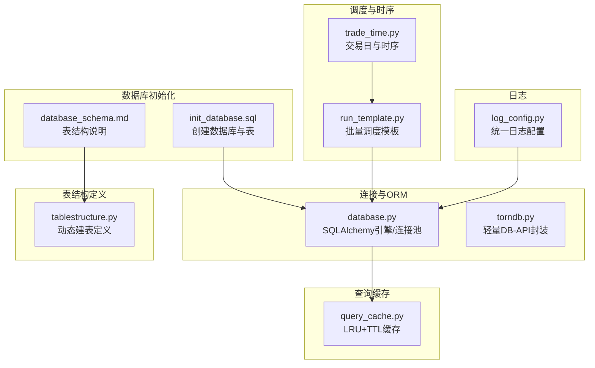
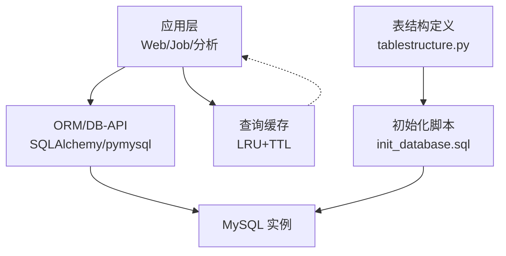
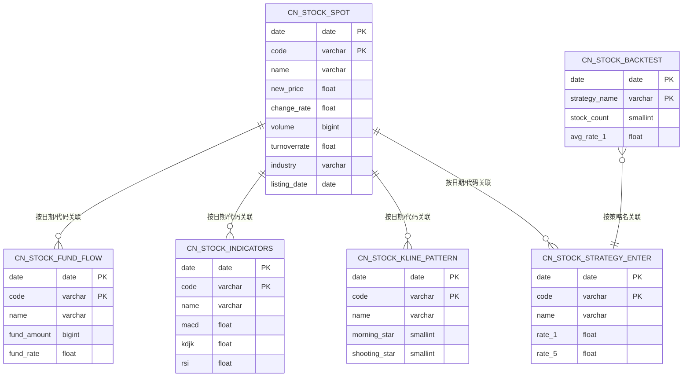
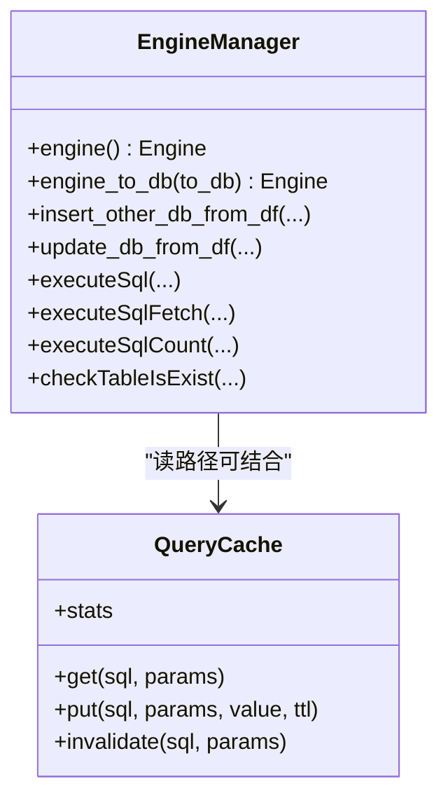
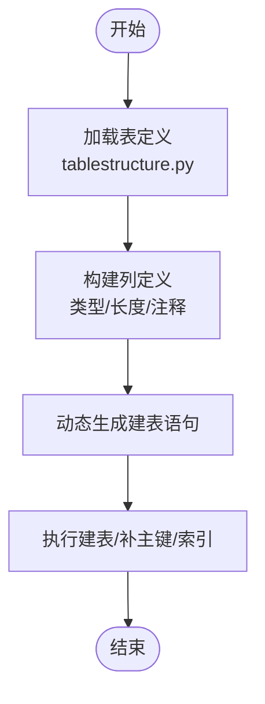
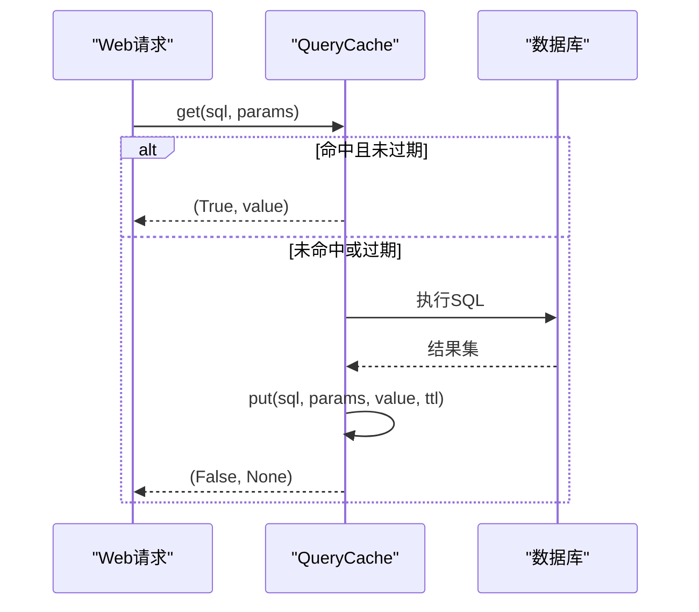
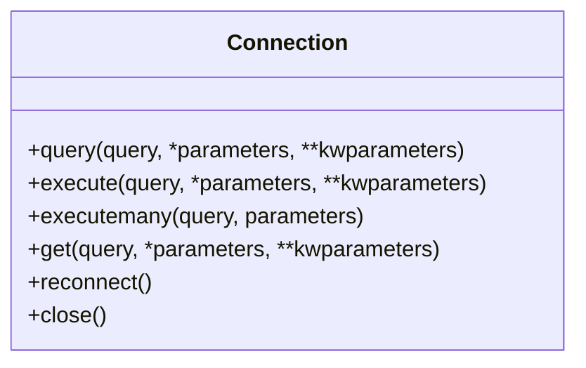
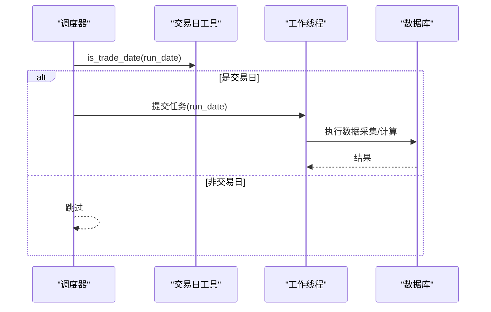
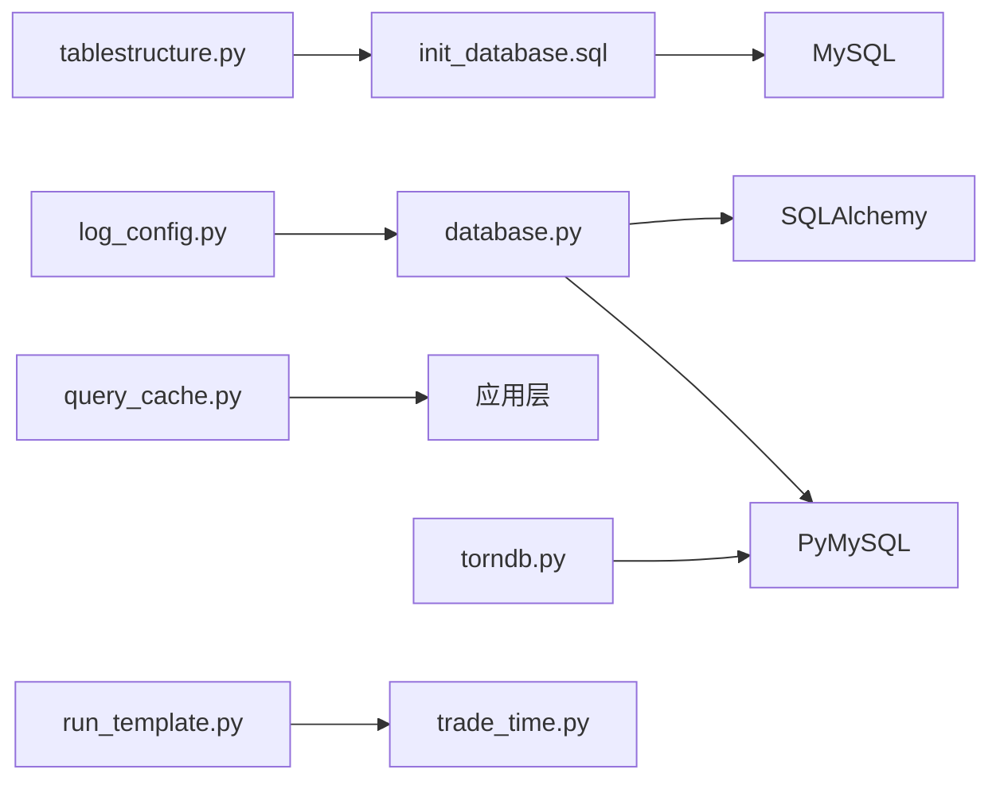

# 数据库设计

<cite>
**本文引用的文件**
- [init_database.sql](file://docker/init_database.sql)
- [database.py](file://docker/stock/quantia/lib/database.py)
- [tablestructure.py](file://docker/stock/quantia/core/tablestructure.py)
- [torndb.py](file://docker/stock/quantia/lib/torndb.py)
- [query_cache.py](file://docker/stock/quantia/lib/query_cache.py)
- [run_template.py](file://docker/stock/quantia/lib/run_template.py)
- [trade_time.py](file://docker/stock/quantia/lib/trade_time.py)
- [log_config.py](file://docker/stock/quantia/lib/log_config.py)
- [database_schema.md](file://document/database_schema.md)
</cite>

## 目录
1. [简介](#简介)
2. [项目结构](#项目结构)
3. [核心组件](#核心组件)
4. [架构总览](#架构总览)
5. [详细组件分析](#详细组件分析)
6. [依赖分析](#依赖分析)
7. [性能考虑](#性能考虑)
8. [故障排查指南](#故障排查指南)
9. [结论](#结论)
10. [附录](#附录)

## 简介
本文件面向数据库管理员与开发者，系统化阐述 Quantia 项目的数据库设计与实现细节，涵盖数据库架构、表结构、索引策略、数据迁移方案、连接池与 ORM 封装、事务与并发控制、查询缓存、运维与调优等主题。目标是帮助读者高效地理解、维护与扩展数据库层。

## 项目结构
数据库相关代码主要分布在以下模块：
- 初始化脚本：负责创建数据库与所有业务表
- 连接与ORM：封装 SQLAlchemy 引擎与连接池，提供通用插入/更新/查询工具
- 表结构定义：集中描述各表字段、类型与约束，支撑动态建表
- 查询缓存：为 Web 层提供 LRU + TTL 的内存缓存
- 交易日与时序：提供交易日判断与批处理调度模板
- 日志：统一日志配置，便于定位数据库操作问题

图表来源
- [init_database.sql](file://docker/init_database.sql#L1-L455)
- [database.py](file://docker/stock/quantia/lib/database.py#L1-L232)
- [tablestructure.py](file://docker/stock/quantia/core/tablestructure.py#L1-L800)
- [query_cache.py](file://docker/stock/quantia/lib/query_cache.py#L1-L156)
- [run_template.py](file://docker/stock/quantia/lib/run_template.py#L1-L95)
- [trade_time.py](file://docker/stock/quantia/lib/trade_time.py#L1-L224)
- [log_config.py](file://docker/stock/quantia/lib/log_config.py#L1-L104)

章节来源
- [init_database.sql](file://docker/init_database.sql#L1-L455)
- [database_schema.md](file://document/database_schema.md#L1-L848)

## 核心组件
- 数据库初始化脚本：创建数据库与所有业务表，包含主键、常用索引与字符集设置
- ORM/连接池封装：基于 SQLAlchemy 的单例引擎，配置连接池大小、回收与预检
- 表结构定义：集中声明各表字段、类型与约束，支持动态建表与列类型映射
- 查询缓存：LRU + TTL 的内存缓存，降低重复查询压力
- 轻量 DB-API：基于 pymysql 的连接封装，简化原生 SQL 执行
- 批处理调度：支持按日期范围/指定日期批量执行，结合交易日过滤
- 日志：统一日志输出，便于定位数据库异常

章节来源
- [database.py](file://docker/stock/quantia/lib/database.py#L58-L138)
- [tablestructure.py](file://docker/stock/quantia/core/tablestructure.py#L25-L800)
- [query_cache.py](file://docker/stock/quantia/lib/query_cache.py#L27-L156)
- [torndb.py](file://docker/stock/quantia/lib/torndb.py#L47-L285)
- [run_template.py](file://docker/stock/quantia/lib/run_template.py#L18-L95)
- [log_config.py](file://docker/stock/quantia/lib/log_config.py#L47-L104)

## 架构总览
数据库层采用“初始化脚本 + 动态建表 + ORM/DB-API + 查询缓存”的组合架构。初始化脚本负责一次性创建所有表；运行时通过 Python 动态建表与 ORM 插入，配合查询缓存提升读性能；批处理作业按交易日调度，确保数据时效性。

图表来源
- [database.py](file://docker/stock/quantia/lib/database.py#L58-L138)
- [init_database.sql](file://docker/init_database.sql#L1-L455)
- [tablestructure.py](file://docker/stock/quantia/core/tablestructure.py#L25-L800)
- [query_cache.py](file://docker/stock/quantia/lib/query_cache.py#L27-L156)

## 详细组件分析

### 数据库初始化与表结构
- 初始化脚本负责创建数据库与所有业务表，设置字符集与排序规则，为主键与高频查询字段建立索引
- 文档化的表结构说明与 ER 关系图，便于理解表间关联与用途
- 核心表包括：每日行情、ETF、资金流、分红、龙虎榜、大宗交易、技术指标、K线形态、策略表、回测汇总与回测明细等

图表来源
- [init_database.sql](file://docker/init_database.sql#L18-L451)
- [database_schema.md](file://document/database_schema.md#L703-L729)

章节来源
- [init_database.sql](file://docker/init_database.sql#L1-L455)
- [database_schema.md](file://document/database_schema.md#L44-L800)

### ORM/连接池与通用数据库工具
- 单例 SQLAlchemy 引擎：避免重复创建连接池，配置池大小、溢出、回收与预检
- 通用插入/更新工具：支持 DataFrame 直接写入、自动补主键与索引、异常日志
- 原生 SQL 执行：提供连接获取、查询、计数与执行方法，便于复杂场景
- 环境变量覆盖：支持通过环境变量注入数据库连接参数，适配容器部署

图表来源
- [database.py](file://docker/stock/quantia/lib/database.py#L58-L232)
- [query_cache.py](file://docker/stock/quantia/lib/query_cache.py#L27-L156)

章节来源
- [database.py](file://docker/stock/quantia/lib/database.py#L58-L232)
- [query_cache.py](file://docker/stock/quantia/lib/query_cache.py#L27-L156)

### 表结构定义与动态建表
- 集中式表定义：以字典形式描述表名、中文名、字段类型与注释，支持动态拼接建表语句
- 字段映射：部分表包含字段映射关系，便于数据源字段到表字段的转换
- 策略表族：统一的 N 日收益率字段结构，便于回测数据的统一存储与查询

图表来源
- [tablestructure.py](file://docker/stock/quantia/core/tablestructure.py#L25-L800)
- [database.py](file://docker/stock/quantia/lib/database.py#L87-L138)

章节来源
- [tablestructure.py](file://docker/stock/quantia/core/tablestructure.py#L25-L800)
- [database.py](file://docker/stock/quantia/lib/database.py#L87-L138)

### 查询缓存机制
- LRU 淘汰与 TTL 过期：命中后移动至末尾，过期自动清理
- 线程安全：使用锁保护缓存状态，支持并发读写
- 统计信息：命中/未命中计数与命中率，便于评估缓存效果
- 应用场景：股票列表分页、策略筛选结果等高频读取

图表来源
- [query_cache.py](file://docker/stock/quantia/lib/query_cache.py#L51-L121)

章节来源
- [query_cache.py](file://docker/stock/quantia/lib/query_cache.py#L27-L156)

### 轻量 DB-API 封装
- 基于 pymysql 的连接封装，提供查询、执行、批量执行等方法
- 自动重连与空闲检测，避免长时间无操作导致的连接断开
- 适合需要原生 SQL 的复杂查询与批量写入场景

图表来源
- [torndb.py](file://docker/stock/quantia/lib/torndb.py#L47-L285)

章节来源
- [torndb.py](file://docker/stock/quantia/lib/torndb.py#L47-L285)

### 批处理调度与交易日时序
- 批量调度模板：支持日期范围与指定日期列表，线程池并发执行，结合交易日过滤
- 交易日与时序：提供交易日判断、前后日期推导、开市/休市/休市时段判断等

图表来源
- [run_template.py](file://docker/stock/quantia/lib/run_template.py#L44-L57)
- [trade_time.py](file://docker/stock/quantia/lib/trade_time.py#L12-L22)

章节来源
- [run_template.py](file://docker/stock/quantia/lib/run_template.py#L18-L95)
- [trade_time.py](file://docker/stock/quantia/lib/trade_time.py#L12-L224)

## 依赖分析
- 初始化脚本依赖 MySQL 语法与字符集设置
- ORM/DB-API 依赖 SQLAlchemy 与 PyMySQL
- 表结构定义依赖 talib（用于 K 线形态）与 SQLAlchemy 类型
- 查询缓存为纯内存组件，无外部依赖
- 调度与交易日工具相互协作，保障批处理的时序正确性
- 日志模块统一输出，便于问题定位

图表来源
- [init_database.sql](file://docker/init_database.sql#L1-L455)
- [tablestructure.py](file://docker/stock/quantia/core/tablestructure.py#L4-L17)
- [database.py](file://docker/stock/quantia/lib/database.py#L7-L10)
- [query_cache.py](file://docker/stock/quantia/lib/query_cache.py#L1-L24)
- [torndb.py](file://docker/stock/quantia/lib/torndb.py#L16-L31)
- [run_template.py](file://docker/stock/quantia/lib/run_template.py#L11)
- [trade_time.py](file://docker/stock/quantia/lib/trade_time.py#L6)
- [log_config.py](file://docker/stock/quantia/lib/log_config.py#L31-L36)

章节来源
- [tablestructure.py](file://docker/stock/quantia/core/tablestructure.py#L4-L17)
- [database.py](file://docker/stock/quantia/lib/database.py#L7-L10)
- [torndb.py](file://docker/stock/quantia/lib/torndb.py#L16-L31)

## 性能考虑
- 连接池配置：针对 2核2G 服务器给出的池大小与溢出参数，建议根据实际负载调整
- 索引策略：高频查询字段（如 code/date）建立索引，注意写多读少场景下的写入成本
- 查询缓存：对分页与筛选结果进行缓存，合理设置 TTL，避免脏读
- 批处理并发：使用线程池并发执行，注意数据库连接上限与锁竞争
- 字符集与排序：统一使用 utf8mb4，避免跨库/跨表排序差异带来的性能问题

## 故障排查指南
- 连接异常：检查连接参数、网络连通性与超时设置；查看日志中的异常堆栈
- 插入失败：确认主键/索引是否存在，必要时通过工具函数自动添加；检查字段类型与长度
- 查询缓慢：分析慢查询日志，确认索引使用情况；对热点查询引入缓存
- 批处理卡住：检查交易日过滤逻辑与日期范围；查看线程池异常与任务完成状态
- 日志定位：统一使用日志配置模块，关注 ERROR 级别日志与堆栈信息

章节来源
- [database.py](file://docker/stock/quantia/lib/database.py#L117-L138)
- [log_config.py](file://docker/stock/quantia/lib/log_config.py#L47-L104)

## 结论
Quantia 的数据库层通过“初始化脚本 + 动态建表 + ORM/DB-API + 查询缓存”的组合，实现了高可用、可扩展与易维护的数据基础设施。建议在生产环境中持续监控连接池与查询性能，结合业务增长迭代索引与缓存策略，确保系统稳定高效运行。

## 附录
- 快速初始化：执行初始化脚本创建数据库与表
- 环境变量：可通过环境变量覆盖数据库连接参数
- 表关系图：详见文档中的 ER 关系图与表汇总

章节来源
- [database_schema.md](file://document/database_schema.md#L703-L774)
- [init_database.sql](file://docker/init_database.sql#L789-L800)
