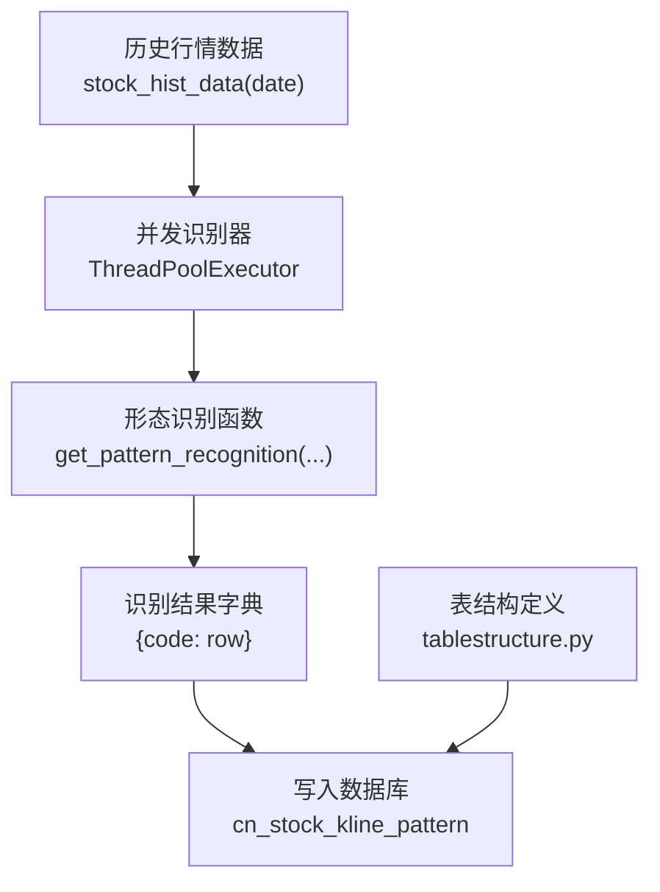
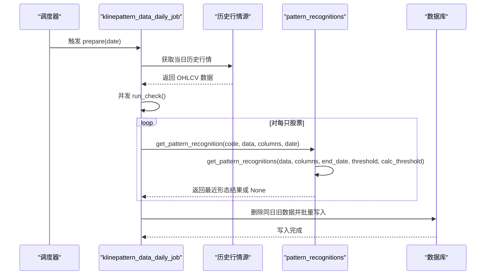
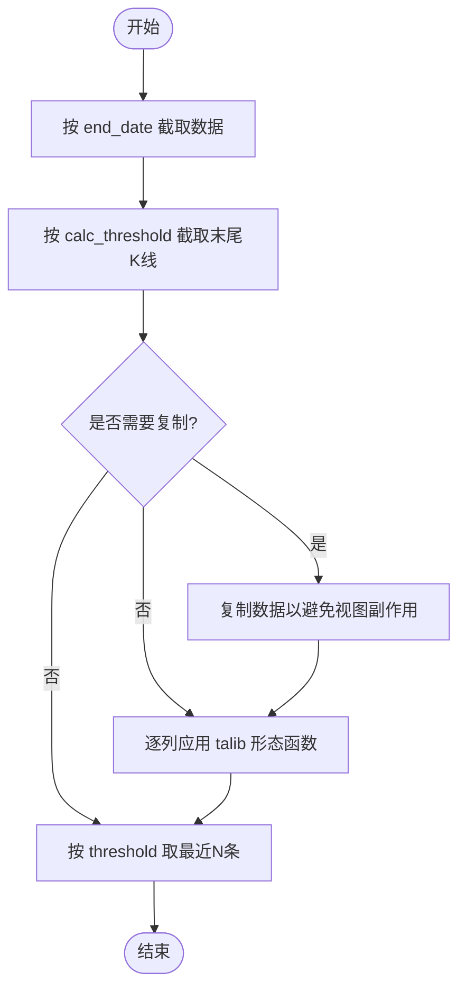
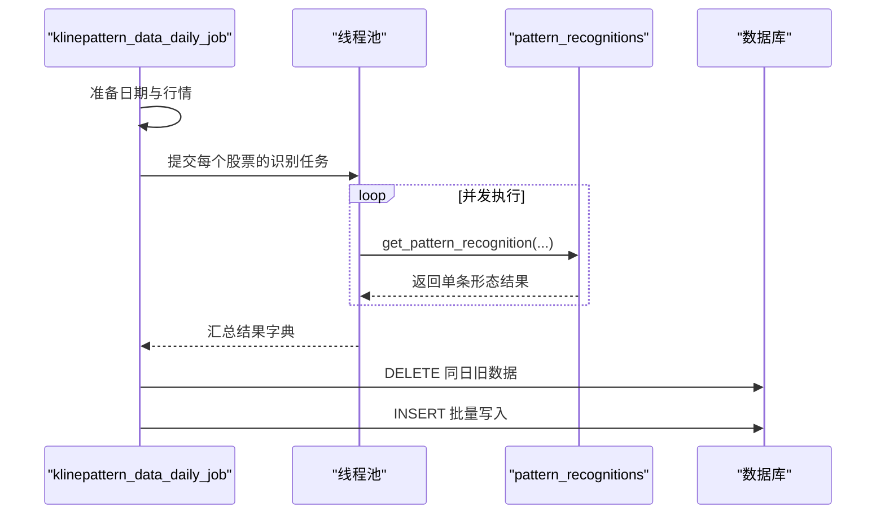
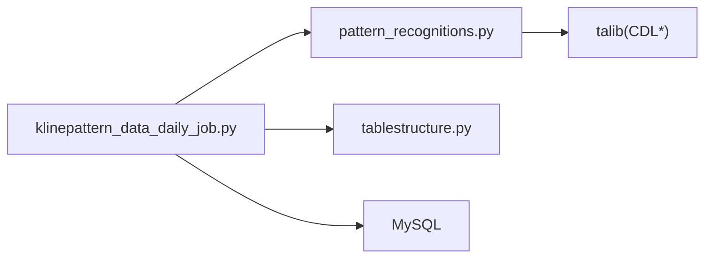

# K线形态识别表

<cite>
**本文引用的文件**
- [pattern_recognitions.py](file://quantia/core/pattern/pattern_recognitions.py)
- [klinepattern_data_daily_job.py](file://quantia/job/klinepattern_data_daily_job.py)
- [tablestructure.py](file://quantia/core/tablestructure.py)
- [README.md](file://README.md)
- [index.html](file://quantia/web/templates/index.html)
</cite>

## 目录
1. [简介](#简介)
2. [项目结构](#项目结构)
3. [核心组件](#核心组件)
4. [架构总览](#架构总览)
5. [详细组件分析](#详细组件分析)
6. [依赖关系分析](#依赖关系分析)
7. [性能考量](#性能考量)
8. [故障排查指南](#故障排查指南)
9. [结论](#结论)
10. [附录](#附录)

## 简介
本文件围绕 Quantia 项目中的 K 线形态识别表 cn_stock_kline_pattern 的设计理念与实现细节展开，系统阐述 61 种 K 线形态的识别规则、信号含义与技术分析价值，并给出信号强度等级（-100 看跌、0 无信号、100 看涨）的映射思路。同时，结合项目现有代码，说明形态识别的数据来源、计算流程、入库机制、与技术指标表的关联关系、准确性评估与数据质量控制机制。

## 项目结构
K 线形态识别涉及以下关键模块：
- 形态识别核心：pattern_recognitions.py 提供通用的形态识别接口与阈值过滤逻辑
- 日常任务调度：klinepattern_data_daily_job.py 负责按日拉取历史行情、并发识别并写入数据库
- 表结构定义：tablestructure.py 定义 cn_stock_kline_pattern 表及 61 种形态列的映射关系
- 文档与前端展示：README.md 与 index.html 提供形态列表与信号含义说明

图表来源
- [klinepattern_data_daily_job.py](file://quantia/job/klinepattern_data_daily_job.py#L63-L83)
- [pattern_recognitions.py](file://quantia/core/pattern/pattern_recognitions.py#L37-L71)
- [tablestructure.py](file://quantia/core/tablestructure.py#L587-L589)

章节来源
- [klinepattern_data_daily_job.py](file://quantia/job/klinepattern_data_daily_job.py#L24-L58)
- [tablestructure.py](file://quantia/core/tablestructure.py#L469-L589)

## 核心组件
- 形态识别函数族
  - get_pattern_recognitions：对指定窗口内的 OHLCV 应用 61 种 talib 形态函数，返回最近一条记录
  - get_pattern_recognition：针对单个股票代码，按阈值与时间窗口提取有效形态
- 日常任务
  - klinepattern_data_daily_job.prepare：按日获取历史行情、并发识别、删除旧数据、写入数据库
  - klinepattern_data_daily_job.run_check：线程池并发调用 get_pattern_recognition
- 表结构
  - cn_stock_kline_pattern：包含外键列与 61 种形态列，形态列类型为 SmallInteger，值域为 {-100, 0, 100}

章节来源
- [pattern_recognitions.py](file://quantia/core/pattern/pattern_recognitions.py#L10-L34)
- [pattern_recognitions.py](file://quantia/core/pattern/pattern_recognitions.py#L37-L71)
- [klinepattern_data_daily_job.py](file://quantia/job/klinepattern_data_daily_job.py#L24-L58)
- [klinepattern_data_daily_job.py](file://quantia/job/klinepattern_data_daily_job.py#L63-L83)
- [tablestructure.py](file://quantia/core/tablestructure.py#L469-L589)

## 架构总览
K 线形态识别的端到端流程如下：

图表来源
- [klinepattern_data_daily_job.py](file://quantia/job/klinepattern_data_daily_job.py#L24-L58)
- [klinepattern_data_daily_job.py](file://quantia/job/klinepattern_data_daily_job.py#L63-L83)
- [pattern_recognitions.py](file://quantia/core/pattern/pattern_recognitions.py#L10-L34)
- [pattern_recognitions.py](file://quantia/core/pattern/pattern_recognitions.py#L37-L71)

## 详细组件分析

### 形态识别函数族
- 输入输出
  - 输入：OHLCV 向量（open/high/low/close）
  - 输出：每种形态的识别结果（-100/0/100），仅保留最近一条记录
- 过滤与截断
  - end_date：按日期切片，确保识别基于目标交易日之前的数据
  - calc_threshold：限制参与计算的 K 线数量（默认 12）
  - threshold：最终仅取最近 N 条（默认 1）

图表来源
- [pattern_recognitions.py](file://quantia/core/pattern/pattern_recognitions.py#L10-L34)

章节来源
- [pattern_recognitions.py](file://quantia/core/pattern/pattern_recognitions.py#L10-L34)
- [pattern_recognitions.py](file://quantia/core/pattern/pattern_recognitions.py#L37-L71)

### 日常任务与并发
- 并发策略
  - ThreadPoolExecutor(max_workers=4) 并发处理各股票
  - 按 code 维度拆分任务，提升吞吐
- 数据写入
  - 若表不存在，先生成字段类型定义
  - 按 date+code 去重写入，保证幂等

图表来源
- [klinepattern_data_daily_job.py](file://quantia/job/klinepattern_data_daily_job.py#L63-L83)
- [klinepattern_data_daily_job.py](file://quantia/job/klinepattern_data_daily_job.py#L24-L58)

章节来源
- [klinepattern_data_daily_job.py](file://quantia/job/klinepattern_data_daily_job.py#L24-L58)
- [klinepattern_data_daily_job.py](file://quantia/job/klinepattern_data_daily_job.py#L63-L83)

### 表结构与列映射
- 表名与外键
  - 表名：cn_stock_kline_pattern
  - 外键列：date、code、name
- 形态列
  - 共 61 种形态，列名为英文，中文注释在表结构中定义
  - 列类型：SmallInteger
  - 默认值：0（未识别）
  - 取值：-100（看跌）、0（无信号）、100（看涨）

```mermaid
erDiagram
CN_STOCK_KLINE_PATTERN {
date date
code varchar
name varchar
tow_crows smallint
upside_gap_two_crows smallint
three_black_crows smallint
identical_three_crows smallint
three_line_strike smallint
dark_cloud_cover smallint
evening_doji_star smallint
doji_Star smallint
hanging_man smallint
hikkake_pattern smallint
modified_hikkake_pattern smallint
in_neck_pattern smallint
on_neck_pattern smallint
thrusting_pattern smallint
shooting_star smallint
stalled_pattern smallint
advance_block smallint
high_wave_candle smallint
engulfing_pattern smallint
abandoned_baby smallint
closing_marubozu smallint
doji smallint
up_down_gap smallint
long_legged_doji smallint
rickshaw_man smallint
marubozu smallint
three_inside_up_down smallint
three_outside_up_down smallint
three_stars_in_the_south smallint
three_white_soldiers smallint
belt_hold smallint
breakaway smallint
concealing_baby_swallow smallint
counterattack smallint
dragonfly_doji smallint
evening_star smallint
gravestone_doji smallint
hammer smallint
harami_pattern smallint
harami_cross_pattern smallint
homing_pigeon smallint
inverted_hammer smallint
kicking smallint
kicking_bull_bear smallint
ladder_bottom smallint
long_line_candle smallint
matching_low smallint
mat_hold smallint
morning_doji_star smallint
morning_star smallint
piercing_pattern smallint
rising_falling_three smallint
separating_lines smallint
short_line_candle smallint
spinning_top smallint
stick_sandwich smallint
takuri smallint
tasuki_gap smallint
tristar_pattern smallint
unique_3_river smallint
upside_downside_gap smallint
}
```

图表来源
- [tablestructure.py](file://quantia/core/tablestructure.py#L469-L589)

章节来源
- [tablestructure.py](file://quantia/core/tablestructure.py#L469-L589)

### 形态识别规则与信号强度
- 规则来源
  - 61 种形态的中文名称与识别函数映射来自表结构定义
  - 形态函数来源于 talib（如 CDL* 系列）
- 信号含义与强度
  - -100：看跌形态
  - 0：未识别或未触发
  - 100：看涨形态
- 适用市场环境与强度等级
  - 本节为通用技术分析建议，具体强度等级需结合形态函数返回值与市场背景进行判断；项目中以 -100/0/100 三值编码表达方向性

章节来源
- [tablestructure.py](file://quantia/core/tablestructure.py#L469-L589)
- [README.md](file://README.md#L85-L109)
- [index.html](file://quantia/web/templates/index.html#L96-L113)

### 形态识别算法与数据质量控制
- 算法实现
  - 通过 talib 的 CDL* 函数族进行形态识别，返回标准化的三值信号
- 数据质量控制
  - 日期切片：end_date 限定识别窗口，避免未来数据泄露
  - 计算阈值：calc_threshold 限制参与计算的 K 线数量，减少噪声影响
  - 最终截断：threshold 仅取最近记录，保证时效性
  - 幂等写入：按 date+code 去重，避免重复入库

章节来源
- [pattern_recognitions.py](file://quantia/core/pattern/pattern_recognitions.py#L10-L34)
- [klinepattern_data_daily_job.py](file://quantia/job/klinepattern_data_daily_job.py#L37-L57)

### 与技术指标表的关联关系
- 关联点
  - cn_stock_kline_pattern 与 cn_stock_indicators 均以 date+code 作为外键基础
  - 可通过外键 join 实现“形态 + 指标”的联合分析
- 建议
  - 在查询层统一以 date、code 为连接键
  - 将形态列视为“信号因子”，与指标列共同构成多因子打分体系

章节来源
- [tablestructure.py](file://quantia/core/tablestructure.py#L396-L407)
- [tablestructure.py](file://quantia/core/tablestructure.py#L587-L589)

## 依赖关系分析
- 组件耦合
  - klinepattern_data_daily_job 依赖 pattern_recognitions 接口与 tablestructure 表结构定义
  - 形态识别依赖 talib 的 CDL* 函数族
- 外部依赖
  - 数据库：MySQL，使用表结构定义生成字段类型
  - 并发：Python ThreadPoolExecutor

图表来源
- [klinepattern_data_daily_job.py](file://quantia/job/klinepattern_data_daily_job.py#L11-L18)
- [pattern_recognitions.py](file://quantia/core/pattern/pattern_recognitions.py#L4)
- [tablestructure.py](file://quantia/core/tablestructure.py#L6)

章节来源
- [klinepattern_data_daily_job.py](file://quantia/job/klinepattern_data_daily_job.py#L11-L18)
- [pattern_recognitions.py](file://quantia/core/pattern/pattern_recognitions.py#L4)
- [tablestructure.py](file://quantia/core/tablestructure.py#L6)

## 性能考量
- 并发度：线程池 max_workers=4，适合 CPU 密集型的 talib 计算
- I/O 优化：批量写入 cn_stock_kline_pattern，减少往返
- 数据截断：通过 end_date、calc_threshold、threshold 控制计算规模，降低内存与时间开销
- 建议
  - 在高并发场景可考虑进程池替代线程池（受 Python GIL 限制）
  - 对历史数据进行分区存储，按日期裁剪可进一步加速

## 故障排查指南
- 常见问题
  - 无形态数据返回：检查 calc_threshold 是否过大导致空窗；确认 end_date 是否正确
  - 写入失败：检查表是否存在、字段类型定义是否匹配
  - 并发异常：查看线程池异常日志，定位具体股票的识别过程
- 日志定位
  - klinepattern_data_daily_job.prepare：整体流程与异常
  - klinepattern_data_daily_job.run_check：并发执行与异常
  - pattern_recognitions.get_pattern_recognition：单股票识别异常

章节来源
- [klinepattern_data_daily_job.py](file://quantia/job/klinepattern_data_daily_job.py#L24-L61)
- [klinepattern_data_daily_job.py](file://quantia/job/klinepattern_data_daily_job.py#L63-L83)
- [pattern_recognitions.py](file://quantia/core/pattern/pattern_recognitions.py#L37-L71)

## 结论
cn_stock_kline_pattern 通过标准化的 61 种 talib 形态识别，以 -100/0/100 三值信号刻画短期方向性，配合并发与去重写入机制，实现了稳定高效的日级更新。建议在实际应用中结合技术指标表与回测数据，构建多因子信号体系，并持续监控形态命中率与后续收益表现，以迭代优化形态权重与阈值设置。

## 附录
- 形态列表（摘自文档与前端模板）
  - 1、两只乌鸦；2、三只乌鸦；3、三内部上涨和下跌；4、三线打击；5、三外部上涨和下跌；6、南方三星；7、三个白兵；8、弃婴；9、大敌当前；10、捉腰带线；11、脱离；12、收盘缺影线；13、藏婴吞没；14、反击线；15、乌云压顶；16、十字；17、十字星；18、蜻蜓十字/T形十字；19、吞噬模式；20、十字暮星；21、暮星；22、向上/下跳空并列阳线；23、墓碑十字/倒T十字；24、锤头；25、上吊线；26、母子线；27、十字孕线；28、风高浪大线；29、陷阱；30、修正陷阱；31、家鸽；32、三胞胎乌鸦；33、颈内线；34、倒锤头；35、反冲形态；36、由较长缺影线决定的反冲形态；37、梯底；38、长脚十字；39、长蜡烛；40、光头光脚/缺影线；41、相同低价；42、铺垫；43、十字晨星；44、晨星；45、颈上线；46、刺透形态；47、黄包车夫；48、上升/下降三法；49、分离线；50、射击之星；51、短蜡烛；52、纺锤；53、停顿形态；54、条形三明治；55、探水竿；56、跳空并列阴阳线；57、插入；58、三星；59、奇特三河床；60、向上跳空的两只乌鸦；61、上升/下降跳空三法
- 信号含义（摘自文档）
  - 负：出现卖出信号；0：没有出现该形态；正：出现买入信号

章节来源
- [README.md](file://README.md#L85-L109)
- [index.html](file://quantia/web/templates/index.html#L96-L113)
