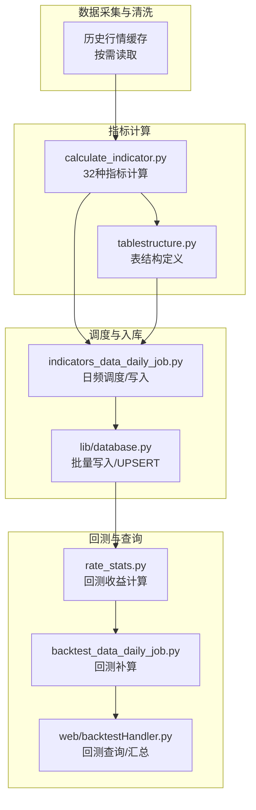
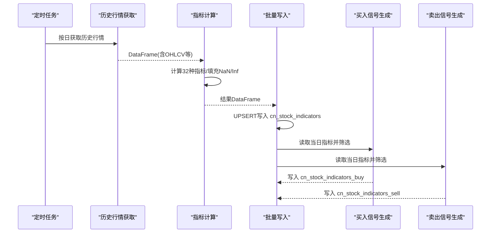
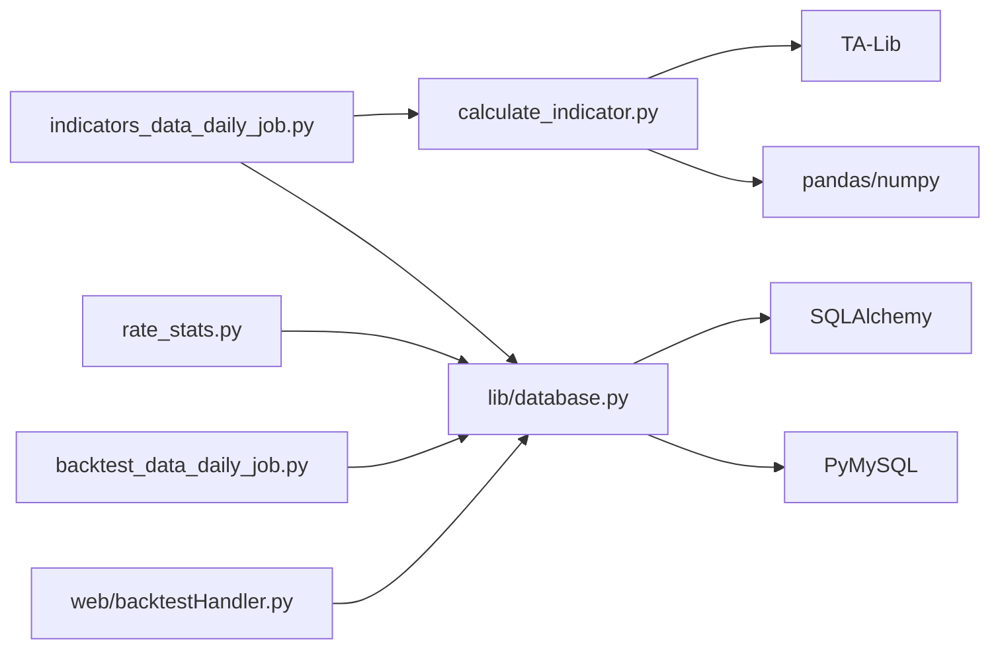

# 技术指标数据表

<cite>
**本文引用的文件**
- [calculate_indicator.py](file://quantia/core/indicator/calculate_indicator.py)
- [indicators_data_daily_job.py](file://quantia/job/indicators_data_daily_job.py)
- [tablestructure.py](file://quantia/core/tablestructure.py)
- [database_schema.md](file://document/database_schema.md)
- [rate_stats.py](file://quantia/core/backtest/rate_stats.py)
- [database.py](file://quantia/lib/database.py)
- [backtest_data_daily_job.py](file://quantia/job/backtest_data_daily_job.py)
- [backtestHandler.py](file://quantia/web/backtestHandler.py)
</cite>

## 目录
1. [简介](#简介)
2. [项目结构](#项目结构)
3. [核心组件](#核心组件)
4. [架构概览](#架构概览)
5. [详细组件分析](#详细组件分析)
6. [依赖关系分析](#依赖关系分析)
7. [性能考量](#性能考量)
8. [故障排查指南](#故障排查指南)
9. [结论](#结论)
10. [附录](#附录)

## 简介
本文件面向 Quantia 项目中的技术指标数据表（cn_stock_indicators）及其相关表（cn_stock_indicators_buy、cn_stock_indicators_sell），系统性阐述其设计理念、实现细节与使用方式。内容涵盖：
- 32 种技术指标的字段定义、计算方法与数据含义
- 买入/卖出信号表的回测字段设计、时间跨度与触发机制
- 计算精度、数据更新策略与异常值处理
- 与业务表的关联关系、回测数据的存储与查询优化

## 项目结构
与技术指标相关的代码主要分布在以下模块：
- 指标计算：core/indicator/calculate_indicator.py
- 日频调度与写入：job/indicators_data_daily_job.py
- 表结构定义：core/tablestructure.py
- 数据库建表文档：document/database_schema.md
- 回测收益计算：core/backtest/rate_stats.py
- 数据库连接与批量写入：lib/database.py
- 回测数据补算与增量更新：job/backtest_data_daily_job.py
- Web 层回测查询与汇总：web/backtestHandler.py

图表来源
- [calculate_indicator.py](file://quantia/core/indicator/calculate_indicator.py#L23-L407)
- [indicators_data_daily_job.py](file://quantia/job/indicators_data_daily_job.py#L24-L171)
- [tablestructure.py](file://quantia/core/tablestructure.py#L316-L407)
- [database.py](file://quantia/lib/database.py#L120-L203)
- [rate_stats.py](file://quantia/core/backtest/rate_stats.py#L34-L107)
- [backtest_data_daily_job.py](file://quantia/job/backtest_data_daily_job.py#L45-L106)
- [backtestHandler.py](file://quantia/web/backtestHandler.py#L336-L391)

章节来源
- [calculate_indicator.py](file://quantia/core/indicator/calculate_indicator.py#L23-L407)
- [indicators_data_daily_job.py](file://quantia/job/indicators_data_daily_job.py#L24-L171)
- [tablestructure.py](file://quantia/core/tablestructure.py#L316-L407)
- [database_schema.md](file://document/database_schema.md#L342-L457)
- [rate_stats.py](file://quantia/core/backtest/rate_stats.py#L34-L107)
- [database.py](file://quantia/lib/database.py#L120-L203)
- [backtest_data_daily_job.py](file://quantia/job/backtest_data_daily_job.py#L45-L106)
- [backtestHandler.py](file://quantia/web/backtestHandler.py#L336-L391)

## 核心组件
- 技术指标计算引擎：基于 TA-Lib 的 32 种指标流水线，统一填充 NaN/Inf，确保数值稳定性
- 日频调度器：按日拉取历史行情，计算指标，写入 cn_stock_indicators，并生成买入/卖出信号表
- 表结构与回测字段：统一的外键结构 + 动态扩展的回测收益字段（1~100日）
- 回测收益计算：基于 T+1 开盘价作为买入基准，扣除交易成本，支持涨停过滤
- 数据库写入：UPSERT 与主键自动创建，保障幂等与并发安全

章节来源
- [calculate_indicator.py](file://quantia/core/indicator/calculate_indicator.py#L23-L407)
- [indicators_data_daily_job.py](file://quantia/job/indicators_data_daily_job.py#L24-L171)
- [tablestructure.py](file://quantia/core/tablestructure.py#L316-L407)
- [rate_stats.py](file://quantia/core/backtest/rate_stats.py#L34-L107)
- [database.py](file://quantia/lib/database.py#L120-L203)

## 架构概览
技术指标数据表的端到端流程如下：

图表来源
- [indicators_data_daily_job.py](file://quantia/job/indicators_data_daily_job.py#L24-L171)
- [calculate_indicator.py](file://quantia/core/indicator/calculate_indicator.py#L23-L407)
- [database.py](file://quantia/lib/database.py#L120-L203)

## 详细组件分析

### 技术指标数据表（cn_stock_indicators）
- 设计理念
  - 以“日期+股票代码”为主键，确保日频唯一性
  - 外键结构统一，便于与其它业务表关联
  - 指标字段集中存储，便于前端展示与回测复用
- 字段构成
  - 基础外键：date、code、name
  - 价格字段：close
  - 32 种技术指标字段（详见下节）
- 数据来源与更新
  - 每日调度器按日拉取历史行情，计算指标后写入
  - 首次创建表时自动添加主键；后续写入采用 UPSERT 避免重复

章节来源
- [database_schema.md](file://document/database_schema.md#L342-L421)
- [tablestructure.py](file://quantia/core/tablestructure.py#L396-L398)
- [indicators_data_daily_job.py](file://quantia/job/indicators_data_daily_job.py#L24-L60)
- [database.py](file://quantia/lib/database.py#L120-L203)

### 32 种技术指标字段定义与计算要点
- MACD：DIF、信号线、柱状图，使用 TA-Lib 标准参数
- KDJ：K、D、J，慢速K/D平滑
- 布林带：上轨、中轨、下轨，20日周期、2倍标准差
- RSI：6/12/14/24周期，标准化数值
- 其他常用指标：TRIX、TEMA、CR、VR、ROC、DMI（PDI/MDI/DX/ADX/ADXR）、WR、CCI、DMA、OBV、SAR、PSY、BR/AR、EMV、BIAS、MFI、VWMA、PPO、WT、Supertrend、DPO、VHF、RVI、FI、ENE、StochRSI

计算实现要点
- 统一使用 pandas/TA-Lib，对 NaN/Inf 进行安全填充
- 对部分指标（如 CR、VR、MFI、VWMA、RVI、FI 等）进行数值范围与 Inf 处理
- 对部分指标（如 ROC、ROCMA、ROCema）提供均线/指数平滑版本
- 对 Supertrend 等算法指标采用纯 Python 实现，确保可控性

章节来源
- [calculate_indicator.py](file://quantia/core/indicator/calculate_indicator.py#L42-L407)
- [tablestructure.py](file://quantia/core/tablestructure.py#L320-L394)

### 买入/卖出信号表（cn_stock_indicators_buy、cn_stock_indicators_sell）
- 设计目标
  - 基于 cn_stock_indicators 的当日指标，筛选具备短期交易潜力的标的
  - 与回测收益表共享外键结构，便于后续回测
- 触发机制
  - 买入：多因子组合（如 KDJ/K/J 超买、RSI 超买、CCI/CR/Wr/Vr 超买等）
  - 卖出：多因子组合（如 KDJ/K/D/J 超卖、RSI 超卖、CCI/CR/Wr/Vr 超卖等）
- 回测字段
  - 1~100 日收益率字段，用于评估短期持有收益
  - 与回测汇总表（cn_stock_backtest）字段一致，便于跨表对比

章节来源
- [indicators_data_daily_job.py](file://quantia/job/indicators_data_daily_job.py#L92-L158)
- [tablestructure.py](file://quantia/core/tablestructure.py#L316-L318)
- [database_schema.md](file://document/database_schema.md#L425-L457)

### 回测收益计算（rate_stats.py）
- 计算逻辑
  - 以 T+1 开盘价作为买入基准，避免“未来函数”
  - 支持涨停过滤：若 T+1 开盘价较 T 日收盘价涨幅≥9.5%，视为无法成交，返回空
  - 扣除交易成本：佣金、印花税、滑点，单次交易总成本≈0.20%
  - 输出 1~N 日收益率序列（N 通常为 100）
- 输入输出
  - 输入：信号日（date, code）+ 前复权历史行情（含 date/open/close/high/low）
  - 输出：Series[date, code, rate_1, ..., rate_N]

章节来源
- [rate_stats.py](file://quantia/core/backtest/rate_stats.py#L34-L107)

### 数据库写入与幂等（lib/database.py）
- 批量写入
  - 使用 pandas.to_sql + 自定义 UPSERT 方法（INSERT ... ON DUPLICATE KEY UPDATE）
  - 首次创建表时自动添加主键；后续写入避免重复插入
- 并发与重试
  - 对瞬态错误（死锁、锁超时、连接异常）进行有限重试
  - 连接池健康检查与自动重建，提升稳定性
- 主键与索引
  - 自动创建主键（date, code）
  - 为 code 字段建立二级索引，加速查询

章节来源
- [database.py](file://quantia/lib/database.py#L94-L203)

### 日频调度与信号生成（job/indicators_data_daily_job.py）
- 调度流程
  - 获取当日历史行情 -> 计算指标 -> 写入 cn_stock_indicators
  - 基于筛选条件生成买入/卖出信号 -> 写入对应信号表
- 并发策略
  - 多线程并行计算单只股票指标，提高吞吐
  - 写入阶段按日删除旧数据，保证幂等

章节来源
- [indicators_data_daily_job.py](file://quantia/job/indicators_data_daily_job.py#L24-L171)

### 回测数据补算与查询（job/backtest_data_daily_job.py、web/backtestHandler.py）
- 补算策略
  - 按策略表扫描未回测记录，按需从缓存读取历史行情，批量计算并更新
  - 支持外层/内层并发，控制内存占用，适配低配服务器
- 查询与汇总
  - 支持按 horizon_list 动态聚合，计算日均收益与胜率
  - 若表结构不匹配或缺失回测数据，自动切换到“按需计算”模式

章节来源
- [backtest_data_daily_job.py](file://quantia/job/backtest_data_daily_job.py#L45-L106)
- [backtestHandler.py](file://quantia/web/backtestHandler.py#L336-L391)

## 依赖关系分析
- 指标计算依赖 TA-Lib 与 pandas/numpy
- 写入依赖 SQLAlchemy 与 PyMySQL
- 回测依赖前复权历史数据与交易成本参数
- Web 层依赖数据库连接池与参数化查询

图表来源
- [calculate_indicator.py](file://quantia/core/indicator/calculate_indicator.py#L4-L8)
- [indicators_data_daily_job.py](file://quantia/job/indicators_data_daily_job.py#L14-L18)
- [database.py](file://quantia/lib/database.py#L8-L12)
- [rate_stats.py](file://quantia/core/backtest/rate_stats.py#L5-L6)
- [backtest_data_daily_job.py](file://quantia/job/backtest_data_daily_job.py#L94-L106)
- [backtestHandler.py](file://quantia/web/backtestHandler.py#L336-L391)

## 性能考量
- 指标计算
  - 使用向量化与 TA-Lib，避免显式循环
  - 对 NaN/Inf 的批量替换，减少后续异常传播
- 写入性能
  - UPSERT 减少重复插入与死锁
  - 连接池大小与超时参数针对 2核2G 服务器优化
- 回测补算
  - 按需从磁盘缓存读取，避免一次性加载全部历史数据
  - 外层/内层并发参数可调，平衡吞吐与资源占用

章节来源
- [calculate_indicator.py](file://quantia/core/indicator/calculate_indicator.py#L13-L21)
- [database.py](file://quantia/lib/database.py#L60-L71)
- [backtest_data_daily_job.py](file://quantia/job/backtest_data_daily_job.py#L89-L92)

## 故障排查指南
- 指标计算异常
  - 检查 NaN/Inf 处理是否生效；确认输入数据完整性
  - 关注特定指标（如 CR、VR、MFI、VWMA、RVI、FI）的分母为零或极端值
- 写入失败
  - 查看瞬态错误码（死锁、锁超时、连接异常）并重试
  - 确认主键与索引创建状态
- 回测收益为空
  - 检查 T+1 是否存在涨停过滤（gap ≥ 9.5%）
  - 确认历史数据前复权与 open/close 字段可用
- 查询无数据
  - 策略表可能尚未生成回测数据，切换到“按需计算”模式
  - 核对 horizon_list 与 success_day 参数

章节来源
- [calculate_indicator.py](file://quantia/core/indicator/calculate_indicator.py#L18-L21)
- [database.py](file://quantia/lib/database.py#L109-L117)
- [rate_stats.py](file://quantia/core/backtest/rate_stats.py#L70-L84)
- [backtestHandler.py](file://quantia/web/backtestHandler.py#L336-L391)

## 结论
本技术指标数据表体系以“标准化指标 + 幂等写入 + 可靠回测”为核心，实现了从日频行情到指标、信号与回测收益的完整闭环。通过严格的 NaN/Inf 处理、交易成本扣除与涨停过滤，显著提升了回测的真实性与可解释性。建议在生产环境中结合并发参数与缓存策略，持续优化吞吐与稳定性。

## 附录

### 字段与含义对照（示例）
- MACD：DIF、信号线、柱状图
- KDJ：K、D、J
- 布林带：上轨、中轨、下轨
- RSI：6/12/14/24 周期
- 其他：ROC、ROCMA、ROCema、DMI、WR、CCI、DMA、OBV、SAR、PSY、BR/AR、EMV、BIAS、MFI、VWMA、PPO、WT、Supertrend、DPO、VHF、RVI、FI、ENE、StochRSI

章节来源
- [tablestructure.py](file://quantia/core/tablestructure.py#L320-L394)
- [database_schema.md](file://document/database_schema.md#L342-L421)
