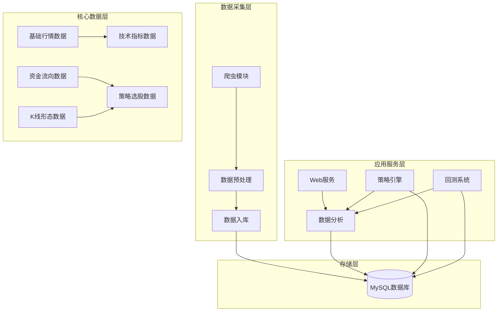
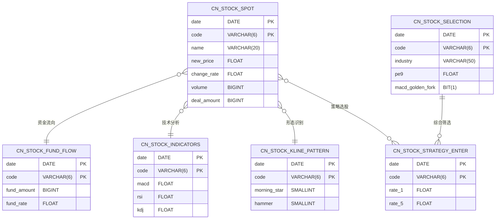
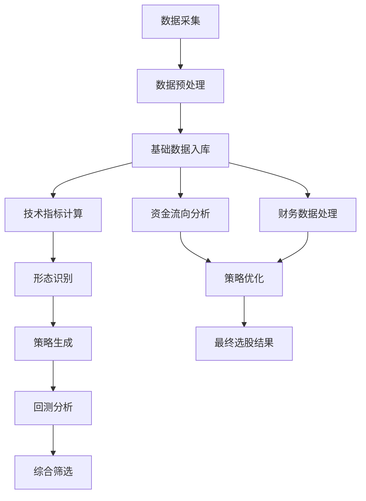
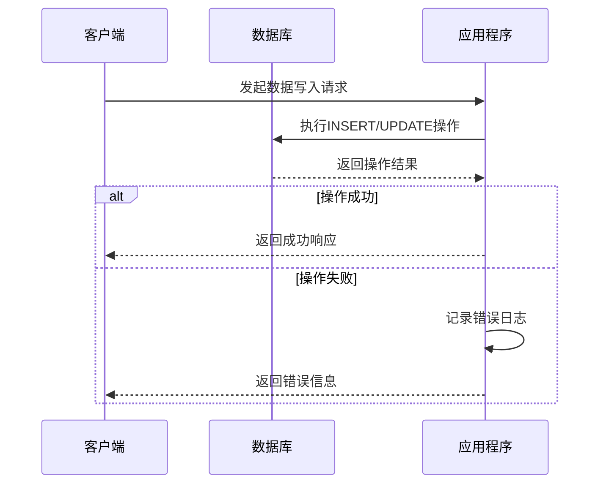
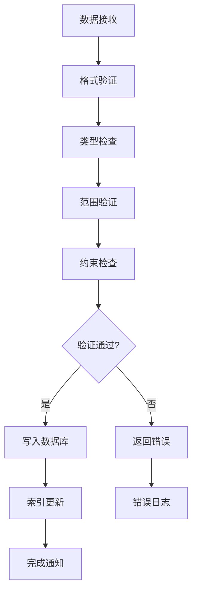
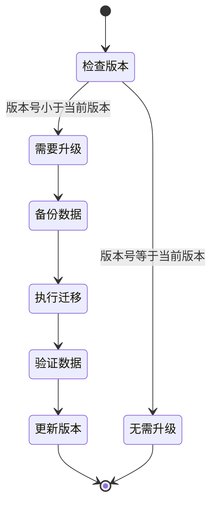
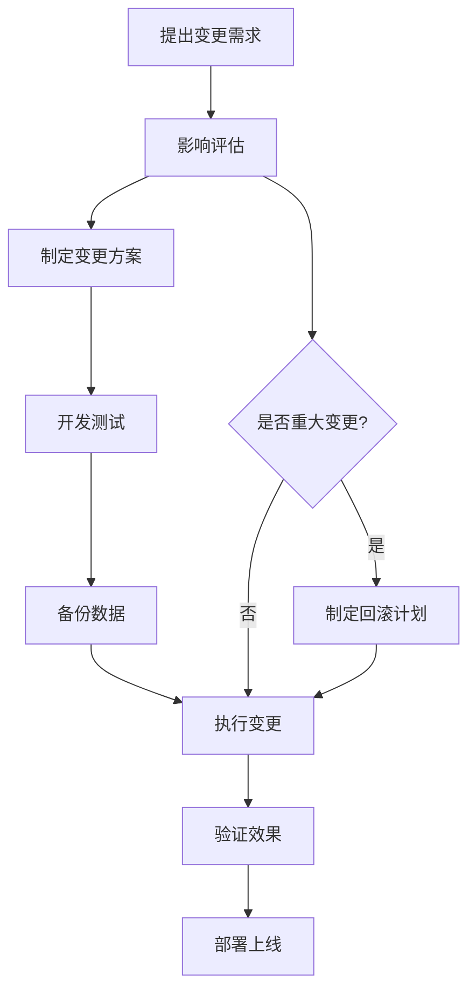
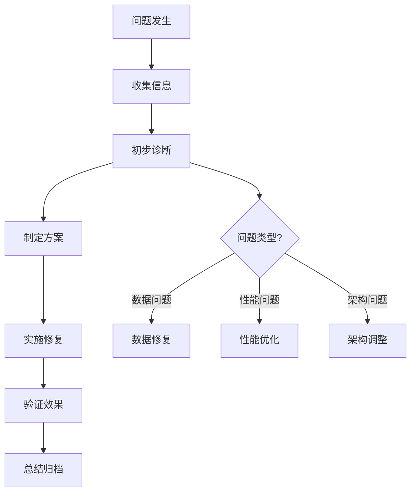

# 数据表结构设计

<cite>
**本文档引用的文件**
- [init_database.sql](file://docker/init_database.sql)
- [database_schema.md](file://document/database_schema.md)
- [tablestructure.py](file://docker/stock/quantia/core/tablestructure.py)
- [database.py](file://docker/stock/quantia/lib/database.py)
- [init_job.py](file://docker/stock/quantia/job/init_job.py)
- [streaming_analysis_job.py](file://docker/stock/quantia/job/streaming_analysis_job.py)
- [version.py](file://docker/stock/quantia/lib/version.py)
</cite>

## 目录
1. [项目概述](#项目概述)
2. [数据库架构概览](#数据库架构概览)
3. [核心数据表结构详解](#核心数据表结构详解)
4. [表关系与依赖分析](#表关系与依赖分析)
5. [索引策略与性能优化](#索引策略与性能优化)
6. [数据完整性与约束设计](#数据完整性与约束设计)
7. [版本管理与迁移策略](#版本管理与迁移策略)
8. [数据字典与字段说明](#数据字典与字段说明)
9. [表结构变更指南](#表结构变更指南)
10. [最佳实践与故障排除](#最佳实践与故障排除)
11. [总结](#总结)

## 项目概述

Quantia是一个基于Python的股票数据采集、分析和选股系统。该项目采用MySQL作为主要数据存储，通过自动化脚本实现数据的实时采集和历史数据的批量处理。

### 系统特性
- **实时数据采集**: 支持股票、ETF、资金流向等多维度数据采集
- **技术指标计算**: 集成32种技术指标计算功能
- **K线形态识别**: 支持61种K线形态识别算法
- **策略选股**: 提供14种不同类型的选股策略
- **回测分析**: 支持策略回测和绩效评估

## 数据库架构概览

### 整体架构设计

**图表来源**
- [database_schema.md](file://document/database_schema.md#L703-L729)

### 数据库配置

| 配置项 | 默认值 | 说明 |
|--------|--------|------|
| `db_host` | `localhost` | 数据库服务主机 |
| `db_user` | `root` | 数据库访问用户 |
| `db_password` | `root` | 数据库访问密码 |
| `db_database` | `quantiadb` | 数据库名称 |
| `db_port` | `3306` | 数据库服务端口 |
| `db_charset` | `utf8mb4` | 数据库字符集 |

**章节来源**
- [database_schema.md](file://document/database_schema.md#L3-L40)

## 核心数据表结构详解

### 1. 我的关注表 (cn_stock_attention)

**业务用途**: 存储用户关注的股票列表，支持按关注时间和股票代码进行查询。

**表结构设计**:
- 主键: `code` (单一字段主键，便于快速查找)
- 索引: `datetime` (辅助索引，支持按时间排序)
- 数据类型: `datetime` (关注时间), `varchar(6)` (股票代码)

**章节来源**
- [init_database.sql](file://docker/init_database.sql#L10-L15)
- [tablestructure.py](file://docker/stock/quantia/core/tablestructure.py#L25-L27)

### 2. 每日股票数据表 (cn_stock_spot)

**业务用途**: 存储每日股票行情数据，包含基础行情和基本面信息。

**核心字段**:
- 基础行情: `new_price`, `change_rate`, `volume`, `deal_amount`
- 技术分析: `amplitude`, `turnoverrate`, `volume_ratio`
- 基本面指标: `pe9`, `pbnewmrq`, `roe_weight`, `debt_asset_ratio`
- 市值信息: `total_market_cap`, `free_cap`

**主键设计**: 复合主键 `(date, code)`，确保每天每只股票的唯一性

**索引策略**: 
- 主键索引: `(date, code)`
- 辅助索引: `code` (快速按股票代码查询)
- 名称索引: `name` (支持按股票名称查询)

**章节来源**
- [init_database.sql](file://docker/init_database.sql#L18-L63)
- [tablestructure.py](file://docker/stock/quantia/core/tablestructure.py#L63-L104)

### 3. 每日ETF数据表 (cn_etf_spot)

**业务用途**: 存储ETF产品每日行情数据，与股票数据表结构类似但字段更精简。

**设计特点**:
- 结构简化: 移除了部分基本面字段
- 专注ETF: 专门服务于ETF产品的数据需求
- 性能优化: 减少存储空间占用

**章节来源**
- [init_database.sql](file://docker/init_database.sql#L372-L389)
- [tablestructure.py](file://docker/stock/quantia/core/tablestructure.py#L46-L61)

### 4. 资金流向数据表

#### 4.1 股票资金流向表 (cn_stock_fund_flow)

**业务用途**: 存储个股资金流向数据，支持今日、3日、5日、10日等多周期分析。

**数据组织**:
- 今日资金流向: `fund_amount`, `fund_rate` (主、超大、大、中、小单)
- 多周期对比: 支持3日、5日、10日的资金流向对比分析

**章节来源**
- [init_database.sql](file://docker/init_database.sql#L112-L162)
- [tablestructure.py](file://docker/stock/quantia/core/tablestructure.py#L170-L174)

#### 4.2 行业资金流向表 (cn_stock_fund_flow_industry)

**业务用途**: 存储行业板块资金流向，提供宏观层面的资金流向分析。

**设计特色**:
- 板块级别聚合: 按照行业名称分组
- 最大股追踪: 记录各周期内资金流入最大的个股
- 多周期分析: 支持今日、5日、10日对比

**章节来源**
- [init_database.sql](file://docker/init_database.sql#L165-L205)
- [tablestructure.py](file://docker/stock/quantia/core/tablestructure.py#L219-L222)

#### 4.3 概念资金流向表 (cn_stock_fund_flow_concept)

**业务用途**: 存储概念板块资金流向，支持主题投资策略分析。

**章节来源**
- [init_database.sql](file://docker/init_database.sql#L208-L248)
- [tablestructure.py](file://docker/stock/quantia/core/tablestructure.py#L224-L227)

### 5. 财务数据表

#### 5.1 股票分红配送表 (cn_stock_bonus)

**业务用途**: 记录股票分红送转信息，支持除权除息日的精确计算。

**关键字段**:
- 分红计划: `bonusaward_rate`, `bonusaward_yield`
- 送转信息: `convertible_total_rate`, `convertible_rate`
- 时间节点: `plan_date`, `record_date`, `ex_dividend_date`

**章节来源**
- [init_database.sql](file://docker/init_database.sql#L306-L327)
- [tablestructure.py](file://docker/stock/quantia/core/tablestructure.py#L229-L248)

#### 5.2 股票龙虎榜表 (cn_stock_lhb)

**业务用途**: 存储龙虎榜上榜数据，支持机构资金流向分析。

**分析维度**:
- 上榜影响: `net_amount_buy`, `sum_buy`, `sum_sell`
- 市场影响: `lhb_amount`, `market_amount`, `turnoverrate`
- 后续表现: `ranking_after_1`, `ranking_after_5`, `ranking_after_10`

**章节来源**
- [init_database.sql](file://docker/init_database.sql#L330-L353)
- [tablestructure.py](file://docker/stock/quantia/core/tablestructure.py#L261-L282)

#### 5.3 大宗交易表 (cn_stock_blocktrade)

**业务用途**: 记录大宗交易平台的交易数据，支持大额资金流向追踪。

**关键指标**:
- 交易规模: `sum_volume`, `sum_turnover`
- 折溢率: `overflow_rate` (反映交易价格偏离程度)
- 市场影响: `turnover_market_rate` (占流通市值比例)

**章节来源**
- [init_database.sql](file://docker/init_database.sql#L356-L369)
- [tablestructure.py](file://docker/stock/quantia/core/tablestructure.py#L284-L296)

### 6. 技术分析数据表

#### 6.1 股票指标数据表 (cn_stock_indicators)

**业务用途**: 存储32种技术指标计算结果，为技术分析提供数据支撑。

**指标分类**:
- 动量类: `macd`, `rsi`, `cci`, `wr`
- 趋势类: `adx`, `dmi`, `sar`, `supertrend`
- 摆动类: `kdj`, `boll`, `stochrsi`
- 成交量类: `obv`, `mfi`, `vwap`

**主键设计**: `(date, code)`，确保指标数据的时间序列完整性

**章节来源**
- [init_database.sql](file://docker/init_database.sql#L396-L421)
- [tablestructure.py](file://docker/stock/quantia/core/tablestructure.py#L396-L398)

#### 6.2 指标买卖信号表

**业务用途**: 存储技术指标产生的买卖信号及其对应的回测收益。

**表结构特点**:
- 信号表: `cn_stock_indicators_buy`, `cn_stock_indicators_sell`
- 收益率字段: `rate_1` 到 `rate_100` (100日收益率)
- 与指标表关联: 共享 `(date, code)` 主键

**章节来源**
- [init_database.sql](file://docker/init_database.sql#L401-L407)
- [tablestructure.py](file://docker/stock/quantia/core/tablestructure.py#L403-L407)

#### 6.3 K线形态识别表 (cn_stock_kline_pattern)

**业务用途**: 存储61种K线形态识别结果，支持形态分析策略。

**形态分类**:
- 入场形态: `morning_star`, `hammer`, `bullish_engulfing`
- 出场形态: `shooting_star`, `bearish_engulfing`, `dark_cloud_cover`
- 中继形态: `doji`, `spinning_top`, `three_line_strike`

**数据格式**: `SmallInteger` 类型，值域 `-100, 0, 100` 分别表示看跌、无信号、看涨

**章节来源**
- [init_database.sql](file://docker/init_database.sql#L408-L411)
- [tablestructure.py](file://docker/stock/quantia/core/tablestructure.py#L587-L589)

### 7. 策略选股数据表

#### 7.1 策略选股表族

**业务用途**: 存储14种不同策略的选股结果，每种策略对应一张表。

**策略分类**:
- **K线/技术类策略** (13种): 基于技术分析的选股策略
- **基本面策略** (1种): `cn_stock_strategy_gpt_value` (GPT综合选股)

**共同特征**:
- 表结构一致: `date`, `code`, `name` + 收益率字段
- 收益率字段: `rate_1`, `rate_5`, `rate_10` (核心回测指标)

**章节来源**
- [init_database.sql](file://docker/init_database.sql#L418-L437)
- [tablestructure.py](file://docker/stock/quantia/core/tablestructure.py#L409-L443)

#### 7.2 综合选股表 (cn_stock_selection)

**业务用途**: 存储多条件综合筛选结果，提供统一的选股数据视图。

**筛选维度**:
- **基础信息**: 行情数据、分类信息、指数成分
- **财务指标**: 估值指标、盈利能力、成长能力、财务风险
- **技术信号**: 70+个技术指标信号 (BIT类型)
- **股东信息**: 股东户数、持股集中度等

**索引策略**:
- 主键: `(date, code)`
- 辅助索引: `code`, `industry`, `area` (支持多维查询)

**章节来源**
- [init_database.sql](file://docker/init_database.sql#L392-L395)
- [tablestructure.py](file://docker/stock/quantia/core/tablestructure.py#L591-L676)

#### 7.3 回测数据表

**业务用途**: 存储策略回测的详细收益率数据。

**表结构**:
- `cn_stock_backtest_data`: 1-100日完整收益率序列
- `cn_stock_backtest`: 回测汇总统计信息

**章节来源**
- [tablestructure.py](file://docker/stock/quantia/core/tablestructure.py#L316-L318)
- [tablestructure.py](file://docker/stock/quantia/core/tablestructure.py#L29-L44)

### 8. 专项分析数据表

#### 8.1 早盘/尾盘抢筹表

**业务用途**: 记录集合竞价阶段的资金流向特征。

**数据维度**:
- 抢筹强度: `bid_rate`, `bid_ratio`
- 成交规模: `bid_trust_amount`, `bid_deal_amount`
- 市场特征: `limitup_day`, `limitup_board`

**章节来源**
- [init_database.sql](file://docker/init_database.sql#L251-L267)
- [tablestructure.py](file://docker/stock/quantia/core/tablestructure.py#L1046-L1060)

#### 8.2 涨停原因表 (cn_stock_limitup_reason)

**业务用途**: 分析股票涨停的原因和特征。

**分析要素**:
- 涨停特征: `dde` (大单净额), `turnoverrate`
- 原因分类: `title`, `reason` (结构化原因描述)
- 市场影响: `volume`, `deal_amount`

**章节来源**
- [init_database.sql](file://docker/init_database.sql#L289-L303)
- [tablestructure.py](file://docker/stock/quantia/core/tablestructure.py#L1078-L1090)

## 表关系与依赖分析

### 数据表关系图

**图表来源**
- [database_schema.md](file://document/database_schema.md#L703-L729)
- [tablestructure.py](file://docker/stock/quantia/core/tablestructure.py#L63-L104)

### 数据流分析

**图表来源**
- [streaming_analysis_job.py](file://docker/stock/quantia/job/streaming_analysis_job.py#L348-L351)

## 索引策略与性能优化

### 索引设计原则

1. **主键索引**: 所有表均设置主键，确保数据唯一性和查询效率
2. **辅助索引**: 基于常用查询模式设计，平衡查询速度和写入性能
3. **复合索引**: 对高频联合查询场景使用复合索引

### 索引策略详情

| 表名 | 主键索引 | 辅助索引 | 设计理由 |
|------|----------|----------|----------|
| cn_stock_spot | `(date, code)` | `code`, `name` | 支持按日期范围和股票代码查询 |
| cn_stock_fund_flow | `(date, code)` | `code` | 资金流向按股票维度分析 |
| cn_stock_indicators | `(date, code)` | `code` | 技术分析按时间序列查询 |
| cn_stock_selection | `(date, code)` | `code`, `industry`, `area` | 多维筛选查询 |
| cn_stock_strategy_* | `(date, code)` | `code` | 策略结果按股票维度查看 |

### 性能优化建议

1. **分区策略**: 对历史数据量大的表考虑按时间分区
2. **缓存机制**: 对热点查询结果建立缓存层
3. **批量操作**: 使用批量插入和更新减少数据库往返
4. **连接池管理**: 合理配置连接池大小避免资源浪费

**章节来源**
- [database_schema.md](file://document/database_schema.md#L113-L116)
- [database.py](file://docker/stock/quantia/lib/database.py#L58-L69)

## 数据完整性与约束设计

### 数据完整性保障机制

1. **主键约束**: 确保每条记录的唯一性
2. **外键约束**: 通过业务逻辑保证数据一致性
3. **数据类型约束**: 使用合适的数据类型防止数据溢出
4. **默认值设置**: 为可选字段设置合理的默认值

### 错误处理机制

**图表来源**
- [database.py](file://docker/stock/quantia/lib/database.py#L117-L138)

### 数据校验流程

**图表来源**
- [streaming_analysis_job.py](file://docker/stock/quantia/job/streaming_analysis_job.py#L322-L346)

**章节来源**
- [database.py](file://docker/stock/quantia/lib/database.py#L178-L203)

## 版本管理与迁移策略

### 版本控制机制

**版本标识**: 当前版本为 `4.0.0`，每次发布时更新版本号

**版本管理策略**:
1. **向后兼容**: 新版本保持对旧数据格式的支持
2. **渐进式升级**: 通过补丁方式逐步迁移数据
3. **备份优先**: 升级前自动备份现有数据

### 数据迁移流程

**图表来源**
- [version.py](file://docker/stock/quantia/lib/version.py#L7-L9)

### 迁移策略

1. **结构变更**: 使用ALTER TABLE语句修改表结构
2. **数据转换**: 通过ETL流程转换历史数据格式
3. **索引重建**: 在数据迁移后重新构建索引
4. **性能测试**: 迁移完成后进行全面的性能测试

**章节来源**
- [version.py](file://docker/stock/quantia/lib/version.py#L7-L9)

## 数据字典与字段说明

### 核心字段分类

#### 1. 基础标识字段
- `date`: 日期标识，所有表的主键组成部分
- `code`: 股票代码，唯一标识每只股票
- `name`: 股票名称，便于人类识别

#### 2. 行情数据字段
- `new_price`: 最新价格，反映当前市场价格
- `change_rate`: 涨跌幅，衡量价格变动幅度
- `volume/deal_amount`: 成交量和成交额，反映市场活跃度

#### 3. 财务指标字段
- `pe9/pbnewmrq`: 市盈率和市净率等估值指标
- `roe_weight/sale_gpr`: 盈利能力和盈利能力指标
- `debt_asset_ratio`: 财务风险指标

#### 4. 技术分析字段
- `macd/kdj/rsi`: 动量和技术指标
- `boll_ub/boll_lb`: 布林带上下轨
- 形态识别字段: 61种K线形态的识别结果

### 字段命名规范

1. **统一前缀**: 相关字段使用统一前缀便于识别
2. **语义明确**: 字段名称直接反映其含义
3. **长度限制**: 字段名不超过64字符
4. **大小写规范**: 采用下划线分隔的小写命名

**章节来源**
- [tablestructure.py](file://docker/stock/quantia/core/tablestructure.py#L591-L985)

## 表结构变更指南

### 变更流程

### 变更注意事项

1. **兼容性检查**: 确保新结构与现有应用程序兼容
2. **数据迁移**: 制定完整的数据迁移和转换方案
3. **性能影响**: 评估变更对查询性能的影响
4. **索引重建**: 变更后及时重建或调整相关索引

### 常见变更场景

#### 1. 添加新字段
- 使用 `ALTER TABLE ... ADD COLUMN` 语句
- 设置合理的默认值和约束
- 更新相关索引定义

#### 2. 修改字段类型
- 使用 `ALTER TABLE ... MODIFY COLUMN` 语句
- 确保数据转换的正确性
- 重新评估索引策略

#### 3. 删除字段
- 先备份相关数据
- 执行删除操作
- 更新应用程序代码

**章节来源**
- [streaming_analysis_job.py](file://docker/stock/quantia/job/streaming_analysis_job.py#L322-L346)

## 最佳实践与故障排除

### 最佳实践建议

1. **数据质量控制**
   - 建立数据质量监控机制
   - 定期检查数据完整性
   - 实施异常数据告警

2. **性能优化**
   - 合理使用索引，避免过度索引
   - 定期分析慢查询日志
   - 优化SQL查询语句

3. **备份策略**
   - 建立定期自动备份机制
   - 测试数据恢复流程
   - 保留多个历史备份版本

### 常见问题与解决方案

#### 1. 数据重复问题
**问题**: 插入重复记录导致主键冲突
**解决方案**: 
- 使用 `ON DUPLICATE KEY UPDATE` 语法
- 在应用层检查数据唯一性
- 定期清理重复数据

#### 2. 查询性能问题
**问题**: 复杂查询响应缓慢
**解决方案**:
- 分析执行计划，优化索引
- 考虑查询重写
- 实施查询缓存

#### 3. 内存不足问题
**问题**: 大数据量查询导致内存溢出
**解决方案**:
- 使用分页查询
- 优化数据类型
- 增加数据库服务器资源

### 故障排除流程

**图表来源**
- [database.py](file://docker/stock/quantia/lib/database.py#L117-L138)

**章节来源**
- [database.py](file://docker/stock/quantia/lib/database.py#L178-L232)

## 总结

Quantia项目的数据表结构设计体现了金融数据系统的典型特征：

### 设计亮点

1. **层次化数据组织**: 从基础行情到深度分析的完整数据链路
2. **灵活的扩展性**: 通过Python字典定义表结构，便于动态调整
3. **完善的索引策略**: 针对不同查询模式优化索引设计
4. **严格的数据完整性**: 多层约束保障数据质量

### 技术优势

1. **高性能**: 合理的索引设计和查询优化
2. **可维护性**: 清晰的表结构和字段命名规范
3. **可扩展性**: 支持新增数据类型和分析维度
4. **稳定性**: 完善的错误处理和数据备份机制

### 应用价值

该数据表结构设计为金融数据分析提供了坚实的基础，支持：
- 实时行情监控和分析
- 多维度技术分析
- 自动化策略回测
- 智能化选股决策

通过持续的优化和完善，该系统能够满足专业投资者和量化分析师的各种需求，为股票市场的研究和投资决策提供有力支撑。
