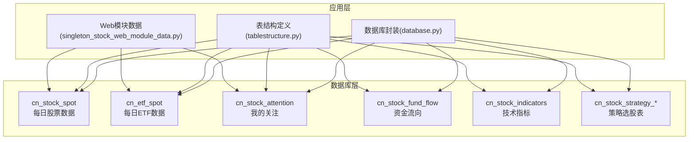
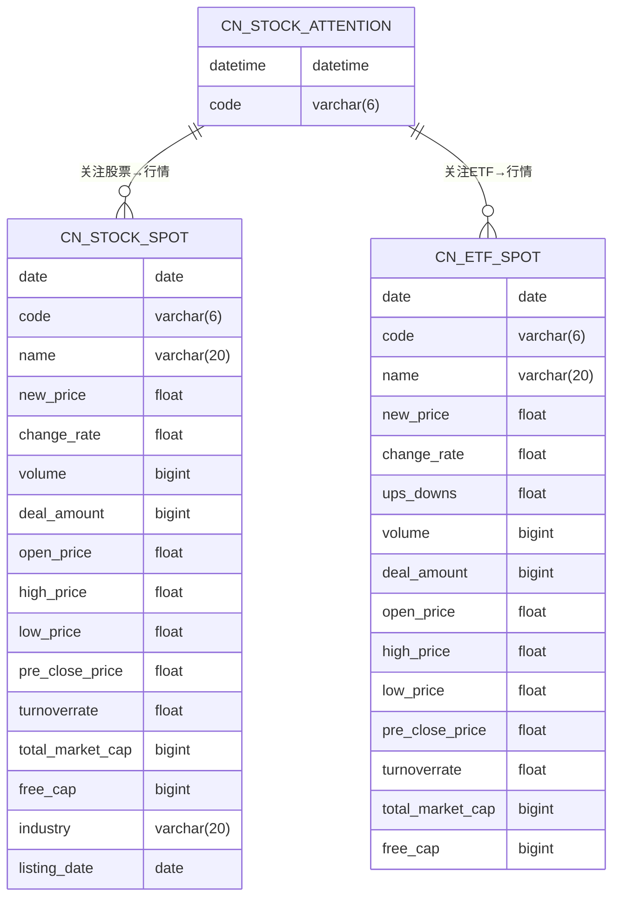
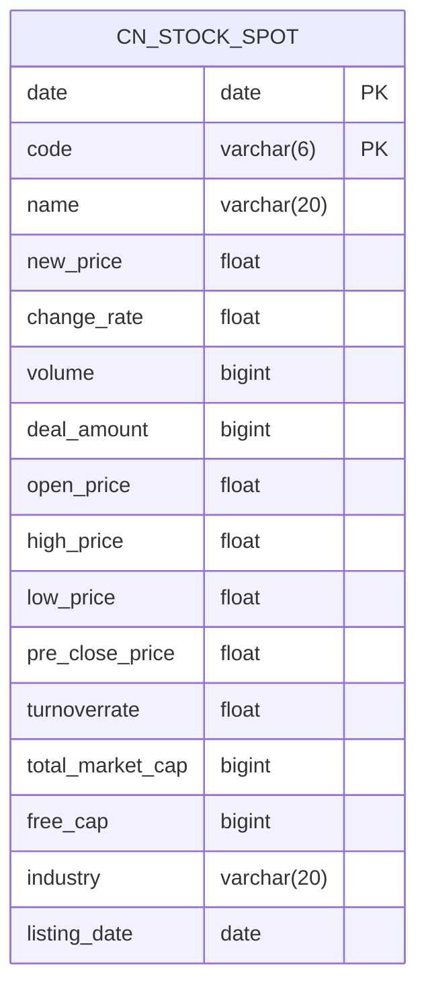
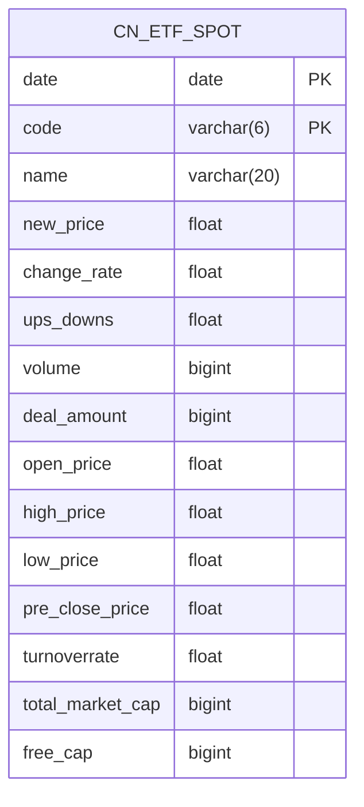
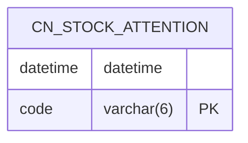
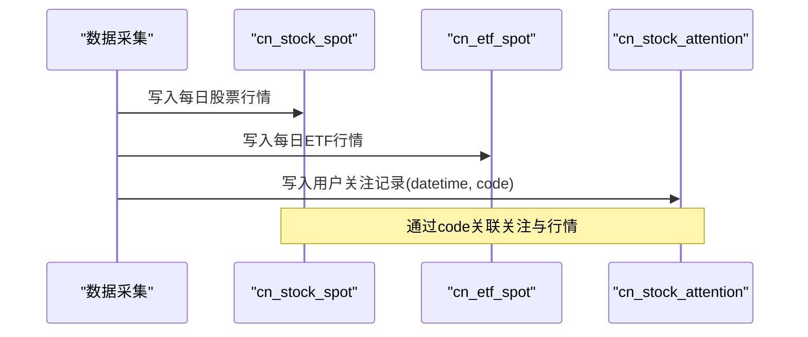
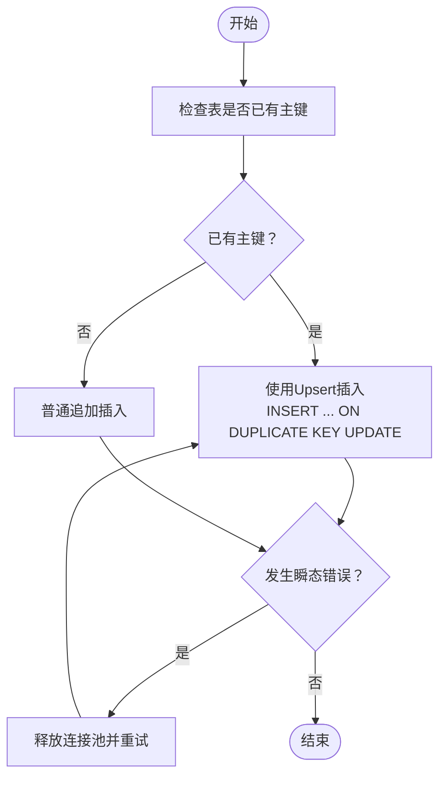

# 核心数据表

<cite>
**本文引用的文件**
- [init_database.sql](file://docker/init_database.sql)
- [database_schema.md](file://document/database_schema.md)
- [database.py](file://docker/stock/quantia/lib/database.py)
- [tablestructure.py](file://docker/stock/quantia/core/tablestructure.py)
- [singleton_stock_web_module_data.py](file://docker/stock/quantia/core/singleton_stock_web_module_data.py)
</cite>

## 目录
1. [简介](#简介)
2. [项目结构](#项目结构)
3. [核心组件](#核心组件)
4. [架构概览](#架构概览)
5. [详细组件分析](#详细组件分析)
6. [依赖分析](#依赖分析)
7. [性能考虑](#性能考虑)
8. [故障排查指南](#故障排查指南)
9. [结论](#结论)
10. [附录](#附录)

## 简介
本文件聚焦于 Quantia 项目的核心数据表，围绕每日股票数据表 cn_stock_spot、每日ETF数据表 cn_etf_spot、我的关注表 cn_stock_attention 的设计理念、字段定义、数据类型选择、约束与索引策略进行系统化梳理。同时结合数据库初始化脚本、数据库设计文档、Python 数据库封装层与表结构定义模块，给出表结构图、字段说明、数据字典、表间关联关系、数据流转过程与性能优化建议，帮助数据分析师与开发者准确理解核心数据模型与业务逻辑。

## 项目结构
- 数据库初始化脚本负责创建所有核心表，包含 cn_stock_spot、cn_etf_spot、cn_stock_attention 等。
- 数据库设计文档提供字段中文说明与表关系图。
- Python 数据库封装层提供连接池、插入/更新/查询等通用方法，支持 Upsert 与主键/索引自动补全。
- 表结构定义模块集中描述各表字段的数据类型、中文名与显示宽度，支撑前端展示与后端入库。

图表来源
- [init_database.sql](file://docker/init_database.sql#L9-L63)
- [database.py](file://docker/stock/quantia/lib/database.py#L55-L71)
- [tablestructure.py](file://docker/stock/quantia/core/tablestructure.py#L42-L57)
- [singleton_stock_web_module_data.py](file://docker/stock/quantia/core/singleton_stock_web_module_data.py#L33-L176)

章节来源
- [init_database.sql](file://docker/init_database.sql#L9-L63)
- [database_schema.md](file://document/database_schema.md#L46-L145)

## 核心组件
- 每日股票数据表 cn_stock_spot：按“日期+股票代码”复合主键组织，包含行情、技术与基本面字段，支撑多维度分析与回测。
- 每日ETF数据表 cn_etf_spot：按“日期+ETF代码”复合主键组织，包含ETF基础行情字段。
- 我的关注表 cn_stock_attention：以“关注时间+股票代码”为主键，便于按关注时间排序与去重。

章节来源
- [init_database.sql](file://docker/init_database.sql#L9-L63)
- [database_schema.md](file://document/database_schema.md#L46-L145)

## 架构概览
核心表之间的关系与数据流转如下：

图表来源
- [init_database.sql](file://docker/init_database.sql#L9-L63)
- [database_schema.md](file://document/database_schema.md#L703-L729)

## 详细组件分析

### 每日股票数据表 cn_stock_spot
- 业务用途：存储每日股票行情与基础财务数据，是多策略与回测的基础数据源。
- 主键设计：复合主键(date, code)，确保同一天同一股票仅一条记录。
- 索引策略：对 code 建有索引，便于按股票维度检索；对 date 建有索引，便于按日期检索。
- 字段命名规范：采用英文字段名，配合设计文档中的中文注释，兼顾机器可读性与人类可读性。
- 数据类型选择：数值型字段使用 float 或 bigint，日期型使用 date，字符串使用 varchar(n)。
- 字段示例与含义（节选）
  - date：日期
  - code：股票代码
  - name：股票名称
  - new_price/change_rate/volume/deal_amount：最新价、涨跌幅、成交量、成交额
  - open_price/high_price/low_price/pre_close_price：开盘价、最高价、最低价、昨收
  - turnoverrate：换手率
  - total_market_cap/free_cap：总市值、流通市值
  - industry/listing_date：所属行业、上市日期
- 数据字典（节选）
  - date: DATE, 说明: 日期
  - code: VARCHAR(6), 说明: 股票代码
  - name: VARCHAR(20), 说明: 股票名称
  - new_price: FLOAT, 说明: 最新价
  - change_rate: FLOAT, 说明: 涨跌幅
  - volume: BIGINT, 说明: 成交量
  - deal_amount: BIGINT, 说明: 成交额
  - open_price: FLOAT, 说明: 今开
  - high_price: FLOAT, 说明: 最高
  - low_price: FLOAT, 说明: 最低
  - pre_close_price: FLOAT, 说明: 昨收
  - turnoverrate: FLOAT, 说明: 换手率
  - total_market_cap: BIGINT, 说明: 总市值
  - free_cap: BIGINT, 说明: 流通市值
  - industry: VARCHAR(20), 说明: 所属行业
  - listing_date: DATE, 说明: 上市日期

图表来源
- [init_database.sql](file://docker/init_database.sql#L18-L63)
- [database_schema.md](file://document/database_schema.md#L71-L117)

章节来源
- [init_database.sql](file://docker/init_database.sql#L18-L63)
- [database_schema.md](file://document/database_schema.md#L66-L117)

### 每日ETF数据表 cn_etf_spot
- 业务用途：存储每日ETF行情数据，与股票数据表结构类似但字段更精简。
- 主键设计：复合主键(date, code)，确保同一天同一ETF仅一条记录。
- 索引策略：对 code 建有索引，便于按ETF维度检索。
- 字段示例与含义（节选）
  - date/code/name/new_price/change_rate/ups_downs：日期、代码、名称、最新价、涨跌幅、涨跌额
  - volume/deal_amount/open_price/high_price/low_price/pre_close_price：成交量、成交额、开盘价、最高价、最低价、昨收
  - turnoverrate/total_market_cap/free_cap：换手率、总市值、流通市值
- 数据字典（节选）
  - date: DATE, 说明: 日期
  - code: VARCHAR(6), 说明: ETF代码
  - name: VARCHAR(20), 说明: ETF名称
  - new_price: FLOAT, 说明: 最新价
  - change_rate: FLOAT, 说明: 涨跌幅
  - ups_downs: FLOAT, 说明: 涨跌额
  - volume: BIGINT, 说明: 成交量
  - deal_amount: BIGINT, 说明: 成交额
  - open_price: FLOAT, 说明: 开盘价
  - high_price: FLOAT, 说明: 最高价
  - low_price: FLOAT, 说明: 最低价
  - pre_close_price: FLOAT, 说明: 昨收
  - turnoverrate: FLOAT, 说明: 换手率
  - total_market_cap: BIGINT, 说明: 总市值
  - free_cap: BIGINT, 说明: 流通市值

图表来源
- [init_database.sql](file://docker/init_database.sql#L372-L389)
- [database_schema.md](file://document/database_schema.md#L125-L145)

章节来源
- [init_database.sql](file://docker/init_database.sql#L372-L389)
- [database_schema.md](file://document/database_schema.md#L121-L145)

### 我的关注表 cn_stock_attention
- 业务用途：记录用户关注的股票列表，支持按关注时间排序与去重。
- 主键设计：以 code 为主键，datetime 作为排序与关联字段，便于与行情表做关联查询。
- 索引策略：对 datetime 建有索引，便于按关注时间检索。
- 字段示例与含义（节选）
  - datetime：关注时间
  - code：股票代码
- 数据字典（节选）
  - datetime: DATETIME, 说明: 关注时间
  - code: VARCHAR(6), 说明: 股票代码

图表来源
- [init_database.sql](file://docker/init_database.sql#L10-L15)
- [database_schema.md](file://document/database_schema.md#L50-L57)

章节来源
- [init_database.sql](file://docker/init_database.sql#L10-L15)
- [database_schema.md](file://document/database_schema.md#L46-L57)

### 数据表之间的关联关系与数据流转
- 关注表与行情表的关联：通过 cn_stock_attention.datetime 与 cn_stock_spot.code 建立关联，前端可按关注时间对行情进行排序展示。
- 行情表与资金流/指标/策略表的关联：均以 date+code 作为关联键，形成从基础行情到多维分析的数据链路。
- 数据流转过程（示例序列）：
  1) 采集每日股票/ETF行情至 cn_stock_spot/cn_etf_spot；
  2) 基于行情表生成资金流向、技术指标、K线形态与策略选股结果；
  3) 用户在 Web 界面通过 cn_stock_attention 关注的股票，按 datetime 排序展示并联动行情与衍生数据。

图表来源
- [init_database.sql](file://docker/init_database.sql#L9-L63)
- [database_schema.md](file://document/database_schema.md#L703-L729)

## 依赖分析
- Python 数据库封装层
  - 连接池：单例模式，限制 pool_size=2、max_overflow=3，适配 2核2G 服务器资源。
  - Upsert：基于 INSERT ... ON DUPLICATE KEY UPDATE，解决并发写入主键冲突与死锁问题。
  - 自动主键/索引：首次创建表时检测主键缺失并自动添加，必要时补充索引。
  - 重试机制：对可重试的瞬态错误（死锁、锁超时、连接异常等）进行有限次数重试。
- 表结构定义模块
  - 集中维护各表字段的数据类型、中文名与显示宽度，支撑前端展示与后端入库一致性。
- Web 模块数据
  - 通过 SQL 子查询将关注时间 datetime 注入到查询结果中，实现“按关注时间排序”的展示效果。

图表来源
- [database.py](file://docker/stock/quantia/lib/database.py#L94-L117)
- [database.py](file://docker/stock/quantia/lib/database.py#L126-L203)

章节来源
- [database.py](file://docker/stock/quantia/lib/database.py#L55-L71)
- [database.py](file://docker/stock/quantia/lib/database.py#L94-L117)
- [database.py](file://docker/stock/quantia/lib/database.py#L126-L203)
- [tablestructure.py](file://docker/stock/quantia/core/tablestructure.py#L42-L57)
- [singleton_stock_web_module_data.py](file://docker/stock/quantia/core/singleton_stock_web_module_data.py#L33-L176)

## 性能考虑
- 连接池与并发
  - 采用小规模连接池（pool_size=2、max_overflow=3），降低内存占用，避免高并发下的连接风暴。
  - Upsert 模式减少重复主键冲突导致的异常与回滚成本。
- 索引与查询
  - cn_stock_spot/cn_etf_spot 对 code 建有索引，适合按股票维度检索；对 date 建有索引，适合按日期检索。
  - cn_stock_attention 对 datetime 建有索引，满足关注时间排序需求。
- 数据类型与存储
  - 数值型字段根据精度需求选择 float/bigint，避免过度占用空间。
  - 字符串字段控制长度，兼顾唯一性与存储效率。
- 重试与稳定性
  - 对可重试的数据库瞬态错误进行指数退避重试，提升写入稳定性。

[本节为通用性能建议，不直接分析具体文件]

## 故障排查指南
- 插入失败（主键冲突/重复）
  - 症状：并发写入时报主键冲突或死锁。
  - 处理：使用 Upsert 方法自动更新；若仍失败，检查是否正确设置主键与索引。
- 连接异常
  - 症状：连接丢失、连接被拒绝、Broken pipe。
  - 处理：启用重试机制；必要时释放连接池并重建。
- 表结构变更
  - 症状：首次创建表缺少主键或索引。
  - 处理：数据库封装层会在插入时自动检测并添加主键/索引；如失败，检查权限与SQL语法。

章节来源
- [database.py](file://docker/stock/quantia/lib/database.py#L126-L203)
- [database.py](file://docker/stock/quantia/lib/database.py#L261-L276)

## 结论
本文系统梳理了 cn_stock_spot、cn_etf_spot、cn_stock_attention 三张核心表的设计理念、主键与索引策略、字段定义与数据类型选择，并结合数据库封装层与表结构定义模块，给出了表关系图、数据字典与性能优化建议。通过 Upsert、连接池与重试机制，项目在资源受限环境下实现了稳定高效的数据写入；通过合理的索引与字段设计，满足了按股票与日期维度的高频查询需求。建议在后续扩展中延续现有命名规范与索引策略，确保数据模型的一致性与可维护性。

## 附录
- 快速初始化脚本
  - 将建表语句保存为 init_database.sql，执行以下命令初始化数据库：
    - mysql -u root -p < init_database.sql
    - 或在 MySQL 客户端中执行 source /path/to/init_database.sql;

章节来源
- [database_schema.md](file://document/database_schema.md#L789-L800)
