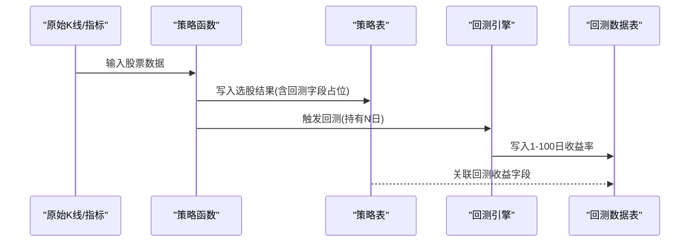
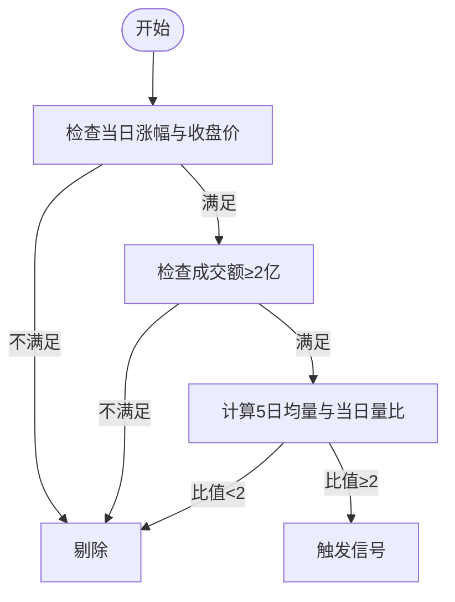

# 策略选股数据表

<cite>
**本文引用的文件**
- [README.md](file://README.md)
- [database_schema.md](file://document/database_schema.md)
- [enter.py](file://docker/stock/quantia/core/strategy/enter.py)
- [keep_increasing.py](file://docker/stock/quantia/core/strategy/keep_increasing.py)
- [parking_apron.py](file://docker/stock/quantia/core/strategy/parking_apron.py)
- [backtrace_ma250.py](file://docker/stock/quantia/core/strategy/backtrace_ma250.py)
- [breakthrough_platform.py](file://docker/stock/quantia/core/strategy/breakthrough_platform.py)
- [climax_limitdown.py](file://docker/stock/quantia/core/strategy/climax_limitdown.py)
- [high_tight_flag.py](file://docker/stock/quantia/core/strategy/high_tight_flag.py)
- [low_atr.py](file://docker/stock/quantia/core/strategy/low_atr.py)
- [low_backtrace_increase.py](file://docker/stock/quantia/core/strategy/low_backtrace_increase.py)
- [turtle_trade.py](file://docker/stock/quantia/core/strategy/turtle_trade.py)
- [gpt_value_strategy.py](file://docker/stock/quantia/core/strategy/gpt_value_strategy.py)
- [strategy_params.sql](file://docker/init_database.sql)
</cite>

## 目录
1. [简介](#简介)
2. [项目结构](#项目结构)
3. [核心组件](#核心组件)
4. [架构总览](#架构总览)
5. [详细组件分析](#详细组件分析)
6. [依赖关系分析](#依赖关系分析)
7. [性能考量](#性能考量)
8. [故障排查指南](#故障排查指南)
9. [结论](#结论)
10. [附录](#附录)

## 简介
本文件聚焦于Quantia策略选股数据表，系统性梳理14种策略选股表的设计理念、实现细节与回测收益字段设计，并阐明策略表与回测数据表的关联关系、收益率统计方法与策略效果评估指标。同时，提供策略参数配置表的使用说明、策略扩展机制与自定义策略开发指南，帮助读者快速理解并高效使用该系统。

## 项目结构
- 策略层位于 quantia/core/strategy 下，包含技术类策略与基本面策略两类。
- 数据层包含策略选股表、回测数据表、综合选股表等，均在数据库中以独立表形式存在。
- README与数据库设计文档提供了策略逻辑与表结构的权威说明。

```mermaid
graph TB
subgraph "策略层"
E["放量上涨<br/>enter.py"]
K["均线多头<br/>keep_increasing.py"]
P["停机坪<br/>parking_apron.py"]
B["回踩年线<br/>backtrace_ma250.py"]
T["突破平台<br/>breakthrough_platform.py"]
L["无大幅回撤<br/>low_backtrace_increase.py"]
TT["海龟交易法则<br/>turtle_trade.py"]
H["高而窄的旗形<br/>high_tight_flag.py"]
CL["放量跌停<br/>climax_limitdown.py"]
LA["低ATR成长<br/>low_atr.py"]
TR["趋势回调<br/>(策略模板)"]
OR["超跌反弹<br/>(策略模板)"]
BC["突破确认<br/>(策略模板)"]
GPT["GPT综合选股<br/>gpt_value_strategy.py"]
end
subgraph "数据层"
S1["cn_stock_strategy_enter<br/>放量上涨"]
S2["cn_stock_strategy_keep_increasing<br/>均线多头"]
S3["cn_stock_strategy_parking_apron<br/>停机坪"]
S4["cn_stock_strategy_backtrace_ma250<br/>回踩年线"]
S5["cn_stock_strategy_breakthrough_platform<br/>突破平台"]
S6["cn_stock_strategy_low_backtrace_increase<br/>无大幅回撤"]
S7["cn_stock_strategy_turtle_trade<br/>海龟交易法则"]
S8["cn_stock_strategy_high_tight_flag<br/>高而窄的旗形"]
S9["cn_stock_strategy_climax_limitdown<br/>放量跌停"]
S10["cn_stock_strategy_low_atr<br/>低ATR成长"]
S11["cn_stock_strategy_trend_pullback<br/>趋势回调"]
S12["cn_stock_strategy_oversold_rebound<br/>超跌反弹"]
S13["cn_stock_strategy_breakout_confirm<br/>突破确认"]
S14["cn_stock_strategy_gpt_value<br/>GPT综合选股"]
BT["cn_stock_backtest_data<br/>回测收益"]
SEL["cn_stock_selection<br/>综合选股"]
PARAM["cn_strategy_params<br/>策略参数配置"]
end
E --> S1
K --> S2
P --> S3
B --> S4
T --> S5
L --> S6
TT --> S7
H --> S8
CL --> S9
LA --> S10
TR --> S11
OR --> S12
BC --> S13
GPT --> S14
S1 -.回测.-> BT
S2 -.回测.-> BT
S3 -.回测.-> BT
S4 -.回测.-> BT
S5 -.回测.-> BT
S6 -.回测.-> BT
S7 -.回测.-> BT
S8 -.回测.-> BT
S9 -.回测.-> BT
S10 -.回测.-> BT
S11 -.回测.-> BT
S12 -.回测.-> BT
S13 -.回测.-> BT
S14 -.回测.-> BT
SEL --> BT
PARAM --> GPT
```

图表来源
- [enter.py](file://docker/stock/quantia/core/strategy/enter.py#L12-L61)
- [keep_increasing.py](file://docker/stock/quantia/core/strategy/keep_increasing.py#L11-L39)
- [parking_apron.py](file://docker/stock/quantia/core/strategy/parking_apron.py#L11-L60)
- [backtrace_ma250.py](file://docker/stock/quantia/core/strategy/backtrace_ma250.py#L12-L92)
- [breakthrough_platform.py](file://docker/stock/quantia/core/strategy/breakthrough_platform.py#L13-L52)
- [database_schema.md](file://document/database_schema.md#L537-L606)
- [README.md](file://README.md#L115-L181)

章节来源
- [README.md](file://README.md#L115-L181)
- [database_schema.md](file://document/database_schema.md#L537-L606)

## 核心组件
- 策略选股表（14张）：每张表对应一种策略，统一包含日期、股票代码、名称与回测收益字段（如1日、5日、10日等）。
- 回测数据表（cn_stock_backtest_data）：存储1-100日的收益率，作为策略回测收益的统一来源。
- 综合选股表（cn_stock_selection）：多条件综合筛选结果，便于二次筛选与回测。
- 策略参数配置表（cn_strategy_params）：支持GPT选股筛选条件、护城河评分权重、AI/LLM API配置等。

章节来源
- [database_schema.md](file://document/database_schema.md#L537-L606)
- [database_schema.md](file://document/database_schema.md#L681-L699)
- [database_schema.md](file://document/database_schema.md#L610-L770)

## 架构总览
策略数据流从原始K线与指标数据出发，经策略函数筛选得到候选股票，写入对应策略表；随后通过回测引擎计算持有N日收益，写入回测数据表；前端或分析模块基于策略表与回测表进行可视化与评估。

图表来源
- [database_schema.md](file://document/database_schema.md#L537-L606)
- [database_schema.md](file://document/database_schema.md#L681-L699)

## 详细组件分析

### 放量上涨（cn_stock_strategy_enter）
- 设计理念：识别当日放量上涨的股票，强调量能放大与价格行为。
- 选股逻辑要点
  - 当日涨幅与收盘价要求（涨幅小于2%或收盘价小于开盘价不满足时剔除）。
  - 成交额不低于2亿元。
  - 当日成交量与5日均量比≥2。
- 参数设置
  - 阈值：默认使用近60日窗口进行量能计算与过滤。
- 信号触发条件
  - 满足上述三项条件即触发。
- 回测收益字段
  - rate_1、rate_5、rate_10。
- 实现参考
  - [check_volume 函数](file://docker/stock/quantia/core/strategy/enter.py#L16-L61)

图表来源
- [enter.py](file://docker/stock/quantia/core/strategy/enter.py#L16-L61)

章节来源
- [enter.py](file://docker/stock/quantia/core/strategy/enter.py#L12-L61)
- [database_schema.md](file://document/database_schema.md#L542-L553)

### 均线多头（cn_stock_strategy_keep_increasing）
- 设计理念：判断MA30呈多头排列且涨幅显著。
- 选股逻辑要点
  - 近30日MA30呈严格递增序列。
  - 当日MA30较30日前MA30涨幅>20%。
- 参数设置
  - 窗口：30日。
- 信号触发条件
  - 满足上述两项条件。
- 回测收益字段
  - rate_1、rate_5、rate_10。
- 实现参考
  - [check 函数](file://docker/stock/quantia/core/strategy/keep_increasing.py#L15-L39)

章节来源
- [keep_increasing.py](file://docker/stock/quantia/core/strategy/keep_increasing.py#L11-L39)
- [database_schema.md](file://document/database_schema.md#L555-L557)

### 停机坪（cn_stock_strategy_parking_apron）
- 设计理念：在前期放量涨停后，出现短期横盘整理并伴随温和上涨的形态。
- 选股逻辑要点
  - 最近15日存在涨幅>9.5%且满足放量上涨条件。
  - 次日高开且涨跌幅限制在±3%以内，且收盘价高于涨停价。
  - 接下来的2-3日持续高开、涨跌幅限制在±5%以内，且收盘价高于涨停价。
- 参数设置
  - 窗口：15日。
- 信号触发条件
  - 满足上述全部条件。
- 回测收益字段
  - rate_1、rate_5、rate_10。
- 实现参考
  - [check 与 check_internal 函数](file://docker/stock/quantia/core/strategy/parking_apron.py#L15-L60)
  - [依赖的海龟交易法则入口](file://docker/stock/quantia/core/strategy/turtle_trade.py)

章节来源
- [parking_apron.py](file://docker/stock/quantia/core/strategy/parking_apron.py#L11-L60)
- [database_schema.md](file://document/database_schema.md#L559-L561)

### 回踩年线（cn_stock_strategy_backtrace_ma250）
- 设计理念：股价在年线之上运行，回踩过程伴随缩量。
- 选股逻辑要点
  - 选取最近60日内的最高点与最低点。
  - 前段（最高点之前）由250日均线以下向上突破。
  - 后段（最高点及之后）股价始终在250日均线上方运行。
  - 回踩区间最低价与最高价相隔10-50个交易日。
  - 回踩伴随缩量：最高点成交量/最低点成交量>2，且最低价/最高价<0.8。
- 参数设置
  - 窗口：250日均线与60日窗口。
- 信号触发条件
  - 满足上述全部条件。
- 回测收益字段
  - rate_1、rate_5、rate_10。
- 实现参考
  - [check 函数](file://docker/stock/quantia/core/strategy/backtrace_ma250.py#L17-L92)

章节来源
- [backtrace_ma250.py](file://docker/stock/quantia/core/strategy/backtrace_ma250.py#L12-L92)
- [database_schema.md](file://document/database_schema.md#L563-L565)

### 突破平台（cn_stock_strategy_breakthrough_platform）
- 设计理念：在60日均线下方震荡平台后，放量突破60日均线。
- 选股逻辑要点
  - 在60日内某日出现“收盘价≥60日均线>开盘价”的K线形态。
  - 该突破日满足放量上涨条件。
  - 突破日之前的任意一天，收盘价与60日均线偏离在-5%~20%之间。
- 参数设置
  - 窗口：60日。
- 信号触发条件
  - 满足上述全部条件。
- 回测收益字段
  - rate_1、rate_5、rate_10。
- 实现参考
  - [check 函数](file://docker/stock/quantia/core/strategy/breakthrough_platform.py#L17-L52)
  - [依赖的放量上涨校验](file://docker/stock/quantia/core/strategy/enter.py#L16-L61)

章节来源
- [breakthrough_platform.py](file://docker/stock/quantia/core/strategy/breakthrough_platform.py#L13-L52)
- [database_schema.md](file://document/database_schema.md#L567-L569)

### 无大幅回撤（cn_stock_strategy_low_backtrace_increase）
- 设计理念：限定60日内的最大涨幅，避免极端回撤。
- 选股逻辑要点
  - 当日收盘价较60日前收盘价涨幅<0.6。
  - 近60日内不得出现单日跌幅>7%、高开低走>7%、两日累计跌幅>10%、两日高开低走累计>10%。
- 参数设置
  - 窗口：60日。
- 信号触发条件
  - 满足上述全部条件。
- 回测收益字段
  - rate_1、rate_5、rate_10。
- 实现参考
  - [策略逻辑描述](file://README.md#L144-L146)

章节来源
- [README.md](file://README.md#L144-L146)
- [database_schema.md](file://document/database_schema.md#L571-L573)

### 海龟交易法则（cn_stock_strategy_turtle_trade）
- 设计理念：以20日最高点为参照，当日收盘价创阶段新高即视为入场。
- 选股逻辑要点
  - 最后一个交易日收盘价为指定区间内最高价。
- 参数设置
  - 区间：默认60日。
- 信号触发条件
  - 满足上述条件。
- 回测收益字段
  - rate_1、rate_5、rate_10。
- 实现参考
  - [策略逻辑描述](file://README.md#L151-L153)

章节来源
- [README.md](file://README.md#L151-L153)
- [database_schema.md](file://document/database_schema.md#L575-L577)

### 高而窄的旗形（cn_stock_strategy_high_tight_flag）
- 设计理念：股价在高位窄幅整理后放量突破。
- 选股逻辑要点
  - 至少上市交易60日。
  - 当日收盘价/前24~10日最低价≥1.9。
  - 前24~10日连续两天涨幅≥9.5%。
- 参数设置
  - 窗口：24~10日。
- 信号触发条件
  - 满足上述全部条件。
- 回测收益字段
  - rate_1、rate_5、rate_10。
- 实现参考
  - [策略逻辑描述](file://README.md#L154-L157)

章节来源
- [README.md](file://README.md#L154-L157)
- [database_schema.md](file://document/database_schema.md#L579-L581)

### 放量跌停（cn_stock_strategy_climax_limitdown）
- 设计理念：在跌停幅度下仍出现放量，可能预示情绪释放后的反弹机会。
- 选股逻辑要点
  - 跌>9.5%。
  - 成交额≥2亿。
  - 成交量≥5日均量×4。
- 参数设置
  - 窗口：5日均量。
- 信号触发条件
  - 满足上述全部条件。
- 回测收益字段
  - rate_1、rate_5、rate_10。
- 实现参考
  - [策略逻辑描述](file://README.md#L158-L161)

章节来源
- [README.md](file://README.md#L158-L161)
- [database_schema.md](file://document/database_schema.md#L583-L585)

### 低ATR成长（cn_stock_strategy_low_atr）
- 设计理念：在低波动环境下实现稳健增长。
- 选股逻辑要点
  - 至少上市交易250日。
  - 最近10个交易日最高收盘价较最低收盘价≥1.1倍。
- 参数设置
  - 窗口：250日与10日。
- 信号触发条件
  - 满足上述全部条件。
- 回测收益字段
  - rate_1、rate_5、rate_10。
- 实现参考
  - [策略逻辑描述](file://README.md#L162-L164)

章节来源
- [README.md](file://README.md#L162-L164)
- [database_schema.md](file://document/database_schema.md#L587-L589)

### 趋势回调（cn_stock_strategy_trend_pullback）
- 设计理念：优质公司长期趋势向好时的回调买入机会。
- 选股逻辑要点
  - 长期趋势向上，短期回调提供低吸机会。
  - 具体规则由策略模板定义，可结合技术指标与基本面筛选。
- 参数设置
  - 窗口与阈值由策略模板与参数配置表共同决定。
- 信号触发条件
  - 满足模板定义的条件。
- 回测收益字段
  - rate_1、rate_5、rate_10。
- 实现参考
  - [策略逻辑描述](file://README.md#L165-L168)

章节来源
- [README.md](file://README.md#L165-L168)
- [database_schema.md](file://document/database_schema.md#L591-L593)

### 超跌反弹（cn_stock_strategy_oversold_rebound）
- 设计理念：市场恐慌但基本面未变时的超跌修复买入机会。
- 选股逻辑要点
  - 超卖状态下的技术修复信号，结合市场情绪与技术指标。
  - 具体规则由策略模板定义。
- 参数设置
  - 窗口与阈值由策略模板与参数配置表共同决定。
- 信号触发条件
  - 满足模板定义的条件。
- 回测收益字段
  - rate_1、rate_5、rate_10。
- 实现参考
  - [策略逻辑描述](file://README.md#L167-L168)

章节来源
- [README.md](file://README.md#L167-L168)
- [database_schema.md](file://document/database_schema.md#L595-L597)

### 突破确认（cn_stock_strategy_breakout_confirm）
- 设计理念：横盘整理后放量突破确认买入。
- 选股逻辑要点
  - 横盘区间明确，突破日放量，确认突破有效性。
  - 具体规则由策略模板定义。
- 参数设置
  - 窗口与阈值由策略模板与参数配置表共同决定。
- 信号触发条件
  - 满足模板定义的条件。
- 回测收益字段
  - rate_1、rate_5、rate_10。
- 实现参考
  - [策略逻辑描述](file://README.md#L169-L170)

章节来源
- [README.md](file://README.md#L169-L170)
- [database_schema.md](file://document/database_schema.md#L599-L601)

### GPT综合选股（cn_stock_strategy_gpt_value）
- 设计理念：基于ChatGPT文档的财务筛选策略，从综合选股结果中进一步筛选。
- 选股逻辑要点
  - 资产负债率<60%。
  - 每股经营现金流>0。
  - ROE(加权)≥15%。
  - 毛利率≥30%。
  - 净利率≥10%。
  - 营收3年CAGR>10%。
  - 净利润3年CAGR>10%。
  - PE(TTM)∈(0,50]。
- 参数设置
  - 通过cn_strategy_params表配置筛选条件与权重。
- 信号触发条件
  - 满足上述全部条件。
- 回测收益字段
  - rate_1、rate_5、rate_10。
- 实现参考
  - [策略逻辑描述](file://README.md#L171-L181)
  - [策略参数配置表](file://document/database_schema.md#L777-L786)

章节来源
- [README.md](file://README.md#L171-L181)
- [database_schema.md](file://document/database_schema.md#L603-L605)
- [database_schema.md](file://document/database_schema.md#L777-L786)

## 依赖关系分析
- 策略表与回测数据表
  - 策略表（如cn_stock_strategy_enter）与回测数据表（cn_stock_backtest_data）通过“日期+股票代码”关联，策略表中的回测字段（如rate_1、rate_5、rate_10）与回测表保持一致口径。
- 策略表与综合选股表
  - 综合选股表（cn_stock_selection）提供更广泛的筛选维度，可作为策略表的前置过滤器。
- 策略参数配置表
  - cn_strategy_params为GPT综合选股等策略提供可配置参数集，支持财务安全、盈利能力、成长能力、估值指标等维度的阈值与权重调整。

```mermaid
erDiagram
CN_STOCK_STRATEGY_ENTER ||--o{ CN_STOCK_BACKTEST_DATA : "回测收益关联"
CN_STOCK_STRATEGY_KEEP_INCREASING ||--o{ CN_STOCK_BACKTEST_DATA : "回测收益关联"
CN_STOCK_STRATEGY_PARKING_APRON ||--o{ CN_STOCK_BACKTEST_DATA : "回测收益关联"
CN_STOCK_STRATEGY_BACKTRACE_MA250 ||--o{ CN_STOCK_BACKTEST_DATA : "回测收益关联"
CN_STOCK_STRATEGY_BREAKTHROUGH_PLATFORM ||--o{ CN_STOCK_BACKTEST_DATA : "回测收益关联"
CN_STOCK_STRATEGY_LOW_BACKTRACE_INCREASE ||--o{ CN_STOCK_BACKTEST_DATA : "回测收益关联"
CN_STOCK_STRATEGY_TURTLE_TRADE ||--o{ CN_STOCK_BACKTEST_DATA : "回测收益关联"
CN_STOCK_STRATEGY_HIGH_TIGHT_FLAG ||--o{ CN_STOCK_BACKTEST_DATA : "回测收益关联"
CN_STOCK_STRATEGY_CLIMAX_LIMITDOWN ||--o{ CN_STOCK_BACKTEST_DATA : "回测收益关联"
CN_STOCK_STRATEGY_LOW_ATR ||--o{ CN_STOCK_BACKTEST_DATA : "回测收益关联"
CN_STOCK_STRATEGY_TREND_PULLBACK ||--o{ CN_STOCK_BACKTEST_DATA : "回测收益关联"
CN_STOCK_STRATEGY_OVERSOLD_REBOUND ||--o{ CN_STOCK_BACKTEST_DATA : "回测收益关联"
CN_STOCK_STRATEGY_BREAKOUT_CONFIRM ||--o{ CN_STOCK_BACKTEST_DATA : "回测收益关联"
CN_STOCK_STRATEGY_GPT_VALUE ||--o{ CN_STOCK_BACKTEST_DATA : "回测收益关联"
CN_STOCK_SELECTION ||--o{ CN_STOCK_BACKTEST_DATA : "回测收益关联"
CN_STRATEGY_PARAMS }o--|| CN_STOCK_STRATEGY_GPT_VALUE : "参数配置"
```

图表来源
- [database_schema.md](file://document/database_schema.md#L537-L606)
- [database_schema.md](file://document/database_schema.md#L681-L699)
- [database_schema.md](file://document/database_schema.md#L777-L786)

章节来源
- [database_schema.md](file://document/database_schema.md#L537-L606)
- [database_schema.md](file://document/database_schema.md#L681-L699)
- [database_schema.md](file://document/database_schema.md#L777-L786)

## 性能考量
- 数据窗口与计算复杂度
  - 多数策略依赖滚动均线（如MA30、MA60、MA250），计算成本与窗口大小成正比。
  - 放量上涨与突破平台等策略涉及前后日期对比与量能计算，建议在入库时预计算均线与量能指标，减少重复计算。
- 存储与索引
  - 策略表与回测表均以“日期+代码”为主键，并在“代码”上建立二级索引，有利于按股票维度查询与回测。
- 批处理与并发
  - 建议采用批处理方式生成策略表与回测表，利用多线程/进程并行提升吞吐量。
- 缓存与预计算
  - 对高频使用的指标（如MA、ATR、成交量均值）进行缓存，避免重复计算。

## 故障排查指南
- 常见问题
  - 策略表为空：检查数据窗口是否不足（如MA250需要至少250日数据）。
  - 回测收益缺失：确认回测数据表是否成功写入，或策略表回测字段与回测表字段不匹配。
  - GPT综合选股异常：检查cn_strategy_params表中参数是否正确配置。
- 排查步骤
  - 核对策略函数输入数据的时间范围与完整性。
  - 检查策略表与回测表的主键与索引是否一致。
  - 对照策略逻辑逐条验证条件是否满足。
- 参考实现
  - [策略函数示例（放量上涨）](file://docker/stock/quantia/core/strategy/enter.py#L16-L61)
  - [策略函数示例（均线多头）](file://docker/stock/quantia/core/strategy/keep_increasing.py#L15-L39)
  - [策略函数示例（回踩年线）](file://docker/stock/quantia/core/strategy/backtrace_ma250.py#L17-L92)

章节来源
- [enter.py](file://docker/stock/quantia/core/strategy/enter.py#L16-L61)
- [keep_increasing.py](file://docker/stock/quantia/core/strategy/keep_increasing.py#L15-L39)
- [backtrace_ma250.py](file://docker/stock/quantia/core/strategy/backtrace_ma250.py#L17-L92)

## 结论
本技术文档系统化阐述了14种策略选股表的设计理念、实现细节与回测收益字段设计，并明确了策略表与回测数据表的关联关系与评估指标。通过cn_strategy_params表实现参数化配置，配合策略模板与扩展机制，可灵活支持自定义策略开发与迭代优化。建议在生产环境中结合缓存与批处理策略，确保性能与稳定性。

## 附录
- 策略参数配置表（cn_strategy_params）使用说明
  - 参数集类型
    - gpt_value：GPT选股筛选条件（财务安全、盈利能力、成长能力、估值指标）。
    - moat_scoring：护城河评分模型权重与阈值。
    - ai_model：AI/LLM API配置（接口地址、密钥、模型、温度、token数）。
  - 使用建议
    - 在执行GPT综合选股前，先配置参数集，确保阈值与权重符合预期。
    - 参数变更后，重新执行策略作业以应用新配置。
- 策略扩展机制与自定义策略开发指南
  - 扩展流程
    - 在策略层新增策略文件，遵循现有策略函数签名与命名规范。
    - 在数据库中创建对应策略表，字段与回测表保持一致。
    - 在策略调度中注册新策略，确保数据写入与回测流程完整。
  - 开发建议
    - 明确窗口大小与阈值，尽量在入库阶段预计算关键指标。
    - 为策略表与回测表建立一致的索引，提升查询与回测效率。
    - 通过cn_strategy_params表支持参数化配置，便于A/B测试与策略迭代。

章节来源
- [database_schema.md](file://document/database_schema.md#L777-L786)
- [README.md](file://README.md#L115-L181)
