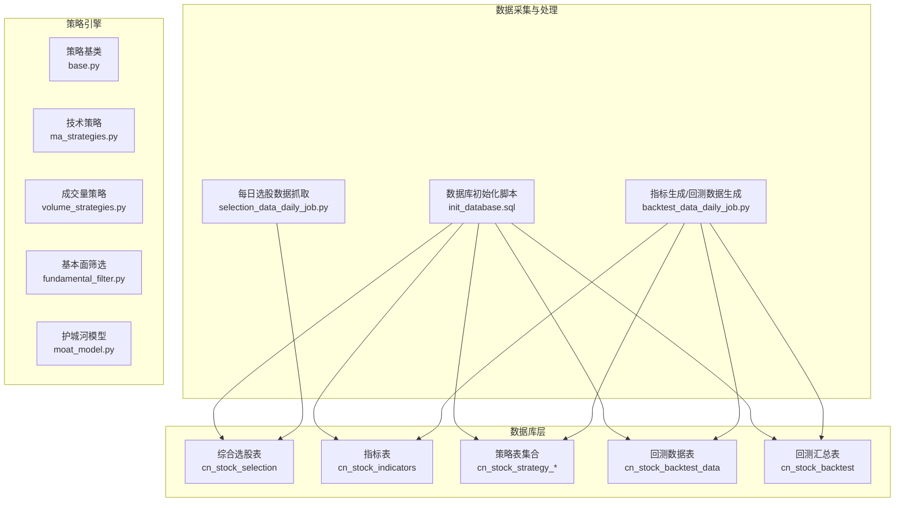
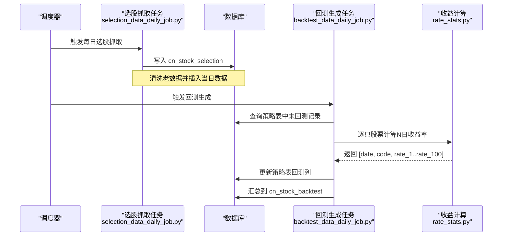
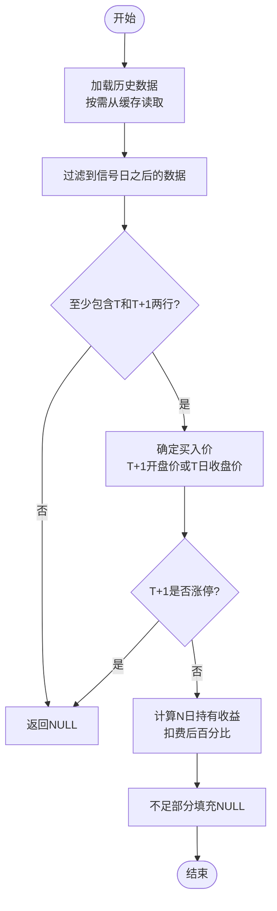
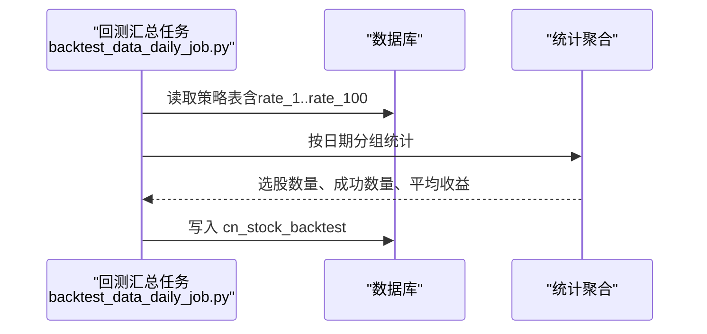
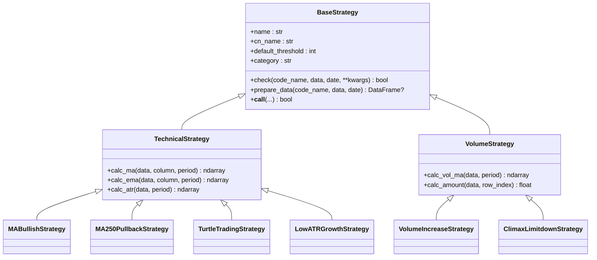
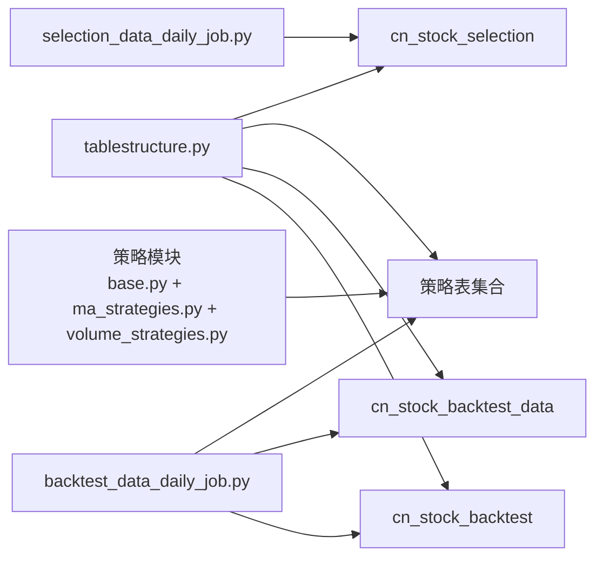

# 综合选股与回测数据表

<cite>
**本文档引用的文件**
- [init_database.sql](file://docker/init_database.sql)
- [tablestructure.py](file://docker/stock/quantia/core/tablestructure.py)
- [selection_data_daily_job.py](file://docker/stock/quantia/job/selection_data_daily_job.py)
- [backtest_data_daily_job.py](file://docker/stock/quantia/job/backtest_data_daily_job.py)
- [rate_stats.py](file://docker/stock/quantia/core/backtest/rate_stats.py)
- [base.py](file://docker/stock/quantia/core/strategy/base.py)
- [ma_strategies.py](file://docker/stock/quantia/core/strategy/technical/ma_strategies.py)
- [volume_strategies.py](file://docker/stock/quantia/core/strategy/volume/volume_strategies.py)
- [fundamental_filter.py](file://docker/stock/quantia/core/strategy/fundamental/fundamental_filter.py)
- [moat_model.py](file://docker/stock/quantia/core/strategy/fundamental/moat_model.py)
</cite>

## 目录
1. [简介](#简介)
2. [项目结构](#项目结构)
3. [核心组件](#核心组件)
4. [架构概览](#架构概览)
5. [详细组件分析](#详细组件分析)
6. [依赖分析](#依赖分析)
7. [性能考虑](#性能考虑)
8. [故障排查指南](#故障排查指南)
9. [结论](#结论)

## 简介
本文件面向 Quantia 项目，系统性阐述综合选股表（cn_stock_selection）与股票回测数据表（cn_stock_backtest_data）的设计理念、实现细节与运行机制。内容涵盖：
- 综合选股表的70+筛选字段体系：行业分类、估值指标、财务指标、技术信号的集成设计
- 回测数据表的1-100日收益率存储结构、回测时间跨度选择、收益计算方法
- 综合选股的筛选逻辑、权重计算、排序机制
- 回测数据的统计分析、收益分布、风险评估指标
- 综合选股表与各策略表的关联关系、数据聚合过程、性能优化策略

## 项目结构
该项目采用“数据采集-清洗-策略计算-回测-汇总”的流水线式架构。数据库初始化脚本负责创建核心表；每日任务负责拉取数据并写入；策略模块提供多种选股策略；回测模块计算N日收益率并汇总。



**图表来源**
- [init_database.sql](file://docker/init_database.sql#L391-L451)
- [selection_data_daily_job.py](file://docker/stock/quantia/job/selection_data_daily_job.py#L22-L59)
- [backtest_data_daily_job.py](file://docker/stock/quantia/job/backtest_data_daily_job.py#L35-L141)
- [base.py](file://docker/stock/quantia/core/strategy/base.py#L20-L96)
- [ma_strategies.py](file://docker/stock/quantia/core/strategy/technical/ma_strategies.py#L22-L56)
- [volume_strategies.py](file://docker/stock/quantia/core/strategy/volume/volume_strategies.py#L19-L69)

**章节来源**
- [init_database.sql](file://docker/init_database.sql#L391-L451)

## 核心组件
- 综合选股表（cn_stock_selection）
  - 设计目标：统一承载行业、估值、财务、技术等多维特征，支撑后续策略筛选与回测
  - 字段规模：包含70+字段，覆盖基础行情、财务指标、估值指标、技术形态标记等
  - 关键字段示例：日期、代码、名称、最新价、涨跌幅、成交量、换手率、市盈率、市净率、ROE、毛利率、净利润增长率、资产负债率、技术形态标记（如MACD金叉、均线多头等）

- 股票回测数据表（cn_stock_backtest_data）
  - 设计目标：存储N日（1-100）收益率序列，支持回测汇总与统计分析
  - 结构特点：rate_1至rate_100共100列，逐日持有收益（扣费后），不足部分填充NULL

- 策略表集合（cn_stock_strategy_*）
  - 设计目标：存放不同策略的选股结果，统一扩展N日收益率字段
  - 包含：放量上涨、均线多头、停机坪、回踩年线、突破平台、无大幅回撤、海龟交易法则、高而窄的旗形、放量跌停、低ATR成长、趋势回调、超跌反弹、突破确认、GPT综合选股等

- 回测汇总表（cn_stock_backtest）
  - 设计目标：按日期与策略聚合统计指标，便于前端展示与对比
  - 字段：日期、策略名称、选股数量、成功数量、成功率、1/3/5/10/20日平均收益等

**章节来源**
- [tablestructure.py](file://docker/stock/quantia/core/tablestructure.py#L591-L800)
- [tablestructure.py](file://docker/stock/quantia/core/tablestructure.py#L316-L318)
- [tablestructure.py](file://docker/stock/quantia/core/tablestructure.py#L409-L443)
- [tablestructure.py](file://docker/stock/quantia/core/tablestructure.py#L29-L44)

## 架构概览
综合选股与回测流程分为四个阶段：
1) 数据采集与入库：每日抓取综合选股数据并写入 cn_stock_selection
2) 指标与回测：从指标表/策略表抽取未回测记录，按需从缓存读取历史数据，计算N日收益率
3) 回测汇总：按日期与策略统计平均收益与成功率
4) 可视化与查询：通过API与前端展示汇总结果



**图表来源**
- [selection_data_daily_job.py](file://docker/stock/quantia/job/selection_data_daily_job.py#L22-L59)
- [backtest_data_daily_job.py](file://docker/stock/quantia/job/backtest_data_daily_job.py#L35-L141)
- [rate_stats.py](file://docker/stock/quantia/core/backtest/rate_stats.py#L34-L107)

## 详细组件分析

### 综合选股表（cn_stock_selection）设计
- 字段体系
  - 行业与概念：行业、地区、概念、板块等标签字段，便于分组与过滤
  - 估值指标：市盈率（pe9、predict_pe_syear、predict_pe_nyear）、市净率（pbnewmrq）、市销率（ps9）、市现率（pcfjyxjl9）、企业价值倍数、预测PEG（ycpeg）等
  - 财务指标：每股收益（basic_eps）、每股净资产（bvps）、每股经营现金流（per_netcash_operate）、每股自由现金流（per_fcfe）、每股资本公积、未分配利润、盈余公积、留存收益等；盈利能力（roe_weight、jroa、roic、zxgxl）、毛利率（sale_gpr）、净利率（sale_npr）、净利润/营收增长率、3年复合增长率、预测净利润/营收同比增长等；偿债能力（debt_asset_ratio、equity_ratio、equity_multiplier）、营运能力（流动比率、速动比率）等
  - 技术形态标记：MACD/KDJ金叉（日/周/月线）、放量突破、低位资金净流入、高位资金净流出、向上突破均线（5/10/20/30/60日）、均线多头/空头排列、连涨放量、下跌无量、一根/两根大阳线、旭日东升、强势多方炮、拨云见日、七仙女下凡、八仙过海、九阳神功、四串阳、天量法则、放量上攻、穿头破脚、倒转锤头、射击之星、黄昏之星、曙光初现、身怀六甲、乌云盖顶等布尔型标记
- 映射关系
  - 表结构中为多数字段提供了中文注释与映射键（如 map: 'SECURITY_CODE'），便于上游数据源字段与表结构的对接
- 数据完整性
  - 日期为主键之一，配合代码构成唯一索引，确保每日单只股票唯一记录

```mermaid
classDiagram
class SelectionTable {
"+date"
"+code"
"+name"
"+new_price"
"+change_rate"
"+volume"
"+turnover"
"+amplitude"
"+turnoverrate"
"+volume_ratio"
"+open"
"+high"
"+low"
"+pre_close"
"+listing_date"
"+industry"
"+area"
"+concept"
"+style"
"+is_hs300"
"+is_sz50"
"+is_zz500"
"+is_zz1000"
"+is_cy50"
"+pe9"
"+pbnewmrq"
"+pettmdeducted"
"+ps9"
"+pcfjyxjl9"
"+predict_pe_syear"
"+predict_pe_nyear"
"+total_market_cap"
"+free_cap"
"+dtsyl"
"+ycpeg"
"+enterprise_value_multiple"
"+basic_eps"
"+bvps"
"+per_netcash_operate"
"+per_fcfe"
"+per_capital_reserve"
"+per_unassign_profit"
"+per_surplus_reserve"
"+per_retained_earning"
"+parent_netprofit"
"+deduct_netprofit"
"+total_operate_income"
"+roe_weight"
"+jroa"
"+roic"
"+zxgxl"
"+sale_gpr"
"+sale_npr"
"+netprofit_yoy_ratio"
"+deduct_netprofit_growthrate"
"+toi_yoy_ratio"
"+netprofit_growthrate_3y"
"+income_growthrate_3y"
"+predict_netprofit_ratio"
"+predict_income_ratio"
"+basiceps_yoy_ratio"
"+total_profit_growthrate"
"+operate_profit_growthrate"
"+debt_asset_ratio"
"+equity_ratio"
"+equity_multiplier"
"+current_ratio"
"+speed_ratio"
"+total_shares"
"+free_shares"
"+holder_newest"
"+holder_ratio"
"+hold_amount"
"+avg_hold_num"
"+holdnum_growthrate_3q"
"+holdnum_growthrate_hy"
"+hold_ratio_count"
"+free_hold_ratio"
"+macd_golden_fork"
"+macd_golden_forkz"
"+macd_golden_forky"
"+kdj_golden_fork"
"+kdj_golden_forkz"
"+kdj_golden_forky"
"+break_through"
"+low_funds_inflow"
"+high_funds_outflow"
"+breakup_ma_5days"
"+breakup_ma_10days"
"+breakup_ma_20days"
"+breakup_ma_30days"
"+breakup_ma_60days"
"+long_avg_array"
"+short_avg_array"
"+upper_large_volume"
"+down_narrow_volume"
"+one_dayang_line"
"+two_dayang_lines"
"+rise_sun"
"+power_fulgun"
"+restore_justice"
"+down_7days"
"+upper_8days"
"+upper_9days"
"+upper_4days"
"+heaven_rule"
"+upside_volume"
"+bearish_engulfing"
"+reversing_hammer"
"+shooting_star"
"+evening_star"
"+first_dawn"
"+pregnant"
"+black_cloud_tops"
"...(省略其他技术形态标记)"
}
```

**图表来源**
- [tablestructure.py](file://docker/stock/quantia/core/tablestructure.py#L591-L800)

**章节来源**
- [tablestructure.py](file://docker/stock/quantia/core/tablestructure.py#L591-L800)

### 回测数据表（cn_stock_backtest_data）设计
- 存储结构
  - rate_1 到 rate_100：逐日持有收益（百分比），从信号日T+1开始计算
  - 交易成本：每笔交易扣除佣金、印花税、滑点，形成“扣费后”收益
  - 涨停过滤：若T+1开盘价达到涨停（接近10%），视为无法成交，返回NULL
- 计算逻辑
  - 买入价：信号日T+1开盘价（若缓存无开盘价则退化为T日收盘价）
  - 收益率：rate_N = (close[T+N] - buy_price) / buy_price × 100 − 交易成本
  - 填充规则：不足N日的部分以NULL填充
- 时间跨度
  - 默认回测长度为100日（RATE_FIELDS_COUNT=100），可通过环境变量调整
  - 日期区间：从历史年数推导的起始日期到当前日期



**图表来源**
- [rate_stats.py](file://docker/stock/quantia/core/backtest/rate_stats.py#L34-L107)

**章节来源**
- [rate_stats.py](file://docker/stock/quantia/core/backtest/rate_stats.py#L34-L107)
- [tablestructure.py](file://docker/stock/quantia/core/tablestructure.py#L22-L22)

### 回测汇总与统计分析
- 汇总表字段
  - 日期、策略名称、选股数量、成功数量、成功率、1/3/5/10/20/30/60/90/120日平均收益
- 成功率计算
  - 优先使用rate_5，若为空则降级到rate_3，再降级到rate_1；计算rate_N > 0 的比例
- 平均收益
  - 对可用horizon求平均，缺失则为NULL
- 自动迁移
  - 若汇总表缺少新增列（如avg_rate_N），自动ALTER TABLE添加



**图表来源**
- [backtest_data_daily_job.py](file://docker/stock/quantia/job/backtest_data_daily_job.py#L167-L270)

**章节来源**
- [backtest_data_daily_job.py](file://docker/stock/quantia/job/backtest_data_daily_job.py#L167-L270)

### 策略筛选与权重计算
- 策略基类与注册
  - BaseStrategy 提供check抽象方法与prepare_data数据准备
  - TechnicalStrategy/VolueStrategy等提供常用指标计算（MA、EMA、ATR、成交量均值等）
  - register_strategy装饰器维护策略注册表，支持按分类检索
- 典型策略
  - 均线多头：30日均线持续上行且涨幅超20%
  - 回踩年线：突破250日均线后回踩不破且缩量整理
  - 海龟交易：突破60日新高
  - 低ATR成长：ATR相对价格比例低且120日涨幅超10%
  - 放量上涨/放量跌停：成交量放大与涨跌幅结合的量价信号
- 权重与排序
  - 策略模块未内置统一权重计算逻辑，权重通常在上游筛选器或策略组合中实现
  - 可结合基本面筛选器（如MoatScorer）与估值约束（如PE/PB上限）进行二次排序



**图表来源**
- [base.py](file://docker/stock/quantia/core/strategy/base.py#L20-L202)
- [ma_strategies.py](file://docker/stock/quantia/core/strategy/technical/ma_strategies.py#L22-L237)
- [volume_strategies.py](file://docker/stock/quantia/core/strategy/volume/volume_strategies.py#L19-L126)

**章节来源**
- [base.py](file://docker/stock/quantia/core/strategy/base.py#L20-L202)
- [ma_strategies.py](file://docker/stock/quantia/core/strategy/technical/ma_strategies.py#L22-L237)
- [volume_strategies.py](file://docker/stock/quantia/core/strategy/volume/volume_strategies.py#L19-L126)

### 基本面筛选与护城河评分
- 基本面筛选器（FundamentalFilter）
  - 分五层筛选：财务安全 → 盈利能力 → 成长质量 → 竞争壁垒 → 估值约束
  - 可配置阈值，支持严格/宽松两种标准
- 护城河评分器（MoatScorer）
  - 五大维度评分：盈利能力、稳定性、成长能力、经营效率、财务安全
  - 输出总分、评级、护城河类型、风险因素
- 与综合选股表的衔接
  - 基础数据来源于 cn_stock_selection，评分结果可用于二次排序与权重调整

**章节来源**
- [fundamental_filter.py](file://docker/stock/quantia/core/strategy/fundamental/fundamental_filter.py#L118-L299)
- [moat_model.py](file://docker/stock/quantia/core/strategy/fundamental/moat_model.py#L325-L479)

## 依赖分析
- 组件耦合
  - 回测任务依赖策略表结构定义（tablestructure.py），通过统一的回测列命名（rate_1..rate_100）实现跨策略聚合
  - 策略模块通过策略注册表实现松耦合扩展，新增策略只需继承基类并注册
- 外部依赖
  - 数据库：MySQL（InnoDB），使用UTF8MB4字符集
  - 计算库：TA-Lib（技术指标）、NumPy/Pandas（数值与数据处理）
- 潜在循环依赖
  - 策略模块之间无直接循环依赖；回测任务仅读取策略表，不反向依赖策略实现



**图表来源**
- [tablestructure.py](file://docker/stock/quantia/core/tablestructure.py#L409-L443)
- [selection_data_daily_job.py](file://docker/stock/quantia/job/selection_data_daily_job.py#L40-L55)
- [backtest_data_daily_job.py](file://docker/stock/quantia/job/backtest_data_daily_job.py#L35-L86)

**章节来源**
- [tablestructure.py](file://docker/stock/quantia/core/tablestructure.py#L409-L443)
- [selection_data_daily_job.py](file://docker/stock/quantia/job/selection_data_daily_job.py#L40-L55)
- [backtest_data_daily_job.py](file://docker/stock/quantia/job/backtest_data_daily_job.py#L35-L86)

## 性能考虑
- 内存占用优化
  - 回测采用“流式版本”：逐只股票从磁盘缓存读取历史数据，避免一次性加载全量数据到内存
  - 通过环境变量控制内外层并发线程数（QUANTIA_BACKTEST_OUTER_WORKERS、QUANTIA_BACKTEST_INNER_WORKERS），适配≤2GB服务器
- I/O与缓存
  - 历史数据按需从缓存读取，减少重复I/O
  - 分批提交（每批50只股票）降低Future对象数量，平衡时间与空间
- 数据库写入
  - 使用批量插入与按主键去重（date, code）保证幂等性
  - 回测汇总前清理旧数据，避免重复统计

**章节来源**
- [backtest_data_daily_job.py](file://docker/stock/quantia/job/backtest_data_daily_job.py#L54-L135)
- [backtest_data_daily_job.py](file://docker/stock/quantia/job/backtest_data_daily_job.py#L138-L141)

## 故障排查指南
- 选股数据为空
  - 现象：首次抓取失败并重试后仍为空
  - 处理：检查网络与上游数据源可用性，确认重试逻辑是否生效
- 回测数据缺失
  - 现象：策略表中rate_N列长期为NULL
  - 处理：确认回测任务是否按计划执行；检查缓存是否存在历史数据；核对涨停过滤逻辑
- 汇总表列缺失
  - 现象：avg_rate_N列不存在导致写入失败
  - 处理：回测汇总任务具备自动迁移功能，会自动添加缺失列；若失败，检查权限与异常日志
- 性能瓶颈
  - 现象：回测耗时过长或内存占用过高
  - 处理：调整并发线程数环境变量；检查磁盘缓存访问速度；优化数据库索引（date, code）

**章节来源**
- [selection_data_daily_job.py](file://docker/stock/quantia/job/selection_data_daily_job.py#L26-L36)
- [backtest_data_daily_job.py](file://docker/stock/quantia/job/backtest_data_daily_job.py#L83-L86)
- [backtest_data_daily_job.py](file://docker/stock/quantia/job/backtest_data_daily_job.py#L143-L165)

## 结论
本设计通过“统一字段体系 + 策略注册扩展 + 流式回测 + 汇总统计”的架构，实现了综合选股与回测的高效闭环。综合选股表承载70+筛选维度，策略表统一接入N日回测列，回测汇总表提供多维度统计指标，既满足工程化落地，又便于后续扩展与优化。建议在生产环境中：
- 明确策略权重与排序规则，结合基本面评分与估值约束进行二次筛选
- 持续监控回测任务执行状态与性能指标，按硬件资源动态调整并发参数
- 定期评估回测周期与交易成本假设，确保收益评估贴近真实市场
