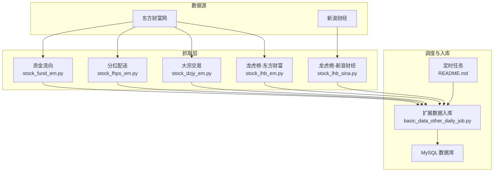
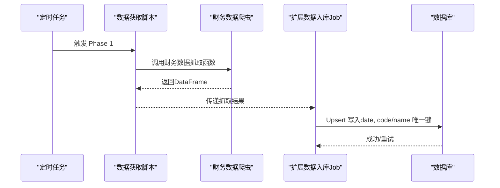
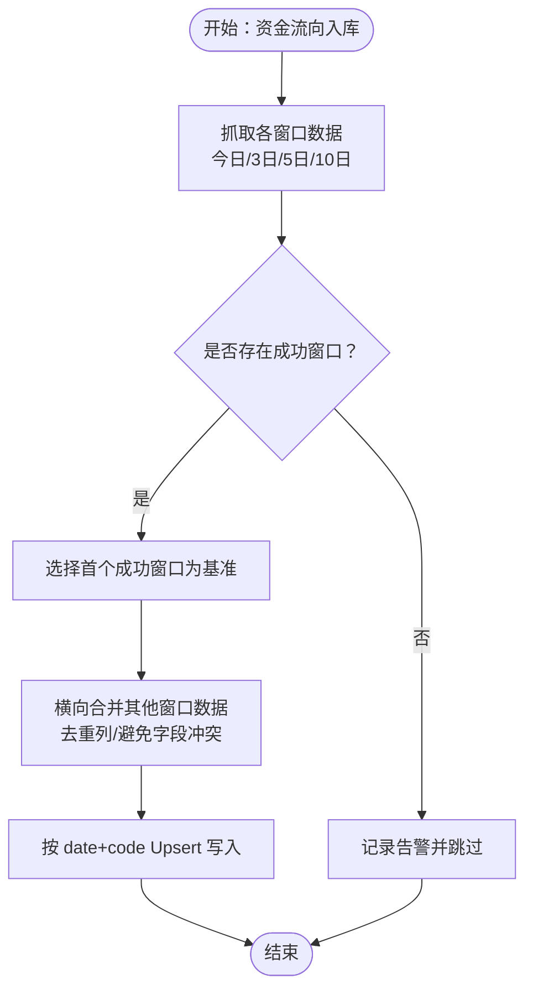
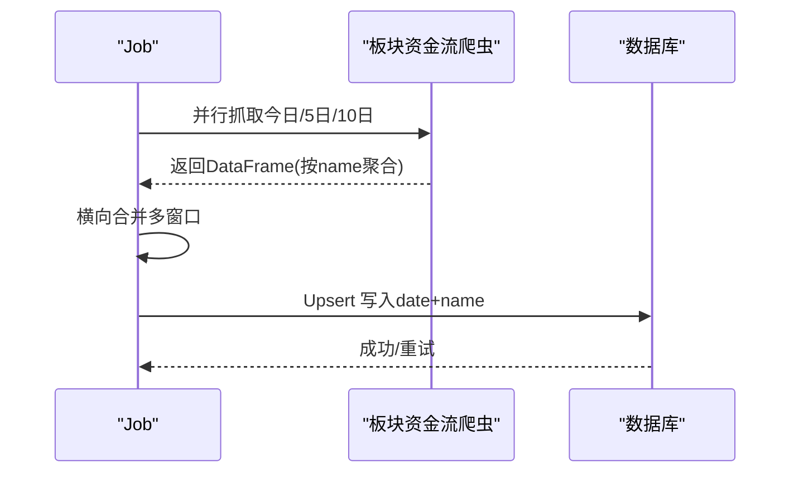
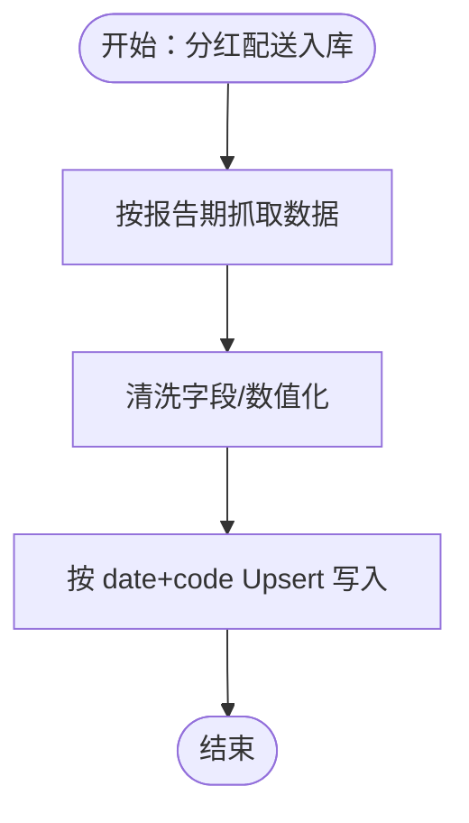
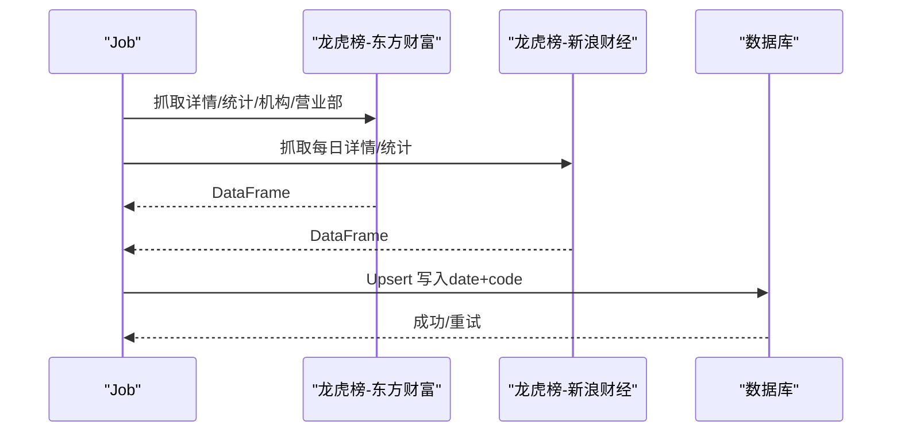
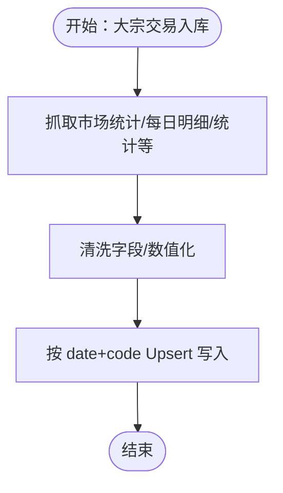
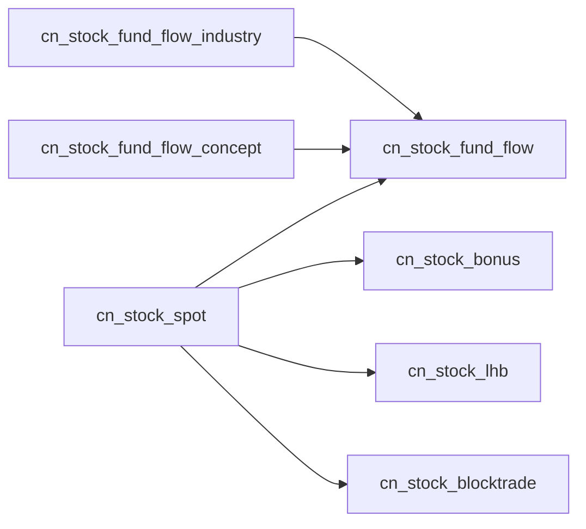

# 财务数据表

<cite>
**本文引用的文件**
- [database_schema.md](file://document/database_schema.md)
- [stock_fund_em.py](file://docker/stock/quantia/core/crawling/stock_fund_em.py)
- [stock_fhps_em.py](file://docker/stock/quantia/core/crawling/stock_fhps_em.py)
- [stock_dzjy_em.py](file://docker/stock/quantia/core/crawling/stock_dzjy_em.py)
- [stock_lhb_em.py](file://docker/stock/quantia/core/crawling/stock_lhb_em.py)
- [stock_lhb_sina.py](file://docker/stock/quantia/core/crawling/stock_lhb_sina.py)
- [basic_data_other_daily_job.py](file://docker/stock/quantia/job/basic_data_other_daily_job.py)
- [README.md](file://cron/README.md)
- [database.py](file://quantia/lib/database.py)
</cite>

## 目录
1. [简介](#简介)
2. [项目结构](#项目结构)
3. [核心组件](#核心组件)
4. [架构总览](#架构总览)
5. [详细组件分析](#详细组件分析)
6. [依赖分析](#依赖分析)
7. [性能考虑](#性能考虑)
8. [故障排查指南](#故障排查指南)
9. [结论](#结论)
10. [附录](#附录)

## 简介
本文件聚焦于 Quantia 项目中的财务相关数据表，包括：
- 股票资金流向表（cn_stock_fund_flow）
- 行业资金流向表（cn_stock_fund_flow_industry）
- 概念资金流向表（cn_stock_fund_flow_concept）
- 股票分红配送表（cn_stock_bonus）
- 股票龙虎榜表（cn_stock_lhb）
- 股票大宗交易表（cn_stock_blocktrade）

文档从设计理念、字段含义、数据结构、时间序列特性、更新频率、异常处理与数据质量保障等方面进行系统化说明，并给出与业务表的关联关系与可视化图示。

## 项目结构
财务数据主要由“数据抓取层”和“入库与调度层”组成：
- 数据抓取层：基于东方财富、新浪财经等数据源的爬虫模块，负责解析网页/接口并输出结构化 DataFrame。
- 入库与调度层：通过定时任务与 Job 脚本，将抓取结果写入数据库，并对异常情况进行重试与容错。

图表来源
- [stock_fund_em.py](file://docker/stock/quantia/core/crawling/stock_fund_em.py#L1-L514)
- [stock_fhps_em.py](file://docker/stock/quantia/core/crawling/stock_fhps_em.py#L1-L152)
- [stock_dzjy_em.py](file://docker/stock/quantia/core/crawling/stock_dzjy_em.py#L1-L555)
- [stock_lhb_em.py](file://docker/stock/quantia/core/crawling/stock_lhb_em.py#L1-L911)
- [stock_lhb_sina.py](file://docker/stock/quantia/core/crawling/stock_lhb_sina.py#L1-L311)
- [basic_data_other_daily_job.py](file://docker/stock/quantia/job/basic_data_other_daily_job.py#L1-L342)
- [README.md](file://cron/README.md#L1-L245)

章节来源
- [README.md](file://cron/README.md#L1-L245)

## 核心组件
本节概述财务数据表的设计理念与字段含义，参考数据库设计文档。

- 股票资金流向表（cn_stock_fund_flow）
  - 设计理念：按“个股”维度记录不同观察窗口（今日、3日、5日、10日）的资金流指标，包含主力、超大单、大单、中单、小单的净额与占比。
  - 时间序列：以“date+code”为主键，适合按日滚动更新。
  - 字段要点：包含各窗口涨跌幅、主力净流入净额/占比、分档单（超大/大/中/小）的净额与占比等。
  
- 行业资金流向表（cn_stock_fund_flow_industry）
  - 设计理念：按“行业”维度记录资金流向，包含当日/5日/10日涨跌幅、主力净流入、最大流入股等。
  - 字段要点：行业名称、涨跌幅、主力净流入、最大流入个股等。
  
- 概念资金流向表（cn_stock_fund_flow_concept）
  - 设计理念：与行业表类似，但按“概念”维度聚合。
  - 字段要点：概念名称、涨跌幅、主力净流入、最大流入个股等。
  
- 股票分红配送表（cn_stock_bonus）
  - 设计理念：记录每只股票的分红送转方案与关键财务指标，便于基本面筛选。
  - 字段要点：送转比例、现金分红比例、股息率、EPS、BVPS、公积金、未分配利润、总股本、预案/登记/除权除息日、方案进度等。
  
- 股票龙虎榜表（cn_stock_lhb）
  - 设计理念：记录个股在特定交易日的龙虎榜详情，包含上榜原因、净买额、买入/卖出额、成交额占比、上榜后短期涨跌幅等。
  - 字段要点：上榜日、收盘价、涨跌幅、净买额、买入/卖出额、成交额、市场总成交额、换手率、流通市值、上榜原因、上榜后1/2/5/10日涨跌幅等。
  
- 股票大宗交易表（cn_stock_blocktrade）
  - 设计理念：记录大宗交易的成交均价、折溢率、成交总量/总额、成交占比流通市值等。
  - 字段要点：成交均价、折溢率、成交笔数、成交总量、成交总额、成交占比流通市值等。

章节来源
- [database_schema.md](file://document/database_schema.md#L149-L338)

## 架构总览
财务数据的采集与入库遵循“数据获取与分析分离”的流水线架构：
- Phase 1：数据获取（API 调用集中在此阶段）
- Phase 2：基础数据入库（实时行情、ETF、选股等）
- Phase 3：扩展数据入库（分红、龙虎榜、大宗交易、资金流向等）
- Phase 4：数据分析（指标、K线形态、策略、回测等）

图表来源
- [README.md](file://cron/README.md#L27-L43)
- [basic_data_other_daily_job.py](file://docker/stock/quantia/job/basic_data_other_daily_job.py#L67-L129)

章节来源
- [README.md](file://cron/README.md#L1-L245)
- [basic_data_other_daily_job.py](file://docker/stock/quantia/job/basic_data_other_daily_job.py#L1-L342)

## 详细组件分析

### 股票资金流向表（cn_stock_fund_flow）
- 数据来源与实现
  - 爬虫实现：通过东方财富接口获取“个股资金流向”数据，支持今日/3日/5日/10日四个窗口，自动分页抓取并清洗字段。
  - 入库实现：Job 在每日任务中调用抓取函数，合并多窗口数据，按“date+code”去重写入。
- 字段含义与复杂度
  - 字段组织：按窗口分组（今日/3日/5日/10日），每组包含涨跌幅、主力净流入（净额/占比）、分档单（超大/大/中/小）的净额与占比。
  - 合并策略：以任一窗口为基础，剔除重复列后横向拼接，避免 change_rate 冲突。
- 时间序列与更新频率
  - 更新频率：工作日每日一次（收盘后或交易时段多次）。
  - 主键：date+code，天然支持按日滚动更新。
- 异常处理与质量保障
  - 抓取失败：任一窗口失败不中断整体流程，使用首个成功窗口作为基础数据。
  - 写入机制：Upsert（INSERT ... ON DUPLICATE KEY UPDATE），并发写入不冲突；数据库层内置重试（死锁/锁超时/连接异常）。
- 关联关系
  - 与每日股票数据表（cn_stock_spot）存在共同主键（date+code），可用于联合分析。

图表来源
- [stock_fund_em.py](file://docker/stock/quantia/core/crawling/stock_fund_em.py#L46-L266)
- [basic_data_other_daily_job.py](file://docker/stock/quantia/job/basic_data_other_daily_job.py#L131-L163)

章节来源
- [stock_fund_em.py](file://docker/stock/quantia/core/crawling/stock_fund_em.py#L1-L514)
- [basic_data_other_daily_job.py](file://docker/stock/quantia/job/basic_data_other_daily_job.py#L67-L129)
- [database_schema.md](file://document/database_schema.md#L149-L210)
- [database.py](file://quantia/lib/database.py#L267-L303)

### 行业/概念资金流向表（cn_stock_fund_flow_industry / cn_stock_fund_flow_concept）
- 数据来源与实现
  - 爬虫实现：通过东方财富接口获取“板块资金流”，支持行业/概念两类，按今日/5日/10日窗口聚合。
  - 入库实现：Job 并行抓取多个窗口，横向合并后按“date+name”写入。
- 字段含义与复杂度
  - 字段组织：包含涨跌幅、主力净流入（净额/占比）、最大流入个股等。
  - 合并策略：按 name 字段横向拼接，避免重复列。
- 时间序列与更新频率
  - 更新频率：工作日每日一次。
  - 主键：date+name，适合按日滚动更新。
- 异常处理与质量保障
  - 抓取失败：窗口级失败不影响其他窗口；若无窗口成功则跳过。
  - 写入机制：Upsert，数据库层重试。
- 关联关系
  - 与行业/概念分类信息可结合使用，辅助资金流向主题分析。

图表来源
- [stock_fund_em.py](file://docker/stock/quantia/core/crawling/stock_fund_em.py#L299-L487)
- [basic_data_other_daily_job.py](file://docker/stock/quantia/job/basic_data_other_daily_job.py#L177-L235)

章节来源
- [stock_fund_em.py](file://docker/stock/quantia/core/crawling/stock_fund_em.py#L269-L487)
- [basic_data_other_daily_job.py](file://docker/stock/quantia/job/basic_data_other_daily_job.py#L166-L235)
- [database_schema.md](file://document/database_schema.md#L214-L254)
- [database.py](file://quantia/lib/database.py#L267-L303)

### 股票分红配送表（cn_stock_bonus）
- 数据来源与实现
  - 爬虫实现：通过东方财富接口按报告期抓取分红送转数据，自动分页并清洗字段。
  - 入库实现：按“date+code”写入，覆盖历史。
- 字段含义与复杂度
  - 字段组织：送转比例（总/送/转）、现金分红比例/股息率、EPS/BVPS、公积金/未分配利润、总股本、预案/登记/除权除息日、方案进度等。
- 时间序列与更新频率
  - 更新频率：工作日每日一次。
  - 主键：date+code，适合按日滚动更新。
- 异常处理与质量保障
  - 写入机制：Upsert，数据库层重试。
- 关联关系
  - 与每日股票数据表（cn_stock_spot）存在共同主键（date+code），可用于基本面因子构建。

图表来源
- [stock_fhps_em.py](file://docker/stock/quantia/core/crawling/stock_fhps_em.py#L21-L146)
- [basic_data_other_daily_job.py](file://docker/stock/quantia/job/basic_data_other_daily_job.py#L238-L258)

章节来源
- [stock_fhps_em.py](file://docker/stock/quantia/core/crawling/stock_fhps_em.py#L1-L152)
- [basic_data_other_daily_job.py](file://docker/stock/quantia/job/basic_data_other_daily_job.py#L238-L258)
- [database_schema.md](file://document/database_schema.md#L258-L284)
- [database.py](file://quantia/lib/database.py#L267-L303)

### 股票龙虎榜表（cn_stock_lhb）
- 数据来源与实现
  - 数据源：东方财富与新浪财经双源并行。
  - 爬虫实现：东方财富提供“龙虎榜详情”“个股统计”“机构统计”“活跃营业部”“营业部排行”等接口；新浪财经提供“每日详情”“个股统计”“营业部统计”等接口。
  - 入库实现：按“date+code”写入，覆盖历史。
- 字段含义与复杂度
  - 字段组织：上榜日、收盘价/涨跌幅、净买额/买入/卖出额、成交额/市场总成交额占比、换手率、流通市值、上榜原因、上榜后1/2/5/10日涨跌幅等。
- 时间序列与更新频率
  - 更新频率：工作日每日一次。
  - 主键：date+code，适合按日滚动更新。
- 异常处理与质量保障
  - 写入机制：Upsert，数据库层重试。
- 关联关系
  - 与每日股票数据表（cn_stock_spot）存在共同主键（date+code），可用于短期涨跌归因与交易行为分析。

图表来源
- [stock_lhb_em.py](file://docker/stock/quantia/core/crawling/stock_lhb_em.py#L21-L136)
- [stock_lhb_sina.py](file://docker/stock/quantia/core/crawling/stock_lhb_sina.py#L33-L81)
- [basic_data_other_daily_job.py](file://docker/stock/quantia/job/basic_data_other_daily_job.py#L21-L64)

章节来源
- [stock_lhb_em.py](file://docker/stock/quantia/core/crawling/stock_lhb_em.py#L1-L911)
- [stock_lhb_sina.py](file://docker/stock/quantia/core/crawling/stock_lhb_sina.py#L1-L311)
- [basic_data_other_daily_job.py](file://docker/stock/quantia/job/basic_data_other_daily_job.py#L21-L64)
- [database_schema.md](file://document/database_schema.md#L288-L316)
- [database.py](file://quantia/lib/database.py#L267-L303)

### 股票大宗交易表（cn_stock_blocktrade）
- 数据来源与实现
  - 数据源：东方财富。
  - 爬虫实现：提供“市场统计”“每日明细”“每日统计”“活跃A股统计”“活跃营业部统计”“营业部排行”等接口，按日聚合。
  - 入库实现：按“date+code”写入，覆盖历史。
- 字段含义与复杂度
  - 字段组织：成交均价、折溢率、成交笔数、成交总量、成交总额、成交占比流通市值等。
- 时间序列与更新频率
  - 更新频率：工作日每日一次。
  - 主键：date+code，适合按日滚动更新。
- 异常处理与质量保障
  - 写入机制：Upsert，数据库层重试。
- 关联关系
  - 与每日股票数据表（cn_stock_spot）存在共同主键（date+code），可用于大宗交易对股价影响的短期分析。

图表来源
- [stock_dzjy_em.py](file://docker/stock/quantia/core/crawling/stock_dzjy_em.py#L20-L270)
- [basic_data_other_daily_job.py](file://docker/stock/quantia/job/basic_data_other_daily_job.py#L309-L328)

章节来源
- [stock_dzjy_em.py](file://docker/stock/quantia/core/crawling/stock_dzjy_em.py#L1-L555)
- [basic_data_other_daily_job.py](file://docker/stock/quantia/job/basic_data_other_daily_job.py#L309-L328)
- [database_schema.md](file://document/database_schema.md#L320-L338)
- [database.py](file://quantia/lib/database.py#L267-L303)

## 依赖分析
财务数据表之间的依赖关系如下：

图表来源
- [database_schema.md](file://document/database_schema.md#L703-L729)

章节来源
- [database_schema.md](file://document/database_schema.md#L703-L729)

## 性能考虑
- 数据获取与分析分离：通过 Phase 1/2/3/4 的流水线，避免获取阶段阻塞分析阶段，提升整体吞吐。
- 并发抓取：Job 层对部分数据源采用线程池并发抓取，缩短等待时间。
- 写入优化：Upsert + 数据库层重试，减少重复写入与锁冲突。
- 内存控制：历史K线缓存采用低内存模式，避免峰值内存过高。

## 故障排查指南
- 数据写入失败
  - 现象：数据库写入报错（死锁/锁超时/连接异常）。
  - 处理：检查数据库连接配置与网络；系统内置重试（最多3次），必要时人工重试。
- 抓取失败
  - 现象：某数据源接口返回空或异常。
  - 处理：检查数据源可用性与网络；系统对资金流向采用“任一窗口成功即可”的策略，确保数据连续性。
- 主键冲突
  - 现象：重复写入导致主键冲突。
  - 处理：使用 Upsert 机制自动更新；若仍冲突，检查 date+key 组合是否正确。
- 日期参数问题
  - 现象：部分接口需要日期参数，传参错误导致空结果。
  - 处理：核对日期格式（YYYY-MM-DD），并在必要时使用工具接口查询可用日期。

章节来源
- [README.md](file://cron/README.md#L168-L213)
- [database.py](file://quantia/lib/database.py#L267-L303)
- [basic_data_other_daily_job.py](file://docker/stock/quantia/job/basic_data_other_daily_job.py#L67-L129)

## 结论
财务数据表围绕“日频更新、多源并行、Upsert 写入、异常重试”的设计原则构建，既满足高频交易与分析需求，又具备良好的稳定性与可维护性。通过与每日股票数据表的主键对齐，形成统一的时间序列数据基座，便于进一步的因子工程与策略回测。

## 附录
- 数据表汇总（节选）
  - cn_stock_fund_flow：个股资金流向（date+code）
  - cn_stock_fund_flow_industry：行业资金流向（date+name）
  - cn_stock_fund_flow_concept：概念资金流向（date+name）
  - cn_stock_bonus：分红配送（date+code）
  - cn_stock_lhb：龙虎榜（date+code）
  - cn_stock_blocktrade：大宗交易（date+code）

章节来源
- [database_schema.md](file://document/database_schema.md#L733-L770)
