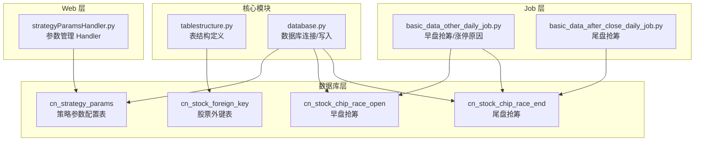
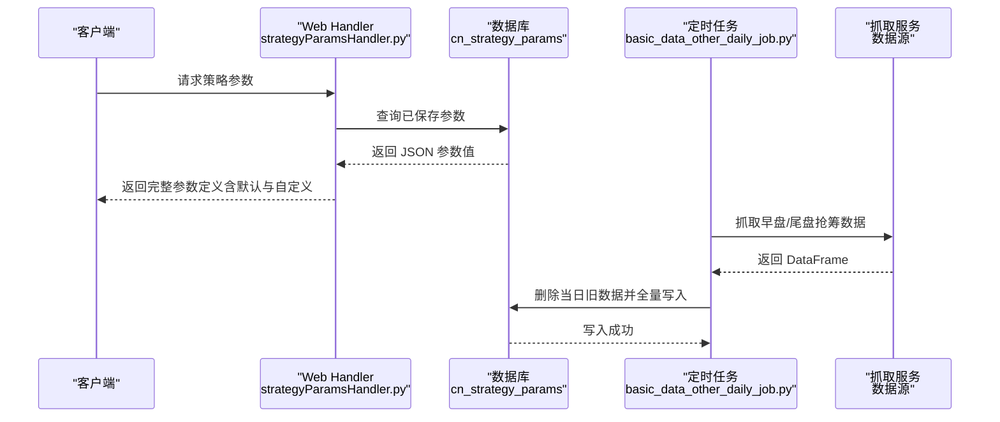
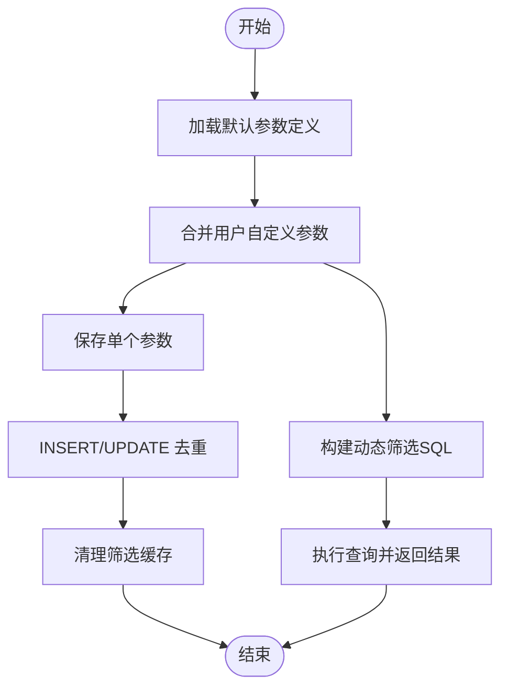
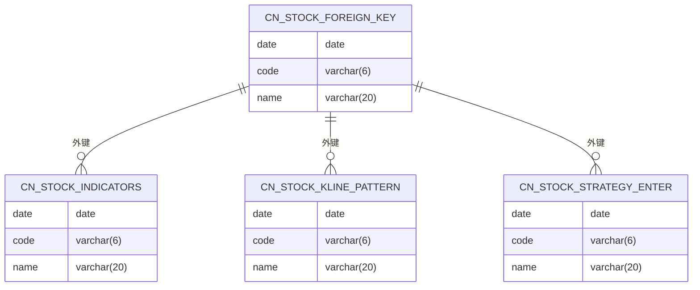
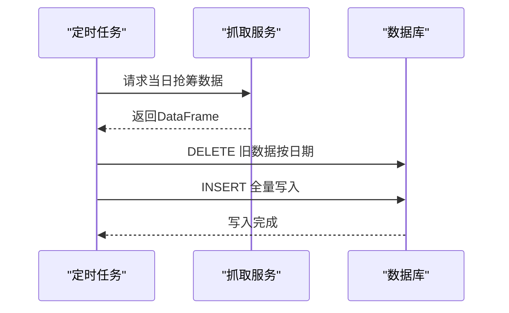
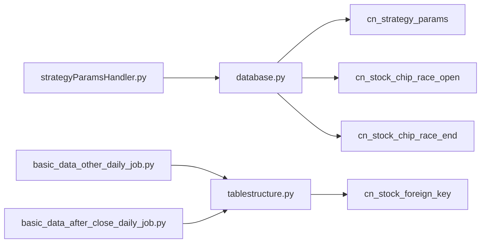

# 辅助数据表

<cite>
**本文引用的文件**
- [database_schema.md](file://document/database_schema.md)
- [init_database.sql](file://docker/init_database.sql)
- [strategyParamsHandler.py](file://docker/stock/quantia/web/strategyParamsHandler.py)
- [tablestructure.py](file://docker/stock/quantia/core/tablestructure.py)
- [basic_data_other_daily_job.py](file://docker/stock/quantia/job/basic_data_other_daily_job.py)
- [basic_data_after_close_daily_job.py](file://docker/stock/quantia/job/basic_data_after_close_daily_job.py)
- [database.py](file://docker/stock/quantia/lib/database.py)
</cite>

## 目录
1. [简介](#简介)
2. [项目结构](#项目结构)
3. [核心组件](#核心组件)
4. [架构概览](#架构概览)
5. [详细组件分析](#详细组件分析)
6. [依赖分析](#依赖分析)
7. [性能考虑](#性能考虑)
8. [故障排查指南](#故障排查指南)
9. [结论](#结论)
10. [附录](#附录)

## 简介
本文件聚焦于 Quantia 项目中的辅助数据表，围绕以下三类关键辅助表展开：
- 策略参数配置表：cn_strategy_params，用于持久化策略参数集（gpt_value、moat_scoring、ai_model），支持参数的读取、保存、重置与动态筛选。
- 股票外键表：cn_stock_foreign_key，用于统一存储日期、代码、名称等外键字段，作为多张核心表的公共外键基座。
- 早盘/尾盘抢筹数据表：cn_stock_chip_race_open、cn_stock_chip_race_end，用于记录集合竞价阶段的资金博弈数据。

本文件将系统阐述这些辅助表的设计理念、数据结构、更新流程、与其他核心表的关联关系、数据一致性保障以及配置管理最佳实践。

## 项目结构
辅助数据表在数据库层以独立表的形式存在，配合 Web 层参数管理 Handler、Job 层定时抓取与入库、以及核心表结构定义模块共同构成完整的数据管线。

图表来源
- [strategyParamsHandler.py](file://docker/stock/quantia/web/strategyParamsHandler.py#L450-L468)
- [init_database.sql](file://docker/init_database.sql#L250-L286)
- [tablestructure.py](file://docker/stock/quantia/core/tablestructure.py#L311-L315)
- [basic_data_other_daily_job.py](file://docker/stock/quantia/job/basic_data_other_daily_job.py#L289-L329)
- [basic_data_after_close_daily_job.py](file://docker/stock/quantia/job/basic_data_after_close_daily_job.py#L40-L68)
- [database.py](file://docker/stock/quantia/lib/database.py#L87-L138)

章节来源
- [database_schema.md](file://document/database_schema.md#L777-L786)
- [init_database.sql](file://docker/init_database.sql#L250-L286)
- [tablestructure.py](file://docker/stock/quantia/core/tablestructure.py#L311-L315)

## 核心组件
- 策略参数配置表（cn_strategy_params）
  - 设计目标：将策略参数以“策略标识+参数键”的联合主键形式持久化，支持默认参数与用户自定义参数的合并展示与动态筛选。
  - 关键字段：strategy_key、param_key、param_value（JSON）、updated_at。
  - 初始化：若表不存在则自动创建。
  - 访问路径：Web Handler 提供查询、保存、重置接口；动态筛选时按需构建 SQL 条件。
- 股票外键表（cn_stock_foreign_key）
  - 设计目标：统一提供 date、code、name 三字段作为外键基座，便于多表关联与数据一致性。
  - 结构来源：由核心表结构定义模块集中声明，确保各表字段对齐。
- 早盘/尾盘抢筹数据表（cn_stock_chip_race_open、cn_stock_chip_race_end）
  - 设计目标：记录集合竞价阶段的买卖盘、成交金额、涨跌幅等关键指标，支撑“抢筹”主题策略。
  - 更新策略：每日定时任务抓取并全量替换当日数据，确保数据新鲜度。

章节来源
- [strategyParamsHandler.py](file://docker/stock/quantia/web/strategyParamsHandler.py#L450-L468)
- [tablestructure.py](file://docker/stock/quantia/core/tablestructure.py#L311-L315)
- [init_database.sql](file://docker/init_database.sql#L250-L286)
- [basic_data_other_daily_job.py](file://docker/stock/quantia/job/basic_data_other_daily_job.py#L289-L329)
- [basic_data_after_close_daily_job.py](file://docker/stock/quantia/job/basic_data_after_close_daily_job.py#L40-L68)

## 架构概览
策略参数配置表与股票外键表在系统中承担“配置中心”和“外键基座”的角色，早盘/尾盘抢筹表则提供高频交易时段的微观资金流特征。它们通过 Job 层抓取、Web 层配置、数据库层持久化形成闭环。

图表来源
- [strategyParamsHandler.py](file://docker/stock/quantia/web/strategyParamsHandler.py#L513-L558)
- [basic_data_other_daily_job.py](file://docker/stock/quantia/job/basic_data_other_daily_job.py#L289-L329)
- [database.py](file://docker/stock/quantia/lib/database.py#L87-L138)

## 详细组件分析

### 组件A：策略参数配置表（cn_strategy_params）
- 参数集分类与含义
  - gpt_value：GPT综合选股筛选条件，覆盖财务安全、盈利能力、成长质量、估值约束四个维度，参数均来自默认定义，支持用户自定义覆盖。
  - moat_scoring：护城河评分模型权重与阈值，用于量化评分与定性评分的配比，以及不同等级的分数线。
  - ai_model：AI/LLM API 配置，包括接口地址、密钥、模型、温度、最大 Token 数、超时时间等。
- 参数验证机制
  - Web 层在保存参数时进行基础校验：策略标识合法性、JSON 解析有效性、参数键存在性（与默认定义对比）。
  - 动态筛选时，Handler 会将用户自定义值与默认值合并，构建 SQL WHERE 条件，确保字段非空与范围约束。
- 数据持久化与一致性
  - 表不存在时自动创建；保存采用“插入/更新”策略，保证同一策略键下的参数键唯一。
  - 参数变更后主动清理筛选结果缓存，避免脏数据影响。
- 更新策略
  - 用户通过 Web 接口提交；系统仅持久化用户自定义值，其余沿用默认定义。

图表来源
- [strategyParamsHandler.py](file://docker/stock/quantia/web/strategyParamsHandler.py#L513-L558)
- [strategyParamsHandler.py](file://docker/stock/quantia/web/strategyParamsHandler.py#L484-L498)
- [strategyParamsHandler.py](file://docker/stock/quantia/web/strategyParamsHandler.py#L614-L626)

章节来源
- [strategyParamsHandler.py](file://docker/stock/quantia/web/strategyParamsHandler.py#L24-L442)
- [strategyParamsHandler.py](file://docker/stock/quantia/web/strategyParamsHandler.py#L450-L468)
- [strategyParamsHandler.py](file://docker/stock/quantia/web/strategyParamsHandler.py#L513-L558)
- [strategyParamsHandler.py](file://docker/stock/quantia/web/strategyParamsHandler.py#L591-L626)

### 组件B：股票外键表（cn_stock_foreign_key）
- 设计理念
  - 统一提供 date、code、name 三字段作为外键基座，减少重复字段与不一致风险。
  - 作为多张核心表（如指标、K线形态、策略选股等）的外键来源，提升关联查询效率与维护性。
- 数据标准化处理
  - 字段类型与长度在核心表结构定义模块中集中声明，确保各表字段对齐。
  - 通过数据库层的插入工具自动添加主键与索引，保证唯一性与查询性能。
- 与其他核心表的关系
  - 作为外键基座被多张核心表引用，形成“外键表 → 多核心表”的一对多关系。

图表来源
- [tablestructure.py](file://docker/stock/quantia/core/tablestructure.py#L311-L315)
- [tablestructure.py](file://docker/stock/quantia/core/tablestructure.py#L396-L407)

章节来源
- [tablestructure.py](file://docker/stock/quantia/core/tablestructure.py#L311-L315)
- [database.py](file://docker/stock/quantia/lib/database.py#L87-L138)

### 组件C：早盘/尾盘抢筹数据表（cn_stock_chip_race_open、cn_stock_chip_race_end）
- 数据来源与更新策略
  - 早盘抢筹：每日定时任务抓取集合竞价阶段数据，删除当日旧数据后全量写入。
  - 尾盘抢筹：每日定时任务抓取尾盘集合竞价阶段数据，删除当日旧数据后全量写入。
  - 涨停原因：每日定时任务抓取涨停原因数据，删除当日旧数据后全量写入。
- 数据结构与字段
  - 包含日期、代码、名称、最新价、涨跌幅、昨收、开盘、成交金额、委比、委托量、成交占比、连板天数、板块等字段。
- 数据一致性保证
  - 每日全量替换策略，确保数据新鲜度；通过主键（date, code）保证唯一性。

图表来源
- [basic_data_other_daily_job.py](file://docker/stock/quantia/job/basic_data_other_daily_job.py#L289-L329)
- [basic_data_after_close_daily_job.py](file://docker/stock/quantia/job/basic_data_after_close_daily_job.py#L40-L68)
- [init_database.sql](file://docker/init_database.sql#L250-L286)

章节来源
- [init_database.sql](file://docker/init_database.sql#L250-L286)
- [basic_data_other_daily_job.py](file://docker/stock/quantia/job/basic_data_other_daily_job.py#L289-L329)
- [basic_data_after_close_daily_job.py](file://docker/stock/quantia/job/basic_data_after_close_daily_job.py#L40-L68)

## 依赖分析
- Web 层依赖数据库层提供的连接与写入工具，用于参数表的创建、读取与更新。
- Job 层依赖核心表结构定义模块提供的字段类型与表名，确保写入字段与表结构一致。
- 策略参数表与早盘/尾盘抢筹表分别服务于“配置管理”和“高频交易特征”，二者与核心表之间通过外键表建立间接关联。

图表来源
- [strategyParamsHandler.py](file://docker/stock/quantia/web/strategyParamsHandler.py#L450-L468)
- [database.py](file://docker/stock/quantia/lib/database.py#L87-L138)
- [basic_data_other_daily_job.py](file://docker/stock/quantia/job/basic_data_other_daily_job.py#L289-L329)
- [basic_data_after_close_daily_job.py](file://docker/stock/quantia/job/basic_data_after_close_daily_job.py#L40-L68)
- [tablestructure.py](file://docker/stock/quantia/core/tablestructure.py#L311-L315)

章节来源
- [strategyParamsHandler.py](file://docker/stock/quantia/web/strategyParamsHandler.py#L450-L468)
- [database.py](file://docker/stock/quantia/lib/database.py#L87-L138)
- [tablestructure.py](file://docker/stock/quantia/core/tablestructure.py#L311-L315)

## 性能考虑
- 连接池与写入策略
  - 数据库连接采用轻量连接池，避免频繁创建销毁连接；批量写入时尽量使用 DataFrame 直接写入，减少逐行插入开销。
- 索引与主键
  - 辅助表均设置主键（如 date+code），确保唯一性与查询效率；必要时可按查询热点添加二级索引。
- 缓存与失效
  - 参数变更后主动清理筛选结果缓存，避免脏数据影响；建议结合 TTL 控制缓存生命周期。

## 故障排查指南
- 策略参数表未创建
  - 现象：首次访问参数接口报错或无法保存。
  - 处理：确认 Handler 中的自动建表逻辑是否执行；检查数据库权限与字符集设置。
- 参数保存失败
  - 现象：保存接口返回错误。
  - 处理：检查请求体 JSON 是否合法、策略标识是否有效、数据库连接状态。
- 抢筹数据为空
  - 现象：早盘/尾盘抢筹表无数据。
  - 处理：确认定时任务是否正常运行、抓取服务可用性、当日是否为交易日。
- 写入失败或主键冲突
  - 现象：写入时报错或重复。
  - 处理：检查表结构是否与字段类型定义一致、是否先执行了当日数据清理、主键是否正确。

章节来源
- [strategyParamsHandler.py](file://docker/stock/quantia/web/strategyParamsHandler.py#L591-L626)
- [database.py](file://docker/stock/quantia/lib/database.py#L179-L200)
- [basic_data_other_daily_job.py](file://docker/stock/quantia/job/basic_data_other_daily_job.py#L289-L329)
- [basic_data_after_close_daily_job.py](file://docker/stock/quantia/job/basic_data_after_close_daily_job.py#L40-L68)

## 结论
辅助数据表在 Quantia 项目中承担着“配置中心”“外键基座”“高频交易特征”的关键职责。策略参数配置表通过默认与自定义参数的融合，实现了灵活可配置的筛选能力；股票外键表提供了统一的外键基座，提升了多表关联的一致性与可维护性；早盘/尾盘抢筹表则为交易策略提供了重要的微观资金流特征。通过定时任务抓取、参数管理 Handler 与数据库层工具的协同，系统实现了高效、稳定的数据更新与查询体验。

## 附录
- 快速初始化脚本
  - 使用提供的初始化脚本创建所有表，包括策略参数表、外键表与抢筹表。
- 配置管理最佳实践
  - 参数变更后及时清理缓存；对关键参数设置合理的最小/最大边界；定期审计参数表结构与数据一致性。

章节来源
- [database_schema.md](file://document/database_schema.md#L789-L800)
- [init_database.sql](file://docker/init_database.sql#L1-L36)
