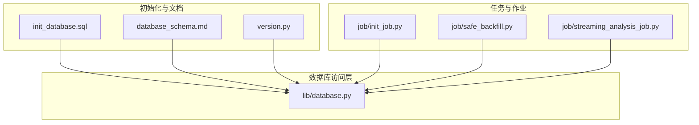
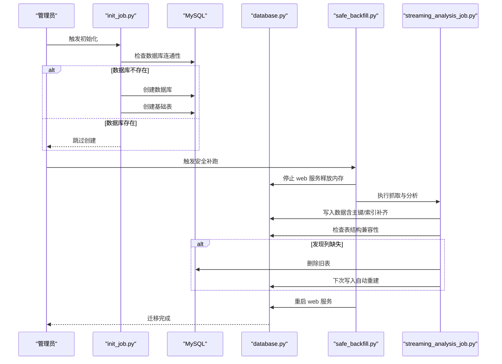
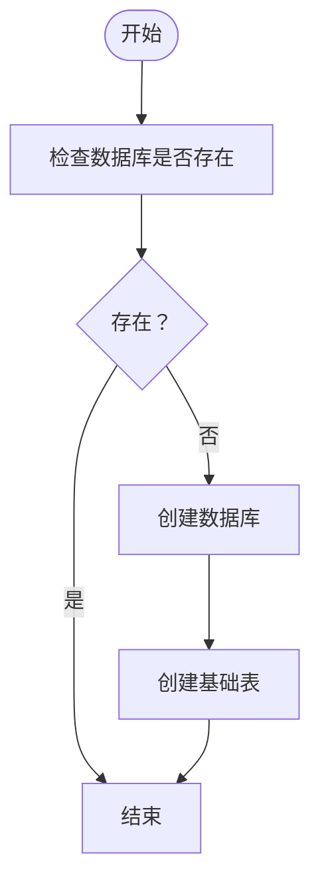
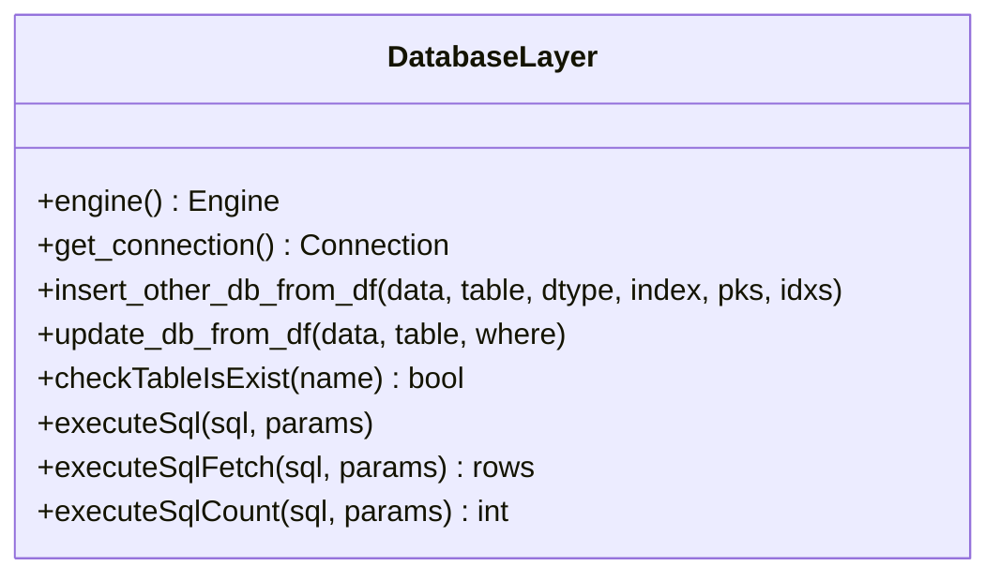
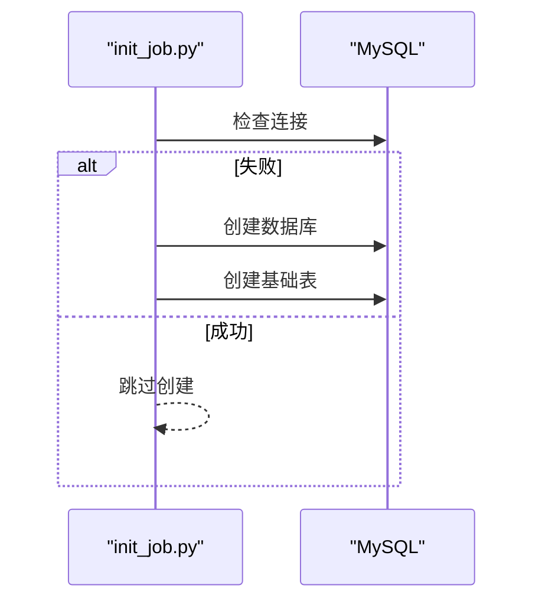
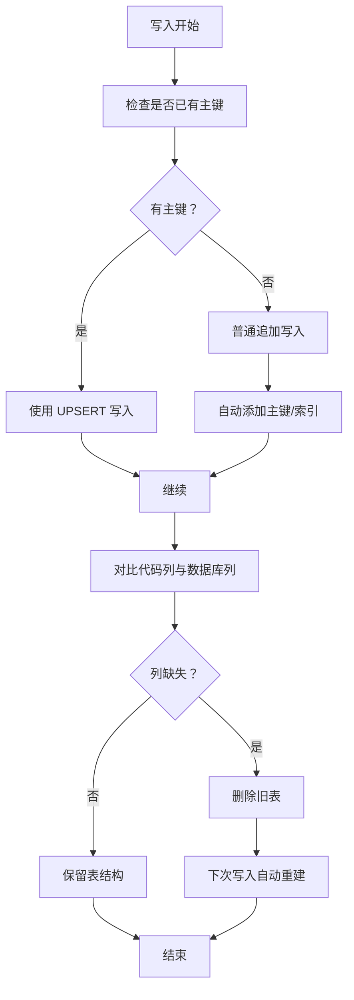
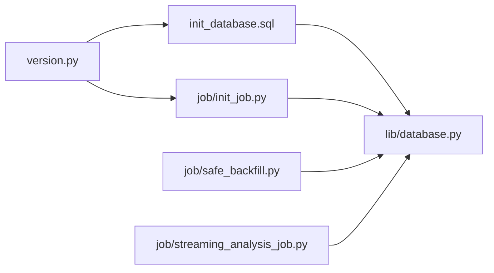

# 数据迁移方案

<cite>
**本文引用的文件**
- [init_database.sql](file://docker/init_database.sql)
- [database_schema.md](file://document/database_schema.md)
- [database.py](file://docker/stock/quantia/lib/database.py)
- [database.py](file://quantia/lib/database.py)
- [version.py](file://docker/stock/quantia/lib/version.py)
- [version.py](file://quantia/lib/version.py)
- [init_job.py](file://docker/stock/quantia/job/init_job.py)
- [safe_backfill.py](file://docker/stock/quantia/job/safe_backfill.py)
- [streaming_analysis_job.py](file://quantia/job/streaming_analysis_job.py)
</cite>

## 目录
1. [简介](#简介)
2. [项目结构](#项目结构)
3. [核心组件](#核心组件)
4. [架构概览](#架构概览)
5. [详细组件分析](#详细组件分析)
6. [依赖分析](#依赖分析)
7. [性能考虑](#性能考虑)
8. [故障排查指南](#故障排查指南)
9. [结论](#结论)
10. [附录](#附录)

## 简介
本方案面向 Quantia 项目的数据库版本管理与数据迁移，目标是提供一套安全、可靠、可回滚、可验证的数据库升级与维护流程。内容涵盖版本标识、表结构变更策略、初始化与增量迁移、兼容性处理、数据一致性保障、风险控制、性能影响评估、迁移验证方法、工具使用与自动化脚本、监控与告警配置建议，帮助系统管理员在生产环境中高效完成数据库升级与维护。

## 项目结构
Quantia 采用“初始化脚本 + Python 数据层 + 任务调度”的结构组织数据库相关代码与资源：
- 初始化脚本：集中定义数据库与表结构，便于一次性部署与版本化管理
- 数据库访问层：封装连接、插入、更新、查询、主键/索引管理等通用能力
- 任务与作业：提供初始化、补跑、分析等自动化流程
- 文档与版本：数据库设计文档与版本号管理

图表来源
- [init_database.sql](file://docker/init_database.sql#L1-L455)
- [database_schema.md](file://document/database_schema.md#L1-L800)
- [database.py](file://docker/stock/quantia/lib/database.py#L1-L232)
- [init_job.py](file://docker/stock/quantia/job/init_job.py#L1-L66)
- [safe_backfill.py](file://docker/stock/quantia/job/safe_backfill.py#L1-L86)
- [streaming_analysis_job.py](file://quantia/job/streaming_analysis_job.py#L319-L348)

章节来源
- [init_database.sql](file://docker/init_database.sql#L1-L455)
- [database_schema.md](file://document/database_schema.md#L1-L800)
- [database.py](file://docker/stock/quantia/lib/database.py#L1-L232)
- [init_job.py](file://docker/stock/quantia/job/init_job.py#L1-L66)
- [safe_backfill.py](file://docker/stock/quantia/job/safe_backfill.py#L1-L86)
- [streaming_analysis_job.py](file://quantia/job/streaming_analysis_job.py#L319-L348)

## 核心组件
- 初始化脚本：统一创建数据库与基础表，支持版本化与可重复执行
- 数据库访问层：提供连接池、UPSERT、主键/索引自动补齐、SQL 执行与查询等能力
- 任务与作业：初始化数据库、安全补跑、流式分析与表结构兼容性检查
- 版本管理：以版本号文件标识系统版本，配合初始化脚本与作业实现演进

章节来源
- [init_database.sql](file://docker/init_database.sql#L1-L455)
- [database.py](file://docker/stock/quantia/lib/database.py#L58-L232)
- [init_job.py](file://docker/stock/quantia/job/init_job.py#L19-L61)
- [safe_backfill.py](file://docker/stock/quantia/job/safe_backfill.py#L1-L86)
- [streaming_analysis_job.py](file://quantia/job/streaming_analysis_job.py#L319-L348)
- [version.py](file://docker/stock/quantia/lib/version.py#L7-L9)

## 架构概览
数据库迁移与维护的整体流程如下：
- 初始化阶段：通过初始化脚本创建数据库与基础表；若数据库不存在则自动创建
- 日常增量：通过作业执行数据抓取、指标计算、策略生成与回测，同时进行表结构兼容性检查
- 兼容性与回滚：当检测到表结构不兼容时，删除旧表并自动重建，确保数据一致性
- 性能与稳定性：提供安全补跑脚本，在低内存场景下分步执行并自动重启服务

图表来源
- [init_job.py](file://docker/stock/quantia/job/init_job.py#L46-L61)
- [safe_backfill.py](file://docker/stock/quantia/job/safe_backfill.py#L31-L84)
- [streaming_analysis_job.py](file://quantia/job/streaming_analysis_job.py#L319-L348)
- [database.py](file://docker/stock/quantia/lib/database.py#L87-L138)

章节来源
- [init_job.py](file://docker/stock/quantia/job/init_job.py#L46-L61)
- [safe_backfill.py](file://docker/stock/quantia/job/safe_backfill.py#L31-L84)
- [streaming_analysis_job.py](file://quantia/job/streaming_analysis_job.py#L319-L348)
- [database.py](file://docker/stock/quantia/lib/database.py#L87-L138)

## 详细组件分析

### 初始化脚本与版本管理
- 初始化脚本负责创建数据库与所有核心表，支持重复执行且具备幂等性
- 版本号文件用于标识系统版本，便于发布与升级追踪
- 初始化脚本与版本号共同构成“版本化初始化”的基础

图表来源
- [init_database.sql](file://docker/init_database.sql#L5-L15)
- [version.py](file://docker/stock/quantia/lib/version.py#L7-L9)

章节来源
- [init_database.sql](file://docker/init_database.sql#L1-L455)
- [version.py](file://docker/stock/quantia/lib/version.py#L7-L9)

### 数据库访问层（连接、插入、更新、主键/索引）
- 连接与连接池：单例模式创建 SQLAlchemy 引擎，配置连接池大小与回收策略
- UPSERT：基于 MySQL ON DUPLICATE KEY UPDATE 实现并发安全写入
- 主键/索引补齐：首次写入时自动检测并添加主键与索引
- SQL 执行与查询：提供通用的执行、查询与计数接口，支持重试与瞬态错误处理

图表来源
- [database.py](file://docker/stock/quantia/lib/database.py#L58-L232)

章节来源
- [database.py](file://docker/stock/quantia/lib/database.py#L58-L232)

### 任务与作业（初始化、安全补跑、流式分析）
- 初始化作业：检查数据库连通性，不存在则创建数据库与基础表
- 安全补跑：在低内存环境下分步执行抓取与分析，并自动重启服务
- 流式分析：写入数据前检查表结构兼容性，发现缺失列则删除旧表并重建

图表来源
- [init_job.py](file://docker/stock/quantia/job/init_job.py#L46-L61)

章节来源
- [init_job.py](file://docker/stock/quantia/job/init_job.py#L19-L61)
- [safe_backfill.py](file://docker/stock/quantia/job/safe_backfill.py#L31-L84)
- [streaming_analysis_job.py](file://quantia/job/streaming_analysis_job.py#L319-L348)

### 表结构变更与兼容性处理
- 自动补齐主键与索引：首次写入时检测并添加，避免重复插入错误
- 兼容性检查：写入前对比代码定义列与数据库实际列，发现缺失则删除旧表，下次写入自动重建
- 幂等性：初始化脚本与数据库访问层均支持重复执行，降低人工干预成本

图表来源
- [database.py](file://docker/stock/quantia/lib/database.py#L126-L138)
- [streaming_analysis_job.py](file://quantia/job/streaming_analysis_job.py#L319-L348)

章节来源
- [database.py](file://docker/stock/quantia/lib/database.py#L126-L138)
- [streaming_analysis_job.py](file://quantia/job/streaming_analysis_job.py#L319-L348)

## 依赖分析
- 初始化脚本依赖数据库访问层提供的连接与执行能力
- 任务与作业依赖数据库访问层的连接池与写入能力
- 版本号文件为发布与升级提供依据
- 流式分析依赖信息表结构检查与自动重建逻辑

图表来源
- [init_database.sql](file://docker/init_database.sql#L1-L455)
- [database.py](file://docker/stock/quantia/lib/database.py#L1-L232)
- [init_job.py](file://docker/stock/quantia/job/init_job.py#L1-L66)
- [safe_backfill.py](file://docker/stock/quantia/job/safe_backfill.py#L1-L86)
- [streaming_analysis_job.py](file://quantia/job/streaming_analysis_job.py#L319-L348)
- [version.py](file://docker/stock/quantia/lib/version.py#L7-L9)

章节来源
- [init_database.sql](file://docker/init_database.sql#L1-L455)
- [database.py](file://docker/stock/quantia/lib/database.py#L1-L232)
- [init_job.py](file://docker/stock/quantia/job/init_job.py#L1-L66)
- [safe_backfill.py](file://docker/stock/quantia/job/safe_backfill.py#L1-L86)
- [streaming_analysis_job.py](file://quantia/job/streaming_analysis_job.py#L319-L348)
- [version.py](file://docker/stock/quantia/lib/version.py#L7-L9)

## 性能考虑
- 连接池优化：根据服务器资源配置合理的 pool_size 与 max_overflow，避免连接争用
- 写入策略：优先使用 UPSERT 减少主键冲突与死锁风险
- 低内存场景：安全补跑脚本通过停止 web 服务与限制并发，降低内存峰值
- 索引与主键：自动补齐主键与常用索引，提升查询与去重效率

章节来源
- [database.py](file://docker/stock/quantia/lib/database.py#L61-L69)
- [safe_backfill.py](file://docker/stock/quantia/job/safe_backfill.py#L48-L52)

## 故障排查指南
- 连接失败与瞬态错误：数据库访问层对可重试错误进行重试与连接池清理，必要时重建引擎实例
- 写入异常：检查主键/索引补齐逻辑与 UPSERT 方法，确认表结构与数据类型一致
- 表结构不兼容：流式分析作业检测列缺失并删除旧表，确保后续写入自动重建
- 初始化失败：检查数据库权限与网络连通性，确认初始化脚本与版本号文件正确

章节来源
- [database.py](file://docker/stock/quantia/lib/database.py#L166-L184)
- [streaming_analysis_job.py](file://quantia/job/streaming_analysis_job.py#L319-L348)
- [init_job.py](file://docker/stock/quantia/job/init_job.py#L20-L31)

## 结论
本方案通过“初始化脚本 + 数据库访问层 + 任务与作业 + 版本管理”的组合，实现了 Quantia 数据库的版本化管理与安全迁移。其核心优势包括：幂等性初始化、自动主键/索引补齐、兼容性检查与自动重建、低内存下的安全补跑、以及完善的错误重试与日志记录。建议在生产环境中结合自动化脚本与监控告警，持续保障数据库升级与维护的稳定性与可靠性。

## 附录
- 迁移工具使用指南
  - 初始化数据库：执行初始化脚本或调用初始化作业
  - 日常增量：通过流式分析作业执行数据抓取与写入
  - 安全补跑：在内存紧张时使用安全补跑脚本
- 自动化脚本
  - 初始化：init_job.py
  - 安全补跑：safe_backfill.py
  - 流式分析：streaming_analysis_job.py
- 监控与告警建议
  - 数据库连接池状态与慢查询
  - 写入失败与重试次数
  - 表结构兼容性检查与自动重建事件
  - 服务重启与内存使用情况
