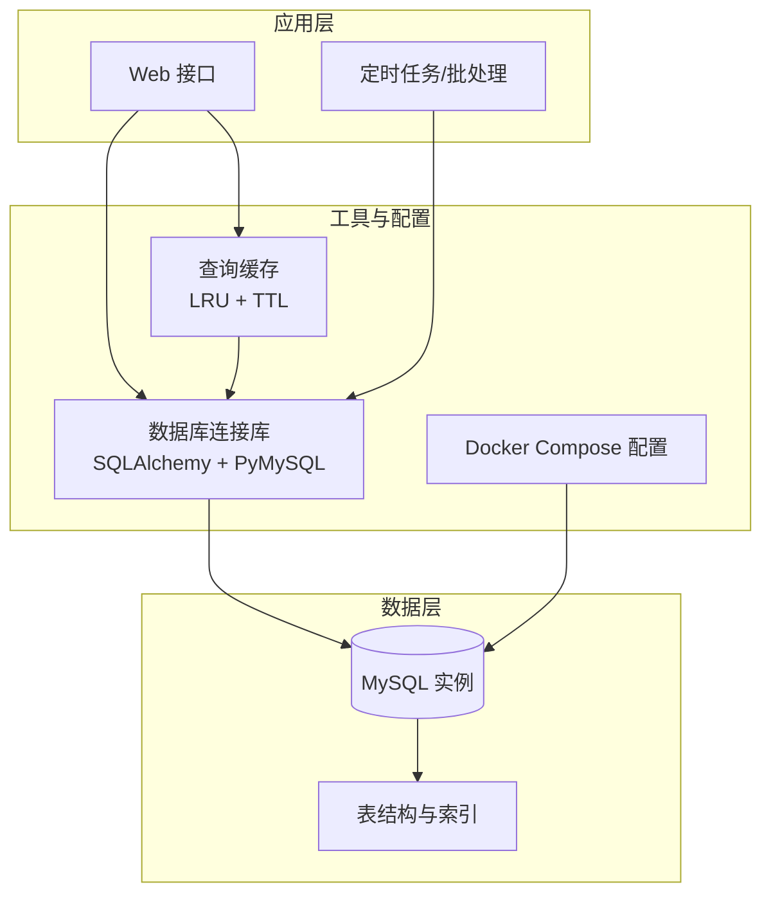
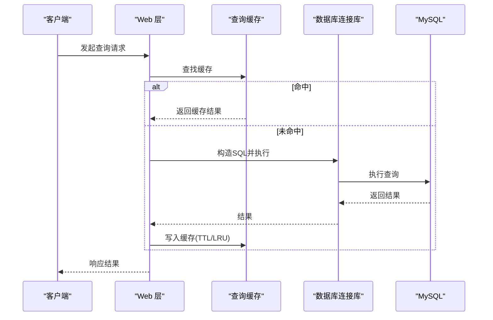
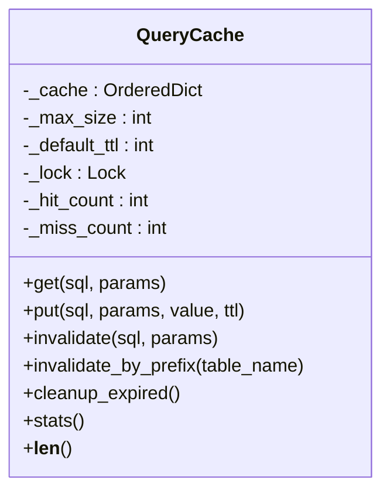
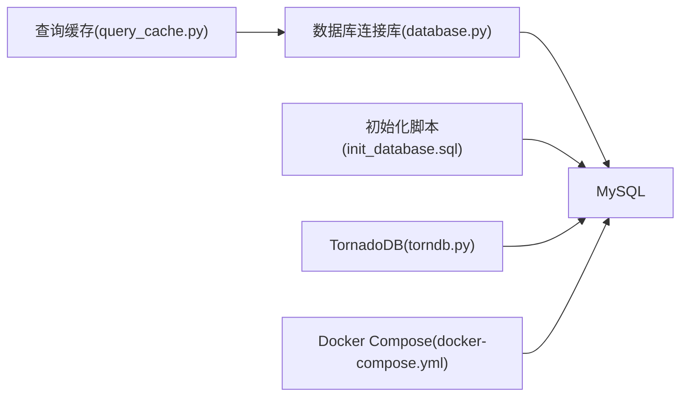

# 索引优化策略

<cite>
**本文引用的文件**
- [init_database.sql](file://docker/init_database.sql)
- [database_schema.md](file://document/database_schema.md)
- [database.py](file://docker/stock/quantia/lib/database.py)
- [query_cache.py](file://docker/stock/quantia/lib/query_cache.py)
- [docker-compose.yml](file://docker/docker-compose.yml)
- [docker-compose.remote-db.yml](file://docker/docker-compose.remote-db.yml)
- [torndb.py](file://quantia/lib/torndb.py)
- [init_job.py](file://docker/stock/quantia/job/init_job.py)
- [streaming_analysis_job.py](file://docker/stock/quantia/job/streaming_analysis_job.py)
</cite>

## 目录
1. [简介](#简介)
2. [项目结构](#项目结构)
3. [核心组件](#核心组件)
4. [架构总览](#架构总览)
5. [详细组件分析](#详细组件分析)
6. [依赖分析](#依赖分析)
7. [性能考量](#性能考量)
8. [故障排查指南](#故障排查指南)
9. [结论](#结论)
10. [附录](#附录)

## 简介
本文件面向数据库管理员与开发工程师，系统化梳理 Quantia 项目的数据库索引优化策略。内容涵盖索引设计原则、查询性能优化、索引类型选择、复合索引设计、各表索引策略与查询模式分析、性能监控指标、索引维护策略、索引失效原因分析、查询计划优化与慢查询诊断方法，并提供索引设计最佳实践、性能调优案例与监控告警机制，帮助维持数据库健康与高效运行。

## 项目结构
Quantia 采用“数据采集-分析-存储-展示”的分层架构，数据库层以 MySQL 为核心，配合 SQLAlchemy 连接池与查询缓存，支撑高频分页与筛选场景。

图表来源
- [docker-compose.yml](file://docker/docker-compose.yml#L1-L87)
- [database.py](file://docker/stock/quantia/lib/database.py#L58-L74)
- [query_cache.py](file://docker/stock/quantia/lib/query_cache.py#L27-L156)

章节来源
- [docker-compose.yml](file://docker/docker-compose.yml#L1-L87)
- [database_schema.md](file://document/database_schema.md#L1-L800)

## 核心组件
- 数据库连接与连接池：基于 SQLAlchemy 创建连接池，限制并发连接数，提升稳定性与资源利用率。
- 查询缓存：提供 LRU + TTL 的内存缓存，降低重复查询压力，提升响应速度。
- 表结构与索引：核心表采用复合主键 + 辅助索引，兼顾唯一性约束与常见查询路径。
- 定时任务与写入流程：通过批处理与模式校验，保障数据一致性与索引完整性。

章节来源
- [database.py](file://docker/stock/quantia/lib/database.py#L58-L74)
- [query_cache.py](file://docker/stock/quantia/lib/query_cache.py#L27-L156)
- [init_database.sql](file://docker/init_database.sql#L1-L455)

## 架构总览
应用通过统一的数据库连接库访问 MySQL，查询请求优先命中查询缓存；写入流程通过 SQLAlchemy 批量写入并自动维护主键与索引。Docker Compose 提供本地与远程数据库两种部署模式。

图表来源
- [query_cache.py](file://docker/stock/quantia/lib/query_cache.py#L51-L92)
- [database.py](file://docker/stock/quantia/lib/database.py#L207-L215)

章节来源
- [docker-compose.yml](file://docker/docker-compose.yml#L1-L87)
- [docker-compose.remote-db.yml](file://docker/docker-compose.remote-db.yml#L1-L47)

## 详细组件分析

### 数据库连接与连接池
- 连接池参数
  - pool_size：2
  - max_overflow：3
  - pool_recycle：600
  - pool_pre_ping：启用
  - pool_timeout：30
- 作用：控制并发连接上限，避免连接泄漏与资源耗尽；pre_ping 保障连接可用性。
- 影响：对高并发场景建议评估业务峰值，适当调整 pool_size 与 max_overflow。

章节来源
- [database.py](file://docker/stock/quantia/lib/database.py#L58-L74)

### 查询缓存（LRU + TTL）
- 缓存策略
  - LRU 淘汰：基于 OrderedDict，按最近使用排序。
  - TTL 过期：默认 5 分钟（股票数据页面）、10 分钟（筛选结果）。
  - 线程安全：使用锁保护缓存操作。
- 缓存键：SQL + 参数组合的哈希，确保唯一性。
- 统计指标：命中次数、未命中次数、命中率等。
- 使用场景：分页查询、筛选结果缓存，显著降低数据库压力。

图表来源
- [query_cache.py](file://docker/stock/quantia/lib/query_cache.py#L27-L156)

章节来源
- [query_cache.py](file://docker/stock/quantia/lib/query_cache.py#L27-L156)

### 表结构与索引现状
- 主键与辅助索引
  - 多数事实表采用复合主键（date, code），并建立 code 辅助索引，满足按日期与股票维度的查询。
  - 部分维度表（如关注表）建立 code 或 datetime 索引，满足常用过滤条件。
- 典型表与索引
  - 每日股票数据：复合主键(date, code)，索引 idx_code(code)。
  - 指标/形态/策略表：复合主键(date, code)，索引 idx_code(code)。
  - 关注表：主键 code，索引 INIX_DATETIME(datetime)。

章节来源
- [init_database.sql](file://docker/init_database.sql#L10-L162)
- [database_schema.md](file://document/database_schema.md#L46-L776)

### 索引设计原则与策略
- 唯一性与完整性
  - 事实表使用复合主键(date, code)，确保数据唯一性与分区扫描效率。
- 查询路径优化
  - 在高频过滤字段（如 code）建立单列索引，加速等值/范围查询。
- 复合索引设计
  - 当查询同时涉及 date 与 code 时，利用现有复合主键可避免额外索引。
  - 若出现仅按 date 过滤的场景，可考虑在 date 上建立单独索引以提升扫描效率。
- 索引维护
  - 定期统计表行数与索引大小，评估冗余索引与碎片化。
  - 写入密集表采用批量写入与延迟维护策略，避免频繁重建索引。

章节来源
- [init_database.sql](file://docker/init_database.sql#L18-L63)
- [database_schema.md](file://document/database_schema.md#L66-L116)

### 查询模式分析与优化建议
- 常见查询模式
  - 按日期范围与股票代码过滤：利用复合主键与 code 索引，避免全表扫描。
  - 分页查询：结合 LIMIT/OFFSET，优先使用覆盖索引，减少回表。
  - 统计查询：COUNT(*) 与聚合查询，建议在过滤字段上建立合适索引。
- 优化建议
  - 对高频 COUNT 查询启用缓存（已实现）。
  - 对热点表建立合适的二级索引，减少回表成本。
  - 使用 EXPLAIN 分析查询计划，识别索引使用情况与回表点。

章节来源
- [query_cache.py](file://docker/stock/quantia/lib/query_cache.py#L147-L156)
- [database.py](file://docker/stock/quantia/lib/database.py#L207-L215)

### 索引类型选择
- B-Tree 索引
  - 适用于等值、范围、排序与前缀匹配查询。
  - 适合 code、date 等离散度高且常用过滤字段。
- 全文索引
  - 适用于文本检索场景（如概念/行业名称），当前项目未见使用。
- 唯一索引
  - 用于保证业务唯一性（如关注表主键），避免重复数据。

章节来源
- [init_database.sql](file://docker/init_database.sql#L10-L162)
- [database_schema.md](file://document/database_schema.md#L46-L776)

### 复合索引设计
- 设计原则
  - 将最左前缀匹配的过滤字段放在前面，提高索引选择性。
  - 结合查询计划与访问模式，避免过度索引导致写入性能下降。
- 示例场景
  - 按 date 与 code 过滤：现有复合主键已覆盖。
  - 仅按 date 过滤：可考虑新增 date 索引，减少扫描范围。

章节来源
- [init_database.sql](file://docker/init_database.sql#L18-L63)
- [database_schema.md](file://document/database_schema.md#L66-L116)

### 各表索引策略
- 我的关注表
  - 主键：code；索引：INIX_DATETIME(datetime)。适合按时间维度的排序与过滤。
- 每日股票数据
  - 主键：(date, code)；索引：idx_code(code)。适合按股票与日期的双维查询。
- 指标/形态/策略表
  - 主键：(date, code)；索引：idx_code(code)。适合按股票维度的滚动分析。
- 资金流/分红/龙虎榜/大宗交易
  - 主键：(date, code)；索引：idx_code(code)。适合按股票维度的时序分析。

章节来源
- [init_database.sql](file://docker/init_database.sql#L10-L162)
- [database_schema.md](file://document/database_schema.md#L46-L776)

### 性能监控指标
- 数据库层
  - 连接池指标：活跃连接数、等待队列长度、超时次数。
  - 查询缓存指标：命中率、缓存条目数、TTL 过期清理数量。
  - 表增长与索引大小：定期统计表行数与索引占用，评估维护成本。
- 应用层
  - 响应时间分布、错误率、慢查询日志。
- 建议
  - 通过缓存统计接口获取命中率，结合业务场景调整 TTL 与容量。
  - 对慢查询进行 EXPLAIN 分析，定位索引缺失或回表问题。

章节来源
- [query_cache.py](file://docker/stock/quantia/lib/query_cache.py#L124-L136)
- [database.py](file://docker/stock/quantia/lib/database.py#L58-L74)

### 索引维护策略
- 定期维护
  - 分析表统计信息，评估索引选择性与使用率。
  - 清理过期缓存，释放内存资源。
- 写入策略
  - 批量写入时避免频繁重建索引，必要时延迟维护。
- 模式校验
  - 写入前校验表结构，不兼容时重建表，确保索引一致性。

章节来源
- [streaming_analysis_job.py](file://docker/stock/quantia/job/streaming_analysis_job.py#L322-L351)
- [database.py](file://docker/stock/quantia/lib/database.py#L121-L138)

### 索引失效原因分析
- 索引选择性低：对低基数字段建立索引效果有限。
- 函数/表达式：在索引列上使用函数导致索引失效。
- 隐式转换：字符串与数值比较未做类型一致化。
- 覆盖索引不足：查询列未完全覆盖，引发回表。
- 统计信息过期：优化器基于过时统计选择不当执行计划。

章节来源
- [query_cache.py](file://docker/stock/quantia/lib/query_cache.py#L124-L136)

### 查询计划优化与慢查询诊断
- 使用 EXPLAIN 分析
  - 关注 key、rows、Extra 等字段，识别全表扫描与回表。
- 优化手段
  - 添加合适索引，确保过滤条件命中索引。
  - 使用覆盖索引，减少回表。
  - 调整 SQL 结构，避免在 WHERE 子句使用函数或隐式转换。
- 慢查询定位
  - 结合慢查询日志与 EXPLAIN，定位热点 SQL 并优化。

章节来源
- [database.py](file://docker/stock/quantia/lib/database.py#L207-L215)

### 索引设计最佳实践
- 以查询为中心：围绕高频查询模式设计索引。
- 控制索引数量：避免冗余索引造成写入与存储负担。
- 定期评估：结合业务变化与数据分布，动态调整索引策略。
- 缓存先行：对重复查询启用缓存，降低数据库压力。

章节来源
- [query_cache.py](file://docker/stock/quantia/lib/query_cache.py#L147-L156)

### 性能调优案例
- 案例1：分页查询优化
  - 场景：股票列表分页，LIMIT/OFFSET。
  - 方案：使用覆盖索引与缓存，减少回表与重复查询。
- 案例2：筛选结果缓存
  - 场景：策略参数保存后，筛选结果不再变化。
  - 方案：清空筛选缓存，避免脏数据影响。

章节来源
- [query_cache.py](file://docker/stock/quantia/lib/query_cache.py#L104-L112)
- [tests/test_pagination.py](file://tests/test_pagination.py#L982-L997)

### 监控告警机制
- 连接池告警
  - 活跃连接数接近 pool_size 上限时触发告警。
  - pool_timeout 超时次数异常升高时告警。
- 缓存告警
  - 命中率低于阈值时告警，提示索引或查询模式优化。
  - 缓存条目数超过阈值时告警，提示容量调整。
- 数据库健康
  - MySQL 健康检查失败时告警。
  - 表增长异常或索引碎片化严重时告警。

章节来源
- [docker-compose.yml](file://docker/docker-compose.yml#L23-L28)
- [docker-compose.remote-db.yml](file://docker/docker-compose.remote-db.yml#L36-L41)

## 依赖分析
- 组件耦合
  - 数据库连接库与查询缓存解耦，便于独立扩展与替换。
  - 定时任务依赖数据库连接库与表结构，需确保索引一致性。
- 外部依赖
  - MySQL 8.0 与 PyMySQL/SQLAlchemy 生态。
  - Docker Compose 提供本地与远程数据库部署选项。

图表来源
- [database.py](file://docker/stock/quantia/lib/database.py#L58-L74)
- [query_cache.py](file://docker/stock/quantia/lib/query_cache.py#L27-L156)
- [init_database.sql](file://docker/init_database.sql#L1-L455)
- [torndb.py](file://quantia/lib/torndb.py#L63-L103)
- [docker-compose.yml](file://docker/docker-compose.yml#L1-L87)

章节来源
- [docker-compose.yml](file://docker/docker-compose.yml#L1-L87)
- [docker-compose.remote-db.yml](file://docker/docker-compose.remote-db.yml#L1-L47)

## 性能考量
- 连接池规模与并发：根据 CPU 核心数与内存配置，合理设置 pool_size 与 max_overflow。
- 缓存命中率：通过统计接口观察命中率，结合业务场景调整 TTL 与容量。
- 写入性能：批量写入与延迟维护策略，减少索引碎片与写放大。
- 查询计划：定期使用 EXPLAIN 分析热点 SQL，优化索引与 SQL 结构。

## 故障排查指南
- 连接失败
  - 检查数据库可达性与凭据配置。
  - 查看连接池超时与回收设置。
- 查询缓慢
  - 使用 EXPLAIN 分析执行计划，识别回表与全表扫描。
  - 检查缓存命中情况，必要时扩大缓存容量或缩短 TTL。
- 数据不一致
  - 检查写入流程是否重建表与添加索引。
  - 校验表结构与代码定义是否一致。

章节来源
- [database.py](file://docker/stock/quantia/lib/database.py#L78-L84)
- [streaming_analysis_job.py](file://docker/stock/quantia/job/streaming_analysis_job.py#L322-L351)

## 结论
通过合理的索引设计、连接池与查询缓存策略，Quantia 能够在高并发与大数据量场景下保持稳定与高效。建议持续监控连接池与缓存指标，定期评估索引有效性，并结合 EXPLAIN 与慢查询日志进行针对性优化，确保数据库长期健康运行。

## 附录
- 部署与配置
  - 本地部署：使用 docker-compose 启动 MySQL 与应用服务。
  - 远程数据库：通过环境变量配置连接参数，连接外部 MySQL。
- 初始化脚本
  - 执行 init_database.sql 创建所有表与索引。

章节来源
- [docker-compose.yml](file://docker/docker-compose.yml#L1-L87)
- [docker-compose.remote-db.yml](file://docker/docker-compose.remote-db.yml#L1-L47)
- [init_database.sql](file://docker/init_database.sql#L1-L455)
