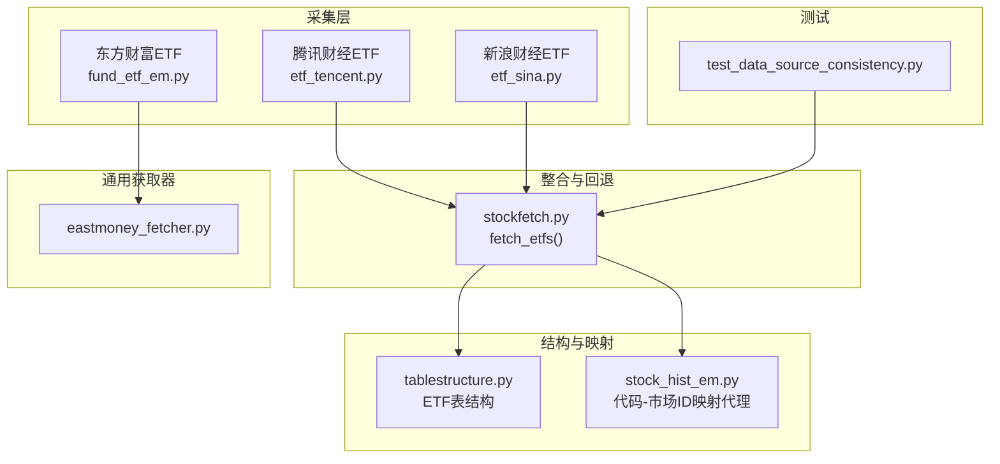
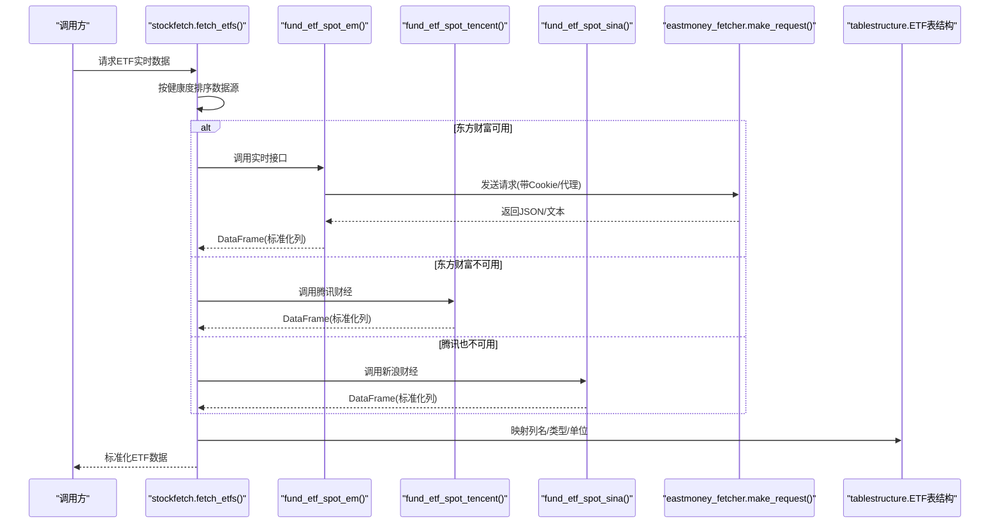
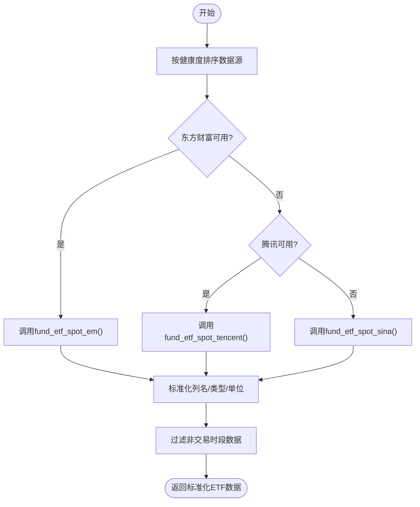
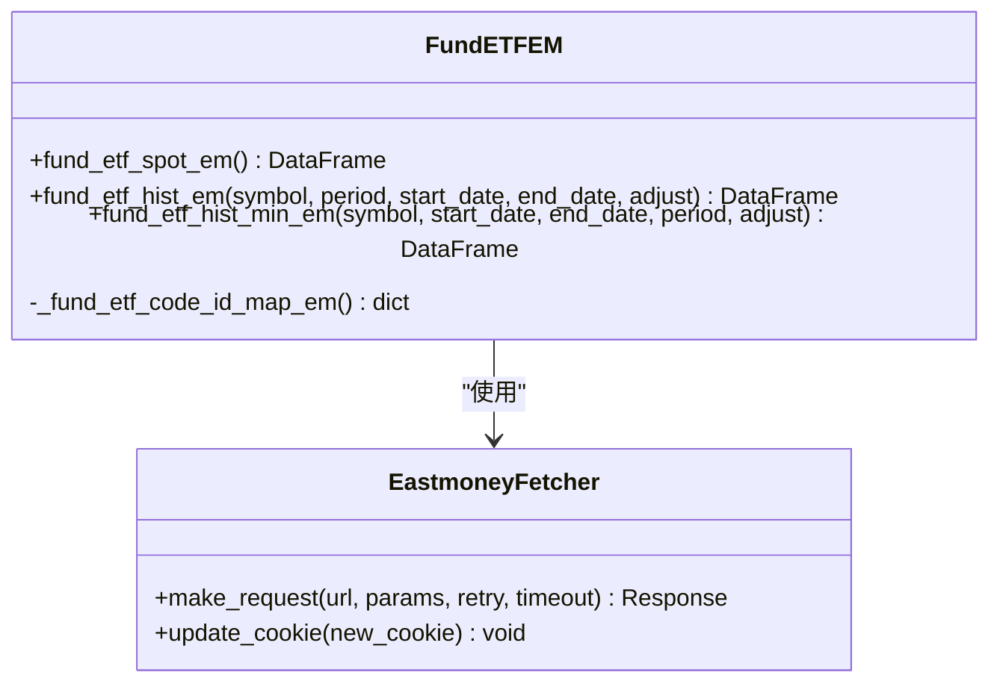
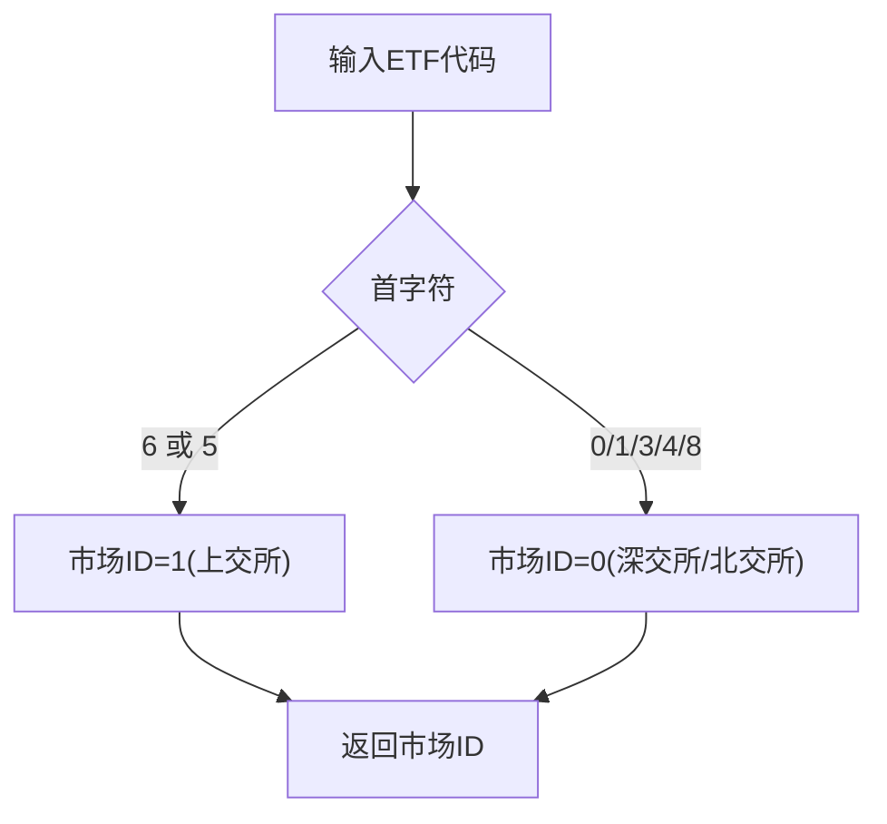
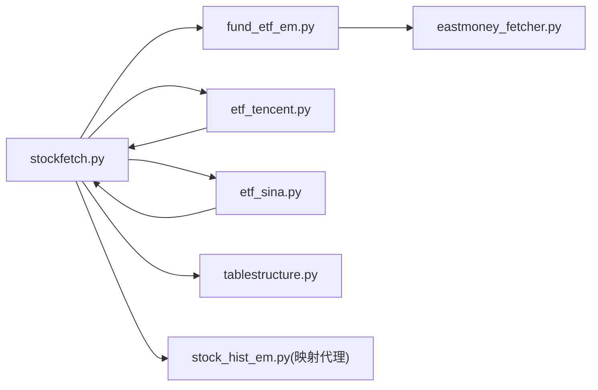

# ETF数据处理

<cite>
**本文引用的文件**
- [quantia/core/crawling/fund_etf_em.py](file://quantia/core/crawling/fund_etf_em.py)
- [quantia/core/crawling/etf_tencent.py](file://quantia/core/crawling/etf_tencent.py)
- [quantia/core/crawling/etf_sina.py](file://quantia/core/crawling/etf_sina.py)
- [quantia/core/eastmoney_fetcher.py](file://quantia/core/eastmoney_fetcher.py)
- [quantia/core/stockfetch.py](file://quantia/core/stockfetch.py)
- [quantia/core/tablestructure.py](file://quantia/core/tablestructure.py)
- [quantia/core/crawling/stock_hist_em.py](file://quantia/core/crawling/stock_hist_em.py)
- [tests/test_data_source_consistency.py](file://tests/test_data_source_consistency.py)
</cite>

## 目录
1. [简介](#简介)
2. [项目结构](#项目结构)
3. [核心组件](#核心组件)
4. [架构总览](#架构总览)
5. [详细组件分析](#详细组件分析)
6. [依赖分析](#依赖分析)
7. [性能考虑](#性能考虑)
8. [故障排查指南](#故障排查指南)
9. [结论](#结论)
10. [附录](#附录)

## 简介
本文件系统化梳理了ETF数据处理的实现与最佳实践，覆盖以下主题：
- 实时数据获取机制与多数据源回退策略
- 历史数据处理与增量缓存
- ETF代码映射与市场前缀规则
- 数据源差异、格式标准化与字段转换
- 数据完整性校验与质量保障
- 特殊处理逻辑（如1/5开头ETF的市场识别）
- 性能优化与可扩展性建议

## 项目结构
围绕ETF数据处理的关键模块如下：
- 数据源采集层：东方财富ETF实时/历史、腾讯财经ETF、新浪财经ETF
- 通用数据获取器：东方财富网请求封装与代理池集成
- 数据整合与回退：统一入口函数，按健康度排序的多数据源回退
- 数据结构与映射：ETF表结构定义、代码-市场ID映射代理
- 测试与一致性校验：历史数据列名、单位与格式一致性测试

**图表来源**
- [quantia/core/crawling/fund_etf_em.py](file://quantia/core/crawling/fund_etf_em.py#L21-L115)
- [quantia/core/crawling/etf_tencent.py](file://quantia/core/crawling/etf_tencent.py#L118-L176)
- [quantia/core/crawling/etf_sina.py](file://quantia/core/crawling/etf_sina.py#L137-L195)
- [quantia/core/eastmoney_fetcher.py](file://quantia/core/eastmoney_fetcher.py#L75-L143)
- [quantia/core/stockfetch.py](file://quantia/core/stockfetch.py#L256-L299)
- [quantia/core/tablestructure.py](file://quantia/core/tablestructure.py#L46-L61)
- [quantia/core/crawling/stock_hist_em.py](file://quantia/core/crawling/stock_hist_em.py#L206-L240)
- [tests/test_data_source_consistency.py](file://tests/test_data_source_consistency.py#L79-L111)

**章节来源**
- [quantia/core/stockfetch.py](file://quantia/core/stockfetch.py#L256-L299)
- [quantia/core/tablestructure.py](file://quantia/core/tablestructure.py#L46-L61)

## 核心组件
- 东方财富ETF实时/历史接口：提供ETF实时行情、日线/分钟线历史数据，并维护ETF代码-市场ID映射。
- 腾讯财经ETF接口：提供ETF实时行情，字段与东方财富基本一致。
- 新浪财经ETF接口：提供ETF实时行情，字段与东方财富略有差异，需做字段映射与类型转换。
- 通用获取器：封装Cookie管理、会话与代理池，统一请求行为，支持失败重试与连接错误处理。
- 统一入口与回退：按健康度排序的多数据源回退，记录失败次数与冷却时间，避免频繁重试失败源。
- 表结构与映射：定义ETF标准表结构，提供ETF代码-市场ID映射代理（基于代码前缀规则）。

**章节来源**
- [quantia/core/crawling/fund_etf_em.py](file://quantia/core/crawling/fund_etf_em.py#L21-L115)
- [quantia/core/crawling/etf_tencent.py](file://quantia/core/crawling/etf_tencent.py#L118-L176)
- [quantia/core/crawling/etf_sina.py](file://quantia/core/crawling/etf_sina.py#L137-L195)
- [quantia/core/eastmoney_fetcher.py](file://quantia/core/eastmoney_fetcher.py#L75-L143)
- [quantia/core/stockfetch.py](file://quantia/core/stockfetch.py#L256-L299)
- [quantia/core/tablestructure.py](file://quantia/core/tablestructure.py#L46-L61)
- [quantia/core/crawling/stock_hist_em.py](file://quantia/core/crawling/stock_hist_em.py#L206-L240)

## 架构总览
ETF数据处理采用“多数据源 + 健康度回退 + 标准化输出”的架构设计，确保在任一数据源异常时仍能稳定产出数据。

**图表来源**
- [quantia/core/stockfetch.py](file://quantia/core/stockfetch.py#L256-L299)
- [quantia/core/crawling/fund_etf_em.py](file://quantia/core/crawling/fund_etf_em.py#L21-L115)
- [quantia/core/crawling/etf_tencent.py](file://quantia/core/crawling/etf_tencent.py#L118-L176)
- [quantia/core/crawling/etf_sina.py](file://quantia/core/crawling/etf_sina.py#L137-L195)
- [quantia/core/eastmoney_fetcher.py](file://quantia/core/eastmoney_fetcher.py#L75-L143)
- [quantia/core/tablestructure.py](file://quantia/core/tablestructure.py#L46-L61)

## 详细组件分析

### 1) 多数据源实时ETF获取与回退
- 优先级：东方财富 > 腾讯财经 > 新浪财经
- 健康度管理：连续失败超过阈值将被降级，冷却时间内优先使用其他数据源；成功后恢复并重置计数。
- 统一标准化：各数据源返回的DataFrame都会映射到统一列名、类型与单位，再进行开盘时间过滤。

**图表来源**
- [quantia/core/stockfetch.py](file://quantia/core/stockfetch.py#L256-L299)
- [quantia/core/crawling/fund_etf_em.py](file://quantia/core/crawling/fund_etf_em.py#L21-L115)
- [quantia/core/crawling/etf_tencent.py](file://quantia/core/crawling/etf_tencent.py#L118-L176)
- [quantia/core/crawling/etf_sina.py](file://quantia/core/crawling/etf_sina.py#L137-L195)

**章节来源**
- [quantia/core/stockfetch.py](file://quantia/core/stockfetch.py#L256-L299)

### 2) 东方财富ETF实时/历史接口
- 实时接口：构造参数，调用统一请求器，解析返回字段，重命名并标准化列，数值字段转为数值类型。
- 历史接口：支持日线/周线/月线，支持前复权/后复权；分钟线支持1/5/15/30/60周期。
- 代码-市场ID映射：维护ETF代码与市场ID映射，用于历史数据查询。

**图表来源**
- [quantia/core/crawling/fund_etf_em.py](file://quantia/core/crawling/fund_etf_em.py#L21-L115)
- [quantia/core/crawling/fund_etf_em.py](file://quantia/core/crawling/fund_etf_em.py#L147-L216)
- [quantia/core/crawling/fund_etf_em.py](file://quantia/core/crawling/fund_etf_em.py#L219-L346)
- [quantia/core/eastmoney_fetcher.py](file://quantia/core/eastmoney_fetcher.py#L75-L143)

**章节来源**
- [quantia/core/crawling/fund_etf_em.py](file://quantia/core/crawling/fund_etf_em.py#L21-L115)
- [quantia/core/crawling/fund_etf_em.py](file://quantia/core/crawling/fund_etf_em.py#L147-L216)
- [quantia/core/crawling/fund_etf_em.py](file://quantia/core/crawling/fund_etf_em.py#L219-L346)

### 3) 腾讯财经ETF接口
- 实时接口：解析字段，处理成交量/成交额单位换算，标准化列名与类型。
- 历史接口：日线/分钟线，字段与东方财富一致，便于统一处理。

**章节来源**
- [quantia/core/crawling/etf_tencent.py](file://quantia/core/crawling/etf_tencent.py#L35-L78)
- [quantia/core/crawling/etf_tencent.py](file://quantia/core/crawling/etf_tencent.py#L118-L176)

### 4) 新浪财经ETF接口
- 实时接口：解析文本格式，提取字段，计算涨跌幅与涨跌额，标准化列名与类型。
- 字段差异：换手率/市值等字段缺失，统一填充为0。

**章节来源**
- [quantia/core/crawling/etf_sina.py](file://quantia/core/crawling/etf_sina.py#L35-L96)
- [quantia/core/crawling/etf_sina.py](file://quantia/core/crawling/etf_sina.py#L137-L195)

### 5) 通用请求器与代理池
- Cookie管理：优先从环境变量读取，其次从配置文件读取，最后使用默认值。
- 会话与线程安全：每个线程独立Session，避免连接池与Cookie冲突。
- 代理池：失败时上报失败，成功时上报成功；对连接级错误进行快速降级与重试。

**章节来源**
- [quantia/core/eastmoney_fetcher.py](file://quantia/core/eastmoney_fetcher.py#L31-L52)
- [quantia/core/eastmoney_fetcher.py](file://quantia/core/eastmoney_fetcher.py#L69-L73)
- [quantia/core/eastmoney_fetcher.py](file://quantia/core/eastmoney_fetcher.py#L75-L143)

### 6) ETF代码映射与市场前缀规则
- 代码-市场ID映射代理：通过代码前缀规则推断市场ID，避免全量拉取映射表。
- 规则要点：
  - 6、5开头：上交所（含5开头的沪市ETF）
  - 0、1、3、4、8开头：深交所/北交所（含1开头的深市ETF）
- 历史数据复用：ETF历史数据复用股票历史缓存逻辑，支持1/5开头ETF。

**图表来源**
- [quantia/core/crawling/stock_hist_em.py](file://quantia/core/crawling/stock_hist_em.py#L230-L240)

**章节来源**
- [quantia/core/crawling/stock_hist_em.py](file://quantia/core/crawling/stock_hist_em.py#L206-L240)
- [quantia/core/stockfetch.py](file://quantia/core/stockfetch.py#L711-L741)

### 7) 数据格式标准化与字段转换
- 统一列名：代码、名称、最新价、涨跌幅、涨跌额、成交量、成交额、今开、最高、最低、昨收、换手率、总市值、流通市值。
- 类型转换：数值字段统一转为数值类型，缺失值转为0，成交量/成交额等单位换算。
- 单位约定：历史数据成交量单位为“手”，实时数据为“股”；历史数据成交额单位为“元”。

**章节来源**
- [quantia/core/crawling/etf_tencent.py](file://quantia/core/crawling/etf_tencent.py#L153-L175)
- [quantia/core/crawling/etf_sina.py](file://quantia/core/crawling/etf_sina.py#L172-L194)
- [quantia/core/crawling/fund_etf_em.py](file://quantia/core/crawling/fund_etf_em.py#L85-L115)

### 8) 数据完整性验证
- 列名与顺序一致性：历史数据列名与表结构定义一致。
- 单位与范围校验：历史数据成交量单位为“手”，成交额单位为“元”，数值范围合理。
- 缺失值处理：NaN/无穷值检测与替换。

**章节来源**
- [tests/test_data_source_consistency.py](file://tests/test_data_source_consistency.py#L79-L111)
- [quantia/core/tablestructure.py](file://quantia/core/tablestructure.py#L298-L309)

## 依赖分析
- 组件耦合：
  - ETF实时接口依赖通用请求器，降低网络层复杂度。
  - 统一入口函数依赖各数据源与健康度管理模块，耦合度适中。
  - 历史数据复用股票历史缓存与增量逻辑，减少重复开发。
- 外部依赖：
  - 东方财富API：实时/历史数据的主要来源。
  - 腾讯/新浪API：备选数据源，用于回退与对比。
  - 代理池：提升请求稳定性与成功率。

**图表来源**
- [quantia/core/stockfetch.py](file://quantia/core/stockfetch.py#L256-L299)
- [quantia/core/crawling/fund_etf_em.py](file://quantia/core/crawling/fund_etf_em.py#L21-L115)
- [quantia/core/crawling/etf_tencent.py](file://quantia/core/crawling/etf_tencent.py#L118-L176)
- [quantia/core/crawling/etf_sina.py](file://quantia/core/crawling/etf_sina.py#L137-L195)
- [quantia/core/eastmoney_fetcher.py](file://quantia/core/eastmoney_fetcher.py#L75-L143)
- [quantia/core/tablestructure.py](file://quantia/core/tablestructure.py#L46-L61)
- [quantia/core/crawling/stock_hist_em.py](file://quantia/core/crawling/stock_hist_em.py#L206-L240)

**章节来源**
- [quantia/core/stockfetch.py](file://quantia/core/stockfetch.py#L256-L299)

## 性能考虑
- 并发与限流：
  - 实时ETF采集使用线程池并发抓取，批次大小与延时控制避免触发风控。
  - 历史数据采用增量缓存，仅拉取缺失区间，显著减少网络与存储压力。
- 健康度回退：
  - 连续失败自动降级，冷却时间随失败次数指数增长，避免无效重试。
- 类型转换与内存：
  - 统一类型转换与缺失值处理，减少后续计算成本。
- 代理池与超时：
  - 走代理时缩短超时时间，连接错误快速失败并更换代理，提高整体成功率。

[本节为通用性能指导，无需特定文件引用]

## 故障排查指南
- 数据源失败聚合日志：同一数据源在固定时间窗口内的失败会被聚合输出，便于定位问题。
- 健康度降级：若某数据源频繁失败，会被降级并在冷却结束后自动恢复。
- Cookie与代理：
  - 若请求失败，检查环境变量或配置文件中的Cookie是否有效。
  - 代理池会自动上报失败与成功，必要时手动更新代理列表。
- 历史数据一致性：
  - 使用测试脚本核对列名、单位与数值范围，确保数据质量。

**章节来源**
- [quantia/core/stockfetch.py](file://quantia/core/stockfetch.py#L146-L168)
- [quantia/core/stockfetch.py](file://quantia/core/stockfetch.py#L64-L106)
- [quantia/core/eastmoney_fetcher.py](file://quantia/core/eastmoney_fetcher.py#L31-L52)
- [tests/test_data_source_consistency.py](file://tests/test_data_source_consistency.py#L79-L111)

## 结论
本项目通过多数据源回退、健康度管理、统一标准化与增量缓存，实现了稳健可靠的ETF数据处理能力。针对ETF的特殊性（1/5开头代码、实时/历史差异、单位换算），提供了明确的映射与转换规则，并辅以测试与监控手段保障数据质量。开发者可在此基础上扩展新数据源或优化性能。

[本节为总结性内容，无需特定文件引用]

## 附录

### A. ETF表结构定义
- 表名：cn_etf_spot
- 关键字段：日期、代码、名称、最新价、涨跌幅、涨跌额、成交量、成交额、开盘价、最高价、最低价、昨收、换手率、总市值、流通市值

**章节来源**
- [quantia/core/tablestructure.py](file://quantia/core/tablestructure.py#L46-L61)

### B. 历史数据一致性测试要点
- 列名与顺序：与表结构定义一致
- 单位校验：成交量为“手”，成交额为“元”
- 数值范围：合理范围内的成交量与成交额
- 缺失值：无NaN/无穷值

**章节来源**
- [tests/test_data_source_consistency.py](file://tests/test_data_source_consistency.py#L79-L111)
- [quantia/core/tablestructure.py](file://quantia/core/tablestructure.py#L298-L309)
