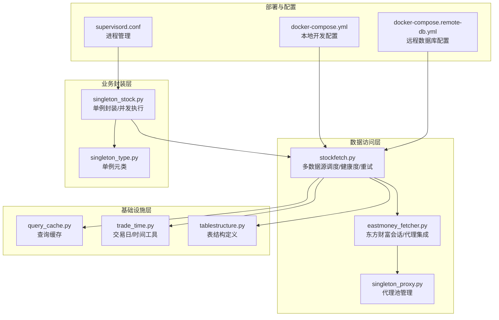
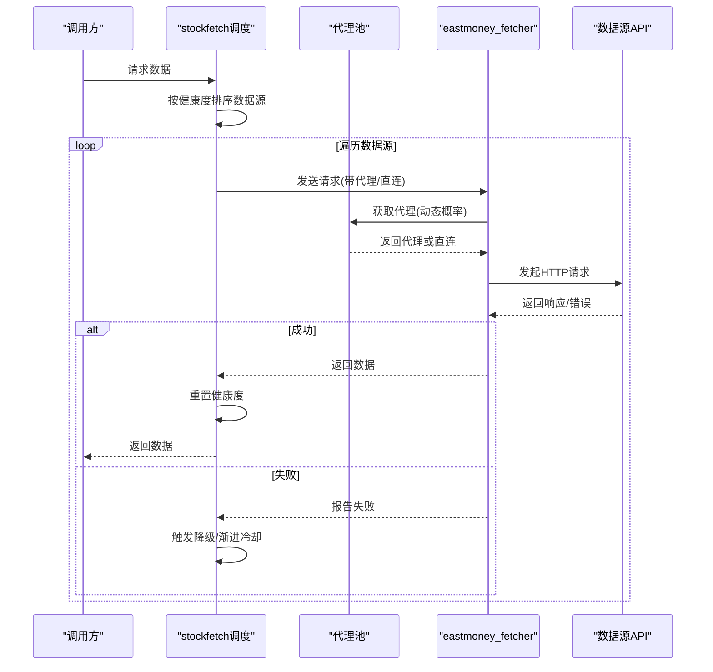
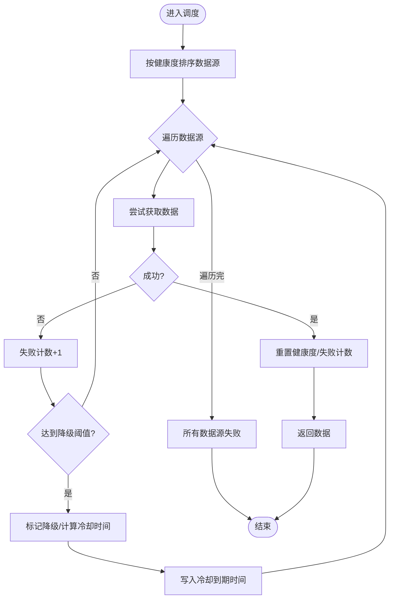
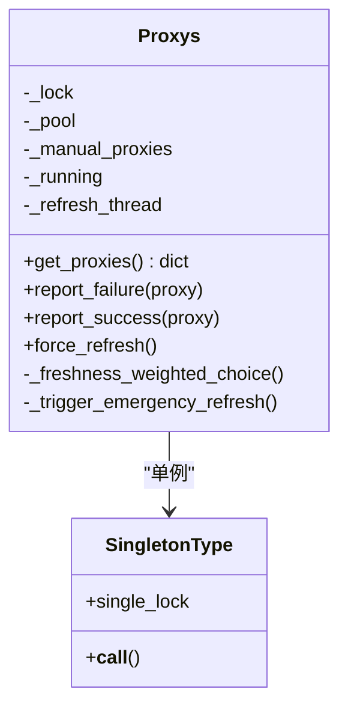
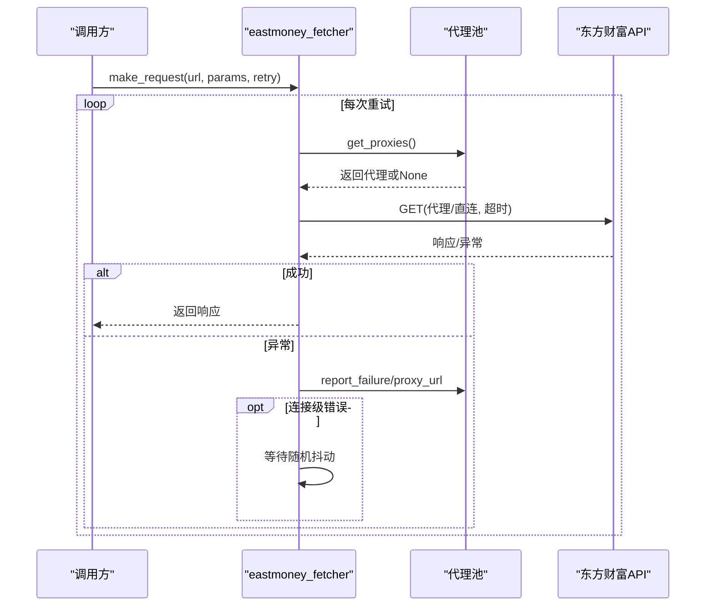
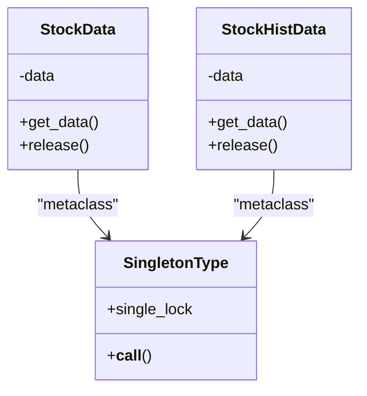
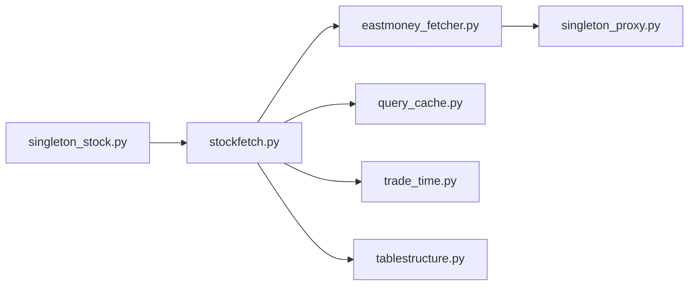

# 数据源管理架构

<cite>
**本文档引用的文件**
- [stockfetch.py](file://docker/stock/quantia/core/stockfetch.py)
- [singleton_stock.py](file://docker/stock/quantia/core/singleton_stock.py)
- [singleton_proxy.py](file://docker/stock/quantia/core/singleton_proxy.py)
- [eastmoney_fetcher.py](file://docker/stock/quantia/core/eastmoney_fetcher.py)
- [query_cache.py](file://docker/stock/quantia/lib/query_cache.py)
- [trade_time.py](file://docker/stock/quantia/lib/trade_time.py)
- [tablestructure.py](file://docker/stock/quantia/core/tablestructure.py)
- [docker-compose.yml](file://docker/docker-compose.yml)
- [docker-compose.remote-db.yml](file://docker/docker-compose.remote-db.yml)
- [supervisord.conf](file://docker/supervisor/supervisord.conf)
- [singleton_type.py](file://docker/stock/quantia/lib/singleton_type.py)
</cite>

## 目录
1. [简介](#简介)
2. [项目结构](#项目结构)
3. [核心组件](#核心组件)
4. [架构概览](#架构概览)
5. [详细组件分析](#详细组件分析)
6. [依赖关系分析](#依赖关系分析)
7. [性能考虑](#性能考虑)
8. [故障排查指南](#故障排查指南)
9. [结论](#结论)
10. [附录](#附录)

## 简介
本文件系统化阐述数据源管理架构的设计与实现，涵盖多数据源优先级策略、健康度监控机制、自动切换算法、失败重试策略、降级冷却算法、负载均衡策略、配置管理与动态调整、扩展指南以及性能优化与故障排查方法。目标是帮助开发者快速理解并优化数据源管理流程。

## 项目结构
数据源管理相关的核心代码集中在以下模块：
- 数据源调度与健康度：stockfetch.py
- 单例封装与并发：singleton_stock.py、singleton_type.py
- 代理池管理：singleton_proxy.py
- 东方财富数据获取器：eastmoney_fetcher.py
- 查询缓存：query_cache.py
- 交易日与时间工具：trade_time.py
- 数据表结构定义：tablestructure.py
- 容器与环境配置：docker-compose.yml、docker-compose.remote-db.yml、supervisord.conf

**图表来源**
- [stockfetch.py](file://docker/stock/quantia/core/stockfetch.py#L1-L1584)
- [singleton_stock.py](file://docker/stock/quantia/core/singleton_stock.py#L1-L116)
- [singleton_proxy.py](file://docker/stock/quantia/core/singleton_proxy.py#L1-L701)
- [eastmoney_fetcher.py](file://docker/stock/quantia/core/eastmoney_fetcher.py#L1-L149)
- [query_cache.py](file://docker/stock/quantia/lib/query_cache.py#L1-L156)
- [trade_time.py](file://docker/stock/quantia/lib/trade_time.py#L1-L224)
- [tablestructure.py](file://docker/stock/quantia/core/tablestructure.py#L1-L1137)
- [docker-compose.yml](file://docker/docker-compose.yml#L1-L86)
- [docker-compose.remote-db.yml](file://docker/docker-compose.remote-db.yml#L1-L48)
- [supervisord.conf](file://docker/supervisor/supervisord.conf#L1-L41)

**章节来源**
- [stockfetch.py](file://docker/stock/quantia/core/stockfetch.py#L1-L1584)
- [singleton_stock.py](file://docker/stock/quantia/core/singleton_stock.py#L1-L116)
- [singleton_proxy.py](file://docker/stock/quantia/core/singleton_proxy.py#L1-L701)
- [eastmoney_fetcher.py](file://docker/stock/quantia/core/eastmoney_fetcher.py#L1-L149)
- [query_cache.py](file://docker/stock/quantia/lib/query_cache.py#L1-L156)
- [trade_time.py](file://docker/stock/quantia/lib/trade_time.py#L1-L224)
- [tablestructure.py](file://docker/stock/quantia/core/tablestructure.py#L1-L1137)
- [docker-compose.yml](file://docker/docker-compose.yml#L1-L86)
- [docker-compose.remote-db.yml](file://docker/docker-compose.remote-db.yml#L1-L48)
- [supervisord.conf](file://docker/supervisor/supervisord.conf#L1-L41)

## 核心组件
- 多数据源调度与健康度监控：基于线程安全的全局状态，实现按健康度排序、降级冷却、渐进退避与日志聚合。
- 代理池管理：自动抓取、验证、刷新代理，支持直连/代理混合策略与失败反馈。
- 东方财富数据获取器：线程安全会话、Cookie管理、重试与超时控制。
- 单例封装与并发：统一入口、并发控制、内存释放。
- 查询缓存：LRU+TTL，支持COUNT与DATA分离缓存。
- 时间与交易日工具：历史数据时间区间计算、交易时段判断。
- 配置管理：环境变量覆盖、Docker Compose配置、Supervisor进程管理。

**章节来源**
- [stockfetch.py](file://docker/stock/quantia/core/stockfetch.py#L38-L184)
- [singleton_proxy.py](file://docker/stock/quantia/core/singleton_proxy.py#L45-L233)
- [eastmoney_fetcher.py](file://docker/stock/quantia/core/eastmoney_fetcher.py#L16-L149)
- [singleton_stock.py](file://docker/stock/quantia/core/singleton_stock.py#L19-L116)
- [query_cache.py](file://docker/stock/quantia/lib/query_cache.py#L27-L156)
- [trade_time.py](file://docker/stock/quantia/lib/trade_time.py#L127-L168)

## 架构概览
数据源管理采用“调度层-代理层-获取层-封装层”的分层设计：
- 调度层：按健康度排序数据源，失败时触发降级与渐进冷却。
- 代理层：统一代理池，按池大小动态调整直连概率，支持HTTPS隧道检测。
- 获取层：线程安全会话与Cookie管理，指数退避重试与抖动防惊群。
- 封装层：单例模式与并发执行，内存释放与统计。

**图表来源**
- [stockfetch.py](file://docker/stock/quantia/core/stockfetch.py#L304-L345)
- [eastmoney_fetcher.py](file://docker/stock/quantia/core/eastmoney_fetcher.py#L75-L143)
- [singleton_proxy.py](file://docker/stock/quantia/core/singleton_proxy.py#L112-L164)

## 详细组件分析

### 组件A：多数据源调度与健康度监控
- 健康度追踪：线程安全的全局状态，记录失败次数、冷却到期时间、降级次数与状态。
- 降级策略：连续失败达到阈值触发降级，按渐进退避延长冷却时间，冷却结束后自动恢复。
- 排序策略：将降级数据源排到末尾，但仍可用；冷却期内不重复输出日志。
- 日志聚合：对同一数据源的连续失败进行聚合输出，避免刷屏。

**图表来源**
- [stockfetch.py](file://docker/stock/quantia/core/stockfetch.py#L64-L134)
- [stockfetch.py](file://docker/stock/quantia/core/stockfetch.py#L304-L345)

**章节来源**
- [stockfetch.py](file://docker/stock/quantia/core/stockfetch.py#L38-L184)
- [stockfetch.py](file://docker/stock/quantia/core/stockfetch.py#L304-L345)

### 组件B：代理池管理与直连策略
- 自动抓取与验证：并发从多个免费代理源抓取，批量验证HTTP/HTTPS可用性。
- 动态直连概率：根据代理池规模调整直连概率，避免代理耗尽时过度使用。
- 新鲜度加权：对近期验证成功的代理给予更高权重，降低过期代理被选中概率。
- 失败反馈与紧急刷新：请求失败反馈代理池，代理耗尽时异步触发紧急补充。

**图表来源**
- [singleton_proxy.py](file://docker/stock/quantia/core/singleton_proxy.py#L45-L233)
- [singleton_type.py](file://docker/stock/quantia/lib/singleton_type.py#L12-L20)

**章节来源**
- [singleton_proxy.py](file://docker/stock/quantia/core/singleton_proxy.py#L45-L233)
- [singleton_proxy.py](file://docker/stock/quantia/core/singleton_proxy.py#L238-L686)
- [singleton_type.py](file://docker/stock/quantia/lib/singleton_type.py#L12-L20)

### 组件C：东方财富数据获取器
- 线程安全会话：每个线程独立Session，避免连接池与Cookie冲突。
- Cookie管理：优先从环境变量获取，其次从文件读取，最后使用默认值。
- 重试与超时：指数退避重试，最后一次强制直连；走代理时缩短超时。
- 错误分类：区分连接级错误与业务错误，连接级错误触发代理池反馈与换源。

**图表来源**
- [eastmoney_fetcher.py](file://docker/stock/quantia/core/eastmoney_fetcher.py#L75-L143)
- [singleton_proxy.py](file://docker/stock/quantia/core/singleton_proxy.py#L185-L209)

**章节来源**
- [eastmoney_fetcher.py](file://docker/stock/quantia/core/eastmoney_fetcher.py#L16-L149)

### 组件D：单例封装与并发控制
- 单例模式：通过元类实现线程安全的单例，支持显式释放以回收内存。
- 并发执行：ThreadPoolExecutor限制最大并发，避免代理池过载。
- 数据获取：统一入口封装，失败时记录日志并返回None。

**图表来源**
- [singleton_stock.py](file://docker/stock/quantia/core/singleton_stock.py#L19-L116)
- [singleton_type.py](file://docker/stock/quantia/lib/singleton_type.py#L12-L20)

**章节来源**
- [singleton_stock.py](file://docker/stock/quantia/core/singleton_stock.py#L19-L116)
- [singleton_type.py](file://docker/stock/quantia/lib/singleton_type.py#L12-L20)

### 组件E：查询缓存与时间工具
- 查询缓存：LRU+TTL，支持COUNT与DATA分离缓存，线程安全，提供统计信息。
- 时间工具：历史数据时间区间计算、交易日判断、交易时段判断。

**章节来源**
- [query_cache.py](file://docker/stock/quantia/lib/query_cache.py#L27-L156)
- [trade_time.py](file://docker/stock/quantia/lib/trade_time.py#L127-L168)

## 依赖关系分析
- 调度层依赖代理层与获取层：stockfetch.py依赖eastmoney_fetcher.py与singleton_proxy.py。
- 获取层依赖代理层：eastmoney_fetcher.py通过proxys()获取代理。
- 封装层依赖调度层：singleton_stock.py调用stockfetch.py。
- 基础设施层被调度层使用：query_cache.py、trade_time.py、tablestructure.py。

**图表来源**
- [stockfetch.py](file://docker/stock/quantia/core/stockfetch.py#L1-L1584)
- [singleton_stock.py](file://docker/stock/quantia/core/singleton_stock.py#L1-L116)
- [eastmoney_fetcher.py](file://docker/stock/quantia/core/eastmoney_fetcher.py#L1-L149)
- [singleton_proxy.py](file://docker/stock/quantia/core/singleton_proxy.py#L1-L701)
- [query_cache.py](file://docker/stock/quantia/lib/query_cache.py#L1-L156)
- [trade_time.py](file://docker/stock/quantia/lib/trade_time.py#L1-L224)
- [tablestructure.py](file://docker/stock/quantia/core/tablestructure.py#L1-L1137)

**章节来源**
- [stockfetch.py](file://docker/stock/quantia/core/stockfetch.py#L1-L1584)
- [singleton_stock.py](file://docker/stock/quantia/core/singleton_stock.py#L1-L116)
- [eastmoney_fetcher.py](file://docker/stock/quantia/core/eastmoney_fetcher.py#L1-L149)
- [singleton_proxy.py](file://docker/stock/quantia/core/singleton_proxy.py#L1-L701)
- [query_cache.py](file://docker/stock/quantia/lib/query_cache.py#L1-L156)
- [trade_time.py](file://docker/stock/quantia/lib/trade_time.py#L1-L224)
- [tablestructure.py](file://docker/stock/quantia/core/tablestructure.py#L1-L1137)

## 性能考虑
- 指数退避与抖动：避免多线程同时重试引发惊群效应，提升整体稳定性。
- 代理池动态直连概率：在代理稀缺时提高直连概率，减少代理池竞争。
- 单例与并发限制：避免重复实例与过多并发请求导致限流/封禁。
- 缓存策略：LRU+TTL减少重复查询，COUNT/DATA分离缓存提升命中率。
- 历史数据时间区间：根据交易时段与日期智能计算，避免不必要的全量请求。

[本节为通用指导，无需特定文件引用]

## 故障排查指南
- 数据源失败日志聚合：查看聚合日志，定位高频失败数据源与错误类型。
- 代理池状态：检查代理池大小、HTTPS支持情况与失败计数，必要时强制刷新。
- 重试与超时：确认重试次数与基础间隔配置，避免过短超时导致代理失败。
- 单例释放：在内存紧张场景调用release()释放单例实例。
- 缓存清理：必要时清理查询缓存或按表名失效缓存。

**章节来源**
- [stockfetch.py](file://docker/stock/quantia/core/stockfetch.py#L146-L167)
- [singleton_proxy.py](file://docker/stock/quantia/core/singleton_proxy.py#L215-L233)
- [singleton_stock.py](file://docker/stock/quantia/core/singleton_stock.py#L30-L37)
- [query_cache.py](file://docker/stock/quantia/lib/query_cache.py#L93-L121)

## 结论
该数据源管理架构通过多数据源调度、健康度监控、代理池管理与缓存策略，实现了高可用与高性能的数据获取流程。结合环境变量与Docker配置，可灵活调整参数并动态适应不同部署场景。建议在生产环境中启用缓存、合理配置重试与代理池，并定期监控健康度与代理池状态以保障稳定性。

[本节为总结，无需特定文件引用]

## 附录

### 数据源配置管理与环境变量覆盖
- 数据源重试配置：DATA_SOURCE_MAX_RETRIES、DATA_SOURCE_RETRY_INTERVAL
- 历史数据配置：HIST_DATA_DEFAULT_YEARS、HIST_DATA_CACHE_EXPIRE_DAYS
- 数据库配置：QUANTIA_DB_HOST、QUANTIA_DB_PORT、QUANTIA_DB_USER、QUANTIA_DB_PASSWORD、QUANTIA_DB_DATABASE

**章节来源**
- [stockfetch.py](file://docker/stock/quantia/core/stockfetch.py#L38-L44)
- [docker-compose.yml](file://docker/docker-compose.yml#L48-L53)
- [docker-compose.remote-db.yml](file://docker/docker-compose.remote-db.yml#L16-L28)

### 动态调整参数
- 代理池刷新周期：PROXY_REFRESH_INTERVAL
- 最小代理池大小：PROXY_MIN_POOL_SIZE
- 并发验证线程数：PROXY_FETCH_WORKERS
- 代理失败阈值：PROXY_MAX_FAIL_COUNT
- 代理新鲜度阈值：PROXY_STALE_SECONDS

**章节来源**
- [singleton_proxy.py](file://docker/stock/quantia/core/singleton_proxy.py#L35-L42)

### 扩展指南
- 新增数据源：在stockfetch.py中添加数据源列表项，按需实现健康度上报与排序。
- 新增代理源：在singleton_proxy.py的抓取函数列表中添加新源。
- 新增缓存策略：在query_cache.py中扩展缓存类型或调整TTL。
- 新增时间规则：在trade_time.py中扩展交易日与时段判断逻辑。

**章节来源**
- [stockfetch.py](file://docker/stock/quantia/core/stockfetch.py#L304-L345)
- [singleton_proxy.py](file://docker/stock/quantia/core/singleton_proxy.py#L238-L504)
- [query_cache.py](file://docker/stock/quantia/lib/query_cache.py#L27-L156)
- [trade_time.py](file://docker/stock/quantia/lib/trade_time.py#L12-L224)
