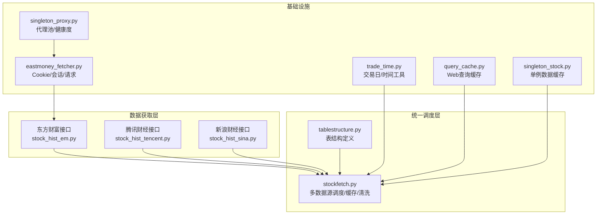
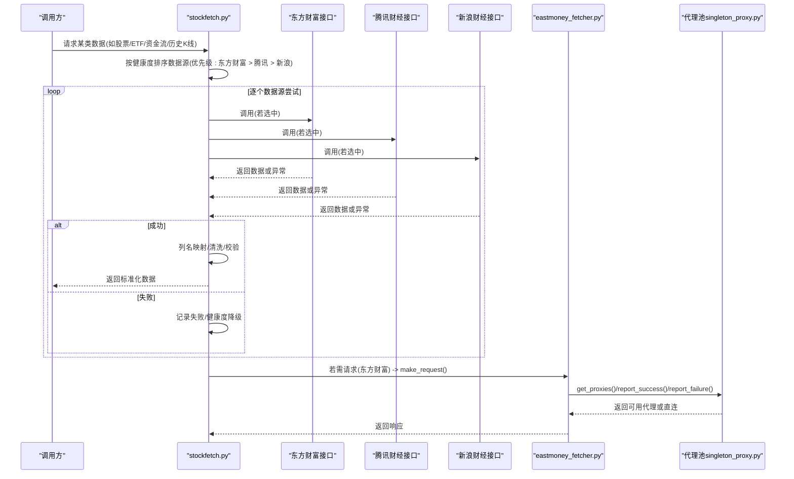
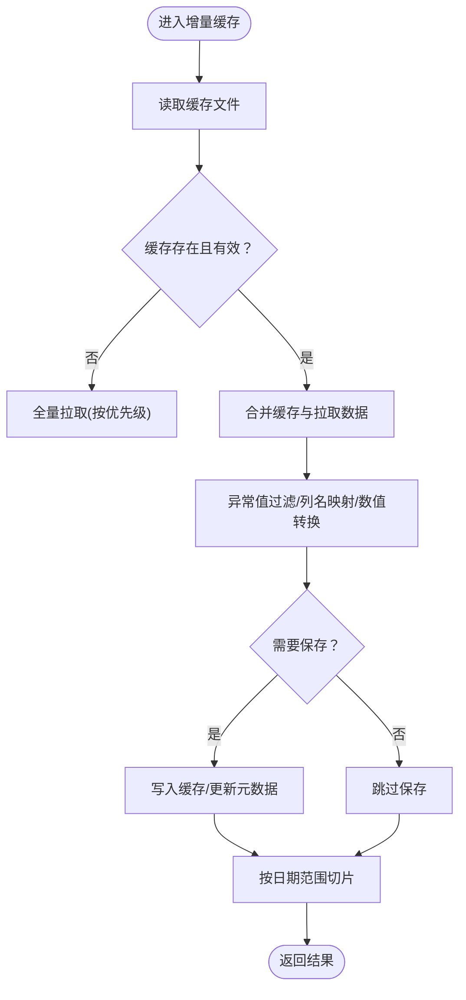
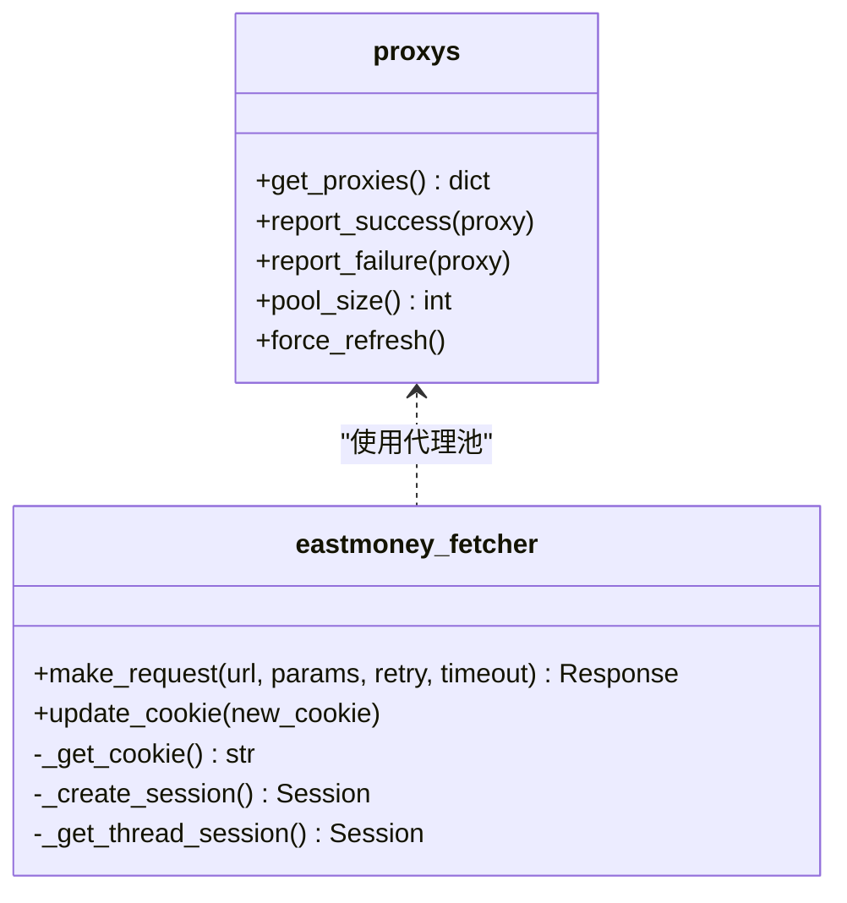
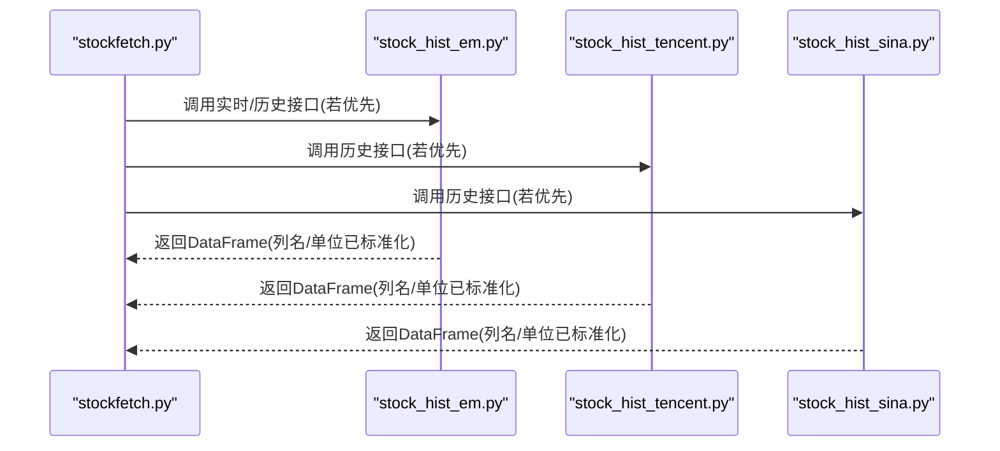
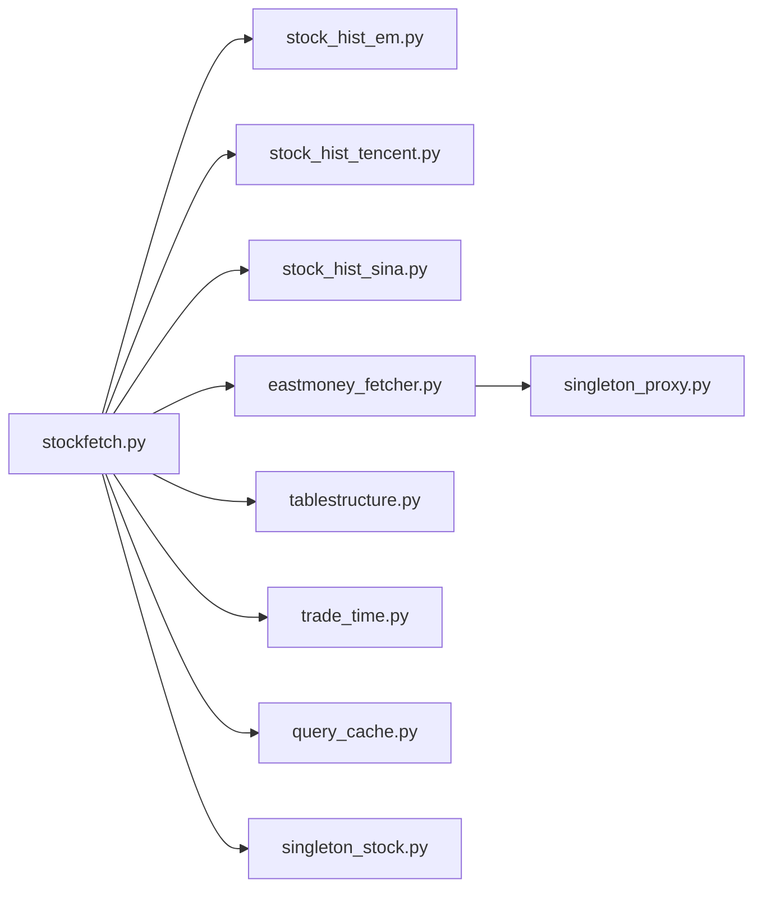

# 数据获取与处理

<cite>
**本文引用的文件**
- [quantia/core/eastmoney_fetcher.py](file://quantia/core/eastmoney_fetcher.py)
- [quantia/core/stockfetch.py](file://quantia/core/stockfetch.py)
- [quantia/core/singleton_stock.py](file://quantia/core/singleton_stock.py)
- [quantia/core/singleton_proxy.py](file://quantia/core/singleton_proxy.py)
- [quantia/lib/query_cache.py](file://quantia/lib/query_cache.py)
- [quantia/core/crawling/stock_hist_em.py](file://quantia/core/crawling/stock_hist_em.py)
- [quantia/core/crawling/stock_hist_tencent.py](file://quantia/core/crawling/stock_hist_tencent.py)
- [quantia/core/crawling/stock_hist_sina.py](file://quantia/core/crawling/stock_hist_sina.py)
- [quantia/lib/trade_time.py](file://quantia/lib/trade_time.py)
- [quantia/core/tablestructure.py](file://quantia/core/tablestructure.py)
- [quantia/config/eastmoney_cookie.txt](file://quantia/config/eastmoney_cookie.txt)
- [quantia/config/proxy.txt](file://quantia/config/proxy.txt)
</cite>

## 目录
1. [简介](#简介)
2. [项目结构](#项目结构)
3. [核心组件](#核心组件)
4. [架构总览](#架构总览)
5. [详细组件分析](#详细组件分析)
6. [依赖分析](#依赖分析)
7. [性能考量](#性能考量)
8. [故障排查指南](#故障排查指南)
9. [结论](#结论)
10. [附录](#附录)

## 简介
本文件面向Quantia项目的“数据获取与处理”子系统，系统性阐述多数据源架构设计、股票数据抓取机制、数据清洗与验证流程、缓存策略实现，并提供支持的数据源（东方财富、腾讯财经、新浪财经等）、数据获取优先级、容错切换机制、代理与Cookie配置、数据质量控制、异常处理、性能优化策略、最佳实践、故障排查指南及自定义数据源扩展方法。目标是帮助开发者快速理解并优化数据获取流程。

## 项目结构
数据获取与处理相关的核心代码主要集中在以下模块：
- 数据源抓取层：东方财富、腾讯财经、新浪财经的历史与实时行情接口封装
- 统一调度层：stockfetch.py负责多数据源优先级、健康度追踪、重试与回退、增量缓存与清洗
- 代理与Cookie管理：singleton_proxy.py、eastmoney_fetcher.py
- 单例缓存与查询缓存：singleton_stock.py、query_cache.py
- 时间与交易日工具：trade_time.py
- 数据表结构定义：tablestructure.py

图示来源
- [quantia/core/stockfetch.py](file://quantia/core/stockfetch.py#L256-L425)
- [quantia/core/crawling/stock_hist_em.py](file://quantia/core/crawling/stock_hist_em.py#L1-L200)
- [quantia/core/crawling/stock_hist_tencent.py](file://quantia/core/crawling/stock_hist_tencent.py#L1-L200)
- [quantia/core/crawling/stock_hist_sina.py](file://quantia/core/crawling/stock_hist_sina.py#L1-L200)
- [quantia/core/eastmoney_fetcher.py](file://quantia/core/eastmoney_fetcher.py#L1-L149)
- [quantia/core/singleton_proxy.py](file://quantia/core/singleton_proxy.py#L45-L214)
- [quantia/lib/trade_time.py](file://quantia/lib/trade_time.py#L120-L168)
- [quantia/lib/query_cache.py](file://quantia/lib/query_cache.py#L27-L156)
- [quantia/core/tablestructure.py](file://quantia/core/tablestructure.py#L46-L104)

章节来源
- [quantia/core/stockfetch.py](file://quantia/core/stockfetch.py#L256-L425)
- [quantia/core/crawling/stock_hist_em.py](file://quantia/core/crawling/stock_hist_em.py#L1-L200)
- [quantia/core/crawling/stock_hist_tencent.py](file://quantia/core/crawling/stock_hist_tencent.py#L1-L200)
- [quantia/core/crawling/stock_hist_sina.py](file://quantia/core/crawling/stock_hist_sina.py#L1-L200)
- [quantia/core/eastmoney_fetcher.py](file://quantia/core/eastmoney_fetcher.py#L1-L149)
- [quantia/core/singleton_proxy.py](file://quantia/core/singleton_proxy.py#L45-L214)
- [quantia/lib/trade_time.py](file://quantia/lib/trade_time.py#L120-L168)
- [quantia/lib/query_cache.py](file://quantia/lib/query_cache.py#L27-L156)
- [quantia/core/tablestructure.py](file://quantia/core/tablestructure.py#L46-L104)

## 核心组件
- 多数据源调度与缓存：统一入口函数按优先级尝试不同数据源，失败后自动回退；对历史K线采用增量缓存策略，支持尾部追加、向前补数据、无缓存全量拉取。
- 代理池与Cookie管理：代理池自动抓取、验证、刷新，支持HTTP/HTTPS代理选择与直连概率；Cookie优先级支持环境变量、文件与默认值。
- 数据清洗与验证：统一列名映射、数值类型转换、缺失值填充、异常值过滤、复权类型一致性处理。
- 查询缓存：Web端查询缓存（LRU+TTL），减少重复数据库查询。
- 单例缓存：历史数据单例缓存，支持并发线程池拉取与内存释放。

章节来源
- [quantia/core/stockfetch.py](file://quantia/core/stockfetch.py#L921-L1178)
- [quantia/core/eastmoney_fetcher.py](file://quantia/core/eastmoney_fetcher.py#L31-L149)
- [quantia/core/singleton_proxy.py](file://quantia/core/singleton_proxy.py#L112-L214)
- [quantia/lib/query_cache.py](file://quantia/lib/query_cache.py#L27-L156)
- [quantia/core/singleton_stock.py](file://quantia/core/singleton_stock.py#L19-L116)

## 架构总览
系统采用“多数据源 + 健康度追踪 + 增量缓存 + 代理池”的组合架构，保证在不稳定外部环境下仍能稳定产出高质量数据。

图示来源
- [quantia/core/stockfetch.py](file://quantia/core/stockfetch.py#L256-L425)
- [quantia/core/eastmoney_fetcher.py](file://quantia/core/eastmoney_fetcher.py#L75-L143)
- [quantia/core/singleton_proxy.py](file://quantia/core/singleton_proxy.py#L112-L214)

## 详细组件分析

### 多数据源调度与缓存（stockfetch.py）
- 数据源优先级与回退
  - 股票/ETF/资金流/历史K线等均有明确优先级列表，失败后自动切换下一数据源。
  - 健康度追踪：连续失败触发降级，冷却后自动恢复；聚合日志避免刷屏。
- 增量缓存策略（历史K线）
  - 支持三种场景：尾部追加、向前补数据、无缓存全量拉取。
  - 数据源优先级：东方财富 → 腾讯 → 新浪；若缓存存在则先合并再清洗。
  - 异常值过滤与元数据版本控制，避免重复处理。
- 数据清洗与标准化
  - 统一列名映射、数值类型转换、缺失值填充、复权类型一致性处理。
  - 对不同数据源返回的差异进行兼容处理（如volume单位统一、amount计算）。

图示来源
- [quantia/core/stockfetch.py](file://quantia/core/stockfetch.py#L921-L1178)

章节来源
- [quantia/core/stockfetch.py](file://quantia/core/stockfetch.py#L256-L425)
- [quantia/core/stockfetch.py](file://quantia/core/stockfetch.py#L921-L1178)

### 代理池与Cookie管理（singleton_proxy.py、eastmoney_fetcher.py）
- 代理池
  - 自动抓取多个免费代理源，批量验证HTTP/HTTPS能力，后台定时刷新。
  - 动态直连概率：代理池越少，直连概率越高；HTTPS代理优先但不强制。
  - 失败计数与移除策略：连续失败达到阈值自动移除；紧急补充机制避免完全枯竭。
- Cookie管理
  - 优先级：环境变量 > 文件 > 默认Cookie；支持动态更新。
  - 会话隔离：每个线程独立Session，避免连接池与Cookie混乱。

图示来源
- [quantia/core/singleton_proxy.py](file://quantia/core/singleton_proxy.py#L45-L214)
- [quantia/core/eastmoney_fetcher.py](file://quantia/core/eastmoney_fetcher.py#L16-L149)

章节来源
- [quantia/core/singleton_proxy.py](file://quantia/core/singleton_proxy.py#L45-L214)
- [quantia/core/eastmoney_fetcher.py](file://quantia/core/eastmoney_fetcher.py#L31-L149)

### 数据源实现（东方财富/腾讯/新浪）
- 东方财富
  - 实时行情与历史K线接口；支持复权类型；代码映射与分页拉取。
- 腾讯财经
  - 历史K线接口；按市场前缀拼接完整代码；单位统一与缺失列补齐。
- 新浪财经
  - 历史K线接口；两种JSON接口；单位统一与缺失列补齐。

图示来源
- [quantia/core/crawling/stock_hist_em.py](file://quantia/core/crawling/stock_hist_em.py#L1-L200)
- [quantia/core/crawling/stock_hist_tencent.py](file://quantia/core/crawling/stock_hist_tencent.py#L128-L264)
- [quantia/core/crawling/stock_hist_sina.py](file://quantia/core/crawling/stock_hist_sina.py#L58-L220)

章节来源
- [quantia/core/crawling/stock_hist_em.py](file://quantia/core/crawling/stock_hist_em.py#L1-L200)
- [quantia/core/crawling/stock_hist_tencent.py](file://quantia/core/crawling/stock_hist_tencent.py#L128-L264)
- [quantia/core/crawling/stock_hist_sina.py](file://quantia/core/crawling/stock_hist_sina.py#L58-L220)

### 查询缓存与单例缓存（query_cache.py、singleton_stock.py）
- 查询缓存（LRU+TTL）
  - 面向Web端的内存缓存，区分COUNT/DATA两类查询，线程安全，支持统计与失效。
- 单例缓存
  - 历史数据单例缓存，支持并发拉取与释放，避免重复IO与内存占用。

章节来源
- [quantia/lib/query_cache.py](file://quantia/lib/query_cache.py#L27-L156)
- [quantia/core/singleton_stock.py](file://quantia/core/singleton_stock.py#L19-L116)

### 时间与交易日工具（trade_time.py）
- 交易日判断、前后交易日查找、交易时段判断、历史区间计算（考虑开市/收市状态）。

章节来源
- [quantia/lib/trade_time.py](file://quantia/lib/trade_time.py#L120-L168)

### 数据表结构（tablestructure.py）
- 定义各类数据表的列名、类型、中文说明，用于数据清洗与入库映射。

章节来源
- [quantia/core/tablestructure.py](file://quantia/core/tablestructure.py#L46-L104)

## 依赖分析
- 组件耦合
  - stockfetch.py对各数据源模块强依赖，但通过统一接口与健康度追踪解耦。
  - eastmoney_fetcher与singleton_proxy紧密协作，代理池贯穿请求生命周期。
  - 查询缓存与单例缓存分别服务于Web端与历史数据，职责清晰。
- 外部依赖
  - requests、pandas、talib等第三方库；代理源API、东方财富/腾讯/新浪接口。
- 循环依赖
  - 未发现循环导入；模块间通过函数调用与配置传递数据。

图示来源
- [quantia/core/stockfetch.py](file://quantia/core/stockfetch.py#L1-L50)
- [quantia/core/eastmoney_fetcher.py](file://quantia/core/eastmoney_fetcher.py#L1-L20)
- [quantia/core/singleton_proxy.py](file://quantia/core/singleton_proxy.py#L1-L35)
- [quantia/lib/query_cache.py](file://quantia/lib/query_cache.py#L1-L25)
- [quantia/core/singleton_stock.py](file://quantia/core/singleton_stock.py#L1-L15)
- [quantia/core/tablestructure.py](file://quantia/core/tablestructure.py#L1-L25)
- [quantia/lib/trade_time.py](file://quantia/lib/trade_time.py#L1-L10)

## 性能考量
- 并发与限流
  - 历史数据拉取限制最大并发，避免触发外部限流/封禁。
  - 连续失败触发限流保护，暂停一段时间并逐步恢复请求间隔。
- 缓存策略
  - 增量缓存显著减少重复拉取；Web查询缓存降低数据库压力。
- 代理与请求优化
  - 动态直连概率与HTTPS代理优先，降低失败率与超时风险。
  - 请求头与随机延迟降低被识别为爬虫的概率。
- 数据清洗效率
  - 统一列名映射与数值转换，减少后续处理成本。

章节来源
- [quantia/core/stockfetch.py](file://quantia/core/stockfetch.py#L1203-L1363)
- [quantia/core/singleton_stock.py](file://quantia/core/singleton_stock.py#L70-L105)
- [quantia/core/singleton_proxy.py](file://quantia/core/singleton_proxy.py#L112-L164)

## 故障排查指南
- 代理问题
  - 现象：频繁超时/连接错误
  - 排查：检查代理池大小与健康度；确认代理验证URL可达；查看紧急补充日志。
  - 处置：手动增加proxy.txt；等待后台刷新；必要时强制刷新。
- Cookie问题
  - 现象：请求返回非预期数据或受限
  - 排查：确认环境变量/EAST_MONEY_COOKIE文件内容；检查Cookie有效期。
  - 处置：更新Cookie；重启服务使新Cookie生效。
- 数据源失败
  - 现象：某数据源连续失败
  - 排查：查看健康度降级日志；确认冷却时间是否结束。
  - 处置：等待自动恢复；必要时临时移除该数据源。
- 缓存异常
  - 现象：历史数据不更新/显示异常
  - 排查：检查缓存文件与元数据；确认异常值过滤版本；核对日期范围。
  - 处置：清理缓存文件对；重新拉取；确认复权类型一致。
- Web查询缓存
  - 现象：页面数据陈旧
  - 排查：检查缓存命中率与TTL；确认invalidate策略是否触发。
  - 处置：调整TTL；按需失效；观察命中率变化。

章节来源
- [quantia/core/singleton_proxy.py](file://quantia/core/singleton_proxy.py#L185-L232)
- [quantia/core/eastmoney_fetcher.py](file://quantia/core/eastmoney_fetcher.py#L31-L52)
- [quantia/core/stockfetch.py](file://quantia/core/stockfetch.py#L64-L123)
- [quantia/lib/query_cache.py](file://quantia/lib/query_cache.py#L93-L156)

## 结论
本系统通过“多数据源 + 健康度追踪 + 增量缓存 + 代理池”的组合，实现了在不稳定外部环境下的高可用数据获取。统一的清洗与标准化流程保证了数据质量，查询与单例缓存提升了整体性能。建议在生产环境中结合监控与日志，持续优化代理池规模、缓存策略与请求节奏，以获得更稳定的吞吐与更低的失败率。

## 附录

### 支持的数据源与优先级
- 股票/ETF/资金流/历史K线：东方财富 → 腾讯 → 新浪
- 交易日历：DB优先 → Sina API回退

章节来源
- [quantia/core/stockfetch.py](file://quantia/core/stockfetch.py#L256-L425)
- [quantia/core/stockfetch.py](file://quantia/core/stockfetch.py#L223-L254)

### 代理与Cookie配置
- 代理
  - proxy.txt：手动配置代理优先级最高
  - 自动代理池：后台定时刷新，批量验证，失败移除
- Cookie
  - EAST_MONEY_COOKIE环境变量 > 文件eastmoney_cookie.txt > 默认Cookie

章节来源
- [quantia/core/singleton_proxy.py](file://quantia/core/singleton_proxy.py#L70-L96)
- [quantia/config/proxy.txt](file://quantia/config/proxy.txt#L1-L1)
- [quantia/core/eastmoney_fetcher.py](file://quantia/core/eastmoney_fetcher.py#L31-L52)
- [quantia/config/eastmoney_cookie.txt](file://quantia/config/eastmoney_cookie.txt#L1-L2)

### 数据质量控制与异常处理
- 列名映射与类型转换
- 缺失值填充与异常值过滤
- 复权类型一致性与单位统一
- 健康度追踪与聚合日志
- 请求异常分类与重试策略

章节来源
- [quantia/core/stockfetch.py](file://quantia/core/stockfetch.py#L921-L1178)
- [quantia/core/crawling/stock_hist_tencent.py](file://quantia/core/crawling/stock_hist_tencent.py#L200-L264)
- [quantia/core/crawling/stock_hist_sina.py](file://quantia/core/crawling/stock_hist_sina.py#L200-L220)

### 性能优化建议
- 控制并发：限制最大并发线程数，避免触发外部限流
- 限流保护：连续失败自动暂停并逐步恢复
- 缓存策略：合理设置TTL与缓存大小，避免热点失效
- 代理池：维持充足代理数量，启用HTTPS代理优先

章节来源
- [quantia/core/stockfetch.py](file://quantia/core/stockfetch.py#L1203-L1363)
- [quantia/core/singleton_stock.py](file://quantia/core/singleton_stock.py#L70-L105)
- [quantia/lib/query_cache.py](file://quantia/lib/query_cache.py#L36-L156)

### 自定义数据源扩展方法
- 新增数据源模块：遵循现有接口规范（返回DataFrame，列名与单位标准化）
- 注册到调度层：在stockfetch.py中添加数据源优先级列表项
- 健康度追踪：利用已有健康度函数记录成功/失败
- 缓存适配：若涉及历史K线，复用增量缓存逻辑

章节来源
- [quantia/core/stockfetch.py](file://quantia/core/stockfetch.py#L256-L425)
- [quantia/core/stockfetch.py](file://quantia/core/stockfetch.py#L921-L1178)
